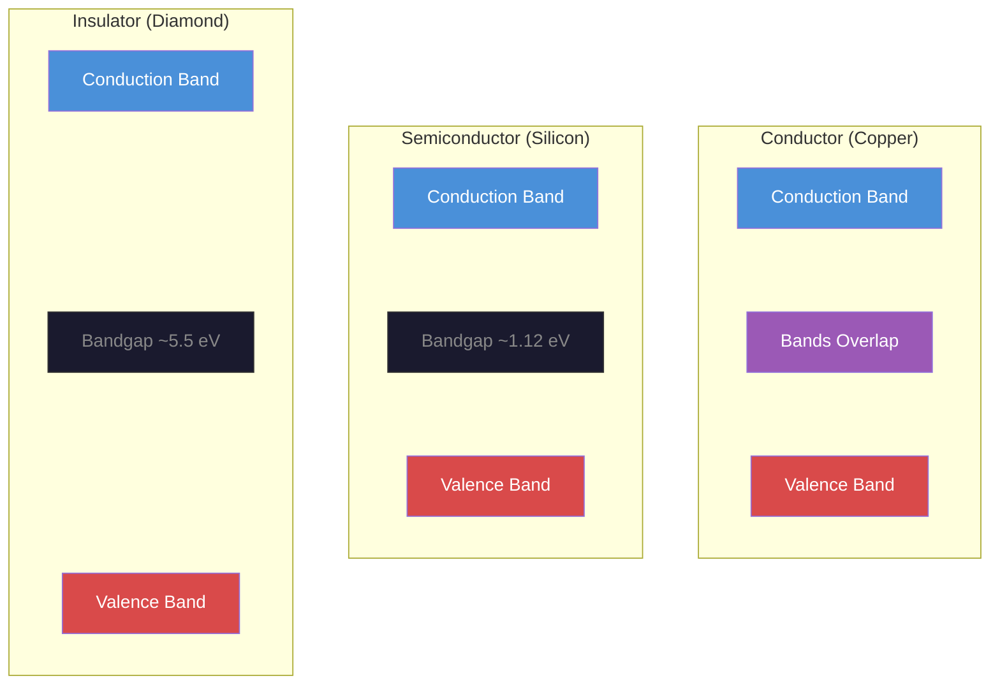
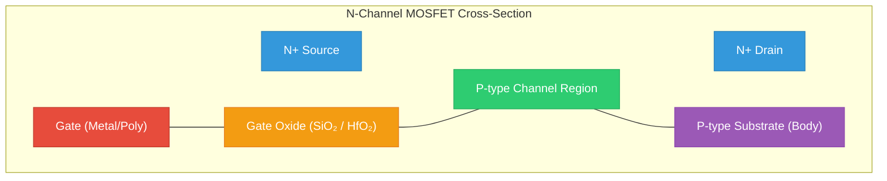
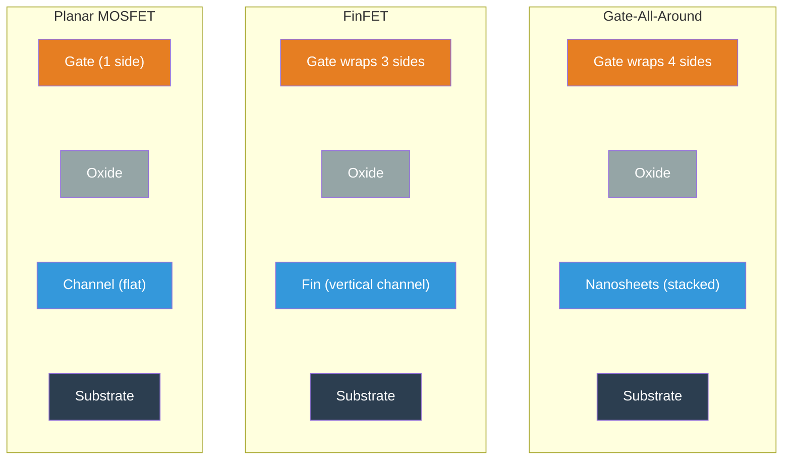
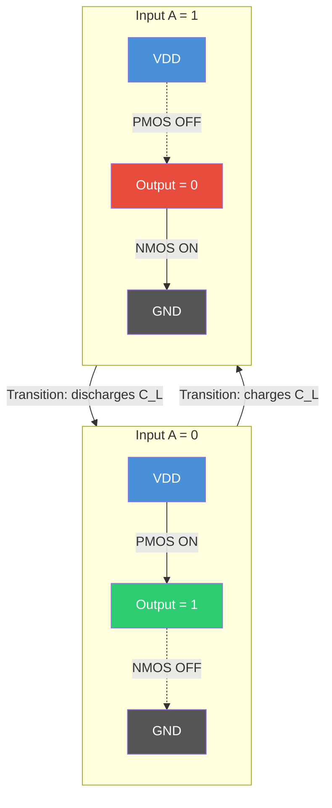

# Atoms, Electrons, and Semiconductors

Every computation your laptop has ever performed — every pixel rendered, every neural network inference, every encrypted transaction — reduces to electrons moving through carefully engineered crystals of silicon. Before we can build a processor, we need to understand why silicon conducts electricity the way it does, how we exploit that behavior to build switches, and what physical limits constrain the machines we design. This lecture takes you from atomic physics to the transistors inside a modern 3nm chip.

## Band Theory and the Semiconductor Miracle

### Why Silicon?

Silicon sits in Group IV of the periodic table: four valence electrons, forming a diamond cubic crystal lattice where each atom covalently bonds with four neighbors. At absolute zero, every electron is locked in a bond. No free carriers, no conduction. Silicon is an insulator.

But here is what makes silicon remarkable: the energy gap between the **valence band** (where electrons are bound) and the **conduction band** (where electrons are free to move) is just 1.12 eV at room temperature. Compare this to diamond (5.47 eV, an insulator) or germanium (0.67 eV, too leaky). Silicon's bandgap is in a sweet spot — small enough that thermal energy at room temperature ($kT \approx 0.026$ eV) frees a modest number of carriers, but large enough that we can control conduction precisely.

The intrinsic carrier concentration at room temperature is:

$$n_i \approx 1.5 \times 10^{10} \text{ cm}^{-3}$$

This sounds like a lot, but pure silicon has $5 \times 10^{22}$ atoms per cubic centimeter. So only about one in every $3 \times 10^{12}$ atoms contributes a free electron at room temperature. That is not enough for useful conduction. We need **doping**.

### Doping: Engineering the Carrier Population

**N-type doping** replaces a silicon atom with a Group V element — phosphorus, arsenic, or antimony. The extra valence electron has no covalent bond to fill, so it sits just below the conduction band (the donor energy level is only ~0.045 eV below for phosphorus). At room temperature, nearly every donor atom ionizes. If we dope at $N_D = 10^{17} \text{ cm}^{-3}$, we get roughly $10^{17}$ free electrons per cubic centimeter — seven orders of magnitude more than intrinsic silicon.

**P-type doping** substitutes a Group III element — boron, gallium, or indium. The missing electron creates a **hole**: a positively charged vacancy in the valence band that moves through the crystal as neighboring electrons fill it. Doping at $N_A = 10^{17} \text{ cm}^{-3}$ produces $10^{17}$ holes per cubic centimeter.

The Fermi potential, which describes where the Fermi level sits relative to the intrinsic level, is:

$$\phi_F \approx \frac{kT}{q} \ln\left(\frac{N_A}{n_i}\right)$$

For $N_A = 10^{17}$ and $n_i = 1.5 \times 10^{10}$, we get $\phi_F \approx 0.026 \times \ln(6.67 \times 10^6) \approx 0.41$ V. This number shows up directly in the threshold voltage equation of a MOSFET.

The key insight: by controlling the type and concentration of dopants, we turn silicon from a mediocre conductor into a material whose conductivity we can engineer with extraordinary precision. This is the foundation of every transistor.

## The MOSFET: A Voltage-Controlled Switch

### Structure and Operation

The **Metal-Oxide-Semiconductor Field-Effect Transistor** (MOSFET) is the fundamental building block of all digital logic. An NMOS transistor consists of:

- A **p-type substrate** (the body)
- Two heavily-doped **n-type regions** (source and drain)
- A thin **gate oxide** (SiO$_2$ or high-k dielectric like HfO$_2$) insulating the gate from the channel
- A **gate electrode** (polysilicon or metal) on top of the oxide

When the gate-to-source voltage $V_{GS}$ is below the **threshold voltage** $V_{th}$, the region between source and drain remains p-type. No current flows — the transistor is OFF.

When $V_{GS}$ exceeds $V_{th}$, the electric field from the gate repels holes from the surface of the substrate and attracts electrons, forming a thin **inversion layer** — a conductive n-type channel connecting source to drain. The transistor is ON.

Use the interactive simulation below to explore how $V_{GS}$ controls the channel formation and drain current. Try sweeping $V_{GS}$ from 0 to 1.8V and observe the transition from cutoff to saturation:

<Simulation id="mosfet" />

The threshold voltage with the body effect is:

$$V_{th} = V_{th0} + \gamma \left( \sqrt{|2\phi_F + V_{SB}|} - \sqrt{|2\phi_F|} \right)$$

where $V_{th0}$ is the zero-bias threshold (typically 0.3–0.7 V for modern processes), $\gamma$ is the body effect coefficient (0.3–0.5 $V^{1/2}$), and $V_{SB}$ is the source-to-body voltage. The body effect means that the threshold voltage *increases* when the source is at a higher potential than the body — a detail that matters for transistors stacked in series.

### The Drain Current Equations

Once the channel forms, current flows from drain to source. The behavior has two distinct regions.

**Linear (triode) region** — when $V_{DS} < V_{GS} - V_{th}$ (the channel extends fully from source to drain):

$$I_D = \mu_n C_{ox} \frac{W}{L} \left[ (V_{GS} - V_{th}) V_{DS} - \frac{V_{DS}^2}{2} \right]$$

For small $V_{DS}$, this simplifies to $I_D \approx \mu_n C_{ox} \frac{W}{L} (V_{GS} - V_{th}) V_{DS}$, and the transistor behaves as a voltage-controlled resistor with $R_{on} = \frac{1}{\mu_n C_{ox} (W/L)(V_{GS} - V_{th})}$.

**Saturation region** — when $V_{DS} \geq V_{GS} - V_{th}$ (the channel pinches off at the drain end):

$$I_D = \frac{1}{2} \mu_n C_{ox} \frac{W}{L} (V_{GS} - V_{th})^2 (1 + \lambda V_{DS})$$

Let us work through a concrete example with realistic parameters:

- $\mu_n = 400$ cm$^2$/V-s (electron mobility in channel)
- $C_{ox} = 1.7 \times 10^{-7}$ F/cm$^2$ (gate oxide capacitance per unit area)
- $W/L = 10$ (channel width-to-length ratio — the primary transistor sizing knob)
- $V_{GS} = 1.0$ V, $V_{th} = 0.4$ V, $\lambda = 0$ (ignoring channel-length modulation)

$$I_D = \frac{1}{2}(400)(1.7 \times 10^{-7})(10)(1.0 - 0.4)^2 = \frac{1}{2}(400)(1.7 \times 10^{-7})(10)(0.36) = 122 \text{ } \mu\text{A}$$

The product $k_n = \mu_n C_{ox}$ is called the **process transconductance parameter**, typically 50–200 $\mu$A/V$^2$ for older nodes, higher for modern short-channel devices. The ratio $W/L$ is the designer's primary lever: double it and you double the current. This is why layout matters — every transistor in a chip is sized deliberately.

Here is what is remarkable about this equation: current scales with the *square* of the overdrive voltage $(V_{GS} - V_{th})$ in saturation. This quadratic relationship is what gives CMOS its beautiful noise margins, but it also means that reducing $V_{th}$ to increase speed comes with a steep penalty in leakage current when the transistor should be off.

<ConceptCheck id="cc-1" />

### Modern Device Considerations

These "square-law" equations are the classical long-channel model from the 1960s. In modern devices at 7nm and below, the picture is more complicated:

- **Velocity saturation** makes $I_D$ more linear than quadratic in $(V_{GS} - V_{th})$ — carriers reach a maximum drift velocity (~$10^7$ cm/s) and cannot go faster regardless of field strength.
- **Drain-Induced Barrier Lowering (DIBL)** reduces $V_{th}$ as $V_{DS}$ increases — the drain field reaches into the channel and lowers the source-side barrier.
- **Quantum-mechanical effects** — carrier confinement in the thin inversion layer quantizes energy levels; tunneling through the gate oxide becomes significant below 3 nm thickness.

These effects are captured by industry-standard compact models like **BSIM-CMG** for FinFETs and GAA devices. But the classical equations remain essential for building intuition. Every circuit designer thinks in terms of $V_{GS} - V_{th}$, $W/L$, and the saturation/linear boundary.

## From Planar to FinFET to Gate-All-Around

### The Scaling Crisis

As gate lengths shrank below 30 nm, planar MOSFETs hit a wall: the gate could no longer control the channel effectively. The electric field from the drain punched through to the source (short-channel effects), leakage current skyrocketed, and $V_{th}$ became unreliable. The gate controls the channel from only one side — the top — and that is not enough when the channel is just a few dozen atoms wide.

### FinFET (2011–present)

Intel's 22nm process (2011) introduced the **FinFET**: instead of a flat channel, the silicon is etched into a thin vertical **fin**, and the gate wraps around three sides. This tripled the gate's electrostatic control over the channel, dramatically reducing leakage and short-channel effects.

TSMC's 3nm family (N3B, N3E, N3P, N3X) represents the pinnacle of FinFET technology. Key specifications for N3P:

- Contacted gate pitch: 48 nm
- Minimum metal pitch (M1): 23 nm
- Transistor density: ~224 MTr/mm$^2$ (real chip mix)
- Fin pitch: 26 nm
- SRAM cell area (HD): ~0.020 $\mu$m$^2$
- Performance vs. N5: +10–15% speed at iso-power, or -25–35% power at iso-speed

The Apple A17 Pro was the first chip on TSMC N3B (2023), packing roughly 19 billion transistors.

### Gate-All-Around (2022–present)

But even FinFET has limits. As fins get narrower, the three-sided gate loses control. The next step: **Gate-All-Around (GAA)** transistors, where the gate wraps completely around the channel — all four sides.

Samsung was first to ship GAA at 3nm (SF3E, June 2022), using their **MBCFET** (Multi-Bridge-Channel FET) architecture. TSMC transitions to GAA at the 2nm node (N2), with volume production starting late 2025.

**TSMC N2 specifications:**
- GAA nanosheet transistors: gate wraps fully around horizontal nanosheets
- Transistor density: ~350 MTr/mm$^2$ (estimated)
- +15% speed at iso-power vs. N3E, or -25–35% power at iso-speed
- Barrier-free tungsten wiring at MoL reduces gate contact resistance by 55%
- First fully functional CFET (complementary FET — NMOS stacked on PMOS) inverter demonstrated at 48 nm gate pitch (IEDM 2024)

**Intel 18A** pushes further: **RibbonFET** (Intel's GAA with four vertically stacked nanosheets) combined with **PowerVia** (backside power delivery). This is the first productized combination of GAA and BSPDN. PowerVia moves power wiring to the back of the wafer, freeing front-side metal layers for signal routing, providing an 8–10% density gain and significant IR-drop reduction. Intel 18A achieves ~238 MTr/mm$^2$ with +25% speed or -36% power vs. Intel 3. HVM began January 2026.

The competitive landscape as of early 2026:

| Node | Foundry | Architecture | Density (MTr/mm$^2$) | Production |
|------|---------|-------------|---------------------|------------|
| N3P  | TSMC    | FinFET      | ~224                | HVM 2024–25 |
| N2   | TSMC    | GAA nanosheet | ~350 (est.)       | HVM late 2025 |
| 18A  | Intel   | RibbonFET + PowerVia | ~238        | HVM 2026 |
| SF3  | Samsung | GAA MBCFET  | ~190                | HVM 2024 |

<ConceptCheck id="cc-2" />

## Moore's Law: Prediction, Reality, and Economics

In 1965, Gordon Moore observed that the number of transistors on an integrated circuit doubled approximately every year (revised to every two years in 1975). For decades, this exponential scaling delivered simultaneous improvements in speed, power, and cost per transistor.

**Current status**: transistor density continues to increase — TSMC N2 at ~350 MTr/mm$^2$ is roughly 1.5x N3E — but the cadence has slowed. A new node now takes 2–3 years rather than 18–24 months, and the cost per transistor has stopped declining at advanced nodes. A single N3 wafer costs over $20,000. The mask set for a 3nm chip exceeds $500 million.

Moore's Law has become an economic observation as much as a physical one. The question is no longer "can we make transistors smaller?" but "can we afford to?"

## CMOS Power: Where the Watts Go

Understanding power consumption is essential because it determines everything from battery life to data center cooling to clock frequency limits.

### Dynamic Power

$$P_{dynamic} = \alpha C_L V_{DD}^2 f$$

Every time a CMOS gate switches, it charges or discharges a load capacitance $C_L$ through the supply voltage $V_{DD}$. The switching activity factor $\alpha$ captures how often this happens:

- Clock signal: $\alpha = 1$ (transitions every cycle)
- Typical combinational logic: $\alpha \approx 0.1$–$0.3$
- Data bus with random data: $\alpha \approx 0.5$

Supply voltages by node: 7nm ~0.75 V, 5nm ~0.70–0.75 V, 3nm ~0.65–0.75 V, 2nm ~0.60–0.70 V (projected).

**Concrete example**: for a 3nm processor core at 4 GHz with $\alpha = 0.15$, $C_{total} = 10$ nF, $V_{DD} = 0.7$ V:

$$P_{dyn} = 0.15 \times 10 \times 10^{-9} \times (0.7)^2 \times 4 \times 10^9 = 2.94 \text{ W}$$

The critical insight: dynamic power scales with $V_{DD}^2$. Reduce the voltage by 30% and you cut dynamic power nearly in half. This is why voltage scaling has been the primary lever for power reduction. But below ~0.5 V, transistors become unreliable and slow.

### Static (Leakage) Power

$$P_{leakage} = V_{DD} \cdot I_{leakage}$$

Even when a transistor is "off," current leaks through it. The dominant mechanism is **subthreshold leakage**:

$$I_{sub} = I_0 \cdot e^{(V_{GS} - V_{th}) / (n \cdot V_T)} \cdot \left(1 - e^{-V_{DS}/V_T}\right)$$

where $V_T = kT/q \approx 26$ mV at room temperature and $n$ is the subthreshold swing coefficient (1.0–1.5).

This is an exponential. A 100 mV reduction in $V_{th}$ increases subthreshold leakage by roughly 10x. This is the fundamental tension in transistor design: lower $V_{th}$ gives faster switching but exponentially more leakage.

Leakage as a fraction of total chip power has been a roller coaster:

| Node | Leakage % | Architecture |
|------|-----------|-------------|
| 28nm | 30–40% | Planar (peak of the leakage crisis) |
| 16/14nm | 15–25% | FinFET (dramatically improved gate control) |
| 7nm | 20–30% | FinFET (leakage crept back up) |
| 5nm | 25–35% | FinFET (gate control weakening) |
| 3nm (FinFET) | 30–40% | FinFET nearing limits |
| 3nm (GAA) | 20–30% | GAA recovers control (Samsung SF3) |
| 2nm (GAA) | 20–30% | Further GAA improvements |

The transition from FinFET to GAA at 3nm/2nm is driven primarily by leakage control. Three-sided gate control is no longer sufficient; wrapping the gate around all four sides recovers the electrostatic control needed to keep leakage in check.

**Total chip power:**

$$P_{total} = \alpha C_L V_{DD}^2 f + P_{SC} + V_{DD} \cdot (I_{sub} + I_{gate} + I_{BTBT})$$

where $P_{SC}$ is the short-circuit (crowbar) power from momentary simultaneous conduction during transitions (5–15% of dynamic power), $I_{gate}$ is gate oxide tunneling leakage, and $I_{BTBT}$ is band-to-band tunneling at junctions.

<ConceptCheck id="cc-3" />

## Looking Ahead

We have covered the physics that makes computation possible: band theory, doping, MOSFET operation, the evolution from planar to GAA transistors, and the power equations that constrain every design decision.

In the next lecture, we will use these transistors to build logic gates — starting with the CMOS inverter and building up to NAND, NOR, and arbitrary Boolean functions. You will see how the complementary NMOS/PMOS pair creates the elegant pull-up/pull-down structure of CMOS, and why NAND gates are the universal building block of digital logic.

You will implement MOSFET current calculations and CMOS power analysis in Problem Set 1. Later in the course, when you build your logic simulator in Project 1, Milestone 1, you will model gate delays and power consumption using the equations from this lecture.

## References

1. Noam Nisan and Shimon Schocken, *The Elements of Computing Systems*, MIT Press. Chapter 1: Boolean Logic. Available at [nand2tetris.org](https://www.nand2tetris.org/).
2. MIT 6.004 Computation Structures, Unit 3: CMOS Technology. [computationstructures.org](https://computationstructures.org/).
3. Chenming Hu, *Modern Semiconductor Devices for Integrated Circuits*, Chapter 7: MOSFET. [Berkeley MOSFET notes](https://www.chu.berkeley.edu/wp-content/uploads/2020/01/Chenming-Hu_ch7.pdf).
4. TSMC N2 Technology details, IEDM 2024. [Tom's Hardware coverage](https://www.tomshardware.com/tech-industry/tsmc-shares-deep-dive-details-about-its-cutting-edge-2nm-process-node-at-iedm-2024-35-percent-less-power-or-15-percent-more-performance).
5. Intel 18A process technology. [Intel Foundry](https://www.intel.com/content/www/us/en/foundry/process/18a.html).
