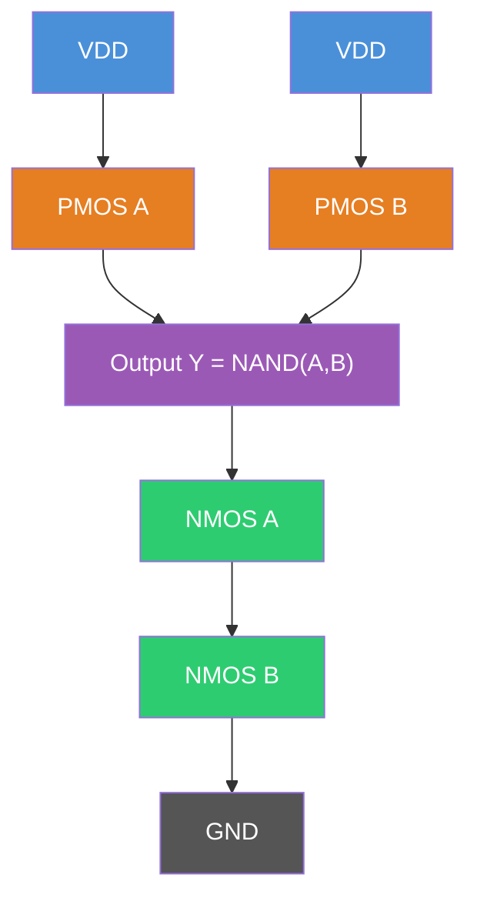
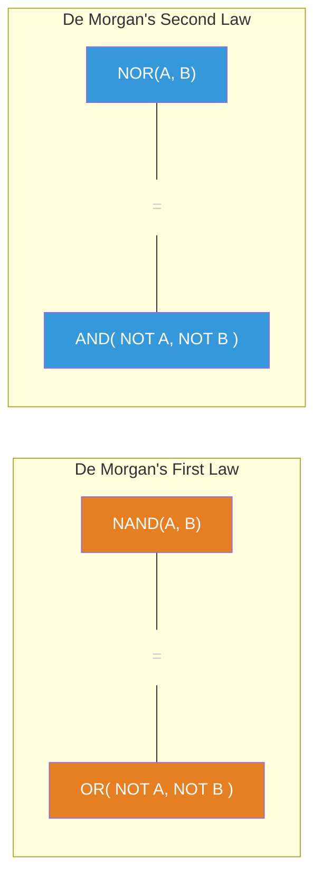
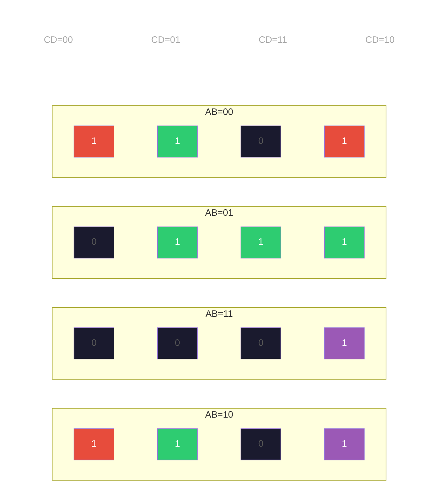
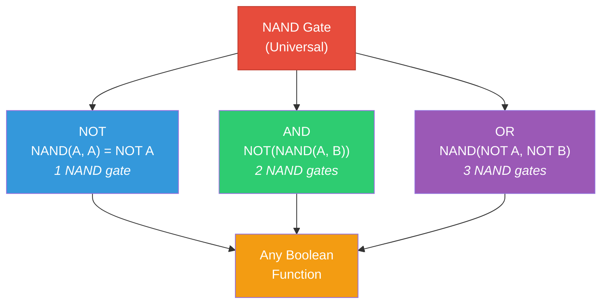

# Logic Gates from Transistors

In the last lecture, we saw that a MOSFET is a voltage-controlled switch: apply a voltage to the gate, and current flows between source and drain. Now we assemble these switches into **logic gates** — circuits that compute Boolean functions. By the end of this lecture, you will understand how transistors become gates, how gates implement any Boolean function, and why the NAND gate is the only gate you will ever need.

## The CMOS Inverter: Where It All Begins

### Circuit Structure

The CMOS inverter — the simplest and most important logic gate — uses two transistors: one NMOS and one PMOS.

```
        VDD
         |
      [PMOS]  ←── gate connected to input A
         |
         ├──── output Y
         |
      [NMOS]  ←── gate connected to input A
         |
        GND
```

The PMOS transistor sits between $V_{DD}$ (power supply) and the output. The NMOS transistor sits between the output and ground. Both gates are connected to the same input $A$.

### Tracing the Current Path

**When input A = 0 (low voltage, ~0 V):**
- NMOS: $V_{GS} = 0 - 0 = 0 < V_{th}$ → OFF. No path to ground.
- PMOS: $V_{GS} = 0 - V_{DD} = -V_{DD}$. For a PMOS, this means $|V_{GS}| = V_{DD} > |V_{th}|$ → ON. Current path from $V_{DD}$ through PMOS to output.
- Output Y = $V_{DD}$ = logic 1.

**When input A = 1 (high voltage, ~$V_{DD}$):**
- NMOS: $V_{GS} = V_{DD} - 0 = V_{DD} > V_{th}$ → ON. Path from output to ground.
- PMOS: $V_{GS} = V_{DD} - V_{DD} = 0$. For a PMOS, $|V_{GS}| = 0 < |V_{th}|$ → OFF. No path from $V_{DD}$.
- Output Y = 0 = logic 0.

This is an inverter: Y = NOT A = $\overline{A}$.

The beauty of CMOS: in **every valid logic state**, exactly one of the two transistors is on and the other is off. There is never a direct path from $V_{DD}$ to ground (except briefly during switching). This is why CMOS draws essentially zero static power in ideal conditions — a property that made it dominate over earlier NMOS-only logic, which always drew current for a logic-0 output.

Explore this concept with the interactive simulation below:

<Simulation id="cmos-inverter" />

### The CMOS Design Principle

Every CMOS gate follows the same template:

1. A **pull-up network** (PUN) of PMOS transistors connecting $V_{DD}$ to the output — ON when output should be 1
2. A **pull-down network** (PDN) of NMOS transistors connecting the output to ground — ON when output should be 0
3. The PUN and PDN are **complementary**: when one is conducting, the other is not

NMOS transistors are used in the pull-down network because electrons have higher mobility than holes (~2–3x), making NMOS faster at pulling outputs to ground. PMOS transistors pull up to $V_{DD}$. To equalize rise and fall times, PMOS transistors are typically made 2–3x wider than NMOS.

## CMOS NAND Gate

### Why NAND Topology Works

The 2-input CMOS NAND gate:

```
         VDD          VDD
          |             |
       [PMOS_A]     [PMOS_B]      ←── PMOS in PARALLEL
          |             |
          └──────┬──────┘
                 |
                 ├──── output Y
                 |
              [NMOS_A]               ←── NMOS in SERIES
                 |
              [NMOS_B]
                 |
                GND
```

**Pull-down network (NMOS):** Two NMOS transistors in **series**. Both must be ON (both inputs = 1) for a path from output to ground. Only when $A = 1$ AND $B = 1$ does the output get pulled to 0.

**Pull-up network (PMOS):** Two PMOS transistors in **parallel**. Either being ON (either input = 0) creates a path from $V_{DD}$ to output. If $A = 0$ OR $B = 0$, the output is pulled to 1.



| A | B | NMOS_A | NMOS_B | PDN | PMOS_A | PMOS_B | PUN | Y |
|---|---|--------|--------|-----|--------|--------|-----|---|
| 0 | 0 | OFF | OFF | Open | ON | ON | Connected | 1 |
| 0 | 1 | OFF | ON | Open | ON | OFF | Connected | 1 |
| 1 | 0 | ON | OFF | Open | OFF | ON | Connected | 1 |
| 1 | 1 | ON | ON | Connected | OFF | OFF | Open | 0 |

This is $Y = \overline{A \cdot B}$ — the NAND function. Output is 0 only when both inputs are 1.

Note the duality: **NMOS in series ↔ PMOS in parallel**, and vice versa. This is a direct consequence of the complementary requirement. If the pull-down uses NMOS in series (AND logic), the pull-up must use PMOS in parallel (OR logic) to ensure exactly one network conducts in every input state.

## CMOS NOR Gate

The NOR gate is the **dual** of NAND:

```
              VDD
               |
            [PMOS_A]               ←── PMOS in SERIES
               |
            [PMOS_B]
               |
               ├──── output Y
               |
       ┌───────┴───────┐
       |               |
    [NMOS_A]       [NMOS_B]        ←── NMOS in PARALLEL
       |               |
      GND             GND
```

**PDN:** NMOS in **parallel** — if either input is 1, there is a path to ground.
**PUN:** PMOS in **series** — both inputs must be 0 for the path from $V_{DD}$.

$Y = \overline{A + B}$ — output is 1 only when both inputs are 0.

**Speed consideration:** NAND gates are generally faster than NOR gates. In a NAND, PMOS transistors are in parallel (lower resistance) and NMOS in series. In a NOR, PMOS transistors are in series. Since PMOS is already ~2–3x slower than NMOS (lower hole mobility), stacking PMOS in series compounds the problem. The logical effort of a 2-input NOR is 5/3, compared to 4/3 for a 2-input NAND. This is why NAND-based logic is preferred in most designs.

<ConceptCheck id="cc-1" />

## Boolean Algebra: The Mathematics of Logic

### Axioms and Fundamental Theorems

Boolean algebra operates on a set $\{0, 1\}$ with three operations: AND ($\cdot$), OR ($+$), and NOT ($\overline{\phantom{X}}$).

**Axioms:**
1. Closure: $a \cdot b \in \{0, 1\}$ and $a + b \in \{0, 1\}$
2. Identity: $a \cdot 1 = a$, $a + 0 = a$
3. Complement: $a \cdot \overline{a} = 0$, $a + \overline{a} = 1$
4. Commutativity: $a \cdot b = b \cdot a$, $a + b = b + a$
5. Distributivity: $a \cdot (b + c) = a \cdot b + a \cdot c$, $a + (b \cdot c) = (a + b) \cdot (a + c)$

Note that the second distributive law — $a + (b \cdot c) = (a + b) \cdot (a + c)$ — has no analog in ordinary algebra. Verify it by trying all eight combinations of $a, b, c$.

**Key theorems** (derivable from axioms):
- Idempotent: $a \cdot a = a$, $a + a = a$
- Null: $a \cdot 0 = 0$, $a + 1 = 1$
- Absorption: $a + a \cdot b = a$, $a \cdot (a + b) = a$
- Consensus: $a \cdot b + \overline{a} \cdot c + b \cdot c = a \cdot b + \overline{a} \cdot c$

### De Morgan's Laws

These are the most important theorems in digital design:

$$\overline{A \cdot B} = \overline{A} + \overline{B}$$
$$\overline{A + B} = \overline{A} \cdot \overline{B}$$

**Proof of the first law** (by perfect induction):

| A | B | $A \cdot B$ | $\overline{A \cdot B}$ | $\overline{A}$ | $\overline{B}$ | $\overline{A} + \overline{B}$ |
|---|---|------------|----------------------|----------------|----------------|------------------------------|
| 0 | 0 | 0 | 1 | 1 | 1 | 1 |
| 0 | 1 | 0 | 1 | 1 | 0 | 1 |
| 1 | 0 | 0 | 1 | 0 | 1 | 1 |
| 1 | 1 | 1 | 0 | 0 | 0 | 0 |

Columns 4 and 7 are identical. QED.

**Algebraic proof:** Let $x = \overline{A \cdot B}$ and $y = \overline{A} + \overline{B}$. We need to show $x = y$.

By the complement axiom, the complement of any element $z$ is the unique element $z'$ such that $z \cdot z' = 0$ and $z + z' = 1$. If we can show that $y$ is the complement of $A \cdot B$, then $y = x = \overline{A \cdot B}$.

Check: $(A \cdot B) \cdot (\overline{A} + \overline{B}) = A \cdot B \cdot \overline{A} + A \cdot B \cdot \overline{B} = 0 \cdot B + A \cdot 0 = 0$. ✓

Check: $(A \cdot B) + (\overline{A} + \overline{B}) = (A \cdot B + \overline{A}) + \overline{B} = (A + \overline{A}) \cdot (B + \overline{A}) + \overline{B} = B + \overline{A} + \overline{B} = \overline{A} + 1 = 1$. ✓

Since the complement is unique, $\overline{A \cdot B} = \overline{A} + \overline{B}$.

De Morgan's laws generalize to $n$ variables: $\overline{X_1 \cdot X_2 \cdots X_n} = \overline{X_1} + \overline{X_2} + \cdots + \overline{X_n}$. In circuit terms: a NAND gate is equivalent to an OR gate with inverted inputs. A NOR gate is equivalent to an AND gate with inverted inputs.



<ConceptCheck id="cc-2" />

## Karnaugh Maps: Visual Minimization

### The Problem

Given a Boolean function as a truth table or sum-of-products expression, find the simplest equivalent expression. This matters in hardware because fewer terms means fewer gates, less area, less power, and less delay.

### 2-Variable K-map

For function $F(A, B)$, arrange the truth table as a 2x2 grid where adjacent cells differ in exactly one variable:

```
        B=0   B=1
  A=0 | F00 | F01 |
  A=1 | F10 | F11 |
```

Group adjacent 1s into rectangles of size $2^k$. Each group eliminates $k$ variables.

**Example:** $F(A, B) = \overline{A}B + AB = B$ (the variable $A$ is eliminated because the group spans both $A=0$ and $A=1$).

### 3-Variable K-map

For $F(A, B, C)$, use a 2x4 grid with Gray code ordering:

```
         BC=00  BC=01  BC=11  BC=10
   A=0 |  F0  |  F1  |  F3  |  F2  |
   A=1 |  F4  |  F5  |  F7  |  F6  |
```

Note the column order: 00, 01, 11, 10 (not 00, 01, 10, 11). This Gray code ordering ensures that adjacent cells differ in exactly one variable. The map also wraps around: the leftmost column is adjacent to the rightmost.

### 4-Variable K-map

For $F(A, B, C, D)$, a 4x4 grid:

```
            CD=00  CD=01  CD=11  CD=10
   AB=00 |  F0  |  F1  |  F3  |  F2  |
   AB=01 |  F4  |  F5  |  F7  |  F6  |
   AB=11 | F12  | F13  | F15  | F14  |
   AB=10 |  F8  |  F9  | F11  | F10  |
```

**Grouping rules:**
1. Groups must be rectangles of size 1, 2, 4, 8, or 16 (powers of 2)
2. Groups may wrap around edges (left↔right, top↔bottom)
3. Every 1 must be covered by at least one group
4. Make groups as large as possible (larger groups = simpler terms)
5. Use the fewest groups necessary

**Don't care conditions** ($X$ or $d$): outputs that are undefined for certain input combinations (because those inputs never occur, or we do not care about the output). Don't cares can be treated as either 0 or 1 to make groups larger.

**Worked example:** Minimize $F(A,B,C,D) = \sum m(0, 1, 2, 5, 6, 7, 8, 9, 10, 14)$

```
            CD=00  CD=01  CD=11  CD=10
   AB=00 |  1   |  1   |  0   |  1   |
   AB=01 |  0   |  1   |  1   |  1   |
   AB=11 |  0   |  0   |  0   |  1   |
   AB=10 |  1   |  1   |  0   |  1   |
```

Groups: $\overline{B}\overline{D}$ (4 corners wrapping), $\overline{A}C$ (middle columns, rows 0-1), $\overline{B}\overline{C}$ (column 00, rows 0 and 2 wrapping). Minimized: $F = \overline{B}\overline{D} + \overline{A}C + CD\overline{A}$... In practice you would verify each grouping carefully. The point is that K-maps leverage human visual pattern matching to find minimal covers.



## NAND is Universal: The Single Gate That Does Everything

A gate is **universal** (or **functionally complete**) if every Boolean function can be implemented using only that gate. NAND is universal. Here is the proof by construction:

### Deriving NOT from NAND

Connect both inputs of a NAND gate together:

$$\text{NAND}(A, A) = \overline{A \cdot A} = \overline{A}$$

One NAND gate gives us NOT.

### Deriving AND from NAND

An AND gate is a NAND followed by NOT:

$$A \cdot B = \overline{\overline{A \cdot B}} = \text{NOT}(\text{NAND}(A, B)) = \text{NAND}(\text{NAND}(A, B), \text{NAND}(A, B))$$

Two NAND gates give us AND.

### Deriving OR from NAND

By De Morgan's law: $A + B = \overline{\overline{A} \cdot \overline{B}} = \text{NAND}(\overline{A}, \overline{B})$

$$A + B = \text{NAND}(\text{NAND}(A, A), \text{NAND}(B, B))$$

Three NAND gates give us OR.

Since NOT, AND, and OR are sufficient to express any Boolean function (any function can be written in sum-of-products form), and all three can be built from NAND alone, NAND is universal.



**Why this matters in practice:** Real chip designs use standard cell libraries containing pre-characterized NAND, NOR, and INV cells in various drive strengths. But the universality of NAND means that, in principle, you could build an entire processor from one type of gate. The Nand2Tetris course by Nisan and Schocken does exactly this — building a complete computer starting from NAND gates.

NOR is also universal (by dual arguments). AND alone is NOT universal (you cannot create NOT from AND). OR alone is not universal either.

Explore this concept with the interactive simulation below:

<Simulation id="logic-gates" />

<ConceptCheck id="cc-3" />

## Bitwise Operations: Boolean Algebra in Software

In C and Python, bitwise operators apply Boolean operations to each bit position independently:

| Operation | C | Python | Truth |
|-----------|---|--------|-------|
| AND | `a & b` | `a & b` | 1 only if both bits are 1 |
| OR | `a \| b` | `a \| b` | 1 if either bit is 1 |
| XOR | `a ^ b` | `a ^ b` | 1 if bits differ |
| NOT | `~a` | `~a` | Flip all bits |
| Left shift | `a << n` | `a << n` | Multiply by $2^n$ |
| Right shift | `a >> n` | `a >> n` | Divide by $2^n$ (arithmetic for signed) |

**Practical applications:**

```python
# Set bit k in a word
def set_bit(word: int, k: int) -> int:
    return word | (1 << k)

# Clear bit k
def clear_bit(word: int, k: int) -> int:
    return word & ~(1 << k)

# Toggle bit k
def toggle_bit(word: int, k: int) -> int:
    return word ^ (1 << k)

# Test if bit k is set
def test_bit(word: int, k: int) -> bool:
    return bool(word & (1 << k))

# Count set bits (population count)
def popcount(x: int) -> int:
    count = 0
    while x:
        count += x & 1
        x >>= 1
    return count
```

Bitwise operations are fundamental to systems programming: flags, permissions, masks, hash functions, error detection, compression — they appear everywhere. You will use them extensively in Problem Set 1 and throughout this course.

## Summary

We have built the bridge from physics to logic:

1. **CMOS inverter**: PMOS pull-up + NMOS pull-down, complementary switching, near-zero static power
2. **NAND gate**: NMOS series (AND in pull-down) + PMOS parallel (OR in pull-up)
3. **NOR gate**: dual of NAND (NMOS parallel + PMOS series)
4. **Boolean algebra**: axioms, De Morgan's laws, K-map minimization
5. **NAND universality**: NOT, AND, OR all derivable from NAND alone
6. **Bitwise operators**: Boolean algebra applied bit-by-bit in software

In Project 1, Milestone 1, you will implement a gate-level logic simulator that models NAND, NOR, NOT, AND, OR, and XOR gates using the CMOS principles from this lecture. You will represent logic values, connect gates into circuits, and simulate propagation delays.

## References

1. Noam Nisan and Shimon Schocken, *The Elements of Computing Systems*, Chapter 1: Boolean Logic. [nand2tetris.org](https://www.nand2tetris.org/).
2. MIT 6.004 Computation Structures, Units 2–4: Digital Abstraction, CMOS Technology, Combinational Logic. [computationstructures.org](https://computationstructures.org/).
3. Maurice Karnaugh, "The Map Method for Synthesis of Combinational Logic Circuits," *Transactions of the AIEE*, 1953.
4. Ivan Sutherland, Bob Sproull, and David Harris, *Logical Effort: Designing Fast CMOS Circuits*, Morgan Kaufmann, 1999.
