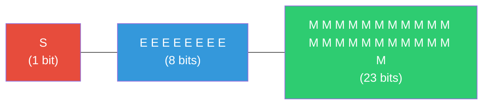
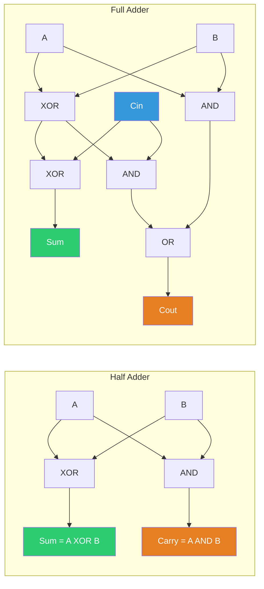
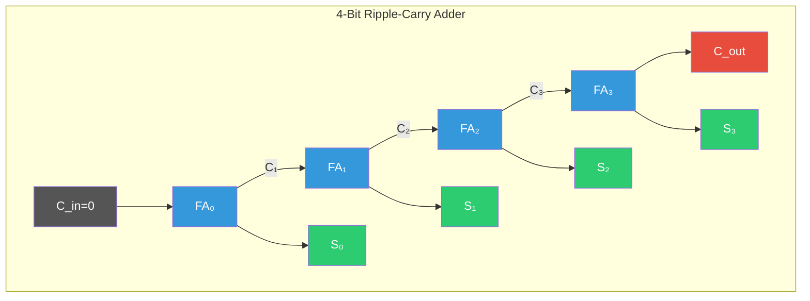
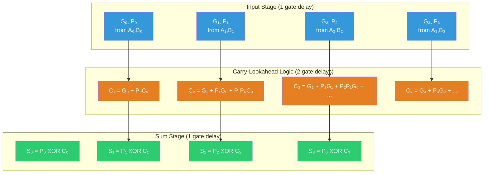

# Arithmetic Circuits

Last week we built logic gates from transistors. This week we use those gates to perform arithmetic — the core operation of every processor. We will derive adder circuits from truth tables, confront the speed limitations of the naive approach, solve them with mathematical elegance via carry-lookahead, and then tackle the representation of numbers themselves, including the intricate machinery of IEEE 754 floating point.

## Number Representation

### Unsigned Integers

An $n$-bit unsigned integer represents values from 0 to $2^n - 1$:

$$V = \sum_{i=0}^{n-1} b_i \cdot 2^i$$

where $b_i \in \{0, 1\}$ is the bit at position $i$. An 8-bit unsigned integer ranges from 0 to 255. A 32-bit unsigned integer ranges from 0 to 4,294,967,295 ($\approx 4.3 \times 10^9$).

### Sign-Magnitude

The simplest approach to signed numbers: reserve the MSB as a sign bit (0 = positive, 1 = negative), and use the remaining $n-1$ bits for the magnitude. An 8-bit sign-magnitude number ranges from $-127$ to $+127$.

**Problems with sign-magnitude:**
1. Two representations of zero: $+0 = 00000000$ and $-0 = 10000000$
2. Addition requires comparing signs and magnitudes before deciding whether to add or subtract
3. Hardware for sign-magnitude addition is significantly more complex than unsigned addition

These problems led to a far more elegant solution.

### Two's Complement

In two's complement, the MSB has *negative* weight:

$$V = -b_{n-1} \cdot 2^{n-1} + \sum_{i=0}^{n-2} b_i \cdot 2^i$$

An 8-bit two's complement number ranges from $-128$ ($10000000$) to $+127$ ($01111111$).

**Why two's complement works for subtraction:** Consider $A - B$. In two's complement, $-B = \overline{B} + 1$ (flip all bits and add 1). So $A - B = A + \overline{B} + 1$. This means we can perform subtraction using the same adder hardware as addition — we just invert $B$ and set the carry-in to 1.

**Proof that the negation formula works:** For an $n$-bit number $B$, $B + \overline{B} = 111\ldots1_2 = 2^n - 1$ (every bit position has exactly one 1). Therefore $\overline{B} = 2^n - 1 - B$, and $\overline{B} + 1 = 2^n - B$. In modular arithmetic with $n$ bits (where $2^n \equiv 0$), this gives $\overline{B} + 1 \equiv -B \pmod{2^n}$.

**Important edge case:** The most negative number ($-2^{n-1}$, represented as $100\ldots0$) has no positive counterpart in the same bit width. Negating it produces itself:

$$-(-128) = \overline{10000000} + 1 = 01111111 + 1 = 10000000 = -128$$

This is an overflow — the result $+128$ cannot be represented in 8-bit two's complement.

## IEEE 754 Floating Point

### The Representation

Floating-point numbers use scientific notation in binary:

$$\text{value} = (-1)^s \times 2^{(E - \text{bias})} \times (1.M)$$

where $s$ is the sign bit, $E$ is the stored (biased) exponent, $M$ is the stored mantissa (also called significand), and the "1." is the implicit leading bit for normalized numbers.

### Single Precision (binary32): The Full Breakdown



A 32-bit float has three fields:

| Field | Bits | Position |
|-------|------|----------|
| Sign ($s$) | 1 | bit 31 |
| Exponent ($E$) | 8 | bits 30–23 |
| Mantissa ($M$) | 23 | bits 22–0 |

The **bias** is 127. The true exponent is $e = E - 127$, ranging from $-126$ to $+127$ (since $E = 0$ and $E = 255$ are reserved for special values).

**Precision:** 24 significant bits (23 stored + 1 implicit), giving approximately 7.2 decimal digits of precision.

**Ranges:**
- Smallest normalized positive: $1.0 \times 2^{-126} \approx 1.175 \times 10^{-38}$
- Largest normalized: $(2 - 2^{-23}) \times 2^{127} \approx 3.403 \times 10^{38}$
- Machine epsilon: $\varepsilon = 2^{-23} \approx 1.192 \times 10^{-7}$

**Worked example:** What float does the bit pattern `0 10000010 10100000000000000000000` represent?

- Sign: $s = 0$ (positive)
- Exponent: $E = 10000010_2 = 130$, so $e = 130 - 127 = 3$
- Mantissa: $M = 1.101_2 = 1 + 0.5 + 0.125 = 1.625$
- Value: $(-1)^0 \times 2^3 \times 1.625 = 8 \times 1.625 = 13.0$

### Double Precision (binary64)

| Field | Bits | Bias |
|-------|------|------|
| Sign | 1 | — |
| Exponent | 11 | 1023 |
| Mantissa | 52 | — |

Precision: 53 significant bits ($\approx 15.9$ decimal digits). Range: $\pm 2^{-1022}$ to $\pm (2 - 2^{-52}) \times 2^{1023} \approx \pm 1.798 \times 10^{308}$.

### Special Values: The Details That Matter

| Exponent $E$ | Mantissa $M$ | Value | Meaning |
|--------------|-------------|-------|---------|
| 0 | 0 | $\pm 0$ | Signed zeros (sign bit distinguishes) |
| 0 | $\neq 0$ | $\pm 0.M \times 2^{-126}$ | Denormalized (subnormal) |
| 1–254 | any | $\pm 1.M \times 2^{E-127}$ | Normalized |
| 255 | 0 | $\pm \infty$ | Infinity |
| 255 | $\neq 0$ | NaN | Not a Number |

**Denormalized (subnormal) numbers** fill the gap between zero and the smallest normalized number. The implicit leading bit is 0 instead of 1, and the exponent is fixed at $2^{1-\text{bias}}$:

$$\text{value} = (-1)^s \times 0.M \times 2^{1 - \text{bias}}$$

The smallest denorm in single precision is $2^{-149} \approx 1.401 \times 10^{-45}$. Without denormals, there would be an abrupt jump from zero to $2^{-126}$ — a gap of 23 orders of magnitude. Denormals provide **gradual underflow**, which is important for numerical stability.

**NaN (Not a Number):** Produced by undefined operations like $0/0$, $\infty - \infty$, $\infty \times 0$, $\sqrt{x}$ where $x < 0$. The crucial property: $\text{NaN} \neq \text{NaN}$. This is the standard way to test for NaN in C: `if (x != x)`.

**Negative zero:** $+0 = -0$ in comparisons, but $1/+0 = +\infty$ while $1/-0 = -\infty$. Negative zero preserves the sign of an underflowed result.

Explore this concept with the interactive simulation below:

<Simulation id="float-ieee754" />

<ConceptCheck id="cc-1" />

## Adder Circuits: From Gates to Arithmetic

### Half Adder

A half adder adds two single bits $A$ and $B$:

| A | B | Sum | Carry |
|---|---|-----|-------|
| 0 | 0 | 0   | 0     |
| 0 | 1 | 1   | 0     |
| 1 | 0 | 1   | 0     |
| 1 | 1 | 0   | 1     |

From the truth table:
- $\text{Sum} = A \oplus B$ (XOR)
- $\text{Carry} = A \cdot B$ (AND)

Two gates. But a half adder cannot handle a carry-in from a previous stage — it only adds two bits.

### Full Adder

A full adder adds three bits: $A$, $B$, and carry-in $C_{in}$:

| A | B | $C_{in}$ | Sum | $C_{out}$ |
|---|---|----------|-----|-----------|
| 0 | 0 | 0 | 0 | 0 |
| 0 | 0 | 1 | 1 | 0 |
| 0 | 1 | 0 | 1 | 0 |
| 0 | 1 | 1 | 0 | 1 |
| 1 | 0 | 0 | 1 | 0 |
| 1 | 0 | 1 | 0 | 1 |
| 1 | 1 | 0 | 0 | 1 |
| 1 | 1 | 1 | 1 | 1 |

From the truth table:
$$\text{Sum} = A \oplus B \oplus C_{in}$$
$$C_{out} = A \cdot B + C_{in} \cdot (A \oplus B)$$

The carry-out equation says: a carry is generated either when both $A$ and $B$ are 1 ($A \cdot B$, the **generate** term), or when exactly one of $A, B$ is 1 and there is an incoming carry ($C_{in} \cdot (A \oplus B)$, the **propagate** term). This generate/propagate decomposition is the foundation of fast adders.

A full adder can be built from two half adders and an OR gate.

Explore this concept with the interactive simulation below:

<Simulation id="half-adder" />



### Ripple-Carry Adder

To add two $n$-bit numbers, chain $n$ full adders together, connecting the carry-out of stage $i$ to the carry-in of stage $i+1$:

```
  A[0] B[0]    A[1] B[1]    A[2] B[2]    A[3] B[3]
    |   |        |   |        |   |        |   |
   [FA_0]  -->  [FA_1]  -->  [FA_2]  -->  [FA_3]
    |  |         |  |         |  |         |  |
  S[0] C0-->C1 S[1] C1-->C2 S[2] C2-->C3 S[3] C3=Cout
```



**The problem:** The carry ripples through all $n$ stages sequentially. Each full adder has a delay of roughly 2 gate delays for the carry path. For an $n$-bit ripple-carry adder:

$$t_{RCA} = n \times t_{carry} \approx 2n \text{ gate delays}$$

For a 64-bit adder, that is ~128 gate delays. At 5 ps per gate (3nm process), this is ~640 ps — too slow for a single clock cycle at 4 GHz (~250 ps). We need something faster.

<ConceptCheck id="cc-2" />

## Carry-Lookahead Adder: Breaking the Chain

### The Key Insight

Instead of waiting for carries to ripple, compute all carries *simultaneously* from the inputs. Define for each bit position $i$:

$$G_i = A_i \cdot B_i \quad \text{(Generate: position } i \text{ produces a carry regardless of } C_{in}\text{)}$$

$$P_i = A_i \oplus B_i \quad \text{(Propagate: position } i \text{ passes through an incoming carry)}$$

The carry recurrence is:

$$C_{i+1} = G_i + P_i \cdot C_i$$

In a ripple-carry adder, this recurrence forms a chain. The carry-lookahead adder breaks the chain by **expanding** the recurrence:

### Full Derivation for 4 Bits

Starting from $C_1 = G_0 + P_0 C_0$:

$$C_2 = G_1 + P_1 C_1 = G_1 + P_1(G_0 + P_0 C_0) = G_1 + P_1 G_0 + P_1 P_0 C_0$$

$$C_3 = G_2 + P_2 C_2 = G_2 + P_2 G_1 + P_2 P_1 G_0 + P_2 P_1 P_0 C_0$$

$$C_4 = G_3 + P_3 C_3 = G_3 + P_3 G_2 + P_3 P_2 G_1 + P_3 P_2 P_1 G_0 + P_3 P_2 P_1 P_0 C_0$$

**The critical observation:** every carry $C_i$ depends only on $G_j$, $P_j$ for $j < i$, and the initial carry-in $C_0$. All $G_i$ and $P_i$ values are computed in **1 gate delay** (one AND and one XOR from $A_i$, $B_i$). Then all carries can be computed in parallel in **2 more gate delays** (one AND level, one OR level).

The sum bits are: $S_i = P_i \oplus C_i$, taking 1 more gate delay.

**Total for a 4-bit CLA: 4 gate delays** (vs. 8 for ripple-carry).



### Hierarchical CLA: Scaling to 64 Bits

A single-level 4-bit CLA does not scale — the equations for $C_{64}$ would have 65 terms. Instead, we build a **hierarchy** using group generate and group propagate signals.

For a block spanning positions $[i:j]$:

$$G_{i:j} = G_j + P_j \cdot G_{j-1} + P_j P_{j-1} \cdot G_{j-2} + \cdots + P_j P_{j-1} \cdots P_{i+1} \cdot G_i$$

$$P_{i:j} = P_j \cdot P_{j-1} \cdots P_i$$

The key property: these compose **associatively**. For two adjacent groups $[i:k]$ and $[k+1:j]$:

$$G_{i:j} = G_{k+1:j} + P_{k+1:j} \cdot G_{i:k}$$

$$P_{i:j} = P_{k+1:j} \cdot P_{i:k}$$

This associativity enables a **prefix tree** structure. The Kogge-Stone adder achieves minimum depth $\log_2 n$ with area $O(n \log n)$. The Brent-Kung adder trades depth for area: $2\log_2 n - 1$ depth with only $O(n)$ area.

### Delay Comparison

| Adder | Carry Delay | Area | 64-bit Delays |
|-------|------------|------|---------------|
| Ripple-carry | $O(n)$ | $O(n)$ | ~128 |
| CLA (flat, 4-bit blocks) | $O(n/4)$ | $O(n)$ | ~32 |
| Kogge-Stone (prefix tree) | $O(\log n)$ | $O(n \log n)$ | ~14 |
| Brent-Kung (prefix tree) | $O(2\log n)$ | $O(n)$ | ~11+2 |

For a 64-bit addition, the Kogge-Stone prefix adder needs approximately 14 gate delays — roughly 9x faster than ripple-carry. At 5 ps per gate, that is ~70 ps, well within a clock cycle at 4 GHz.

<ConceptCheck id="cc-3" />

## Booth's Multiplication Algorithm

### The Problem with Naive Multiplication

Binary multiplication follows the same pencil-and-paper algorithm as decimal: shift-and-add. For an $n$-bit multiplier, we generate $n$ partial products (each the multiplicand shifted by $i$ positions, or zero). Summing them takes $O(n)$ additions, each $O(n)$ bits wide. Total: $O(n^2)$ work.

### Booth's Key Insight

Andrew Booth observed (1951) that runs of 1s in the multiplier can be replaced by a subtraction at the start and an addition at the end. The binary number $0111110_2 = 1000000_2 - 0000010_2$. Instead of five additions (for five consecutive 1s), we do one subtraction and one addition.

### The Algorithm (Radix-2)

Given multiplicand $M$ and multiplier $Q$ (both $n$-bit signed, two's complement):

1. Initialize: accumulator $A = 0$ ($n$ bits), $Q_{-1} = 0$ (an extra bit appended to the right of $Q$), counter $= n$
2. Examine the two least significant bits $(Q_0, Q_{-1})$:
   - `00` or `11`: do nothing (middle of a run of 0s or 1s)
   - `01`: $A = A + M$ (end of a run of 1s)
   - `10`: $A = A - M$ (start of a run of 1s)
3. **Arithmetic shift right** the combined $(A, Q, Q_{-1})$ register by 1 bit (preserving the sign of $A$)
4. Decrement counter. If counter $> 0$, go to step 2.
5. Result is in the combined $(A, Q)$ register.

### Worked Example: $5 \times (-3) = -15$

$M = 5 = 0101_2$, $Q = -3 = 1101_2$ (4-bit two's complement)

| Step | A | Q | $Q_{-1}$ | $Q_0 Q_{-1}$ | Action |
|------|---|---|----------|-------------|--------|
| Init | 0000 | 1101 | 0 | — | — |
| 1 | — | — | — | 10 | $A = A - M = 0000 - 0101 = 1011$ |
| | 1101 | 1110 | 1 | — | ASR |
| 2 | — | — | — | 01 | $A = A + M = 1101 + 0101 = 0010$ |
| | 0001 | 0111 | 0 | — | ASR |
| 3 | — | — | — | 10 | $A = A - M = 0001 - 0101 = 1100$ |
| | 1110 | 0011 | 1 | — | ASR |
| 4 | — | — | — | 11 | No operation |
| | 1111 | 0001 | 1 | — | ASR |

Result: $A \| Q = 11110001_2$. Interpreting as 8-bit two's complement: $-15_{10}$. Correct.

### Modified Booth's (Radix-4)

The radix-4 variant examines 3 bits at a time, halving the number of partial products from $n$ to $n/2$:

| $q_{2i+1}$ | $q_{2i}$ | $q_{2i-1}$ | Partial Product |
|-----------|---------|-----------|-----------------|
| 0 | 0 | 0 | $0$ |
| 0 | 0 | 1 | $+M$ |
| 0 | 1 | 0 | $+M$ |
| 0 | 1 | 1 | $+2M$ (left shift) |
| 1 | 0 | 0 | $-2M$ |
| 1 | 0 | 1 | $-M$ |
| 1 | 1 | 0 | $-M$ |
| 1 | 1 | 1 | $0$ |

Only multiples $\{0, \pm M, \pm 2M\}$ are needed — all trivial to compute ($2M$ is just a left shift). Combined with Wallace tree or Dadda tree partial product reduction, radix-4 Booth enables single-cycle multipliers in modern CPUs. A 64-bit multiplication with standard Booth needs 64 cycles; radix-4 needs only 32.

## Looking Ahead

We have covered the arithmetic foundation: number representation, IEEE 754 floating point, adder circuits from ripple-carry to carry-lookahead, and Booth's multiplication. In the next lecture, we will build on these components to design multiplexers, decoders, and a complete ALU — the circuit that performs all arithmetic and logical operations in a processor.

You will implement a carry-lookahead adder, an IEEE 754 decoder, and Booth's multiplier in Problem Set 2.

## References

1. IEEE Standard 754-2019, *IEEE Standard for Floating-Point Arithmetic*. [IEEE Xplore](https://ieeexplore.ieee.org/document/8766229).
2. Andrew D. Booth, "A Signed Binary Multiplication Technique," *The Quarterly Journal of Mechanics and Applied Mathematics*, 1951.
3. Peter M. Kogge and Harold S. Stone, "A Parallel Algorithm for the Efficient Solution of a General Class of Recurrence Equations," *IEEE Transactions on Computers*, 1973.
4. Richard P. Brent and H. T. Kung, "A Regular Layout for Parallel Adders," *IEEE Transactions on Computers*, 1982.
5. MIT 6.004 Computation Structures, Unit 4: Combinational Logic. [computationstructures.org](https://computationstructures.org/).
