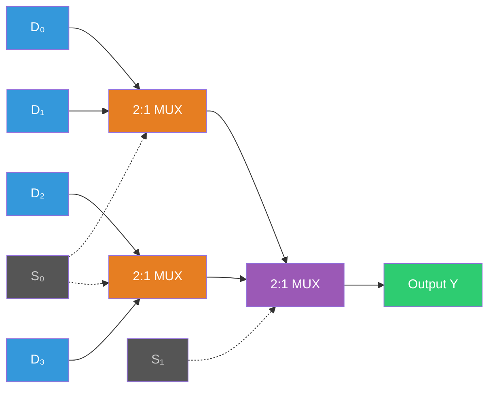
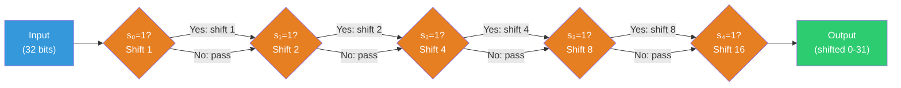
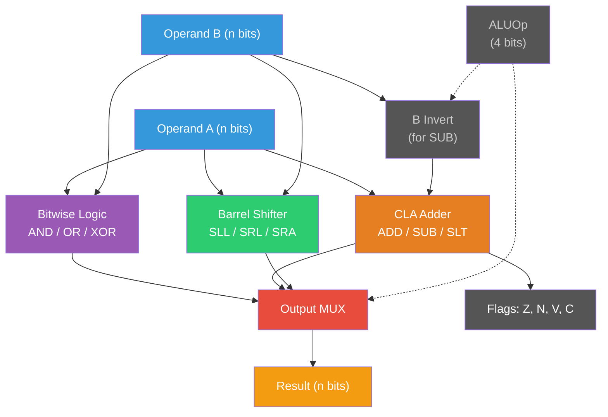

# Multiplexers, Decoders, and ALU Design

In the previous lecture, we built adders and learned how to represent numbers. Now we combine adders with logical operations, multiplexers, and control signals to construct the **Arithmetic Logic Unit (ALU)** — the computational heart of every processor. We will also cover the building blocks that route data through a processor: multiplexers and decoders.

## Multiplexers: Choosing Between Signals

### 2:1 Multiplexer

A multiplexer (MUX) selects one of several data inputs based on a selection signal. The simplest case — a 2:1 MUX — has two data inputs ($D_0$, $D_1$), one select input ($S$), and one output ($Y$):

$$Y = \overline{S} \cdot D_0 + S \cdot D_1$$

When $S = 0$, output $Y = D_0$. When $S = 1$, output $Y = D_1$.

**Gate-level implementation:**

```
  D0 ──┬──[AND]──┐
       |    |     │
  S ──[NOT]─┘     [OR]── Y
       |          │
  D1 ──┴──[AND]──┘
              |
  S ──────────┘
```

Three gates: one NOT, two AND, one OR. Or equivalently, 4 NAND gates (since the MUX function $\overline{S}D_0 + SD_1 = \text{NAND}(\text{NAND}(D_0, \overline{S}), \text{NAND}(D_1, S))$).

**Why multiplexers matter:** The MUX is the fundamental data-routing element in a processor. When the ALU needs to choose between an immediate value and a register value, it uses a MUX. When the program counter needs to choose between PC+4 and a branch target, it uses a MUX. A modern processor contains thousands of multiplexers.

### 4:1 Multiplexer

A 4:1 MUX has four data inputs ($D_0$ through $D_3$) and two select lines ($S_1, S_0$):

$$Y = \overline{S_1}\overline{S_0} \cdot D_0 + \overline{S_1}S_0 \cdot D_1 + S_1\overline{S_0} \cdot D_2 + S_1 S_0 \cdot D_3$$

The select lines form a 2-bit binary index: $S_1 S_0 = 00$ selects $D_0$, $01$ selects $D_1$, $10$ selects $D_2$, $11$ selects $D_3$.

**Building from 2:1 MUXes:** A 4:1 MUX can be constructed from three 2:1 MUXes arranged in a tree:

```
  D0 ──[MUX]──┐
  D1 ──[    ]  │    ┌──[MUX]── Y
       S0      ├────┤  S1
  D2 ──[MUX]──┘    └──[    ]
  D3 ──[    ]
       S0
```

The first level uses $S_0$ to choose within pairs. The second level uses $S_1$ to choose between pairs. This tree structure generalizes: a $2^n$:1 MUX requires $2^n - 1$ 2:1 MUXes in $n$ levels.



### General $2^n$:1 Multiplexer

A $2^n$:1 MUX has $2^n$ data inputs, $n$ select lines, and one output. The tree implementation has:

- **Depth:** $n$ levels of 2:1 MUXes ($n$ gate delays)
- **Total MUXes:** $2^n - 1$
- **Each 2:1 MUX:** ~4 gates

**Multiplexers as universal function generators:** Any Boolean function of $n$ variables can be implemented by a $2^n$:1 MUX. Connect the $n$ input variables to the select lines and hardwire the data inputs to the truth table values. This is the principle behind **lookup tables (LUTs)** in FPGAs, which we will study in Week 15.

<ConceptCheck id="cc-1" />

## Decoders and Demultiplexers

### Decoder: From Binary Code to One-Hot

A decoder converts an $n$-bit binary input to $2^n$ output lines, with exactly one output active (high) at a time.

**2:4 Decoder:**

| $A_1$ | $A_0$ | $Y_0$ | $Y_1$ | $Y_2$ | $Y_3$ |
|-------|-------|-------|-------|-------|-------|
| 0 | 0 | 1 | 0 | 0 | 0 |
| 0 | 1 | 0 | 1 | 0 | 0 |
| 1 | 0 | 0 | 0 | 1 | 0 |
| 1 | 1 | 0 | 0 | 0 | 1 |

$$Y_0 = \overline{A_1}\overline{A_0}, \quad Y_1 = \overline{A_1}A_0, \quad Y_2 = A_1\overline{A_0}, \quad Y_3 = A_1 A_0$$

Each output is a minterm of the input variables.

**3:8 Decoder:** Similarly decodes 3 bits to 8 outputs. Each output $Y_i$ is the AND of all input bits (complemented or not) corresponding to the binary representation of $i$.

### Address Decoding: A Critical Application

In a memory system, decoders translate an address into a **chip select** signal. A 3:8 decoder can select one of 8 memory banks:

```
  Address bits [14:12] ──[3:8 DEC]── CS0 (Bank 0: 0x0000-0x0FFF)
                                  ── CS1 (Bank 1: 0x1000-0x1FFF)
                                  ── CS2 (Bank 2: 0x2000-0x2FFF)
                                  ...
                                  ── CS7 (Bank 7: 0x7000-0x7FFF)
```

The upper address bits select the bank; the lower bits select the word within the bank. This is how memory-mapped I/O works: different address ranges route to different hardware devices.

### Demultiplexer

A demultiplexer (DEMUX) is the inverse of a MUX: it routes a single input to one of $2^n$ outputs based on a select signal. A 1:4 DEMUX takes input $D$, select $S_1 S_0$, and produces:

$$Y_i = D \cdot \text{(decoder output } i\text{)}$$

A DEMUX is simply a decoder with an enable input (the data line acts as enable).

## ALU Design: The Computational Core

### What an ALU Does

An ALU performs arithmetic and logical operations on two operands and produces a result, along with condition flags. A typical ALU supports:

- **Arithmetic:** add, subtract, increment, decrement
- **Logical:** AND, OR, XOR, NOT
- **Comparison:** set-less-than (SLT) — outputs 1 if $A < B$, 0 otherwise
- **Shift:** left shift, logical right shift, arithmetic right shift

The operation is selected by an **ALUOp** control signal — typically 3–4 bits encoding which operation to perform.

### A 1-Bit ALU Slice

Design a 1-bit ALU that can perform AND, OR, ADD, and SUB on single bits. Use a full adder for arithmetic and a MUX to select the result:

```
  A ──────────┬────[AND]──────── result_and ──┐
  B ──────────┤────[OR ]──────── result_or  ──┤
              │                                ├──[4:1 MUX]── Result
  A ──────────┤                                │    ALUOp
  Binvert ────┤──[XOR]── B_eff                 │
  B ──────────┘    │                           │
                   └──[FULL ADDER]── result_add ┘
  Cin ────────────────┘          │
                              Cout
```

The `Binvert` signal flips $B$ when computing subtraction ($A - B = A + \overline{B} + 1$). The carry-in for bit 0 is set to 1 for subtraction (the "+1" in two's complement negation).

**ALUOp encoding:**

| ALUOp | Operation | Formula |
|-------|-----------|---------|
| 00 | AND | $A \land B$ |
| 01 | OR | $A \lor B$ |
| 10 | ADD | $A + B$ |
| 11 | SUB | $A - B$ |

### Extending to n Bits

Chain $n$ 1-bit ALU slices together:
- Connect carry-out of slice $i$ to carry-in of slice $i+1$
- For subtraction, set `Binvert = 1` and `Cin[0] = 1`
- All slices share the same ALUOp signal

For performance, replace the ripple-carry chain with a carry-lookahead unit (as we derived in the previous lecture).

<ConceptCheck id="cc-2" />

### Overflow Detection

Signed overflow occurs when the result of an addition or subtraction cannot be represented in $n$ bits. The rule: **overflow occurs when the carry into the MSB differs from the carry out of the MSB.**

$$\text{Overflow} = C_{n-1} \oplus C_n$$

Equivalently:
- Adding two positive numbers and getting a negative result → overflow
- Adding two negative numbers and getting a positive result → overflow
- Adding a positive and negative number → **never** overflows

### Set-Less-Than (SLT)

SLT compares two numbers: output 1 if $A < B$, otherwise 0. Implementation: compute $A - B$ and examine the sign bit of the result.

For signed comparison: $A < B$ if $A - B$ is negative (MSB = 1), **unless** overflow occurred, in which case the sign is wrong. So:

$$\text{SLT} = \text{MSB of } (A - B) \oplus \text{Overflow}$$

The SLT result is a single bit — it goes into bit 0 of the result, with all other bits set to 0.

### Condition Flags

A complete ALU produces several flags alongside the result:

| Flag | Name | Meaning |
|------|------|---------|
| Z | Zero | Result is all zeros ($A = B$ after subtraction) |
| N | Negative | MSB of result is 1 (result is negative in two's complement) |
| V | Overflow | Signed overflow occurred |
| C | Carry | Unsigned carry-out from MSB |

These flags drive conditional branches in the processor: BEQ tests Z, BLT tests N$\oplus$V, BGE tests $\overline{N \oplus V}$.

## Barrel Shifter: Shifting by Arbitrary Amounts

### The Problem

A naive approach to shifting by $k$ positions: cascade $k$ single-position shifters. This gives $O(n)$ delay for an $n$-bit shifter.

### The Solution: Logarithmic Staging

A barrel shifter decomposes the shift amount into powers of 2. For a 32-bit shifter with 5-bit shift amount $s = s_4 s_3 s_2 s_1 s_0$:

- **Stage 0:** If $s_0 = 1$, shift by 1 position; otherwise pass through
- **Stage 1:** If $s_1 = 1$, shift by 2 positions; otherwise pass through
- **Stage 2:** If $s_2 = 1$, shift by 4 positions; otherwise pass through
- **Stage 3:** If $s_3 = 1$, shift by 8 positions; otherwise pass through
- **Stage 4:** If $s_4 = 1$, shift by 16 positions; otherwise pass through

Each stage is a row of 2:1 MUXes: each bit selects between the unshifted value and the value shifted by $2^k$ positions. Five stages can shift by any amount from 0 to 31.



**Delay:** $\log_2 n$ stages, each with the delay of a 2:1 MUX (2–3 gate delays). For 32 bits: 5 stages $\times$ 3 gate delays $= 15$ gate delays.

**Area:** $n \times \log_2 n$ MUXes. For 32 bits: $32 \times 5 = 160$ MUXes.

The barrel shifter supports:
- **Logical left shift (SLL):** Fill vacated positions with 0
- **Logical right shift (SRL):** Fill vacated positions with 0
- **Arithmetic right shift (SRA):** Fill vacated positions with the sign bit (preserves the sign for signed division by powers of 2)

### Shifter Integration with ALU

The shifter typically sits alongside the main ALU datapath. A top-level MUX selects between the adder/logic result and the shifter result based on the operation code. Some ALU designs integrate the shifter into the same 1-bit slice; others treat it as a separate functional unit.

<ConceptCheck id="cc-3" />

## Putting It All Together: The Complete ALU

A complete $n$-bit ALU combines:

1. **Carry-lookahead adder** for ADD, SUB, and SLT
2. **Bitwise logic unit** for AND, OR, XOR
3. **Barrel shifter** for SLL, SRL, SRA
4. **Output MUX** selecting among adder result, logic result, shifter result, and SLT result
5. **Condition flag generation** (Z, N, V, C)

**Control signal encoding (example 4-bit ALUOp):**

| ALUOp | Operation | Description |
|-------|-----------|-------------|
| 0000 | AND | Bitwise AND |
| 0001 | OR | Bitwise OR |
| 0010 | ADD | Addition |
| 0110 | SUB | Subtraction |
| 0011 | XOR | Bitwise XOR |
| 0100 | SLL | Shift left logical |
| 0101 | SRL | Shift right logical |
| 0111 | SLT | Set less than (signed) |
| 1000 | SRA | Shift right arithmetic |



The ALU does not know what operation it is performing in any high-level sense — it simply applies the control signals it receives. The **control unit** (which we will build in Week 6) decodes the instruction and generates the appropriate ALUOp.

### The Hack ALU: A Minimalist Design

Nisan and Schocken's Hack ALU from Nand2Tetris is an elegant example. It uses just 6 control bits to select among 18 functions:

- `zx`: zero the x input
- `nx`: negate x
- `zy`: zero the y input
- `ny`: negate y
- `f`: function select (0 = AND, 1 = ADD)
- `no`: negate the output

This encoding is remarkably powerful: with only 6 bits, the ALU computes 0, 1, -1, x, y, !x, !y, -x, -y, x+1, y+1, x-1, y-1, x+y, x-y, y-x, x&y, and x|y. The symmetry between x and y operations, and between AND and ADD with negation, makes this possible.

## Summary

We have built the computational core of a processor:

1. **Multiplexers** route data based on control signals — the data-steering element
2. **Decoders** convert binary addresses to one-hot selection — critical for memory and I/O
3. **ALU slices** combine adder, logic, and selection into a single bit-level unit
4. **Overflow detection** uses carry-in vs. carry-out of the MSB
5. **Barrel shifter** achieves $O(\log n)$ shift delay through power-of-2 staging
6. **Complete ALU** assembles all components under unified control signals

In Project 1, Milestone 2, you will extend your logic simulator from Milestone 1 to build a functional ALU that performs addition, subtraction, logical operations, shifts, and comparisons. You will verify it against the test vectors from this lecture.

Next week, we move from combinational logic to **sequential logic** — circuits that remember state. Latches, flip-flops, and registers will give us the ability to build memory and finite state machines.

## References

1. David A. Patterson and John L. Hennessy, *Computer Organization and Design: RISC-V Edition*, Chapter 3: Arithmetic for Computers, Morgan Kaufmann, 2021.
2. Noam Nisan and Shimon Schocken, *The Elements of Computing Systems*, Chapter 2: Boolean Arithmetic. [nand2tetris.org](https://www.nand2tetris.org/).
3. MIT 6.004 Computation Structures, Unit 4: Combinational Logic — ALU Design. [computationstructures.org](https://computationstructures.org/).
4. Neil Weste and David Harris, *CMOS VLSI Design: A Circuits and Systems Perspective*, Chapter 11: Datapath Subsystems, 4th ed., Pearson, 2010.
