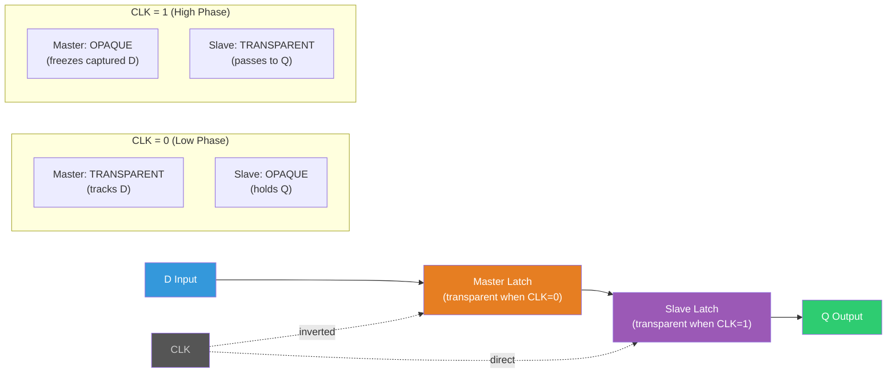
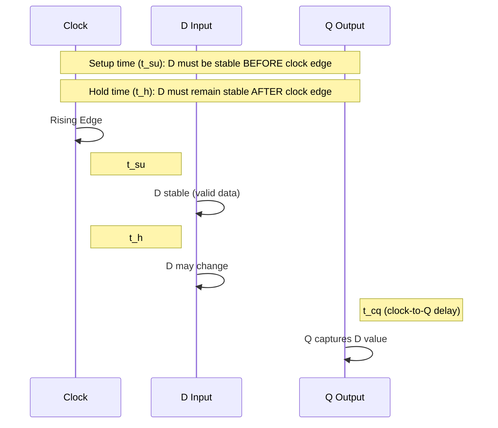
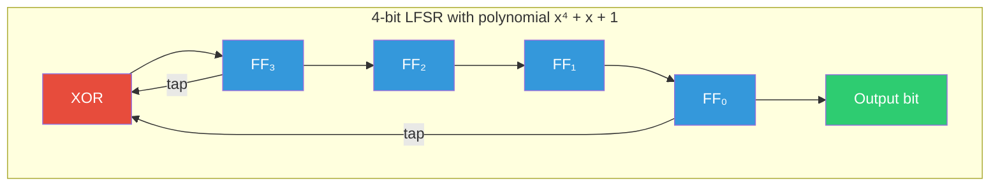

## From Combinational to Sequential: Why State Matters

Every circuit we have built so far has been combinational: the outputs are pure functions of the current inputs, with no memory of the past. But computation, in any meaningful sense, requires *state*. A processor must remember which instruction it is executing. A counter must know its current value. A communication protocol must track whether it has received a start bit. The moment we need a circuit that behaves differently based on what happened before, we need **sequential logic** — circuits whose outputs depend on both the current inputs and the stored state.

The fundamental building block of sequential logic is the **latch**, a circuit that can store a single bit of information. From latches we build **flip-flops**, which store bits at precise clock edges. From flip-flops we build **registers**, **counters**, and **shift registers**. And from those, we build entire processors.

This lecture traces that arc from first principles. We will derive every circuit, analyze every timing constraint with real numbers, confront the demon of metastability, and connect everything to the hardware you use every day.

---

## The SR Latch: Cross-Coupled Gates and Bistability

### NOR-Based SR Latch

The simplest storage element is the **SR (Set-Reset) latch**, built from two NOR gates with their outputs fed back to each other's inputs:

```
      R ──┐
           ├── NOR ──┬── Q
    Q̄ ───┘          │
                      │
      S ──┐          │
           ├── NOR ──┴── Q̄
    Q  ───┘
```

The cross-coupling creates **positive feedback**: each gate reinforces the other's output. This gives the circuit two stable states — it is *bistable*. Let us trace the logic carefully.

```mermaid
flowchart LR
    R["R (Reset)"] --> NOR1["NOR"]
    NOR1 --> Q["Q"]
    Q --> NOR2["NOR"]
    S["S (Set)"] --> NOR2
    NOR2 --> QB["Q&#773;"]
    QB --> NOR1

    style R fill:#e74c3c,color:#fff
    style S fill:#2ecc71,color:#fff
    style NOR1 fill:#3498db,color:#fff
    style NOR2 fill:#3498db,color:#fff
    style Q fill:#f39c12,color:#fff
    style QB fill:#9b59b6,color:#fff
```



With $S = 0, R = 0$ (the hold state), suppose $Q = 1$ and $\overline{Q} = 0$. The top NOR gate sees inputs $R = 0$ and $\overline{Q} = 0$, producing $Q = \text{NOR}(0, 0) = 1$. The bottom NOR gate sees $S = 0$ and $Q = 1$, producing $\overline{Q} = \text{NOR}(0, 1) = 0$. The state is self-consistent and stable. The symmetric case ($Q = 0, \overline{Q} = 1$) is equally stable.

With $S = 1, R = 0$ (set), the bottom NOR gate is forced to output $\overline{Q} = 0$ regardless of $Q$. This feeds back to the top gate: $Q = \text{NOR}(0, 0) = 1$. The latch is now in the $Q = 1$ state. When $S$ returns to 0, the feedback sustains this state.

With $S = 0, R = 1$ (reset), the top NOR gate is forced to $Q = 0$, which feeds back to make $\overline{Q} = 1$. The latch is reset.

With $S = 1, R = 1$ (forbidden), both outputs are forced to 0, which is inconsistent with $Q$ and $\overline{Q}$ being complements. Worse, when both inputs return to 0 simultaneously, the circuit enters a **metastable** state — it is equally attracted to both stable states and may oscillate or settle unpredictably. This is not merely a theoretical concern; it is a physical phenomenon with real consequences.

### NAND-Based SR Latch

The same functionality can be built from NAND gates with active-low inputs ($\overline{S}$ and $\overline{R}$). The NAND version is common in actual ASIC and FPGA implementations because NAND gates are the natural primitive of CMOS logic (recall from Week 1 that NAND requires fewer transistors than NOR in CMOS). The forbidden state becomes $\overline{S} = 0, \overline{R} = 0$.

<ConceptCheck id="cc-1" />

---

## The D Latch: Taming the SR

The SR latch has two problems: the forbidden input combination and the fact that the output can change at any time while the inputs are active. The **D (Data) latch** solves both. It has a single data input $D$ and a control input called the **enable** (or gate, or level signal):

$$Q_{next} = \begin{cases} D & \text{if Enable} = 1 \\ Q_{prev} & \text{if Enable} = 0 \end{cases}$$

Internally, the D latch is just an SR latch with some input logic: $S = D \cdot \text{Enable}$ and $R = \overline{D} \cdot \text{Enable}$. Since $S$ and $R$ can never both be 1 simultaneously (they are complements gated by the same enable), the forbidden state is eliminated by construction.

### Level Sensitivity and the Transparency Problem

The D latch is **level-sensitive**: while Enable is high, the output $Q$ tracks the input $D$ continuously — the latch is *transparent*. While Enable is low, the output holds the last value of $D$ captured just before Enable fell.

This transparency is a problem in synchronous design. Consider two latches in series, both controlled by the same clock. While the clock is high, data can race through both latches in a single clock phase, violating the intended one-stage-per-cycle semantics. We need a storage element that samples the input at a *precise instant* rather than during an entire interval.

---

## The D Flip-Flop: Edge-Triggered Storage

### Master-Slave Construction

The **D flip-flop** (also called a positive-edge-triggered flip-flop) is built from two D latches in series — a *master* and a *slave* — clocked with complementary signals:

```
D ──▷ [D Latch (Master)] ──▷ [D Latch (Slave)] ──▷ Q
       Enable = CLK̄              Enable = CLK
```

When CLK is low, the master latch is transparent (it tracks $D$) and the slave latch is opaque (it holds its previous value, which is the output $Q$). When CLK rises to high, the master latch becomes opaque (freezing the value of $D$ it captured) and the slave latch becomes transparent (passing the master's stored value to $Q$). The result: $Q$ changes only on the **rising edge** of CLK, capturing the value of $D$ that was present just before the edge.



This edge-triggered behavior is the foundation of synchronous digital design. Every flip-flop in a modern processor — and there are billions of them in a chip like Apple's M3 (with ~25 billion transistors at TSMC 3nm) — captures its input at a specific clock edge, enabling the entire system to operate in lockstep.

### Timing Parameters: The Physics of Reliable Storage

Edge-triggered flip-flops have three critical timing parameters, all measured in real physical time:

**Setup time ($t_{su}$)**: The minimum time before the clock edge that the input $D$ must be stable. If $D$ changes too close to the edge, the master latch may not fully resolve to a valid logic level before it is cut off. Typical values at advanced nodes:

| Process Node | Typical $t_{su}$ |
|---|---|
| 7nm FinFET | 20-40 ps |
| 5nm FinFET | 15-35 ps |
| 3nm FinFET | 12-30 ps |

**Hold time ($t_h$)**: The minimum time after the clock edge that $D$ must remain stable. This ensures the master latch has fully disconnected from the input before $D$ is allowed to change. Typical values are similar to or slightly less than $t_{su}$.

**Clock-to-Q delay ($t_{cq}$)**: The propagation delay from the clock edge to the output $Q$ becoming valid. This is the flip-flop's inherent latency. Typical values range from 20-60 ps at 3-7nm nodes.

These parameters define the **timing constraints** of synchronous design. For a signal to propagate correctly through a pipeline stage (from one flip-flop through combinational logic to the next flip-flop), we need:

$$t_{cq} + t_{comb} + t_{su} \leq T_{clk}$$

where $t_{comb}$ is the delay through the combinational logic and $T_{clk}$ is the clock period. This is the **setup constraint** — it determines the maximum clock frequency:

$$f_{max} = \frac{1}{t_{cq} + t_{comb,max} + t_{su}}$$

There is also a **hold constraint**:

$$t_{cq} + t_{comb,min} \geq t_h$$

This ensures that the fastest signal path does not arrive at the next flip-flop before the hold time has elapsed. Hold violations are particularly dangerous because they cannot be fixed by slowing the clock — they are independent of frequency.



<ConceptCheck id="cc-2" />

---

## Metastability: The Analog Ghost in the Digital Machine

### What Metastability Is

Every flip-flop has an **analog** reality underneath its digital abstraction. When the input changes exactly at the clock edge — violating the setup or hold time — the internal feedback loop can land in a state halfway between 0 and 1, at the unstable equilibrium point of the latch's voltage transfer curve.

Imagine a ball balanced on the peak of a hill. With any nudge, it rolls to one side (logic 0) or the other (logic 1). But if placed exactly at the top, it stays there — momentarily. In a flip-flop, thermal noise eventually pushes the circuit to one side, but the resolution time is unbounded in theory. The flip-flop output may hover at an intermediate voltage, which downstream logic interprets as neither 0 nor 1, potentially causing catastrophic failures.

### MTBF: Quantifying the Risk

The **Mean Time Between Failures** due to metastability is:

$$\text{MTBF} = \frac{e^{t_r / \tau}}{T_0 \cdot f_{clk} \cdot f_{data}}$$

where:
- $t_r$ is the **resolution time** allowed (the time between the first flip-flop's clock edge and when its output must be valid for the next stage)
- $\tau$ is the **metastability time constant** of the flip-flop (characterizes how quickly it resolves; typically 20-40 ps at modern nodes)
- $T_0$ is a constant related to the flip-flop's metastability window (typically $10^{-12}$ to $10^{-14}$ seconds)
- $f_{clk}$ is the clock frequency
- $f_{data}$ is the rate of asynchronous input changes

The exponential dependence on $t_r / \tau$ is the key insight. Each additional clock cycle of resolution time increases MTBF exponentially. For a system running at 1 GHz with $\tau = 30$ ps, $T_0 = 10^{-13}$ s, and $f_{data} = 100$ MHz:

With one cycle of resolution ($t_r = 1$ ns):

$$\text{MTBF} = \frac{e^{1000/30}}{10^{-13} \times 10^9 \times 10^8} = \frac{e^{33.3}}{10^4} \approx \frac{3.6 \times 10^{14}}{10^4} = 3.6 \times 10^{10} \text{ seconds} \approx 1,140 \text{ years}$$

With just one flip-flop and one clock cycle, the MTBF is already over a thousand years. But in a system with thousands of asynchronous inputs, or at higher frequencies, single-stage synchronizers may not suffice.

### Synchronizer Chains

The standard solution is to chain two or three flip-flops in series, giving the first flip-flop additional clock cycles to resolve before its output is used by the system. A two-flip-flop synchronizer provides two clock cycles of resolution time, squaring the exponential factor and typically yielding MTBF values of millions of years per synchronizer.

This is why every asynchronous input in a real design — button presses, UART data lines, signals crossing clock domains — must pass through a synchronizer chain before entering the synchronous domain.

---

## Registers: Parallel Storage from Flip-Flops

An $n$-bit **register** is simply $n$ D flip-flops sharing a common clock and (optionally) an enable signal. When the clock edge arrives and the enable is asserted, all $n$ bits are captured simultaneously.

Registers are the fundamental unit of state in a processor. The RISC-V ISA specifies 32 general-purpose registers, each 32 or 64 bits wide. In an out-of-order processor like Apple's Firestorm cores, the physical register file may contain 300+ entries for register renaming, each implemented as a row of flip-flops with read and write ports.

---

## Shift Registers: Serial-Parallel Conversion

A **shift register** is a chain of flip-flops where each stage passes its output to the next on each clock edge. Shift registers convert between serial and parallel data — a critical function in communication interfaces.

### SIPO (Serial-In, Parallel-Out)

Data enters one bit per clock at the input. After $n$ clock cycles, $n$ bits are available in parallel at the outputs of all flip-flops. This is how a UART receiver captures incoming serial data.

### PISO (Parallel-In, Serial-Out)

All bits are loaded in parallel (via multiplexed inputs to each flip-flop), then shifted out one bit per clock cycle. This is how a UART transmitter sends data.

### Bidirectional Shift Registers

A direction control signal selects whether data shifts left or right on each clock. This is used in arithmetic shift operations (where a left shift is multiplication by 2 and a right shift is division by 2) and in barrel shifters.

### Universal Shift Register

Combines parallel load, serial shift in both directions, and hold functionality via a 2-bit function select. The 74194 is the classic TTL example, though in modern ASIC design these are generated by synthesis tools rather than instantiated as specific parts.

---

## Binary Counters

### Ripple Counter

The simplest counter chains $n$ T flip-flops (toggle flip-flops), where each flip-flop's output clocks the next. A T flip-flop toggles its state when $T = 1$: the LSB toggles every clock cycle, the next bit toggles when the LSB falls from 1 to 0, and so on. This produces a natural binary count.

The problem with ripple counters is **cumulative delay**: the MSB does not change until the clock edge has propagated through all $n$ stages. For an $n$-bit counter with per-flip-flop delay $t_{cq}$:

$$t_{total} = n \cdot t_{cq}$$

At $t_{cq} = 50$ ps (a reasonable value for modern technology), a 32-bit ripple counter has a worst-case delay of 1.6 ns — too slow for a 3 GHz clock with a 333 ps period.

### Synchronous Counter

In a synchronous counter, all flip-flops share the same clock. Each flip-flop's toggle input is the AND of all lower-order bits. The MSB now changes within one $t_{cq}$ of the clock edge, but the AND chain introduces combinational delay. For large counters, carry-lookahead techniques (analogous to those in adders) keep this delay logarithmic.

### Modulo-N Counters

A modulo-$N$ counter resets to 0 when it reaches $N - 1$. The reset logic compares the current count to $N - 1$ and forces all flip-flops to 0. For power-of-two $N$, this is free — just use the lower $\log_2 N$ bits. For non-power-of-two $N$ (e.g., a mod-10 counter for BCD), explicit comparison logic is required.

---

## Linear Feedback Shift Registers (LFSRs)

An LFSR is a shift register whose input bit is a linear function (XOR) of certain bits in the register, called **taps**. The tap positions are specified by a **feedback polynomial**.

### Polynomial Representation

An $n$-bit LFSR with taps at positions $t_1, t_2, \ldots, t_k$ corresponds to the polynomial:

$$p(x) = x^n + x^{t_k} + \cdots + x^{t_1} + 1$$

For example, the polynomial $x^4 + x + 1$ describes a 4-bit LFSR with taps at positions 4 and 1 (numbering from 1). The "1" term means the output of the last stage is always included.

### Maximal-Length Sequences

If the feedback polynomial is **primitive** (irreducible and of order $n$ over GF(2)), the LFSR cycles through all $2^n - 1$ non-zero states before repeating. This is a **maximal-length sequence** or **m-sequence**. The all-zeros state is excluded because XOR of all zeros is zero — a fixed point.

Some commonly used primitive polynomials:

| Bits | Polynomial | Taps | Period |
|---|---|---|---|
| 4 | $x^4 + x + 1$ | [4, 1] | 15 |
| 8 | $x^8 + x^6 + x^5 + x^4 + 1$ | [8, 6, 5, 4] | 255 |
| 16 | $x^{16} + x^{14} + x^{13} + x^{11} + 1$ | [16, 14, 13, 11] | 65535 |
| 32 | $x^{32} + x^{22} + x^2 + x + 1$ | [32, 22, 2, 1] | $2^{32} - 1$ |

### Applications

LFSRs are everywhere in hardware:
- **Pseudorandom number generation**: Fast, deterministic, and area-efficient. Used in Monte Carlo simulations, hardware test pattern generation, and cryptographic stream ciphers (though simple LFSRs are cryptographically weak).
- **CRC (Cyclic Redundancy Check)**: The CRC algorithm is mathematically equivalent to polynomial division, which an LFSR computes naturally. Ethernet CRC-32, USB CRC, and disk sector CRCs all use LFSR-based circuits.
- **Built-In Self-Test (BIST)**: LFSRs generate pseudorandom test patterns and compact circuit responses into a signature. This is how chips test themselves after manufacture — critical in quality assurance for billions of transistors.
- **Scrambling**: Communication protocols like PCIe and SATA use LFSRs to scramble data, ensuring DC balance and sufficient transitions for clock recovery.

This is a direct connection to Project 1 Milestone 3, where you will implement an LFSR-based pseudorandom number generator and verify its maximal-length property.



<ConceptCheck id="cc-3" />

---

## C Memory Management Concepts and Python Equivalents

Sequential circuits store state, and at the software level, the analogue is *dynamic memory allocation*. In C, `malloc()` requests a block of memory from the heap, and `free()` returns it. The programmer is responsible for tracking every allocation — double-free and use-after-free bugs are the leading cause of security vulnerabilities in systems software (Microsoft reported that 70% of their security vulnerabilities from 2006-2018 were memory safety issues).

In Python (and in our Pyodide exercises), we model raw memory using `bytearray`, which gives us a mutable sequence of bytes:

```python
from typing import Optional

class SimpleHeap:
    """Model a fixed-size heap with first-fit allocation."""

    def __init__(self, size: int) -> None:
        self.memory = bytearray(size)
        # Free list: list of (start, length) tuples
        self.free_blocks: list[tuple[int, int]] = [(0, size)]
        self.allocated: dict[int, int] = {}  # start -> length

    def malloc(self, size: int) -> Optional[int]:
        """Allocate 'size' bytes, return start address or None."""
        for i, (start, length) in enumerate(self.free_blocks):
            if length >= size:
                self.allocated[start] = size
                if length == size:
                    self.free_blocks.pop(i)
                else:
                    self.free_blocks[i] = (start + size, length - size)
                return start
        return None  # Out of memory

    def free(self, addr: int) -> bool:
        """Free the block at 'addr'. Return True on success."""
        if addr not in self.allocated:
            return False
        size = self.allocated.pop(addr)
        self.free_blocks.append((addr, size))
        self.free_blocks.sort()
        # Coalesce adjacent free blocks
        merged: list[tuple[int, int]] = []
        for start, length in self.free_blocks:
            if merged and merged[-1][0] + merged[-1][1] == start:
                merged[-1] = (merged[-1][0], merged[-1][1] + length)
            else:
                merged.append((start, length))
        self.free_blocks = merged
        return True
```

This is a simplified model, but it captures the essential ideas: first-fit allocation, fragmentation, and coalescing. Real `malloc` implementations (glibc's ptmalloc, jemalloc, tcmalloc) use far more sophisticated data structures (segregated free lists, thread-local caches, mmap for large allocations), but the fundamental challenge — managing a finite address space for variable-sized allocations — is the same.

---

## Summary

We have traveled from cross-coupled gates to the edge-triggered flip-flop, the atom of synchronous digital design. We derived the timing constraints ($t_{su}$, $t_h$, $t_{cq}$) that govern the maximum clock frequency of every processor. We confronted metastability — the fundamental tension between the analog reality of transistors and the digital abstraction we impose on them — and saw how synchronizer chains make it manageable. We built registers, counters, and LFSRs, connecting each to real applications in modern hardware.

In the next lecture, we will use these building blocks to design **finite state machines** — the control logic that orchestrates every operation in a processor, every protocol in a communication interface, and every sequence in a digital system.
