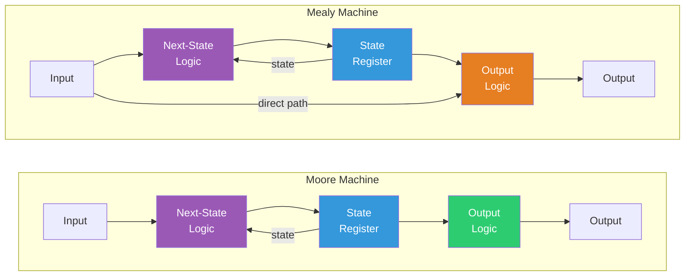
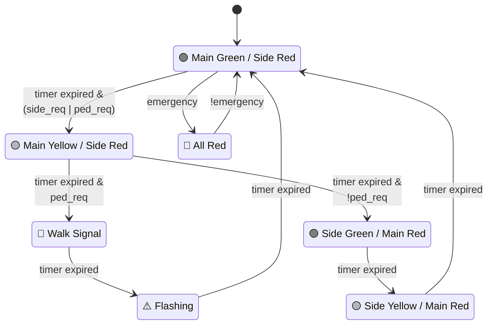
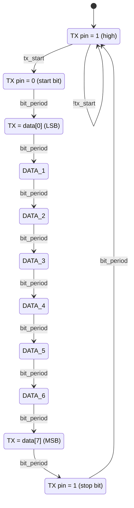
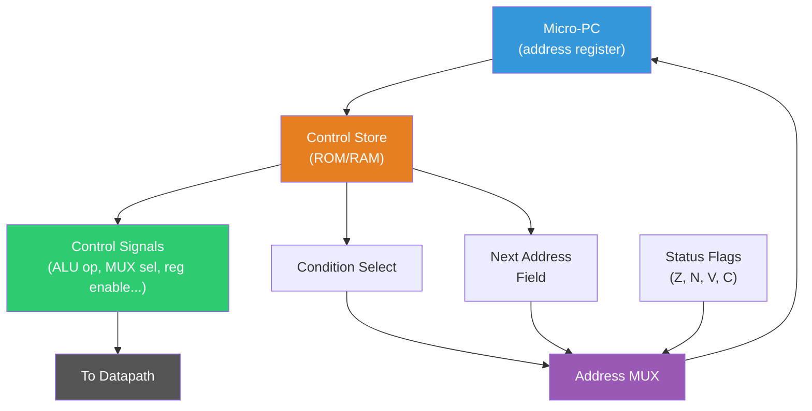

## The Need for Control: Sequencing Operations

A processor executes instructions in a specific sequence: fetch, decode, execute, memory access, write-back. A UART transmitter sends bits in a precise order: idle, start bit, eight data bits, stop bit. A traffic light cycles through green, yellow, red with specific timing. All of these are examples of **finite state machines** (FSMs) — systems that move through a finite set of states according to well-defined rules, producing outputs that control the datapath or the external world.

FSMs are the workhorse of digital control. If combinational logic is the brain that performs arithmetic, FSMs are the executive function that decides *what* to compute and *when*. This lecture formalizes the theory, then applies it to two detailed design examples that you will encounter throughout the course.

---

## Formal Definition of a Finite State Machine

A finite state machine is a 6-tuple $(Q, \Sigma, \Delta, \delta, \lambda, q_0)$ where:

- $Q$ is a finite set of **states**
- $\Sigma$ is a finite **input alphabet** (the set of possible input symbols)
- $\Delta$ is a finite **output alphabet** (the set of possible output symbols)
- $\delta: Q \times \Sigma \to Q$ is the **state transition function**
- $\lambda$ is the **output function** (its signature differs between Moore and Mealy machines)
- $q_0 \in Q$ is the **initial state**

The machine operates in discrete time steps. At each step, it reads the current input, transitions to a new state according to $\delta$, and produces an output according to $\lambda$.

---

## Moore Machines: Output Depends Only on State

In a **Moore machine**, the output is a function of the current state alone:

$$\lambda_{Moore}: Q \to \Delta$$

The output does not change between clock edges — it is stable for the entire time the machine is in a given state. This makes Moore machines easier to design and debug, because the output is directly readable from the state encoding. The tradeoff is that Moore machines may require more states than an equivalent Mealy machine, because different outputs for the same state require splitting that state.

### Example: Simple Sequence Detector

Consider a Moore machine that asserts its output when it has seen the input sequence "110" on a serial input line. The states encode how much of the pattern has been matched so far:

| State | Meaning | Output |
|---|---|---|
| $S_0$ | No match progress | 0 |
| $S_1$ | Seen "1" | 0 |
| $S_2$ | Seen "11" | 0 |
| $S_3$ | Seen "110" | 1 |

The transition function must handle both continuing a match and starting over when the input deviates. For instance, in state $S_2$ (seen "11"), if the input is "1", we stay in $S_2$ (the last two bits are still "11"). If the input is "0", we transition to $S_3$ (we have now seen "110").

---

## Mealy Machines: Output Depends on State and Input

In a **Mealy machine**, the output depends on both the current state and the current input:

$$\lambda_{Mealy}: Q \times \Sigma \to \Delta$$

This means the output can change *during* a clock cycle, as soon as the input changes, without waiting for a state transition. Mealy machines can often implement the same behavior with fewer states, but the output may glitch during input transitions (since it is combinationally derived from the input).

### Moore vs. Mealy: When to Use Which

| Criterion | Moore | Mealy |
|---|---|---|
| Output timing | Stable between clock edges | Can change within a cycle |
| Number of states | Often more | Often fewer |
| Output latency | One cycle delayed | Responds immediately |
| Glitch risk | Lower (output registered) | Higher (combinational path) |
| Typical use | Control signals (datapath) | Protocol handshakes |

**My strong opinion**: For control logic in processors, use Moore machines. The registered output avoids glitches and simplifies timing analysis. For high-speed protocol interfaces where latency matters (like Mealy-based handshake controllers in AXI buses), Mealy machines are appropriate — but register the outputs whenever possible.



<ConceptCheck id="cc-1" />

---

## State Encoding: How States Map to Bits

Each state must be encoded as a pattern of flip-flop values. The choice of encoding affects area, speed, and power.

### Binary Encoding

Use the minimum number of flip-flops: $\lceil \log_2 |Q| \rceil$ flip-flops for $|Q|$ states. For 8 states, we need 3 flip-flops with encodings 000 through 111.

**Advantages**: Minimum flip-flop count, minimum area for the state register.
**Disadvantages**: The next-state and output logic is more complex, requiring multi-level combinational circuits to decode each state.

### One-Hot Encoding

Use one flip-flop per state: $|Q|$ flip-flops, with exactly one flip-flop set to 1 at any time. For 8 states, we need 8 flip-flops (encodings: 00000001, 00000010, ..., 10000000).

**Advantages**: The next-state logic is simple — each flip-flop's input is an OR of the transitions that lead to that state. No decoding is needed. This often produces faster circuits because the critical path through the next-state logic is shorter.
**Disadvantages**: More flip-flops, which means more area. But in modern FPGAs (which have abundant flip-flops and limited LUTs), one-hot encoding is often preferred.

### Gray Code Encoding

Adjacent states differ in exactly one bit. This minimizes switching activity (and thus dynamic power) for machines that typically transition between adjacent states — like counters. It also eliminates multi-bit transition glitches.

For a 4-state machine, Gray encoding is: 00, 01, 11, 10.

### Encoding Comparison for an 8-State Machine

| Encoding | Flip-Flops | Typical Next-State Logic Complexity |
|---|---|---|
| Binary | 3 | Higher (decoding required) |
| One-hot | 8 | Lower (no decoding) |
| Gray | 3 | Lower power (fewer transitions) |

In ASIC synthesis, the tool typically explores multiple encodings and selects the best one for the target constraints (area, speed, power). In FPGA design, synthesis tools almost always default to one-hot for machines with fewer than ~30 states.

---

## FSM Design Methodology

The systematic process for designing an FSM is:

1. **Specification**: Define the inputs, outputs, and desired behavior in natural language.
2. **State diagram**: Draw states as circles, transitions as labeled arrows ($\text{input} / \text{output}$ for Mealy, just $\text{input}$ for Moore with output labeled inside the state circle).
3. **State table**: Tabulate all state-input combinations with their next states and outputs.
4. **State encoding**: Choose an encoding scheme.
5. **Logic equations**: Derive the Boolean equations for each flip-flop's D input and each output.
6. **Implementation**: Map the equations to gates or look-up tables.

Let us apply this methodology to two substantial examples.

<ConceptCheck id="cc-2" />

---

## Worked Example: Traffic Light Controller

### Specification

Design a controller for a four-way intersection with:
- A main road (green by default) and a side road
- A pedestrian crossing button
- An emergency vehicle override
- Timing: main green 30s, side green 20s, yellow 5s each, pedestrian walk 15s

### State Diagram

We define the following states (Moore machine — outputs depend only on state):

| State | Main Light | Side Light | Walk Signal | Duration |
|---|---|---|---|---|
| MAIN_GREEN | Green | Red | Don't Walk | 30 cycles |
| MAIN_YELLOW | Yellow | Red | Don't Walk | 5 cycles |
| SIDE_GREEN | Red | Green | Don't Walk | 20 cycles |
| SIDE_YELLOW | Red | Yellow | Don't Walk | 5 cycles |
| PED_WALK | Red | Red | Walk | 15 cycles |
| PED_CLEAR | Red | Red | Flashing | 5 cycles |
| EMERGENCY | Red | Red | Don't Walk | Until clear |

### Transitions



From MAIN_GREEN: if timer expires and (side_request or ped_request) $\to$ MAIN_YELLOW. If emergency $\to$ EMERGENCY.

From MAIN_YELLOW: if timer expires and ped_request $\to$ PED_WALK. If timer expires and not ped_request $\to$ SIDE_GREEN.

From SIDE_GREEN: if timer expires $\to$ SIDE_YELLOW.

From SIDE_YELLOW: if timer expires $\to$ MAIN_GREEN.

From PED_WALK: if timer expires $\to$ PED_CLEAR.

From PED_CLEAR: if timer expires $\to$ SIDE_GREEN (or MAIN_GREEN if no side request).

From EMERGENCY: if not emergency $\to$ MAIN_GREEN (safe default).

### Implementation Considerations

With 7 states, binary encoding needs 3 flip-flops. We also need a counter (at least 5 bits for counting to 30) for timing. The timer and the FSM together form the complete controller. Each state sets specific output signals (main_red, main_yellow, main_green, side_red, etc.) based purely on the current state — classic Moore behavior.

This design pattern — an FSM combined with a datapath counter — appears everywhere. A processor's control unit is exactly this: an FSM that sequences through fetch/decode/execute states, with counters and comparators for multi-cycle operations.

Explore this concept with the interactive simulation below:

<Simulation id="fsm" />

---

## Worked Example: UART Transmitter FSM

### The UART Protocol

A Universal Asynchronous Receiver-Transmitter (UART) is one of the simplest serial communication protocols, still widely used today (every Arduino, every embedded system, every Linux machine with a serial console). The transmit format for 8N1 (8 data bits, no parity, 1 stop bit) is:

```
Idle ──┐   ┌─D0─┐─D1─┐─D2─┐─D3─┐─D4─┐─D5─┐─D6─┐─D7─┐ Stop ──
  (1)  └───┘    │    │    │    │    │    │    │    │    │  (1)
       Start
       (0)       LSB first                           MSB
```

The line idles high (logic 1). A transmission begins with a **start bit** (logic 0) for exactly one bit period. Then 8 data bits are sent LSB first, each held for one bit period. Finally, a **stop bit** (logic 1) is held for one bit period, after which the line returns to idle.

The **baud rate** determines the bit period: at 9600 baud, each bit lasts $1/9600 \approx 104.17 \mu s$. At 115200 baud, each bit lasts $\approx 8.68 \mu s$.

### FSM Design

| State | TX Pin | Action |
|---|---|---|
| IDLE | 1 | Wait for transmit_start signal |
| START | 0 | Hold start bit for one bit period |
| DATA_0 through DATA_7 | data[bit_index] | Transmit each data bit |
| STOP | 1 | Hold stop bit for one bit period |

Transitions: IDLE $\to$ START when transmit_start is asserted. START $\to$ DATA_0 after one bit period. DATA_$n$ $\to$ DATA_$n+1$ after each bit period. DATA_7 $\to$ STOP after one bit period. STOP $\to$ IDLE after one bit period.



The bit period timing is implemented with a counter that counts system clock cycles. For a 50 MHz system clock and 9600 baud:

$$\text{counts per bit} = \frac{50 \times 10^6}{9600} = 5208.33 \approx 5208$$

The small fractional error (0.006%) accumulates over the 10-bit frame to a total timing error of 0.06%, well within the UART tolerance of $\pm$2-3%.

### State Encoding Choice

With 11 states (IDLE, START, DATA_0 through DATA_7, STOP), one-hot encoding uses 11 flip-flops but requires no state decoder. Binary encoding uses 4 flip-flops ($\lceil \log_2 11 \rceil = 4$) but needs a 4-to-11 decoder for outputs. In an FPGA, one-hot is the clear winner. In an ASIC targeting minimum area, binary encoding with careful logic optimization may win.

---

## Microprogrammed Control

For complex machines like processor control units, the FSM approach with hardwired logic can become unwieldy. An alternative is **microprogrammed control**, where the state transition table is stored in a ROM (or RAM) called the **control store**.

### Microinstruction Format

Each microinstruction word contains fields that directly drive the control signals of the datapath, plus a field that specifies the next microinstruction address:

```
| Control signals (ALU op, mux selects, reg enables, ...) | Next address | Condition select |
```

A **microsequencer** reads the current microinstruction, asserts the control signals, evaluates the condition (if any), and computes the next microinstruction address. This is essentially an FSM where the transition table is stored in memory rather than implemented as combinational logic.



### Advantages of Microprogramming

- **Flexibility**: Changing the behavior of the control unit requires only rewriting the control store, not redesigning logic.
- **Complexity management**: A processor with hundreds of instructions and multiple pipeline stages can have thousands of control states. Encoding this as hardwired logic is error-prone; encoding it as a table in memory is systematic.
- **Historical significance**: The IBM System/360 (1964) was the first major commercial machine to use microprogramming, enabling a family of machines with different hardware implementations to share the same instruction set.

### Disadvantages

- **Speed**: Reading from a ROM is slower than evaluating hardwired logic. This is why modern high-performance processors use hardwired control for the fast path and microprogramming only for complex instructions (Intel's "microcode" for x86 complex instructions).
- **Area**: The control store memory can be large.

The tension between hardwired and microprogrammed control is one of the fundamental tradeoffs in processor design. RISC architectures (like RISC-V and ARM) use hardwired control almost exclusively, because their simple, regular instruction formats make this tractable. CISC architectures (like x86) use microcode to implement their complex, variable-length instructions on top of a simpler RISC-like internal engine.

<ConceptCheck id="cc-3" />

---

## Python State Machine Patterns

In software, FSMs are implemented using enums for states and dictionaries or match statements for transitions. Here is a clean pattern using Python's `enum` module:

```python
from enum import Enum, auto
from typing import Optional
from dataclasses import dataclass


class TrafficState(Enum):
    MAIN_GREEN = auto()
    MAIN_YELLOW = auto()
    SIDE_GREEN = auto()
    SIDE_YELLOW = auto()
    PED_WALK = auto()
    PED_CLEAR = auto()
    EMERGENCY = auto()


@dataclass
class TrafficOutputs:
    main: str       # "green", "yellow", "red"
    side: str       # "green", "yellow", "red"
    walk: str       # "walk", "flash", "stop"


# Moore machine: output depends only on state
OUTPUT_TABLE: dict[TrafficState, TrafficOutputs] = {
    TrafficState.MAIN_GREEN:  TrafficOutputs("green", "red", "stop"),
    TrafficState.MAIN_YELLOW: TrafficOutputs("yellow", "red", "stop"),
    TrafficState.SIDE_GREEN:  TrafficOutputs("red", "green", "stop"),
    TrafficState.SIDE_YELLOW: TrafficOutputs("red", "yellow", "stop"),
    TrafficState.PED_WALK:    TrafficOutputs("red", "red", "walk"),
    TrafficState.PED_CLEAR:   TrafficOutputs("red", "red", "flash"),
    TrafficState.EMERGENCY:   TrafficOutputs("red", "red", "stop"),
}

# Duration in time units for each state
DURATION: dict[TrafficState, int] = {
    TrafficState.MAIN_GREEN:  30,
    TrafficState.MAIN_YELLOW: 5,
    TrafficState.SIDE_GREEN:  20,
    TrafficState.SIDE_YELLOW: 5,
    TrafficState.PED_WALK:    15,
    TrafficState.PED_CLEAR:   5,
    TrafficState.EMERGENCY:   0,  # Until override clears
}


class TrafficController:
    """Moore FSM traffic light controller."""

    def __init__(self) -> None:
        self.state = TrafficState.MAIN_GREEN
        self.timer: int = DURATION[self.state]

    def tick(
        self,
        side_request: bool = False,
        ped_request: bool = False,
        emergency: bool = False,
    ) -> TrafficOutputs:
        """Advance one time unit. Return current outputs."""
        # Emergency override from any state
        if emergency:
            self.state = TrafficState.EMERGENCY
            self.timer = 0
            return OUTPUT_TABLE[self.state]

        # Decrement timer
        if self.timer > 0:
            self.timer -= 1

        # State transitions when timer expires
        if self.timer == 0:
            next_state = self._next_state(side_request, ped_request)
            self.state = next_state
            self.timer = DURATION[next_state]

        return OUTPUT_TABLE[self.state]

    def _next_state(
        self, side_request: bool, ped_request: bool
    ) -> TrafficState:
        transitions: dict[TrafficState, TrafficState] = {
            TrafficState.MAIN_GREEN: (
                TrafficState.MAIN_YELLOW
                if side_request or ped_request
                else TrafficState.MAIN_GREEN
            ),
            TrafficState.MAIN_YELLOW: (
                TrafficState.PED_WALK
                if ped_request
                else TrafficState.SIDE_GREEN
            ),
            TrafficState.SIDE_GREEN: TrafficState.SIDE_YELLOW,
            TrafficState.SIDE_YELLOW: TrafficState.MAIN_GREEN,
            TrafficState.PED_WALK: TrafficState.PED_CLEAR,
            TrafficState.PED_CLEAR: TrafficState.MAIN_GREEN,
            TrafficState.EMERGENCY: TrafficState.MAIN_GREEN,
        }
        return transitions[self.state]
```

This pattern maps directly to hardware: the `TrafficState` enum is the state register, the `OUTPUT_TABLE` is the output combinational logic, and `_next_state` is the next-state combinational logic. The `timer` is a separate datapath counter. The structural correspondence between software FSMs and hardware FSMs is exact, which is why hardware description languages like Verilog and VHDL use similar patterns (case statements over state variables).

---

## Summary

Finite state machines provide the systematic framework for designing any sequential control logic. We formalized Moore and Mealy machines, analyzed the tradeoffs in state encoding (binary vs. one-hot vs. Gray), and applied the FSM design methodology to two practical examples: a traffic light controller and a UART transmitter. We saw how microprogrammed control trades speed for flexibility, and how the Python `enum`-and-dictionary pattern mirrors the hardware FSM structure precisely.

Together with the flip-flops, registers, counters, and LFSRs from Lecture 1, you now have the complete toolkit for sequential logic design. In Week 4, we will turn to memory technologies — the other critical form of state storage, where billions of flip-flops and capacitors hold the data that processors operate on.
