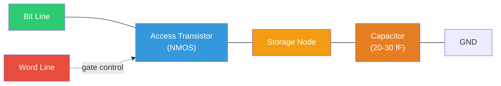
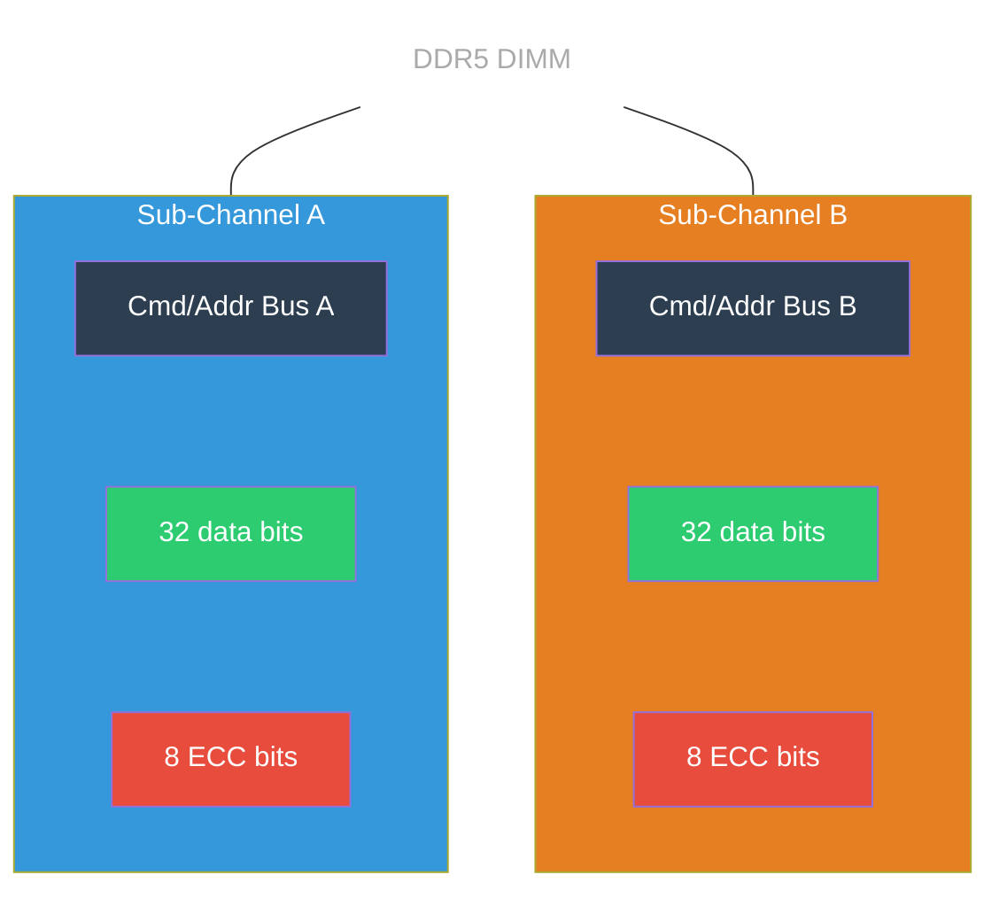
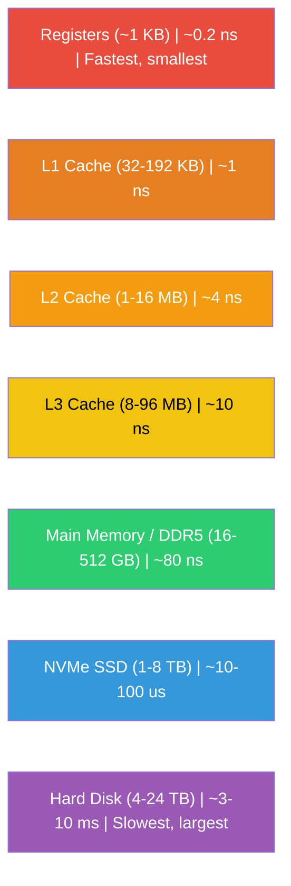

## The Memory Problem

Processors are fast. A modern core clocks at 4-5 GHz, executing multiple instructions per cycle. But instructions without data are useless, and data lives in memory. The fundamental tension of computer architecture is that memory cannot be simultaneously fast, large, and cheap. SRAM is fast but expensive and bulky. DRAM is dense and cheap but slow. Flash is even cheaper but orders of magnitude slower. The entire field of memory system design is an exercise in hiding this gap through clever hierarchies, parallelism, and speculation.

This lecture examines memory technologies at the circuit level. We will trace the operation of every transistor in an SRAM cell and a DRAM cell, derive bandwidth from first principles using real DDR5 and HBM3 specifications, and understand why ECC is no longer optional at modern densities.

---

## SRAM: The 6-Transistor Cell

### Circuit Structure

The standard 6T SRAM cell consists of two cross-coupled CMOS inverters forming a bistable latch (exactly the SR latch from Week 3, with complementary outputs) plus two NMOS access transistors gated by the word line:

```
        VDD          VDD
         |            |
        [P1]         [P2]       (PMOS pull-up)
         |            |
    Q ---+--- Q_bar --+
         |            |
        [N1]         [N2]       (NMOS pull-down)
         |            |
        GND          GND

    BL --[A1]-- Q    Q_bar --[A2]-- BL_bar
              |                |
              WL               WL
```

The cross-coupled inverters (P1/N1 and P2/N2) hold the stored bit. P1/N1 form one inverter with output Q. P2/N2 form the other with output Q_bar. Each inverter's output feeds the other's input, creating positive feedback that sustains the state indefinitely — as long as power is supplied. This is why SRAM is *static*: no refresh is needed.

```mermaid
flowchart TD
    VDD1["VDD"] --> P1["P1 (PMOS)"]
    VDD2["VDD"] --> P2["P2 (PMOS)"]
    P1 --> Q["Q"]
    P2 --> QB["Q&#773;"]
    Q --> N1["N1 (NMOS)"]
    QB --> N2["N2 (NMOS)"]
    N1 --> GND1["GND"]
    N2 --> GND2["GND"]

    Q -->|"cross-coupled"| P2
    Q -->|"cross-coupled"| N2
    QB -->|"cross-coupled"| P1
    QB -->|"cross-coupled"| N1

    WL["Word Line"] -.-> A1["A1 (Access)"]
    WL -.-> A2["A2 (Access)"]
    BL["Bit Line"] --- A1
    A1 --- Q
    QB --- A2
    A2 --- BLB["Bit Line Bar"]

    style P1 fill:#e67e22,color:#fff
    style P2 fill:#e67e22,color:#fff
    style N1 fill:#3498db,color:#fff
    style N2 fill:#3498db,color:#fff
    style A1 fill:#2ecc71,color:#fff
    style A2 fill:#2ecc71,color:#fff
    style Q fill:#f39c12,color:#fff
    style QB fill:#9b59b6,color:#fff
    style WL fill:#e74c3c,color:#fff
```



The access transistors A1 and A2 are NMOS devices controlled by the **word line** (WL). When WL is high, the access transistors connect the storage nodes Q and Q_bar to the **bit lines** (BL and BL_bar), enabling read and write operations.

### Read Operation

Reading from an SRAM cell proceeds in four steps:

1. **Precharge**: Both bit lines BL and BL_bar are precharged to $V_{DD}$ (or $V_{DD}/2$ in some designs). This establishes a known starting voltage.

2. **Word line assertion**: WL goes high, turning on access transistors A1 and A2. This connects the storage nodes to the bit lines.

3. **Differential development**: Suppose Q stores a 1 ($V_{DD}$) and Q_bar stores a 0 (GND). BL remains near $V_{DD}$ (Q is already high). BL_bar is pulled slightly below $V_{DD}$ by the N2 pull-down transistor through A2. The voltage difference between BL and BL_bar is small — typically 50-100 mV.

4. **Sense amplification**: A **sense amplifier** detects and amplifies this small differential voltage to full logic levels. Modern sense amplifiers can resolve differentials as small as 30 mV in under 100 ps.

### The Read Disturb Problem

During a read, there is a critical stability concern. If Q = 0, the access transistor A1 and pull-down transistor N1 form a voltage divider between BL (precharged to $V_{DD}$) and GND. This can momentarily raise the voltage at node Q. If this rise exceeds the switching threshold of the P2/N2 inverter, the cell flips — a catastrophic read error.

The defense is the **cell ratio** (CR): the ratio of the pull-down transistor width to the access transistor width:

$$CR = \frac{(W/L)_{N1}}{(W/L)_{A1}}$$

The cell ratio must be greater than 1 (typically 1.5-2.0) to ensure the pull-down transistor dominates the voltage divider, keeping node Q close to GND. A larger cell ratio improves stability but increases cell area.

### Write Operation

Writing drives the desired value onto BL and its complement onto BL_bar. For example, to write a 1: BL is driven to $V_{DD}$, BL_bar is driven to GND, and WL is asserted. The bit line drivers must overpower the PMOS pull-up transistor in the cell — this requires the **pull-up ratio** (access transistor width / PMOS width) to be greater than 1.

The tension between read stability (wants strong pull-down, weak access) and write ability (wants strong access, weak pull-up) is the fundamental SRAM design challenge. At advanced nodes (7nm and below), process variation makes this balancing act increasingly difficult.

### Static Noise Margin (SNM)

SNM quantifies the cell's ability to retain data in the presence of noise. It is measured using **butterfly curves**: plot the voltage transfer characteristics (VTC) of both inverters on the same axes, with one mirrored. The largest square that fits inside the resulting butterfly diagram has a side length equal to the SNM.

Typical values at modern process nodes (from research):

| Node | Read SNM | Hold SNM |
|---|---|---|
| 7nm | 150-250 mV | 250-350 mV |
| 5nm | ~130-220 mV | ~230-320 mV |
| 3nm | ~120-200 mV | ~220-300 mV |

Hold SNM is higher than read SNM because the access transistors are off during hold, eliminating the voltage divider effect. SNM degrades with voltage scaling and process variation at smaller nodes, which is why alternative SRAM cell designs (8T, 10T) with separate read and write ports are used for ultra-low-voltage operation.

### Access Time and Area

SRAM is the fastest memory technology because the data is held by active transistors — no charge transfer or amplification delay is needed beyond the sense amplifier.

| Process Node | SRAM Access Time | Used In |
|---|---|---|
| 7nm | 0.4-0.5 ns | AMD Zen 3 L1/L2 cache |
| 5nm | 0.3-0.4 ns | Apple M2, AMD Zen 4 L1 cache |
| 3nm | 0.2-0.3 ns | Apple M3, latest designs |

But SRAM is expensive in area. The 6T cell at TSMC 7nm occupies 0.027 $\mu m^2$, and at TSMC 3nm (N3B), the high-density cell is 0.0199 $\mu m^2$. This is approximately **100-150x larger per bit** than a DRAM cell. This area gap is why SRAM is used only for small, fast caches (kilobytes to tens of megabytes), while DRAM serves as main memory (gigabytes).

<ConceptCheck id="cc-1" />

---

## DRAM: The 1-Transistor, 1-Capacitor Cell

### Circuit Structure

A DRAM cell contains just one transistor and one capacitor — the simplest possible storage element:

```
    BL --[Access NMOS]-- Storage Node --||-- GND
              |                        (Capacitor)
              WL
```

The access transistor connects the storage capacitor to the bit line when WL is asserted. The bit is stored as charge on the capacitor: charged = 1, discharged = 0. The capacitance is tiny — typically 20-30 fF (femtofarads) in modern DRAM — and the charge leaks away through transistor leakage and junction currents within milliseconds.



### Read Operation (Destructive)

1. **Precharge**: BL is precharged to $V_{DD}/2$.
2. **Word line assertion**: WL goes high, connecting the capacitor to BL.
3. **Charge sharing**: The capacitor's charge redistributes between the storage capacitor ($C_S$) and the much larger bit line capacitance ($C_{BL}$). The voltage change on the bit line is:

$$\Delta V_{BL} = \frac{C_S}{C_S + C_{BL}} \cdot \frac{V_{DD}}{2}$$

With $C_S \approx 25$ fF and $C_{BL} \approx 250$ fF:

$$\Delta V_{BL} = \frac{25}{25 + 250} \cdot \frac{1.1}{2} \approx \frac{25}{275} \cdot 0.55 \approx 50 \text{ mV}$$

4. **Sense amplification**: A sense amplifier detects this ~50 mV differential and amplifies it to full logic levels.

Crucially, the read is **destructive**: the charge sharing process discharges the capacitor. After every read, the cell must be **rewritten** (the sense amplifier drives the bit line back to the full voltage, restoring the capacitor charge).

### Refresh Requirement

Even without reads, the capacitor charge leaks away. DRAM must be periodically refreshed — each row is read and rewritten to restore full charge. The JEDEC specification mandates refresh every **32-64 ms** for all rows. For a modern DRAM chip with millions of rows, this means continuously cycling through rows at a rate that covers all rows within the refresh window.

Refresh consumes bandwidth and energy. At high densities (16 Gb+ per die), refresh overhead can consume 5-15% of total bandwidth. DDR5 introduces **same-bank refresh**, allowing other banks to remain active during refresh of one bank — a significant improvement over DDR4's all-bank refresh.

### Why DRAM Is Dense

The 1T1C cell is extraordinarily compact. At 7nm-class DRAM technology, a cell occupies approximately 0.003 $\mu m^2$ — about **100-150x smaller** than a 6T SRAM cell. This density advantage, combined with DRAM's lower cost per bit, is why main memory is always DRAM and not SRAM.

---

## DDR5: Modern DRAM Specifications

DDR5 SDRAM, standardized by JEDEC (JESD79-5), represents the current generation of mainstream memory. Let us derive its bandwidth from first principles and understand why specific architectural choices were made.

### Channel Architecture

DDR5 introduces a fundamentally different channel architecture from DDR4. Each DDR5 DIMM contains **two independent 32-bit sub-channels**, each with its own command/address bus. This replaces the single 64-bit channel of DDR4.



- Non-ECC modules: 2 x 32 data bits = 64 total data lines
- ECC (RDIMM): 2 x 40 data bits = 80 total data lines (8 ECC bits per sub-channel)
- Burst length: BL16 (doubled from DDR4's BL8), delivering 64 bytes per burst per sub-channel
- Voltage: 1.1V nominal (down from DDR4's 1.2V)

The two sub-channels can operate independently, enabling finer-grained memory access. Where DDR4 always transferred 64 bytes per access (BL8 x 8 bytes), DDR5 can transfer 32 bytes from each sub-channel independently, better serving workloads with smaller, scattered access patterns.

### Bandwidth Calculation

The bandwidth formula per DDR5 module is:

$$BW = \frac{\text{Transfer Rate (MT/s)} \times \text{Bus Width (bits)}}{8 \text{ bits/byte}}$$

For DDR5-5600 with 64-bit total bus:

$$BW = \frac{5600 \times 10^6 \times 64}{8} = 44.8 \text{ GB/s per module}$$

Current DDR5 speed grades from the JEDEC specification:

| Speed Grade | Transfer Rate | Bandwidth/module | Typical CAS Latency | First-Word Latency |
|---|---|---|---|---|
| DDR5-4800 | 4800 MT/s | 38.4 GB/s | CL40 | ~16.7 ns |
| DDR5-5600 | 5600 MT/s | 44.8 GB/s | CL36-38 | ~12.9-13.6 ns |
| DDR5-6400 | 6400 MT/s | 51.2 GB/s | CL32-38 | ~10.0-11.9 ns |
| DDR5-8800 | 8800 MT/s | 70.4 GB/s | CL62 | ~14.1 ns |

The first-word latency in nanoseconds is:

$$t_{CL}(\text{ns}) = \frac{CL}{\text{Clock (MHz)}} \times 1000$$

For DDR5-5600 at CL36: $t_{CL} = \frac{36}{2800} \times 1000 = 12.86$ ns. Note that despite higher CL numbers at faster speeds, the real-time latency remains roughly comparable because faster clock cycles offset the higher cycle count.

### Timing Parameters

The four primary timing parameters define DRAM access latency:

| Parameter | Full Name | Description |
|---|---|---|
| **CL** ($t_{CAS}$) | CAS Latency | Cycles from column address strobe to data availability |
| **tRCD** | Row-to-Column Delay | Cycles to activate a row before accessing a column |
| **tRP** | Row Precharge Time | Cycles to close an open row before opening a new one |
| **tRAS** | Row Active Time | Minimum cycles a row must stay open; $t_{RAS} \geq t_{RCD} + CL$ |

For DDR5-4800 JEDEC baseline: CL-tRCD-tRP-tRAS = 40-40-40-77.

The access latency depends on the **row buffer state**:

- **Row buffer hit**: The requested row is already open. Latency = $CL$ cycles. This is the fast path.
- **Row buffer miss (empty)**: No row is open. Latency = $t_{RCD} + CL$ cycles. The row must first be activated.
- **Row buffer conflict**: A different row is open and must first be closed. Latency = $t_{RP} + t_{RCD} + CL$ cycles. This is the worst case.

For DDR5-5600 at CL36-tRCD38-tRP38:
- Row hit: 36 cycles = 12.9 ns
- Row miss: 38 + 36 = 74 cycles = 26.4 ns
- Row conflict: 38 + 38 + 36 = 112 cycles = 40.0 ns

This 3x latency variation between best and worst case is why the memory controller's scheduling algorithm matters enormously. The **FR-FCFS** (First-Ready, First-Come-First-Served) scheduler prioritizes row-buffer hits, significantly improving average latency.

### On-Die ECC

All DDR5 chips include **on-die error-correction code (ECC)**, regardless of whether the module is marketed as "ECC" or "non-ECC." This is JEDEC-mandated. The on-die ECC corrects single-bit errors within each chip before data leaves the die. At advanced DRAM process nodes, higher density per die increases soft error rates from cosmic rays and alpha particle radiation. On-die ECC maintains acceptable reliability without requiring the user to buy ECC DIMMs (which add system-level, host-side ECC on top of the on-die ECC).

<ConceptCheck id="cc-2" />

---

## HBM3 and HBM3E: Stacked Memory for AI

### Architecture

High Bandwidth Memory (HBM) achieves massive bandwidth through a fundamentally different approach than DDR: instead of high per-pin speeds, HBM uses an extremely **wide bus** across a **3D-stacked** architecture.

Multiple DRAM dies are stacked vertically on a logic base die, connected through **Through-Silicon Vias (TSVs)** — vertical electrical connections etched through the silicon substrate. Microbumps with ~25-40 $\mu$m pitch bond each layer. The entire stack sits on a **silicon interposer** (typically fabricated on a 65nm process) alongside the compute die (GPU or AI accelerator). The interposer routes over 1,700 signal traces with sub-10 $\mu$m precision between the HBM stacks and the compute die.

### HBM3 Specifications (JEDEC JESD238)

| Parameter | Value |
|---|---|
| Data rate per pin | 6.4 Gbps |
| Interface width | 1024 bits (16 channels x 64 bits) |
| Bandwidth per stack | **819 GB/s** |
| Stack height | 4-hi, 8-hi, 12-hi, 16-hi |
| Max capacity per stack | 64 GB (16-hi) |
| Channels | 16 independent channels |

Bandwidth derivation:

$$BW = \frac{6.4 \times 10^9 \text{ bits/s} \times 1024 \text{ bits}}{8 \text{ bits/byte}} = 819.2 \text{ GB/s per stack}$$

### HBM3E Specifications

HBM3E pushes the per-pin data rate to 9.8 Gbps:

$$BW = \frac{9.8 \times 10^9 \times 1024}{8} = 1254.4 \text{ GB/s (theoretical max per stack)}$$

SK Hynix began mass production of 12-layer HBM3E in September 2024, and 16-layer HBM3E was announced in November 2024.

### Products Using HBM

| Product | Memory Type | Capacity | Aggregate Bandwidth | Stacks |
|---|---|---|---|---|
| NVIDIA H100 SXM | HBM3 | 80 GB | 3.35 TB/s | 5 stacks |
| NVIDIA H200 | HBM3E | 141 GB | 4.8 TB/s | 6 stacks |
| AMD MI300X | HBM3 | 192 GB | 5.3 TB/s | 8 stacks |
| NVIDIA B200 | HBM3E | 192 GB | 8 TB/s | 8 stacks |

The NVIDIA B200's aggregate bandwidth of 8 TB/s means it can feed its tensor cores with data at a rate sufficient for training models with hundreds of billions of parameters. For comparison, a DDR5-5600 dual-channel system provides about 89.6 GB/s — nearly **90x less bandwidth** than the B200's HBM.

---

## Memory Controller: Bank Interleaving and Scheduling

The memory controller is the bridge between the processor and DRAM. Its key functions include:

**Bank interleaving**: Modern DRAM has 16-32 banks per channel. The controller distributes accesses across banks so that while one bank is being activated (paying the $t_{RCD}$ penalty), other banks can serve data. With enough banks and sufficient request diversity, bank interleaving can hide most of the activation latency.

**Row buffer management**: The controller maintains awareness of which row is open in each bank and prioritizes requests that hit the open row (row buffer hits). The **FR-FCFS** policy serves ready requests (row hits) before waiting requests, and among equal-priority requests, serves the oldest first.

**Scheduling**: The controller must respect all timing constraints ($t_{RCD}$, $t_{CAS}$, $t_{RP}$, $t_{RAS}$, $t_{FAW}$, $t_{RRD}$, etc.) while maximizing throughput. This is a complex optimization problem that modern controllers solve with sophisticated scheduling algorithms.

---

## ECC Memory: Hamming Codes for Error Correction

### Motivation

At the densities of modern DRAM, soft errors caused by cosmic ray neutrons and alpha particles from packaging materials are not rare events. Industry estimates suggest a soft error rate of roughly $10^{-12}$ to $10^{-15}$ errors per bit per hour. For a server with 1 TB of RAM ($8 \times 10^{12}$ bits), this translates to multiple bit flips per day. For data centers, medical systems, and financial infrastructure, this is unacceptable.

### SEC-DED Hamming Code

The standard ECC for memory is **SEC-DED**: Single Error Correct, Double Error Detect. It extends the Hamming code to also detect (but not correct) double-bit errors.

For a Hamming code with $r$ check bits protecting $m$ data bits, the total codeword length is $n = m + r$, where:

$$2^r \geq m + r + 1$$

For the classic Hamming(7,4) code: 4 data bits + 3 parity bits = 7-bit codeword.

The parity bits are placed at positions that are powers of 2 (positions 1, 2, 4, 8, ...). Each parity bit covers a specific subset of data bits, determined by the binary representation of position indices:

- Parity bit 1 (position 1): covers positions whose binary representation has bit 0 set (1, 3, 5, 7, ...)
- Parity bit 2 (position 2): covers positions with bit 1 set (2, 3, 6, 7, ...)
- Parity bit 4 (position 4): covers positions with bit 2 set (4, 5, 6, 7, ...)

To detect an error, compute the **syndrome** — the XOR check of each parity group. If the syndrome is non-zero, it gives the position of the erroneous bit (in binary). This enables correction by flipping that bit.

Adding one overall parity bit produces **SECDED**: the syndrome distinguishes between single errors (correctable) and double errors (detected but uncorrectable).

In DDR5 ECC DIMMs, 8 extra data bits per 64-bit sub-channel provide the check bits for SEC-DED protection of each 64-byte cache line.

<ConceptCheck id="cc-3" />

---

## C Structs, Memory Layout, and the Python struct Module

In C, a `struct` defines a composite data type whose fields are laid out in memory in declaration order, with **padding** inserted for alignment:

```c
struct Sensor {
    char  id;        // 1 byte at offset 0
    // 3 bytes padding (for 4-byte alignment of next field)
    int   value;     // 4 bytes at offset 4
    short flags;     // 2 bytes at offset 8
    // 2 bytes padding (to make struct size a multiple of 4)
};
// sizeof(struct Sensor) = 12 (not 7!)
```

Alignment rules exist because modern CPUs access memory most efficiently at naturally-aligned addresses — a 4-byte `int` should start at an address divisible by 4. Misaligned accesses are either slower (requiring two memory accesses instead of one) or illegal (causing hardware exceptions on some architectures).

In Python, the `struct` module packs and unpacks binary data following C layout rules:

```python
import struct

# Pack a sensor reading: id=b'A' (char), value=1023 (int), flags=0x0F (short)
packed = struct.pack('=b3xi2xh', ord('A'), 1023, 0x0F)
print(f"Packed size: {len(packed)} bytes")  # 12 bytes with padding
print(f"Hex: {packed.hex()}")

# Unpack
id_byte, value, flags = struct.unpack('=bxxxi2xh', packed)
# Note: 'x' consumes pad bytes during unpack

# More practical: pack without manual padding using native alignment
fmt = '=bih'  # Without explicit padding
raw = struct.pack(fmt, ord('A'), 1023, 0x0F)
print(f"Compact size: {len(raw)} bytes")  # 7 bytes, no padding

# Demonstrate alignment-aware packing
data = struct.pack('=4sIfH',
    b'DRAM',       # 4-char identifier
    42,            # unsigned int (4 bytes)
    3.14,          # float (4 bytes)
    0xBEEF,        # unsigned short (2 bytes)
)
print(f"Memory block: {len(data)} bytes")
identifier, count, voltage, flags = struct.unpack('=4sIfH', data)
print(f"Identifier: {identifier}, Count: {count}, Voltage: {voltage:.2f}")
```

Understanding memory layout is not academic — it directly impacts performance. A cache line is 64 bytes on all modern x86 and ARM processors. If a struct spans two cache lines due to poor alignment, accessing it requires two cache accesses instead of one, doubling latency.

---

## Summary

We have examined memory at the transistor level — the 6T SRAM cell with its read-disturb tradeoffs and sub-nanosecond access, and the 1T1C DRAM cell with its destructive reads and refresh requirement. We derived DDR5 bandwidth (44.8 GB/s for DDR5-5600) and traced HBM3E to its 1.2+ TB/s per stack. We understood why ECC is mandated at modern densities and how Hamming codes provide single-error correction. The 100-150x area gap between SRAM and DRAM explains why the memory hierarchy exists: we need both fast-but-small and slow-but-large.



Explore this concept with the interactive simulation below:

<Simulation id="memory-hierarchy" />

In the next lecture, we descend further down the storage hierarchy to flash memory and SSDs, where the tradeoffs become even more extreme — and more fascinating.
