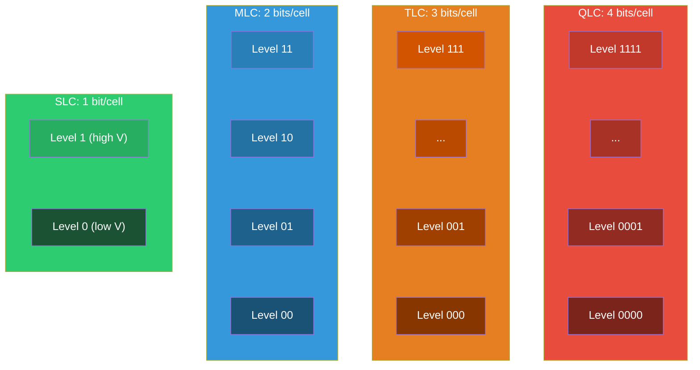
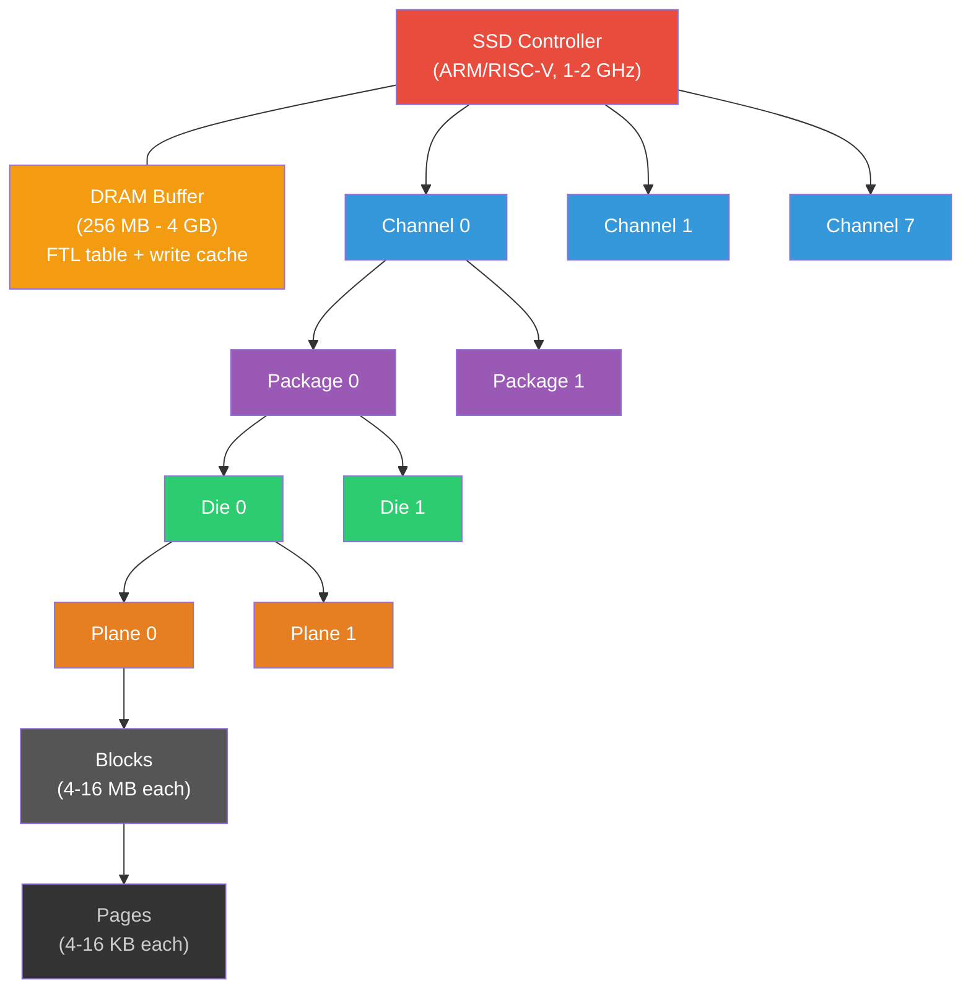
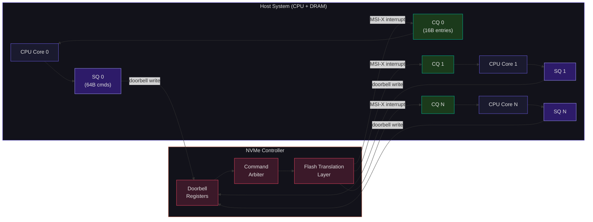
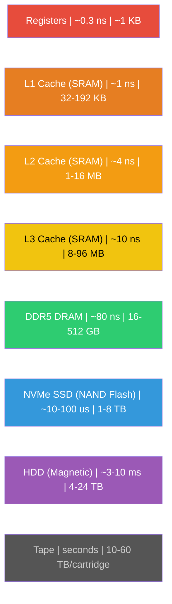

## Beyond Volatile Memory

SRAM and DRAM lose their contents when power is removed. For persistent storage — the kind that survives reboots, power failures, and decades on a shelf — we need **non-volatile** technologies. For most of computing history, that meant magnetic storage: hard disk drives (HDDs) with spinning platters and movable heads, and before them, magnetic tape. But since the 2010s, flash memory has conquered the storage world. Every smartphone, every laptop SSD, every data center boot drive, and increasingly every data center storage drive uses NAND flash.

This lecture traces the physics of flash storage, the architecture of modern SSDs, and the complete storage hierarchy from registers to tape — a span of over 10 orders of magnitude in capacity and latency.

---

## NAND Flash: Charge Trapping for Persistence

### The Floating-Gate Transistor

A flash memory cell is a modified MOSFET with an extra gate — the **floating gate** — electrically isolated between the control gate and the channel by thin oxide layers. In modern 3D NAND, the floating gate is replaced by a **charge trap layer** (silicon nitride), but the principle is the same.

To **program** (write) a cell, a high voltage (15-20V) is applied to the control gate, causing electrons to tunnel through the thin oxide barrier and become trapped in the floating gate. These trapped electrons shift the transistor's threshold voltage $V_{th}$ upward. A cell with trapped charge requires a higher gate voltage to turn on — this is how data is stored.

To **erase** a cell, a high voltage is applied to the substrate (or source), causing the trapped electrons to tunnel back out. This resets $V_{th}$ to its original (low) value. Critically, erasure happens at the **block level** — you cannot erase a single cell or page; you must erase an entire block of thousands of pages simultaneously.

To **read** a cell, a reference voltage is applied to the control gate. If the cell conducts (low $V_{th}$, no trapped charge), it reads as 1. If it does not conduct (high $V_{th}$, charge trapped), it reads as 0. This is a non-destructive operation — unlike DRAM, reading does not disturb the stored data.

### SLC, MLC, TLC, QLC: Bits Per Cell

The number of bits stored per cell determines the flash type. More bits per cell means more voltage levels, tighter margins, and worse reliability:

| Type | Bits/Cell | Voltage Levels | Endurance (P/E Cycles) | Read Latency | Write Latency | Relative Cost/GB |
|---|---|---|---|---|---|---|
| SLC | 1 | 2 | 50,000-100,000 | ~25 $\mu$s | ~200 $\mu$s | 5x |
| MLC | 2 | 4 | 3,000-10,000 | ~50 $\mu$s | ~600 $\mu$s | 3x |
| TLC | 3 | 8 | 1,000-3,000 | ~75 $\mu$s | ~1,500 $\mu$s | 1.5x |
| QLC | 4 | 16 | 100-1,000 | ~100 $\mu$s | ~3,000 $\mu$s | 1x |
| PLC | 5 | 32 | ~100 | ~150 $\mu$s | ~5,000 $\mu$s | 0.7x (emerging) |



Each additional bit roughly halves endurance and increases read/write latency by 1.5-2x. The reason is physical: more voltage levels means the voltage window between adjacent levels narrows. At QLC with 16 levels across a ~4V window, each level occupies only ~250 mV — uncomfortably close to the noise margin. Read disturb, retention loss, and program disturb all become more likely.

**My opinion**: QLC is fine for read-heavy workloads (CDN caches, media servers, archival), but for write-intensive workloads (databases, logging, build servers), TLC with a healthy over-provisioning budget is the right choice today. QLC's endurance penalty is not hypothetical — I have seen QLC drives degrade noticeably after 2 years of heavy write workloads.

<ConceptCheck id="cc-1" />

---

## Flash Operations: The Asymmetry Problem

The fundamental asymmetry of NAND flash is:

- **Read**: Fast (~25-100 $\mu$s), non-destructive, page-granularity
- **Program (write)**: Slow (~200-3000 $\mu$s), page-granularity, pages must be written sequentially within a block
- **Erase**: Very slow (~1-5 ms), **block-granularity** (must erase the entire block — typically 4-16 MB)

A page can only transition from the erased state (all 1s) to the programmed state (some bits set to 0). You cannot change a 0 back to a 1 without erasing the entire block. This asymmetry is the root cause of every complexity in SSD firmware: the Flash Translation Layer, garbage collection, wear leveling, and write amplification all exist because of this constraint.

---

## SSD Architecture

### Physical Organization

```
SSD Controller (ARM/RISC-V core, 1-2 GHz)
  |
  +-- DRAM (256 MB - 4 GB)     <-- FTL mapping table, write buffer
  |
  +-- Channel 0 -- Package 0 -- Die 0 -- Plane 0 -- Block 0 -- Page 0..N
  |                                                   Block 1
  |                                       Plane 1
  |                           Die 1
  |                Package 1
  +-- Channel 1
  +-- Channel 2
  ...
  +-- Channel 7 (consumer: 4-8 channels; enterprise: 8-32)
```

| Unit | Typical Size | Operations |
|---|---|---|
| **Page** | 4-16 KB | Smallest unit for read/write |
| **Block** | 4-16 MB (256-512 pages) | Smallest unit for erase |
| **Plane** | 1000+ blocks | Parallel operations within a die |
| **Die** | 2-4 planes | One I/O command at a time |
| **Package** | 1-16 dies | Stacked dies (3D packaging) |
| **Channel** | 1-4 packages | Controller communicates over this bus |



The SSD controller exploits parallelism at every level. By interleaving commands across channels, packages, dies, and planes, a well-designed controller can achieve thousands of times the bandwidth of a single NAND die. A modern NVMe SSD with 8 channels, 2 packages per channel, and 4 dies per package has 64 dies to interleave across — this is how consumer SSDs reach 7 GB/s sequential reads despite individual die bandwidth being only ~100 MB/s.

---

## The Flash Translation Layer (FTL)

The FTL is the most critical piece of SSD firmware. It provides the illusion of a block device (random-access, in-place updates) on top of flash memory (sequential writes, erase-before-rewrite). The FTL maps **Logical Block Addresses (LBAs)** from the host to **Physical Page Addresses (PPAs)** on the NAND.

### Mapping Schemes

| Scheme | Granularity | Table Size | Random Write Performance |
|---|---|---|---|
| **Page-level** | Per page | Large | Excellent |
| **Block-level** | Per block | Small | Poor (high write amplification) |
| **Hybrid** | Combination | Moderate | Good |

Page-level mapping for a 1 TB SSD with 4 KB pages:

$$\text{Table entries} = \frac{1 \text{ TB}}{4 \text{ KB/page}} = \frac{2^{40}}{2^{12}} = 2^{28} \approx 268 \text{ million entries}$$

$$\text{Table size} = 2^{28} \times 8 \text{ B/entry} = 2 \text{ GB}$$

This is why high-performance SSDs carry 1-2 GB of DRAM — it holds the mapping table. DRAMless SSDs (budget models) store the table in NAND and cache portions in a small SRAM buffer, with significant performance penalties for random writes.

### Garbage Collection

When the SSD runs out of free blocks, it must reclaim space through **garbage collection (GC)**:

1. **Select a victim block** containing a mix of valid and invalid (overwritten) pages
2. **Copy all valid pages** to a new block
3. **Erase the victim block**, returning it to the free pool

The **Write Amplification Factor (WAF)** measures the overhead:

$$WAF = \frac{\text{Actual NAND writes}}{\text{Host writes}}$$

Ideal WAF = 1.0 (every host write causes exactly one NAND write). In practice, WAF ranges from 1.5-3.0 for consumer workloads and can spike to 5-10 under adversarial patterns (small random writes filling the drive to capacity).

**Over-provisioning** (OP) — reserving 7-28% of total NAND capacity as a free pool — is the primary defense against high WAF. Enterprise SSDs with 28% OP maintain WAF near 1.5 even under sustained random write workloads. Consumer SSDs with 7% OP may see WAF climb above 3.0 when the drive is nearly full.

### Wear Leveling

Every NAND block has a finite number of program/erase cycles before it becomes unreliable. For TLC, this is 1,000-3,000 cycles. Wear leveling ensures all blocks wear out at approximately the same rate:

- **Dynamic wear leveling**: Distributes writes among free blocks. Simple but does not address cold (rarely written) data sitting on fresh blocks while hot data wears out a small set of blocks.
- **Static wear leveling**: Periodically moves cold data from low-wear blocks to high-wear blocks, freeing the fresh blocks for hot writes. More complex but significantly extends drive lifetime.

<ConceptCheck id="cc-2" />

---

## NVMe: The Modern Storage Protocol

NVMe (Non-Volatile Memory Express) replaced the legacy AHCI/SATA protocol for connecting SSDs. The difference is stark:

| Feature | AHCI (SATA) | NVMe |
|---|---|---|
| Max queue depth | 32 | 65,536 per queue |
| Max queues | 1 | 65,535 I/O queues |
| CPU involvement | Context switch per I/O | Direct doorbell register write |
| Protocol latency | ~6 $\mu$s | ~2.8 $\mu$s |
| IOPS (typical) | ~100K | ~1M+ |

NVMe's queue architecture deserves attention. Each queue is a pair of circular buffers in host memory: a **Submission Queue (SQ)** where the host writes 64-byte command structures, and a **Completion Queue (CQ)** where the controller writes 16-byte completion entries. The host notifies the controller of new commands by writing to a **doorbell register** — a single PCIe write, with no interrupts or context switches.

Multiple SQs can map to a single CQ. The typical configuration is one SQ/CQ pair per CPU core, eliminating lock contention entirely. With up to 65,535 I/O queues and 65,536 entries per queue, NVMe can keep millions of I/O operations in flight simultaneously — essential for saturating modern high-speed NAND.

The following diagram shows the NVMe queue architecture. Each CPU core has its own Submission/Completion queue pair, communicating with the NVMe controller through doorbell registers and MSI-X interrupts -- no locking required:



The total theoretical capacity is staggering: $65,535 \times 65,536 = 4.29 \times 10^9$ outstanding commands. No real system approaches this limit, but the headroom ensures NVMe will scale for many generations of flash technology.

---

## The Complete Storage Hierarchy

The storage hierarchy spans over 10 orders of magnitude in both capacity and latency. Here are real numbers from current (2025-2026) hardware:

| Level | Technology | Typical Size | Access Latency | Bandwidth | Cost/GB |
|---|---|---|---|---|---|
| Registers | Flip-flops (SRAM) | ~1 KB (32x 32-bit) | ~0.2-0.3 ns | N/A (on-die) | -- |
| L1 Cache | SRAM | 32-192 KB | 0.7-1.0 ns (~3-5 cycles) | ~1-2 TB/s | ~$100/GB |
| L2 Cache | SRAM | 1-16 MB | 2.5-4.0 ns (~12-15 cycles) | ~500 GB/s | ~$50/GB |
| L3 / SLC | SRAM | 8-96 MB | 5-10 ns (~20-50 cycles) | ~200-400 GB/s | ~$20/GB |
| Main Memory | DDR5 DRAM | 16-512 GB | 60-100 ns | 40-70 GB/s per channel | ~$3/GB |
| HBM | HBM3/HBM3E DRAM | 24-192 GB | ~50-80 ns | 800-1250 GB/s per stack | ~$15/GB |
| NVMe SSD | NAND Flash (TLC/QLC) | 1-8 TB | 10-100 $\mu$s | 5-14 GB/s (PCIe 5.0) | ~$0.05-0.10/GB |
| HDD | Magnetic platters | 4-24 TB | 3-10 ms | 100-250 MB/s | ~$0.015/GB |
| Tape | Magnetic tape | 10-60 TB/cartridge | seconds to minutes | 400-700 MB/s (streaming) | ~$0.005/GB |

Each level is roughly **10-100x** slower and **10-100x** cheaper per byte than the level above it. This regularity is not coincidence — it reflects the economic and physical constraints of the underlying technologies.



### Latency Comparison in Human Terms

Jeff Dean's famous "Latency Numbers Every Programmer Should Know" puts these numbers in perspective. If an L1 cache access (1 ns) were scaled to 1 second:

| Access | Real Latency | Scaled to Human Time |
|---|---|---|
| L1 cache reference | 1 ns | 1 second |
| L2 cache reference | 4 ns | 4 seconds |
| Main memory (DRAM) | 100 ns | 1.7 minutes |
| SSD random read | 16 $\mu$s | 4.4 hours |
| HDD seek | 4 ms | 46 days |
| Network round-trip (US) | 40 ms | 1.3 years |

The gap between DRAM and SSD is not "a little slower." It is the difference between waiting 2 minutes and waiting 4 hours. This is why caching matters. This is why the entire field of database systems exists: to minimize the number of times you fall off the DRAM cliff to storage.

<ConceptCheck id="cc-3" />

---

## CXL: Compute Express Link and Memory Disaggregation

### The Problem CXL Solves

Traditional servers are limited in memory capacity by the number of DIMM slots on the motherboard — typically 8-16 slots per CPU socket. For memory-hungry workloads (in-memory databases, AI inference, genome analysis), this is often insufficient. Adding more memory means buying more servers, even if CPU capacity is underutilized.

### What CXL Is

CXL (Compute Express Link) is an open industry-standard interconnect built on top of the **PCIe physical layer** (currently PCIe 6.0). It provides cache-coherent access to shared memory between CPUs, accelerators, and memory expansion devices.

CXL defines three sub-protocols:

| Protocol | Function | Example |
|---|---|---|
| **CXL.io** | Discovery, configuration, DMA | Based on PCIe transaction layer |
| **CXL.cache** | Device caches host memory coherently | SmartNIC caching CPU memory |
| **CXL.mem** | Host accesses device-attached memory | Memory expander DIMM |

### Device Types

| Type | Protocols | Example Use Case |
|---|---|---|
| **Type 1** | CXL.io + CXL.cache | SmartNICs, crypto accelerators |
| **Type 2** | CXL.io + CXL.cache + CXL.mem | GPUs, AI accelerators with their own memory |
| **Type 3** | CXL.io + CXL.mem | Memory expanders, persistent memory |

### Memory Pooling (CXL 2.0+)

CXL 2.0 introduced **memory pooling**: a shared pool of CXL-attached Type 3 memory devices that can be dynamically allocated to different servers by a Fabric Manager. A data center can maintain a pool of, say, 4 TB of CXL memory shared across 32 servers, with each server allocated memory on demand. This improves utilization dramatically — instead of every server provisioning peak memory, the pool absorbs peak demand from whichever server needs it.

### Memory Sharing (CXL 3.0)

CXL 3.0 (released August 2022, on PCIe 6.0 at 64 GT/s) takes this further: multiple hosts can **simultaneously access the same memory** with hardware-maintained coherency. This enables shared-memory programming models across physically separate servers — a fundamental shift from the message-passing model of traditional distributed systems.

The latency penalty for CXL-attached memory versus local DDR5 is approximately 150-200 ns versus 80 ns — roughly 2x. For many workloads, this is acceptable, especially when the alternative is not having enough memory at all.

---

## C File I/O Concepts and Python File Handling

At the storage level, the operating system provides file I/O abstractions. In C, `fopen()`, `fread()`, `fwrite()`, and `fclose()` provide buffered I/O — the C library maintains an internal buffer (typically 4-8 KB) and issues system calls only when the buffer fills or is explicitly flushed.

In Python, we model these concepts with built-in file operations:

```python
import struct
from typing import List, Tuple


class BufferedWriter:
    """Model a buffered file writer with configurable buffer size."""

    def __init__(self, buffer_size: int = 4096) -> None:
        self._buffer = bytearray()
        self._buffer_size = buffer_size
        self._data_store = bytearray()  # Simulates the "disk"
        self._flush_count = 0
        self._total_bytes_written = 0

    def write(self, data: bytes) -> int:
        """Write data, flushing to 'disk' when buffer is full."""
        self._buffer.extend(data)
        self._total_bytes_written += len(data)

        bytes_flushed = 0
        while len(self._buffer) >= self._buffer_size:
            # Flush one buffer-full to disk
            chunk = bytes(self._buffer[:self._buffer_size])
            self._data_store.extend(chunk)
            self._buffer = self._buffer[self._buffer_size:]
            self._flush_count += 1
            bytes_flushed += len(chunk)

        return bytes_flushed

    def flush(self) -> int:
        """Force remaining buffer contents to disk."""
        if self._buffer:
            self._data_store.extend(self._buffer)
            flushed = len(self._buffer)
            self._buffer = bytearray()
            self._flush_count += 1
            return flushed
        return 0

    @property
    def stats(self) -> dict:
        return {
            "total_bytes_written": self._total_bytes_written,
            "flush_count": self._flush_count,
            "buffer_occupancy": len(self._buffer),
            "disk_bytes": len(self._data_store),
        }


# Demonstrate buffering behavior
writer = BufferedWriter(buffer_size=64)
for i in range(20):
    record = struct.pack('=If', i, i * 3.14)  # 8 bytes each
    writer.write(record)
writer.flush()
print(f"Stats: {writer.stats}")
# 20 records * 8 bytes = 160 bytes written
# With 64-byte buffer: 2 full-buffer flushes + 1 partial flush = 3 flushes
```

The buffer size dramatically affects performance. Without buffering, each `write()` call would issue a system call (context switch to kernel, ~1-5 $\mu$s overhead). With a 4 KB buffer, system calls are reduced by 100-1000x for small writes. This is why `printf()` in C is buffered by default, and why `fflush()` exists for cases where you need immediate visibility (like writing to a log file before a potential crash).

---

## Summary

We have traced the full storage hierarchy from NAND flash cells to NVMe protocols to CXL memory pooling. Flash memory's read/write/erase asymmetry drives the complexity of SSD firmware — the FTL, garbage collection, and wear leveling are all consequences of the fundamental constraint that blocks must be erased before pages can be rewritten. NVMe replaced the SATA bottleneck with 65,535 queues and direct doorbell writes, enabling the millions of IOPS that modern NAND can deliver.

The complete storage hierarchy — registers through tape — spans 10 orders of magnitude in latency and cost. Every level exists because no single technology can be simultaneously fast, large, and cheap. The art of systems engineering is hiding this hierarchy from the programmer while exploiting it for performance.

With this week's material, you now understand every level of the memory/storage hierarchy at the circuit and protocol level. In Week 5, we will turn to instruction set architecture — the interface between hardware and software — where everything we have built so far comes together in a programmable processor.
