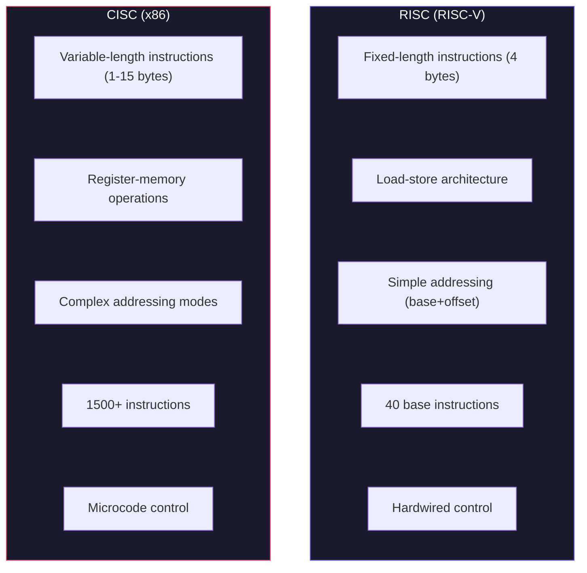
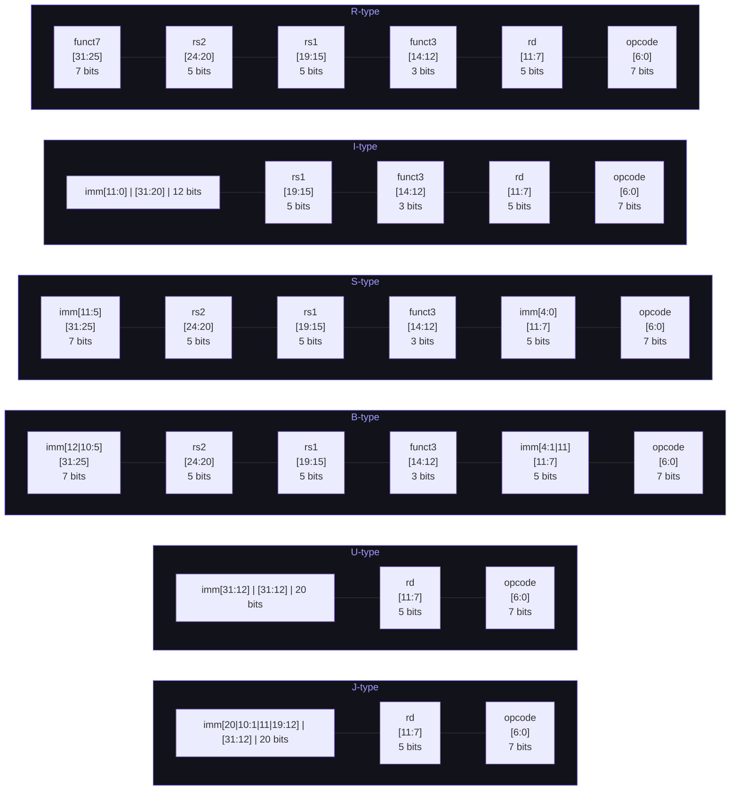
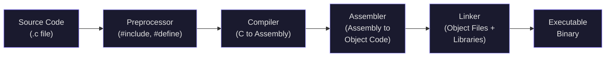

# Instruction Set Architecture: CISC, RISC, and RISC-V

Everything we have built so far — transistors, gates, adders, multiplexers, flip-flops, memory — has been **hardware**. But hardware by itself is useless without a precise contract that tells software what operations the processor supports, how data is stored, and how instructions are encoded. That contract is the **Instruction Set Architecture**, or ISA.

The ISA is arguably the most important interface in all of computing. It is the thin, precisely specified boundary between hardware and software. Everything above it — compilers, operating systems, applications — treats the ISA as a stable abstraction. Everything below it — datapath, control logic, caches, pipelines — implements the ISA in silicon. Change the ISA and you break every piece of software ever compiled for it. Implement the ISA faster and every existing program runs faster without recompilation.

This lecture covers the ISA concept, the two dominant design philosophies (CISC and RISC), and then dives deep into RISC-V — the open-source ISA that we will use for the rest of this course and for Project 2.

---

## 1. What Is an ISA?

An ISA specifies:

1. **Data types and sizes**: What are the fundamental data widths? 8-bit bytes, 16-bit halfwords, 32-bit words, 64-bit doublewords.
2. **Registers**: How many programmer-visible registers exist, and what are their sizes?
3. **Memory model**: How does the processor access memory? Byte-addressable? Word-addressable? Big-endian or little-endian?
4. **Instruction encoding**: How is each instruction represented as a binary string? What are the opcodes, register fields, and immediate fields?
5. **Instruction semantics**: What does each instruction do? If you execute `ADD x1, x2, x3`, the ISA guarantees `x1 = x2 + x3`. Period.
6. **Addressing modes**: How are memory addresses computed? Register + offset? Register + register? PC-relative?
7. **Control flow**: How do branches and jumps work? How are function calls handled?
8. **Exception model**: What happens when something goes wrong (divide by zero, page fault, illegal instruction)?

Notice what the ISA does **not** specify: clock speed, pipeline depth, cache size, branch predictor design, or whether the processor uses 5nm or 3nm transistors. These are **microarchitecture** details — implementation choices that vary between processors that all implement the same ISA.

This separation is powerful. Intel has shipped dozens of wildly different microarchitectures — from the original 8086 in 1978 to the Golden Cove cores in Alder Lake — and they all run x86 code. ARM has licensees building everything from tiny Cortex-M0 microcontrollers (32,000 gates) to Apple's M4 Ultra (over 100 billion transistors), all running ARM instructions. The ISA is the stable contract that makes this possible.

### 1.1 The Iron Law of Processor Performance

The relationship between ISA design and performance is captured by the **Iron Law**:

$$\text{Execution Time} = \text{Instructions} \times \frac{\text{Cycles}}{\text{Instruction}} \times \frac{\text{Seconds}}{\text{Cycle}}$$

Or equivalently:

$$T = N_{\text{inst}} \times \text{CPI} \times T_{\text{clk}}$$

Each factor is influenced by different design choices:

| Factor | Symbol | Influenced By |
|--------|--------|---------------|
| Instruction count | $N_{\text{inst}}$ | ISA design, compiler quality |
| Cycles per instruction | CPI | Microarchitecture (pipeline, OoO, caches) |
| Clock period | $T_{\text{clk}}$ | Circuit design, process technology |

A CISC instruction like `REP MOVSB` (repeat move string byte) on x86 can copy an entire memory block with a single instruction ($N_{\text{inst}} = 1$), but that instruction takes many cycles to complete (high CPI). A RISC approach uses a loop of simple load/store instructions ($N_{\text{inst}}$ is larger), but each instruction completes in fewer cycles (low CPI). The total execution time — the product of all three terms — is what matters.

<ConceptCheck id="cc-1" />

---

## 2. CISC vs. RISC: Two Design Philosophies

### 2.1 CISC: Complex Instruction Set Computing

The CISC philosophy, embodied by the Intel x86 family, says: **make instructions powerful so the compiler has less work to do**. CISC ISAs typically have:

- **Variable-length instructions**: x86 instructions range from 1 to 15 bytes. This complicates decoding — you cannot tell where one instruction ends and the next begins without examining the first instruction's opcode and prefix bytes.
- **Register-memory operations**: An ADD instruction can read one operand directly from memory: `ADD EAX, [RBX+4*RCX+8]`. The processor internally decomposes this into a load followed by an add.
- **Complex addressing modes**: Base + index * scale + displacement. The x86 `LEA` (load effective address) instruction supports addressing calculations like $\text{addr} = \text{base} + \text{index} \times \{1,2,4,8\} + \text{disp}$ in a single operation.
- **Many specialized instructions**: String operations (REP MOVSB), BCD arithmetic (AAA, DAA), bit scan (BSF, BSR), cryptographic primitives (AES-NI). The full x86-64 instruction set has over 1,500 distinct instructions.
- **Microcode**: Complex instructions are not implemented directly in hardware. Instead, the processor's control unit has a **micro-ROM** containing sequences of simpler micro-operations ($\mu$ops). When the decoder encounters a complex instruction, it reads the corresponding microcode sequence and dispatches those $\mu$ops to the execution units. Intel's Golden Cove core (2021) uses a 6-wide decoder that can handle up to 4 simple instructions per cycle in hardware (single-$\mu$op instructions) and routes complex instructions through a microcode sequencer.

### 2.2 RISC: Reduced Instruction Set Computing

The RISC philosophy, pioneered by David Patterson and John Hennessy at Berkeley and Stanford in the early 1980s, takes the opposite approach: **make each instruction simple, and let the compiler combine them**. RISC ISAs typically have:

- **Fixed-length instructions**: Every instruction is exactly 32 bits (4 bytes). This makes decoding trivial — you can decode multiple instructions in parallel because you always know where each one starts.
- **Load-store architecture**: Only dedicated load and store instructions access memory. All arithmetic and logic operations work exclusively on registers. `ADD x1, x2, x3` means "add the values in registers x2 and x3, and put the result in register x1." No memory access is hidden inside arithmetic instructions.
- **Large register file**: RISC machines typically have 32 general-purpose registers (compared to 8 in the original x86, expanded to 16 in x86-64). More registers mean fewer loads and stores, because values can stay in registers longer.
- **Simple addressing modes**: Usually just base + offset: `LW x1, 12(x2)` loads a word from address `x2 + 12`. No base + index * scale + displacement complexity.
- **Hardwired control**: Most instructions are implemented directly in hardware logic, not microcode. This allows single-cycle execution in a pipelined processor.

### 2.3 CISC vs RISC at a Glance



### 2.4 The Historical Debate

The RISC-vs-CISC debate raged through the 1980s and 1990s. Patterson and Ditzel's 1980 paper "The Case for the Reduced Instruction Set Computer" in *ACM SIGARCH Computer Architecture News* laid out the argument: complex instructions were rarely used by compilers, yet they consumed die area and complicated the control logic. Measurements on VAX programs showed that simple instructions like LOAD, STORE, ADD, BRANCH accounted for the vast majority of executed instructions.

The debate was effectively settled by a **convergence**: modern x86 processors are RISC internally. Intel's P6 microarchitecture (Pentium Pro, 1995) introduced the approach of cracking complex CISC instructions into simple RISC-like $\mu$ops, feeding those into an out-of-order execution engine. Every Intel and AMD processor since then has been a RISC machine wearing a CISC disguise. The x86 ISA persists not because it is well-designed — it is emphatically not — but because of the enormous ecosystem of existing software.

<ConceptCheck id="cc-2" />

---

## 3. RISC-V: The Open Standard

### 3.1 History and Motivation

RISC-V (pronounced "risk five") was created at UC Berkeley starting in 2010 by Krste Asanovic, David Patterson (yes, the same Patterson who co-invented RISC), and their students Andrew Waterman, Yunsup Lee, and others. The "V" stands for the fifth RISC ISA designed at Berkeley (after RISC-I, RISC-II, SOAR, and SPUR).

The motivation was simple: every existing ISA was proprietary. ARM charges license fees. x86 is locked behind Intel and AMD's patent portfolios. MIPS was fading commercially. SPARC was effectively dead. Teaching computer architecture required using an ISA controlled by a corporation that could change the licensing terms at any time.

RISC-V is **open-source and royalty-free**. The specification is freely available. Anyone can build a RISC-V processor without paying licensing fees. This has led to an explosion of implementations: from tiny 2-stage cores for embedded systems to SiFive's multi-core application processors, to research projects exploring novel microarchitectures.

As of 2025, RISC-V has shipped in over 10 billion cores, primarily in embedded and IoT applications. The RISC-V International foundation (founded 2015, restructured 2020) manages the specification with over 4,000 members across 70+ countries.

### 3.2 Modularity

RISC-V is **modular**. The base ISA is small, and functionality is added through **standard extensions**:

| Extension | Description |
|-----------|-------------|
| **RV32I** | Base integer instructions (40 instructions) |
| **M** | Integer multiply/divide |
| **A** | Atomic operations (for multicore) |
| **F** | Single-precision floating point |
| **D** | Double-precision floating point |
| **C** | Compressed 16-bit instructions |
| **V** | Vector operations |
| **Zicsr** | Control and status registers |

The combination **RV32IMFD** (or equivalently **RV32G** for "general purpose") is the standard configuration for application processors. We will focus on **RV32I** — the base integer ISA with just 40 instructions — because it is sufficient to understand processor design, and it is what you will implement in Project 2.

---

## 4. RV32I Instruction Formats

All RV32I instructions are exactly 32 bits wide and must be aligned on a 4-byte boundary. There are six instruction formats. A crucial design principle: **the register fields (rs1, rs2, rd) are always in the same bit positions across all formats**. This means the decode hardware can begin reading registers before it has fully determined the instruction type — a property that simplifies pipelined implementations enormously.

The opcode field occupies bits [6:0] in every format.

The following diagram shows how the six formats arrange their fields within the 32-bit instruction word. Notice that rs1, rs2, and rd always occupy the same bit positions across formats, enabling register reads before decode completes.



### 4.1 R-type (Register-Register)

```
 31        25  24    20  19    15  14  12  11     7  6      0
 ┌──────────┬─────────┬─────────┬───────┬─────────┬─────────┐
 │  funct7  │   rs2   │   rs1   │funct3 │   rd    │ opcode  │
 │  [31:25] │ [24:20] │ [19:15] │[14:12]│ [11:7]  │  [6:0]  │
 └──────────┴─────────┴─────────┴───────┴─────────┴─────────┘
     7 bits    5 bits    5 bits   3 bits   5 bits    7 bits
```

R-type instructions perform arithmetic and logic between two source registers, writing the result to a destination register. The 7-bit `funct7` field and 3-bit `funct3` field together determine the specific operation. All R-type instructions share the opcode `0110011`.

| Instruction | funct7 | funct3 | Operation |
|-------------|--------|--------|-----------|
| ADD | 0000000 | 000 | rd = rs1 + rs2 |
| SUB | 0100000 | 000 | rd = rs1 - rs2 |
| SLL | 0000000 | 001 | rd = rs1 << rs2[4:0] |
| SLT | 0000000 | 010 | rd = (rs1 < rs2) ? 1 : 0 (signed) |
| SLTU | 0000000 | 011 | rd = (rs1 < rs2) ? 1 : 0 (unsigned) |
| XOR | 0000000 | 100 | rd = rs1 ^ rs2 |
| SRL | 0000000 | 101 | rd = rs1 >> rs2[4:0] (logical) |
| SRA | 0100000 | 101 | rd = rs1 >> rs2[4:0] (arithmetic) |
| OR | 0000000 | 110 | rd = rs1 \| rs2 |
| AND | 0000000 | 111 | rd = rs1 & rs2 |

Notice that ADD and SUB differ only in bit 30 (the second bit of funct7). Similarly, SRL and SRA differ only in bit 30. This is not an accident — it means the ALU can use bit 30 as a "negate" or "arithmetic shift" control signal, simplifying hardware.

### 4.2 I-type (Immediate)

```
 31                 20  19    15  14  12  11     7  6      0
 ┌─────────────────────┬───────┬───────┬─────────┬─────────┐
 │     imm[11:0]       │  rs1  │funct3 │   rd    │ opcode  │
 │      [31:20]        │[19:15]│[14:12]│ [11:7]  │  [6:0]  │
 └─────────────────────┴───────┴───────┴─────────┴─────────┘
         12 bits         5 bits  3 bits   5 bits    7 bits
```

I-type provides a 12-bit immediate that is always **sign-extended** to 32 bits. The most-significant bit of the immediate is always bit 31 of the instruction — again, a deliberate design choice so that sign-extension hardware can start working immediately.

I-type is used for three groups of instructions with different opcodes:

**Arithmetic Immediate** (opcode `0010011`):

| Instruction | funct3 | Operation |
|-------------|--------|-----------|
| ADDI | 000 | rd = rs1 + sign_ext(imm) |
| SLTI | 010 | rd = (rs1 < sign_ext(imm)) ? 1 : 0 (signed) |
| SLTIU | 011 | rd = (rs1 < sign_ext(imm)) ? 1 : 0 (unsigned) |
| XORI | 100 | rd = rs1 ^ sign_ext(imm) |
| ORI | 110 | rd = rs1 \| sign_ext(imm) |
| ANDI | 111 | rd = rs1 & sign_ext(imm) |
| SLLI | 001 | rd = rs1 << shamt (imm[4:0]) |
| SRLI | 101 | rd = rs1 >> shamt (logical, imm[11:5]=0000000) |
| SRAI | 101 | rd = rs1 >> shamt (arithmetic, imm[11:5]=0100000) |

**Load** (opcode `0000011`):

| Instruction | funct3 | Operation |
|-------------|--------|-----------|
| LB | 000 | rd = sign_ext(mem[rs1 + imm][7:0]) |
| LH | 001 | rd = sign_ext(mem[rs1 + imm][15:0]) |
| LW | 010 | rd = mem[rs1 + imm][31:0] |
| LBU | 100 | rd = zero_ext(mem[rs1 + imm][7:0]) |
| LHU | 101 | rd = zero_ext(mem[rs1 + imm][15:0]) |

**JALR** (opcode `1100111`): `rd = PC + 4; PC = (rs1 + sign_ext(imm)) & ~1`

### 4.3 S-type (Store)

```
 31        25  24    20  19    15  14  12  11     7  6      0
 ┌──────────┬─────────┬─────────┬───────┬─────────┬─────────┐
 │ imm[11:5]│   rs2   │   rs1   │funct3 │imm[4:0] │ opcode  │
 │  [31:25] │ [24:20] │ [19:15] │[14:12]│ [11:7]  │  [6:0]  │
 └──────────┴─────────┴─────────┴───────┴─────────┴─────────┘
     7 bits    5 bits    5 bits   3 bits   5 bits    7 bits
```

Stores have no destination register (they write to memory, not to a register), so the `rd` field is repurposed to hold the lower 5 bits of the immediate. The upper 7 bits come from what would be the `funct7` field. This split keeps rs1 and rs2 in the same bit positions as R-type instructions. Opcode is `0100011`.

| Instruction | funct3 | Operation |
|-------------|--------|-----------|
| SB | 000 | mem[rs1 + imm][7:0] = rs2[7:0] |
| SH | 001 | mem[rs1 + imm][15:0] = rs2[15:0] |
| SW | 010 | mem[rs1 + imm][31:0] = rs2[31:0] |

### 4.4 B-type (Branch)

```
 31    30      25  24    20  19    15  14  12  11    8   7    6      0
 ┌───┬──────────┬─────────┬─────────┬───────┬───────┬────┬──────────┐
 │[12]│ imm[10:5]│   rs2   │   rs1   │funct3 │[4:1]  │[11]│  opcode  │
 └───┴──────────┴─────────┴─────────┴───────┴───────┴────┴──────────┘
  1b     6 bits    5 bits    5 bits   3 bits  4 bits  1b    7 bits
```

Branch instructions compare two registers and, if the condition is true, jump to `PC + sign_ext(imm)`. The immediate encodes a signed offset in **multiples of 2 bytes**, giving a range of $\pm 4$ KiB. The immediate bits are scrambled — [12|10:5|4:1|11] — to keep bit 31 as the sign bit and to maximize overlap with S-type immediate placement. Opcode is `1100011`.

| Instruction | funct3 | Condition |
|-------------|--------|-----------|
| BEQ | 000 | Branch if rs1 == rs2 |
| BNE | 001 | Branch if rs1 != rs2 |
| BLT | 100 | Branch if rs1 < rs2 (signed) |
| BGE | 101 | Branch if rs1 >= rs2 (signed) |
| BLTU | 110 | Branch if rs1 < rs2 (unsigned) |
| BGEU | 111 | Branch if rs1 >= rs2 (unsigned) |

### 4.5 U-type (Upper Immediate)

```
 31                                   12  11     7  6      0
 ┌───────────────────────────────────────┬─────────┬─────────┐
 │            imm[31:12]                 │   rd    │ opcode  │
 │             [31:12]                   │ [11:7]  │  [6:0]  │
 └───────────────────────────────────────┴─────────┴─────────┘
                 20 bits                   5 bits    7 bits
```

U-type provides a 20-bit immediate that fills the upper 20 bits of a 32-bit value.

| Instruction | Opcode | Operation |
|-------------|--------|-----------|
| LUI | 0110111 | rd = imm << 12 |
| AUIPC | 0010111 | rd = PC + (imm << 12) |

Together, LUI + ADDI can construct any arbitrary 32-bit constant in two instructions. AUIPC + JALR can jump to any 32-bit address. This two-instruction pattern replaces what would require a single complex instruction (with a 32-bit immediate) in a CISC ISA.

### 4.6 J-type (Jump)

```
 31    30          21  20  19          12  11     7  6      0
 ┌───┬──────────────┬───┬──────────────┬─────────┬─────────┐
 │[20]│  imm[10:1]   │[11]│  imm[19:12]  │   rd    │ opcode  │
 └───┴──────────────┴───┴──────────────┴─────────┴─────────┘
  1b     10 bits      1b     8 bits       5 bits    7 bits
```

JAL (jump and link, opcode `1101111`) saves `PC + 4` into `rd` and jumps to `PC + sign_ext(imm)`. The immediate is in multiples of 2 bytes, providing a $\pm 1$ MiB range. The immediate bits are again scrambled [20|10:1|11|19:12] to keep the sign bit at position 31.

### 4.7 System Instructions

| Instruction | Opcode | imm[11:0] | Operation |
|-------------|--------|-----------|-----------|
| ECALL | 1110011 | 000000000000 | System call trap |
| EBREAK | 1110011 | 000000000001 | Debugger breakpoint |
| FENCE | 0001111 | - | Memory ordering fence |

<ConceptCheck id="cc-3" />

---

## 5. Understanding Immediate Encoding

One of the most confusing aspects of RISC-V for newcomers is why the immediate bits are scrambled in B-type and J-type instructions. The answer is **hardware simplicity**.

Consider what the processor must do during decode: it needs to extract the immediate and sign-extend it. By keeping bit 31 of the instruction as the sign bit in **every** format, the sign-extension circuit is trivial — just replicate bit 31 upward. The remaining bits are arranged so that most of them overlap with the positions in other formats, reducing the number of multiplexers needed in the immediate-generation hardware.

Let us trace the immediate for each format:

| Bit Position | R-type | I-type | S-type | B-type | U-type | J-type |
|---|---|---|---|---|---|---|
| inst[31] | funct7[6] | imm[11] | imm[11] | imm[12] | imm[31] | imm[20] |
| inst[30:25] | funct7[5:0] | imm[10:5] | imm[10:5] | imm[10:5] | imm[30:25] | imm[10:5] |
| inst[24:21] | rs2 | imm[4:1] | rs2 | rs2 | imm[24:21] | imm[4:1] |
| inst[20] | rs2 | imm[0] | rs2 | rs2 | imm[20] | imm[11] |
| inst[19:12] | - | - | - | - | imm[19:12] | imm[19:12] |
| inst[11:8] | - | - | imm[3:0] | imm[4:1] | - | - |
| inst[7] | rd | rd | imm[0] | imm[11] | rd | rd |

Notice that inst[30:25] always provides the same immediate bits (imm[10:5]) in I-type, S-type, and B-type. And inst[31] is always the sign bit. This regularity is the key to efficient decoding.

Here is a Python implementation that demonstrates immediate extraction:

```python
from typing import Dict

def extract_immediate(instruction: int, fmt: str) -> int:
    """Extract and sign-extend the immediate from a RISC-V instruction."""
    if fmt == 'I':
        imm = (instruction >> 20) & 0xFFF  # bits [31:20]
        if imm & 0x800:  # sign bit (bit 11)
            imm |= 0xFFFFF000  # sign extend to 32 bits
    elif fmt == 'S':
        imm = ((instruction >> 25) & 0x7F) << 5  # imm[11:5]
        imm |= (instruction >> 7) & 0x1F          # imm[4:0]
        if imm & 0x800:
            imm |= 0xFFFFF000
    elif fmt == 'B':
        imm = ((instruction >> 31) & 0x1) << 12   # imm[12]
        imm |= ((instruction >> 7) & 0x1) << 11   # imm[11]
        imm |= ((instruction >> 25) & 0x3F) << 5  # imm[10:5]
        imm |= ((instruction >> 8) & 0xF) << 1    # imm[4:1]
        # bit 0 is always 0 (2-byte aligned)
        if imm & 0x1000:
            imm |= 0xFFFFE000
    elif fmt == 'U':
        imm = instruction & 0xFFFFF000  # imm[31:12] already in position
    elif fmt == 'J':
        imm = ((instruction >> 31) & 0x1) << 20   # imm[20]
        imm |= ((instruction >> 12) & 0xFF) << 12 # imm[19:12]
        imm |= ((instruction >> 20) & 0x1) << 11  # imm[11]
        imm |= ((instruction >> 21) & 0x3FF) << 1 # imm[10:1]
        if imm & 0x100000:
            imm |= 0xFFE00000
    else:
        raise ValueError(f"Unknown format: {fmt}")

    # Convert to signed 32-bit
    if imm & 0x80000000:
        imm -= 0x100000000
    return imm
```

---

## 6. Addressing Modes in RISC-V

RISC-V has a remarkably small set of addressing modes compared to CISC architectures:

| Mode | Syntax | Address Calculation | Used By |
|------|--------|-------------------|---------|
| Immediate | `ADDI x1, x2, 42` | Operand = sign_ext(imm) | I-type arithmetic |
| Register | `ADD x1, x2, x3` | Operand = Register[rs2] | R-type |
| Base + Offset | `LW x1, 8(x2)` | Address = Register[rs1] + sign_ext(imm) | Loads, Stores |
| PC-relative | `BEQ x1, x2, label` | Target = PC + sign_ext(imm) | Branches, JAL |
| Upper Immediate | `LUI x1, 0x12345` | Result = imm << 12 | LUI, AUIPC |

Contrast this with x86, which supports base + index * scale + displacement (4 components in a single addressing mode). RISC-V's simplicity is deliberate: fewer addressing modes mean simpler decode hardware, simpler AGU (address generation unit), and easier formal verification.

---

## 7. Building Constants and Addresses

Since RISC-V uses fixed 32-bit instructions, there is not enough room to encode a full 32-bit constant in a single instruction. Instead, RISC-V uses a **two-instruction pattern**:

**Loading a 32-bit constant:**

```
LUI  x1, 0x12345     # x1 = 0x12345000
ADDI x1, x1, 0x678   # x1 = 0x12345678
```

There is a subtlety here. ADDI sign-extends its 12-bit immediate. If the lower 12 bits of your target constant have bit 11 set (i.e., the value is 0x800 or greater), sign extension will subtract 0x1000 from the intended value. The assembler handles this by adding 1 to the upper immediate:

If you want to load `0x12345800`:
```
LUI  x1, 0x12346     # x1 = 0x12346000 (note: 12346, not 12345)
ADDI x1, x1, -2048   # -2048 = 0xFFFFF800, so x1 = 0x12346000 + 0xFFFFF800 = 0x12345800
```

This is exactly what the `li` (load immediate) pseudo-instruction does automatically.

**PC-relative addressing:**

```
AUIPC x1, 0x12345    # x1 = PC + 0x12345000
JALR  x0, x1, 0x678  # Jump to x1 + 0x678 = PC + 0x12345678
```

This gives a full $\pm 2$ GiB range from the current PC, which is sufficient for position-independent code.

---

## 8. RISC-V Design Principles

The RISC-V specification (Chapter 2, Version 2.1) explicitly states several design principles that guided the instruction encoding:

1. **Fixed register positions:** rs1 is always bits [19:15], rs2 is always bits [24:20], rd is always bits [11:7]. This allows the register file read to begin before decode is complete.

2. **Sign bit always at position 31:** In every format with an immediate, bit 31 of the instruction is the sign bit. Sign extension is just replicating one bit.

3. **Minimalism:** The base ISA has only 40 instructions. A simple implementation need only handle about 38 unique operations (treating ECALL/EBREAK as a single SYSTEM trap and FENCE as a NOP in a single-core system).

4. **Orthogonality:** There is no "SUBI" instruction because `ADDI x1, x2, -N` accomplishes the same thing. There is no "NOT" instruction because `XORI x1, x2, -1` inverts all bits.

5. **x0 is hardwired to zero:** Register x0 always reads as zero and writes to it are discarded. This eliminates the need for many special instructions. `ADDI x0, x0, 0` is the canonical NOP. `ADD x0, x1, x0` discards a result. `SUB x1, x0, x2` negates a value.

<ConceptCheck id="cc-4" />

---

## 9. Pseudo-Instructions

The RISC-V assembler supports pseudo-instructions that expand into one or more real instructions. These make assembly programming more convenient without adding hardware complexity:

| Pseudo-instruction | Expansion | Meaning |
|---|---|---|
| `NOP` | `ADDI x0, x0, 0` | No operation |
| `MV rd, rs` | `ADDI rd, rs, 0` | Move (copy register) |
| `LI rd, imm` | `LUI rd, upper` + `ADDI rd, rd, lower` | Load immediate (32-bit) |
| `LA rd, symbol` | `AUIPC rd, upper` + `ADDI rd, rd, lower` | Load address |
| `NOT rd, rs` | `XORI rd, rs, -1` | Bitwise NOT |
| `NEG rd, rs` | `SUB rd, x0, rs` | Two's complement negate |
| `J offset` | `JAL x0, offset` | Unconditional jump (no link) |
| `JR rs` | `JALR x0, rs, 0` | Jump to register |
| `RET` | `JALR x0, ra, 0` | Return from function |
| `CALL offset` | `AUIPC x1, upper` + `JALR ra, x1, lower` | Call far function |
| `BEQZ rs, offset` | `BEQ rs, x0, offset` | Branch if equal to zero |
| `BNEZ rs, offset` | `BNE rs, x0, offset` | Branch if not zero |
| `BGT rs, rt, offset` | `BLT rt, rs, offset` | Branch if greater than (swap operands) |
| `SEQZ rd, rs` | `SLTIU rd, rs, 1` | Set if equal to zero |

The fact that so many "missing" instructions can be synthesized from existing ones — using x0 as a zero source, swapping operands, or using immediate -1 — is a testament to the orthogonal design of RV32I.

---

## 10. Python Simulation: Instruction Encoding

Let us write a Python encoder that converts assembly-like instruction descriptions into 32-bit binary:

```python
from dataclasses import dataclass
from typing import Optional

# Opcode constants for RV32I
OPCODES = {
    'R_TYPE':  0b0110011,
    'I_ARITH': 0b0010011,
    'LOAD':    0b0000011,
    'STORE':   0b0100011,
    'BRANCH':  0b1100011,
    'JAL':     0b1101111,
    'JALR':    0b1100111,
    'LUI':     0b0110111,
    'AUIPC':   0b0010111,
}

R_TYPE_FUNCTS = {
    'ADD':  (0b0000000, 0b000),
    'SUB':  (0b0100000, 0b000),
    'SLL':  (0b0000000, 0b001),
    'SLT':  (0b0000000, 0b010),
    'SLTU': (0b0000000, 0b011),
    'XOR':  (0b0000000, 0b100),
    'SRL':  (0b0000000, 0b101),
    'SRA':  (0b0100000, 0b101),
    'OR':   (0b0000000, 0b110),
    'AND':  (0b0000000, 0b111),
}

def encode_r_type(mnemonic: str, rd: int, rs1: int, rs2: int) -> int:
    """Encode an R-type instruction as a 32-bit integer."""
    funct7, funct3 = R_TYPE_FUNCTS[mnemonic]
    instruction = (funct7 << 25) | (rs2 << 20) | (rs1 << 15) | \
                  (funct3 << 12) | (rd << 7) | OPCODES['R_TYPE']
    return instruction

def to_binary_string(instruction: int) -> str:
    """Format a 32-bit instruction as a binary string with field separators."""
    bits = f"{instruction:032b}"
    return f"{bits[0:7]}_{bits[7:12]}_{bits[12:17]}_{bits[17:20]}_{bits[20:25]}_{bits[25:32]}"

# Example: ADD x1, x2, x3
encoded = encode_r_type('ADD', rd=1, rs1=2, rs2=3)
print(f"ADD x1, x2, x3 = 0x{encoded:08X}")
print(f"Binary: {to_binary_string(encoded)}")
# Output: ADD x1, x2, x3 = 0x003100B3
# Binary: 0000000_00011_00010_000_00001_0110011
```

The emulator you build here becomes the foundation for Project 2. In that project, you will extend this encoding logic into a full instruction decoder that drives a simulated datapath.

---

## 11. The Compilation Pipeline

Before examining ISA design decisions, it is worth understanding how high-level code becomes the binary instructions we have been studying. The transformation passes through four stages:



Each stage performs a precise translation: the preprocessor expands macros and includes, the compiler translates C to assembly, the assembler converts assembly to machine code (the binary encodings we studied above), and the linker resolves cross-file references to produce a final executable. We will explore this pipeline in depth next lecture.

---

## 12. Comparing ISA Design Decisions

Let us summarize the fundamental design tradeoffs:

| Property | x86-64 (CISC) | ARM (RISC) | RISC-V (RISC) |
|----------|--------------|------------|----------------|
| Instruction length | 1-15 bytes | 4 bytes (A64) | 4 bytes (RV32I) |
| General registers | 16 (RAX-R15) | 31 (X0-X30) | 31 (x1-x31, x0=zero) |
| Memory operations | Any instruction | Load/Store only | Load/Store only |
| Addressing modes | 7+ | 9 (A64) | 3 |
| Instruction count | ~1500+ | ~1000+ (A64) | 40 (RV32I base) |
| Control approach | Microcode + HW | Hardwired | Hardwired |
| License | Proprietary (Intel/AMD) | Proprietary (ARM Ltd) | Open (royalty-free) |
| Endianness | Little | Configurable | Little |
| Zero register | No | XZR (X31) | x0 (hardwired) |

The simplicity of RISC-V is not a limitation — it is a feature. Every additional instruction in the ISA adds decode logic, increases verification complexity, and may lengthen the critical path. RISC-V proves that 40 instructions, designed orthogonally, are sufficient for general-purpose computing.

---

## Summary

The ISA is the fundamental contract between hardware and software. CISC architectures (x86) pack complexity into instructions; RISC architectures (ARM, RISC-V) push complexity to the compiler. Modern CISC processors are internally RISC machines with a CISC decoder bolted on top.

RISC-V provides an ideal pedagogical and practical ISA: open-source, minimal (40 base instructions), orthogonal (x0 as zero eliminates many special cases), and designed with hardware implementation in mind (fixed register positions, sign bit always at bit 31). Its six instruction formats — R, I, S, B, U, J — encode all operations needed for general-purpose computing.

Next lecture, we will write assembly programs using these instructions and trace the full compilation pipeline from high-level source code to executable binary.
