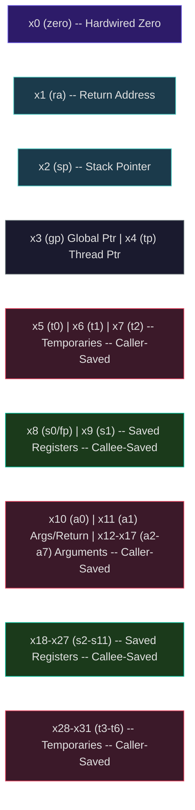
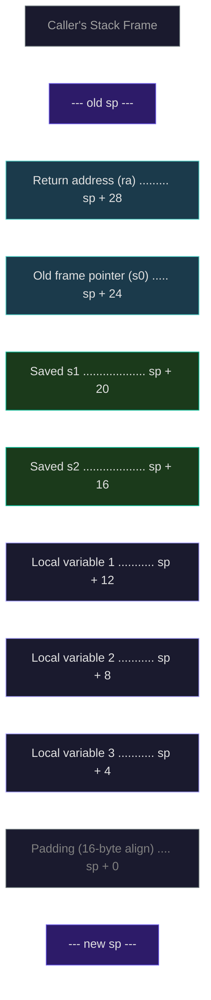
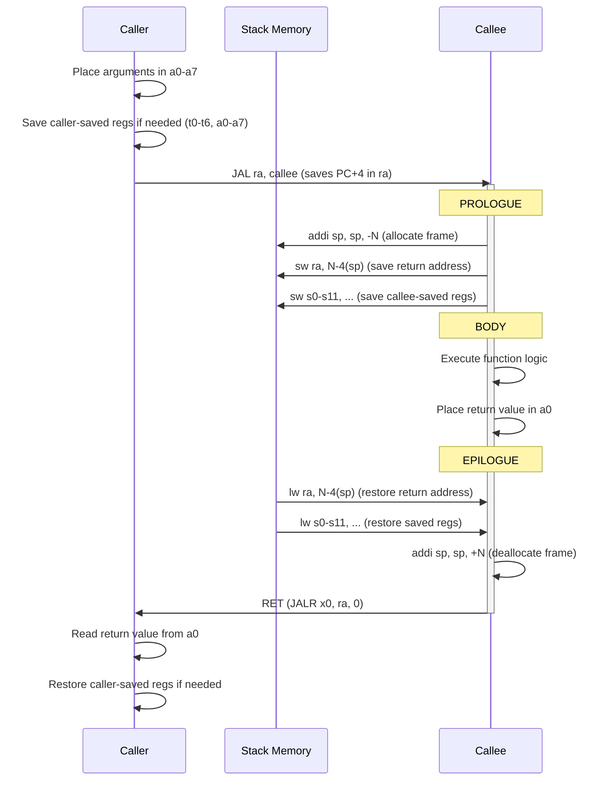
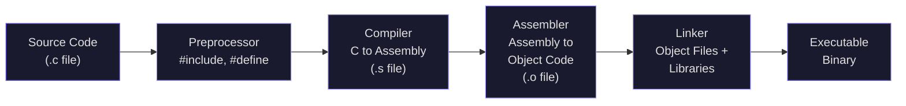

# RISC-V Assembly Programming and the Compilation Pipeline

Last lecture we defined the ISA contract and examined the six instruction formats of RV32I. Now we put those instructions to work. This lecture teaches you to think in assembly — to see the machine-level operations that every high-level program decomposes into. By the end, you will be able to hand-translate C functions into RISC-V assembly and trace the full pipeline from source code to executable binary.

This is not an abstract exercise. The emulator you build here becomes the foundation for Project 2, where you will implement a functional RV32I processor that decodes and executes these exact instructions.

---

## 1. The RISC-V Register File

The RISC-V RV32I architecture provides 32 registers, each 32 bits wide, named `x0` through `x31`. The register file is the processor's fastest storage — reading a register takes a fraction of a nanosecond, while accessing main memory takes tens of nanoseconds. The calling convention assigns specific roles to each register. The diagram below shows the full register file with color-coded roles:



| Register | ABI Name | Role | Saved By |
|----------|----------|------|----------|
| x0 | `zero` | Hardwired zero (reads as 0, writes ignored) | — |
| x1 | `ra` | Return address | Caller |
| x2 | `sp` | Stack pointer | Callee |
| x3 | `gp` | Global pointer | — |
| x4 | `tp` | Thread pointer | — |
| x5-x7 | `t0-t2` | Temporaries | Caller |
| x8 | `s0`/`fp` | Saved register / frame pointer | Callee |
| x9 | `s1` | Saved register | Callee |
| x10-x11 | `a0-a1` | Function arguments / return values | Caller |
| x12-x17 | `a2-a7` | Function arguments | Caller |
| x18-x27 | `s2-s11` | Saved registers | Callee |
| x28-x31 | `t3-t6` | Temporaries | Caller |

### 1.1 Caller-Saved vs. Callee-Saved

This distinction is fundamental to understanding function calls. When function `A` calls function `B`:

- **Caller-saved registers** (`ra`, `t0-t6`, `a0-a7`): Function `B` is free to overwrite these. If `A` needs their values after the call, `A` must save them to the stack before calling `B` and restore them afterward.

- **Callee-saved registers** (`sp`, `s0-s11`): Function `B` promises to preserve these. If `B` wants to use any of them, `B` must save the old values on entry and restore them before returning.

The intuition: temporaries (`t` registers) and arguments (`a` registers) are expected to change across calls, so the caller saves them if needed. Saved registers (`s` registers) persist across calls, so the callee preserves them. This division minimizes total save/restore operations — most functions only need a few saved registers, and most callers do not need every temporary preserved.

### 1.2 The Zero Register

Register `x0` (`zero`) is hardwired to the value 0. Any write to x0 is silently discarded. This single design choice eliminates dozens of special-purpose instructions:

```
MV  rd, rs    →  ADDI rd, rs, 0     # Copy register (add zero)
NOP           →  ADDI x0, x0, 0     # No operation (write to zero)
NEG rd, rs    →  SUB  rd, x0, rs    # Negate (subtract from zero)
NOT rd, rs    →  XORI rd, rs, -1    # Invert (XOR with all ones)
SEQZ rd, rs   →  SLTIU rd, rs, 1    # Set if zero (is rs < 1 unsigned?)
J   offset    →  JAL  x0, offset    # Jump without linking (discard PC+4)
RET           →  JALR x0, ra, 0     # Return (jump to ra, discard PC+4)
```

<ConceptCheck id="cc-1" />

---

## 2. Assembly Programming Patterns

### 2.1 Arithmetic Expressions

Consider the C expression `x = (a + b) * c - d`, where variables are in registers `a0` through `a3`:

```
# x = (a + b) * c - d
# Assume: a=a0, b=a1, c=a2, d=a3, result in a0
# (We need the M extension for MUL, but let's assume it's available)
add  t0, a0, a1     # t0 = a + b
mul  t1, t0, a2     # t1 = (a + b) * c     [requires M extension]
sub  a0, t1, a3     # a0 = (a + b) * c - d
```

Without the M extension, multiplication must be done through repeated addition or a shift-and-add loop — which is exactly what Project 2 may require you to implement.

For pure RV32I (no multiply instruction), consider `x = a * 5`:

```
# x = a * 5 = a * 4 + a = (a << 2) + a
slli t0, a0, 2      # t0 = a * 4
add  a0, t0, a0     # a0 = a * 4 + a = a * 5
```

Compilers use this trick extensively — multiplication by any constant can be decomposed into shifts and adds.

### 2.2 If-Else Statements

Consider:
```c
if (a == b) {
    x = a + 1;
} else {
    x = b - 1;
}
```

In assembly, the control flow inverts: we branch to skip the "then" block:

```
# a=a0, b=a1, x=a0 (result)
    bne  a0, a1, else    # if a != b, skip to else
    addi a0, a0, 1       # x = a + 1  (then block)
    j    end_if           # skip else block
else:
    addi a0, a1, -1      # x = b - 1  (else block)
end_if:
```

Notice the **inversion**: the C code says `if (a == b)`, but the assembly branches on the **opposite** condition (`bne` — branch if NOT equal) to skip the then-block. This is a universal pattern in assembly programming. The branch instruction acts as a guard that jumps **past** the code that should only execute when the condition is true.

### 2.3 Loops

**For loop**: `for (int i = 0; i < n; i++) { sum += arr[i]; }`

```
# a0 = pointer to arr, a1 = n, result in a0
    li   t0, 0           # i = 0
    li   t1, 0           # sum = 0
loop:
    bge  t0, a1, done    # if i >= n, exit loop
    slli t2, t0, 2       # t2 = i * 4 (byte offset, assuming 32-bit ints)
    add  t3, a0, t2      # t3 = &arr[i]
    lw   t4, 0(t3)       # t4 = arr[i]
    add  t1, t1, t4      # sum += arr[i]
    addi t0, t0, 1       # i++
    j    loop             # repeat
done:
    mv   a0, t1          # return sum in a0
```

**While loop**: `while (x > 0) { x = x / 2; count++; }`

```
# a0 = x, result (count) in a0
    li   t0, 0           # count = 0
while:
    ble  a0, zero, done  # if x <= 0, exit  (pseudo: bge zero, a0, done)
    srai a0, a0, 1       # x = x / 2 (arithmetic right shift)
    addi t0, t0, 1       # count++
    j    while
done:
    mv   a0, t0          # return count
```

The assembly `ble` is a pseudo-instruction that expands to `bge x0, a0, done` (branch if 0 >= x).

### 2.4 Array Access

Arrays in assembly are pure pointer arithmetic. If `arr` is an array of 32-bit integers starting at address held in register `a0`, then `arr[i]` is at address `a0 + i * 4`:

```
# Load arr[5] into t0, where arr base is in a0
li   t1, 5           # index
slli t1, t1, 2       # byte offset = 5 * 4 = 20
add  t1, a0, t1      # address of arr[5]
lw   t0, 0(t1)       # t0 = arr[5]

# Equivalently, if the index is a known constant:
lw   t0, 20(a0)      # t0 = arr[5] directly (offset 20 = 5*4)
```

<ConceptCheck id="cc-2" />

---

## 3. Function Calls and the Stack

### 3.1 The Calling Convention in Action

Function calls in RISC-V follow a rigid protocol:

1. **Caller places arguments** in `a0-a7`. Additional arguments go on the stack.
2. **Caller executes** `JAL ra, function` — this saves `PC + 4` in `ra` and jumps to the function.
3. **Callee prologue**: allocate stack frame, save `ra` and any callee-saved registers (`s0-s11`) that will be used.
4. **Callee body**: execute the function logic.
5. **Callee epilogue**: restore saved registers, deallocate stack frame.
6. **Callee returns** with `RET` (which is `JALR x0, ra, 0`).
7. **Caller reads return value** from `a0` (and `a1` for 64-bit values).

### 3.2 Stack Frame Layout

The stack grows **downward** (toward lower addresses). The stack pointer `sp` must always be **16-byte aligned**. The following diagram shows how a typical stack frame is organized:



A typical stack frame:

```
High addresses
┌──────────────────────────┐
│     Caller's frame       │
├──────────────────────────┤ ← old sp
│     Return address (ra)  │  sp + 28
│     Old frame pointer    │  sp + 24
│     Saved s1             │  sp + 20
│     Saved s2             │  sp + 16
│     Local variable 1     │  sp + 12
│     Local variable 2     │  sp + 8
│     Local variable 3     │  sp + 4
│     (padding for align)  │  sp + 0
├──────────────────────────┤ ← new sp
Low addresses
```

### 3.3 Function Call Sequence

The following sequence diagram shows the full protocol for a function call in RISC-V:



### 3.4 Worked Example: Factorial

Let us translate the recursive factorial function:

```c
int factorial(int n) {
    if (n <= 1) return 1;
    return n * factorial(n - 1);
}
```

```
factorial:
    # Prologue: allocate stack frame, save ra and s0
    addi sp, sp, -16      # allocate 16 bytes (16-byte aligned)
    sw   ra, 12(sp)       # save return address
    sw   s0, 8(sp)        # save s0 (we'll use it for n)

    # Base case: if n <= 1, return 1
    mv   s0, a0           # s0 = n (preserve across recursive call)
    li   t0, 1
    bgt  a0, t0, recurse  # if n > 1, go to recursive case
    li   a0, 1            # return 1
    j    epilogue

recurse:
    # Recursive case: compute factorial(n-1)
    addi a0, s0, -1       # a0 = n - 1
    jal  ra, factorial    # a0 = factorial(n - 1)

    # Multiply n * factorial(n-1)
    # Without M extension, we need a multiply subroutine
    # With M extension: mul a0, s0, a0
    # For RV32I, let's assume a helper or use shift-add for pedagogical clarity
    mul  a0, s0, a0       # a0 = n * factorial(n-1) [M extension]

epilogue:
    # Epilogue: restore registers, deallocate stack frame
    lw   ra, 12(sp)       # restore return address
    lw   s0, 8(sp)        # restore s0
    addi sp, sp, 16       # deallocate stack frame
    ret                   # return to caller
```

Let us trace the execution for `factorial(3)`:

**Call 1** (`n = 3`): Save `ra`, `s0`. `s0 = 3`. Since `3 > 1`, call `factorial(2)`.

**Call 2** (`n = 2`): Save `ra`, `s0`. `s0 = 2`. Since `2 > 1`, call `factorial(1)`.

**Call 3** (`n = 1`): Save `ra`, `s0`. `s0 = 1`. Since `1 <= 1`, set `a0 = 1`. Restore, return.

**Return to Call 2**: `a0 = 1`. Compute `a0 = s0 * a0 = 2 * 1 = 2`. Restore, return.

**Return to Call 1**: `a0 = 2`. Compute `a0 = s0 * a0 = 3 * 2 = 6`. Restore, return.

Final result: `a0 = 6`.

The stack frame discipline is critical. If we used `a0` directly instead of saving to `s0`, the recursive call would overwrite it. The callee-saved register `s0` survives the recursive call because each level of recursion saves and restores it.

<ConceptCheck id="cc-3" />

---

## 4. Worked Example: Bubble Sort

Let us translate a more substantial algorithm — bubble sort on an array of 32-bit integers:

```c
void bubble_sort(int *arr, int n) {
    for (int i = 0; i < n - 1; i++) {
        for (int j = 0; j < n - 1 - i; j++) {
            if (arr[j] > arr[j + 1]) {
                int temp = arr[j];
                arr[j] = arr[j + 1];
                arr[j + 1] = temp;
            }
        }
    }
}
```

```
# a0 = arr (pointer), a1 = n
bubble_sort:
    addi sp, sp, -16
    sw   ra, 12(sp)
    sw   s0, 8(sp)        # s0 = arr
    sw   s1, 4(sp)        # s1 = n
    sw   s2, 0(sp)        # s2 = i

    mv   s0, a0           # s0 = arr
    mv   s1, a1           # s1 = n
    li   s2, 0            # i = 0

outer_loop:
    addi t0, s1, -1       # t0 = n - 1
    bge  s2, t0, outer_done   # if i >= n-1, done

    li   t1, 0            # j = 0
    sub  t2, t0, s2       # t2 = n - 1 - i (inner loop bound)

inner_loop:
    bge  t1, t2, inner_done   # if j >= n-1-i, done

    slli t3, t1, 2        # t3 = j * 4
    add  t3, s0, t3       # t3 = &arr[j]
    lw   t4, 0(t3)        # t4 = arr[j]
    lw   t5, 4(t3)        # t5 = arr[j+1]

    ble  t4, t5, no_swap  # if arr[j] <= arr[j+1], skip swap

    # Swap arr[j] and arr[j+1]
    sw   t5, 0(t3)        # arr[j] = arr[j+1]
    sw   t4, 4(t3)        # arr[j+1] = arr[j]

no_swap:
    addi t1, t1, 1        # j++
    j    inner_loop

inner_done:
    addi s2, s2, 1        # i++
    j    outer_loop

outer_done:
    lw   ra, 12(sp)
    lw   s0, 8(sp)
    lw   s1, 4(sp)
    lw   s2, 0(sp)
    addi sp, sp, 16
    ret
```

Let us count instructions for a single swap comparison: 1 (slli) + 1 (add) + 1 (lw) + 1 (lw) + 1 (ble) + 1 (sw) + 1 (sw) + 1 (addi) + 1 (j) = 9 instructions per inner iteration (when a swap occurs). For an array of $n$ elements, the inner loop executes $\sum_{i=0}^{n-2}(n-1-i) = \frac{n(n-1)}{2}$ times, giving $O(n^2)$ comparisons — matching the algorithmic complexity.

---

## 5. The Compilation Pipeline

When you compile a C program, it does not go directly from source to executable. The transformation passes through four distinct stages, each performing a specific translation:

$$\text{Source} \xrightarrow{\text{Preprocess}} \text{Expanded Source} \xrightarrow{\text{Compile}} \text{Assembly} \xrightarrow{\text{Assemble}} \text{Object Code} \xrightarrow{\text{Link}} \text{Executable}$$



### 5.1 Stage 1: Preprocessing

The preprocessor handles directives that begin with `#`:

- `#include <stdio.h>` — textually inserts the contents of the header file
- `#define MAX 100` — replaces all occurrences of `MAX` with `100`
- `#ifdef DEBUG` / `#endif` — conditional compilation

The output is still C source code, but with all includes expanded, macros substituted, and conditional sections resolved. In Python, the closest analog is how `import` statements bring in module definitions, but Python does this at runtime rather than as a separate preprocessing step.

### 5.2 Stage 2: Compilation (C to Assembly)

The compiler translates preprocessed C into assembly language. This is where the heavy lifting happens:

- **Parsing**: Build an abstract syntax tree (AST) from the source
- **Semantic analysis**: Type checking, scope resolution
- **Optimization**: Constant folding, dead code elimination, loop unrolling, register allocation
- **Code generation**: Convert the optimized intermediate representation into target assembly

The compiler decides which registers to use (register allocation), how to handle function calls (following the calling convention), and how to optimize loops (strength reduction, induction variable elimination).

### 5.3 Stage 3: Assembly (Assembly to Object Code)

The assembler translates human-readable assembly into machine code (binary). Each assembly instruction becomes a 32-bit binary word. The assembler also:

- Resolves labels to addresses (or creates relocation entries for unresolved symbols)
- Expands pseudo-instructions (`li`, `mv`, `call`, etc.) into real instructions
- Generates an **object file** containing machine code, symbol table, and relocation information

An object file is **not** an executable — it may contain references to functions or variables defined in other files that have not been resolved yet.

### 5.4 Stage 4: Linking

The linker combines multiple object files (and library files) into a single executable:

- **Symbol resolution**: Match every function call and variable reference to its definition
- **Relocation**: Adjust addresses now that the final memory layout is known
- **Library linking**: Pull in implementations of standard library functions

After linking, every instruction has a concrete address, every function call points to the right location, and the program can be loaded into memory and executed.

### 5.5 Python Build Analogy

While Python does not have a traditional compilation pipeline (it is interpreted/JIT-compiled), the concepts map loosely:

| C/RISC-V Stage | Python Equivalent |
|-----------------|-------------------|
| Preprocessing | `import` resolution, `__all__` filtering |
| Compilation | Bytecode compilation (`.pyc` files) |
| Assembly | N/A (bytecode is the object format) |
| Linking | Module loading, `sys.path` resolution |
| Execution | CPython interpreter / PyPy JIT |

The key insight is that **Makefiles** in C serve a similar purpose to Python's `setup.py` or `pyproject.toml`: they describe how to build the project, what depends on what, and in what order to compile and link.

<ConceptCheck id="cc-4" />

---

## 6. Pseudo-Instructions in Detail

The assembler supports pseudo-instructions that simplify common patterns. Understanding their expansion is essential for debugging and for writing your emulator:

### 6.1 Load Immediate (LI)

`LI rd, imm` loads a 32-bit constant into a register:

- If $-2048 \leq \text{imm} \leq 2047$: expands to `ADDI rd, x0, imm`
- Otherwise: expands to `LUI rd, upper20` + `ADDI rd, rd, lower12`

The assembler handles the sign-extension correction: if bit 11 of the lower 12 bits is set, the upper 20 bits are incremented by 1.

### 6.2 Load Address (LA)

`LA rd, symbol` loads the address of a symbol:

- Expands to `AUIPC rd, upper20` + `ADDI rd, rd, lower12`

This is PC-relative, making the code position-independent.

### 6.3 Call and Return

`CALL function` expands to:
```
AUIPC ra, upper20    # ra = PC + upper offset
JALR  ra, ra, lower12 # jump to ra + lower offset, save PC+4 in ra
```

`RET` expands to `JALR x0, ra, 0` — jump to the address in `ra`, discarding the current PC+4.

### 6.4 Branch Pseudo-Instructions

| Pseudo | Expansion | Meaning |
|--------|-----------|---------|
| `BEQZ rs, off` | `BEQ rs, x0, off` | Branch if rs == 0 |
| `BNEZ rs, off` | `BNE rs, x0, off` | Branch if rs != 0 |
| `BGT rs, rt, off` | `BLT rt, rs, off` | Branch if rs > rt (swap operands) |
| `BLE rs, rt, off` | `BGE rt, rs, off` | Branch if rs <= rt (swap operands) |
| `BGTU rs, rt, off` | `BLTU rt, rs, off` | Branch if rs > rt unsigned |
| `BLEU rs, rt, off` | `BGEU rt, rs, off` | Branch if rs <= rt unsigned |

---

## 7. System Calls (ECALL)

In a real RISC-V system, `ECALL` traps to the operating system or supervisor. The convention for Linux on RISC-V:

- System call number in `a7`
- Arguments in `a0-a5`
- Return value in `a0`

For example, to print an integer and exit:

```
# Print integer in a0 (using write syscall)
    mv   a1, a0          # a1 = buffer pointer (simplified)
    li   a0, 1           # a0 = fd (stdout)
    li   a2, 4           # a2 = length
    li   a7, 64          # a7 = syscall number for write
    ecall                 # trap to OS

# Exit with code 0
    li   a0, 0           # exit code
    li   a7, 93          # syscall number for exit
    ecall
```

In your emulator for Project 2, you will implement a simplified version of ECALL that supports basic I/O operations.

---

## 8. Complete Example: Fibonacci in Assembly

Let us write an iterative Fibonacci function that computes the $n$-th Fibonacci number:

```c
int fibonacci(int n) {
    if (n <= 1) return n;
    int prev = 0, curr = 1;
    for (int i = 2; i <= n; i++) {
        int next = prev + curr;
        prev = curr;
        curr = next;
    }
    return curr;
}
```

```
# a0 = n, return fib(n) in a0
fibonacci:
    li   t0, 1
    ble  a0, t0, base_case  # if n <= 1, return n directly

    li   t1, 0           # prev = 0
    li   t2, 1           # curr = 1
    li   t3, 2           # i = 2

fib_loop:
    bgt  t3, a0, fib_done  # if i > n, done
    add  t4, t1, t2      # next = prev + curr
    mv   t1, t2          # prev = curr
    mv   t2, t4          # curr = next
    addi t3, t3, 1       # i++
    j    fib_loop

fib_done:
    mv   a0, t2          # return curr
    ret

base_case:
    ret                   # a0 already contains n (which is 0 or 1)
```

This function uses only temporary registers (`t0-t4`) and does not call any other function, so it does not need to save/restore any registers or allocate a stack frame. This is called a **leaf function** — a function that makes no calls. Leaf functions are the most efficient because they avoid all stack frame overhead.

---

## 9. Encoding Example: Tracing Through the Assembler

Let us manually assemble the instruction `ADDI x1, x2, -5`:

1. **Identify the format**: ADDI is I-type, opcode = `0010011`
2. **Registers**: rd = x1 = `00001`, rs1 = x2 = `00010`
3. **funct3**: ADDI uses funct3 = `000`
4. **Immediate**: -5 in 12-bit two's complement:
   - $5 = 0000\_0000\_0101$
   - Invert: $1111\_1111\_1010$
   - Add 1: $1111\_1111\_1011$
   - So imm[11:0] = `111111111011`

5. **Assemble**:

```
 imm[11:0]      rs1   funct3  rd     opcode
 111111111011   00010  000    00001  0010011
```

6. **Full binary**: `11111111101100010000000010010011`
7. **Hex**: `0xFFB10093`

Let us verify with Python:

```python
def encode_i_type(opcode: int, rd: int, funct3: int, rs1: int, imm: int) -> int:
    """Encode an I-type RISC-V instruction."""
    # Handle negative immediates: convert to 12-bit two's complement
    if imm < 0:
        imm = imm & 0xFFF  # Mask to 12 bits
    instruction = ((imm & 0xFFF) << 20) | (rs1 << 15) | (funct3 << 12) | (rd << 7) | opcode
    return instruction

# ADDI x1, x2, -5
encoded = encode_i_type(opcode=0b0010011, rd=1, funct3=0b000, rs1=2, imm=-5)
print(f"ADDI x1, x2, -5 = 0x{encoded:08X}")
# Output: ADDI x1, x2, -5 = 0xFFB10093

# Verify by decoding
opcode = encoded & 0x7F
rd = (encoded >> 7) & 0x1F
funct3 = (encoded >> 12) & 0x7
rs1 = (encoded >> 15) & 0x1F
imm = (encoded >> 20) & 0xFFF
if imm & 0x800:
    imm -= 0x1000  # Sign extend
print(f"Decoded: opcode=0b{opcode:07b}, rd=x{rd}, funct3={funct3}, rs1=x{rs1}, imm={imm}")
# Output: Decoded: opcode=0b0010011, rd=x1, funct3=0, rs1=x2, imm=-5
```

---

## 10. The Mental Model: Assembly as a Graph

When reading assembly, think of the code as a **control flow graph** (CFG). Each basic block is a straight-line sequence of instructions with no branches (except at the end) and no branch targets (except at the beginning). Branches connect blocks.

For our Fibonacci example, the CFG is:

```
[Entry: check n <= 1] ──yes──→ [base_case: return n]
        │ no
        ▼
[Initialize prev=0, curr=1, i=2]
        │
        ▼
[fib_loop: check i > n] ──yes──→ [fib_done: return curr]
        │ no
        ▼
[compute next, update prev/curr, i++]
        │
        └───────── back to fib_loop
```

Compilers construct this graph during compilation and perform optimizations on it: dead code elimination (remove unreachable blocks), loop invariant code motion (move computations out of loops), and common subexpression elimination.

---

## Summary

The RISC-V register file provides 32 registers with a well-defined calling convention that divides responsibility between caller and callee. Assembly programming follows mechanical patterns: arithmetic maps to ALU instructions, conditionals become branch-and-skip sequences, loops become branch-back patterns, and function calls use JAL/JALR with stack frame discipline.

The compilation pipeline transforms source code through four stages — preprocessing, compilation, assembly, and linking — each performing a precise translation. Understanding this pipeline is essential for debugging (which stage introduced the bug?), optimization (which stage can improve performance?), and for building the tools themselves.

In Project 2, you will implement an RV32I emulator that decodes these instruction encodings and simulates their execution. The patterns you learned today — immediate sign extension, register convention, stack management — will be directly reflected in your emulator's implementation.

Next week, we design the **hardware** that executes these instructions: the single-cycle RISC-V processor datapath.
