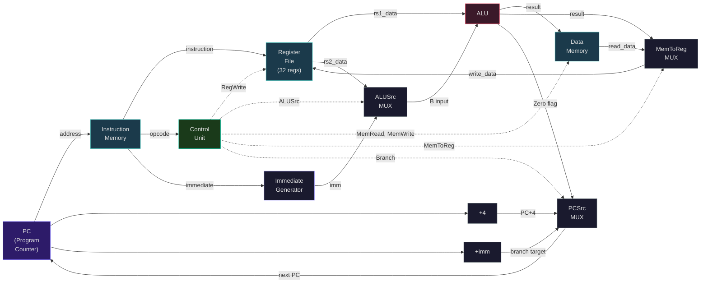
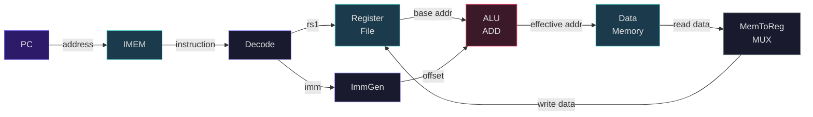

# The Single-Cycle RISC-V Processor

Last week we learned the ISA — the contract that specifies *what* the processor does. This week we design the **microarchitecture** — the hardware that implements *how* it does it. We will build a complete single-cycle RISC-V processor from the ground up, tracing every signal for every instruction type.

The single-cycle design is the simplest possible implementation: every instruction completes in exactly one clock cycle. By the end of this lecture, you will understand every component in the datapath, every control signal, and why this design — while beautifully simple — is fundamentally limited for high performance.

---

## 1. Datapath Components

A processor is built from a handful of components wired together. Each component has a well-defined interface:

### 1.1 Program Counter (PC)

The PC is a 32-bit register that holds the address of the current instruction. On every clock edge, it updates to the next instruction address:

- **Normal execution**: $\text{PC}_{\text{next}} = \text{PC} + 4$ (instructions are 4 bytes)
- **Branch taken**: $\text{PC}_{\text{next}} = \text{PC} + \text{imm}$ (PC-relative)
- **Jump (JAL)**: $\text{PC}_{\text{next}} = \text{PC} + \text{imm}$ (PC-relative)
- **Jump register (JALR)**: $\text{PC}_{\text{next}} = (\text{rs1} + \text{imm}) \mathbin{\&} \sim 1$

### 1.2 Instruction Memory (IMEM)

A read-only memory indexed by the PC. Given an address, it outputs the 32-bit instruction at that address. In a real processor this is the L1 instruction cache, but for our single-cycle design it is an ideal memory with zero latency.

- **Input**: `address` (32 bits, from PC)
- **Output**: `instruction` (32 bits)

### 1.3 Register File

The register file contains 32 registers, each 32 bits wide. It supports two simultaneous reads and one write per cycle:

- **Inputs**: `rs1_addr` (5 bits), `rs2_addr` (5 bits), `rd_addr` (5 bits), `write_data` (32 bits), `RegWrite` (1 bit)
- **Outputs**: `rs1_data` (32 bits), `rs2_data` (32 bits)
- **Behavior**: Reads are combinational (output immediately). Write occurs on the clock edge when `RegWrite = 1`. Register x0 always reads as 0.

Why two read ports? Because many instructions need two source operands: `ADD rd, rs1, rs2` reads both `rs1` and `rs2` simultaneously.

### 1.4 ALU (Arithmetic Logic Unit)

The ALU performs the actual computation. It takes two 32-bit inputs and produces a 32-bit result plus a zero flag:

- **Inputs**: `A` (32 bits), `B` (32 bits), `ALUControl` (4 bits)
- **Outputs**: `Result` (32 bits), `Zero` (1 bit, true when Result = 0)

ALU operations (determined by ALUControl):

| ALUControl | Operation |
|---|---|
| 0000 | AND |
| 0001 | OR |
| 0010 | ADD |
| 0110 | SUB |
| 0111 | SLT (set less than, signed) |
| 1000 | XOR |
| 0011 | SLL (shift left) |
| 0101 | SRL (shift right logical) |
| 1101 | SRA (shift right arithmetic) |

### 1.5 Data Memory (DMEM)

Memory for loads and stores. Supports one read or one write per cycle:

- **Inputs**: `address` (32 bits), `write_data` (32 bits), `MemRead` (1 bit), `MemWrite` (1 bit)
- **Output**: `read_data` (32 bits)
- **Behavior**: When `MemRead = 1`, output the word at the given address. When `MemWrite = 1`, write `write_data` to the given address.

### 1.6 Immediate Generator (ImmGen)

Extracts and sign-extends the immediate from the instruction, based on the instruction format:

- **Input**: `instruction` (32 bits)
- **Output**: `immediate` (32 bits, sign-extended)

The immediate generator uses the opcode (bits [6:0]) to determine which format to apply. As we discussed last week, bit 31 is always the sign bit, so sign extension is just replicating bit 31 into the upper bits.

### 1.7 Multiplexers

Several 2-to-1 multiplexers route data based on control signals:

- **ALUSrc MUX**: Selects between `rs2_data` (for R-type) and `immediate` (for I-type, S-type, etc.) as the second ALU input.
- **MemToReg MUX**: Selects between `ALU result` (for arithmetic) and `memory read data` (for loads) as the register write data.
- **PCSrc MUX**: Selects between `PC + 4` (normal) and `branch/jump target` (taken branch or jump) as the next PC value.

<ConceptCheck id="cc-1" />

---

## 2. The Complete Single-Cycle Datapath

Here is the complete datapath showing all major components and the signal flow between them. Read this carefully -- every wire matters:



```
                    ┌─────────┐
                    │   +4    │
                    └────┬────┘
                         │
          ┌──────────────┤
          │              │
    ┌─────▼─────┐   ┌───▼──────────┐
    │  PCSrc    │   │              │
    │  MUX      │   │   PC + imm  │
    └─────┬─────┘   └──────────────┘
          │              ▲
    ┌─────▼─────┐        │
    │    PC     │        │ (branch/jump target)
    └─────┬─────┘        │
          │              │
    ┌─────▼──────────┐   │
    │  Instruction   │   │
    │   Memory       │   │
    └─────┬──────────┘   │
          │              │
          ▼ instruction  │
    ┌─────────────────────────────────────────────┐
    │              DECODE                          │
    │  opcode [6:0]  → Control Unit                │
    │  rd     [11:7] → Register File (write addr)  │
    │  rs1    [19:15] → Register File (read addr 1)│
    │  rs2    [24:20] → Register File (read addr 2)│
    │  funct3 [14:12] → ALU Control                │
    │  funct7 [31:25] → ALU Control                │
    │  immediate → ImmGen                          │
    └──────────────┬──────────────────────┬────────┘
                   │                      │
          rs1_data ▼              rs2_data ▼
                   │                      │
                   │              ┌───────▼──────┐
                   │              │ ALUSrc MUX   │
                   │              │ 0: rs2_data  │
                   │              │ 1: immediate │
                   │              └───────┬──────┘
                   │                      │
              ┌────▼──────────────────────▼────┐
              │            ALU                  │
              │  A = rs1_data                   │
              │  B = (rs2 or imm)               │
              │  Result, Zero flag              │
              └────┬───────────────────────────┘
                   │
                   ├──────────────────────────────────┐
                   │                                   │
              ┌────▼─────────┐                   ┌─────▼──────┐
              │ Data Memory  │                   │ MemToReg   │
              │ addr = Result│                   │ MUX        │
              │ WD = rs2_data│                   │ 0: ALU res │
              └────┬─────────┘                   │ 1: Mem data│
                   │ read_data                   └─────┬──────┘
                   │                                   │
                   └───────────────────────────────────┘
                                                       │
                                                       ▼
                                              Register File
                                              (write port)
```

---

## 3. Control Signals

The **Control Unit** reads the opcode and generates all the control signals that configure the datapath for each instruction type. The **ALU Control** reads funct3 and funct7 to determine the specific ALU operation.

### 3.1 Main Control Unit

| Signal | Meaning |
|--------|---------|
| `RegWrite` | Write the result to the register file (rd) |
| `MemRead` | Read from data memory |
| `MemWrite` | Write to data memory |
| `ALUSrc` | 0 = second ALU input from rs2; 1 = from immediate |
| `MemToReg` | 0 = write ALU result to rd; 1 = write memory data to rd |
| `Branch` | 1 if this is a branch instruction |
| `Jump` | 1 if this is JAL or JALR |
| `ALUOp` | 2-bit code that tells ALU Control how to determine the operation |

### 3.2 Control Signal Truth Table

| Instruction Type | RegWrite | ALUSrc | MemRead | MemWrite | MemToReg | Branch | Jump | ALUOp |
|---|---|---|---|---|---|---|---|---|
| R-type (ADD, SUB, ...) | 1 | 0 | 0 | 0 | 0 | 0 | 0 | 10 |
| I-type arith (ADDI, ...) | 1 | 1 | 0 | 0 | 0 | 0 | 0 | 10 |
| Load (LW) | 1 | 1 | 1 | 0 | 1 | 0 | 0 | 00 |
| Store (SW) | 0 | 1 | 0 | 1 | X | 0 | 0 | 00 |
| Branch (BEQ, ...) | 0 | 0 | 0 | 0 | X | 1 | 0 | 01 |
| JAL | 1 | X | 0 | 0 | 0 | 0 | 1 | XX |
| LUI | 1 | 1 | 0 | 0 | 0 | 0 | 0 | 11 |

Where X means "don't care" — the signal value does not affect the result.

### 3.3 ALU Control

The ALU Control unit takes ALUOp (from the main control) plus funct3 and funct7 (from the instruction) to produce the 4-bit ALUControl signal:

| ALUOp | funct3 | funct7[5] | ALUControl | Operation |
|---|---|---|---|---|
| 00 | X | X | 0010 | ADD (for loads/stores — address calculation) |
| 01 | X | X | 0110 | SUB (for branches — comparison) |
| 10 | 000 | 0 | 0010 | ADD |
| 10 | 000 | 1 | 0110 | SUB |
| 10 | 111 | X | 0000 | AND |
| 10 | 110 | X | 0001 | OR |
| 10 | 100 | X | 1000 | XOR |
| 10 | 010 | X | 0111 | SLT |
| 10 | 001 | X | 0011 | SLL |
| 10 | 101 | 0 | 0101 | SRL |
| 10 | 101 | 1 | 1101 | SRA |

<ConceptCheck id="cc-2" />

---

## 4. Signal-by-Signal Instruction Traces

Now let us trace every signal for each major instruction type. This is the core of understanding processor design.

The following diagram traces the active signals for an R-type instruction (ADD). Grayed components are idle during this instruction type:

```mermaid
flowchart LR
    PC["PC"] -->|address| IMEM["IMEM"]
    IMEM -->|instruction| DEC["Decode"]
    DEC -->|rs1, rs2| RF["Register\nFile"]
    RF -->|rs1_data (A)| ALU["ALU\nADD"]
    RF -->|rs2_data (B)| ALU
    ALU -->|result| WB["Write Back\nto rd"]
    WB --> RF

    DMEM["Data Memory\n(IDLE)"]

    style PC fill:#2d1b69,stroke:#6c5ce7,color:#e0e0e0
    style IMEM fill:#1b3a4b,stroke:#4ecdc4,color:#e0e0e0
    style DEC fill:#1a1a2e,stroke:#a29bfe,color:#e0e0e0
    style RF fill:#1b3a4b,stroke:#4ecdc4,color:#e0e0e0
    style ALU fill:#3b1929,stroke:#e94560,color:#e0e0e0
    style WB fill:#1b3a1b,stroke:#00b894,color:#e0e0e0
    style DMEM fill:#1a1a2e,stroke:#636e72,color:#808080
```

### 4.1 R-type: `ADD x3, x1, x2`

Meaning: `x3 = x1 + x2`

**Fetch**: PC provides address to instruction memory. Instruction memory outputs the 32-bit instruction. PC updates to PC + 4.

**Decode**:
- opcode = `0110011` (R-type) → Control sets: RegWrite=1, ALUSrc=0, MemRead=0, MemWrite=0, MemToReg=0, Branch=0, ALUOp=10
- rd = 3, rs1 = 1, rs2 = 2
- funct3 = 000, funct7 = 0000000 → ALU Control outputs: ALUControl = 0010 (ADD)

**Execute**:
- A = Register[1] (value of x1)
- ALUSrc = 0, so B = Register[2] (value of x2)
- ALU computes A + B = x1 + x2

**Memory**: MemRead=0, MemWrite=0 — data memory is idle

**Writeback**:
- MemToReg = 0, so write data = ALU result (x1 + x2)
- RegWrite = 1, so register file writes ALU result into x3

### 4.2 I-type Arithmetic: `ADDI x1, x2, 5`

Meaning: `x1 = x2 + 5`

**Fetch**: Same as above.

**Decode**:
- opcode = `0010011` (I-type arith) → Control: RegWrite=1, ALUSrc=**1**, MemRead=0, MemWrite=0, MemToReg=0, ALUOp=10
- ImmGen extracts imm[11:0] = 5, sign-extends to 32-bit: `0x00000005`
- funct3 = 000 → ALU Control: ALUControl = 0010 (ADD)

**Execute**:
- A = Register[2] (value of x2)
- ALUSrc = **1**, so B = immediate (5) — NOT from rs2
- ALU computes A + B = x2 + 5

**Memory**: Idle.

**Writeback**: RegWrite=1, MemToReg=0 → write (x2 + 5) to x1.

The load instruction (LW) exercises the longest critical path through the datapath -- this path determines the minimum clock period:



### 4.3 Load: `LW x1, 8(x2)`

Meaning: `x1 = Memory[x2 + 8]`

**Fetch**: Same.

**Decode**:
- opcode = `0000011` (Load) → Control: RegWrite=1, ALUSrc=1, MemRead=**1**, MemWrite=0, MemToReg=**1**, Branch=0, ALUOp=00
- ImmGen: offset = 8, sign-extended
- ALUOp=00 → ALU Control: ALUControl = 0010 (ADD, for address calculation)

**Execute**:
- A = Register[2] (base address)
- ALUSrc = 1, so B = immediate (8)
- ALU computes address: x2 + 8

**Memory**:
- MemRead = **1**, address = x2 + 8
- Data memory outputs the 32-bit word at address (x2 + 8)

**Writeback**:
- MemToReg = **1** → write data = memory read data (not ALU result)
- RegWrite = 1 → write memory data into x1

This is the longest path through the datapath: PC → IMEM → RegFile → ALU → DMEM → MUX → RegFile write. This path determines the clock period.

### 4.4 Store: `SW x3, 12(x2)`

Meaning: `Memory[x2 + 12] = x3`

**Decode**:
- opcode = `0100011` (Store) → Control: RegWrite=**0**, ALUSrc=1, MemRead=0, MemWrite=**1**, Branch=0, ALUOp=00
- ImmGen: offset = 12 (S-type split immediate), sign-extended

**Execute**:
- A = Register[2] (base address)
- ALUSrc = 1, so B = immediate (12)
- ALU computes address: x2 + 12

**Memory**:
- MemWrite = **1**, address = x2 + 12
- write_data = Register[3] (value of x3)
- Data memory stores x3 at address (x2 + 12)

**Writeback**:
- RegWrite = **0** → no register write occurs
- This is correct — stores modify memory, not registers

### 4.5 Branch: `BEQ x1, x2, 20`

Meaning: If x1 == x2, jump to PC + 20; otherwise continue to PC + 4.

**Decode**:
- opcode = `1100011` (Branch) → Control: RegWrite=0, ALUSrc=0, MemRead=0, MemWrite=0, Branch=**1**, ALUOp=01
- ImmGen: offset = 20 (B-type scrambled immediate), sign-extended
- ALUOp=01 → ALU Control: ALUControl = 0110 (SUB, for comparison)

**Execute**:
- A = Register[1], B = Register[2] (ALUSrc=0)
- ALU computes x1 - x2
- Zero flag = 1 if x1 == x2 (i.e., x1 - x2 == 0)

**PC Update**:
- Branch target = PC + 20 (computed by a separate adder)
- PCSrc = Branch AND Zero = 1 AND (x1 == x2)
  - If taken: PC ← PC + 20
  - If not taken: PC ← PC + 4

**Memory and Writeback**: Both idle (no memory access, no register write).

### 4.6 Jump: `JAL x1, 100`

Meaning: `x1 = PC + 4; PC = PC + 100`

**Decode**:
- opcode = `1101111` (JAL) → Control: RegWrite=1, Jump=1
- ImmGen: offset = 100 (J-type scrambled immediate)

**Execute**:
- A separate adder computes the jump target: PC + 100
- PC + 4 is computed for the link value (return address)

**Writeback**:
- RegWrite = 1, write data = PC + 4 → saved into x1 (the link register)
- PC ← PC + 100

<ConceptCheck id="cc-3" />

---

## 5. Clock Period Analysis

In a single-cycle processor, the clock period must be long enough for the slowest instruction to complete. Let us assign realistic delays to each component:

| Component | Delay |
|-----------|-------|
| Instruction Memory | 200 ps |
| Register File Read | 100 ps |
| ALU | 200 ps |
| Data Memory | 200 ps |
| Register File Write | 100 ps |
| Multiplexer | 25 ps |
| Sign Extension | 10 ps |
| Control Unit | 50 ps |
| Adder (PC + 4, branch target) | 100 ps |

Now let us compute the critical path for each instruction type:

**R-type** (ADD, SUB, etc.):
$$T_{\text{R}} = T_{\text{IMEM}} + T_{\text{RegRead}} + T_{\text{MUX}} + T_{\text{ALU}} + T_{\text{MUX}} + T_{\text{RegWrite}}$$
$$T_{\text{R}} = 200 + 100 + 25 + 200 + 25 + 100 = 650 \text{ ps}$$

**Load** (LW) — the critical path:
$$T_{\text{LW}} = T_{\text{IMEM}} + T_{\text{RegRead}} + T_{\text{MUX}} + T_{\text{ALU}} + T_{\text{DMEM}} + T_{\text{MUX}} + T_{\text{RegWrite}}$$
$$T_{\text{LW}} = 200 + 100 + 25 + 200 + 200 + 25 + 100 = 850 \text{ ps}$$

**Store** (SW):
$$T_{\text{SW}} = T_{\text{IMEM}} + T_{\text{RegRead}} + T_{\text{MUX}} + T_{\text{ALU}} + T_{\text{DMEM}}$$
$$T_{\text{SW}} = 200 + 100 + 25 + 200 + 200 = 725 \text{ ps}$$

**Branch** (BEQ):
$$T_{\text{BEQ}} = T_{\text{IMEM}} + T_{\text{RegRead}} + T_{\text{ALU}} + T_{\text{MUX(PCSrc)}}$$
$$T_{\text{BEQ}} = 200 + 100 + 200 + 25 = 525 \text{ ps}$$

The clock period must accommodate the **worst case**: the load instruction at 850 ps. Therefore:

$$T_{\text{clk}} = 850 \text{ ps}$$

$$f_{\text{clk}} = \frac{1}{850 \times 10^{-12}} \approx 1.18 \text{ GHz}$$

### 5.1 The Performance Problem

Since CPI = 1 for all instructions in a single-cycle design, the execution time of a program is:

$$T_{\text{program}} = N_{\text{inst}} \times 1 \times T_{\text{clk}} = N_{\text{inst}} \times 850 \text{ ps}$$

The problem is that every instruction — including simple ADD (which only needs 650 ps) — must wait the full 850 ps. In a typical program, the instruction mix might be:

| Type | Frequency | Needed Time | Wasted Time per Instruction |
|------|-----------|-------------|---------------------------|
| R-type | 40% | 650 ps | 200 ps |
| Load | 20% | 850 ps | 0 ps |
| Store | 10% | 725 ps | 125 ps |
| Branch | 20% | 525 ps | 325 ps |
| Other | 10% | 500 ps | 350 ps |

The **weighted average wasted time** per instruction is:

$$\overline{T_{\text{waste}}} = 0.4 \times 200 + 0.2 \times 0 + 0.1 \times 125 + 0.2 \times 325 + 0.1 \times 350 = 192.5 \text{ ps}$$

That is $192.5 / 850 = 22.6\%$ of every clock cycle wasted on average. For a billion-instruction program, that is $192.5 \text{ ms}$ of wasted time.

This inefficiency is the primary motivation for the multi-cycle and pipelined designs we will study next.

---

## 6. Python Simulation: Single-Cycle Control Unit

Let us implement the control unit in Python:

```python
from dataclasses import dataclass
from typing import Dict


@dataclass
class ControlSignals:
    """Control signals generated by the main control unit."""
    reg_write: bool = False
    mem_read: bool = False
    mem_write: bool = False
    alu_src: bool = False    # False = register, True = immediate
    mem_to_reg: bool = False # False = ALU result, True = memory data
    branch: bool = False
    jump: bool = False
    alu_op: int = 0          # 2-bit ALU operation code

    def __repr__(self) -> str:
        signals = []
        if self.reg_write: signals.append("RegWrite")
        if self.mem_read: signals.append("MemRead")
        if self.mem_write: signals.append("MemWrite")
        if self.alu_src: signals.append("ALUSrc=imm")
        if self.mem_to_reg: signals.append("MemToReg")
        if self.branch: signals.append("Branch")
        if self.jump: signals.append("Jump")
        signals.append(f"ALUOp={self.alu_op:02b}")
        return "Ctrl[" + ", ".join(signals) + "]"


def generate_control(opcode: int) -> ControlSignals:
    """Generate control signals from the 7-bit opcode."""
    ctrl = ControlSignals()

    if opcode == 0b0110011:    # R-type
        ctrl.reg_write = True
        ctrl.alu_op = 0b10
    elif opcode == 0b0010011:  # I-type arithmetic
        ctrl.reg_write = True
        ctrl.alu_src = True
        ctrl.alu_op = 0b10
    elif opcode == 0b0000011:  # Load
        ctrl.reg_write = True
        ctrl.alu_src = True
        ctrl.mem_read = True
        ctrl.mem_to_reg = True
        ctrl.alu_op = 0b00
    elif opcode == 0b0100011:  # Store
        ctrl.alu_src = True
        ctrl.mem_write = True
        ctrl.alu_op = 0b00
    elif opcode == 0b1100011:  # Branch
        ctrl.branch = True
        ctrl.alu_op = 0b01
    elif opcode == 0b1101111:  # JAL
        ctrl.reg_write = True
        ctrl.jump = True
    elif opcode == 0b0110111:  # LUI
        ctrl.reg_write = True
        ctrl.alu_src = True
        ctrl.alu_op = 0b11

    return ctrl


# Test
for name, opcode in [("R-type", 0b0110011), ("LW", 0b0000011),
                       ("SW", 0b0100011), ("BEQ", 0b1100011)]:
    ctrl = generate_control(opcode)
    print(f"{name}: {ctrl}")
```

<ConceptCheck id="cc-4" />

---

## 7. Handling All Instruction Types

The basic datapath described above handles the core instructions, but a complete implementation needs additional hardware for some cases:

### 7.1 LUI (Load Upper Immediate)

LUI writes `imm << 12` to rd. The immediate generator extracts the upper 20 bits and places them in the upper 20 bits of a 32-bit value (lower 12 bits = 0). The ALU passes this through to the register write port. One approach: use ALUSrc=1 and set the ALU to "pass B" mode.

### 7.2 AUIPC

AUIPC computes `PC + (imm << 12)` and stores it in rd. This requires routing the current PC value into the ALU's A input (instead of rs1_data). A multiplexer selects between rs1_data and PC.

### 7.3 JAL and JALR

Both save `PC + 4` into rd. This requires routing `PC + 4` to the register write data port, which means the MemToReg multiplexer needs a third input (or a separate multiplexer).

### 7.4 Multiple Branch Conditions

The basic design uses ALU subtraction + Zero flag for BEQ. But BNE needs NOT(Zero), and BLT/BGE need the ALU's sign bit and overflow flag. A more complete branch comparator takes both operands and funct3, outputting a single "branch taken" signal.

---

## 8. Why Single-Cycle Is Limited

The single-cycle design has CPI = 1, which sounds ideal. But the Iron Law reminds us:

$$T_{\text{program}} = N_{\text{inst}} \times \underbrace{1}_{\text{CPI}} \times \underbrace{T_{\text{clk,worst}}}_{\text{clock period}}$$

The clock period is set by the **slowest instruction** (LW), even though most instructions could complete faster. Adding more complex instructions (floating-point multiply, divide) would make the clock period even longer, penalizing every instruction.

Consider adding a floating-point divide that takes 2000 ps. Now the clock period becomes 2000 ps, and every ADD (which needs only 650 ps) wastes $1350 / 2000 = 67.5\%$ of each cycle.

The solution is to break instructions into multiple shorter steps and let different instructions take different numbers of steps. This is the **multi-cycle design**, which we will study in the next lecture.

---

## Summary

The single-cycle RISC-V processor consists of seven main components: PC, instruction memory, register file, ALU, data memory, immediate generator, and multiplexers. The control unit generates signals from the opcode, and the ALU control refines the operation using funct3/funct7.

Every instruction follows the same flow: Fetch, Decode, Execute, Memory, Writeback — but not every instruction uses every stage. Stores skip writeback. R-type skips memory. Branches skip both memory and writeback. Yet in a single-cycle design, all instructions take the same time.

The critical path runs through the LW instruction: IMEM → RegFile → ALU → DMEM → MUX → RegFile Write. This path determines the clock period and limits performance.

Next lecture, we break this bottleneck with the multi-cycle design and microprogrammed control.
