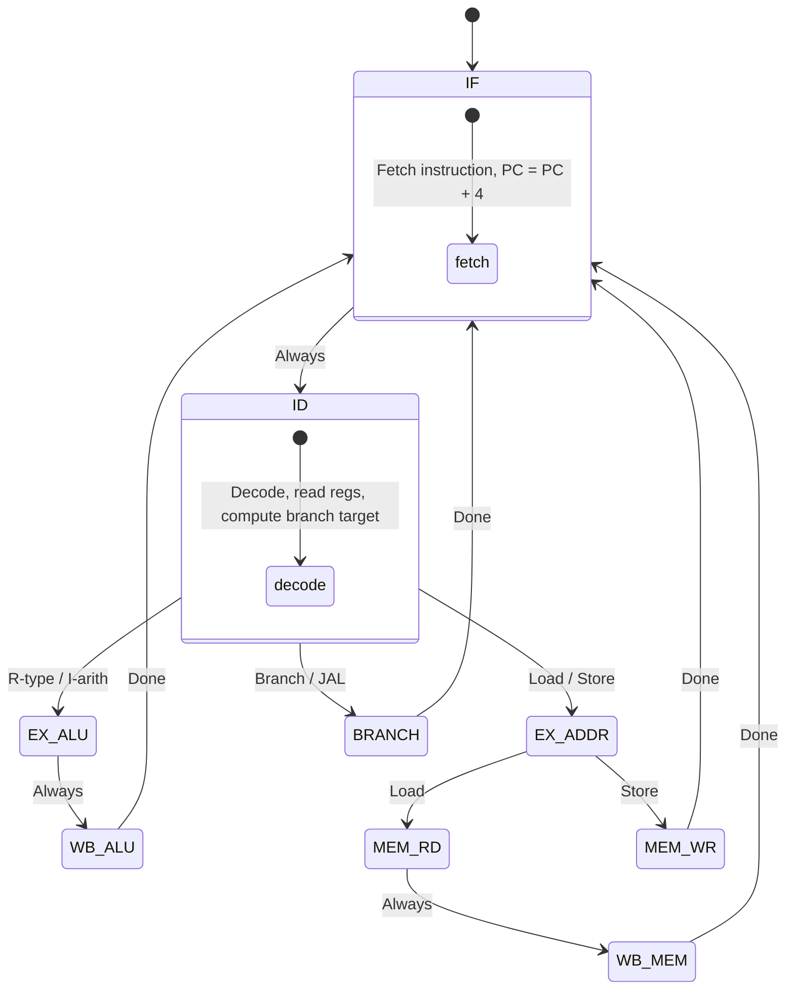
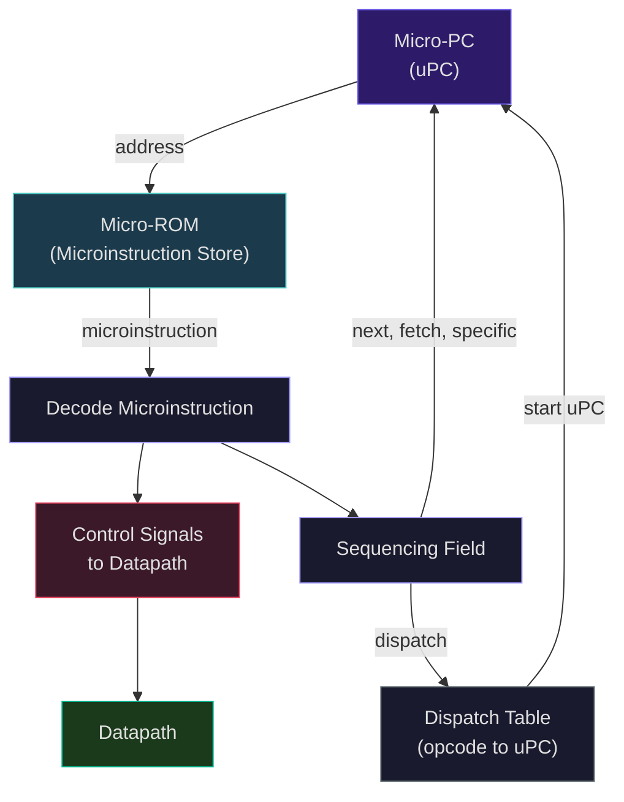

# Multi-Cycle Design and Microprogrammed Control

The single-cycle processor has an elegant simplicity: one instruction, one cycle, done. But we showed last lecture that this simplicity comes at a cost — the clock period is dictated by the slowest instruction, wasting time on every faster instruction. The multi-cycle design solves this by breaking instruction execution into multiple shorter steps, allowing each instruction to take only as many cycles as it needs.

This lecture covers the multi-cycle datapath, its finite state machine (FSM) controller, and then introduces microprogrammed control — the technique that modern x86 processors use to handle their enormously complex instruction sets. This material connects directly to Project 2 Milestone 1, where you will implement a multi-step execution engine.

---

## 1. The Multi-Cycle Approach

### 1.1 Key Insight

Instead of using separate memories and adders for each stage (as in the single-cycle design), the multi-cycle processor **shares hardware across steps**:

- A single memory serves both instructions and data (different steps)
- A single ALU handles address calculation, arithmetic, and PC incrementing
- Intermediate results are stored in **internal registers** between steps

This reduces hardware cost but requires multiple clock cycles per instruction. The critical tradeoff: the clock period is now set by the **slowest single step** (not the slowest complete instruction), which is much shorter.

### 1.2 New Internal Registers

The multi-cycle design adds registers to hold intermediate values between steps:

| Register | Purpose |
|----------|---------|
| **IR** (Instruction Register) | Holds the fetched instruction (stable across all steps) |
| **MDR** (Memory Data Register) | Holds data read from memory |
| **A** | Holds the value read from rs1 |
| **B** | Holds the value read from rs2 |
| **ALUOut** | Holds the ALU result from the previous step |

These registers are written on the clock edge at the end of each step. They provide stable inputs for the next step, even though the combinational outputs that produced them may have changed.

### 1.3 Shared Resources

| Resource | Single-Cycle | Multi-Cycle |
|----------|-------------|-------------|
| Memory | 2 (IMEM + DMEM) | 1 (shared) |
| ALU | 1 + 2 adders (PC+4, branch) | 1 (shared) |
| Register file | 1 | 1 |
| Control | Combinational | FSM (sequential) |

---

## 2. The Five Execution Steps

Every instruction begins with the same two steps (Instruction Fetch and Decode), then diverges based on instruction type:

### Step 0: Instruction Fetch (IF)

**Actions**:
- Read instruction from memory at address PC → store in IR
- Compute PC + 4 using the ALU → store in ALUOut (for later use)

**Signals**: IorD=0 (address from PC), MemRead=1, IRWrite=1, ALUSrcA=0 (PC), ALUSrcB=01 (constant 4), ALUOp=00 (ADD), PCWrite=1, PCSrc=ALUOut

**Duration**: 1 cycle. At the end of this step, IR holds the instruction and PC has been updated to PC + 4.

Wait — should we update PC here or later? Updating PC to PC + 4 immediately is a design choice. If a branch is taken, we will overwrite PC in a later step.

### Step 1: Instruction Decode / Register Read (ID)

**Actions**:
- Decode the instruction in IR (determine opcode, extract fields)
- Read rs1 and rs2 from the register file → store in A and B
- Compute the branch target speculatively: ALUOut = PC + sign_ext(imm) (using the ALU)

**Signals**: ALUSrcA=0 (PC), ALUSrcB=11 (sign-extended immediate << appropriate shift), ALUOp=00 (ADD)

**Why compute the branch target now?** Because the ALU would otherwise be idle during this step. By computing the branch target speculatively, we save a cycle on branch instructions — if the branch is taken, the target is already in ALUOut. If not, we discard it. This is a classic example of speculative computation in hardware design.

### Step 2: Execution / Address Calculation (EX)

This step varies by instruction type:

**R-type**: ALU computes A op B → store in ALUOut
- Signals: ALUSrcA=1 (A register), ALUSrcB=00 (B register), ALUOp=10 (function-specific)

**I-type arithmetic**: ALU computes A op imm → store in ALUOut
- Signals: ALUSrcA=1, ALUSrcB=10 (sign-extended immediate), ALUOp=10

**Load/Store**: ALU computes A + imm (effective address) → store in ALUOut
- Signals: ALUSrcA=1, ALUSrcB=10 (sign-extended immediate), ALUOp=00 (ADD)

**Branch**: Compare A and B (ALU computes A - B, check Zero)
- If branch taken: PC ← ALUOut (the pre-computed target from Step 1)
- If not taken: PC remains as PC + 4 (already updated in Step 0)
- Branch is complete — go back to Step 0

**JAL**: PC ← ALUOut (target computed in Step 1), save old PC + 4 in rd
- Jump is complete — go back to Step 0

### Step 3: Memory Access (MEM)

Only loads and stores reach this step:

**Load**: Read from memory at address ALUOut → store in MDR
- Signals: IorD=1 (address from ALUOut), MemRead=1

**Store**: Write B to memory at address ALUOut
- Signals: IorD=1, MemWrite=1
- Store is complete — go back to Step 0

### Step 4: Write Back (WB)

Only R-type, I-type arithmetic, and loads reach this step:

**R-type/I-type**: Write ALUOut to register rd
- Signals: RegWrite=1, MemToReg=0 (from ALUOut)

**Load**: Write MDR (memory data) to register rd
- Signals: RegWrite=1, MemToReg=1 (from MDR)

<ConceptCheck id="cc-1" />

---

## 3. Instruction Cycle Counts

Different instructions complete in different numbers of cycles:

| Instruction Type | Steps | Cycle Count |
|---|---|---|
| R-type (ADD, SUB, ...) | IF → ID → EX → WB | 4 cycles |
| I-type arithmetic (ADDI, ...) | IF → ID → EX → WB | 4 cycles |
| Load (LW) | IF → ID → EX → MEM → WB | 5 cycles |
| Store (SW) | IF → ID → EX → MEM | 4 cycles |
| Branch (BEQ, ...) | IF → ID → EX | 3 cycles |
| Jump (JAL) | IF → ID → EX | 3 cycles |

The following diagram compares timing for single-cycle vs. multi-cycle execution. In the single-cycle design, every instruction takes the same long clock period. In the multi-cycle design, simpler instructions complete in fewer (shorter) cycles:

```mermaid
gantt
    title Single-Cycle vs Multi-Cycle Timing
    dateFormat X
    axisFormat %s

    section Single-Cycle
    ADD (all stages, 850ps)  :a1, 0, 850
    LW (all stages, 850ps)   :a2, 850, 1700
    BEQ (all stages, 850ps)  :a3, 1700, 2550

    section Multi-Cycle
    ADD: IF (200ps)           :b1, 0, 200
    ADD: ID (200ps)           :b2, 200, 400
    ADD: EX (200ps)           :b3, 400, 600
    ADD: WB (200ps)           :b4, 600, 800
    LW: IF (200ps)            :b5, 800, 1000
    LW: ID (200ps)            :b6, 1000, 1200
    LW: EX (200ps)            :b7, 1200, 1400
    LW: MEM (200ps)           :b8, 1400, 1600
    LW: WB (200ps)            :b9, 1600, 1800
    BEQ: IF (200ps)           :b10, 1800, 2000
    BEQ: ID (200ps)           :b11, 2000, 2200
    BEQ: EX (200ps)           :b12, 2200, 2400
```



Now let us compute the CPI for a typical instruction mix:

| Type | Frequency | Cycles | Weighted |
|------|-----------|--------|----------|
| R-type | 40% | 4 | 1.60 |
| Load | 20% | 5 | 1.00 |
| Store | 10% | 4 | 0.40 |
| Branch | 20% | 3 | 0.60 |
| Other (I-type, JAL) | 10% | 3.5 avg | 0.35 |
| **Total CPI** | | | **3.95** |

### 3.1 Performance Comparison

Let us compare single-cycle and multi-cycle with the same component delays:

| Component | Delay |
|-----------|-------|
| Memory | 200 ps |
| ALU | 200 ps |
| Register Read | 100 ps |
| Register Write | 100 ps |

**Single-cycle clock period** = longest instruction path = 200 + 100 + 200 + 200 + 100 = **800 ps** (simplified LW path)

**Multi-cycle clock period** = longest single step = max(200, 200, 100) = **200 ps** (memory or ALU, whichever is slower)

For a program with $N$ instructions:

$$T_{\text{single}} = N \times 1 \times 800 = 800N \text{ ps}$$

$$T_{\text{multi}} = N \times 3.95 \times 200 = 790N \text{ ps}$$

$$\text{Speedup} = \frac{800N}{790N} = 1.013\times$$

Only a 1.3% improvement! This modest gain occurs because our example has relatively similar step delays. The real advantage of multi-cycle emerges when:

1. Some instructions are much faster (branches: 3 cycles vs. loads: 5 cycles)
2. The single-cycle clock is dominated by one very slow instruction
3. The multi-cycle clock period can be made shorter by balancing step delays

The multi-cycle design is historically important because it was the standard before pipelining (which we study next week), and because it introduces the concept of a **control FSM** — which leads to microprogrammed control.

---

## 4. The Finite State Machine Controller

In the single-cycle design, the control unit is purely **combinational** — it generates all signals from the current opcode. In the multi-cycle design, the control unit is a **finite state machine** that transitions through states based on the opcode and the current state.

### 4.1 State Diagram

The FSM controller transitions through the following states. All instructions share the IF and ID states, then diverge based on instruction type:



The ASCII version below shows the same transitions for reference:

```
    ┌───────────────────────────────────────────────────────┐
    │                                                       │
    ▼                                                       │
┌──────────┐    ┌──────────┐                                │
│  State 0 │───→│  State 1 │                                │
│    IF    │    │  ID/Reg  │                                │
└──────────┘    └────┬─────┘                                │
                     │                                       │
        ┌────────────┼────────────┬───────────┐             │
        │ R/I-type   │ Load/Store │ Branch/   │             │
        ▼            ▼            ▼ Jump      │             │
   ┌──────────┐ ┌──────────┐ ┌──────────┐    │             │
   │  State 2 │ │  State 3 │ │  State 6 │    │             │
   │  EX(ALU) │ │  EX(Addr)│ │  EX(Br)  │────┘             │
   └────┬─────┘ └────┬─────┘ └──────────┘    (back to IF)  │
        │             │                                     │
        │        ┌────┴────┐                                │
        │        │ Load    │ Store                          │
        │        ▼         ▼                                │
        │   ┌──────────┐ ┌──────────┐                      │
        │   │  State 4 │ │  State 5 │                      │
        │   │  MEM(Rd) │ │  MEM(Wr) │──────────────────────┘
        │   └────┬─────┘ └──────────┘
        │        │
        ▼        ▼
   ┌──────────┐ ┌──────────┐
   │  State 7 │ │  State 8 │
   │  WB(ALU) │ │  WB(Mem) │───────────────────────────────┘
   └──────────┘ └──────────┘
```

### 4.2 State Transition Table

| Current State | Condition | Next State | Actions |
|---|---|---|---|
| 0 (IF) | always | 1 | Fetch instruction, PC ← PC + 4 |
| 1 (ID) | R-type or I-arith | 2 | Read registers, compute branch target |
| 1 (ID) | Load or Store | 3 | Read registers, compute branch target |
| 1 (ID) | Branch | 6 | Read registers, compute branch target |
| 1 (ID) | JAL | 6 | Read registers, compute branch target |
| 2 (EX-ALU) | always | 7 | ALU operation on A, B (or imm) |
| 3 (EX-Addr) | Load | 4 | Compute address A + imm |
| 3 (EX-Addr) | Store | 5 | Compute address A + imm |
| 4 (MEM-Read) | always | 8 | Read memory at ALUOut |
| 5 (MEM-Write) | always | 0 | Write B to memory at ALUOut |
| 6 (Branch/Jump) | always | 0 | Check condition, update PC if taken |
| 7 (WB-ALU) | always | 0 | Write ALUOut to rd |
| 8 (WB-Mem) | always | 0 | Write MDR to rd |

<ConceptCheck id="cc-2" />

---

## 5. Microprogrammed Control

### 5.1 The Problem with Hardwired Control

The FSM controller above has about 10 states and can be implemented with a handful of flip-flops and combinational logic. This is **hardwired control** — the control logic is built directly in gates.

But what if the ISA has hundreds of instructions, each with different multi-cycle sequences? The state diagram explodes in complexity. Intel's x86 ISA has over 1,500 instructions, many requiring 10+ micro-operations. A hardwired controller for x86 would be enormous, error-prone, and nearly impossible to modify after fabrication.

The solution is **microprogrammed control**: store the control sequences in a ROM (read-only memory) as **microinstructions**, and use a small sequencer to step through them.

### 5.2 Microprogrammed Architecture

The micro-sequencer reads microinstructions from a ROM and generates control signals for the datapath. The sequencing field in each microinstruction determines which microinstruction executes next:



The ASCII version below provides additional detail:

```
┌────────────────────────────────────────────────────┐
│               Micro-Sequencer                       │
│                                                    │
│   ┌───────────┐      ┌─────────────────────────┐  │
│   │ micro-PC  │─────→│     Micro-ROM            │  │
│   │ (μPC)     │      │  (microinstruction store) │  │
│   └─────┬─────┘      └──────────┬──────────────┘  │
│         │                       │                   │
│         │              microinstruction              │
│         │                       │                   │
│         │         ┌─────────────▼──────────────┐   │
│         │         │    Decode microinstruction   │   │
│         │         │                              │   │
│         │         │  ┌──────────┐ ┌──────────┐  │   │
│         │         │  │ Control  │ │ Sequencing│  │   │
│         │         │  │ Signals  │ │  Field    │  │   │
│         │         │  └────┬─────┘ └────┬──────┘  │   │
│         │         └───────┼────────────┼─────────┘   │
│         │                 │            │             │
│         ◄─────────────────┘            │             │
│    (next μPC from                     │             │
│     sequencing field)                  ▼             │
│                                  To Datapath         │
└────────────────────────────────────────────────────┘
```

### 5.3 Microinstruction Format

A microinstruction is a wide word stored in the micro-ROM. Each field controls a specific datapath signal or determines the next microinstruction:

| Field | Bits | Values |
|-------|------|--------|
| ALU Control | 4 | AND, OR, ADD, SUB, SLT, ... |
| ALU Src A | 1 | 0 = PC, 1 = Register A |
| ALU Src B | 2 | 00 = B, 01 = 4, 10 = imm, 11 = imm<<1 |
| Mem Read | 1 | 0 = no, 1 = yes |
| Mem Write | 1 | 0 = no, 1 = yes |
| Mem Addr Src | 1 | 0 = PC, 1 = ALUOut |
| Reg Write | 1 | 0 = no, 1 = yes |
| Reg Write Src | 2 | 00 = ALUOut, 01 = MDR, 10 = PC+4 |
| PC Write | 1 | 0 = no, 1 = yes |
| PC Src | 2 | 00 = ALU, 01 = ALUOut, 10 = Jump target |
| Branch | 1 | 0 = no, 1 = conditional PC write |
| Sequencing | 3 | 000 = next, 001 = dispatch, 010 = fetch, 011 = specific |
| Next Addr | 4 | Address of next microinstruction (when sequencing = 011) |
| **Total** | **~24** | |

### 5.4 Microprogram for LW

The load word instruction `LW rd, offset(rs1)` requires the following microinstruction sequence:

| μPC | ALU | SrcA | SrcB | Mem | IorD | RegW | WrSrc | PCW | Seq | Description |
|-----|-----|------|------|-----|------|------|-------|-----|-----|-------------|
| 0 | ADD | PC | 4 | Read | 0 | 0 | - | 1 | next | Fetch instruction, PC ← PC + 4 |
| 1 | ADD | PC | imm | - | - | 0 | - | 0 | dispatch | Decode, pre-compute branch target |
| 2 | ADD | A | imm | - | - | 0 | - | 0 | next | Compute address: rs1 + offset |
| 3 | - | - | - | Read | 1 | 0 | - | 0 | next | Read memory at computed address |
| 4 | - | - | - | - | - | 1 | MDR | 0 | fetch | Write loaded data to rd |

Step 1's "dispatch" sequencing means: look at the opcode and jump to the appropriate microprogram for that instruction type. This is like a switch statement in the micro-ROM.

### 5.5 Dispatch Table

The dispatch mechanism maps opcodes to microprogram starting addresses:

| Opcode | Instruction Type | Start μPC |
|--------|-----------------|-----------|
| 0110011 | R-type | 6 |
| 0010011 | I-type arithmetic | 9 |
| 0000011 | Load | 2 |
| 0100011 | Store | 11 |
| 1100011 | Branch | 13 |
| 1101111 | JAL | 15 |
| 0110111 | LUI | 17 |

Steps 0 and 1 (Fetch and Decode) are shared by all instructions. After Step 1, the dispatch table routes control to the instruction-specific microcode.

<ConceptCheck id="cc-3" />

---

## 6. Hardwired vs. Microprogrammed Control

| Property | Hardwired | Microprogrammed |
|----------|-----------|-----------------|
| Speed | Faster (direct logic) | Slower (ROM lookup latency) |
| Flexibility | Fixed after fabrication | Updatable (change micro-ROM) |
| Design complexity | Grows rapidly with instruction count | Scales linearly |
| Area | Can be smaller for simple ISAs | ROM can be large |
| Debugging | Difficult (logic gates) | Easier (microcode is software-like) |
| Modern usage | RISC processors (ARM, RISC-V) | CISC processors (x86) |

### 6.1 Real-World Examples

**x86 uses microcode.** Intel's Golden Cove core (2021) has a 6-wide decoder that handles simple instructions (1-2 $\mu$ops) directly in hardware, but routes complex instructions to a microcode sequencer (MSROM). The micro-op cache (4K entries) stores decoded $\mu$ops so that hot code bypasses both the decoder and the microcode ROM entirely.

**RISC-V typically uses hardwired control.** With only 40 base instructions, the control logic is simple enough to implement directly in gates. The fixed instruction length and regular format make decoding straightforward — no microcode needed.

**ARM's approach is hybrid.** Simple ARM instructions are hardwired, but complex operations (like multiple register load/store: `LDMIA`) use a micro-sequencer internally.

### 6.2 Microcode Updates

One remarkable advantage of microprogrammed control: **microcode can be updated after fabrication**. Intel regularly ships microcode patches that fix bugs found in deployed processors. When the Spectre and Meltdown vulnerabilities were discovered in 2018, Intel deployed microcode updates that modified how speculative execution works — without replacing any hardware. The operating system loads new microcode into the processor's micro-ROM on every boot.

This is impossible with purely hardwired control, which is fixed once the chip is manufactured.

---

## 7. Python Simulation: Multi-Cycle FSM Controller

Let us implement the FSM controller in Python:

```python
from dataclasses import dataclass
from enum import Enum, auto
from typing import Dict, Optional


class State(Enum):
    FETCH = 0
    DECODE = 1
    EXECUTE_R = 2
    EXECUTE_ADDR = 3
    MEM_READ = 4
    MEM_WRITE = 5
    BRANCH = 6
    WRITEBACK_ALU = 7
    WRITEBACK_MEM = 8


@dataclass
class MicroSignals:
    """Control signals for one clock cycle of multi-cycle execution."""
    alu_src_a: int = 0       # 0=PC, 1=RegA
    alu_src_b: int = 0       # 0=RegB, 1=4, 2=imm
    alu_op: int = 0          # 0=ADD, 1=SUB, 2=func
    mem_read: bool = False
    mem_write: bool = False
    i_or_d: int = 0          # 0=PC, 1=ALUOut
    ir_write: bool = False
    reg_write: bool = False
    mem_to_reg: int = 0      # 0=ALUOut, 1=MDR
    pc_write: bool = False
    pc_src: int = 0          # 0=ALU, 1=ALUOut
    branch: bool = False


class MultiCycleFSM:
    """Finite state machine controller for a multi-cycle RISC-V processor."""

    OPCODE_R = 0b0110011
    OPCODE_I = 0b0010011
    OPCODE_LW = 0b0000011
    OPCODE_SW = 0b0100011
    OPCODE_BEQ = 0b1100011
    OPCODE_JAL = 0b1101111

    def __init__(self):
        self.state: State = State.FETCH
        self.cycles: int = 0

    def get_signals(self) -> MicroSignals:
        """Return the control signals for the current state."""
        s = MicroSignals()

        if self.state == State.FETCH:
            s.mem_read = True
            s.i_or_d = 0
            s.ir_write = True
            s.alu_src_a = 0   # PC
            s.alu_src_b = 1   # constant 4
            s.alu_op = 0      # ADD
            s.pc_write = True
            s.pc_src = 0      # ALU result (PC+4)

        elif self.state == State.DECODE:
            s.alu_src_a = 0   # PC
            s.alu_src_b = 2   # immediate
            s.alu_op = 0      # ADD (compute branch target)

        elif self.state == State.EXECUTE_R:
            s.alu_src_a = 1   # Register A
            s.alu_src_b = 0   # Register B
            s.alu_op = 2      # Determined by funct fields

        elif self.state == State.EXECUTE_ADDR:
            s.alu_src_a = 1
            s.alu_src_b = 2   # immediate
            s.alu_op = 0      # ADD

        elif self.state == State.MEM_READ:
            s.mem_read = True
            s.i_or_d = 1      # ALUOut address

        elif self.state == State.MEM_WRITE:
            s.mem_write = True
            s.i_or_d = 1

        elif self.state == State.BRANCH:
            s.alu_src_a = 1
            s.alu_src_b = 0
            s.alu_op = 1      # SUB for comparison
            s.branch = True
            s.pc_src = 1      # ALUOut (pre-computed target)

        elif self.state == State.WRITEBACK_ALU:
            s.reg_write = True
            s.mem_to_reg = 0

        elif self.state == State.WRITEBACK_MEM:
            s.reg_write = True
            s.mem_to_reg = 1

        return s

    def next_state(self, opcode: int) -> State:
        """Compute the next state based on current state and opcode."""
        if self.state == State.FETCH:
            return State.DECODE

        elif self.state == State.DECODE:
            if opcode == self.OPCODE_R or opcode == self.OPCODE_I:
                return State.EXECUTE_R
            elif opcode == self.OPCODE_LW or opcode == self.OPCODE_SW:
                return State.EXECUTE_ADDR
            elif opcode == self.OPCODE_BEQ:
                return State.BRANCH
            elif opcode == self.OPCODE_JAL:
                return State.BRANCH
            else:
                return State.EXECUTE_R  # default

        elif self.state == State.EXECUTE_R:
            return State.WRITEBACK_ALU

        elif self.state == State.EXECUTE_ADDR:
            if opcode == self.OPCODE_LW:
                return State.MEM_READ
            else:
                return State.MEM_WRITE

        elif self.state == State.MEM_READ:
            return State.WRITEBACK_MEM

        # Terminal states go back to FETCH
        elif self.state in (State.MEM_WRITE, State.BRANCH,
                            State.WRITEBACK_ALU, State.WRITEBACK_MEM):
            return State.FETCH

        return State.FETCH

    def step(self, opcode: int) -> MicroSignals:
        """Execute one clock cycle: get signals, advance state."""
        signals = self.get_signals()
        self.state = self.next_state(opcode)
        self.cycles += 1
        return signals

    def execute_instruction(self, opcode: int) -> int:
        """Execute a complete instruction. Return number of cycles."""
        self.state = State.FETCH
        start_cycles = self.cycles
        while True:
            self.step(opcode)
            if self.state == State.FETCH:
                break
        return self.cycles - start_cycles


# Test: count cycles for each instruction type
fsm = MultiCycleFSM()
for name, opcode in [("R-type", 0b0110011), ("LW", 0b0000011),
                      ("SW", 0b0100011), ("BEQ", 0b1100011)]:
    cycles = fsm.execute_instruction(opcode)
    print(f"{name}: {cycles} cycles")
# Expected: R-type: 4, LW: 5, SW: 4, BEQ: 3
```

---

## 8. Connecting to C Libraries and Linking

The multi-cycle processor's step-by-step execution maps neatly to how compiled programs work. Consider what happens when your C program calls `printf`:

1. **Your code**: The compiler translates `printf("Hello %d", x)` into a sequence of instructions that set up arguments in `a0`, `a1`, then executes `CALL printf` (which expands to `AUIPC + JALR`).

2. **The linker**: Resolves the address of `printf` in the C library (libc), patching the jump target in your code.

3. **At runtime**: The processor fetches and executes each instruction — AUIPC (3 cycles), JALR (3 cycles), then the instructions inside printf.

In Python, the analog is the module system: `import json` causes the interpreter to locate the `json` module (linking), load its bytecode (like instruction fetch), and make its functions callable. The key difference is that C linking happens before execution (static or dynamic linking), while Python resolves imports at runtime.

Understanding the multi-cycle execution model helps explain why function calls are not free: each `JAL` takes 3 cycles, and setting up the stack frame (ADDI, SW for saving registers) takes additional cycles per instruction. A function that saves 4 callee-saved registers incurs roughly $4 \times 4 = 16$ cycles of overhead just for the prologue, plus the same for the epilogue.

<ConceptCheck id="cc-4" />

---

## 9. Toward Pipelining

The multi-cycle design uses the ALU for different purposes in different steps — but during each step, most of the hardware is idle. In Step 0 (Fetch), the ALU computes PC + 4 while the register file, data memory, and most control logic sit unused. In Step 4 (Memory Read), the ALU is idle while data memory operates.

The key insight that leads to pipelining: **instead of time-sharing one instruction through shared hardware, pipeline multiple instructions so that different instructions use different hardware stages simultaneously**. While one instruction is in the Execute stage using the ALU, the previous instruction can be in the Memory stage using data memory, and the next instruction can be in the Decode stage using the register file — all in the same clock cycle.

This is the single most important performance technique in computer architecture, and it is the subject of next week's lecture.

---

## Summary

The multi-cycle processor breaks instruction execution into 3-5 steps, each completing in one clock cycle. The clock period is set by the slowest single step (typically the memory or ALU), not the slowest complete instruction. An FSM controller sequences through states, generating different control signals at each step.

Microprogrammed control stores the control sequences in a ROM, trading speed for flexibility. Modern x86 processors use microcode for their vast instruction sets, while RISC-V processors typically use simpler hardwired control. Microcode can be updated after fabrication — a critical capability for fixing hardware bugs.

The multi-cycle design shares hardware (one ALU, one memory) but leaves most hardware idle in each step. Pipelining, which we study next week, eliminates this waste by executing multiple instructions simultaneously, each in a different stage.

Project 2 Milestone 1 asks you to implement a multi-step execution engine for a subset of RV32I. The FSM controller and control signal generation you studied today map directly to your implementation.
