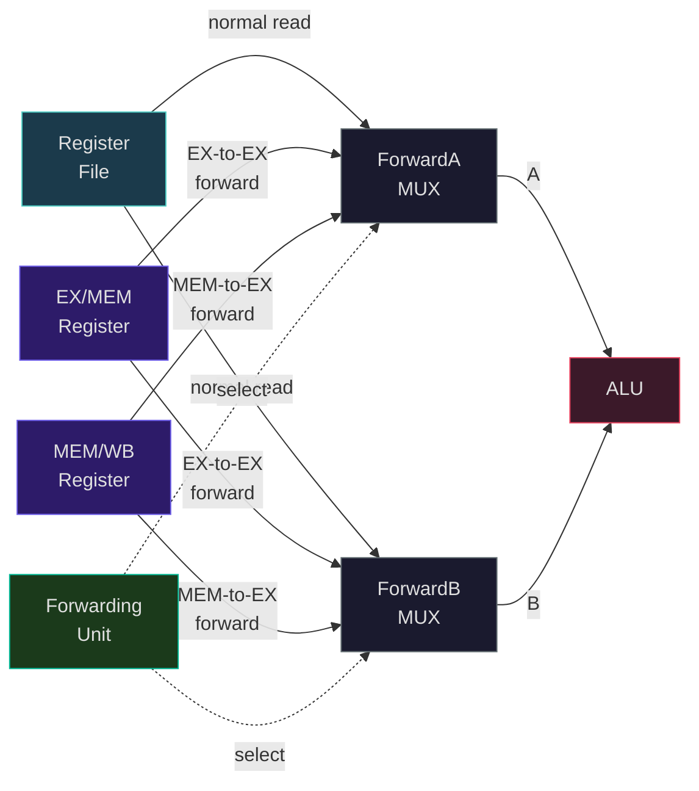

# The Pipelined Processor

In Week 6 we built a single-cycle RISC-V processor: one instruction per clock cycle, every instruction completing in a single long tick. The design works, but the clock period must accommodate the slowest instruction -- `lw`, which passes through instruction memory, register file read, ALU, data memory, and register file write. Every instruction, even a simple `add`, pays the full price. The critical path through memory access alone can be 2 ns on a modern process, pushing the clock period to 5-8 ns and capping throughput at 125-200 MHz. That is unacceptable for a machine targeting gigahertz frequencies.

Pipelining is the single most important technique in processor design. It does not make any individual instruction faster -- each instruction still requires the same total work -- but it overlaps the execution of multiple instructions so that a new instruction completes on nearly every clock cycle. The result is a dramatic increase in throughput, the same way an assembly line does not make any single car faster to build but produces one car much more frequently.

## The Laundry Analogy

Consider doing four loads of laundry. Each load requires four steps: wash (30 min), dry (30 min), fold (30 min), and put away (30 min). Done sequentially, four loads take $4 \times 120 = 480$ minutes. But if you start drying load 1 while washing load 2, and folding load 1 while drying load 2 and washing load 3, you overlap the stages. The first load still takes 120 minutes, but each subsequent load completes 30 minutes after the previous one. Four loads take $120 + 3 \times 30 = 210$ minutes -- a $2.3\times$ speedup with four stages.

In general, a $k$-stage pipeline processing $n$ items takes:

$$T_{\text{pipeline}} = k + (n - 1)$$

clock cycles (assuming one cycle per stage), versus $T_{\text{sequential}} = k \times n$ for sequential execution. The speedup approaches $k$ as $n$ grows:

$$S = \frac{k \times n}{k + (n - 1)} \xrightarrow{n \to \infty} k$$

This is the ideal pipeline speedup: a $k$-stage pipeline achieves up to $k\times$ throughput improvement. For a 5-stage pipeline, the theoretical limit is $5\times$ -- a CPI of 1.0 instead of 5.0.

## The 5-Stage RISC-V Pipeline

We partition the single-cycle datapath into five stages, each performing one step of instruction execution. Between each pair of adjacent stages, we insert a **pipeline register** -- a bank of flip-flops that captures all the data and control signals produced by one stage and presents them to the next stage on the following clock edge.


### Stage 1: Instruction Fetch (IF)

The program counter (PC) addresses instruction memory, which returns the 32-bit instruction. The PC is simultaneously incremented by 4 (pointing to the next sequential instruction). Both the instruction and PC+4 are latched into the **IF/ID pipeline register** at the end of the cycle.

Signals stored in IF/ID:
- `instruction[31:0]`: the fetched instruction word
- `PC`: the address of this instruction
- `PC+4`: the next sequential address

### Stage 2: Instruction Decode / Register Read (ID)

The instruction is decoded: the opcode, funct3, funct7 fields determine the operation; rs1 and rs2 fields index the register file for reading; the immediate field is sign-extended. The control unit generates signals for the remaining stages (ALUSrc, MemRead, MemWrite, RegWrite, Branch, MemToReg, ALUOp).

Because RISC-V keeps rs1, rs2, and rd in fixed bit positions across all instruction formats, the register file read happens in parallel with decode -- we always read registers at positions [19:15] and [24:20], even if the instruction does not use both.

Signals stored in ID/EX:
- `ReadData1`, `ReadData2`: values from the register file
- `ImmExt`: the sign-extended immediate
- `rs1`, `rs2`, `rd`: register specifier fields (5 bits each)
- All control signals for EX, MEM, and WB stages
- `PC`, `PC+4`

### Stage 3: Execute (EX)

The ALU performs the operation: arithmetic/logic for R-type and I-type, effective address calculation for loads/stores ($\text{rs1} + \text{imm}$), or branch target computation ($\text{PC} + \text{imm}$). A multiplexer selects whether the second ALU input comes from ReadData2 (R-type) or ImmExt (I-type, loads, stores).

For branch instructions, the ALU also computes the comparison (equal, less-than, etc.) and determines whether the branch is taken.

Signals stored in EX/MEM:
- `ALUResult`: the computed value
- `WriteData`: the value to be stored (for store instructions)
- `rd`: destination register
- `Zero`/`BranchTaken` flags
- Control signals for MEM and WB stages

### Stage 4: Memory Access (MEM)

For load instructions, the ALU result serves as the memory address, and data memory returns the loaded value. For store instructions, the ALU result is the address and WriteData is written to memory. For all other instructions, this stage is a pass-through -- the ALU result simply propagates forward.

Signals stored in MEM/WB:
- `ALUResult` or `MemReadData`: depending on the instruction type
- `rd`: destination register
- Control signals for WB stage (RegWrite, MemToReg)

### Stage 5: Write Back (WB)

The result -- either from the ALU or from data memory -- is written back to the register file at the destination register `rd`. A multiplexer selects between ALUResult and MemReadData based on the MemToReg control signal.

<ConceptCheck id="cc-1" />

## Pipeline Timing Diagram

The key insight of pipelining is that multiple instructions overlap in execution. The following Gantt chart shows five instructions flowing through the 5-stage pipeline -- after the pipeline fills at cycle 5, one instruction completes every cycle:

```mermaid
gantt
    title 5-Stage Pipeline: 5 Instructions Overlapping
    dateFormat X
    axisFormat %s

    section Inst 1: add
    IF   :a1, 0, 1
    ID   :a2, 1, 2
    EX   :a3, 2, 3
    MEM  :a4, 3, 4
    WB   :a5, 4, 5

    section Inst 2: sub
    IF   :b1, 1, 2
    ID   :b2, 2, 3
    EX   :b3, 3, 4
    MEM  :b4, 4, 5
    WB   :b5, 5, 6

    section Inst 3: and
    IF   :c1, 2, 3
    ID   :c2, 3, 4
    EX   :c3, 4, 5
    MEM  :c4, 5, 6
    WB   :c5, 6, 7

    section Inst 4: or
    IF   :d1, 3, 4
    ID   :d2, 4, 5
    EX   :d3, 5, 6
    MEM  :d4, 6, 7
    WB   :d5, 7, 8

    section Inst 5: xor
    IF   :e1, 4, 5
    ID   :e2, 5, 6
    EX   :e3, 6, 7
    MEM  :e4, 7, 8
    WB   :e5, 8, 9
```



Consider three instructions flowing through the pipeline:

```
Clock cycle:    1     2     3     4     5     6     7
              ┌─────┬─────┬─────┬─────┬─────┐
  add x1,...  │ IF  │ ID  │ EX  │ MEM │ WB  │
              └─────┴─────┬─────┬─────┬─────┬─────┐
  sub x2,...        │ IF  │ ID  │ EX  │ MEM │ WB  │
                    └─────┴─────┬─────┬─────┬─────┬─────┐
  and x3,...              │ IF  │ ID  │ EX  │ MEM │ WB  │
                          └─────┴─────┴─────┴─────┴─────┘
```

Each instruction takes 5 cycles to complete, but one instruction completes per cycle after the pipeline fills (cycle 5 onward). The **throughput** is 1 instruction per cycle, while the **latency** of each instruction remains 5 cycles.

## Data Hazards

The pipeline creates a fundamental problem: an instruction may need a value that a preceding instruction has not yet produced. These **data hazards** arise because the pipeline overlaps execution of instructions that are logically sequential.

### RAW (Read After Write) Hazards

A **RAW hazard** occurs when an instruction reads a register that a preceding instruction writes. This is the most common hazard.

Consider this sequence:

```asm
add  x1, x2, x3    # Writes x1 in WB (cycle 5)
sub  x4, x1, x5    # Reads x1 in ID (cycle 3) -- x1 not yet written!
```

The pipeline diagram reveals the problem:

```
Clock cycle:    1     2     3     4     5
              ┌─────┬─────┬─────┬─────┬─────┐
  add x1,...  │ IF  │ ID  │ EX  │ MEM │ WB  │  ← writes x1 here
              └─────┴─────┬─────┬─────┴─────┘
  sub x4,x1..      │ IF  │ ID  │  ← reads x1 here (stale value!)
                    └─────┴─────┘
```

The `sub` reads x1 in cycle 3, but `add` does not write x1 until cycle 5. Without intervention, `sub` gets the old value of x1.

### Data Forwarding (Bypassing)

Rather than stalling the pipeline, we can **forward** the result from where it is first available to where it is needed, bypassing the register file. This requires additional multiplexers and comparators in the datapath.

**EX-to-EX forwarding:** The ALU result from the EX/MEM pipeline register is forwarded to the ALU input of the next instruction in the EX stage. The `add` produces its result at the end of EX (cycle 3). The `sub` needs it at the beginning of EX (cycle 4). The result is available one cycle before it is written back.

```
Clock cycle:    1     2     3     4     5
              ┌─────┬─────┬─────┬─────┬─────┐
  add x1,...  │ IF  │ ID  │ EX  │ MEM │ WB  │
              └─────┴─────┴──┬──┴─────┴─────┘
                              │ forward
                              ▼
              ┌─────┬─────┬─────┬─────┬─────┐
  sub x4,x1..│     │ IF  │ ID  │ EX  │ MEM │ WB  │
              └─────┴─────┴─────┴─────┴─────┴─────┘
```

Wait -- let me draw this more precisely. The result of `add` exits the EX stage at the end of cycle 3 and sits in the EX/MEM pipeline register. The `sub` enters the EX stage in cycle 4. A forwarding path from the EX/MEM register to the ALU inputs allows the `sub` to use the correct value without stalling.

**MEM-to-EX forwarding:** If the dependent instruction is two cycles behind, the result is forwarded from the MEM/WB pipeline register.

```asm
add  x1, x2, x3    # Result available after EX (cycle 3)
nop                 # Intervening instruction
sub  x4, x1, x5    # Reads forwarded value from MEM/WB register (cycle 5)
```

The forwarding unit detects hazards by comparing the rd field of instructions in the EX/MEM and MEM/WB registers against the rs1 and rs2 fields of the instruction currently in the EX stage:

```python
# Forwarding detection logic (simplified)
def detect_forward(ex_mem_rd: int, mem_wb_rd: int,
                   id_ex_rs1: int, id_ex_rs2: int,
                   ex_mem_reg_write: bool, mem_wb_reg_write: bool) -> tuple:
    """Determine forwarding for ALU input A and B.

    Returns (forward_a, forward_b) where each is:
      0 = no forwarding (use register file value)
      1 = forward from EX/MEM (previous instruction)
      2 = forward from MEM/WB (two instructions back)
    """
    forward_a = 0
    forward_b = 0

    # EX/MEM forwarding has priority (more recent instruction)
    if ex_mem_reg_write and ex_mem_rd != 0 and ex_mem_rd == id_ex_rs1:
        forward_a = 1
    elif mem_wb_reg_write and mem_wb_rd != 0 and mem_wb_rd == id_ex_rs1:
        forward_a = 2

    if ex_mem_reg_write and ex_mem_rd != 0 and ex_mem_rd == id_ex_rs2:
        forward_b = 1
    elif mem_wb_reg_write and mem_wb_rd != 0 and mem_wb_rd == id_ex_rs2:
        forward_b = 2

    return forward_a, forward_b
```

Note the check `ex_mem_rd != 0`: writing to x0 in RISC-V is a no-op (x0 is hardwired to zero), so we must not forward from an instruction that "writes" x0.

<ConceptCheck id="cc-2" />

### Data Forwarding Paths

The forwarding unit adds multiplexers at the ALU inputs to select between the normal register file value and the forwarded value from a later pipeline stage:



### The Load-Use Hazard: When Forwarding Is Not Enough

There is one case where forwarding cannot eliminate the stall. A **load** instruction produces its result at the end of the MEM stage (cycle 4), not the EX stage (cycle 3). If the very next instruction needs that value in its EX stage (cycle 4), the value simply does not exist yet:

```asm
lw   x1, 0(x2)     # x1 available after MEM (end of cycle 4)
add  x3, x1, x4    # Needs x1 at start of EX (cycle 4) -- too late!
```

```
Clock cycle:    1     2     3     4     5     6
              ┌─────┬─────┬─────┬─────┬─────┐
  lw x1,..   │ IF  │ ID  │ EX  │ MEM │ WB  │  ← x1 available END of cycle 4
              └─────┴─────┴─────┴──┬──┴─────┘
                                    │  too late to forward to EX in cycle 4!
              ┌─────┬─────┬─────┬─────┬─────┐
  add x3,x1  │     │ IF  │ ID  │ EX  │ MEM │ WB  │  ← needs x1 START of cycle 4
              └─────┴─────┴─────┴─────┴─────┴─────┘
```

The solution: insert a **pipeline stall** (bubble) of one cycle. The hazard detection unit in the ID stage detects the load-use case and freezes the IF and ID stages for one cycle while inserting a NOP into the EX stage. After the stall, the loaded value is available in the MEM/WB register and can be forwarded normally:

```mermaid
gantt
    title Load-Use Hazard: 1-Cycle Bubble Insertion
    dateFormat X
    axisFormat %s

    section lw x1, 0(x2)
    IF   :a1, 0, 1
    ID   :a2, 1, 2
    EX   :a3, 2, 3
    MEM  :a4, 3, 4
    WB   :a5, 4, 5

    section add x3, x1, x4
    IF   :b1, 1, 2
    ID   :b2, 2, 3
    STALL (bubble) :crit, b3, 3, 4
    EX (forwarded) :b4, 4, 5
    MEM  :b5, 5, 6
    WB   :b6, 6, 7
```



```
Clock cycle:    1     2     3     4     5     6     7
              ┌─────┬─────┬─────┬─────┬─────┐
  lw x1,..   │ IF  │ ID  │ EX  │ MEM │ WB  │
              └─────┴─────┴─────┴──┬──┴─────┘
                                    │ forward (MEM→EX)
              ┌─────┬─────┬─────┬─────┬─────┬─────┐
  add x3,x1  │     │ IF  │ ID  │STALL│ EX  │ MEM │ WB
              └─────┴─────┴─────┴─────┴─────┴─────┴────
```

The hazard detection logic:

```python
def detect_load_use_hazard(id_ex_mem_read: bool, id_ex_rd: int,
                            if_id_rs1: int, if_id_rs2: int) -> bool:
    """Detect if a load-use hazard requires a 1-cycle stall.

    This checks if the instruction in the EX stage is a load (MemRead=1)
    and its destination register matches a source register of the
    instruction currently in the ID stage.
    """
    if id_ex_mem_read and id_ex_rd != 0:
        if id_ex_rd == if_id_rs1 or id_ex_rd == if_id_rs2:
            return True  # Must stall for 1 cycle
    return False
```

Compilers can often avoid load-use hazards by **instruction scheduling** -- reordering independent instructions to fill the slot after a load. The RISC-V ISA was designed with this pipeline in mind.

Explore this concept with the interactive simulation below:

<Simulation id="pipeline" />

## Control Hazards

When the processor fetches a branch instruction, it does not know whether the branch will be taken or not until the branch condition is evaluated -- which happens in the EX stage (or the ID stage if we add an early comparator). During those intervening cycles, the processor has already fetched subsequent instructions that may be wrong.

### Branch Penalty

If branches are resolved in the EX stage (cycle 3), and we fetch the instruction after the branch in cycle 2, then on a taken branch we have fetched one or two wrong instructions. This is the **branch penalty**: the number of pipeline stages between fetch and branch resolution.

```
Clock cycle:    1     2     3     4     5
              ┌─────┬─────┬─────┬─────┬─────┐
  beq x1,x2  │ IF  │ ID  │ EX  │ MEM │ WB  │  ← branch resolved in EX
              └─────┴─────┴─────┴─────┴─────┘
              ┌─────┬─────┐
  wrong inst  │ IF  │ ID  │  ← must be flushed (2 wasted cycles)
              └─────┴─────┘
  wrong inst  ┌─────┐
              │ IF  │  ← must be flushed
              └─────┘
```

If the branch is resolved in EX, the penalty is 2 cycles. We can reduce this to 1 cycle by moving the branch comparator into the ID stage -- adding dedicated comparison hardware (an equality comparator for BEQ/BNE, or a subtractor for BLT/BGE) so the branch outcome is known by the end of cycle 2.

### Strategies for Handling Control Hazards

**Stall (most conservative):** Always stall until the branch is resolved. Simple but costly -- branches are roughly 20% of instructions, so the performance impact is severe.

**Predict Not Taken:** Assume the branch is not taken and continue fetching sequentially. If the branch turns out to be taken, flush the incorrectly fetched instruction and redirect the PC. The penalty is 1-2 cycles only when the prediction is wrong. This is a good default strategy because many branches (e.g., error checks, loop exit conditions) are indeed not taken.

**Predict Taken:** Always predict the branch is taken and fetch from the branch target. Useful for backward branches (loops), which are taken on every iteration except the last.

**Delayed Branch:** The instruction in the delay slot (immediately after the branch) always executes regardless of whether the branch is taken. The compiler fills this slot with a useful instruction that is independent of the branch outcome. MIPS used this technique; RISC-V does **not** use delayed branches -- it relies on prediction instead.

<ConceptCheck id="cc-3" />

## Structural Hazards

A **structural hazard** occurs when two instructions need the same hardware resource in the same cycle. In the 5-stage pipeline, two potential structural hazards are resolved by design:

**Memory conflict:** The IF stage reads instruction memory while the MEM stage reads/writes data memory. If they shared a single memory, they would conflict. Solution: use separate instruction and data memories (or caches) -- a **Harvard architecture** at the cache level, backed by a unified memory at lower levels.

**Register file conflict:** The ID stage reads the register file while the WB stage writes to it. If both happen in the same cycle, the read might get stale data. Solution: design the register file to write in the first half of the cycle and read in the second half, or use forwarding logic to handle the case.

## Pipeline Performance Analysis

The CPI (cycles per instruction) of an ideal pipeline is 1.0. In practice, hazards introduce stalls:

$$\text{CPI}_{\text{pipeline}} = 1 + \text{stall frequency} \times \text{stall cycles per event}$$

For example, if 30% of instructions are loads, and 50% of loads are followed immediately by a dependent instruction (load-use hazard), and each load-use hazard costs 1 cycle:

$$\text{CPI} = 1 + 0.30 \times 0.50 \times 1 = 1.15$$

If branches are 20% of instructions, predicted not-taken, and 60% of branches are actually taken (each costing 1 cycle with early branch resolution):

$$\text{CPI} = 1 + 0.30 \times 0.50 \times 1 + 0.20 \times 0.60 \times 1 = 1.27$$

### Amdahl's Law and Pipeline Speedup

Amdahl's Law, formulated by Gene Amdahl in his landmark 1967 paper at the AFIPS Spring Joint Computer Conference, fundamentally constrains the speedup achievable from any optimization:

$$S = \frac{1}{(1 - p) + \frac{p}{n}}$$

where $p$ is the fraction of execution time that can be improved and $n$ is the improvement factor for that fraction. As $n \to \infty$:

$$S_{\max} = \frac{1}{1 - p}$$

This has profound implications for pipeline design. If 10% of execution time cannot be pipelined (due to hazards, memory stalls, or other serialization), the maximum speedup from pipelining is $1 / 0.10 = 10\times$, regardless of how many pipeline stages we add. Even with 95% parallelizable execution, the limit is $20\times$.

Gustafson's Law (1988) offers a complementary perspective for throughput-oriented systems. If we scale the problem size with the number of pipeline stages (processing more instructions in the same time rather than the same instructions faster):

$$S(n) = n - (n - 1) \cdot s$$

where $s$ is the sequential fraction measured on the parallel system. This linear scaling model better captures the behavior of server processors handling independent request streams, where pipelining plus multiple cores yield near-linear throughput scaling.

```python
from typing import List, Tuple

def amdahl_speedup(parallel_fraction: float, num_processors: int) -> float:
    """Compute speedup using Amdahl's Law.

    Args:
        parallel_fraction: Fraction of work that is parallelizable (0 to 1)
        num_processors: Number of processors or pipeline stages

    Returns:
        Speedup factor
    """
    serial_fraction = 1.0 - parallel_fraction
    return 1.0 / (serial_fraction + parallel_fraction / num_processors)

def gustafson_speedup(serial_fraction: float, num_processors: int) -> float:
    """Compute scaled speedup using Gustafson's Law.

    Args:
        serial_fraction: Fraction of time spent in serial code (0 to 1)
        num_processors: Number of processors

    Returns:
        Scaled speedup factor
    """
    return num_processors - (num_processors - 1) * serial_fraction

# Compare predictions for 5-stage pipeline with 10% serial fraction
stages = 5
serial = 0.10
print(f"Amdahl:    {amdahl_speedup(1 - serial, stages):.2f}x")
print(f"Gustafson: {gustafson_speedup(serial, stages):.2f}x")
# Amdahl:    3.57x
# Gustafson: 4.60x
```

## Real-World Pipeline Depths

Modern processors use much deeper pipelines than our 5-stage design. Intel's Golden Cove microarchitecture (12th-14th Gen) has an estimated pipeline depth of 17-20 stages, evidenced by its 17-cycle minimum branch mispredict penalty. AMD's Zen 4 achieves a shorter ~13-cycle branch mispredict penalty, suggesting a somewhat shallower pipeline. Deeper pipelines allow higher clock frequencies (shorter critical path per stage) but increase the branch mispredict penalty and the complexity of forwarding logic.

The **Iron Law of Processor Performance** ties it all together:

$$\text{Time per Program} = \frac{\text{Instructions}}{\text{Program}} \times \frac{\text{Cycles}}{\text{Instruction}} \times \frac{\text{Seconds}}{\text{Cycle}}$$

Pipelining reduces Seconds/Cycle (higher clock frequency via shorter stages) at the cost of potentially increasing Cycles/Instruction (due to hazard stalls). The art of processor design is optimizing this tradeoff.

<ConceptCheck id="cc-4" />

## Connection to Project 2, Milestone 2

In Project 2 Milestone 2, you will extend your single-cycle RISC-V processor simulator from Week 6 into a pipelined design. You will implement the five pipeline stages with pipeline registers, add forwarding paths for EX-to-EX and MEM-to-EX data forwarding, implement hazard detection for load-use stalls, and handle control hazards with predict-not-taken. The simulator will track cycle counts and report CPI for various instruction sequences, letting you observe the impact of hazards on performance firsthand.

## Summary

Pipelining transforms a processor from executing one instruction every $k$ cycles to (ideally) one instruction every cycle, achieving up to $k\times$ throughput. The 5-stage RISC-V pipeline -- IF, ID, EX, MEM, WB -- partitions the datapath with pipeline registers and overlaps instruction execution. Data hazards (RAW) are resolved with forwarding, except for the load-use case which requires a 1-cycle stall. Control hazards from branches cost 1-2 cycles depending on where the branch is resolved. Structural hazards are avoided by separating instruction and data memory and designing the register file for concurrent read/write. Amdahl's Law places a fundamental limit on the speedup achievable from pipelining, but Gustafson's Law shows that throughput-oriented systems can scale more favorably. Next lecture, we will tackle the dominant source of pipeline stalls in real processors: branches, and the remarkably sophisticated prediction machinery that modern CPUs use to keep the pipeline full.
