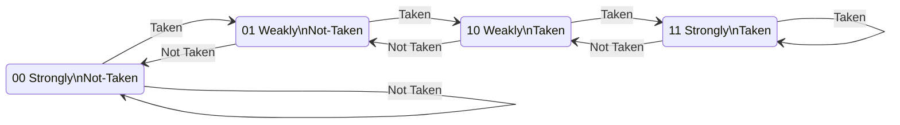
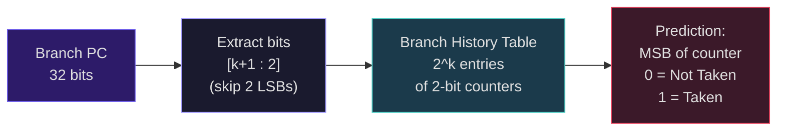
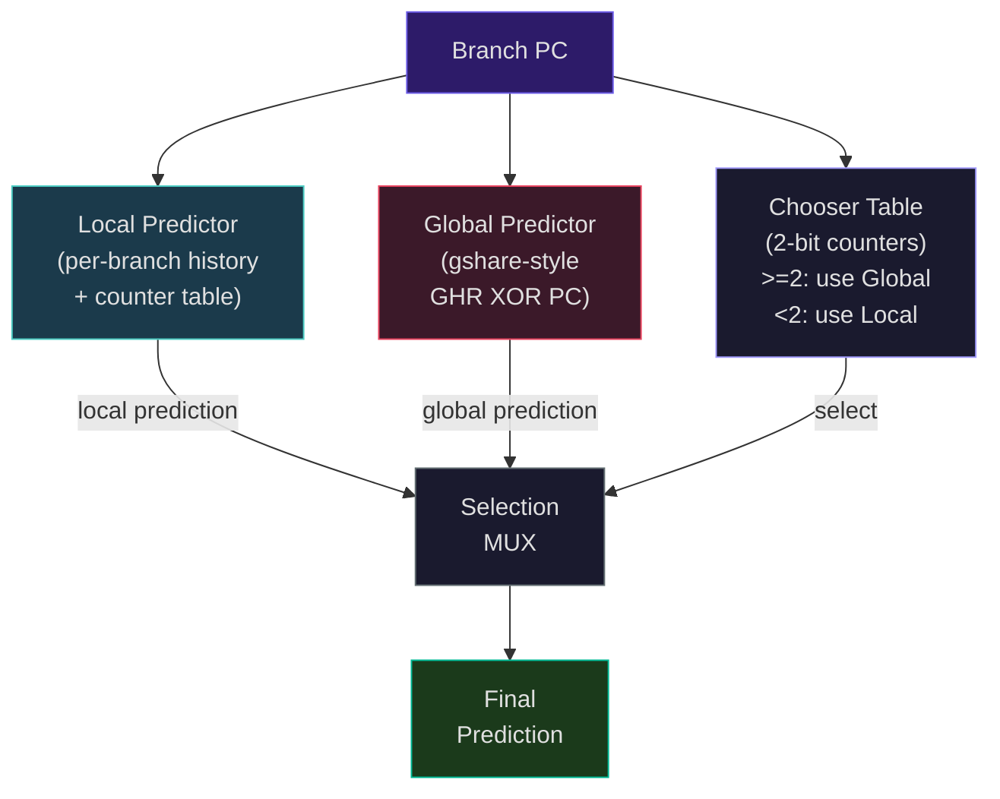
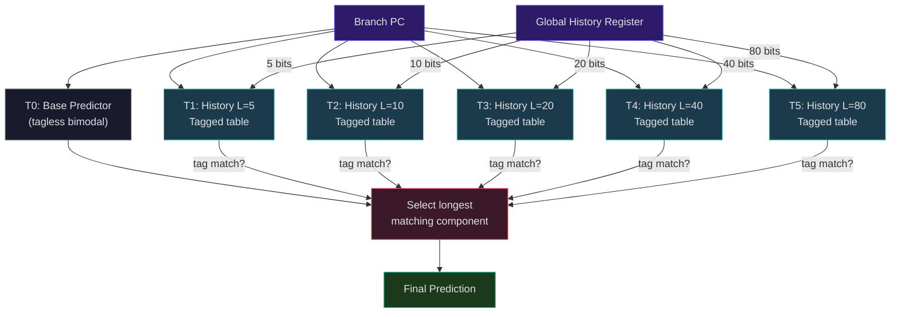

# Branch Prediction: From Saturating Counters to Neural Predictors

Roughly 20% of all instructions in typical programs are branches. In a pipelined processor, each mispredicted branch wastes 1-2 cycles in a simple 5-stage pipeline, or 13-17 cycles in a modern deeply-pipelined design like AMD Zen 4 or Intel Golden Cove. With a 20% branch frequency and a 17-cycle mispredict penalty, even a 5% misprediction rate costs:

$$\text{CPI penalty} = 0.20 \times 0.05 \times 17 = 0.17$$

That is a 17% increase in effective CPI from branch mispredictions alone. Intel's Raptor Cove shows this concretely: its 17-cycle minimum branch mispredict penalty (from the ~20-stage pipeline) makes accurate prediction essential. At 5 GHz, those 17 wasted cycles represent 3.4 ns -- enough time to complete 17 useful instructions in an ideal pipeline. Branch prediction is not optional; it is the single most important mechanism for keeping a deep pipeline full.

## Static Prediction

The simplest approach is to make predictions based on the instruction alone, without any runtime history.

**Always predict not taken:** Fetch the next sequential instruction. If the branch is taken, flush the pipeline and redirect. This works well for branches that are rarely taken (error checks, bounds checks) but poorly for loops.

**Backward taken, forward not taken (BTFNT):** Backward branches (target address < branch address) are loop back-edges and are taken on every iteration except the last. Forward branches often skip code (error handling, special cases) and are not taken on the common path. This simple heuristic achieves roughly 60-65% accuracy -- better than a coin flip but far from adequate for modern pipelines.

Static prediction requires no hardware state beyond comparing the branch target direction. But it ignores the actual behavior of the program, which is dynamic and often highly predictable from recent history.

## Dynamic Prediction: Learning from History

Dynamic prediction records the outcomes of previous branch executions and uses those observations to predict future behavior. The fundamental insight is that most branches exhibit strong patterns: loop branches are taken many times then not taken once; conditional branches in frequently executed code tend to follow the same path repeatedly.

### The 1-Bit Predictor

The simplest dynamic predictor stores a single bit per branch, recording the last outcome:

- **0**: Predict not taken
- **1**: Predict taken

After each branch executes, update the bit to the actual outcome. This predictor captures the dominant direction of each branch but has a critical weakness: it **mispredicts twice** at every loop boundary. Consider a loop that iterates 10 times:

```
Iteration:  1  2  3  4  5  6  7  8  9  10  (exit)  1  2  ...
Outcome:    T  T  T  T  T  T  T  T  T   N         T  T  ...
Prediction: N  T  T  T  T  T  T  T  T   T         N  T  ...
Correct?    X  Y  Y  Y  Y  Y  Y  Y  Y   X         X  Y  ...
```

The predictor mispredicts on the first iteration (predicting not-taken from the previous loop exit) and on the loop exit (predicting taken). For a loop with $n$ iterations, accuracy is $\frac{n-2}{n}$, which is poor for short loops. A nested loop with an inner count of 4 achieves only 50% accuracy.

### The 2-Bit Saturating Counter

The 2-bit predictor is the workhorse of basic branch prediction, first analyzed by James Smith in his seminal 1981 paper "A Study of Branch Prediction Strategies." It uses a 2-bit saturating counter per branch with four states:



States 00 and 01 predict **not-taken** (MSB = 0). States 10 and 11 predict **taken** (MSB = 1). The ASCII version:

```
         Taken             Taken             Taken
  ┌──────────────┐  ┌──────────────┐  ┌──────────────┐
  │              ▼  │              ▼  │              ▼
 [00]          [01]              [10]              [11]
Strongly      Weakly           Weakly           Strongly
Not-Taken    Not-Taken          Taken             Taken
  ▲              │  ▲              │  ▲              │
  └──────────────┘  └──────────────┘  └──────────────┘
      Not Taken         Not Taken         Not Taken
```

The prediction is based on the most significant bit: states 00 and 01 predict not-taken; states 10 and 11 predict taken. The counter increments on taken outcomes and decrements on not-taken outcomes, but **saturates** at the extremes (00 and 11) rather than wrapping around.

The key advantage: the predictor must observe **two consecutive** outcomes contrary to its prediction before it changes its mind. This means a loop back-edge in state 11 (strongly taken) stays in state 10 (weakly taken) after the loop exit, and correctly predicts taken on the next loop entry. Only one misprediction per loop invocation instead of two.

Explore this concept with the interactive simulation below:

<Simulation id="branch-predictor" />

```python
from enum import IntEnum
from typing import List, Tuple

class CounterState(IntEnum):
    STRONGLY_NOT_TAKEN = 0
    WEAKLY_NOT_TAKEN = 1
    WEAKLY_TAKEN = 2
    STRONGLY_TAKEN = 3

class TwoBitPredictor:
    """2-bit saturating counter branch predictor."""

    def __init__(self, num_entries: int = 1024):
        """Initialize predictor with num_entries counters, all starting weakly not-taken."""
        self.num_entries = num_entries
        self.counters: List[int] = [CounterState.WEAKLY_NOT_TAKEN] * num_entries

    def _index(self, pc: int) -> int:
        """Map a branch PC to a counter index using low-order bits."""
        return (pc >> 2) % self.num_entries  # Ignore lowest 2 bits (byte alignment)

    def predict(self, pc: int) -> bool:
        """Predict taken (True) or not-taken (False)."""
        idx = self._index(pc)
        return self.counters[idx] >= CounterState.WEAKLY_TAKEN

    def update(self, pc: int, taken: bool) -> None:
        """Update the counter after observing the actual outcome."""
        idx = self._index(pc)
        if taken:
            if self.counters[idx] < CounterState.STRONGLY_TAKEN:
                self.counters[idx] += 1
        else:
            if self.counters[idx] > CounterState.STRONGLY_NOT_TAKEN:
                self.counters[idx] -= 1

# Demonstrate on a loop pattern: 9 taken, 1 not-taken, repeated
predictor = TwoBitPredictor(num_entries=64)
branch_pc = 0x1000
outcomes = [True] * 9 + [False]  # One loop iteration
correct = 0
total = 0
for iteration in range(5):  # 5 loop invocations
    for taken in outcomes:
        pred = predictor.predict(branch_pc)
        predictor.update(branch_pc, taken)
        if pred == taken:
            correct += 1
        total += 1

print(f"Accuracy: {correct}/{total} = {correct/total:.1%}")
# With 2-bit counter: only 1 misprediction per 10-branch loop invocation
# After warmup: ~90% accuracy for this pattern
```

<ConceptCheck id="cc-1" />

### Branch History Table (BHT)

The BHT is a table of 2-bit counters indexed by bits of the branch PC. The following diagram shows how the PC is mapped to a table entry:



A practical predictor needs a table of 2-bit counters indexed by the branch address -- the **Branch History Table (BHT)**. The low-order bits of the PC (excluding the two least-significant bits, since RISC-V instructions are 4-byte aligned) select an entry.

With $2^k$ entries, the BHT uses $k$ bits of the PC as an index. Different branches may map to the same entry (**aliasing**), causing destructive interference. A 1024-entry BHT (2 KB of state) gives reasonable accuracy for small programs but suffers from aliasing in larger workloads.

**Size vs. accuracy tradeoff:** Larger tables reduce aliasing. On SPEC 2000 benchmarks, a bimodal predictor with a large table saturates at roughly 93.5% accuracy -- it cannot exploit correlations between branches, no matter how large the table.

## Correlating Predictors

Many branch outcomes are correlated with the outcomes of other recent branches. Consider:

```c
if (x == 0) {       // Branch 1
    y = 1;
}
if (x > 0) {        // Branch 2: correlated with Branch 1!
    y = x;
}
```

If Branch 1 is taken (x == 0), Branch 2 is always not taken. A predictor that tracks only each branch's own history misses this correlation entirely. **Correlating predictors** (also called two-level predictors) use the history of recently executed branches to select among multiple prediction tables.

### The (m, n) Predictor

An (m, n) predictor uses $m$ bits of **global branch history** (the outcomes of the last $m$ branches) to select among $2^m$ separate tables, each containing $n$-bit saturating counters. A (2, 2) predictor uses the last 2 branch outcomes to choose among 4 tables of 2-bit counters.

The global history register (GHR) is a shift register that records the taken/not-taken outcomes of the most recent $m$ branches (1 = taken, 0 = not-taken). On each branch, the GHR shifts left and the new outcome enters at the LSB.

**gshare** (McFarling, 1993): Rather than concatenating the GHR with the PC to index the table (which requires a very large table), gshare **XORs** the GHR with the PC bits:

$$\text{index} = \text{PC}[k{:}2] \oplus \text{GHR}[k{-}1{:}0]$$

This simple hash distributes entries more uniformly, reducing aliasing without increasing table size. With a $k$-bit GHR and a $2^k$-entry table, gshare achieves significantly better accuracy than a simple bimodal predictor at the same storage budget. On SPEC 2000 with a 4 KB budget, gshare achieves about 93.8% accuracy -- modestly better than bimodal, but it can exploit branch correlations that bimodal cannot.

### Tournament Predictor

Some branches are best predicted by their own local history (loop branches with fixed iteration counts), while others are best predicted by global correlation patterns. A **tournament predictor** (also called a hybrid predictor) runs two separate predictors in parallel -- one local, one global -- and uses a **chooser** (another table of 2-bit counters) to select which predictor to trust for each branch.



The DEC Alpha 21264 (1998) used this approach: a local predictor with 1024 10-bit local history registers, each indexing a 1024-entry table of 3-bit counters, combined with a 4096-entry global predictor using a 12-bit GHR, arbitrated by a 4096-entry chooser table. This achieved roughly 94-95% accuracy on the workloads of its era.

```python
class TournamentPredictor:
    """Simple tournament predictor combining local and global predictors."""

    def __init__(self, table_size: int = 1024, history_len: int = 10):
        self.table_size = table_size
        self.history_len = history_len

        # Global predictor: gshare-style
        self.global_history: int = 0
        self.global_table: List[int] = [1] * table_size  # 2-bit counters

        # Local predictor: per-branch history selects counter
        self.local_history: List[int] = [0] * table_size
        self.local_table: List[int] = [1] * table_size

        # Chooser: 2-bit counters (>=2 favors global, <2 favors local)
        self.chooser: List[int] = [2] * table_size

    def _pc_index(self, pc: int) -> int:
        return (pc >> 2) % self.table_size

    def _global_index(self, pc: int) -> int:
        return ((pc >> 2) ^ self.global_history) % self.table_size

    def _local_index(self, pc: int) -> int:
        pc_idx = self._pc_index(pc)
        return self.local_history[pc_idx] % self.table_size

    def predict(self, pc: int) -> bool:
        pc_idx = self._pc_index(pc)
        global_pred = self.global_table[self._global_index(pc)] >= 2
        local_pred = self.local_table[self._local_index(pc)] >= 2
        use_global = self.chooser[pc_idx] >= 2
        return global_pred if use_global else local_pred

    def update(self, pc: int, taken: bool) -> None:
        pc_idx = self._pc_index(pc)
        gi = self._global_index(pc)
        li = self._local_index(pc)

        global_pred = self.global_table[gi] >= 2
        local_pred = self.local_table[li] >= 2

        # Update chooser: if one was right and other wrong, adjust
        if global_pred == taken and local_pred != taken:
            self.chooser[pc_idx] = min(3, self.chooser[pc_idx] + 1)
        elif local_pred == taken and global_pred != taken:
            self.chooser[pc_idx] = max(0, self.chooser[pc_idx] - 1)

        # Update both predictors
        val = 1 if taken else -1
        self.global_table[gi] = max(0, min(3, self.global_table[gi] + val))
        self.local_table[li] = max(0, min(3, self.local_table[li] + val))

        # Update histories
        self.global_history = ((self.global_history << 1) | int(taken)) & ((1 << self.history_len) - 1)
        self.local_history[pc_idx] = ((self.local_history[pc_idx] << 1) | int(taken)) & ((1 << self.history_len) - 1)
```

<ConceptCheck id="cc-2" />

## Advanced Predictors: TAGE

The state of the art in branch prediction is dominated by **TAGE** (TAgged GEometric history length), invented by Andre Seznec at INRIA/IRISA. TAGE won the 2nd Championship Branch Prediction (CBP-2, 2006), and its enhanced variant **TAGE-SC-L** (TAGE + Statistical Corrector + Loop predictor) has won every subsequent competition: CBP-3, CBP-4 (2014), and CBP-5 (2016).

### TAGE Architecture

The key insight of TAGE is using multiple tables with geometrically increasing history lengths. The longest-matching component provides the prediction:



TAGE consists of a base predictor $T_0$ and $n$ tagged predictor components $T_1, T_2, \ldots, T_n$:

**Base predictor $T_0$:** A simple tagless bimodal predictor indexed by the PC. This provides a default prediction when no tagged component matches.

**Tagged components $T_1$ through $T_n$:** Each component $T_i$ is a table of entries containing:
- A **tag** (partial, typically 8-12 bits) for identifying the branch+history context
- A **prediction counter** (2-3 bits)
- A **useful counter** (2 bits) indicating how valuable this entry is

The critical innovation: each component $T_i$ uses a **geometrically increasing** history length:

$$L(i) = \alpha^{i-1} \cdot L(1)$$

with typical values $L(1) \approx 5$, $\alpha \approx 2$, and up to $n = 12$ components. This gives history lengths spanning from 5 to over 640 branches. The entry is indexed by a hash of the PC and the global history of length $L(i)$.

### Prediction Mechanism

All components are looked up in parallel. The prediction comes from the **longest-matching component** -- the table with the longest history that has a tag match for the current branch:

1. Compute indices and tags for all components simultaneously
2. Check for tag matches in each component
3. Select the prediction from the component with the longest matching history
4. If no tagged component matches, use the base predictor $T_0$

This is analogous to **Prediction by Partial Matching (PPM)** in data compression -- use the longest context that has been seen before.

### Why TAGE Works So Well

**Tagging prevents destructive aliasing.** Unlike gshare, where unrelated branches sharing an index corrupt each other's counters, TAGE's tags ensure entries are used only by the branch+history context that created them. This allows very long histories (640+ branches) without the aliasing catastrophe that would make a gshare predictor with $2^{640}$ entries impractical.

**Geometric history captures correlations at multiple time scales.** Short history (5-10 branches) captures local patterns like alternating branches. Medium history (40-80 branches) captures function-level patterns. Long history (200-640 branches) captures phase-level behavior in programs. The geometric series ensures efficient coverage of all scales without wasting storage on uniform coverage.

On SPEC benchmarks with a 64 KB storage budget, TAGE-SC-L achieves 97-98% prediction accuracy, corresponding to MPKI (mispredictions per kilo-instruction) values around 3.4. A research study from 2019 ("Branch Prediction Is Not A Solved Problem") found that even with state-of-the-art predictors, modern server workloads still waste an average of 9.2% of cycles due to branch mispredictions, with individual workloads ranging from 3.6% to over 20%.

<ConceptCheck id="cc-3" />

## The Perceptron Branch Predictor

Daniel Jimenez and Calvin Lin introduced the **perceptron branch predictor** at HPCA 2001, applying a simple neural network to branch prediction. Each branch is associated with a perceptron -- a vector of integer weights $w_0, w_1, \ldots, w_n$:

$$y = w_0 + \sum_{i=1}^{n} w_i \cdot x_i$$

where $x_i \in \{-1, +1\}$ encodes the outcome of the $i$-th most recent branch (taken = +1, not taken = -1), and $w_0$ is a bias weight. The prediction is:

- **Taken** if $y \geq 0$
- **Not taken** if $y < 0$

### Training

After each branch resolves with actual outcome $t \in \{-1, +1\}$:

If the prediction was wrong OR the confidence is low ($|y| \leq \theta$):

$$w_i \leftarrow w_i + t \cdot x_i \quad \text{for all } i$$

The threshold $\theta$ is typically set to $\lfloor 1.93 \times n + 14 \rfloor$ where $n$ is the history length (derived from theoretical analysis of perceptron learning).

### Key Advantage: Linear Scaling

Table-based predictors like gshare require $2^n$ entries for $n$ bits of history -- exponential scaling. The perceptron predictor needs only $n+1$ weights per entry -- **linear scaling** with history length. This allows the perceptron to use histories of 62+ branches within a practical hardware budget, far longer than what gshare can afford.

On SPEC 2000 with a 4 KB hardware budget, Jimenez and Lin reported:

| Predictor | Misprediction Rate |
|-----------|-------------------|
| gshare | 6.2% |
| McFarling hybrid (Alpha 21264 style) | 5.4% |
| Perceptron | 4.6% |

A 26% reduction in misprediction rate versus gshare at the same storage budget. AMD's Zen, Zen 2, and Zen 3 microarchitectures used perceptron-based predictors before transitioning to TAGE variants in Zen 4 and Zen 5.

```python
from typing import List

class PerceptronPredictor:
    """Perceptron branch predictor (Jimenez & Lin, HPCA 2001)."""

    def __init__(self, table_size: int = 256, history_len: int = 32):
        self.table_size = table_size
        self.history_len = history_len
        # Each entry: bias weight + history_len weights
        self.weights: List[List[int]] = [
            [0] * (history_len + 1) for _ in range(table_size)
        ]
        self.ghr: List[int] = [-1] * history_len  # Global history, -1 = not taken
        self.theta: int = int(1.93 * history_len + 14)  # Training threshold

    def _index(self, pc: int) -> int:
        return (pc >> 2) % self.table_size

    def predict(self, pc: int) -> Tuple[bool, int]:
        """Predict and return (prediction, raw output y)."""
        idx = self._index(pc)
        w = self.weights[idx]
        y = w[0]  # Bias weight
        for i in range(self.history_len):
            y += w[i + 1] * self.ghr[i]
        return (y >= 0, y)

    def update(self, pc: int, taken: bool) -> None:
        idx = self._index(pc)
        t = 1 if taken else -1
        pred, y = self.predict(pc)

        # Train if misprediction or low confidence
        if (pred != taken) or (abs(y) <= self.theta):
            w = self.weights[idx]
            w[0] += t  # Update bias
            for i in range(self.history_len):
                w[i + 1] += t * self.ghr[i]
                # Clamp weights to prevent overflow (typically 8-bit signed)
                w[i + 1] = max(-127, min(127, w[i + 1]))

        # Update global history register
        self.ghr.pop()           # Remove oldest
        self.ghr.insert(0, t)    # Insert newest at front
```

## Branch Target Buffer (BTB)

Predicting the **direction** (taken/not-taken) is only half the problem. For taken branches, the processor also needs to predict the **target address** -- where the branch jumps to. The **Branch Target Buffer (BTB)** is a cache of recently executed branch targets, indexed by the branch's PC.

Each BTB entry stores:
- **Tag:** Upper bits of the branch PC (for matching)
- **Target address:** Where the branch jumps to
- **Type field:** Conditional branch, unconditional jump, call, or return

Modern processors use multi-level BTBs:

| Processor | L1 BTB | L2 BTB | Mispredict Penalty |
|-----------|--------|--------|-------------------|
| Intel Golden Cove | ~6K entries | ~12K entries | 17 cycles |
| AMD Zen 4 | 1,536 entries | 7,168 entries | ~13 cycles |
| AMD Zen 5 | 16K entries | 8K entries | ~13 cycles |

The BTB operates in the fetch stage: the fetch PC simultaneously indexes the BTB, the direction predictor (TAGE/perceptron), and the instruction cache. If the BTB indicates the instruction is a branch and the direction predictor says "taken," the next fetch address is redirected to the BTB's stored target -- all within the same cycle or the cycle immediately after fetch.

## Return Address Stack (RAS)

Function returns (RET/JALR in RISC-V) always jump to the address of the instruction after the corresponding CALL (JAL). A simple hardware **stack** provides near-perfect prediction for returns:

1. **On CALL (JAL):** Push the return address (PC + 4) onto the RAS
2. **On RET:** Pop the top of the RAS and use it as the predicted target

The RAS is extremely accurate (>99%) because call/return pairs naturally form a stack discipline. Typical implementations use 16-32 entries (AMD Zen family uses 32 entries per hardware thread). Mispredictions occur only when:

- Call depth exceeds RAS capacity (very rare in practice)
- Exceptions or longjmp disrupt the call/return pairing
- Speculative execution corrupts the RAS (modern designs use **checkpointing** to restore the RAS on misspeculation)

### AMD Zen 5's 2-Ahead Branch Predictor

AMD's Zen 5 microarchitecture (Ryzen 9000, 2024) introduced a distinctive **2-ahead branch predictor** -- an idea from the 1990s finally realized in production silicon. Traditional predictors predict one branch per cycle; if the branch is taken, the next cycle must fetch from the new target. Zen 5 predicts **two taken branches per cycle** across non-contiguous blocks: the first prediction feeds into a second prediction in the same cycle. This effectively doubles fetch throughput for branch-heavy code, reducing the taken-branch bandwidth penalty that has historically limited superscalar performance.

<ConceptCheck id="cc-4" />

## Putting It All Together: The Prediction Pipeline

In a modern out-of-order processor, the prediction machinery integrates BTB, direction predictor, and RAS in a coordinated pipeline:

```
Fetch PC ─────► BTB ─────► Is it a branch? What type?
                  │
         ┌───────┼───────┐
         ▼       ▼       ▼
    Conditional  Call   Return
         │       │       │
         ▼       │       ▼
    Direction    │     RAS Pop
    Predictor    │       │
   (TAGE/Perc)  │       │
         │       │       │
         ▼       ▼       ▼
    If taken:  Push RAS  Use RAS target
    use BTB    + use     as next
    target     BTB       fetch PC
               target
```

All of this happens in the fetch stage -- before the instruction is even decoded. The prediction must be available within 1-2 cycles to keep the pipeline fed. Getting it wrong means flushing 13-17 cycles of work in a modern pipeline.

## Security Implications

The BTB and RAS have been implicated in speculative execution attacks. **Spectre Variant 2** (Branch Target Injection) poisons BTB entries to redirect speculative execution to attacker-controlled code gadgets. The **ret2spec** attack manipulates the RAS to speculatively redirect returns. Mitigations include retpolines, Indirect Branch Restricted Speculation (IBRS), and microcode updates that flush or partition the BTB/RAS across security boundaries. These mitigations come at a performance cost, further underscoring the importance of prediction accuracy.

## Summary

Branch prediction has evolved from simple 1-bit predictors to sophisticated multi-component systems capable of 97%+ accuracy. The 2-bit saturating counter forms the foundation, eliminating the double-misprediction problem of 1-bit designs. Correlating predictors (gshare) exploit relationships between branches. Tournament predictors combine local and global perspectives. TAGE's tagged geometric history achieves state-of-the-art accuracy through efficient multi-scale pattern matching. Perceptron predictors bring neural network principles to bear with linear scaling. The BTB and RAS handle target prediction, and AMD's 2-ahead predictor pushes the frontier of fetch bandwidth. Together, these mechanisms are the reason modern processors can sustain high throughput despite pipeline depths of 17-20 stages.
