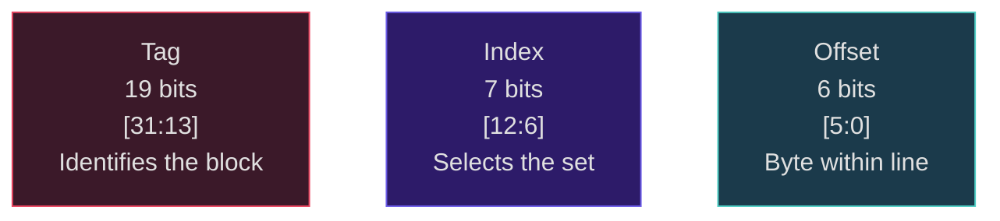
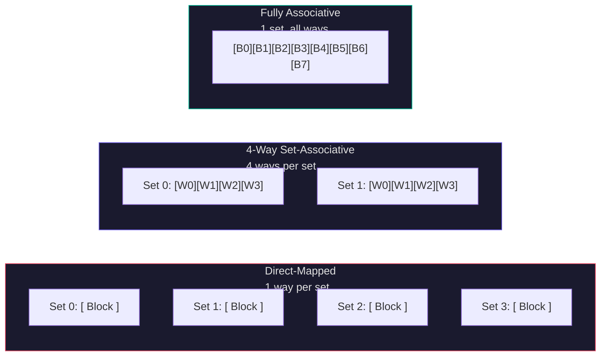
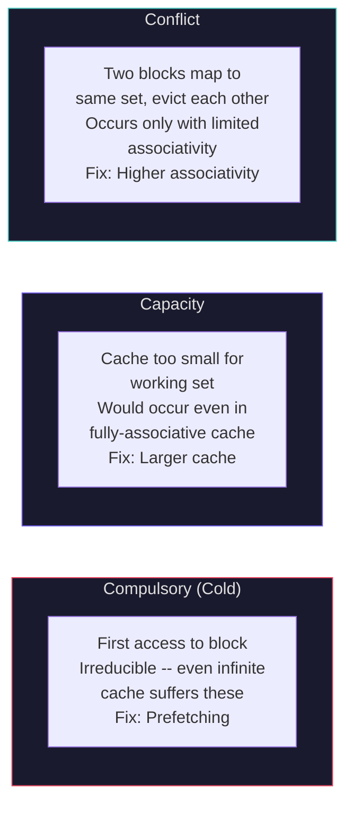
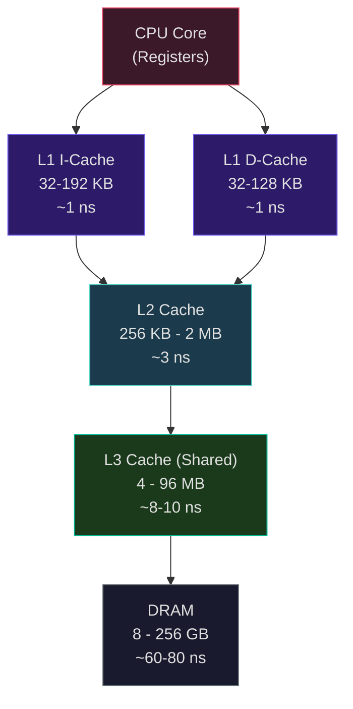

# Cache Design and the Memory Hierarchy

The processor we built in Weeks 6-7 can execute billions of operations per second. But there is a problem: main memory cannot keep up. A modern CPU core at 5 GHz completes an instruction every 0.2 ns. A DDR5-6400 DRAM access takes roughly 10-12 ns of real latency -- 50 to 60 times slower. Without intervention, the processor would spend the vast majority of its time waiting for data. This is the **memory wall**, and caches are the primary mechanism the industry has deployed to mitigate it.

## The Memory Wall

The disparity between processor speed and memory speed has grown relentlessly since the 1980s. Processor performance improved at roughly 52% per year (until the power wall around 2005), while DRAM latency improved at only about 7% per year. The result is a gap that has widened by orders of magnitude.

Consider concrete numbers for a modern system. An Intel Raptor Cove core at 5.5 GHz has a cycle time of about 0.18 ns. The L1 data cache delivers data in 5 cycles (~0.9 ns). The L2 cache takes about 15 cycles (~2.7 ns). The shared L3 takes 42-46 cycles (~7.6-8.4 ns). And DDR5-6400 main memory takes 60-80 ns -- roughly 330-440 cycles. If every instruction needed data from DRAM, our 5.5 GHz processor would effectively run at about 15 MHz. Caches exist to ensure that the common case is a fast access, not a slow one.

## Locality: Why Caches Work

Caches exploit two fundamental properties of program behavior:

**Temporal locality:** If a memory location was accessed recently, it is likely to be accessed again soon. Variables in loops, function return addresses, and frequently used data structures all exhibit temporal locality.

**Spatial locality:** If a memory location was accessed, nearby locations are likely to be accessed soon. Sequential instruction fetch, array traversal, and struct field access all exhibit spatial locality. Caches exploit spatial locality by fetching entire **blocks** (cache lines) -- typically 64 bytes -- even if only a single byte was requested.

These properties are not accidents; they arise from the fundamental structure of programs. Loops access the same instructions and data repeatedly (temporal). Arrays are laid out contiguously in memory and accessed sequentially (spatial). Together, these properties allow a small, fast cache to satisfy 90-99% of accesses for typical workloads.

## Cache Organization

A cache is a small, fast memory that stores recently accessed blocks of data. The fundamental design question is: given a memory address, where can the corresponding block be stored in the cache?

### Address Decomposition

Every memory address is decomposed into three fields that determine how the cache handles it. The following diagram shows how a 32-bit address maps to cache fields for a 32 KB, 4-way set-associative cache with 64-byte lines:



$$\text{Address} = [\underbrace{\text{Tag}}_{\text{identify the block}} \mid \underbrace{\text{Index}}_{\text{select the set}} \mid \underbrace{\text{Offset}}_{\text{byte within block}}]$$

For a cache with $2^s$ sets, block size $B = 2^b$ bytes:
- **Offset** = lowest $b$ bits: selects the byte within the cache line
- **Index** = next $s$ bits: selects which set to look in
- **Tag** = remaining upper bits: uniquely identifies which block is stored

### Direct-Mapped Cache

In a **direct-mapped** cache, each memory block maps to exactly one cache line. The index field directly selects the line. To check for a hit, compare the tag stored in that line against the tag from the address.

Advantages: Simple, fast (single comparator), cheap.
Disadvantage: **Conflict misses** -- two blocks that map to the same index constantly evict each other, even if other cache lines are empty.

Consider a 256-byte direct-mapped cache with 16-byte blocks: 256/16 = 16 lines, so the index is 4 bits, offset is 4 bits, and for a 32-bit address the tag is 24 bits.

```python
import math
from typing import Tuple

def decompose_address(address: int, cache_size: int,
                      block_size: int, associativity: int,
                      addr_bits: int = 32) -> Tuple[int, int, int]:
    """Decompose an address into tag, index, and offset fields.

    Args:
        address: Memory address to decompose
        cache_size: Total cache size in bytes
        block_size: Size of each cache block in bytes
        associativity: Number of ways (1 = direct-mapped)
        addr_bits: Width of the address in bits

    Returns:
        Tuple of (tag, index, offset)
    """
    num_blocks = cache_size // block_size
    num_sets = num_blocks // associativity

    offset_bits = int(math.log2(block_size))
    index_bits = int(math.log2(num_sets))
    tag_bits = addr_bits - offset_bits - index_bits

    offset_mask = (1 << offset_bits) - 1
    index_mask = (1 << index_bits) - 1

    offset = address & offset_mask
    index = (address >> offset_bits) & index_mask
    tag = address >> (offset_bits + index_bits)

    return tag, index, offset

# Example: 32KB cache, 64B blocks, 4-way set-associative
tag, idx, off = decompose_address(0x0001A3C0, 32768, 64, 4)
# offset_bits = 6, index_bits = 7, tag_bits = 19
print(f"Address 0x0001A3C0: tag={tag}, index={idx}, offset={off}")
# tag=13, index=15, offset=0
```

<ConceptCheck id="cc-1" />

### Fully Associative Cache

In a **fully associative** cache, a block can be placed in any line. There is only one set (containing all lines), so the index field has zero bits. Every access must compare the tag against all lines in parallel using **Content-Addressable Memory (CAM)** -- hardware that compares a search key against all stored keys simultaneously.

Advantages: No conflict misses (a block is evicted only when the cache is truly full).
Disadvantages: Expensive -- requires one comparator per line. Practical only for small structures (TLBs, BTBs).

### N-Way Set-Associative Cache

The three cache organizations represent a spectrum from most restrictive placement (direct-mapped) to least restrictive (fully associative):



The **set-associative** cache is the practical compromise. The cache is divided into $S$ sets, each containing $N$ lines (ways). A block's index field selects the set; the block can be stored in any of the $N$ ways within that set. On lookup, $N$ tags are compared in parallel.

For a cache with total size $C$, block size $B$, and associativity $N$:

$$\text{Number of sets} = S = \frac{C}{B \times N}$$

$$\text{offset bits} = \log_2 B, \quad \text{index bits} = \log_2 S, \quad \text{tag bits} = \text{addr\_bits} - \text{offset bits} - \text{index bits}$$

**Worked example:** Consider a 32 KB cache with 64-byte blocks and 4-way associativity:

$$S = \frac{32768}{64 \times 4} = 128 \text{ sets}$$

$$\text{offset} = \log_2 64 = 6 \text{ bits}, \quad \text{index} = \log_2 128 = 7 \text{ bits}, \quad \text{tag} = 32 - 6 - 7 = 19 \text{ bits}$$

In real processors: Intel Raptor Cove uses 48 KB, 12-way L1D; AMD Zen 4 uses 32 KB, 8-way L1D; Apple M3 uses a remarkably large 128 KB, L1D. Higher associativity reduces conflict misses but increases access latency (more comparators) and power.

Explore this concept with the interactive simulation below:

<Simulation id="cache" />

## Replacement Policies

When a set is full and a new block must be brought in, which existing block do we evict?

**LRU (Least Recently Used):** Evict the block that was accessed least recently. Optimal for temporal locality but expensive to implement exactly -- tracking the full LRU order for $N$ ways requires $\log_2(N!)$ bits per set. For 16-way associativity, that is $\log_2(16!) \approx 44$ bits per set.

**Tree-PLRU (Pseudo-LRU):** Approximate LRU using a binary tree of $N-1$ bits per set. Each bit indicates which subtree contains the more recently accessed line. On access, update the path bits. On eviction, follow the tree to the least recently used subtree. This is what most real processors use.

**Random:** Select a victim uniformly at random. Surprisingly competitive -- only 1-2% worse hit rate than LRU for large caches, and trivial to implement.

**FIFO:** Evict the oldest block (by insertion time). Simple but can evict frequently used blocks.

<ConceptCheck id="cc-2" />

## Write Policies

When the processor writes to a cached block, how do we keep memory consistent?

**Write-through:** Every write updates both the cache and main memory immediately. Simple and always consistent, but generates heavy write traffic. Often paired with a **write buffer** to absorb bursts.

**Write-back:** Writes update only the cache. The block is marked **dirty** (a dirty bit per line). The modified block is written to memory only when it is evicted. This dramatically reduces write traffic -- a block modified 100 times in a loop generates only one memory write when evicted. Modern processors universally use write-back for L1 caches.

**Write-allocate:** On a write miss, fetch the block into the cache, then perform the write. This is the typical policy paired with write-back.

**No-write-allocate (write-around):** On a write miss, write directly to the next level without bringing the block into the cache. Useful when the written data will not be read again soon.

## The Three C's of Cache Misses

Mark Hill and Alan Jay Smith classified cache misses into three categories, a framework universally used in cache analysis:

**Compulsory misses** (cold misses): The first access to a block will always miss -- the block has never been in the cache. These are irreducible; even an infinite cache suffers them. Prefetching can mitigate compulsory misses by fetching blocks before they are demanded.

**Capacity misses:** The cache is too small to hold all the blocks the program needs. These would occur even in a fully associative cache of the same total size. Increasing cache size reduces capacity misses.

**Conflict misses:** The cache has limited associativity, and two blocks that map to the same set evict each other even though other sets have space. A direct-mapped cache has the most conflict misses; a fully associative cache has zero. Increasing associativity reduces conflict misses.

$$\text{Total misses} = \text{Compulsory} + \text{Capacity} + \text{Conflict}$$



To classify misses empirically: run the same trace on a fully associative cache of the same total size. Misses in both are capacity (or compulsory); misses only in the actual cache are conflict.

## Average Memory Access Time (AMAT)

The AMAT formula quantifies memory system performance:

$$\text{AMAT} = \text{Hit Time} + \text{Miss Rate} \times \text{Miss Penalty}$$

For a single-level cache: if hit time is 1 ns, miss rate is 5%, and miss penalty is 80 ns:

$$\text{AMAT} = 1 + 0.05 \times 80 = 5 \text{ ns}$$

That 5% miss rate costs us a 5x increase in effective memory access time. This is why even small reductions in miss rate have enormous performance impact.

For a multi-level hierarchy:

$$\text{AMAT} = \text{HT}_{L1} + \text{MR}_{L1} \times (\text{HT}_{L2} + \text{MR}_{L2} \times (\text{HT}_{L3} + \text{MR}_{L3} \times \text{MP}_{DRAM}))$$

<ConceptCheck id="cc-3" />

## Multi-Level Cache Hierarchies

The following diagram shows the hierarchy from the fast, small L1 caches through to slow, large DRAM. Each level is progressively larger and slower:



Modern processors use 2-3 levels of cache to bridge the speed gap between the core and DRAM.

### Real Specifications from Industry

**Intel Raptor Lake (13th/14th Gen, P-Cores):**

| Level | Size | Associativity | Latency (cycles) | Latency (ns, ~5.5 GHz) | Line Size |
|-------|------|---------------|-------------------|------------------------|-----------|
| L1I | 32 KB | 8-way | ~4 | ~0.7 | 64B |
| L1D | 48 KB | 12-way | ~5 | ~0.9 | 64B |
| L2 | 2 MB | 16-way | ~15 | ~2.7 | 64B |
| L3 (shared) | 36 MB | 12-way | ~42-46 | ~7.6-8.4 | 64B |

**AMD Zen 4 (Ryzen 7000):**

| Level | Size | Associativity | Latency (cycles) | Latency (ns, ~5.5 GHz) |
|-------|------|---------------|-------------------|------------------------|
| L1I | 32 KB | 8-way | ~4 | ~0.7 |
| L1D | 32 KB | 8-way | ~4 | ~0.7 |
| L2 | 1 MB | 8-way | ~14 | ~2.7 |
| L3 | 32 MB | 16-way | ~50 | ~10 |

AMD's V-Cache variants (e.g., 9800X3D) bond a 64 MB SRAM chiplet on top of each CCD using TSMC SoIC 3D stacking, extending L3 to 96 MB. The stacking adds ~4 cycles of latency but the 3x capacity dramatically improves hit rates for data-intensive workloads.

**Apple M3 (P-Cores):**

| Level | Size | Latency (cycles) | Latency (ns, ~4.05 GHz) |
|-------|------|-------------------|-------------------------|
| L1I | 192 KB | ~3 | ~0.7 |
| L1D | 128 KB | ~3 | ~0.7 |
| L2 | 16 MB | ~11-15 | ~2.7-3.7 |
| SLC | 8-64 MB | ~18-23 | ~5-6 |

Apple's architecture is distinctive: the L1 caches are dramatically larger than x86 designs (128 KB L1D vs. 32-48 KB), and the **System Level Cache (SLC)** replaces the traditional L3 with an **exclusive** (non-inclusive) last-level cache shared by CPU, GPU, and Neural Engine. Exclusive caching means data in the SLC is not duplicated in L1/L2, maximizing effective capacity.

### Inclusion Policies

**Inclusive:** Every block in L1 is also in L2. On an L2 eviction, the corresponding block must be invalidated in L1 (**back-invalidation**). Simplifies coherence (a snoop only needs to check L2) but wastes capacity (data duplicated across levels).

**Exclusive:** A block exists in exactly one level. On an L1 miss, the block is fetched from L2 and removed from L2 (swap). Maximizes effective capacity. Apple's SLC uses this approach.

**NINE (Non-Inclusive Non-Exclusive):** No strict guarantee either way. A block may or may not be in both levels. Intel's recent designs lean toward this approach for the L2-L3 relationship. Simplest to implement but requires snooping both levels for coherence.

```python
from dataclasses import dataclass
from typing import List

@dataclass
class CacheLevel:
    """Specification for one level of the cache hierarchy."""
    name: str
    size_kb: float
    associativity: int
    latency_cycles: int
    clock_ghz: float
    line_size: int = 64

    @property
    def latency_ns(self) -> float:
        return self.latency_cycles / self.clock_ghz

    @property
    def num_sets(self) -> int:
        total_bytes = int(self.size_kb * 1024)
        num_blocks = total_bytes // self.line_size
        return num_blocks // self.associativity

def compute_amat(levels: List[CacheLevel], miss_rates: List[float],
                  dram_latency_ns: float) -> float:
    """Compute AMAT for a multi-level cache hierarchy.

    Args:
        levels: List of cache levels from L1 to last level
        miss_rates: Miss rate at each level (local miss rate)
        dram_latency_ns: DRAM access latency in nanoseconds

    Returns:
        Average memory access time in nanoseconds
    """
    if len(levels) == 0:
        return dram_latency_ns

    amat = levels[0].latency_ns
    penalty = dram_latency_ns
    for i in range(len(levels) - 1, -1, -1):
        if i == len(levels) - 1:
            penalty = dram_latency_ns
        else:
            penalty = levels[i + 1].latency_ns + miss_rates[i + 1] * penalty
        if i == 0:
            amat = levels[0].latency_ns + miss_rates[0] * penalty
    return amat

# Intel Raptor Lake example
raptor = [
    CacheLevel("L1D", 48, 12, 5, 5.5),
    CacheLevel("L2", 2048, 16, 15, 5.5),
    CacheLevel("L3", 36864, 12, 44, 5.5),
]
# Typical miss rates: L1 5%, L2 20%, L3 40%
amat = compute_amat(raptor, [0.05, 0.20, 0.40], 70.0)
print(f"Raptor Lake AMAT: {amat:.2f} ns")
```

<ConceptCheck id="cc-4" />

## Connection to Project 3

In Project 3, you will build a configurable cache simulator that implements direct-mapped, set-associative, and fully-associative organizations with LRU and random replacement. Your simulator will process address traces, compute hit rates, classify misses using the three-C model, and compute AMAT for multi-level hierarchies. The concepts in this lecture -- address decomposition, tag matching, replacement policies, and the AMAT formula -- are the foundation of every aspect of that project.

## Summary

The memory wall forces modern processors to rely on caches to bridge the gap between core speed and DRAM latency -- a gap that can be 300x or more. Caches exploit temporal and spatial locality through block-based storage in a hierarchy of increasing size and latency. Direct-mapped caches are fast but suffer conflict misses; fully associative caches eliminate conflicts but are expensive; set-associative caches provide the practical compromise used in all real processors. Replacement policies (LRU, PLRU, random) and write policies (write-back, write-through) further shape cache behavior. The AMAT formula quantifies how hit time, miss rate, and miss penalty interact across multiple levels. Real-world caches range from Apple's 128 KB L1D to AMD's 96 MB V-Cache L3, each designed for different performance tradeoffs. Next lecture, we tackle virtual memory, TLBs, and the Roofline model for understanding the interplay between computation and memory bandwidth.
