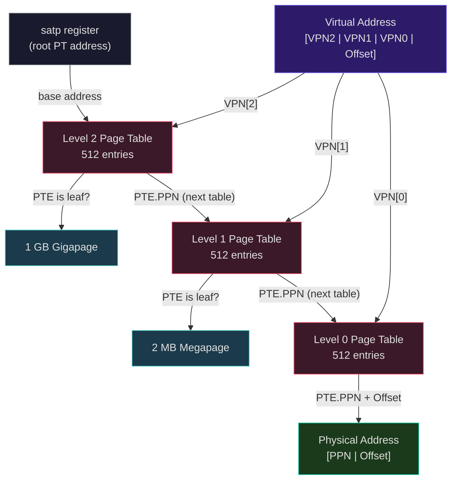
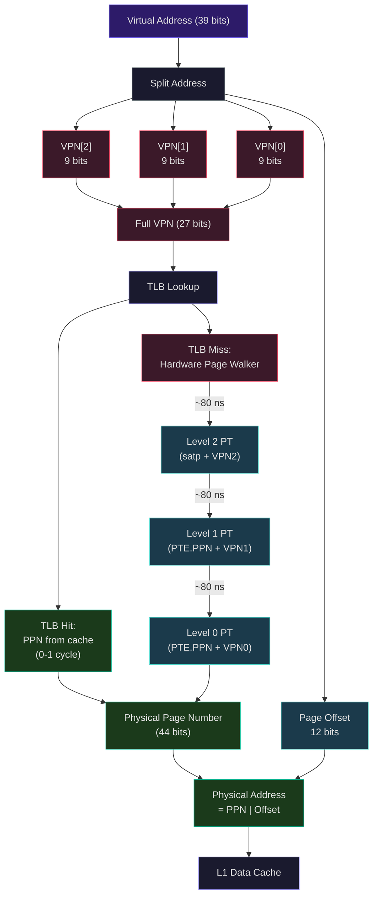
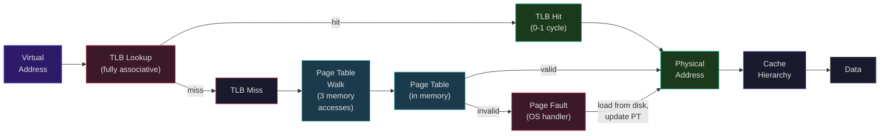
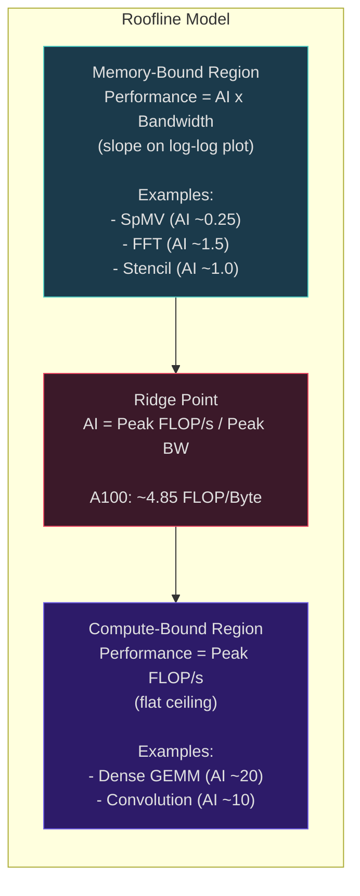

# Virtual Memory, TLBs, and the Roofline Model

Last lecture we built caches to bridge the speed gap between the processor and DRAM. But we assumed the processor operates directly on physical memory addresses -- that every address the CPU generates corresponds directly to a location in physical RAM. In reality, modern processors use **virtual memory**, an abstraction layer that gives each process the illusion of having its own private, contiguous address space, regardless of how physical memory is actually organized. Virtual memory is one of the most important abstractions in computer science: it provides memory isolation between processes, enables programs to use more memory than physically available, simplifies memory management for the operating system, and forms the basis of modern security protections.

## Why Virtual Memory

Consider a system running 50 processes simultaneously, each compiled to use addresses starting at 0x0. Without virtual memory, every process would need to be aware of every other process's memory layout, relocation would be a nightmare, and a bug in one process could corrupt another's data. Virtual memory solves these problems by introducing a level of indirection:

**Isolation:** Each process sees its own virtual address space. Process A's address 0x1000 maps to a completely different physical location than Process B's address 0x1000. A wild pointer in one process cannot corrupt another.

**Larger apparent memory:** A process can have a 48-bit (256 TB) virtual address space even on a machine with 16 GB of physical RAM. Pages not currently in use can live on disk, brought in on demand.

**Sharing:** Multiple processes can map the same physical page into their virtual address spaces (shared libraries, shared memory IPC).

**Protection:** Each page has permission bits (read, write, execute) enforced by hardware. The kernel's pages are marked supervisor-only, preventing user code from accessing kernel memory.

## Page Tables: Translating Virtual to Physical Addresses

The virtual address space is divided into fixed-size **pages** (typically 4 KB). Physical memory is divided into **frames** of the same size. A **page table** maps virtual page numbers (VPNs) to physical frame numbers (PFNs).

For a 32-bit virtual address with 4 KB pages:

$$\text{Virtual address} = [\underbrace{\text{VPN}}_{\text{20 bits}} \mid \underbrace{\text{Page Offset}}_{\text{12 bits}}]$$

The VPN indexes the page table, which returns the PFN. The physical address is formed by concatenating the PFN with the page offset.

### The Problem with Single-Level Page Tables

A single flat page table for a 32-bit address space with 4 KB pages has $2^{20} = 1{,}048{,}576$ entries. At 4 bytes per entry, that is 4 MB per process -- manageable. But for a 64-bit address space? Even a 48-bit virtual address space has $2^{36}$ entries at 8 bytes each = 512 GB per process. Obviously impossible.

### Multi-Level Page Tables

The solution is a **multi-level** (hierarchical) page table. Instead of one flat table, we create a tree of tables. Only the portions of the tree that correspond to mapped virtual addresses actually exist in memory.

## RISC-V Sv39: A Concrete Multi-Level Page Table

RISC-V defines the **Sv39** virtual memory scheme for 64-bit processors. It uses 39-bit virtual addresses with 3-level page tables:

```
63        39 38      30 29      21 20      12 11        0
+----------+-----------+-----------+-----------+-----------+
|  Must be |  VPN[2]   |  VPN[1]   |  VPN[0]   |  Offset   |
| sign-ext | (9 bits)  | (9 bits)  | (9 bits)  | (12 bits) |
+----------+-----------+-----------+-----------+-----------+
```

- Bits 63-39: Must equal bit 38 (sign extension for canonical addresses)
- VPN[2] (bits 38-30): Index into the root page table (Level 2)
- VPN[1] (bits 29-21): Index into the Level 1 page table
- VPN[0] (bits 20-12): Index into the Level 0 page table
- Offset (bits 11-0): Byte offset within the 4 KB page

Each page table contains $2^9 = 512$ entries of 8 bytes each, fitting exactly in one 4 KB page -- an elegant design that means page tables themselves occupy exactly one page.

### Page Table Entry (PTE) Format

Each PTE is 64 bits:

```
63    54 53              10 9   8 7 6 5 4 3 2 1 0
+-------+------------------+-----+-+-+-+-+-+-+-+-+
|Reservd|     PPN          | RSW |D|A|G|U|X|W|R|V|
| (10)  |    (44 bits)     | (2) | | | | | | | | |
+-------+------------------+-----+-+-+-+-+-+-+-+-+
```

Key fields:
- **V (Valid):** PTE is valid; if 0, all other bits are ignored
- **R, W, X:** Read, write, execute permissions
- **U (User):** Page is accessible in user mode
- **A (Accessed):** Set by hardware on any access (used for page replacement)
- **D (Dirty):** Set by hardware on writes (determines if page needs writeback)
- **G (Global):** Not flushed on `sfence.vma` with non-zero ASID
- **PPN:** Physical page number (44 bits, supporting up to $2^{56}$ bytes of physical address space)

**Leaf vs. non-leaf PTE:** If R=0, W=0, X=0, the PTE is a pointer to the next-level page table. If any of R, W, X is set, it is a leaf PTE that maps to a physical page.

### The Page Walk Algorithm

The following diagram traces the 3-level Sv39 page walk from the root page table down to the physical page:



```
1. Load root page table address from satp register
2. index = VPN[2]
3. pte = load(root_table + index * 8)
4. If pte.V == 0: PAGE FAULT
5. If pte is a leaf: translation complete (1 GB gigapage)
6. Otherwise: next_table = pte.PPN * 4096
7. index = VPN[1]
8. pte = load(next_table + index * 8)
9. If pte.V == 0: PAGE FAULT
10. If pte is a leaf: translation complete (2 MB megapage)
11. Otherwise: next_table = pte.PPN * 4096
12. index = VPN[0]
13. pte = load(next_table + index * 8)
14. If pte.V == 0: PAGE FAULT
15. physical_address = pte.PPN * 4096 + offset
```

The following diagram shows the complete address translation pipeline from the virtual address through the TLB and page table walker to the final physical address used by the cache hierarchy:



In the worst case, this requires **three memory accesses** just to translate a single virtual address -- before the actual data access. At 80 ns per DRAM access, a full page walk costs:

$$\text{Walk penalty} \approx 3 \times 80\text{ ns} = 240\text{ ns} \approx 1200\text{ cycles at 5 GHz}$$

This is catastrophically expensive. We need a cache for page table entries.

Explore this concept with the interactive simulation below:

<Simulation id="virtual-memory" />

<ConceptCheck id="cc-1" />

## TLBs: Caching Address Translations

The TLB caches recent translations to avoid the expensive page walk. The following diagram shows the full translation flow from virtual address to physical memory:



The **Translation Lookaside Buffer (TLB)** is a small, fast, usually fully-associative cache that stores recently used page table entries. On every memory access, the TLB is consulted first:

1. Extract the VPN from the virtual address
2. Search the TLB for a matching entry
3. **TLB hit:** Use the cached PFN to form the physical address (0-1 cycle overhead)
4. **TLB miss:** Perform a page table walk to find the PTE, then cache it in the TLB

Modern processors have multi-level TLBs:

**Intel Golden Cove (12th-14th Gen):**

| TLB | Type | 4KB entries | 2MB/4MB entries | 1GB entries | Associativity |
|-----|------|-------------|-----------------|-------------|---------------|
| L1 ITLB | Instruction | 256 | 32 | 8 | Fully assoc. |
| L1 DTLB | Data | 96 | 32 | 8 | Fully assoc. |
| L2 STLB | Unified | 2048 | 1024 | -- | 8-way |

**AMD Zen 4 (Ryzen 7000):**

| TLB | Type | 4KB entries | 2MB entries | Associativity |
|-----|------|-------------|-------------|---------------|
| L1 ITLB | Instruction | 64 | 64 | Fully assoc. |
| L1 DTLB | Data | 72 | 72 | Fully assoc. |
| L2 DTLB | Unified | 3072 | 1536 | 8-way |

### TLB Coverage

The **coverage** of a TLB is the total amount of virtual memory it can translate without a miss:

$$\text{Coverage} = \text{TLB entries} \times \text{Page size}$$

For Zen 4's L1 DTLB with 72 entries at 4 KB pages:

$$\text{Coverage} = 72 \times 4\text{ KB} = 288\text{ KB}$$

That is only 288 KB of virtual address space -- smaller than many L1 caches. If a program's working set exceeds 288 KB of distinct pages, L1 TLB misses become frequent.

With 2 MB huge pages in the same 72-entry L1 DTLB:

$$\text{Coverage} = 72 \times 2\text{ MB} = 144\text{ MB}$$

A 500x increase in coverage. This is why huge pages are critical for memory-intensive applications.

### TLB Miss Penalties

| Event | Typical Penalty |
|-------|----------------|
| L1 TLB hit | 0 cycles (pipelined, overlapped with cache access) |
| L1 TLB miss, L2 TLB hit | 7-10 cycles |
| L2 TLB miss, page walk (page table in cache) | 15-30 cycles |
| L2 TLB miss, page walk (page table in DRAM) | 100-600+ cycles |
| Page fault (page not in physical memory) | $10^6$+ cycles (OS must load from disk/SSD) |

Intel and AMD mitigate page walk costs with hardware **Page Walk Caches (PWC)** that store intermediate page table entries, speculative page walks that begin before the TLB miss is confirmed, and multiple hardware page walkers running in parallel (Intel has 4, AMD Zen 4 has 6).

<ConceptCheck id="cc-2" />

## Huge Pages

Standard 4 KB pages were chosen in the 1970s when memory was measured in kilobytes. On a modern server with 256 GB of RAM, 4 KB pages mean 67 million pages -- enormous page tables and TLB pressure.

**2 MB megapages** (in Sv39: stop the walk at level 1, combining VPN[0] and offset into a 21-bit page offset) reduce the page count by 512x. The page table walker only needs 2 memory accesses instead of 3.

**1 GB gigapages** (in Sv39: stop at level 2, 30-bit page offset) reduce the page count further. Ideal for mapping large contiguous regions like GPU memory or database buffers.

The tradeoff: huge pages waste memory if the allocation is not fully utilized (internal fragmentation), and they make the OS memory allocator more complex.

## Page Faults and Demand Paging

When a virtual page has no valid mapping (V=0 in the PTE), the hardware raises a **page fault** exception. The operating system handles it:

**Demand paging:** Pages are not loaded from disk until first accessed. The initial access triggers a page fault, the OS loads the page from disk into a free frame, updates the page table, and restarts the instruction.

**Copy-on-write (CoW):** When a process forks, both processes initially share the same physical pages (marked read-only). When either process writes, a page fault triggers, the OS copies the page, and each process gets its own copy. This makes fork() nearly free.

**Memory-mapped files:** Files can be mapped into the virtual address space. Accesses to the mapped region trigger page faults that load the corresponding file data.

```python
from dataclasses import dataclass
from typing import Dict, Optional, Tuple, List

@dataclass
class PageTableEntry:
    """RISC-V Sv39 page table entry."""
    valid: bool = False
    readable: bool = False
    writable: bool = False
    executable: bool = False
    user: bool = False
    accessed: bool = False
    dirty: bool = False
    ppn: int = 0  # Physical page number

    @property
    def is_leaf(self) -> bool:
        """A leaf PTE has at least one of R, W, X set."""
        return self.readable or self.writable or self.executable


class Sv39PageTableWalker:
    """Simulate RISC-V Sv39 3-level page table walk."""

    PAGE_SIZE = 4096  # 4 KB
    PTE_SIZE = 8      # 8 bytes per PTE
    ENTRIES_PER_TABLE = 512  # 2^9

    def __init__(self):
        # Simulate physical memory as a dict of page tables
        # Key: physical page number of the page table
        # Value: list of 512 PTEs
        self.page_tables: Dict[int, List[PageTableEntry]] = {}
        self.root_ppn: int = 0  # Root page table physical page number
        self.walk_count: int = 0
        self.memory_accesses: int = 0

    def create_mapping(self, vpn2: int, vpn1: int, vpn0: int,
                        phys_ppn: int, permissions: str = "rw") -> None:
        """Create a mapping from virtual to physical address.

        Creates intermediate page tables as needed.
        """
        # Ensure root table exists
        if self.root_ppn not in self.page_tables:
            self.page_tables[self.root_ppn] = [
                PageTableEntry() for _ in range(self.ENTRIES_PER_TABLE)
            ]

        # Level 2 -> Level 1
        root = self.page_tables[self.root_ppn]
        if not root[vpn2].valid:
            l1_ppn = len(self.page_tables) + 1
            root[vpn2] = PageTableEntry(valid=True, ppn=l1_ppn)
            self.page_tables[l1_ppn] = [
                PageTableEntry() for _ in range(self.ENTRIES_PER_TABLE)
            ]

        # Level 1 -> Level 0
        l1_ppn = root[vpn2].ppn
        l1_table = self.page_tables[l1_ppn]
        if not l1_table[vpn1].valid:
            l0_ppn = len(self.page_tables) + 1
            l1_table[vpn1] = PageTableEntry(valid=True, ppn=l0_ppn)
            self.page_tables[l0_ppn] = [
                PageTableEntry() for _ in range(self.ENTRIES_PER_TABLE)
            ]

        # Level 0 -> Leaf PTE
        l0_ppn = l1_table[vpn1].ppn
        l0_table = self.page_tables[l0_ppn]
        l0_table[vpn0] = PageTableEntry(
            valid=True,
            readable='r' in permissions,
            writable='w' in permissions,
            executable='x' in permissions,
            user=True,
            ppn=phys_ppn
        )

    def translate(self, virtual_addr: int) -> Tuple[Optional[int], int]:
        """Translate a virtual address to physical using Sv39 page walk.

        Returns:
            (physical_address or None if page fault, memory_accesses_for_this_walk)
        """
        self.walk_count += 1
        accesses = 0

        offset = virtual_addr & 0xFFF               # bits [11:0]
        vpn0 = (virtual_addr >> 12) & 0x1FF          # bits [20:12]
        vpn1 = (virtual_addr >> 21) & 0x1FF          # bits [29:21]
        vpn2 = (virtual_addr >> 30) & 0x1FF          # bits [38:30]

        # Level 2
        accesses += 1
        if self.root_ppn not in self.page_tables:
            self.memory_accesses += accesses
            return None, accesses
        pte = self.page_tables[self.root_ppn][vpn2]
        if not pte.valid:
            self.memory_accesses += accesses
            return None, accesses
        if pte.is_leaf:  # 1 GB gigapage
            phys_addr = (pte.ppn << 30) | (virtual_addr & 0x3FFFFFFF)
            self.memory_accesses += accesses
            return phys_addr, accesses

        # Level 1
        accesses += 1
        l1_ppn = pte.ppn
        if l1_ppn not in self.page_tables:
            self.memory_accesses += accesses
            return None, accesses
        pte = self.page_tables[l1_ppn][vpn1]
        if not pte.valid:
            self.memory_accesses += accesses
            return None, accesses
        if pte.is_leaf:  # 2 MB megapage
            phys_addr = (pte.ppn << 21) | (virtual_addr & 0x1FFFFF)
            self.memory_accesses += accesses
            return phys_addr, accesses

        # Level 0
        accesses += 1
        l0_ppn = pte.ppn
        if l0_ppn not in self.page_tables:
            self.memory_accesses += accesses
            return None, accesses
        pte = self.page_tables[l0_ppn][vpn0]
        if not pte.valid:
            self.memory_accesses += accesses
            return None, accesses

        phys_addr = (pte.ppn << 12) | offset
        pte.accessed = True
        self.memory_accesses += accesses
        return phys_addr, accesses

# Demonstrate Sv39 page walk
walker = Sv39PageTableWalker()
walker.create_mapping(vpn2=0, vpn1=0, vpn0=1, phys_ppn=42, permissions="rw")
# Virtual address: vpn2=0, vpn1=0, vpn0=1, offset=0x100
va = (0 << 30) | (0 << 21) | (1 << 12) | 0x100
pa, accesses = walker.translate(va)
print(f"VA 0x{va:X} -> PA 0x{pa:X} ({accesses} memory accesses)")
# PA = 42 * 4096 + 0x100 = 0x2A100
```

<ConceptCheck id="cc-3" />

## The Roofline Model

The Roofline model, introduced by Samuel Williams, Andrew Waterman, and David Patterson in their 2009 paper "Roofline: An Insightful Visual Performance Model for Multicore Architectures," provides a visual framework for understanding whether a computational kernel is **compute-bound** (limited by the processor's arithmetic throughput) or **memory-bound** (limited by the rate at which data can be fetched from memory).

### Key Definitions

**Arithmetic Intensity** ($I$): The ratio of floating-point operations (FLOPs) performed to bytes transferred from memory:

$$I = \frac{\text{FLOPs}}{\text{Bytes from/to DRAM}} \quad [\text{FLOP/Byte}]$$

This is a property of the **algorithm**, not the hardware. Dense matrix multiplication (DGEMM) has high arithmetic intensity (~$O(n^3)$ FLOPs for $O(n^2)$ data), while sparse matrix-vector multiplication (SpMV) has low intensity (~2 FLOPs per non-zero element loaded).

**Peak Performance** ($\Pi_{\text{peak}}$): The maximum floating-point throughput of the processor:

$$\Pi_{\text{peak}} = \text{cores} \times \text{clock frequency} \times \frac{\text{FLOPs}}{\text{cycle per core}}$$

**Peak Memory Bandwidth** ($\beta_{\text{peak}}$): The maximum data transfer rate between processor and DRAM, measured in bytes per second.

### The Roofline Bound

The attainable performance $P$ for a kernel with arithmetic intensity $I$ is bounded by:

$$P \leq \min\left(\Pi_{\text{peak}},\ I \times \beta_{\text{peak}}\right)$$

On a log-log plot of Performance (FLOP/s) vs. Arithmetic Intensity (FLOP/Byte), the "roofline" consists of a sloped memory-bandwidth ceiling and a flat compute ceiling. Kernels fall on or below the roof:



The ASCII sketch below shows the characteristic roofline shape:

```
log(FLOP/s)
    |
    |              ___________________________  <-- Compute ceiling
    |             /
    |            /
    |           /   <-- Memory bandwidth ceiling (slope = beta_peak)
    |          /
    |         /
    |        /
    |       /
    |      /
    +-----+----------------------------> log(FLOP/Byte)
          ^
          Ridge Point
```

The "roof" has two segments: a sloped segment where performance is limited by memory bandwidth (memory-bound), and a flat segment where performance is limited by compute throughput (compute-bound).

### Ridge Point

The **ridge point** is where the two segments meet:

$$I_{\text{ridge}} = \frac{\Pi_{\text{peak}}}{\beta_{\text{peak}}} \quad [\text{FLOP/Byte}]$$

This characterizes the **machine balance**: how many FLOPs the processor can perform for each byte it can fetch. Kernels with $I < I_{\text{ridge}}$ are memory-bound; kernels with $I > I_{\text{ridge}}$ are compute-bound.

### Worked Example: NVIDIA A100 GPU

Using specifications from the research notes:
- $\Pi_{\text{peak}}$ = 9.7 TFLOP/s (FP64)
- $\beta_{\text{peak}}$ = 2.0 TB/s (HBM2e, ~1.6 TB/s achievable)

$$I_{\text{ridge}} = \frac{9.7 \times 10^{12}}{2.0 \times 10^{12}} = 4.85\ \text{FLOP/Byte}$$

| Kernel | Arithmetic Intensity | Bound | Attainable Performance |
|--------|---------------------|-------|----------------------|
| SpMV | ~0.25 FLOP/B | Memory | $0.25 \times 2.0 = 500$ GFLOP/s |
| FFT | ~1.5 FLOP/B | Memory | $1.5 \times 2.0 = 3.0$ TFLOP/s |
| Dense GEMM | ~20 FLOP/B | Compute | 9.7 TFLOP/s |

SpMV achieves only 5% of peak FLOPs because it is severely memory-bound -- it performs very few operations per byte loaded. GEMM achieves near-peak because it reuses data extensively.

### Optimization Strategies on the Roofline

**Move right** (increase arithmetic intensity): Restructure the algorithm to reuse cached data more. **Loop tiling** (blocking) is the canonical technique -- instead of accessing a large array sequentially, process it in cache-sized tiles, maximizing temporal reuse.

**Move up** (increase compute throughput): Use SIMD/vector instructions, exploit instruction-level parallelism, use fused multiply-add (FMA) operations.

```python
from typing import Dict, List

def roofline_analysis(peak_flops: float, peak_bandwidth: float,
                       kernels: List[Dict]) -> List[Dict]:
    """Analyze kernels using the Roofline model.

    Args:
        peak_flops: Peak compute throughput (FLOP/s)
        peak_bandwidth: Peak memory bandwidth (Bytes/s)
        kernels: List of dicts with 'name' and 'arithmetic_intensity' (FLOP/Byte)

    Returns:
        List of analysis results
    """
    ridge_point = peak_flops / peak_bandwidth
    results = []

    for kernel in kernels:
        ai = kernel['arithmetic_intensity']
        mem_bound_perf = ai * peak_bandwidth
        attainable = min(peak_flops, mem_bound_perf)
        bound = "compute-bound" if ai >= ridge_point else "memory-bound"
        efficiency = attainable / peak_flops * 100

        results.append({
            'name': kernel['name'],
            'arithmetic_intensity': ai,
            'attainable_flops': attainable,
            'bound': bound,
            'efficiency_pct': round(efficiency, 1),
            'ridge_point': ridge_point
        })

    return results

# NVIDIA A100 analysis
results = roofline_analysis(
    peak_flops=9.7e12,        # 9.7 TFLOP/s FP64
    peak_bandwidth=2.0e12,     # 2.0 TB/s HBM2e
    kernels=[
        {'name': 'SpMV', 'arithmetic_intensity': 0.25},
        {'name': 'FFT', 'arithmetic_intensity': 1.5},
        {'name': 'Stencil (3D)', 'arithmetic_intensity': 1.0},
        {'name': 'Dense GEMM', 'arithmetic_intensity': 20.0},
    ]
)
for r in results:
    print(f"{r['name']:15s} AI={r['arithmetic_intensity']:5.2f} "
          f"{r['bound']:15s} {r['attainable_flops']/1e12:.2f} TFLOP/s "
          f"({r['efficiency_pct']}% of peak)")
```

<ConceptCheck id="cc-4" />

### Hierarchical Roofline

The basic Roofline uses DRAM bandwidth. A more detailed analysis constructs separate rooflines for each cache level:

$$P \leq \min\left(\Pi_{\text{peak}},\ I_{L1} \times \beta_{L1},\ I_{L2} \times \beta_{L2},\ I_{L3} \times \beta_{L3},\ I_{\text{DRAM}} \times \beta_{\text{DRAM}}\right)$$

where $I_{Lk}$ is the arithmetic intensity measured relative to traffic at cache level $k$. This reveals whether a kernel is bottlenecked at a specific cache level -- for instance, a kernel that fits in L2 but not L1 may be L1-bandwidth-bound rather than DRAM-bound.

## Connection to Project 3

Project 3 brings together everything from this lecture. You will implement an Sv39 page table walker with TLB lookup and page fault handling, build a cache simulator that computes AMAT across multiple levels, and analyze the Roofline characteristics of computational kernels. The interplay between virtual memory, TLB coverage, cache hit rates, and memory bandwidth is the heart of modern memory system design.

## Summary

Virtual memory provides process isolation, large address spaces, sharing, and protection through a hardware-managed translation layer. RISC-V Sv39 uses a 3-level page table with 512-entry pages, requiring up to 3 memory accesses per translation. TLBs cache translations to avoid the page walk penalty (240 ns worst case); modern processors have multi-level TLBs with up to 3072 entries (AMD Zen 4 L2 DTLB). Huge pages (2 MB, 1 GB) dramatically increase TLB coverage. The Roofline model (Williams, Waterman, Patterson 2009) provides a visual framework for classifying kernels as compute-bound or memory-bound based on their arithmetic intensity relative to the machine's ridge point. Optimization means either moving right (increasing data reuse through tiling and blocking) or moving up (increasing compute throughput through SIMD and FMA). Together, caches, TLBs, and the Roofline model give us the tools to understand and optimize the critical interaction between computation and memory in modern systems.
