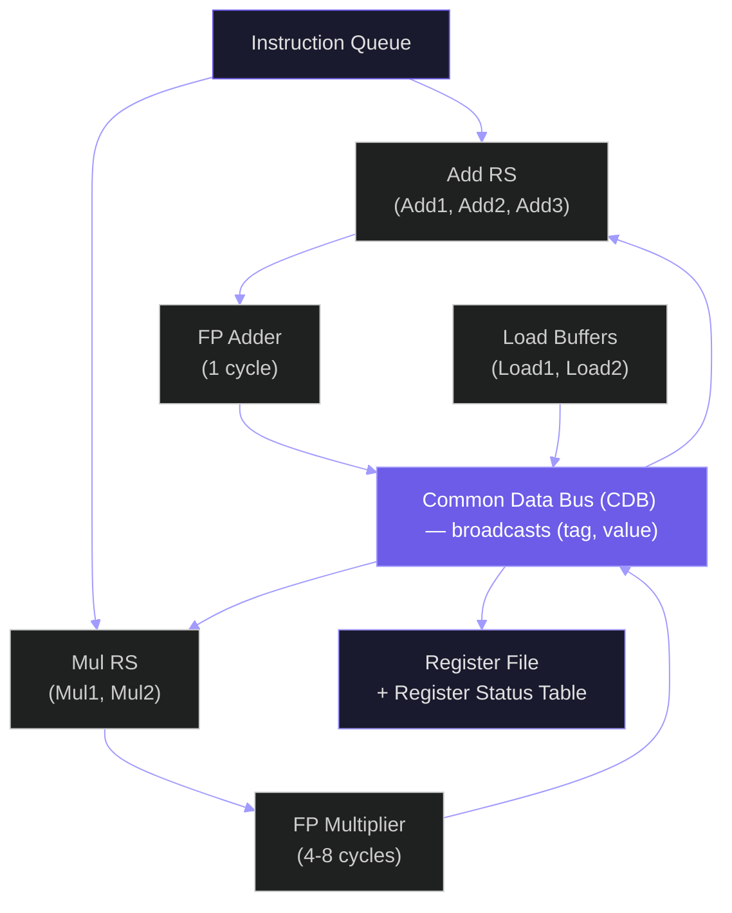
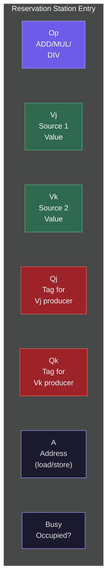
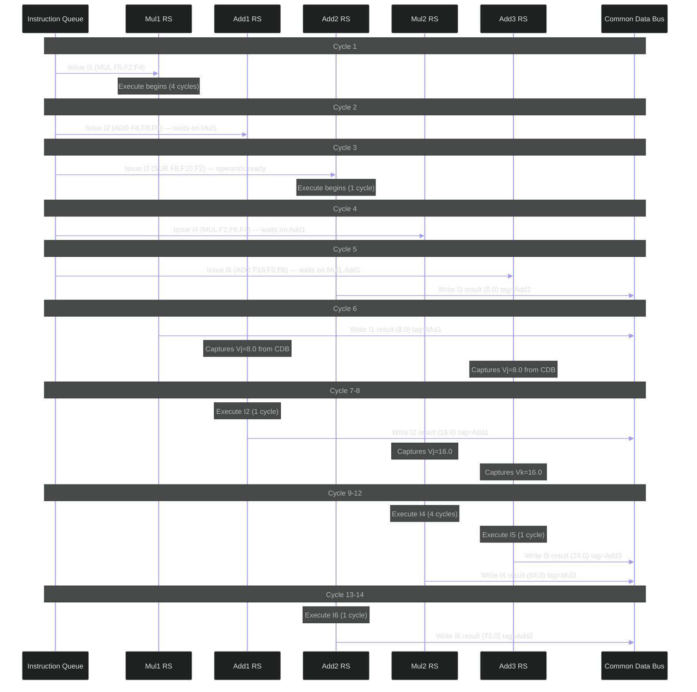
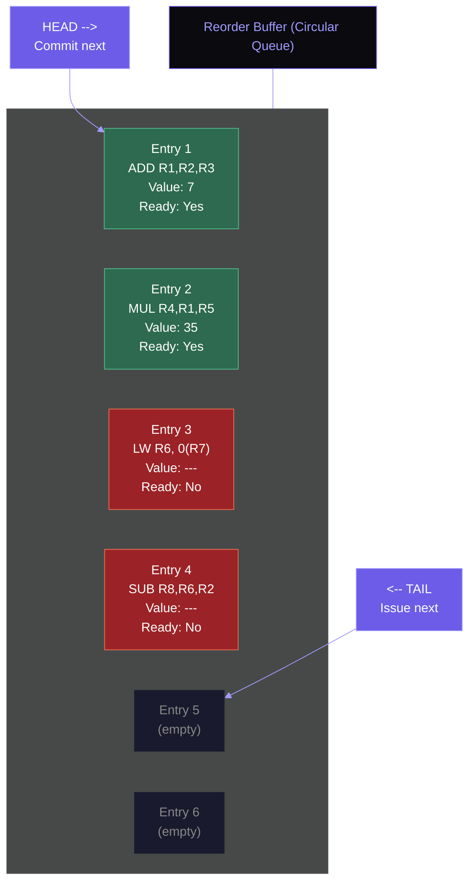

# Out-of-Order Execution: Tomasulo's Algorithm

An in-order pipelined processor fetches, decodes, and executes instructions in strict program order. When a long-latency operation stalls the pipeline — a cache-miss load taking 50 cycles, a floating-point divide taking 40 — every instruction behind it waits, even if those later instructions have no dependency on the stalled result. Functional units sit idle. The processor wastes cycles it will never recover. Out-of-order execution exists because the hardware can do better: it identifies instructions that are ready to execute regardless of their position in the program and dispatches them to available functional units immediately. The first practical algorithm to accomplish this was invented by Robert Tomasulo at IBM in 1967, and its core ideas — reservation stations, register renaming, and result broadcasting — remain the foundation of every high-performance processor manufactured today.

## The Problem: In-Order Bottlenecks

Consider a simple program fragment executing on a 5-stage pipeline with functional units that have variable latency:

```
I1: DIV   F0, F2, F4     # F0 = F2 / F4       (8 cycles)
I2: ADD   F6, F0, F8     # F6 = F0 + F8       (1 cycle, RAW on F0)
I3: MUL   F8, F10, F12   # F8 = F10 * F12     (4 cycles)
I4: SUB   F14, F8, F16   # F14 = F8 - F16     (1 cycle, RAW on F8)
I5: ADD   F16, F18, F20  # F16 = F18 + F20    (1 cycle, no dependency on I1-I4)
I6: MUL   F22, F16, F24  # F22 = F16 * F24    (4 cycles, RAW on F16)
```

In an in-order processor, I2 stalls behind I1's 8-cycle divide. I3 cannot issue until I2 issues. I5, which depends on nothing above it, is stuck behind I4, which is stuck behind I3, which is stuck behind I2. The entire pipeline is serialized by one slow division.

An out-of-order processor recognizes that I3, I5, and I6 can all begin execution before I1 completes, because they have no data dependency on I1. I5 can even complete before I1 finishes. This is the essence of exploiting **instruction-level parallelism (ILP)**.

## Instruction-Level Parallelism: How Much Exists?

ILP measures how many instructions in a program can execute simultaneously, given unlimited resources. The theoretical maximum depends on the dependency structure of the code:

$$\text{IPC}_{\max} = \frac{N}{\text{length of critical path}}$$

where $N$ is the total number of instructions and the critical path is the longest chain of dependent instructions.

Seminal studies by Wall (1991) and Austin and Sohi (1992) measured ILP in real programs. With a perfect processor (unlimited functional units, perfect branch prediction, perfect memory disambiguation), Wall found ILP ranging from 2 to over 60 instructions per cycle in SPEC benchmarks. With realistic constraints — finite issue width, imperfect prediction, limited window size — practical ILP drops to 2-4 IPC for most general-purpose code. Modern processors like Intel's Golden Cove (6-wide decode, 512-entry ROB) and AMD's Zen 5 (8-wide dispatch, 448-entry ROB) achieve sustained IPC of 3-5 on desktop workloads. The gap between theoretical and achieved ILP motivates ever-larger execution windows and more aggressive speculation.

The three classes of data dependencies that limit ILP are:

- **RAW (Read After Write)**: True dependency. Instruction B reads a register that instruction A writes. B must wait for A's result. This is fundamental and cannot be eliminated.
- **WAR (Write After Read)**: Anti-dependency. Instruction B writes a register that instruction A reads. In-order, A reads before B writes, so there is no conflict. Out-of-order, B might write before A reads. This is a **name dependency** — it arises only because both instructions use the same register name.
- **WAW (Write After Write)**: Output dependency. Instructions A and B both write the same register. In-order, B's write is the final value. Out-of-order, A might write after B, corrupting the result. This is also a name dependency.

Tomasulo's key insight: WAR and WAW hazards exist only because of register name reuse. If every instruction wrote to a unique physical register, WAR and WAW would vanish. Register renaming eliminates these false dependencies, exposing the true ILP hidden in the code.

<ConceptCheck id="cc-1" />

## Tomasulo's Algorithm: The Full Mechanism

Robert Tomasulo published his algorithm in the January 1967 issue of the *IBM Journal of Research and Development* ("An Efficient Algorithm for Exploiting Multiple Arithmetic Units"). It was first implemented in the floating-point unit of the IBM System/360 Model 91, which had a pipelined floating-point adder and a pipelined floating-point multiplier/divider. The algorithm coordinates scheduling across multiple functional units using three key structures.

### Architecture Overview

The following diagram shows the complete data flow through Tomasulo's architecture. Instructions flow from the instruction queue into reservation stations, where they wait for operands. Functional units execute ready instructions, and results are broadcast on the Common Data Bus to all waiting consumers simultaneously.



### Data Structures

**Reservation Stations (RS)**: Each functional unit has a set of reservation stations that buffer instructions waiting to execute. Each RS entry contains:

| Field | Purpose |
|-------|---------|
| **Op** | The operation (ADD, MUL, DIV, etc.) |
| **Vj** | Value of source operand 1 (if available) |
| **Vk** | Value of source operand 2 (if available) |
| **Qj** | Tag of the RS that will produce Vj (0 if Vj is ready) |
| **Qk** | Tag of the RS that will produce Vk (0 if Vk is ready) |
| **A** | Address field (for loads/stores) |
| **Busy** | Whether this RS is occupied |

The following diagram shows a single reservation station entry with all its fields. The Qj/Qk tags link to the producing RS, creating a distributed dependency tracking network.



**Register Status Table**: For each architectural register, stores the tag (Qi) of the reservation station that will produce that register's next value. If Qi is blank (or 0), the register file holds the current valid value.

**Common Data Bus (CDB)**: A broadcast bus that carries a (tag, value) pair. When a functional unit completes, it places its result on the CDB. Every reservation station and the register file simultaneously snoop the CDB, capturing the value if the tag matches their Qj or Qk field. This is the mechanism for data forwarding — results flow directly from producer to consumer without going through the register file first.

### The Three Stages

#### Stage 1: Issue (In-Order)

Instructions are issued from the instruction queue in strict program order. For each instruction:

1. Check if a reservation station of the correct type is free. If none is free, this is a **structural hazard** — stall and retry next cycle.
2. If a free RS exists, allocate it and fill in the Op field.
3. For each source operand, check the register status table:
   - If Qi for that register is 0 (no pending write), read the value from the register file into Vj or Vk.
   - If Qi is nonzero, copy that tag into Qj or Qk (the operand is not yet available; the RS will wait for the CDB broadcast with this tag).
4. **Register renaming**: Update the register status table so that the destination register now points to this reservation station's tag. This is the rename step — future instructions that read this register will see the tag, not the old value.

#### Stage 2: Execute (Out-of-Order)

Each reservation station continuously monitors the CDB:

1. When a CDB broadcast matches Qj, capture the value into Vj and clear Qj to 0.
2. When a CDB broadcast matches Qk, capture the value into Vk and clear Qk to 0.
3. When **both** Qj = 0 and Qk = 0 (both operands ready) **and** the functional unit is available, begin execution.
4. Execution takes a number of cycles depending on the operation type.

For loads and stores, the execute stage first computes the effective address, then accesses memory. Load results are broadcast on the CDB just like arithmetic results.

#### Stage 3: Write Result (Out-of-Order)

When execution completes:

1. Place the (tag, result) pair on the CDB.
2. All reservation stations snoop the CDB and capture values matching their Qj/Qk tags.
3. If the register status table still shows this tag for the destination register, update the register file with the result.
4. Free the reservation station (set Busy = 0).

The "still shows this tag" check in step 3 handles WAW: if a later instruction has already renamed the destination register to a different tag, the register file is not updated (the later instruction's result will be the architecturally correct value).

### Worked Example: Cycle-by-Cycle Trace

The following sequence diagram shows the timeline of instruction issue, execution, and write-back. Notice how I3 and I5 execute out of program order, and how the CDB broadcasts enable dependent instructions to begin as soon as their operands are ready.



Consider the following program with these latencies: ADD/SUB = 1 cycle, MUL = 4 cycles, DIV = 8 cycles, LOAD = 3 cycles. We have 3 Add/Sub reservation stations (Add1, Add2, Add3), 2 Multiply/Divide stations (Mul1, Mul2), and 2 Load buffers (Load1, Load2).

Initial register values: F0=1.0, F2=2.0, F4=4.0, F6=6.0, F8=8.0, F10=10.0

```
I1: MUL   F0, F2, F4     # F0 = F2 * F4 = 8.0   (4 cycles)
I2: ADD   F6, F0, F8     # F6 = F0 + F8          (1 cycle, RAW on F0)
I3: SUB   F8, F10, F2    # F8 = F10 - F2 = 8.0   (1 cycle, WAR on F8 from I2)
I4: MUL   F2, F6, F4     # F2 = F6 * F4          (4 cycles, RAW on F6)
I5: ADD   F10, F0, F6    # F10 = F0 + F6          (1 cycle, RAW on F0, F6)
I6: ADD   F4, F8, F2     # F4 = F8 + F2          (1 cycle, RAW on F8, F2)
```

**Cycle 1 — Issue I1:**
I1 (MUL F0, F2, F4) issues to Mul1. F2 and F4 are available in the register file (Qi=0 for both), so Vj=2.0, Vk=4.0, Qj=0, Qk=0. Register status: F0 → Mul1. Mul1 begins execution immediately (operands ready).

| RS | Op | Vj | Vk | Qj | Qk | Busy |
|----|-----|-----|-----|-----|-----|------|
| Mul1 | MUL | 2.0 | 4.0 | 0 | 0 | Yes |

| Register | F0 | F2 | F4 | F6 | F8 | F10 |
|----------|-----|-----|-----|-----|-----|------|
| Qi | Mul1 | | | | | |
| Value | 1.0 | 2.0 | 4.0 | 6.0 | 8.0 | 10.0 |

**Cycle 2 — Issue I2, Execute I1 (cycle 1 of 4):**
I2 (ADD F6, F0, F8) issues to Add1. F0's status is Mul1 (not ready), so Qj=Mul1, Vj=?. F8 is available: Vk=8.0, Qk=0. Add1 cannot execute yet (waiting on Mul1). Register status: F6 → Add1.

| RS | Op | Vj | Vk | Qj | Qk | Busy |
|----|-----|-----|-----|------|-----|------|
| Mul1 | MUL | 2.0 | 4.0 | 0 | 0 | Yes |
| Add1 | ADD | — | 8.0 | Mul1 | 0 | Yes |

**Cycle 3 — Issue I3, Execute I1 (cycle 2 of 4):**
I3 (SUB F8, F10, F2) issues to Add2. F10=10.0 available (Vj=10.0, Qj=0). F2=2.0 available (Vk=2.0, Qk=0). Register status: F8 → Add2. Note the WAR hazard on F8: I2 reads F8, I3 writes F8. Tomasulo handles this automatically — I2 already captured F8's value (8.0) into Add1's Vk at issue time (cycle 2). Add2 can execute immediately (both operands ready).

**Cycle 4 — Issue I4, Execute I1 (cycle 3 of 4), Execute I3 (cycle 1 of 1):**
I4 (MUL F2, F6, F4) issues to Mul2. F6's status is Add1 (not ready): Qj=Add1. F4=4.0 available: Vk=4.0, Qk=0. Register status: F2 → Mul2. I3 completes execution.

**Cycle 5 — Issue I5, Execute I1 (cycle 4 of 4), Write I3:**
I5 (ADD F10, F0, F6) issues to Add3. F0 status is Mul1: Qj=Mul1. F6 status is Add1: Qk=Add1. Neither operand ready. I3 writes result (8.0) on CDB with tag Add2. All RS snoop: no RS is waiting for Add2 tag. Register file: F8 → 8.0 (Add2 tag matches). Register status: F10 → Add3. I1 completes execution.

**Cycle 6 — Issue I6, Write I1:**
I6 (ADD F4, F8, F2) issues — but wait, we need a free Add RS. Add2 just freed. I6 issues to Add2. F8: Qi is now clear (Add2 wrote in cycle 5), so Vj=8.0. F2: Qi is Mul2 (not ready), so Qk=Mul2. Register status: F4 → Add2.

I1 writes result (8.0) on CDB with tag Mul1. Snooping: Add1 has Qj=Mul1 → captures Vj=8.0, clears Qj=0. Add3 has Qj=Mul1 → captures Vj=8.0, clears Qj=0. Register file: F0 → 8.0.

**Cycle 7 — Execute I2 (cycle 1 of 1), Execute I5 waits:**
Add1 now has both operands (Vj=8.0, Vk=8.0). I2 executes: 8.0 + 8.0 = 16.0. Add3 still waiting on Qk=Add1 for F6.

**Cycle 8 — Write I2:**
I2 writes 16.0 on CDB with tag Add1. Snooping: Mul2 has Qj=Add1 → captures Vj=16.0, clears Qj=0. Add3 has Qk=Add1 → captures Vk=16.0, clears Qk=0. Register file: F6 → 16.0.

Mul2 now has both operands ready (Vj=16.0, Vk=4.0). I4 begins execution.
Add3 now has both operands ready (Vj=8.0, Vk=16.0). I5 begins execution.

**Cycle 9 — Execute I4 (cycle 1 of 4), Execute I5 (cycle 1 of 1):**
I5 completes: 8.0 + 16.0 = 24.0.

**Cycle 10 — Write I5, Execute I4 (cycle 2 of 4):**
I5 writes 24.0 on CDB with tag Add3. Register file: F10 → 24.0.

**Cycles 11-12 — Execute I4 (cycles 3-4):**
I4 still executing.

**Cycle 12 — Write I4:**
I4 writes 64.0 (16.0 * 4.0) on CDB with tag Mul2. Snooping: Add2 has Qk=Mul2 → captures Vk=64.0, clears Qk=0. Register file: F2 → 64.0.

**Cycle 13 — Execute I6 (cycle 1 of 1):**
Add2 now has both operands (Vj=8.0, Vk=64.0). I6 executes: 8.0 + 64.0 = 72.0.

**Cycle 14 — Write I6:**
I6 writes 72.0 on CDB with tag Add2. Register file: F4 → 72.0.

**Summary:** 6 instructions completed in 14 cycles. An in-order processor would have been slower because I3 and I5 would have been blocked behind the dependency chain. The WAR hazard on F8 (I2 reads, I3 writes) was resolved automatically by capturing F8's value at issue time. The WAW on F2 (if one existed) would be resolved by the tag-based renaming.

Explore this concept with the interactive simulation below:

<Simulation id="tomasulo" />

<ConceptCheck id="cc-2" />

## Register Renaming with a Physical Register File

Tomasulo's algorithm renames registers implicitly — the reservation station tags serve as temporary register names. Modern processors make renaming explicit using a **physical register file** (PRF) that is larger than the architectural register file (ARF).

The mechanism uses three structures:

1. **Register Alias Table (RAT)**: Maps each architectural register to a physical register. When an instruction issues, its destination is assigned a free physical register from the free list, and the RAT is updated to point the architectural register at this new physical register.

2. **Free List**: A queue of available physical register numbers. On rename, dequeue a free register. On commit (when a retired instruction's previous physical mapping is no longer needed), enqueue the old mapping back.

3. **Physical Register File**: Holds the actual data values. Much larger than the number of architectural registers — for example, Intel Golden Cove has 332 vector/FP physical registers and an undisclosed (but large) number of integer physical registers. AMD Zen 4 has 224 integer and 192 FP physical registers. AMD Zen 5 expands this to 240 integer and 384 FP physical registers.

Consider this renaming example with 8 architectural registers (R0-R7) and 32 physical registers (P0-P31):

```python
# Before renaming:
# ADD R1, R2, R3
# MUL R2, R1, R4
# ADD R1, R5, R6    # WAW with first ADD (both write R1)

# After renaming (RAT: R1→P1, R2→P2, R3→P3, R4→P4, R5→P5, R6→P6):
# ADD P10, P2, P3     (R1 renamed to P10)
# MUL P11, P10, P4    (R2 renamed to P11, reads new P10)
# ADD P12, P5, P6     (R1 renamed to P12 — no WAW conflict)
```

After renaming, the WAW hazard vanishes: the first ADD writes to P10, the second ADD writes to P12. They can execute in any order. The RAW dependency (MUL reads R1/P10) is preserved correctly.

## The Reorder Buffer: Precise Exceptions via In-Order Commit

Tomasulo's original algorithm has a critical limitation: it writes results directly to the register file out of order. If an exception occurs (e.g., a divide-by-zero on instruction I3), the register file may already contain results from I4 and I5, which should not have executed. There is no way to recover a consistent architectural state.

The **Reorder Buffer (ROB)**, proposed by Smith and Pleszkun (1985), solves this by adding an in-order commit stage. Instructions execute out of order but **commit** (retire) in program order.

### ROB Structure

The ROB is a circular buffer with head and tail pointers. The tail pointer advances when new instructions are issued (allocated into the ROB). The head pointer advances when instructions commit (retire) in program order. The entries between head and tail represent in-flight instructions.



Each entry contains:

| Field | Purpose |
|-------|---------|
| **Instruction type** | Branch, store, register write |
| **Destination** | Architectural register number (or memory address for stores) |
| **Value** | The computed result |
| **Ready** | Whether execution has completed |
| **PC** | Program counter (for exception handling) |

### Modified Pipeline with ROB

The pipeline now has four stages:

1. **Issue**: Same as Tomasulo, but also allocate a ROB entry. The ROB entry number becomes the tag (instead of the reservation station name). The register status table points to the ROB entry.

2. **Execute**: Same as Tomasulo. Out-of-order execution.

3. **Write Result**: Write the result into the ROB entry (not directly to the register file). Mark the entry as Ready. Broadcast on the CDB so waiting reservation stations can capture the value.

4. **Commit (In-Order)**: The ROB has a head pointer. When the entry at the head is Ready:
   - **Normal instruction**: Write the result from the ROB entry into the architectural register file. Advance head pointer. Free the ROB entry.
   - **Store**: Write the value to memory. Advance head pointer.
   - **Branch**: If correctly predicted, simply advance. If mispredicted, flush all ROB entries after this point and redirect fetch.
   - **Exception**: Report the exception at this instruction's PC. Flush all younger entries. The architectural state is precise — it reflects exactly the instructions up to (but not including) the excepting instruction.

### Why In-Order Commit Matters

Precise exceptions are not optional. Without them:
- Virtual memory page faults cannot be handled correctly (the OS needs to restart the faulting instruction with clean state).
- Debuggers cannot report correct register values at breakpoints.
- Branch mispredictions cannot cleanly recover (speculative results would corrupt architectural state).
- Interrupts cannot be serviced at precise instruction boundaries.

<ConceptCheck id="cc-3" />

### Real ROB Sizes

Modern processors have enormous ROBs to maintain large instruction windows:

| Processor | ROB Entries | Year |
|-----------|-------------|------|
| Intel Sunny Cove | 352 | 2019 |
| Intel Golden Cove | 512 | 2021 |
| Intel Raptor Cove | 512 | 2022 |
| AMD Zen 3 | 256 | 2020 |
| AMD Zen 4 | 320 | 2022 |
| AMD Zen 5 | 448 | 2024 |
| Apple M1 Firestorm | ~630 (estimated) | 2020 |

The trend is clear: ROBs keep growing. A 512-entry ROB means the processor can have up to 512 instructions in flight simultaneously — issued but not yet committed. This enormous window allows the processor to look far ahead in the instruction stream, finding independent instructions to execute even when long-latency operations (cache misses, divides) occupy the pipeline.

The ROB also determines the effective **instruction window** — the maximum distance the processor can look ahead to find ILP. If a cache miss takes 200 cycles and the processor issues 4 instructions per cycle, the ROB needs at least 800 entries to avoid stalling due to ROB fullness during the miss. This is why ROB sizes continue to grow: memory latencies are not shrinking, so the window must expand to hide them.

## Putting It All Together: The Modern Out-of-Order Engine

A modern out-of-order processor combines all these mechanisms:

```
Fetch → Decode → Rename → Dispatch → Execute → Write Back → Commit
                   ↓          ↓                      ↓          ↓
                  RAT    Reservation            ROB (write)   ROB (commit)
               (rename   Stations                             → Arch. Reg
                regs)    (buffer +                              File
                         schedule)
```

1. **Fetch**: Fetch 32 bytes/cycle (Intel Golden Cove, AMD Zen 4/5), guided by the branch predictor (BTB + direction predictor + RAS).
2. **Decode**: Decode x86 instructions into micro-ops. Intel: 6-wide. AMD Zen 4: 4-wide. AMD Zen 5: 2x4-wide (8 effective). Micro-op cache (Intel 4K entries, AMD 6-6.75K entries) bypasses the decoders for hot code.
3. **Rename**: Map architectural registers to physical registers using the RAT. Allocate ROB entries. Intel Golden Cove: 6-wide allocate. AMD Zen 5: 8-wide dispatch.
4. **Dispatch**: Place instructions into reservation stations (also called the scheduler). Intel: 97-entry ALU scheduler. AMD Zen 4: 4 x 24 = 96 entry integer scheduler.
5. **Execute**: Out-of-order on 10-16 execution ports. Intel Golden Cove: 12 ports (5 ALU, etc.). AMD Zen 5: 16 integer ports (6 ALU + 4 AGU + more).
6. **Write Back**: Results are written into the ROB and broadcast on the CDB.
7. **Commit**: Head of ROB retires instructions in order, updating the architectural register file.

The processor sustains 3-5+ IPC on desktop workloads despite individual instructions having variable latency from 1 cycle (simple ALU) to hundreds of cycles (cache miss). The ROB, reservation stations, and register renaming work together to keep the functional units busy.

<ConceptCheck id="cc-4" />

## Connection to C++: RAII and Smart Pointers

The ROB's in-order commit mechanism has an elegant parallel in C++ programming. The **Resource Acquisition Is Initialization (RAII)** pattern ensures that resources are released in the reverse order of their acquisition, just as the ROB commits instructions in the order they were issued. If an exception is thrown, C++ stack unwinding destroys objects in reverse order — analogous to the ROB flushing younger entries while preserving the state of committed (completed) operations.

**Smart pointers** (`std::unique_ptr`, `std::shared_ptr`) automate resource management. A `unique_ptr` owns a resource exclusively — when it goes out of scope, the resource is freed. This maps to the ROB's model: each instruction "owns" its ROB entry, and when it commits, the entry is freed for reuse. The free list of physical registers works the same way — registers are "owned" by active instructions and returned to the pool on commit.

```cpp
// RAII: resource lifetime matches scope, just as ROB entries
// are allocated at issue and freed at commit
{
    auto data = std::make_unique<float[]>(1024);
    // data is "in-flight" — allocated but not yet committed to output
    process(data.get());
    // at scope exit, data is freed — like ROB commit freeing the entry
}
```

This connection between hardware resource management (ROB, physical register free list) and software resource management (RAII, smart pointers) is not a coincidence. Both solve the same fundamental problem: ensuring that resources are allocated, used, and freed in a controlled manner, even when operations complete out of order or exceptions occur.

## Summary

Tomasulo's algorithm transformed processor design by showing that hardware could automatically extract instruction-level parallelism from sequential programs. Its three innovations — reservation stations for distributed scheduling, register renaming via tags to eliminate false dependencies, and the Common Data Bus for result broadcasting — remain the backbone of every out-of-order processor. The Reorder Buffer extended the algorithm to support precise exceptions through in-order commit, enabling virtual memory, clean branch misprediction recovery, and debuggable execution. Modern processors with 448-512 entry ROBs, hundreds of physical registers, and 12-16 execution ports are direct descendants of the algorithm Tomasulo designed for the IBM 360/91 nearly six decades ago.
