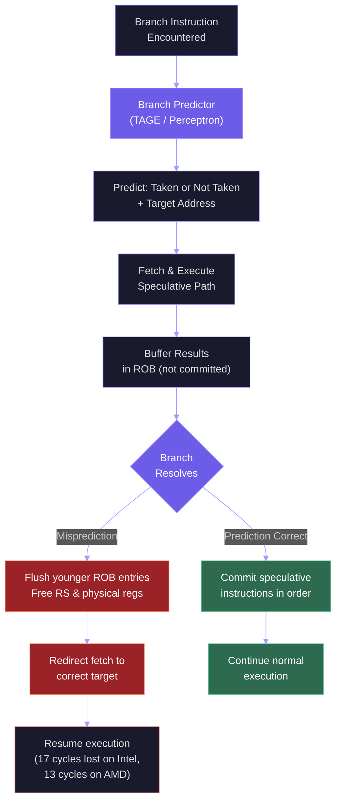
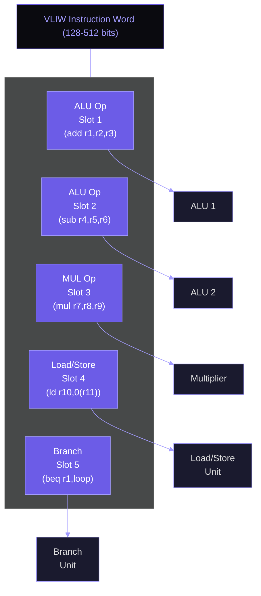
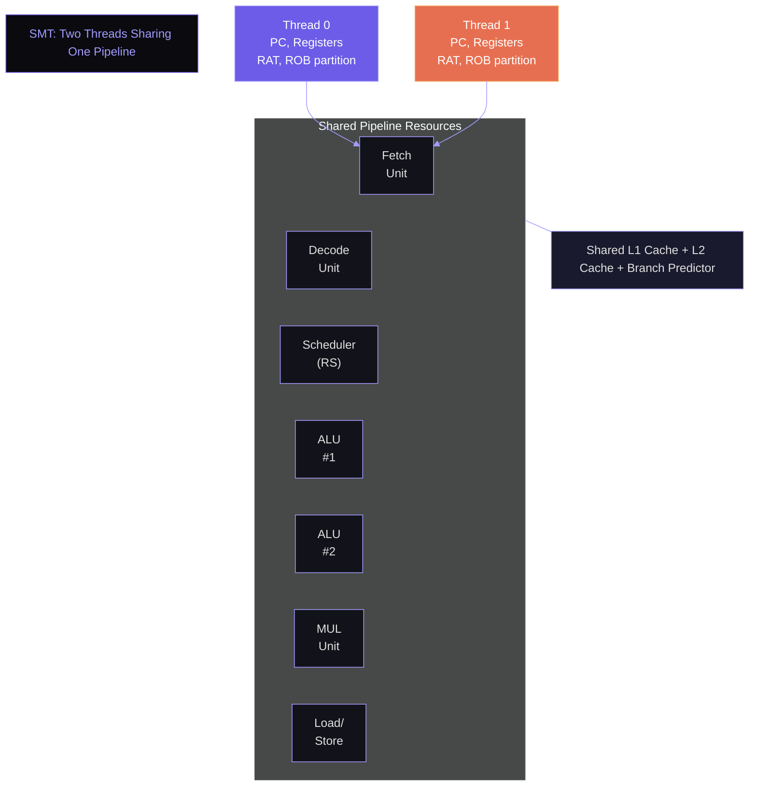
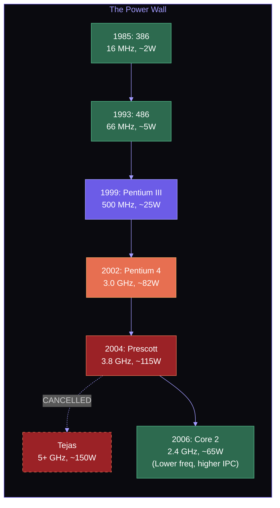
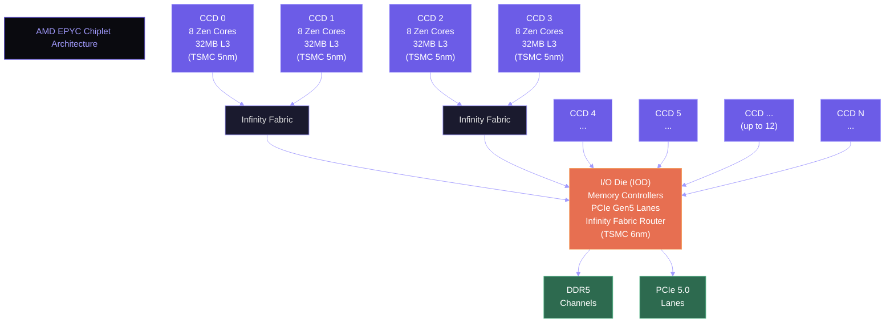

# Speculative Execution, VLIW, SMT, and the Power Wall

Out-of-order execution with Tomasulo's algorithm and the Reorder Buffer gives us a powerful engine for exploiting instruction-level parallelism. But the pipeline still stalls at every branch until the branch resolves — and branches appear every 5-7 instructions in typical code. Speculative execution removes this bottleneck by predicting the branch outcome and executing past the branch before knowing whether the prediction is correct. This lecture examines speculation and its security consequences, alternative approaches to parallelism (VLIW, superscalar, SMT), and the physical barrier that ended the era of frequency scaling: the power wall.

## Speculative Execution

### The Mechanism

A speculative out-of-order processor combines the branch predictor (from Week 7) with the Reorder Buffer to execute instructions beyond unresolved branches:

1. **Predict**: The branch predictor (TAGE, perceptron, or hybrid) predicts the direction and target of the branch before it executes.
2. **Fetch and execute speculatively**: The processor fetches instructions from the predicted path, renames their registers, dispatches them to reservation stations, and executes them — all speculatively.
3. **Buffer results in the ROB**: Speculative results are written into the ROB but are **not committed** to the architectural register file. They remain in "speculative" state.
4. **Branch resolves**:
   - **Correct prediction**: The branch instruction commits normally. Speculative instructions behind it can now commit in order. No work is wasted.
   - **Misprediction**: The branch instruction is marked as mispredicted. All ROB entries **younger** than the branch are **flushed** (squashed). Their reservation stations are freed, their physical register mappings are released back to the free list, and the fetch unit is redirected to the correct target. The architectural state is unaffected because no speculative instruction ever committed.



The misprediction penalty — the number of wasted cycles — depends on pipeline depth and how quickly the processor detects the misprediction. Intel Golden Cove has a minimum branch misprediction penalty of 17 cycles. AMD Zen 4/5 has approximately 13 cycles. At 5 GHz, 17 wasted cycles is 3.4 nanoseconds — an eternity in processor time.

### The Cost of Misprediction

The performance impact of branch misprediction is quantified by:

$$\text{CPI}_{\text{effective}} = \text{CPI}_{\text{ideal}} + \text{misprediction rate} \times \text{penalty}$$

For a processor with an ideal CPI of 0.25 (4 IPC), a 3% misprediction rate, and a 17-cycle penalty:

$$\text{CPI}_{\text{effective}} = 0.25 + 0.03 \times 17 = 0.25 + 0.51 = 0.76$$

The effective IPC drops from 4.0 to 1.32 — a 3x reduction from branch mispredictions alone. This is why modern branch predictors must achieve 97%+ accuracy: even small improvements in prediction accuracy yield substantial IPC gains.

Research by Lim (2019, "Branch Prediction Is Not A Solved Problem") measured that modern server workloads waste 3.6-20% of execution cycles on branch misprediction recovery, with an average of approximately 9.2%. Intel Xeon processors exhibit an average of 6.50 mispredictions per kilo-instruction (MPKI). State-of-the-art TAGE-SC-L predictors reduce this to approximately 3.4 MPKI.

<ConceptCheck id="cc-1" />

### Spectre and Meltdown: When Speculation Becomes a Vulnerability

In January 2018, researchers disclosed two classes of speculative execution attacks that shook the industry: **Spectre** (Kocher et al.) and **Meltdown** (Lipp et al.). These attacks exploit the fact that speculative execution has **microarchitectural side effects** even when speculative instructions are squashed.

**Meltdown** (CVE-2017-5754): On affected Intel processors, speculative loads could read kernel memory from user space. Even though the access check would eventually fail and the load would be squashed, the loaded data transiently existed in the cache. An attacker could use a cache timing side-channel (Flush+Reload) to extract the speculatively loaded value byte by byte. The fix, **Kernel Page Table Isolation (KPTI)**, separates user-space and kernel-space page tables so that kernel memory is simply not mapped during user-mode execution. KPTI imposes a 1-5% performance overhead due to TLB flushes on context switches.

**Spectre** (CVE-2017-5753, CVE-2017-5715): More fundamental than Meltdown, Spectre attacks poison the branch predictor to cause victim code to speculatively execute attacker-chosen gadgets:

- **Spectre v1 (Bounds Check Bypass)**: Mistrain the branch predictor so a bounds check is speculatively predicted as "in bounds," causing the victim to speculatively access out-of-bounds memory. The accessed data leaks through a cache side-channel.
- **Spectre v2 (Branch Target Injection)**: Poison the BTB with attacker-controlled branch targets, redirecting speculative execution to a gadget that leaks data.

Mitigations include:
- **Serializing instructions** (`LFENCE` on x86) inserted after bounds checks to prevent speculation past the check.
- **Retpolines**: Replace indirect branches with return instructions through a trampoline, exploiting the RAS (Return Address Stack) for safe speculation.
- **IBRS/STIBP**: Hardware features that restrict indirect branch prediction across privilege levels and hyperthreads.
- **Microcode updates**: Flush or partition BTB entries across security boundaries.

The Spectre/Meltdown discovery revealed a fundamental tension: speculative execution is essential for performance but creates an information leak channel. Every speculative access — even one that is squashed — leaves a trace in the microarchitectural state (caches, TLBs, branch predictor state) that a patient attacker can observe. This remains an active area of research, with new variants (SpectreRSB, BranchScope, Spectre-BHB) continuing to be discovered.

## VLIW: Compiler-Scheduled Parallelism

**Very Long Instruction Word (VLIW)** takes a radically different approach to ILP: instead of having hardware discover parallelism at runtime (as in out-of-order execution), the **compiler** identifies independent operations and packs them into a single wide instruction word. The hardware simply executes whatever the compiler has scheduled — no rename logic, no reservation stations, no ROB.

### Architecture

A VLIW instruction contains multiple operation slots, each targeting a different functional unit:



If the compiler cannot find enough independent operations to fill all slots, it inserts **NOPs** (no-operation). The hardware is simple: no dependency checking, no dynamic scheduling. It fetches one wide instruction per cycle and routes each slot to its functional unit.

If the compiler cannot find enough independent operations to fill all slots, it inserts **NOPs** (no-operation). The hardware is simple: no dependency checking, no dynamic scheduling. It fetches one wide instruction per cycle and routes each slot to its functional unit.

### Examples

**Intel Itanium (IA-64)**: The most ambitious (and ultimately unsuccessful) VLIW design. Itanium used "bundles" of three instructions (128 bits each) with a template field specifying which slots connect to which functional units. The Explicitly Parallel Instruction Computing (EPIC) architecture added predicated execution (every instruction could be conditionally executed based on a predicate register) and speculative loads (ld.s) with check instructions (chk.s) to support compiler-driven speculation.

Itanium failed in the market for several reasons:
- x86 binary compatibility required slow emulation.
- Compilers could not extract enough ILP to fill the wide instruction word — real-world code often ran with many NOP slots.
- Out-of-order x86 processors (Pentium 4, Core) improved faster than compilers could improve IA-64 code generation.
- Intel discontinued Itanium in 2021 after two decades.

**TI C6000 DSPs**: VLIW is highly successful in digital signal processing, where algorithms are regular, predictable, and loop-intensive — exactly the patterns compilers can schedule effectively. TI's C6x DSPs use an 8-wide VLIW architecture and achieve near-peak utilization on DSP kernels.

### VLIW vs. Out-of-Order

| Aspect | VLIW | Out-of-Order (OoO) |
|--------|------|---------------------|
| Scheduling | Compiler (static) | Hardware (dynamic) |
| Hardware complexity | Simple (no ROB, RS, rename) | Complex |
| Power efficiency | Good (less control logic) | Higher power |
| Code compatibility | Recompile required for new hardware | Binary compatible |
| Performance on irregular code | Poor (compiler cannot predict runtime events) | Good |
| Performance on regular code | Excellent (compiler has global view) | Good |

The verdict from history: VLIW dominates in embedded DSP; out-of-order dominates in general-purpose computing. The unpredictability of general-purpose code — data-dependent branches, cache misses, variable-latency operations — requires dynamic hardware scheduling that VLIW cannot provide.

<ConceptCheck id="cc-2" />

## Superscalar Processors: Multiple Issue

A **superscalar** processor can issue multiple instructions per cycle from a sequential instruction stream. This is distinct from VLIW: in a superscalar, the **hardware** determines which instructions can issue simultaneously; in VLIW, the **compiler** makes that decision.

Modern processors are both superscalar and out-of-order:

| Processor | Decode Width | Dispatch Width | Year |
|-----------|-------------|---------------|------|
| Intel P6 (Pentium Pro) | 3-wide | 3-wide | 1995 |
| Intel Core (Merom) | 4-wide | 4-wide | 2006 |
| Intel Golden Cove | 6-wide | 6-wide | 2021 |
| AMD Zen 4 | 4-wide | 6-wide | 2022 |
| AMD Zen 5 | 2x4-wide (8) | 8-wide | 2024 |
| Apple M1 Firestorm | 8-wide | 8-wide | 2020 |

"Width" refers to how many instructions can be processed in that stage per cycle. Intel Golden Cove decodes up to 6 x86 instructions per cycle (or delivers 8 micro-ops per cycle from the micro-op cache). AMD Zen 5 uses two parallel 4-wide decoders for an effective 8-wide decode, or delivers up to 12 micro-ops per cycle from the op cache.

The micro-op cache is critical for sustained throughput. x86 instructions have variable length (1-15 bytes), making wide decode expensive. The micro-op cache stores previously decoded micro-ops, allowing the front-end to bypass the decoders entirely for hot code paths. Intel's micro-op cache (DSB) holds 4K entries; AMD Zen 4's op cache holds 6.75K entries.

Increasing issue width faces diminishing returns. Going from 4-wide to 6-wide requires significantly more bypass logic (the number of forwarding paths grows quadratically), more rename bandwidth, larger instruction queues, and more ports on the register file. Practical limits are around 8-wide for general-purpose code, because programs rarely have more than 4-6 independent instructions within any small window.

## Simultaneous Multithreading (SMT)

Single-threaded out-of-order execution leaves many functional units idle in any given cycle — stalls from cache misses, branch mispredictions, and dependency chains create "bubbles" in the pipeline. **Simultaneous Multithreading (SMT)** fills these bubbles by interleaving instructions from multiple hardware threads.

### How SMT Works

Each hardware thread has its own:
- Architectural register file (or separate RAT mappings)
- Program counter
- TLB entries (or TLB tagged by thread ID)
- ROB partition (or shared ROB with thread IDs on entries)
- Return Address Stack

The threads **share**:
- Functional units (ALUs, multipliers, load/store units)
- Cache hierarchy
- Branch predictor (partially partitioned)
- Reservation stations / scheduler entries

The diagram below shows two hardware threads sharing a single pipeline. Each thread has private architectural state (registers, PC) but shares the execution units. When Thread 0 stalls on a cache miss, Thread 1's instructions fill the idle slots.



On any given cycle, the scheduler selects ready instructions from **any thread** to dispatch to available functional units. If thread A is stalled on a cache miss, thread B's independent instructions fill the pipeline.

### Intel Hyper-Threading

Intel introduced SMT as "Hyper-Threading Technology" (HTT) with the Pentium 4 (Northwood) in 2002. Each physical core appears as two logical processors to the OS. The implementation duplicates about 5% of the chip area (mainly the architectural state) while sharing the rest of the execution engine.

Performance benefit varies by workload:
- **Throughput-oriented server workloads**: 10-30% throughput improvement (the OS schedules two independent threads on the same core).
- **Single-thread-dominant workloads**: Minimal benefit or slight regression (the two threads compete for shared resources like cache and scheduler entries).
- **Security-sensitive workloads**: SMT has been disabled in some environments because shared microarchitectural state (caches, branch predictors, execution ports) creates side-channel attack surfaces between co-resident threads.

AMD Zen processors implement 2-way SMT, similar to Intel's Hyper-Threading. Both modern Intel and AMD desktop/server processors support 2 threads per core.

<ConceptCheck id="cc-3" />

## The Power Wall

### Dynamic and Static Power

Total processor power consumption has two components:

$$P_{\text{total}} = P_{\text{dynamic}} + P_{\text{static}}$$

**Dynamic power** is dissipated when transistors switch:

$$P_{\text{dynamic}} = \alpha C V_{DD}^2 f$$

where $\alpha$ is the activity factor (fraction of transistors switching per cycle), $C$ is the total load capacitance, $V_{DD}$ is the supply voltage, and $f$ is the clock frequency.

**Static (leakage) power** flows even when transistors are not switching:

$$P_{\text{static}} = V_{DD} \cdot I_{\text{leak}}$$

Leakage current $I_{\text{leak}}$ grows exponentially as transistors shrink because the gate oxide becomes thinner (gate leakage) and the channel becomes shorter (subthreshold leakage):

$$I_{\text{sub}} \propto e^{(V_{GS} - V_{th}) / (n \cdot V_T)}$$

where $V_T = kT/q \approx 26$ mV at room temperature and $n$ is the subthreshold slope factor (ideally 1, typically 1.2-1.5). As $V_{th}$ decreases to maintain speed at lower $V_{DD}$, subthreshold leakage increases exponentially.

### The End of Dennard Scaling

**Dennard scaling** (Robert Dennard, 1974) predicted that as transistors shrink by a factor $s$:
- Voltage scales as $1/s$
- Current scales as $1/s$
- Capacitance scales as $1/s$
- Frequency scales as $s$ (faster switching)
- Power density remains constant: $P/A \propto V \cdot I / A = (1/s)(1/s)/(1/s^2) = 1$

This meant each new process node could either run faster at the same power or consume less power at the same speed. For decades, this held: clock frequencies climbed from 16 MHz (386, 1985) to 66 MHz (486, 1993) to 3.8 GHz (Pentium 4 Prescott, 2004), roughly doubling every 2-3 years.

The conceptual relationship between frequency and power is shown below. As frequency rises, dynamic power grows linearly, but since frequency scaling requires voltage increases, the actual relationship is closer to cubic. Beyond approximately 3.8 GHz (the Prescott era), the power curve exceeds practical cooling limits.



**Around 2004-2006, Dennard scaling broke down.** The problem was voltage: it could not scale below approximately 0.7-0.8 V because reducing $V_{th}$ further caused exponential growth in leakage current. Without voltage scaling:

- Frequency scaling increases power linearly ($P \propto f$) instead of maintaining constant power density.
- Power density increases with each generation.
- Thermal dissipation becomes the binding constraint: at >100 W/cm$^2$, cooling becomes impractical for consumer devices.

The Pentium 4 Prescott (2004) at 3.8 GHz consumed 115 W and represented the end of the frequency scaling era. Intel canceled the planned 4+ GHz successors (Tejas, Jayhawk) because they would have exceeded 150 W. Intel pivoted to the Core architecture: lower frequency, wider issue, more cores.

### From Frequency to Parallelism

The end of Dennard scaling forced a paradigm shift:

| Era | Strategy | Example |
|-----|----------|---------|
| 1985-2004 | Frequency scaling | 16 MHz → 3.8 GHz |
| 2005-present | Multicore | 2 → 4 → 8 → 16+ cores |
| 2005-present | Wider execution | 3-wide → 6-wide → 8-wide |
| 2010-present | Heterogeneous | big.LITTLE, P-cores + E-cores |
| 2015-present | Domain-specific | GPU, TPU, NPU accelerators |

Modern desktop processors run at 4-5.5 GHz — only modestly higher than 2004. The performance gains since then come from wider execution (more IPC), more cores, larger caches, and better branch prediction — not frequency. The clock speed wall is real, and it reshaped the entire computing industry.

### Dynamic Voltage and Frequency Scaling (DVFS)

Since $P_{\text{dynamic}} \propto V^2 f$ and frequency is roughly proportional to voltage ($f \propto V - V_{th}$), reducing voltage by a factor $k$ reduces power by approximately $k^3$:

$$P \propto V^2 f \propto V^2 \cdot V = V^3$$

This cubic relationship is why **DVFS** (Dynamic Voltage and Frequency Scaling) is so effective. A processor that drops from 5.0 GHz at 1.3 V to 3.0 GHz at 0.9 V reduces power by:

$$\frac{P_{\text{low}}}{P_{\text{high}}} = \left(\frac{0.9}{1.3}\right)^3 \approx 0.33$$

A 67% power reduction for a 40% frequency reduction. This is why laptops and phones aggressively scale voltage and frequency based on workload — the power savings are cubic.

## Chiplet Architecture

The economics of semiconductor manufacturing drove another architectural innovation: **chiplets**. Instead of building a monolithic die with all CPU cores, I/O, and memory controllers on a single piece of silicon, modern processors are assembled from multiple smaller dies (chiplets) connected by high-bandwidth interconnects.

### AMD EPYC: The Chiplet Pioneer

AMD's EPYC server processors, starting with the Zen 2 generation (2019), pioneered the chiplet approach in x86 processors:

- **Core Complex Die (CCD)**: Each CCD contains 8 Zen cores (2 CCXs of 4 cores each, or in Zen 3+, a unified 8-core CCX) plus L3 cache. CCDs are manufactured on the leading-edge process node (TSMC 5nm for Zen 4, 4nm for Zen 5).
- **I/O Die (IOD)**: A separate die containing the memory controllers, PCIe lanes, and Infinity Fabric interconnect. The IOD can be manufactured on a cheaper, older process node (TSMC 6nm for EPYC Genoa) because I/O transistors do not need cutting-edge density.
- **Infinity Fabric**: AMD's on-package interconnect connecting CCDs to the IOD. Provides coherent memory access across all cores.

The following diagram shows the chiplet topology of an AMD EPYC processor. Multiple CCDs connect to a central IOD via Infinity Fabric, with the IOD providing memory and I/O interfaces.



The EPYC 9004 series (Genoa, Zen 4) contains up to 12 CCDs + 1 IOD on a single package, delivering up to 96 cores. The EPYC 9005 series (Turin, Zen 5) scales to 128 cores with up to 16 CCDs.

### Why Chiplets Win

| Factor | Monolithic | Chiplet |
|--------|-----------|---------|
| **Yield** | Large dies have exponentially lower yield | Small dies have high yield; defective chiplets are discarded individually |
| **Cost** | One expensive large die | Mix cheap (IOD) and expensive (CCD) process nodes |
| **Scalability** | Reticle limit (~800 mm$^2$) caps die size | Add more chiplets to scale core count |
| **Flexibility** | One SKU per die design | Mix-and-match chiplet configurations for different market segments |

The yield advantage is dramatic. For a process with defect density $D$ per cm$^2$, the yield of a die with area $A$ follows approximately:

$$Y = e^{-D \cdot A}$$

A 600 mm$^2$ monolithic die at $D = 0.1$ defects/cm$^2$ has yield $Y = e^{-0.1 \times 6} = e^{-0.6} \approx 55\%$. Two 300 mm$^2$ dies at the same defect density each yield $e^{-0.3} \approx 74\%$. The combined probability of getting two good dies is $0.74^2 \approx 55\%$ — the same, but now defective dies waste half as much silicon. For a 12-CCD EPYC processor, each ~75 mm$^2$ CCD yields over 92%, and AMD only needs to discard small, cheap dies.

<ConceptCheck id="cc-4" />

## C++ Move Semantics

The chiplet architecture's key insight — avoid unnecessary copies by transferring ownership of resources — maps directly to C++ **move semantics**. In traditional C++, passing objects by value creates copies. Move semantics, introduced in C++11, allow transferring ownership of an object's resources (heap memory, file handles, etc.) without copying the underlying data.

```cpp
// Without move semantics: expensive copy
std::vector<float> create_data() {
    std::vector<float> v(1'000'000);
    // ... fill v ...
    return v;  // Copy constructor: allocates new memory, copies 4 MB
}

// With move semantics: cheap transfer
std::vector<float> create_data() {
    std::vector<float> v(1'000'000);
    // ... fill v ...
    return v;  // Move constructor: transfers pointer, size, capacity
               // Old object left in valid-but-empty state
}
```

The move constructor transfers the internal pointer from the source to the destination and sets the source's pointer to null — $O(1)$ instead of $O(n)$. This is analogous to how chiplet interconnects transfer data between dies by reference (coherent cache lines) rather than by copy.

An **rvalue reference** (`T&&`) indicates a temporary that is safe to move from:

```cpp
void process(std::vector<float>&& data) {
    // data is an rvalue reference — we can steal its resources
    internal_buffer = std::move(data);  // Transfer ownership
    // data is now empty (valid but moved-from state)
}
```

`std::move` does not actually move anything — it is a cast to an rvalue reference, signaling to the compiler that the object can be moved from. The actual resource transfer happens in the move constructor or move assignment operator.

## Summary

Speculative execution extends out-of-order processors to execute past unresolved branches, using the ROB to buffer results and squash mispredicted paths. This is essential for performance but creates security vulnerabilities (Spectre, Meltdown) because speculation has observable microarchitectural side effects. VLIW shifts scheduling to the compiler for simpler hardware but fails on irregular code. Superscalar processors issue multiple instructions per cycle from sequential streams. SMT shares functional units across threads to fill pipeline bubbles. The power wall — driven by the end of Dennard scaling around 2006 — ended the era of frequency scaling and forced the industry toward multicore, wider execution, and heterogeneous architectures. Chiplet designs further evolved processor packaging by assembling multiple small, high-yield dies instead of large monolithic chips, with AMD EPYC leading the way.
