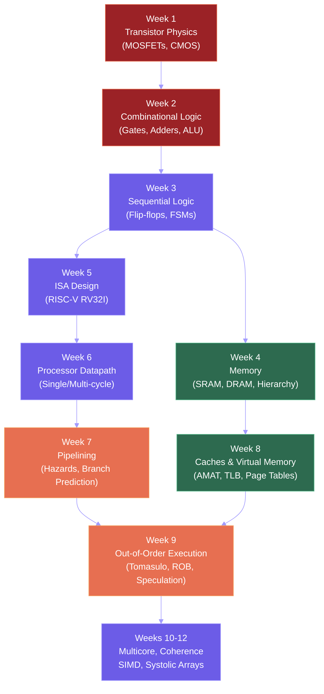
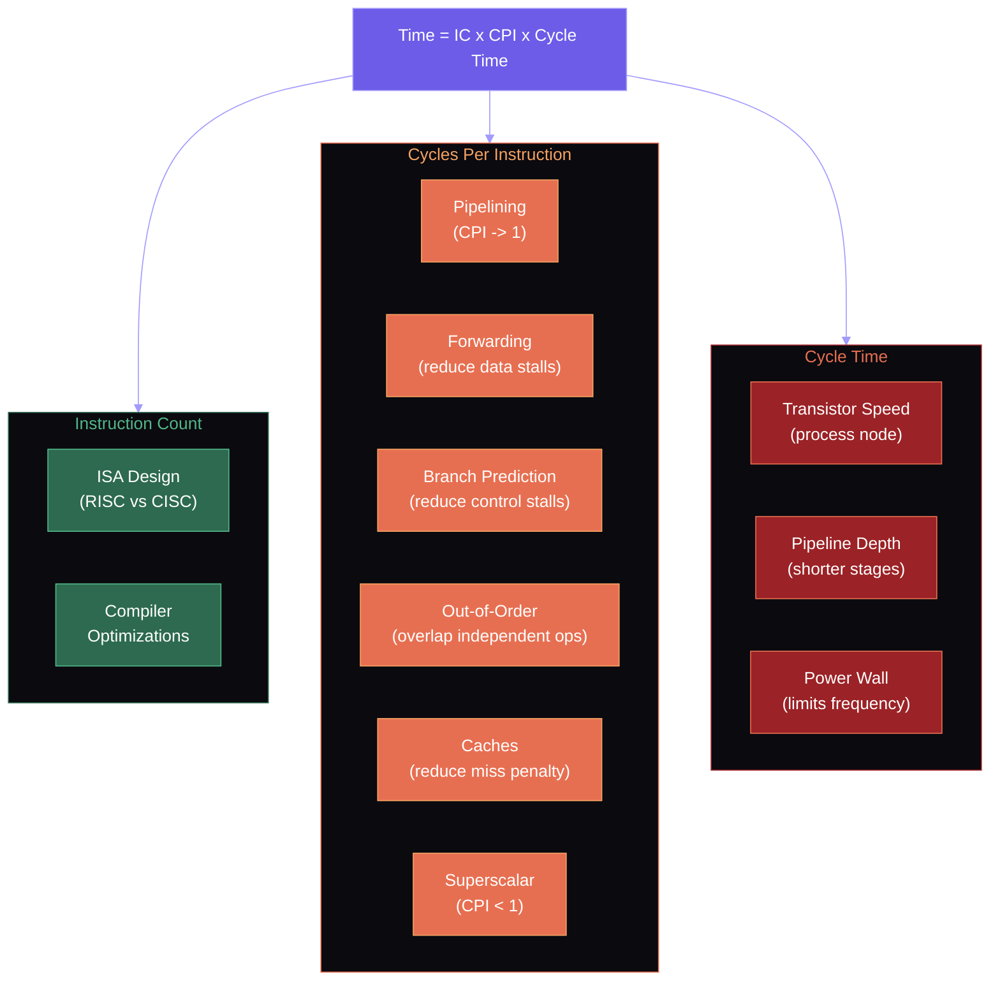

# Midterm Review: Transistors to Out-of-Order

This lecture reviews the nine weeks of material that will appear on the midterm exam. For each topic, we identify the key equations, the common exam patterns, and work through a representative example. The midterm covers everything from transistor physics through out-of-order execution — the complete path from atoms to a modern processor.

## Week 1: Transistor Physics and Logic Gates

### Key Equations

**MOSFET drain current in saturation** (the most tested equation in the course):

$$I_D = \frac{1}{2} \mu_n C_{ox} \frac{W}{L} (V_{GS} - V_{th})^2$$

Valid when $V_{DS} \geq V_{GS} - V_{th}$ (saturation region). In the linear region ($V_{DS} < V_{GS} - V_{th}$):

$$I_D = \mu_n C_{ox} \frac{W}{L} \left[(V_{GS} - V_{th}) V_{DS} - \frac{V_{DS}^2}{2}\right]$$

**CMOS power consumption:**

$$P_{total} = \underbrace{\alpha C_L V_{DD}^2 f}_{dynamic} + \underbrace{V_{DD} \cdot I_{leak}}_{static}$$

**Intrinsic carrier concentration:** $n_i \approx 1.5 \times 10^{10}$ cm$^{-3}$ at room temperature for silicon.

### Worked Example

A MOSFET has $\mu_n C_{ox} = 250$ $\mu$A/V$^2$, $W/L = 4$, $V_{th} = 0.4$ V, $V_{GS} = 1.0$ V, $V_{DS} = 0.8$ V.

Step 1: Check region. $V_{GS} - V_{th} = 0.6$ V. Since $V_{DS} = 0.8 > 0.6$, the transistor is in **saturation**.

Step 2: $I_D = \frac{1}{2}(250)(4)(0.6)^2 = 500 \times 0.36 = 180$ $\mu$A.

### Common Exam Patterns

- Given $V_{GS}$, $V_{DS}$, $V_{th}$: determine operating region, then compute $I_D$.
- Given a CMOS inverter: compute static and dynamic power at a given frequency and activity factor.
- NAND/NOR gate transistor sizing for equal rise/fall time.

## Week 2: Combinational Circuits and Arithmetic

### Key Concepts

**Two's complement** for an $n$-bit number:
- Range: $-2^{n-1}$ to $2^{n-1} - 1$
- Negation: invert all bits and add 1
- Most significant bit is the sign bit (1 = negative)

**IEEE 754 single-precision (32-bit):**

$$(-1)^S \times 1.M \times 2^{E-127}$$

- S: 1 bit sign
- E: 8 bits biased exponent (bias = 127)
- M: 23 bits mantissa (implicit leading 1)

Special values: $E=0, M=0$ is zero; $E=255, M=0$ is $\pm\infty$; $E=255, M\neq 0$ is NaN; $E=0, M\neq 0$ is denormalized.

**Carry-Lookahead Adder (CLA):**

$$G_i = A_i \cdot B_i, \quad P_i = A_i \oplus B_i, \quad C_{i+1} = G_i + P_i \cdot C_i$$

CLA computes all carries in $O(\log n)$ levels instead of $O(n)$ for ripple-carry.

### Worked Example

Convert $-13.625_{10}$ to IEEE 754 single-precision.

Step 1: $13.625 = 1101.101_2$. Step 2: Normalize: $1.101101 \times 2^3$. Step 3: $S = 1$ (negative). $E = 3 + 127 = 130 = 10000010_2$. $M = 10110100000000000000000$. Result: `1 10000010 10110100000000000000000`.

## Week 3: Sequential Circuits and State Machines

### Key Concepts

**D Flip-Flop timing parameters:**
- $t_{setup}$: data must be stable this long before the clock edge
- $t_{hold}$: data must be stable this long after the clock edge
- $t_{clk-to-q}$: delay from clock edge to valid output

**Maximum clock frequency** for a pipeline register path:

$$T_{clk} \geq t_{clk-to-q} + t_{comb} + t_{setup}$$

$$f_{max} = \frac{1}{t_{clk-to-q} + t_{comb} + t_{setup}}$$

**Moore vs. Mealy FSM:**
- Moore: outputs depend only on current state. Output is on the state.
- Mealy: outputs depend on current state AND inputs. Output is on the transition.
- Mealy machines often need fewer states but have combinational paths from input to output (potential timing issues).

### Worked Example

A sequential circuit has $t_{clk-to-q} = 30$ ps, $t_{setup} = 20$ ps, and the longest combinational path is 150 ps. What is the maximum clock frequency?

$T_{clk} = 30 + 150 + 20 = 200$ ps. $f_{max} = 1/(200 \times 10^{-12}) = 5$ GHz.

## Week 4: Memory Technologies

### Key Concepts

**SRAM (6T cell):** Fast, no refresh, used for caches. Typical access time: 1-2 ns.

**DRAM (1T1C cell):** Dense, requires refresh every 64 ms, used for main memory.
- DDR5: 4800-8800 MT/s, 1.1V, 32/40-bit channels
- HBM3: 819 GB/s per stack, 16-hi, used in GPUs/AI accelerators

**Storage hierarchy** (by latency, approximate):
- Registers: <1 ns
- L1 cache: ~1 ns (4-5 cycles)
- L2 cache: ~5 ns (12-15 cycles)
- L3 cache: ~15-30 ns
- DRAM: ~50-100 ns
- NVMe SSD: ~10-100 $\mu$s
- HDD: ~5-10 ms

### Common Exam Patterns

- DRAM timing calculation: given $t_{RCD}$, $t_{CAS}$, $t_{RP}$, compute total access time for row hit vs. row miss.
- Compare SRAM and DRAM on density, speed, cost, and use case.

## Week 5: Instruction Set Architecture

### Key Concepts

**RISC-V RV32I:** 40 base instructions, 6 formats (R, I, S, B, U, J), fixed 32-bit encoding.

Key formats to memorize:

| Format | Fields | Used for |
|--------|--------|----------|
| R-type | funct7, rs2, rs1, funct3, rd, opcode | Register-register ALU |
| I-type | imm[11:0], rs1, funct3, rd, opcode | Immediates, loads, JALR |
| S-type | imm[11:5], rs2, rs1, funct3, imm[4:0], opcode | Stores |
| B-type | imm[12\|10:5], rs2, rs1, funct3, imm[4:1\|11], opcode | Branches |

**Design principles:** Fixed register positions (rs1, rs2, rd always in same bit positions), sign-extended immediates, minimalism.

### Worked Example

Encode `ADD x5, x6, x7` in binary.

R-type: funct7=0000000, rs2=00111 (x7), rs1=00110 (x6), funct3=000, rd=00101 (x5), opcode=0110011.

Binary: `0000000 00111 00110 000 00101 0110011` = 0x007302B3.

<ConceptCheck id="cc-1" />

## Week 6: Processor Datapath Design

### Key Concepts

**Single-cycle processor:** Each instruction completes in one clock cycle. Clock period = longest instruction path (typically LW: fetch → decode → ALU → memory → write-back).

$$T_{clk}^{single} = t_{fetch} + t_{decode} + t_{ALU} + t_{mem} + t_{wb}$$

**Multi-cycle processor:** Break each instruction into multiple shorter cycles. Different instructions take different numbers of cycles. Clock period = longest single stage.

**Performance comparison:**

$$\text{Execution time} = \text{IC} \times \text{CPI} \times T_{clk}$$

Single-cycle: CPI = 1, but $T_{clk}$ is long. Multi-cycle: CPI > 1 (varies by instruction mix), but $T_{clk}$ is shorter.

### Common Exam Patterns

- Given datapath diagram, trace signals for a specific instruction (which muxes, which ALU control).
- Compute effective CPI for a multi-cycle processor given instruction mix (e.g., 30% loads take 5 cycles, 20% stores take 4 cycles, 40% R-type take 4 cycles, 10% branches take 3 cycles).

## Week 7: Pipelining and Branch Prediction

### Key Concepts

**5-stage pipeline:** IF → ID → EX → MEM → WB. Ideal CPI = 1 with throughput of 1 instruction per cycle.

**Pipeline hazards and solutions:**
- **Data hazard (RAW):** Forwarding (bypass) from EX/MEM or MEM/WB to EX stage. Load-use hazard requires 1 stall cycle even with forwarding.
- **Control hazard:** Branch not resolved until ID or EX. Solutions: predict not-taken, predict taken, delayed branch, dynamic prediction.
- **Structural hazard:** Separate instruction and data memories/caches.

**Pipelined CPI:**

$$\text{CPI}_{pipeline} = 1 + \text{stalls per instruction}$$

**Branch prediction accuracy impact:**

$$\text{CPI} = 1 + \text{branch frequency} \times \text{mispredict rate} \times \text{penalty}$$

**Branch predictor hierarchy:**
- 1-bit: remembers last outcome, mispredicts twice per loop (enter + exit)
- 2-bit saturating counter: tolerates one anomaly, mispredicts once per loop
- Tournament/hybrid: selects between local and global predictors
- TAGE: geometric history lengths, tagged entries, 97-98% accuracy
- Perceptron: linear scaling with history length, weights instead of counters

### Worked Example

A program with 20% branch instructions, a 2-cycle branch penalty, and 90% prediction accuracy on a 5-stage pipeline. What is the CPI?

$\text{CPI} = 1 + 0.20 \times 0.10 \times 2 = 1 + 0.04 = 1.04$

## Week 8: Cache Hierarchies and Virtual Memory

### Key Concepts

**Cache parameters:** For a cache with $S$ sets, $E$ lines per set, and $B$ bytes per block:
- Cache size: $C = S \times E \times B$ bytes
- Address decomposition: tag | set index | block offset
- Set index bits: $\log_2 S$
- Block offset bits: $\log_2 B$
- Tag bits: address bits $- \log_2 S - \log_2 B$

**AMAT (Average Memory Access Time):**

$$\text{AMAT} = t_{hit} + \text{miss rate} \times \text{miss penalty}$$

For multi-level caches:

$$\text{AMAT} = t_{L1} + r_{L1} \times (t_{L2} + r_{L2} \times t_{mem})$$

**Three C's of cache misses:**
- **Compulsory:** First access to a block (cold miss). Reduced by prefetching.
- **Capacity:** Working set exceeds cache size. Reduced by larger cache.
- **Conflict:** Multiple blocks map to the same set. Reduced by higher associativity.

**Virtual memory (Sv39):** 39-bit virtual address, 3-level page table, 4 KB pages.
- VPN split into 3 x 9-bit indices (VPN[2], VPN[1], VPN[0])
- Each page table is exactly one page (4 KB = 512 entries x 8 bytes/PTE)
- Page table walk: 3 memory accesses (one per level)
- TLB caches virtual-to-physical translations

### Worked Example

A 32 KB, 4-way set-associative cache with 64-byte blocks on a 32-bit address space.

Sets: $S = 32768 / (4 \times 64) = 128$ sets. Set index bits: $\log_2 128 = 7$. Block offset bits: $\log_2 64 = 6$. Tag bits: $32 - 7 - 6 = 19$ bits.

Address 0x1234ABCD: offset = bits[5:0] = 001101 = 0x0D, set = bits[12:6] = 0101111 = 47, tag = bits[31:13] = 0x091A5.

<ConceptCheck id="cc-2" />

## Week 9: Out-of-Order Execution

### Key Concepts

**Tomasulo's algorithm:** Three stages (Issue → Execute → Write Result) with reservation stations, register renaming via tags, and CDB broadcast.

- **Issue (in-order):** Allocate RS, read available operands, set tags for unavailable operands, rename destination register.
- **Execute (out-of-order):** RS monitors CDB for operands, begins execution when both operands ready.
- **Write Result (out-of-order):** Broadcast (tag, value) on CDB, update waiting RS and register file.

**Reorder Buffer (ROB):** Adds in-order commit stage for precise exceptions. Instructions commit at the ROB head in program order. On exception/misprediction, flush younger entries.

**Key sizes (from research):**

| Component | Intel Golden Cove | AMD Zen 4 | AMD Zen 5 |
|-----------|------------------|-----------|-----------|
| Decode width | 6-wide | 4-wide | 2x4 (8) |
| ROB | 512 | 320 | 448 |
| Integer ALUs | 5 | 4 | 6 |
| Execution ports | 12 | 10+6 | 16 |
| Micro-op cache | 4K | 6.75K | 6K |

**Speculative execution:** Predict branch, execute speculatively, buffer in ROB, commit or squash. Spectre/Meltdown exploit speculative side effects on caches.

**Power wall:** Dennard scaling ended ~2006. $P = \alpha C V^2 f + V \cdot I_{leak}$. Voltage cannot scale below ~0.7V due to exponential leakage growth. Industry shifted from frequency scaling to multicore.

**DVFS:** $P \propto V^2 f \approx V^3$. Reducing voltage by factor $k$ reduces power by $\sim k^3$.

### Worked Example: Tomasulo Trace

Given: MUL F0, F2, F4 (4 cycles) followed by ADD F6, F0, F8 (1 cycle).

Cycle 1: MUL issues to Mul1. Vj=F2, Vk=F4, both ready. Reg status: F0 → Mul1. Execution begins.

Cycle 2: ADD issues to Add1. F0 status = Mul1, so Qj=Mul1 (waiting). F8 available: Vk=F8. Reg status: F6 → Add1.

Cycles 2-5: MUL executing (4 cycles total, cycles 1-4).

Cycle 5: MUL execution completes.

Cycle 6: MUL writes result on CDB with tag Mul1. Add1 captures value into Vj, clears Qj. F0 updated in register file.

Cycle 7: ADD executes (1 cycle, both operands now ready).

Cycle 8: ADD writes result on CDB. F6 updated.

<ConceptCheck id="cc-3" />

## Cross-Cutting Themes

Several themes run through the entire course. Understanding these connections often separates strong exam performance from mediocre performance.

The following concept map traces the complete path of abstraction from atoms to applications, which is the central narrative of this course. Each layer builds on the one below it, providing a cleaner interface to the layer above.

### Theme 1: Abstraction Layers

The course builds a tower of abstractions. Each layer hides the complexity of the layer below:

| Layer | Hides | From |
|-------|-------|------|
| Physics (transistors) | Quantum mechanics | Logic gate designers |
| Logic gates | Transistor-level voltages | Circuit designers |
| Sequential circuits | Gate-level timing | FSM designers |
| ISA | Microarchitecture details | Assembly programmers |
| Microarchitecture (pipeline, OoO) | Execution order | ISA programmers |
| Memory hierarchy (caches, VM) | Physical memory layout | Application software |

Each abstraction provides a **contract**: the ISA guarantees that instructions execute as if they were sequential, even though the microarchitecture executes them out of order. Caches guarantee that memory appears uniform, even though it is a hierarchy of SRAM, DRAM, and SSD with vastly different latencies. Virtual memory guarantees that each process has its own 39-bit address space, even though physical memory is shared. Understanding what each abstraction promises — and what it costs — is the core of computer architecture.

### Theme 2: The Performance Equation

Every optimization in the course can be connected to the iron law of processor performance:

$$\text{Time} = \frac{\text{Instructions}}{\text{Program}} \times \frac{\text{Cycles}}{\text{Instruction}} \times \frac{\text{Seconds}}{\text{Cycle}}$$

The following diagram maps each course topic to the term it influences in the performance equation. This is the single most important framework for reasoning about processor design trade-offs.

- **Instruction count**: Determined by the ISA and compiler. CISC reduces instruction count (complex instructions do more work) but increases CPI. RISC increases instruction count but reduces CPI and cycle time.
- **CPI**: Determined by the microarchitecture. Pipelining targets CPI = 1. Forwarding reduces CPI by eliminating data stalls. Branch prediction reduces CPI by eliminating control stalls. Out-of-order execution reduces CPI by overlapping independent instructions. Superscalar execution can achieve CPI < 1 (IPC > 1).
- **Cycle time**: Determined by the technology (transistor speed, wire delay) and pipeline depth. Deeper pipelines reduce cycle time but increase branch penalty and power. The power wall limits cycle time reduction.

When asked to compare two designs or evaluate an optimization, always connect back to which term in the performance equation is affected and by how much.

### Theme 3: The Memory Wall

The gap between processor speed and memory speed has grown exponentially since the 1980s. Processor performance doubles approximately every 2 years; DRAM latency improves at approximately 7% per year. This "memory wall" motivates most of the complexity in modern processors:

- **Caches** exploit temporal and spatial locality to avoid going to slow DRAM.
- **Large ROBs** allow the processor to keep executing independent instructions while waiting for cache misses to resolve.
- **Prefetching** predicts future memory accesses and fetches data before it is needed.
- **Out-of-order execution** finds useful work to do during long-latency memory operations.

If memory were as fast as the ALU, we would not need caches, large ROBs, or much of the complexity of out-of-order execution. The memory wall is the fundamental driver of microarchitectural complexity.

### Theme 4: Diminishing Returns and Amdahl's Law

Amdahl's Law is not just a formula for parallel speedup — it is a design principle. Every optimization targets a specific fraction of execution time. As that fraction shrinks (because the optimization has been applied), further improvements to the same component yield diminishing returns. The bottleneck shifts to a different component.

This pattern appears throughout the course:
- Adding forwarding reduces data stalls dramatically, but the remaining load-use stalls resist optimization.
- Improving branch prediction from 90% to 95% has more impact than improving from 95% to 97%.
- Adding more cores helps throughput-bound workloads until the serial fraction dominates.
- Larger caches help until the working set fits, after which adding more cache capacity is wasted silicon.

The engineering lesson: always measure where time is spent before optimizing. Attack the largest bottleneck first.

The following diagram summarizes the key formulas from the course as a quick reference card. These are the equations most likely to appear on the midterm, organized by topic.

```mermaid
%%{init: {'theme': 'dark', 'themeVariables': {'primaryColor': '#6c5ce7', 'primaryTextColor': '#e0e0e0', 'lineColor': '#a29bfe'}}}%%
flowchart TD
    TITLE["Key Formula Reference Card"]

    TITLE --- col1
    TITLE --- col2
    TITLE --- col3

    subgraph col1["Transistors & Timing"]
        F1["MOSFET (saturation)\nId = 1/2 * uCox * W/L\n* (Vgs - Vth)^2"]
        F2["CMOS Power\nP = aCLVdd^2f + Vdd*Ileak"]
        F3["Max Clock Freq\nfmax = 1/(tclk-q + tcomb + tsetup)"]
        F1 ~~~ F2 ~~~ F3
    end

    subgraph col2["Pipeline & Branches"]
        F4["Performance Equation\nTime = IC x CPI x Tcycle"]
        F5["Pipeline CPI\nCPI = 1 + stalls/instr"]
        F6["Branch Penalty\nCPI_bp = freq x (1-acc) x penalty"]
        F4 ~~~ F5 ~~~ F6
    end

    subgraph col3["Memory & Power"]
        F7["AMAT\nAMAT = thit + miss_rate x penalty"]
        F8["Cache Sets\nS = C / (E x B)"]
        F9["DVFS Power\nP proportional to V^3"]
        F7 ~~~ F8 ~~~ F9
    end

    style TITLE fill:#6c5ce7,stroke:#a29bfe,color:#ffffff
    style F1 fill:#1a1a2e,stroke:#9b2226,color:#e0e0e0
    style F2 fill:#1a1a2e,stroke:#9b2226,color:#e0e0e0
    style F3 fill:#1a1a2e,stroke:#6c5ce7,color:#e0e0e0
    style F4 fill:#1a1a2e,stroke:#e76f51,color:#e0e0e0
    style F5 fill:#1a1a2e,stroke:#e76f51,color:#e0e0e0
    style F6 fill:#1a1a2e,stroke:#e76f51,color:#e0e0e0
    style F7 fill:#1a1a2e,stroke:#2d6a4f,color:#e0e0e0
    style F8 fill:#1a1a2e,stroke:#2d6a4f,color:#e0e0e0
    style F9 fill:#1a1a2e,stroke:#2d6a4f,color:#e0e0e0
```

## Exam Strategy

1. **Read each question carefully.** Many errors come from misreading "linear region" vs. "saturation region" or confusing RAW with WAR.

2. **Show your work.** Partial credit requires visible reasoning. Write the formula, substitute values, compute.

3. **Check units.** Power in watts, frequency in Hz, time in seconds. Off-by-factor-of-$10^3$ errors are common when mixing ns, $\mu$s, and GHz.

4. **For cache problems:** Always start by computing the number of sets, then decompose the address into tag/set/offset fields. Draw the cache state if tracing a sequence of accesses.

5. **For Tomasulo/ROB:** Track the reservation station table and register status table cycle by cycle. Do not skip cycles — errors compound.

6. **Time management:** 25 questions in 90 minutes = ~3.5 minutes per question. Flag difficult questions and return to them.

7. **Sanity check answers.** CPI should be between 1.0 and ~3.0 for pipelined processors. Power should be 1-200 W for a desktop chip. Cache hit rates below 50% or above 99.9% should prompt a recheck.
