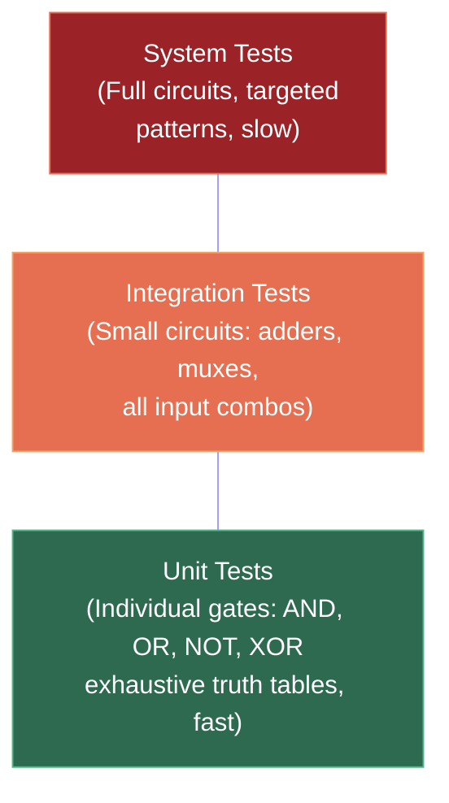
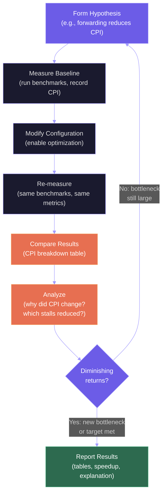
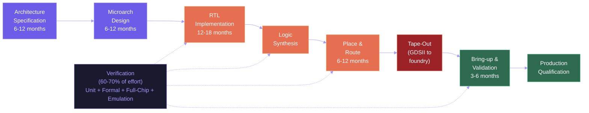

# Project Architecture Review and Performance Analysis

This lecture steps back from the theoretical material to examine the engineering process of building and evaluating digital systems. We review the architecture decisions in Project 1 (Logic Simulator) and discuss the final milestone for Project 2 (RISC-V Processor): performance analysis methodology. We then connect our course work to the real-world processor design workflow, from RTL specification to silicon tape-out.

## Project 1 Review: Logic Simulator Architecture

Project 1 asked you to build a digital logic simulator capable of constructing gates, composing them into circuits, and evaluating those circuits with arbitrary input patterns. Let us examine the key architectural decisions and what they teach about system design.

### Circuit Representation: Graph vs. Netlist

The fundamental design choice in a logic simulator is how to represent the circuit. There are two main approaches:

**Adjacency list graph:** Each gate is a node, each wire is a directed edge. Evaluation requires topological sorting to determine the correct order of gate evaluations. This representation is flexible (easy to add/remove gates) but evaluation requires $O(V + E)$ topological sort each time unless the order is cached.

**Flattened netlist with topological ordering:** Compute the topological order once at circuit construction time and store it. Evaluation becomes a simple linear scan: evaluate each gate in topological order, reading inputs from already-computed upstream gates. This is $O(n)$ per evaluation with no graph traversal overhead. The trade-off is that modifying the circuit requires recomputing the topological order.

For a simulator that builds the circuit once and evaluates it many times (which is the common case in verification), the netlist approach is clearly superior. This is the same design principle as static vs. dynamic scheduling in processors: if the structure is known ahead of time, front-load the analysis.

### Event-Driven vs. Oblivious Simulation

An **oblivious** simulator evaluates every gate on every cycle, regardless of whether its inputs changed. This is simple but wasteful: in a large circuit, most gates' inputs do not change on most cycles.

An **event-driven** simulator maintains a queue of "events" — gates whose inputs have changed. Only those gates are evaluated, and their outputs may generate new events for downstream gates. This is analogous to how a processor's reservation stations only wake up when their operands are broadcast on the CDB — demand-driven computation rather than polling.

Event-driven simulation can be orders of magnitude faster for circuits with localized activity (e.g., a single input changes in a 10,000-gate circuit). However, it adds complexity: you need an event queue, careful handling of simultaneous events (delta cycles in VHDL/Verilog), and potential re-evaluation when glitches propagate.

### Testing Strategy: Unit, Integration, System

The testing pyramid for hardware verification mirrors software testing practice. Each level catches different classes of bugs, with unit tests being fast and focused, while system tests exercise the full design but run slowly.



A well-engineered simulator separates testing into layers:

1. **Unit tests:** Test individual gate evaluation functions (AND, OR, NOT, XOR) with truth tables. These are exhaustive for small input counts.

2. **Integration tests:** Test small circuits (half-adder, full-adder, 2:1 mux) by composing gates and verifying output for all input combinations. This tests the graph wiring and evaluation ordering.

3. **System tests:** Test large circuits (ripple-carry adder, ALU, simple FSM) with targeted input patterns. Full enumeration is infeasible for 32-bit inputs ($2^{32}$ combinations), so use boundary cases, random testing, and known-answer tests.

This layered testing approach maps directly to hardware verification practice: unit-level verification of individual modules, block-level integration testing, and system-level validation with test vectors.

<ConceptCheck id="cc-1" />

## Project 2: RISC-V Processor — Performance Analysis

Project 2's final milestone is not just building a working processor but analyzing its performance quantitatively. A processor that executes instructions correctly but slowly is not useful — the entire course has been building toward understanding what makes processors fast. Your performance analysis should measure, compare, and explain.

### Key Performance Metrics

**Cycles Per Instruction (CPI):** The most important single metric for a pipeline processor.

$$\text{CPI} = \frac{\text{Total cycles}}{\text{Instructions completed}}$$

Ideal CPI for a scalar pipeline is 1.0. Real CPI includes stall cycles from hazards:

$$\text{CPI} = 1 + \text{stall cycles per instruction}$$

Break down stall sources to understand where time is lost:

$$\text{CPI} = 1 + \text{CPI}_{data\_stalls} + \text{CPI}_{control\_stalls} + \text{CPI}_{structural\_stalls}$$

**Instructions Per Cycle (IPC):** The reciprocal of CPI. For superscalar processors, IPC can exceed 1.0.

$$\text{IPC} = \frac{1}{\text{CPI}}$$

**Cache Hit Rate:** The fraction of memory accesses that find data in the cache.

$$\text{Hit rate} = \frac{\text{Cache hits}}{\text{Total accesses}} = 1 - \text{miss rate}$$

**Average Memory Access Time (AMAT):**

$$\text{AMAT} = t_{hit} + \text{miss rate} \times t_{miss\_penalty}$$

**Branch Prediction Accuracy:**

$$\text{Accuracy} = \frac{\text{Correct predictions}}{\text{Total branches}}$$

$$\text{CPI}_{branch\_penalty} = \text{branch frequency} \times (1 - \text{accuracy}) \times \text{penalty cycles}$$

### Experimental Methodology

The following diagram shows the iterative performance analysis workflow. Each cycle of hypothesis-measure-analyze builds understanding of where cycles are spent and which optimizations have the greatest impact.



Your performance analysis should follow the scientific method:

1. **Hypothesis:** "Adding forwarding will reduce CPI because it eliminates most data hazard stalls."

2. **Baseline measurement:** Run benchmark programs on the base configuration (e.g., 5-stage pipeline without forwarding) and record total cycles, instruction count, CPI breakdown.

3. **Modified configuration:** Enable forwarding and rerun the same benchmarks. Record the same metrics.

4. **Comparison:** Present the results in a table:

| Configuration | Total Cycles | CPI | Data Stalls/Instr | Branch Stalls/Instr |
|--------------|-------------|-----|-------------------|-------------------|
| No forwarding | 1,245 | 1.83 | 0.72 | 0.11 |
| With forwarding | 892 | 1.31 | 0.20 | 0.11 |
| Forward + predict-taken | 841 | 1.24 | 0.20 | 0.04 |

5. **Analysis:** Explain *why* the numbers changed. Forwarding reduced data stalls from 0.72 to 0.20 per instruction — the remaining 0.20 are load-use hazards that require one stall cycle even with forwarding. Branch prediction reduced control stalls from 0.11 to 0.04.

### Benchmark Selection

The benchmarks you choose determine the validity of your analysis. Good benchmarks:

- **Exercise different instruction mixes:** A loop-heavy benchmark tests branch prediction; a matrix multiply tests data hazards; a linked-list traversal tests memory latency.
- **Have known correct outputs:** You must verify that the processor produces correct results before measuring performance.
- **Vary in length:** Short benchmarks (50-100 instructions) show startup effects; medium benchmarks (500-1000 instructions) amortize those effects.

Common pitfalls:
- Measuring only one benchmark and generalizing to "the processor is X% faster."
- Not warming up caches and predictors before measuring steady-state performance.
- Comparing CPI numbers without verifying correctness first (a processor with a bug might appear faster because it skips instructions).

<ConceptCheck id="cc-2" />

### How to Present Results

Your performance analysis report should include:

1. **Configuration table:** List all configurations compared (base, +forwarding, +forwarding+prediction, etc.) with their hardware parameters.

2. **CPI breakdown table:** For each configuration and benchmark, show total CPI and its components (ideal + data stalls + control stalls + structural stalls).

3. **Speedup chart:** $\text{Speedup} = \text{CPI}_{base} / \text{CPI}_{optimized}$.

4. **Analysis paragraphs:** For each result, explain the cause. Do not just report numbers — explain *why* forwarding reduces CPI by a specific amount, tied to the instruction mix of the benchmark.

5. **Diminishing returns analysis:** Show that successive optimizations yield smaller improvements. Going from no forwarding to forwarding might give 1.40x speedup. Adding branch prediction on top might give an additional 1.05x. This illustrates Amdahl's Law in practice: once data stalls are reduced, branch stalls become the new bottleneck, but they are a smaller fraction of total time.

## The Real-World Processor Design Workflow

Our course models the first half of a chip design process. In industry, building a processor involves far more people, far more verification, and far more time than a course project.

### The Design Flow

The following diagram traces the complete processor design workflow, from initial specification through tape-out to production silicon. Verification spans the entire process and consumes the majority of engineering effort.



**1. Architecture specification (6-12 months):** Architects define the ISA extensions, pipeline width, cache sizes, and branch predictor design. This involves extensive simulation of workloads on architectural simulators (software models of the proposed hardware). Decisions are driven by performance-per-watt targets and silicon area budgets. Tools like gem5, ChampSim, and Sniper are used for this stage.

**2. Microarchitecture design (6-12 months):** The architecture specification is refined into a detailed microarchitecture: pipeline stage definitions, bypass network topology, scheduler design, memory interface protocols. Block diagrams become signal-level specifications.

**3. RTL implementation (12-18 months):** The microarchitecture is implemented in a hardware description language (Verilog or SystemVerilog). This is the equivalent of Project 2's code, but at a scale of millions of lines for a modern processor core. Teams of 50-200 engineers work on different blocks: frontend, execution engine, load/store unit, cache controllers.

**4. Verification (continuous, 60-70% of total effort):** Verification is the largest phase of chip design. Techniques include:
- **Unit verification:** Each block is tested against its specification using constrained-random testing (SystemVerilog UVM methodology).
- **Formal verification:** Mathematical proof that certain properties hold (e.g., "no two instructions can write to the same register in the same cycle").
- **Full-chip simulation:** The entire RTL is simulated executing real operating systems and applications. This is extremely slow — a full-chip RTL simulation runs at ~100 Hz to ~1 kHz (versus the target 3-5 GHz), so booting Linux takes days of wall-clock time.
- **Emulation/FPGA prototyping:** The RTL is mapped to large FPGA arrays or dedicated emulation hardware (Cadence Palladium, Synopsys ZeBu) running at ~1-10 MHz, enabling more realistic workloads.

**5. Physical design (6-12 months):** The RTL is synthesized into a gate-level netlist (logic synthesis), then placed and routed on the silicon die (physical synthesis). This involves clock tree synthesis (distributing the clock signal across millions of flip-flops with minimal skew), timing closure (ensuring all paths meet timing constraints), and power grid design.

**6. Tape-out:** The final design is sent to the foundry (TSMC, Samsung, Intel) as a set of photomask definitions (GDSII format). "Tape-out" is the point of no return — any bugs discovered after this point require a re-spin, costing $50-100M and 6-12 months.

**7. Bring-up and validation (3-6 months):** First silicon arrives from the foundry. Engineers test the physical chip on custom test boards, validating that it matches the RTL simulation results. Differences between silicon and simulation (often caused by analog effects, voltage noise, or process variation) must be diagnosed and fixed — sometimes through microcode patches, sometimes requiring a re-spin.

### The Verification Crisis

The dominant challenge in modern processor design is not building the processor — it is verifying that it is correct. A modern x86 core has tens of thousands of distinct states across the ROB, reservation stations, branch predictor, cache coherence protocol, and memory ordering model. Testing all state combinations exhaustively is mathematically impossible.

Intel's Pentium FDIV bug (1994) — where the floating-point divider produced incorrect results for certain rare operand combinations — cost Intel $475 million in recalls and demonstrated that even extensive verification misses bugs. Modern verification uses a combination of formal methods, directed testing, random testing, and coverage metrics (have we tested at least 90% of the state transitions in the cache controller FSM?), but achieving 100% coverage remains an unsolved problem.

This connects to a fundamental insight from our course: the more complex the hardware (out-of-order execution, speculation, cache coherence), the harder it is to verify. The simplicity advantage of RISC-V's design philosophy — fewer instructions, regular encoding, clean semantics — extends to verification: a simpler ISA is easier to verify against its specification.

<ConceptCheck id="cc-3" />

## Software Engineering Lessons from Hardware Design

Several principles from our course projects apply broadly to software engineering:

### Modularity and Interfaces

Our processor design separates the datapath into clean modules (fetch unit, decoder, ALU, register file, memory interface) with well-defined interfaces. Each module can be tested independently. This is the same principle as microservices in software architecture or library design with clean APIs.

In hardware, the cost of a bad interface is measured in silicon — changing the interface between the load/store unit and the cache controller might require re-routing thousands of wires. In software, the cost is measured in engineering time and bugs. Both domains reward getting the interfaces right early.

### Testing Before Optimization

In Project 2, the correct approach is: (1) build a simple pipeline that works correctly, (2) verify it exhaustively, (3) then add forwarding and measure the improvement. Many students make the mistake of implementing forwarding before their base pipeline works, creating a system where bugs from the base pipeline and bugs from forwarding are interleaved and nearly impossible to debug.

This maps to the software engineering principle: "make it work, make it right, make it fast" (Kent Beck). Correctness must precede performance optimization.

### Profiling Before Optimizing

Our CPI breakdown analysis tells you where cycles are being wasted. Adding a sophisticated branch predictor does not help if your bottleneck is data hazards from load-use stalls. This is the hardware equivalent of profiling software before optimizing: measure first, then optimize the actual bottleneck, not the suspected one.

Donald Knuth's famous statement — "premature optimization is the root of all evil" — applies to hardware design as well. Intel's Pentium 4 NetBurst architecture (2000-2006) optimized aggressively for clock frequency (31-stage pipeline) at the expense of IPC, and was ultimately replaced by the shorter-pipeline, higher-IPC Core architecture. The "optimization" for frequency was premature relative to the actual bottleneck (power dissipation).

### Invariants and Assertions

In hardware design, **invariants** are properties that must always hold. For example: "exactly one reservation station tag can appear in each entry of the register status table" or "the ROB head pointer always points to the oldest uncommitted instruction." Violating an invariant means the hardware is in an illegal state — a bug.

In our simulator code, we can express invariants as assertions:

```python
# Invariant: no two RS entries should have the same tag in the register status
def check_invariants(reg_status, rs):
    # Every tag in reg_status must point to a busy RS
    for reg, tag in reg_status.items():
        if tag is not None:
            assert rs[tag]['busy'], f"Register {reg} points to freed RS {tag}"

    # No two registers should point to the same RS
    # (unless one has been renamed away)
    tags = [t for t in reg_status.values() if t is not None]
    # This invariant is actually allowed to have duplicates
    # only if a WAW rename occurred — the latest rename is correct
```

This practice of identifying and checking invariants transfers directly from hardware verification (where assertions are embedded in SystemVerilog RTL) to software engineering (where assertions, contracts, and property-based testing serve the same role). The cost of catching a bug through an assertion is a few microseconds of runtime. The cost of missing a bug that reaches production — whether in silicon or in deployed software — can be millions of dollars.

## Industry Context: How Chips Get Designed Today

### Team Structure

A modern processor design team at Intel, AMD, or Apple involves hundreds of engineers organized by function:

- **Architecture team** (10-30 engineers): Define the ISA extensions, performance targets, power budgets, and high-level microarchitecture.
- **Design teams** (100-200+ engineers): Implement the RTL for specific blocks — frontend, backend, load/store unit, FPU, cache controller, memory controller, uncore.
- **Verification team** (often larger than the design team): Write testbenches, create constrained-random stimulus generators, develop formal properties, track coverage metrics.
- **Physical design team** (50-100 engineers): Synthesis, place-and-route, clock tree, timing closure, DFT (Design for Test).
- **Performance modeling team** (10-20 engineers): Build cycle-accurate software models of the proposed hardware, run workloads, identify bottlenecks, propose microarchitectural changes.

The total headcount for a single processor core design, from architecture to tape-out, is typically 300-600 engineers over 3-4 years.

### Design Iterations and Risk

Processor designs are not built in one shot. A typical project goes through multiple iterations:

1. **Pre-silicon modeling** (12-18 months before tape-out): Architectural simulators evaluate hundreds of design options. "Should the ROB be 384 or 512 entries? How much IPC does a wider scheduler buy? Is the area cost justified?" These questions are answered by running SPEC, server workloads, and mobile benchmarks on software models running at MHz speeds.

2. **RTL development** (18-24 months): The design is implemented in SystemVerilog. Multiple revisions of each block are built and tested. Critical blocks (the scheduler, the branch predictor, the L1 cache) may go through 5-10 major revisions as bugs are found and performance is tuned.

3. **Pre-silicon emulation** (6-12 months before tape-out): The full RTL is mapped to FPGA emulation platforms (Cadence Palladium, Synopsys ZeBu) that run at ~1-10 MHz. This is fast enough to boot Linux and run real applications, exposing system-level bugs that unit testing misses.

4. **A0 silicon** (first silicon): The first batch of chips from the foundry. Engineers power them up and compare behavior to simulation. Differences — called "silicon bugs" or "post-silicon bugs" — can be caused by timing violations at specific voltage/temperature corners, analog noise coupling, or genuine RTL bugs that escaped verification. Some bugs can be worked around via microcode patches; others require a "metal fix" (changing only the top metal layers, faster than a full re-spin) or a complete re-spin.

5. **Production qualification**: The final silicon is validated against all specifications (power, performance, temperature, reliability) across the full range of operating conditions. This takes 3-6 months and involves testing thousands of chips from different wafer lots.

### Where Our Course Fits

Our course covers the skills that feed into the **architecture** and **design** phases. Understanding why a ROB needs 512 entries (memory latency hiding), why a branch predictor needs TAGE-class accuracy (to sustain 4+ IPC), and why forwarding is essential (to avoid pipeline stalls) are exactly the questions that processor architects answer during pre-silicon modeling. The Python simulations you build in the problem sets are simplified versions of the C++ simulators (gem5, ChampSim, Sniper) that industry architects use to evaluate design options.

The difference between a course project and a real chip is scale (100 lines of Python vs. millions of lines of SystemVerilog), but the fundamental concepts — hazard detection, register renaming, cache design, branch prediction — are identical. A student who deeply understands Tomasulo's algorithm, the Three C's of cache misses, and the CPI equation has the conceptual foundation to join a processor design team and contribute meaningfully.

## Summary

The midterm covers the full stack from transistor physics to out-of-order execution. For each topic, know the key equations, understand the design trade-offs, and be able to work through concrete examples. Project 2's performance analysis should follow scientific methodology: measure baseline, modify, compare, and explain. Real processor design involves years of work by hundreds of engineers, with verification consuming 60-70% of total effort. The principles of modularity, correctness-first, and profile-before-optimizing apply equally to hardware and software engineering. The concepts from this course — hazard analysis, pipeline scheduling, cache design, register renaming — are the same concepts used by the architects who design the processors in your laptop, phone, and data center servers.
