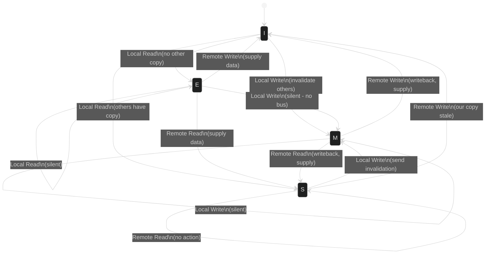
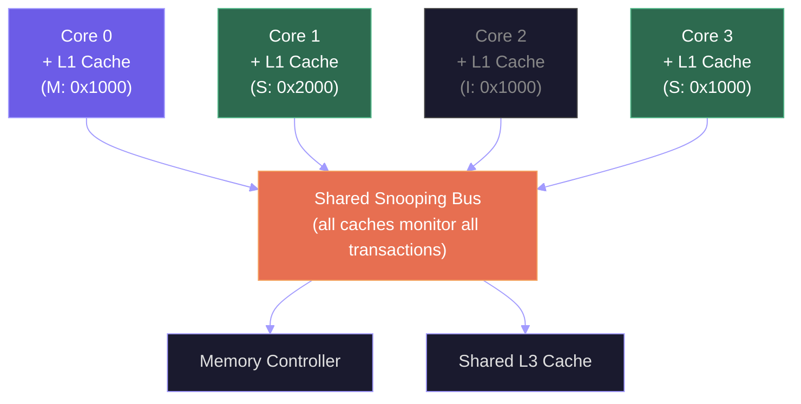
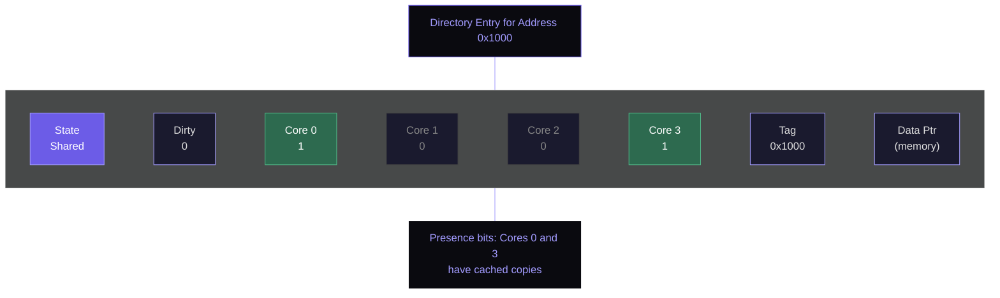

## The Power Wall: Why We Stopped Scaling Frequency

For decades, processor designers followed a reliable playbook: each new generation shrank transistors, raised clock frequency, and reaped free performance. Intel's Pentium 4 reached 3.8 GHz in 2004 on a 90nm process. The next step should have been 5+ GHz on 65nm. It never happened. The reason is captured by a single equation.

Dynamic power consumption in a CMOS circuit is:

$$P_{dyn} = \alpha C_L V_{DD}^2 f$$

where $\alpha$ is the activity factor, $C_L$ is the total load capacitance, $V_{DD}$ is the supply voltage, and $f$ is the clock frequency. Historically, Dennard Scaling promised that as transistors shrank, voltage would drop proportionally, keeping power density constant even as frequency rose. But by 2004, voltage scaling had stalled. Threshold voltage ($V_{th}$) cannot drop much further without exponentially increasing leakage current, because subthreshold leakage scales as $I_{leak} \propto e^{-V_{th}/nV_T}$ where $V_T \approx 26$ mV at room temperature. With $V_{DD}$ stuck near 0.7--1.0 V and leakage already consuming 30--40% of total power at 90nm, raising frequency further would have pushed chips past 150 W/cm$^2$ --- beyond the limits of air cooling and approaching the power density of a nuclear reactor surface.

The industry hit the **power wall**. The response was a paradigm shift: instead of faster cores, use *more* cores. Intel's first consumer dual-core (Pentium D, 2005) and AMD's Athlon 64 X2 (2005) marked the transition. Today, AMD's EPYC 9754 (Zen 4, "Bergamo") packs 128 cores in a single socket. Apple's M3 Ultra has 24 CPU cores. The NVIDIA H100 GPU has 16,896 CUDA cores organized into 132 SMs.

But multicore introduces a problem that single-core processors never faced: **cache coherence**. When multiple cores share a memory address space, and each core has its own private cache, how do we ensure that every core sees a consistent view of memory?

---

## The Cache Coherence Problem

Consider a dual-core processor where both cores have private L1 caches and share main memory. Suppose memory address `0x1000` contains the value 42.

1. **Core 0** reads `0x1000`. Its L1 cache now holds a copy: value 42.
2. **Core 1** reads `0x1000`. Its L1 cache also holds a copy: value 42.
3. **Core 0** writes 99 to `0x1000`. Core 0's cache is updated to 99.
4. **Core 1** reads `0x1000`. What value does it see?

If Core 1 reads from its own cache, it sees 42 --- a **stale** value. This is the coherence problem. The system has two copies of the same address with different values, and there is no mechanism to resolve the inconsistency.

Formally, a memory system is **coherent** if it satisfies three properties:

1. **Program order**: If Core $i$ writes to address $X$ and later reads $X$ (with no intervening write by another core), the read returns the written value.
2. **Coherent view**: If Core $i$ writes to $X$ and Core $j$ subsequently reads $X$ (with sufficient time elapsed and no intervening writes), Core $j$ reads the value written by Core $i$.
3. **Write serialization**: All writes to a single address are seen in the same order by all cores. If Core $i$ writes $A$ then $B$ to address $X$, no core can observe $B$ before $A$.

Property 3 is the strongest and most subtle. It means the system must establish a global total order on writes to each address, even though writes originate from different cores with different clocks and different pipeline depths.

---

## The MESI Protocol: A Complete State Machine

The most widely implemented coherence protocol is **MESI**, named for its four states. Every cache line in every core's private cache is tagged with one of these states:

| State | Description | This cache's copy is... | Other caches have copies? |
|-------|-------------|------------------------|--------------------------|
| **Modified (M)** | Exclusive, dirty | The only copy, modified from memory | No |
| **Exclusive (E)** | Exclusive, clean | The only copy, matches memory | No |
| **Shared (S)** | Shared, clean | One of potentially many copies, matches memory | Possibly yes |
| **Invalid (I)** | Not valid | Not present / stale | N/A |

The key insight: **M** and **E** both mean "I am the only cached copy," but M means the copy has been written (dirty) while E means it matches memory (clean). The E state is an optimization --- it allows a core to transition to M on a write without generating any bus traffic, because no other cache has a copy to invalidate.

### State Transitions

The complete MESI state machine is shown below. Solid arrows represent transitions triggered by local operations (this core's reads and writes). Dashed arrows represent transitions triggered by remote operations (another core's reads and writes observed via bus snooping).



The protocol is driven by four events: **local read** (this core reads), **local write** (this core writes), **remote read** (another core reads the same address), and **remote write** (another core writes the same address). Here is the complete transition table:

**From Invalid (I):**
- Local Read: Fetch line from memory. If no other cache has it $\rightarrow$ **E**. If another cache has it in S $\rightarrow$ **S**. If another cache has it in M, that cache writes back first, then both go to **S**.
- Local Write: Fetch line from memory (or from another cache if it has a modified copy). Invalidate all other copies. Go to **M**.

**From Exclusive (E):**
- Local Read: Stay in **E** (silent, no bus traffic).
- Local Write: Transition to **M** (silent, no bus traffic --- this is the E optimization).
- Remote Read: Downgrade to **S**. Supply data to requesting core.
- Remote Write: Transition to **I**. Supply data if needed.

**From Shared (S):**
- Local Read: Stay in **S** (silent).
- Local Write: Send invalidation to all other caches holding this line. Transition to **M**.
- Remote Read: Stay in **S** (no action needed).
- Remote Write: Transition to **I** (our copy is now stale).

**From Modified (M):**
- Local Read: Stay in **M** (silent).
- Local Write: Stay in **M** (silent).
- Remote Read: Write back dirty data to memory. Transition to **S**. Supply data to requester.
- Remote Write: Write back dirty data. Transition to **I**. Supply data to requester.

<ConceptCheck id="cc-1" />

### Worked Example: Four Operations Across Two Cores

Let us trace the MESI states for address `0x1000` across Core 0 and Core 1, starting with both caches having the line in state I (Invalid).

| Step | Operation | Core 0 State | Core 1 State | Bus Traffic |
|------|-----------|-------------|-------------|-------------|
| 0 | Initial | I | I | --- |
| 1 | Core 0 reads 0x1000 | **E** | I | Bus Read; memory responds; no other cache has it |
| 2 | Core 1 reads 0x1000 | **S** | **S** | Bus Read; Core 0 sees snoop, downgrades E $\rightarrow$ S, supplies data |
| 3 | Core 0 writes 0x1000 | **M** | **I** | Bus Invalidate; Core 1 invalidates its copy |
| 4 | Core 1 reads 0x1000 | **S** | **S** | Bus Read; Core 0 writes back dirty data, both go to S |

After step 3, Core 0 has the only valid copy (M state). When Core 1 wants to read in step 4, Core 0 must first write the modified data back to memory (or supply it directly via cache-to-cache transfer), and both copies move to Shared.

This four-step trace illustrates every interesting transition: the E optimization (step 1 $\rightarrow$ no bus traffic for subsequent reads), the S $\rightarrow$ I invalidation (step 3), and the M $\rightarrow$ S writeback (step 4).

Explore this concept with the interactive simulation below:

<Simulation id="cache-coherence" />

---

## Snooping Protocols: Bus-Based Coherence

The MESI protocol described above is a **snooping** protocol. Every cache continuously monitors (snoops) the shared bus for transactions initiated by other cores. When Core 0 issues a read that misses in its cache, the request goes onto the bus, and *all other caches* check whether they hold a copy of that address.

There are two flavors of snooping:

The diagram below shows how snooping works. Every cache monitors the shared bus. When Core 0 issues a read or write, all other caches check their tags for a matching address and respond accordingly.



**Write-invalidate** (used by MESI): When a core writes to a shared line, it broadcasts an invalidation message. All other caches mark their copies as Invalid. Only the writing core retains a valid copy. This is bandwidth-efficient because only the invalidation message travels on the bus, not the data itself.

**Write-update** (also called write-broadcast): When a core writes to a shared line, it broadcasts the new data to all other caches. Every cache holding a copy updates it immediately. This eliminates the need to re-fetch data on subsequent reads by other cores, but it consumes more bus bandwidth because every write transmits data.

In practice, write-invalidate dominates. Most written data is not immediately read by other cores, so broadcasting updates wastes bandwidth. The x86 architecture uses write-invalidate with the MESIF variant (Intel) or MOESI variant (AMD), which add states to optimize cache-to-cache transfers.

<ConceptCheck id="cc-2" />

### Limitations of Snooping

Snooping requires every cache to observe every bus transaction. This works well for small core counts (2--8 cores), where a shared bus or ring interconnect can handle the traffic. But as core counts grow, the bus becomes a bottleneck:

- **Bandwidth**: With $N$ cores, the bus must handle $O(N)$ snoops per transaction. At 64 cores, the snoop traffic alone can saturate the interconnect.
- **Latency**: Every snoop requires a response, even if negative ("I don't have that line"). With many cores, collecting all responses takes significant time.
- **Power**: Every cache must compare every snooped address against its tag array, consuming energy on every transaction.

Intel's Raptor Lake (13th/14th Gen) uses a ring bus connecting up to 24 cores (8 P-cores + 16 E-cores) with a shared 36 MB L3 cache. AMD's Zen 4 EPYC uses a scalable fabric with snoop filters to reduce traffic. But for 64+ core designs, pure snooping does not scale.

---

## Directory-Based Coherence: Scaling to Many Cores

For systems with many cores, **directory-based** protocols replace broadcast snooping with point-to-point messages. A central directory (distributed across memory controllers) tracks which caches hold copies of each line.

Each directory entry contains:

| Field | Size | Purpose |
|-------|------|---------|
| **Presence bits** | 1 bit per core | Which caches have a copy |
| **Dirty bit** | 1 bit | Whether the line is modified in some cache |
| **State** | 2 bits | Uncached, Shared, or Exclusive/Modified |

The following diagram shows a directory entry for a 4-core system. The presence bits indicate which cores currently hold a cached copy of this line. When Core 2 requests the line, the directory sends point-to-point messages only to the relevant cores, avoiding broadcast.



When Core $i$ requests a cache line:
1. The request goes to the **home node** (the memory controller responsible for that address).
2. The directory checks the presence bits to determine who has copies.
3. If the line is in M state in Core $j$, the directory sends a **fetch/invalidate** message to Core $j$, which writes back the data.
4. The directory forwards the data to Core $i$ and updates the presence bits.

The key advantage: messages are **point-to-point**, not broadcast. If Core 0 reads an address that only Core 47 has cached, only Cores 0 and 47 and the home node are involved. The other 62 cores see no traffic. This gives $O(1)$ message complexity per operation instead of $O(N)$.

The trade-off is **storage overhead**: for a 64-core system, each directory entry needs 64 presence bits plus metadata. With 64-byte cache lines, a 1 TB memory needs $\frac{10^{12}}{64} \times 72 \text{ bits} \approx 140$ GB of directory storage --- about 14% of main memory. In practice, limited pointer schemes (tracking only a few sharers) or coarse-grained directories reduce this overhead.

AMD's Infinity Fabric and Intel's UPI (Ultra Path Interconnect, successor to QPI) use directory-based approaches with snoop filters for their multi-socket server designs.

---

## False Sharing: A Silent Performance Killer

**False sharing** occurs when two cores write to *different variables* that happen to reside on the *same cache line*. The coherence protocol treats the entire cache line as a unit, so writes to any byte in the line cause invalidations of the whole line in other caches.

Consider this scenario on a system with 64-byte cache lines:

```python
# Two counters allocated consecutively in memory
# Both fit within one 64-byte cache line
counter_a = 0  # address 0x1000, used by Core 0
counter_b = 0  # address 0x1004, used by Core 1
```

Core 0 increments `counter_a` in a tight loop. Core 1 increments `counter_b` in a tight loop. Logically, these operations are independent --- they touch different variables. But because both variables share a cache line, every write by either core invalidates the other core's cached copy.

```mermaid
%%{init: {'theme': 'dark', 'themeVariables': {'primaryColor': '#6c5ce7', 'primaryTextColor': '#e0e0e0', 'lineColor': '#a29bfe'}}}%%
flowchart TD
    CORE0["Core 0\nwrites counter_a"] --> CACHE0["Core 0 L1 Cache\n(line bounces M <-> I)"]
    CORE1["Core 1\nwrites counter_b"] --> CACHE1["Core 1 L1 Cache\n(line bounces M <-> I)"]

    CACHE0 --- cacheline
    CACHE1 --- cacheline

    subgraph cacheline["64-byte Cache Line at 0x1000"]
        direction LR
        VA["counter_a\n(0x1000)\nCore 0 writes"] ~~~ VB["counter_b\n(0x1004)\nCore 1 writes"] ~~~ PAD1["padding\n(unused)"] ~~~ PAD2["padding\n(unused)"]
    end

    cacheline --- BOUNCE["Cache line BOUNCES between cores\non every write (10-100x slowdown)"]

    style CORE0 fill:#6c5ce7,stroke:#a29bfe,color:#ffffff
    style CORE1 fill:#e76f51,stroke:#f4a261,color:#ffffff
    style CACHE0 fill:#6c5ce7,stroke:#a29bfe,color:#ffffff
    style CACHE1 fill:#e76f51,stroke:#f4a261,color:#ffffff
    style VA fill:#6c5ce7,stroke:#a29bfe,color:#ffffff
    style VB fill:#e76f51,stroke:#f4a261,color:#ffffff
    style PAD1 fill:#1a1a2e,stroke:#444,color:#888
    style PAD2 fill:#1a1a2e,stroke:#444,color:#888
    style BOUNCE fill:#9b2226,stroke:#e76f51,color:#ffffff
``` The line bounces back and forth between Modified and Invalid states, generating enormous bus traffic.

The performance impact is devastating. On modern hardware, false sharing can slow down parallel code by 10--100x compared to properly separated data. Intel's Raptor Lake L1D has 48 KB with 12-way associativity and 64-byte lines; AMD's Zen 4 L1D has 32 KB with 8-way associativity and 64-byte lines. In both cases, the 64-byte line granularity creates opportunities for false sharing.

**Detection**: Profile tools like Intel VTune and `perf c2c` (cache-to-cache) can identify cache lines that bounce frequently between cores. Look for high "HITM" (Hit Modified) counts on lines that should not be shared.

**Solution**: Pad variables so that each core's data occupies a separate cache line:

```python
import sys

CACHE_LINE_SIZE = 64  # bytes

class PaddedCounter:
    """Each counter gets its own cache line."""
    def __init__(self):
        self.value = 0
        # Padding to fill a full 64-byte cache line
        self._pad = [0] * (CACHE_LINE_SIZE // sys.getsizeof(0) - 1)
```

In C/C++, the standard approach uses `alignas(64)` or compiler-specific attributes:
```
struct alignas(64) PaddedCounter {
    int64_t value;
    // Compiler automatically pads to 64 bytes
};
```

<ConceptCheck id="cc-3" />

---

## Interconnects: How Cores Communicate

The interconnect topology determines how cache coherence messages travel between cores. Real processors use several architectures:

### Intel QPI and UPI

Intel's **Quick Path Interconnect (QPI)**, introduced with Nehalem (2008), replaced the legacy Front Side Bus with point-to-point links between processors and between processors and I/O hubs. QPI ran at up to 9.6 GT/s, providing 19.2 GB/s per link per direction.

Its successor, **Ultra Path Interconnect (UPI)**, debuted with Skylake-SP (2017). UPI 2.0 (Ice Lake-SP) runs at 11.2 GT/s. UPI links connect sockets in multi-socket servers and carry coherence messages, memory requests, and I/O traffic. A typical 2-socket server has 3 UPI links between the processors, providing 3 $\times$ 11.2 GT/s = 33.6 GT/s aggregate bandwidth.

### AMD Infinity Fabric

AMD's **Infinity Fabric** is a scalable interconnect that connects Core Complex Dies (CCDs), I/O dies, and memory controllers within a single socket, and connects sockets in multi-socket configurations. Each Zen 4 CCD contains 8 cores sharing 32 MB of L3 cache. The Infinity Fabric clock typically runs at half the memory clock (e.g., 2400 MHz for DDR5-4800), and its bandwidth scales with the fabric clock.

In EPYC processors, Infinity Fabric connects up to 12 CCDs to a central I/O die (IOD) in a star topology. Cross-CCD latency is approximately 40--50 ns, while cross-socket latency is 100--130 ns via Infinity Fabric links.

### CXL: The Future of Memory Interconnects

**Compute Express Link (CXL)** is a new open standard built on the PCIe physical layer that provides cache-coherent access to shared memory between CPUs, accelerators, and memory expansion devices. CXL 3.0 runs on PCIe 6.0 at 64 GT/s, providing up to 256 GB/s aggregate bidirectional bandwidth over a x16 link.

CXL defines three device types:

| Type | Protocols | Example |
|------|-----------|---------|
| **Type 1** | CXL.io + CXL.cache | SmartNICs, crypto accelerators |
| **Type 2** | CXL.io + CXL.cache + CXL.mem | GPUs, FPGAs, AI accelerators |
| **Type 3** | CXL.io + CXL.mem | Memory expanders, persistent memory |

CXL Type 3 devices enable **memory pooling**: a rack of CXL-attached memory can be dynamically allocated to different servers. This is transformative for data centers where memory is the most expensive component per server. CXL 3.0 adds multi-host memory sharing with hardware-maintained coherency via back-invalidation, enabling shared-memory programming across separate servers.

The latency penalty for CXL-attached memory is approximately 150--200 ns, compared to 60--80 ns for local DDR5. This makes CXL memory suitable for capacity expansion (cold/warm data tiers) rather than performance-critical hot data.

---

## NUMA: Non-Uniform Memory Access

In multi-socket systems, each processor has its own local memory controllers and DRAM. A core can access its **local** memory quickly, but accessing memory attached to another socket requires traversing the interconnect (UPI, Infinity Fabric). This creates **non-uniform memory access (NUMA)** --- memory latency depends on which socket the memory is attached to.

Typical NUMA latency ratios for a 2-socket server:

| Access Type | Latency | Ratio |
|-------------|---------|-------|
| Local DRAM | ~80 ns | 1.0x |
| Remote DRAM (1 hop) | ~130 ns | 1.6x |
| Remote DRAM (2 hops, 4-socket) | ~180 ns | 2.3x |

For bandwidth-intensive workloads, the penalty is even starker: remote memory bandwidth is typically 50--70% of local bandwidth due to interconnect contention.

NUMA-aware programming is essential for high-performance computing. The key principle is **data locality**: allocate memory on the same NUMA node where the threads that access it will run. Linux uses a **first-touch** policy by default: a page is allocated on the NUMA node of the core that first accesses it. Tools like `numactl` and the `libnuma` library provide explicit control over memory placement and CPU affinity.

<ConceptCheck id="cc-4" />

---

## Multicore Programming Concepts

Writing correct concurrent programs requires understanding the hardware primitives that enable synchronization. At the software level, the two fundamental abstractions are:

**Threads**: Independent streams of execution that share an address space. Each thread has its own stack and program counter but shares heap memory, global variables, and file descriptors with other threads in the same process.

**Mutual exclusion (mutex)**: A synchronization primitive that ensures only one thread at a time can execute a critical section. A thread acquires (locks) the mutex before entering the critical section and releases (unlocks) it upon exit.

```python
import threading

counter = 0
lock = threading.Lock()

def increment_counter(n):
    global counter
    for _ in range(n):
        lock.acquire()
        counter += 1  # Critical section
        lock.release()

# Two threads incrementing the same counter
t1 = threading.Thread(target=increment_counter, args=(100000,))
t2 = threading.Thread(target=increment_counter, args=(100000,))
t1.start(); t2.start()
t1.join(); t2.join()
print(f"Counter = {counter}")  # Always 200000 with the lock
```

Without the lock, the increment operation (`counter += 1`) is not atomic --- it involves a read, an add, and a write. Two threads can read the same value, both increment it, and both write back the same result, losing one increment. This is a **race condition**, and it is the fundamental bug of concurrent programming.

The hardware mechanisms that make locks efficient --- atomic instructions, memory ordering, cache line ownership --- are the subject of the next lecture. The MESI protocol we studied today provides the foundation: when a core acquires a lock variable, it needs the cache line in M state (exclusive write access), which the coherence protocol ensures by invalidating all other copies.

---

## Summary

The power wall ended frequency scaling and forced the industry toward multicore processors. Multicore introduces the cache coherence problem: multiple private caches can hold inconsistent copies of the same address. The MESI protocol solves this with four states (Modified, Exclusive, Shared, Invalid) and a precise state machine that handles local and remote reads and writes. Snooping protocols broadcast coherence messages on a shared bus, which works for small core counts but does not scale. Directory-based protocols use point-to-point messages guided by a central directory, scaling to 64+ cores at the cost of directory storage. False sharing --- unrelated variables sharing a cache line --- is a common performance trap that padding or alignment can fix. Modern interconnects (Intel UPI, AMD Infinity Fabric, CXL) provide the physical layer for coherence traffic, with CXL 3.0 extending coherent shared memory across devices and even across servers. NUMA architectures introduce non-uniform latency that software must account for through data placement and thread affinity.
