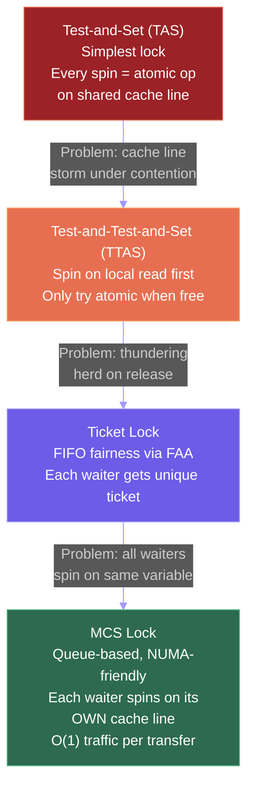
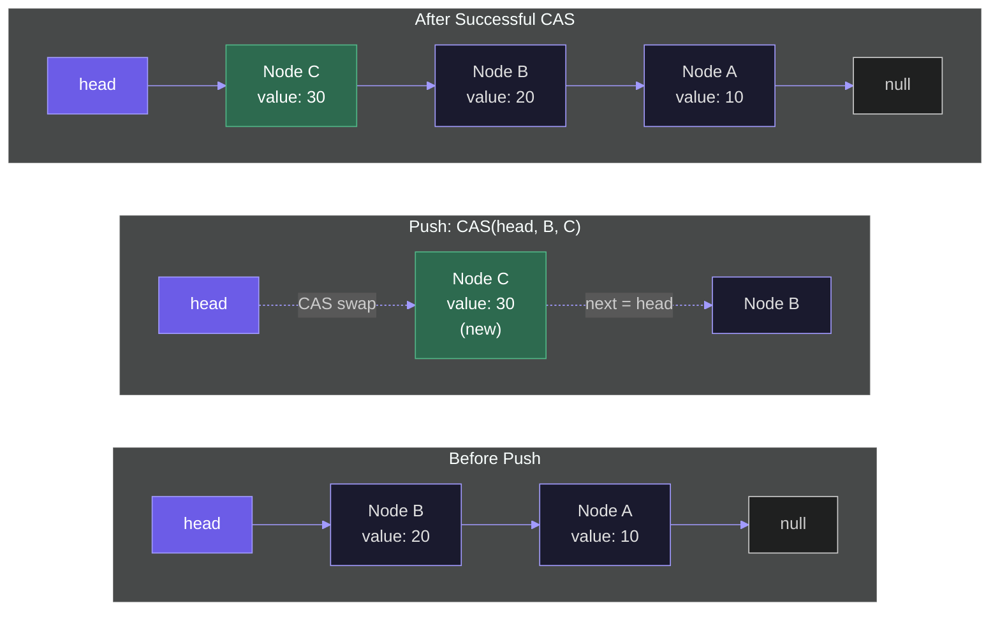
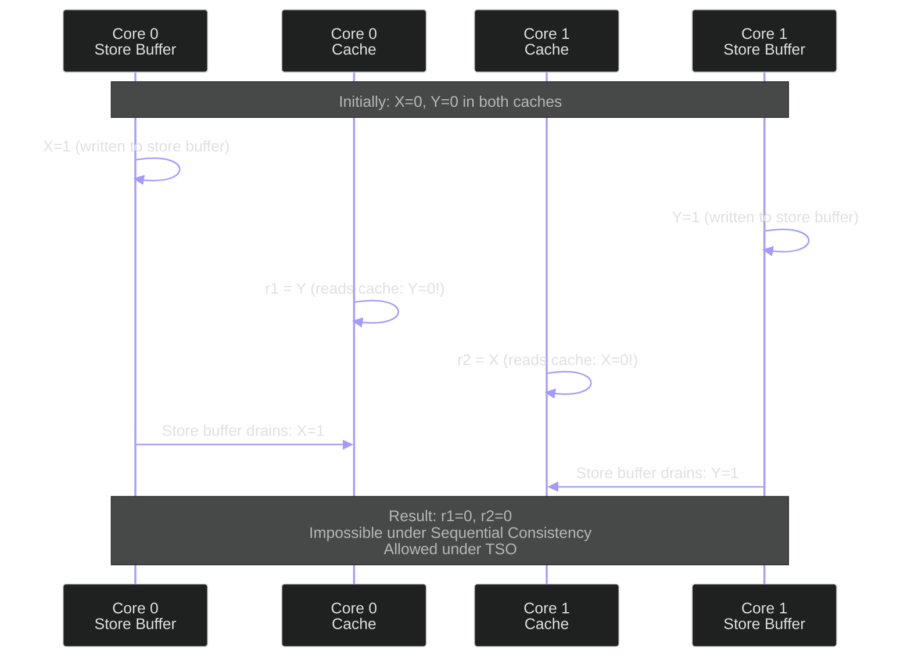

## Hardware Synchronization Primitives

Every lock, semaphore, and concurrent data structure ultimately rests on a handful of **atomic instructions** --- operations that the hardware guarantees will complete as an indivisible unit, even when multiple cores execute them simultaneously. Without these primitives, correct concurrent programming would be impossible. Let us examine each one, understand its semantics precisely, and see how they compose into higher-level constructs.

### Test-and-Set (Atomic Exchange)

The simplest atomic primitive is **test-and-set**, also known as atomic exchange. It atomically reads the current value of a memory location and writes a new value, returning the old value. In hardware, this is implemented as a single bus transaction that holds the cache line in Modified state for the duration of the operation.

```python
def atomic_test_and_set(lock_var, new_value=1):
    """Atomically: old = lock_var; lock_var = new_value; return old"""
    # In real hardware, this is a single instruction (XCHG on x86)
    old = lock_var[0]
    lock_var[0] = new_value
    return old
```

On x86, this is the `XCHG` instruction, which has an implicit `LOCK` prefix. On ARM, it is `SWP` (deprecated in favor of LL/SC). The key property: no other core can observe the memory location in a state between the read and the write.

### Compare-and-Swap (CAS)

**Compare-and-Swap** is the most versatile atomic primitive. It takes three arguments: a memory address, an expected value, and a new value. It atomically checks whether the memory location contains the expected value; if so, it writes the new value and returns `True`. If not, it leaves the memory unchanged and returns `False`.

$$\text{CAS}(\text{addr}, \text{expected}, \text{new}) = \begin{cases} \text{*addr} \leftarrow \text{new}, \text{ return True} & \text{if *addr} = \text{expected} \\ \text{no change, return False} & \text{otherwise} \end{cases}$$

```python
def compare_and_swap(location, expected, new_value):
    """Atomically: if location[0] == expected, set to new_value and return True."""
    if location[0] == expected:
        location[0] = new_value
        return True
    return False
```

On x86, this is the `LOCK CMPXCHG` instruction. CAS is the fundamental building block of **lock-free** programming. It enables a core to speculatively prepare an update, then atomically commit it only if no other core has modified the data in the meantime. If the CAS fails (because another core changed the value), the core retries with the new value --- a pattern called **optimistic concurrency**.

CAS can implement any atomic read-modify-write operation via a retry loop:

```python
def atomic_fetch_and_add(location, delta):
    """Atomically add delta to location and return old value, using CAS."""
    while True:
        old = location[0]
        if compare_and_swap(location, old, old + delta):
            return old
```

<ConceptCheck id="cc-1" />

### Load-Linked / Store-Conditional (LL/SC)

RISC architectures (ARM, RISC-V, MIPS) use a different approach called **Load-Linked / Store-Conditional (LL/SC)**. Instead of a single atomic read-modify-write instruction, they split the operation into two instructions with a hardware **reservation**:

1. **Load-Linked (LL)**: Reads a value from memory and sets a per-core hardware reservation on that address.
2. **Store-Conditional (SC)**: Writes a new value to the address, but only if the reservation is still valid (no other core has written to that cache line since the LL). Returns success or failure.

```python
class LLSCSimulator:
    """Simulates Load-Linked / Store-Conditional semantics."""
    def __init__(self):
        self.memory = {}
        self.reservations = {}  # core_id -> (address, valid)

    def load_linked(self, core_id, address):
        """Read value and set reservation."""
        self.reservations[core_id] = (address, True)
        return self.memory.get(address, 0)

    def store_conditional(self, core_id, address, value):
        """Write only if reservation is still valid."""
        res = self.reservations.get(core_id)
        if res and res[0] == address and res[1]:
            self.memory[address] = value
            # Invalidate all other reservations on this address
            for cid in self.reservations:
                if cid != core_id and self.reservations[cid][0] == address:
                    self.reservations[cid] = (address, False)
            return True  # Success
        return False  # Failed: retry
```

In RISC-V, these are `LR.W` (Load-Reserved Word) and `SC.W` (Store-Conditional Word). The SC fails if any of the following occurs between the LR and SC: (a) another core writes to the same cache line, (b) a context switch occurs, or (c) an interrupt is taken. This "fail-safe" behavior means LL/SC avoids the ABA problem (discussed later) that plagues CAS.

### Fetch-and-Add (FAA)

**Fetch-and-Add** atomically increments a memory location and returns the old value. On x86, this is `LOCK XADD`. While CAS can simulate FAA via a retry loop, dedicated FAA instructions are more efficient because they never fail --- the hardware guarantees completion in a single atomic step.

$$\text{FAA}(\text{addr}, \delta): \text{old} \leftarrow \text{*addr}; \text{*addr} \leftarrow \text{old} + \delta; \text{return old}$$

FAA is the foundation of **ticket locks** and **counting semaphores**, where we need a monotonically increasing counter that multiple cores can safely increment.

---

## Spinlocks: From Simple to NUMA-Friendly

A **spinlock** is a lock where a thread that cannot acquire it **spins** (busy-waits) in a tight loop, repeatedly checking the lock variable until it becomes available. Spinlocks are appropriate when the expected wait time is short (microseconds), because spinning avoids the overhead of a context switch (which costs thousands of cycles on modern hardware).

The following diagram traces the evolution of spinlock designs, from the simplest (TAS) to the most scalable (MCS). Each successive design addresses a specific limitation of its predecessor.



### Simple Test-and-Set Lock

The simplest spinlock uses atomic exchange:

```python
def tas_lock_acquire(lock):
    """Spin until we atomically set lock from 0 to 1."""
    while True:
        old = atomic_exchange(lock, 1)
        if old == 0:
            return  # We got the lock

def tas_lock_release(lock):
    """Release by setting lock to 0."""
    lock[0] = 0
```

**Problem**: Every iteration of the spin loop executes an atomic exchange, which requires the cache line in Modified state. With $N$ cores spinning, the cache line bounces between all $N$ cores on every iteration. Each bounce costs 50--100 ns (cross-core latency). The result is a **cache line storm**: massive interconnect traffic that degrades not just lock performance but *all* memory operations on the system.

### Test-and-Test-and-Set (TTAS)

The fix is simple but effective: before attempting the expensive atomic exchange, first **test** the lock with a regular (non-atomic) read. If the lock is held (value 1), keep reading locally from the cache --- no bus traffic. Only attempt the atomic exchange when the read sees the lock is free.

```python
def ttas_lock_acquire(lock):
    """Spin on local cache read; only try atomic exchange when lock appears free."""
    while True:
        # Phase 1: Spin on local read (cache hit, no bus traffic)
        while lock[0] == 1:
            pass  # Spinning locally in cache

        # Phase 2: Lock appears free; try to acquire
        old = atomic_exchange(lock, 1)
        if old == 0:
            return  # Got the lock
        # If old == 1, someone else got it first; go back to spinning
```

TTAS dramatically reduces bus traffic during contention. While the lock is held, all waiting cores spin on their local cached copy (which is in Shared state). When the lock holder releases, the write invalidates all copies, each core re-fetches the line (seeing 0), and they race to acquire with atomic exchange. Only $N$ atomic operations hit the bus, instead of $N$ per iteration.

However, TTAS has a **thundering herd** problem: when the lock is released, all $N$ waiting cores simultaneously attempt the atomic exchange. $N-1$ fail, generating $N-1$ wasted bus transactions. And TTAS provides no **fairness** guarantee --- a core can starve indefinitely.

<ConceptCheck id="cc-2" />

### Ticket Lock: Guaranteed Fairness

A **ticket lock** uses Fetch-and-Add to assign each waiting core a unique, sequentially increasing ticket number. Cores acquire the lock in ticket order, guaranteeing FIFO fairness.

```python
class TicketLock:
    """Fair spinlock using ticket numbers.

    Each core takes a numbered ticket (like a deli counter).
    The lock holder increments 'now_serving' on release.
    """
    def __init__(self):
        self.next_ticket = [0]  # Atomically incremented on acquire
        self.now_serving = [0]  # Incremented by lock holder on release

    def acquire(self):
        # Atomically get our ticket number
        my_ticket = fetch_and_add(self.next_ticket, 1)
        # Spin until our ticket is being served
        while self.now_serving[0] != my_ticket:
            pass

    def release(self):
        # Serve the next ticket
        self.now_serving[0] += 1
```

Ticket locks are fair and simple. But they still suffer from a scalability problem on NUMA systems: all waiting cores spin on the same `now_serving` variable. When it is updated, all copies are invalidated, causing $O(N)$ cache misses --- the same thundering herd problem as TTAS, just on a different variable.

### MCS Lock: Queue-Based, NUMA-Friendly

The **MCS lock** (Mellor-Crummey and Scott, 1991) is a queue-based spinlock that solves the thundering herd problem. Each waiting core spins on a **different** cache line --- its own local node in a linked list. When the lock is released, only the *next* core in the queue is notified.

```python
class MCSNode:
    """Each thread allocates one MCSNode on its local NUMA node."""
    def __init__(self):
        self.locked = True   # Am I waiting?
        self.next = None     # Next waiter in queue

class MCSLock:
    """Queue-based lock: O(1) bus traffic per acquire/release.

    Key insight: each core spins on its OWN node's 'locked' field,
    which resides in that core's local cache. No shared spinning variable.
    """
    def __init__(self):
        self.tail = [None]  # Atomic pointer to tail of queue

    def acquire(self, my_node):
        my_node.locked = True
        my_node.next = None

        # Atomically swap ourselves into the tail
        predecessor = atomic_exchange(self.tail, my_node)

        if predecessor is not None:
            # Someone holds the lock; link ourselves after them
            predecessor.next = my_node
            # Spin on OUR OWN node (local cache line!)
            while my_node.locked:
                pass

    def release(self, my_node):
        if my_node.next is None:
            # Try to set tail to None (we might be the only waiter)
            if compare_and_swap(self.tail, my_node, None):
                return  # No one was waiting

            # Someone is in the process of enqueuing; wait for them
            while my_node.next is None:
                pass

        # Unblock the next waiter (writes to THEIR cache line)
        my_node.next.locked = False
```

The MCS lock generates exactly **one** cache line invalidation per lock transfer: the releaser writes to the next waiter's `locked` field. No thundering herd. No global spinning. This makes MCS locks the gold standard for NUMA systems, and variants of MCS are used in the Linux kernel (`qspinlock`).

---

## Lock-Free Data Structures

Locks have three fundamental problems: **deadlock** (two threads each waiting for the other's lock), **priority inversion** (a high-priority thread blocked by a low-priority thread holding a lock), and **convoying** (if a lock holder is preempted, all other threads wait idle). **Lock-free** data structures avoid these problems by using CAS instead of locks, guaranteeing that *at least one thread* makes progress in any concurrent execution.

### Treiber Stack (Lock-Free Stack)

The **Treiber stack** (R.K. Treiber, IBM, 1986) is the simplest lock-free data structure. It is a singly linked list where push and pop both operate on the head pointer using CAS. The following diagram shows the CAS-based push operation: create a new node pointing to the current head, then atomically swap the head pointer.



```python
class TreiberStack:
    """Lock-free stack using Compare-and-Swap on the head pointer.

    Push: create new node pointing to current head, CAS head to new node.
    Pop: read current head, CAS head to head.next.

    Both operations retry if CAS fails (another thread modified head).
    """
    def __init__(self):
        self.head = [None]  # Atomic pointer

    def push(self, value):
        new_node = {'value': value, 'next': None}
        while True:
            old_head = self.head[0]
            new_node['next'] = old_head
            if compare_and_swap(self.head, old_head, new_node):
                return  # Successfully pushed

    def pop(self):
        while True:
            old_head = self.head[0]
            if old_head is None:
                return None  # Stack is empty
            new_head = old_head['next']
            if compare_and_swap(self.head, old_head, new_head):
                return old_head['value']  # Successfully popped
```

The stack is **linearizable**: every push and pop appears to take effect at a single point in time (the successful CAS). Concurrent pushes and pops may retry multiple times, but at least one thread succeeds on each round, guaranteeing lock-free progress.

### Michael-Scott Queue (Lock-Free Queue)

The **Michael-Scott queue** (Michael and Scott, 1996) is a lock-free FIFO queue using two CAS operations: one on the head pointer (for dequeue) and one on the tail pointer (for enqueue). It uses a sentinel (dummy) node to simplify the empty-queue case.

The enqueue operation first tries to CAS the `next` pointer of the current tail node. If successful, it then advances the tail pointer. A key subtlety: if another thread enqueues concurrently, both the `next` link and the tail advancement might be split across threads --- any thread that notices the tail is lagging "helps" by advancing it.

### The ABA Problem

Lock-free algorithms using CAS are vulnerable to the **ABA problem**. Consider a pop operation on the Treiber stack:

1. Thread A reads `head = node_X` and `head.next = node_Y`.
2. Thread A is preempted (paused by the OS scheduler).
3. Thread B pops `node_X`, then pops `node_Y`, then pushes `node_X` back.
4. `head` is now `node_X` again, but `node_X.next` points to something different than `node_Y`.
5. Thread A resumes and executes `CAS(head, node_X, node_Y)`. The CAS **succeeds** because `head` is still `node_X`. But `node_Y` is no longer the correct next node --- it might have been freed or reused.

The CAS cannot distinguish "value unchanged" from "value changed and changed back." The fix comes in two forms:

**Tagged pointers**: Pair each pointer with a monotonically increasing version counter. The CAS operates on the (pointer, counter) pair. Even if the pointer returns to its original value, the counter has advanced, so the CAS fails.

$$\text{CAS}((\text{ptr}, \text{ver}), (\text{expected\_ptr}, \text{expected\_ver}), (\text{new\_ptr}, \text{expected\_ver} + 1))$$

On 64-bit systems, the upper 16 bits of a pointer (unused in current address spaces) can store the counter, or a **double-width CAS** (`CMPXCHG16B` on x86) can atomically compare-and-swap 128 bits.

**Hazard pointers**: Each thread publishes the pointers it is currently using in a per-thread list. Before freeing memory, a thread scans all hazard pointer lists to ensure no other thread references the node. This prevents premature reclamation, eliminating the ABA scenario.

<ConceptCheck id="cc-3" />

---

## Transactional Memory

**Transactional memory (TM)** offers an alternative to both locks and lock-free programming. Instead of explicitly managing synchronization, the programmer wraps a code region in a transaction. The hardware or software runtime guarantees atomicity: either all memory operations in the transaction commit, or none do (rollback).

### Hardware Transactional Memory (HTM)

Intel introduced **Transactional Synchronization Extensions (TSX)** in Haswell (2013), comprising two interfaces:

- **Hardware Lock Elision (HLE)**: Annotate existing lock acquire/release with `XACQUIRE`/`XRELEASE` hints. The hardware speculatively executes the critical section without acquiring the lock. If no other thread accesses the same data (no conflict), the transaction commits and the lock was never actually taken --- eliminating serialization. If a conflict is detected, the hardware aborts and falls back to acquiring the real lock.

- **Restricted Transactional Memory (RTM)**: The programmer uses `XBEGIN`/`XEND` to explicitly define transaction boundaries. If the transaction aborts (due to conflicts, capacity overflow, or unsupported instructions), control transfers to a fallback handler.

Transactions abort when: (1) two transactions access the same cache line and at least one writes (**data conflict**), (2) the transaction's read or write set exceeds the L1 cache capacity (**capacity abort**), or (3) certain instructions (syscalls, I/O) are executed inside the transaction.

**TSX was deprecated** in 2021 due to security vulnerabilities (TSX Asynchronous Abort, TAA). Intel disabled it via microcode updates on most processors. However, the concept lives on in ARM's Transactional Memory Extension (TME) and academic research.

### Software Transactional Memory (STM)

STM implements transactions in software, using version numbers and read/write logs. Each transaction records its read set and write set, performs writes to a local buffer, and at commit time validates that no other transaction has modified any address in the read set. If validation fails, the transaction aborts and retries.

STM has significant overhead (2--10x) compared to hand-crafted lock-free algorithms, and has seen limited adoption in production systems. Clojure and Haskell offer STM libraries, but mainstream languages have not adopted it.

---

## Memory Ordering: What Happens After the Write?

Atomic operations guarantee indivisibility, but they do not, by themselves, guarantee the **order** in which memory operations become visible to other cores. Modern processors reorder memory operations for performance, and different architectures provide different guarantees.

### Sequential Consistency

**Sequential consistency** (Lamport, 1979) is the strongest and most intuitive model: the result of any concurrent execution is the same as if all memory operations from all cores were interleaved in some total order, respecting each core's program order.

Under sequential consistency, if Core 0 writes `A=1` then `B=1`, and Core 1 reads `B` then `A`, it is impossible for Core 1 to see `B=1` and `A=0`. The write to `A` happened before the write to `B` in Core 0's program order, so any observer that sees `B=1` must also see `A=1`.

Sequential consistency is expensive because it prevents the processor from reordering stores, buffering writes, or overlapping loads with stores --- all of which are key performance optimizations.

### Total Store Order (TSO): The x86 Model

x86 processors use **Total Store Order (TSO)**, a slightly relaxed model. TSO allows **store-to-load reordering**: a load can be satisfied from the store buffer before the store becomes visible to other cores. In effect, each core sees its own stores immediately (via store buffer forwarding), but other cores see them with a delay.

The following sequence diagram illustrates how TSO's store buffer can produce a surprising result. Each core writes to its store buffer first, then reads the other variable from cache. The store has not yet drained to cache when the read occurs, so both cores see the old value.



TSO is the reason the following "store buffer litmus test" can produce a surprising result:

```
Initially: X = 0, Y = 0

Core 0:        Core 1:
X = 1          Y = 1
r1 = Y         r2 = X
```

Under sequential consistency, `r1 = 0` and `r2 = 0` simultaneously is impossible. Under TSO, it *is* possible: each core writes to its store buffer, then reads the other variable from cache (seeing 0), and only later does the store buffer drain to cache. This is the single reordering TSO allows.

### Relaxed Models: ARM and RISC-V

ARM and RISC-V use **relaxed** memory models that allow many more reorderings: store-store, load-load, store-load, and load-store. This gives the hardware maximum freedom to optimize, but requires the programmer to insert explicit **memory fences (barriers)** to enforce ordering when needed.

RISC-V provides a single `FENCE` instruction with configurable options: `FENCE r,w` ensures all prior reads complete before subsequent writes; `FENCE rw,rw` is a full barrier.

ARM provides `DMB` (Data Memory Barrier), `DSB` (Data Synchronization Barrier), and `ISB` (Instruction Synchronization Barrier), each with variants for different scopes (inner/outer shareable, full system).

In practice, most programmers use higher-level abstractions (C++ `std::atomic` with memory ordering specifiers like `memory_order_acquire`, `memory_order_release`, `memory_order_seq_cst`) and let the compiler insert the appropriate fences for the target architecture.

<ConceptCheck id="cc-4" />

---

## NUMA-Aware Programming

We introduced NUMA topology in the previous lecture. Here we focus on the practical techniques for writing software that respects NUMA boundaries.

### First-Touch Page Placement

Linux allocates physical pages on the NUMA node where the first page fault occurs --- the **first-touch** policy. This means the thread that initializes an array determines where it physically resides. A common anti-pattern:

```python
# BAD: Main thread initializes all data (all on node 0)
data = [0] * 1000000

# Worker threads on different NUMA nodes access remote memory
# Thread on node 1 accesses data on node 0: ~130 ns instead of ~80 ns
```

The fix: initialize data in parallel, with each thread initializing its own partition. This ensures each partition is allocated on the NUMA node where it will be used.

### numactl and CPU Affinity

The `numactl` command controls NUMA policy at process launch:

```
# Run on NUMA node 0 only (CPUs and memory)
numactl --cpunodebind=0 --membind=0 ./my_program

# Interleave memory across all nodes (good for shared-read data)
numactl --interleave=all ./my_program
```

Within a program, `sched_setaffinity()` pins threads to specific cores, and `set_mempolicy()` or `mbind()` controls memory placement.

### Real Latency Measurements

On a 2-socket AMD EPYC 9754 (128 cores per socket, 12 CCDs per socket):

| Access Pattern | Latency |
|---------------|---------|
| L1 hit | ~1 ns (4 cycles at 4 GHz) |
| L2 hit | ~3 ns (14 cycles) |
| L3 hit (same CCD) | ~10 ns (50 cycles) |
| L3 hit (cross-CCD, same socket) | ~18 ns |
| Local DRAM | ~80 ns |
| Remote DRAM (1 hop via Infinity Fabric) | ~130 ns |

The 1.6x latency penalty for remote DRAM access directly translates to a 1.6x slowdown for pointer-chasing workloads and a measurable throughput reduction for streaming workloads that cross NUMA boundaries.

---

## C++ Atomics and Memory Ordering

C++11 introduced `std::atomic` with fine-grained memory ordering control. The available orderings, from weakest to strongest:

| Ordering | Guarantees |
|----------|-----------|
| `memory_order_relaxed` | Only atomicity, no ordering |
| `memory_order_acquire` | No loads/stores after this can be reordered before it |
| `memory_order_release` | No loads/stores before this can be reordered after it |
| `memory_order_acq_rel` | Both acquire and release |
| `memory_order_seq_cst` | Full sequential consistency (default) |

An acquire-release pair forms a **happens-before** relationship: everything written before a release store is visible to the thread that performs an acquire load of the same variable.

```
// C++ example (conceptual)
std::atomic<bool> flag{false};
int data = 0;

// Thread 1 (producer):
data = 42;                                    // (1)
flag.store(true, std::memory_order_release);  // (2)

// Thread 2 (consumer):
while (!flag.load(std::memory_order_acquire)); // (3)
assert(data == 42);  // Guaranteed! (1) happens-before (2) happens-before (3)
```

On x86 (TSO), acquire and release are essentially free (TSO already provides these guarantees). On ARM and RISC-V, acquire compiles to a load followed by a barrier, and release compiles to a barrier followed by a store.

---

## Summary

Hardware synchronization primitives --- Test-and-Set, Compare-and-Swap, Load-Linked/Store-Conditional, and Fetch-and-Add --- are the atomic building blocks on which all concurrent software is built. Spinlocks evolved from the simple but inefficient Test-and-Set lock through Test-and-Test-and-Set (reducing bus traffic) and Ticket locks (adding fairness) to MCS locks (eliminating thundering herd, NUMA-friendly). Lock-free data structures like the Treiber stack and Michael-Scott queue use CAS to achieve progress guarantees without mutual exclusion, but must handle the ABA problem via tagged pointers or hazard pointers. Transactional memory (Intel TSX, now deprecated) offered a cleaner programming model but suffered from capacity limits and security vulnerabilities. Memory ordering varies by architecture: x86 provides TSO (only store-load reordering), while ARM and RISC-V use relaxed models requiring explicit fences. NUMA-aware programming --- first-touch placement, CPU affinity, numactl --- is essential for performance on multi-socket systems where remote memory access is 1.6x slower than local access.
