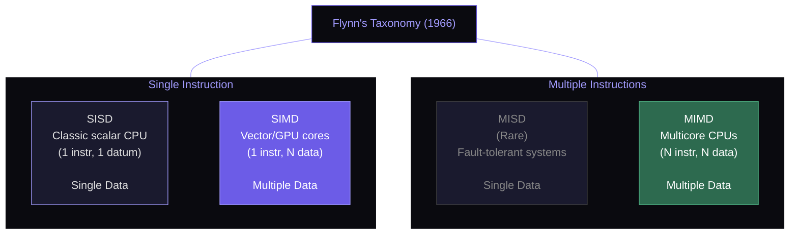
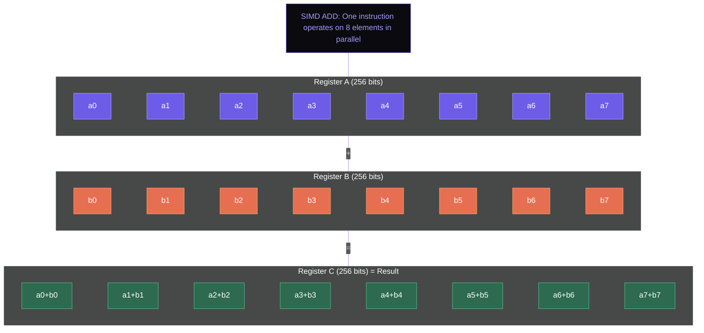
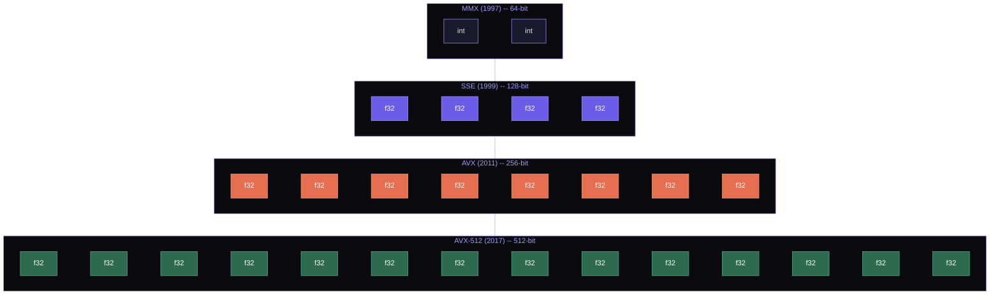

## Flynn's Taxonomy: Classifying Parallel Architectures

In 1966, Michael Flynn proposed a taxonomy for classifying computer architectures based on two axes: the number of instruction streams and the number of data streams. This classification remains useful sixty years later.

| Category | Instruction Streams | Data Streams | Example |
|----------|-------------------|-------------|---------|
| **SISD** | Single | Single | Classic scalar CPU (one instruction, one datum) |
| **SIMD** | Single | Multiple | Vector units, GPU cores, SIMD extensions |
| **MISD** | Multiple | Single | Rare; systolic arrays sometimes classified here |
| **MIMD** | Multiple | Multiple | Multicore CPUs, distributed systems |



The multicore processors we studied last week are MIMD: each core has its own instruction stream operating on its own data. This week, we turn to **SIMD** --- Single Instruction, Multiple Data --- where a single instruction operates on multiple data elements simultaneously. SIMD is the hardware substrate beneath virtually all high-performance numeric computing: image processing, scientific simulation, machine learning inference, video encoding, and the matrix operations that power neural networks.

---

## The SIMD Concept: One Instruction, Many Elements

Consider adding two arrays of 8 floating-point numbers. On a scalar processor, this requires 8 separate add instructions, each processing one pair of elements:

```python
# Scalar approach: 8 instructions
for i in range(8):
    c[i] = a[i] + b[i]
```

The diagram below contrasts scalar processing (one element at a time) with SIMD processing (multiple elements in one instruction). A single SIMD ADD operates on all lanes simultaneously.



With a 256-bit SIMD register that holds 8 single-precision floats (each 32 bits), a **single SIMD instruction** performs all 8 additions at once:

$$\text{SIMD ADD: } [a_0, a_1, \ldots, a_7] + [b_0, b_1, \ldots, b_7] = [a_0+b_0, a_1+b_1, \ldots, a_7+b_7]$$

This is not 8 instructions running in parallel (that would be MIMD). It is genuinely one instruction that operates on a wider data path. The hardware has 8 adder circuits that all activate from the same control signals. The performance gain is theoretically 8x --- one instruction does the work of eight.

The key insight: SIMD exploits **data-level parallelism (DLP)** --- the same operation applied to many independent data elements. This is distinct from instruction-level parallelism (ILP, exploited by superscalar pipelines) and thread-level parallelism (TLP, exploited by multicore). SIMD is complementary to both: a modern CPU core uses superscalar execution, SIMD within each pipeline, and multiple such cores in parallel.

---

## x86 SIMD Evolution: From MMX to AMX

The history of SIMD on x86 is a story of doubling register width every few years, each generation adding capabilities the previous one lacked.

The following diagram shows the progression of x86 SIMD register widths. Each generation doubled the width, processing more data elements per instruction.



### MMX (1997): The Beginning

Intel's **MultiMedia eXtensions** introduced 64-bit SIMD registers (MM0--MM7) that shared physical storage with the x87 floating-point stack. MMX supported only integer operations: 8x 8-bit, 4x 16-bit, or 2x 32-bit packed integers. The register sharing with x87 made context switches expensive and prevented mixing MMX and floating-point code, a severe limitation.

### SSE (1999): Floating Point Enters SIMD

**Streaming SIMD Extensions** introduced 8 new 128-bit registers (XMM0--XMM7) separate from the x87 stack. SSE added single-precision floating-point SIMD: 4 floats per register. SSE2 (2001) added double-precision (2 doubles per register) and integer operations on XMM registers, effectively obsoleting MMX. SSE3 (2004) and SSE4 (2006) added horizontal operations (add/subtract adjacent elements within a register), dot product, and string processing instructions.

At 128 bits, SSE processes 4 single-precision or 2 double-precision values per instruction.

### AVX (2011): Doubling to 256 Bits

**Advanced Vector Extensions** doubled the register width to 256 bits (YMM0--YMM15), processing 8 floats or 4 doubles per instruction. AVX introduced a non-destructive three-operand syntax: `VADDPS ymm0, ymm1, ymm2` computes `ymm0 = ymm1 + ymm2` without overwriting an input.

AVX2 (2013) extended 256-bit operations to integers and added crucial gather instructions --- loading data from non-contiguous memory addresses into a single register.

### AVX-512 (2017): 512 Bits and Masking

AVX-512, introduced with Skylake-X, doubled the register width again to 512 bits: 16 floats or 8 doubles per instruction. It also doubled the register count to 32 (ZMM0--ZMM31) and introduced several transformative features:

- **Mask registers** (k0--k7): 8 predicate registers that control which elements of a SIMD operation are active. Masked-off elements can be zeroed or left unchanged. This eliminates the need for blend instructions after conditional operations.
- **Embedded broadcast**: Load a scalar from memory and broadcast it to all SIMD lanes inline, without a separate broadcast instruction.
- **Gather/scatter**: Load from or store to non-contiguous memory addresses in a single instruction, guided by an index register.
- **Embedded rounding**: Specify rounding mode per instruction, avoiding costly changes to the MXCSR control register.

$$\text{AVX-512 throughput: } \frac{512 \text{ bits}}{32 \text{ bits/float}} = 16 \text{ floats/instruction}$$

However, AVX-512 has a controversial performance characteristic: on many Intel processors, executing AVX-512 instructions causes the core to **downclock** by 10--20% to stay within power limits. Whether the wider operations compensate for the lower frequency depends on the workload. Dense floating-point code benefits; code with only occasional SIMD does not.

### AMX (2023): Tile-Based Matrix Operations

Intel's **Advanced Matrix Extensions**, introduced with Sapphire Rapids, move beyond vector SIMD to **tile-based** matrix operations. AMX introduces 8 tile registers, each holding a 2D matrix (up to 16 rows x 64 bytes = 1 KB per tile). The `TDPBF16PS` instruction multiplies two BF16 tiles and accumulates the result into an FP32 tile --- performing hundreds of multiply-accumulate operations in a single instruction.

AMX is designed for the same workloads as GPU tensor cores: neural network inference and training. A single AMX instruction on Sapphire Rapids can perform a 16x32 times 32x16 BF16 matrix multiply, producing 512 FP32 results.

<ConceptCheck id="cc-1" />

---

## ARM NEON and SVE: Mobile and Server SIMD

ARM processors dominate mobile devices and are increasingly important in servers (AWS Graviton, Ampere Altra, Apple M-series). ARM's SIMD story differs significantly from x86.

### NEON: Fixed 128-Bit Vectors

ARM NEON provides 32 128-bit registers (V0--V31) supporting 8-bit through 64-bit integer and single/double-precision floating-point operations. NEON is standard on virtually all ARMv8 processors, from smartphone SoCs to Apple's M3 chip.

At 128 bits, NEON processes 4 floats, 2 doubles, or 16 bytes per instruction --- comparable to SSE. Apple's M3 P-cores have 4 NEON execution units, effectively giving 512 bits of SIMD throughput per cycle by executing 4 NEON instructions simultaneously.

### SVE and SVE2: Scalable Vectors

ARM's **Scalable Vector Extension (SVE)**, introduced in ARMv8.2 (2016), takes a fundamentally different approach. Instead of fixing the vector length, SVE allows the hardware to implement any vector length from 128 to 2048 bits in multiples of 128 bits. The programmer writes code once using **vector-length-agnostic (VLA)** idioms, and the same binary runs on hardware with different vector widths.

The key abstraction is the **predicate register**: a mask of 1-bit flags, one per element, that controls which elements are active. This eliminates the "cleanup loop" problem of fixed-width SIMD, where the last few elements that do not fill a complete vector must be processed with scalar code.

```python
# SVE-style loop (pseudocode)
# Hardware with 256-bit SVE processes 8 floats at a time
# Hardware with 512-bit SVE processes 16 floats at a time
# Same code works on both!
i = 0
while i < n:
    # Create predicate: which elements are valid?
    pred = whilelt(i, n)  # pred[j] = (i+j < n)
    a_vec = svld1(pred, &a[i])   # Masked load
    b_vec = svld1(pred, &b[i])   # Masked load
    c_vec = svadd(pred, a_vec, b_vec)  # Masked add
    svst1(pred, &c[i], c_vec)    # Masked store
    i += svcntw()  # Advance by hardware vector length
```

Fujitsu's A64FX processor (used in the Fugaku supercomputer, which held the #1 Top500 spot from 2020--2022) implements 512-bit SVE. AWS Graviton3 implements 256-bit SVE.

---

## RISC-V V Extension: The Flexible Approach

RISC-V's vector extension (RVV 1.0, ratified 2022) pushes the scalable concept further than SVE, with maximum flexibility in vector length and element grouping.

### VLEN: Configurable Vector Length

Each RISC-V implementation chooses a **VLEN** (vector register length in bits). The specification permits any power-of-two from 128 to 65,536 bits. Current implementations range from 128 bits (low-power embedded) to 1024+ bits (high-performance designs like SiFive's X280).

### LMUL: Register Grouping

The **LMUL** (Length MULtiplier) setting allows grouping 2, 4, or 8 vector registers together to act as a single wider register. With VLEN=256 and LMUL=4, the effective vector length is 1024 bits, processing 32 floats per instruction --- at the cost of having fewer logical registers available.

$$\text{Effective vector length} = \text{VLEN} \times \text{LMUL}$$

### Vector Type Configuration

Before processing, the software configures the vector unit with the `vsetvli` instruction, specifying the element width (8/16/32/64 bits) and the number of elements to process. The hardware returns the actual number of elements it will process per instruction (the **VL**, vector length), which the software uses to structure its loop.

```
# RISC-V vector pseudocode
loop:
    vsetvli t0, a0, e32, m4    # Configure: 32-bit elements, LMUL=4
                                # t0 = actual elements per iteration
    vle32.v v0, (a1)           # Load vector from a[]
    vle32.v v4, (a2)           # Load vector from b[]
    vfadd.vv v8, v0, v4       # Vector add
    vse32.v v8, (a3)           # Store to c[]
    sub a0, a0, t0             # Decrement remaining count
    # Advance pointers by t0 elements
    bnez a0, loop
```

The beauty of this design: the same code runs optimally on implementations with any VLEN, from tiny 128-bit embedded cores to future 4096-bit HPC processors. No recompilation needed.

<ConceptCheck id="cc-2" />

---

## Programming with SIMD

In practice, programmers access SIMD through three mechanisms, listed from highest abstraction to lowest:

### Auto-Vectorization: The Compiler Does It

Modern compilers (GCC, Clang, MSVC) analyze scalar loops and, when possible, automatically generate SIMD instructions. This works well for simple patterns:

```c
// The compiler can auto-vectorize this
for (int i = 0; i < n; i++) {
    c[i] = a[i] + b[i];
}
```

Auto-vectorization fails when: (a) the loop body has complex control flow (branches), (b) there are potential memory aliasing issues (the compiler cannot prove that `a`, `b`, and `c` do not overlap), (c) the loop carries a data dependency (each iteration depends on the previous), or (d) function calls inside the loop have side effects. In practice, auto-vectorization captures 30--50% of the potential SIMD speedup for well-structured code, but misses many opportunities.

### Intrinsics: Programmer-Guided SIMD

**Intrinsics** are C/C++ functions that map directly to specific SIMD instructions. The programmer controls exactly which SIMD operations execute, while the compiler handles register allocation and instruction scheduling.

```c
// x86 AVX intrinsics: add two arrays of 8 floats
#include <immintrin.h>

void add_avx(float* a, float* b, float* c, int n) {
    for (int i = 0; i < n; i += 8) {
        __m256 va = _mm256_loadu_ps(&a[i]);  // Load 8 floats from a
        __m256 vb = _mm256_loadu_ps(&b[i]);  // Load 8 floats from b
        __m256 vc = _mm256_add_ps(va, vb);   // Add 8 floats
        _mm256_storeu_ps(&c[i], vc);         // Store 8 results
    }
}
```

Intrinsics give full control but are architecture-specific (x86 intrinsics do not compile on ARM), verbose, and hard to maintain.

### Python and NumPy: SIMD Under the Hood

NumPy's array operations --- `c = a + b` for numpy arrays --- are implemented in C with SIMD intrinsics. When you write `np.dot(a, b)`, NumPy calls into BLAS libraries (OpenBLAS, MKL) that use AVX-512 on x86 or NEON on ARM. This is why NumPy array operations are 10--100x faster than equivalent Python loops: you are getting SIMD plus C performance without writing intrinsics.

```python
import numpy as np

# This uses SIMD internally via BLAS
a = np.random.randn(1000000).astype(np.float32)
b = np.random.randn(1000000).astype(np.float32)
c = a + b  # Internally: AVX-512 or NEON operations on 16/4 floats at a time
```

---

## SIMD Patterns and Techniques

### Horizontal Reduction

Many computations require combining all elements of a vector into a single scalar: sum, max, min, product. This is called a **horizontal reduction** because it operates across lanes of a single vector rather than vertically between corresponding lanes of two vectors.

A horizontal sum of an 8-element vector requires $\log_2(8) = 3$ steps:

```python
def simd_horizontal_sum(vec):
    """Simulated horizontal sum of an 8-element SIMD vector.

    Step 1: [a0+a4, a1+a5, a2+a6, a3+a7, -, -, -, -]
    Step 2: [a0+a2+a4+a6, a1+a3+a5+a7, -, -, -, -, -, -]
    Step 3: [a0+a1+a2+a3+a4+a5+a6+a7, -, -, -, -, -, -, -]
    """
    n = len(vec)
    result = list(vec)
    step = n // 2
    while step >= 1:
        for i in range(step):
            result[i] = result[i] + result[i + step]
        step //= 2
    return result[0]
```

On x86 with AVX, this uses `vhaddps` (horizontal add) or a sequence of shuffles and adds. On GPUs, this is the warp reduction we saw in the CUDA lecture using `__shfl_down_sync`.

### Predicated Execution (Masking)

SIMD cannot branch per element --- all elements execute the same instruction. When different elements need different treatment (e.g., `if (x > 0) y = x; else y = -x;`), we use **predicated execution**: compute both paths, then select the correct result using a mask.

```python
def simd_abs(x_vec):
    """Compute absolute value using SIMD masking.

    1. Compare each element to 0 -> generate mask
    2. Negate all elements
    3. Blend: where mask is True, use original; where False, use negated
    """
    mask = [x > 0 for x in x_vec]         # Compare: element > 0?
    neg = [-x for x in x_vec]             # Negate all
    result = [x if m else n for x, n, m in zip(x_vec, neg, mask)]
    return result
```

With AVX-512 mask registers (k1--k7), this is cleaner:
```
VCMPPS k1, zmm0, zmm_zero, _CMP_GT_OS  ; k1 = (zmm0 > 0) per element
VSUBPS zmm1{k1}{z}, zmm_zero, zmm0     ; zmm1 = -zmm0 where k1 is 0
VMOVAPS zmm1{k1}, zmm0                  ; zmm1 = zmm0 where k1 is 1
```

### Gather/Scatter: Non-Contiguous Access

Many algorithms require loading elements from non-contiguous memory addresses (e.g., table lookups, sparse matrix operations). **Gather** loads elements from addresses computed as `base + index[i] * scale`. **Scatter** stores elements to such addresses.

Without gather, loading 8 non-contiguous floats requires 8 separate scalar loads followed by packing into a SIMD register --- a significant overhead. AVX2's `VGATHERDPS` and AVX-512's `VGATHERQPS` reduce this to a single instruction, though gather performance varies: on Intel Skylake, a 256-bit gather takes 12--20 cycles (vs. 1 cycle for a contiguous aligned load).

<ConceptCheck id="cc-3" />

---

## When SIMD Helps and When It Does Not

SIMD provides maximum benefit when:

1. **Data is contiguous and aligned**: Contiguous arrays with 16/32/64-byte alignment enable single-instruction loads. Misaligned data requires `loadu` (unaligned load), which can be 10--30% slower on some architectures.
2. **The operation is uniform**: The same operation applies to every element. Branchy code (different elements need different operations) reduces SIMD efficiency due to masking overhead.
3. **The data type is narrow**: 16-bit or 8-bit data types pack more elements per register. Processing 64 bytes of `int8` data (64 elements) is more efficient than processing 64 bytes of `float64` data (8 elements).
4. **The computation is arithmetic-heavy**: SIMD accelerates compute, not memory access. If the bottleneck is memory bandwidth, wider SIMD does not help.

SIMD provides little benefit when:

1. **Branch divergence is high**: If every element takes a different branch, predicated execution must evaluate all paths, potentially making SIMD slower than scalar.
2. **Data access is irregular**: Pointer-chasing (linked lists, tree traversal) has no data-level parallelism.
3. **The loop body has dependencies**: A loop where `a[i] = f(a[i-1])` cannot be vectorized because each iteration depends on the previous.
4. **The data set is small**: The overhead of loading data into SIMD registers and extracting results exceeds the benefit for very short arrays.

<ConceptCheck id="cc-4" />

---

## Summary

Flynn's taxonomy classifies architectures by instruction and data stream count: SIMD operates a single instruction on multiple data elements, exploiting data-level parallelism. The x86 SIMD lineage progressed from 64-bit MMX through 128-bit SSE, 256-bit AVX, 512-bit AVX-512, to tile-based AMX, each generation doubling width and adding capabilities like masking, gather/scatter, and matrix operations. ARM NEON provides fixed 128-bit vectors, while SVE introduces scalable vectors (128--2048 bits) with predicate-driven, vector-length-agnostic programming. RISC-V's V extension pushes flexibility further with configurable VLEN and LMUL register grouping. Programmers access SIMD through auto-vectorization (limited but free), intrinsics (powerful but non-portable), or high-level libraries like NumPy that use SIMD internally. Core SIMD patterns include horizontal reduction, predicated execution for branchless conditional logic, and gather/scatter for non-contiguous access. SIMD excels on contiguous, uniform, arithmetic-heavy workloads and struggles with branchy, irregular, or dependency-laden code.
