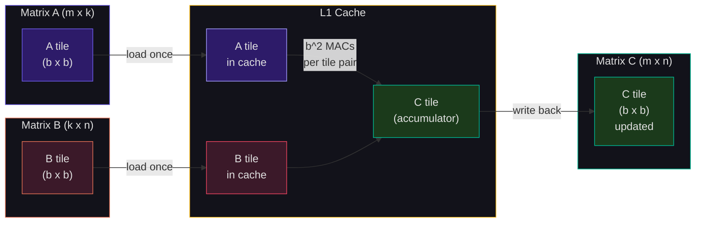
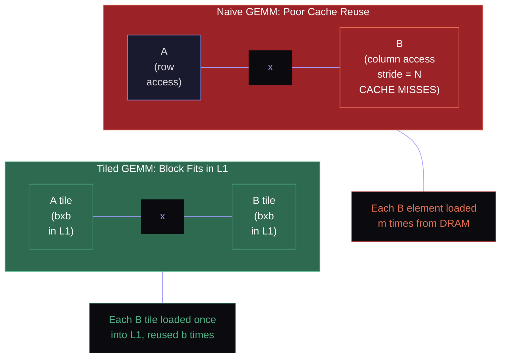
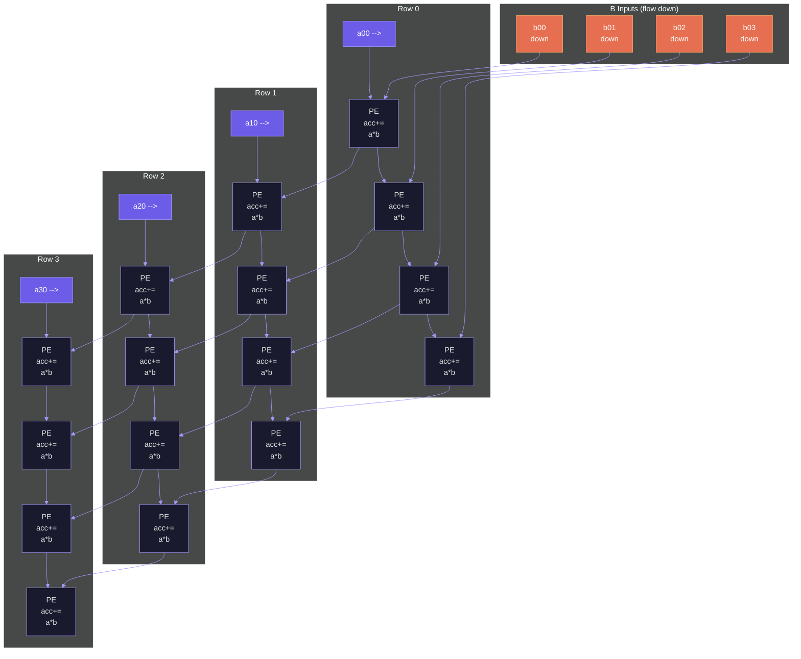
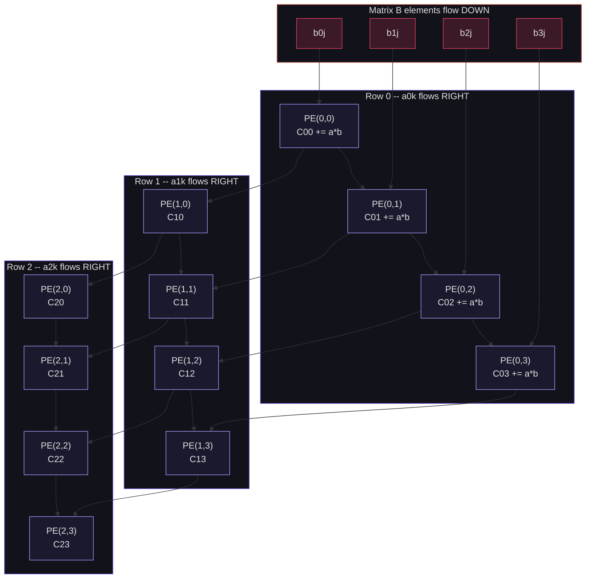
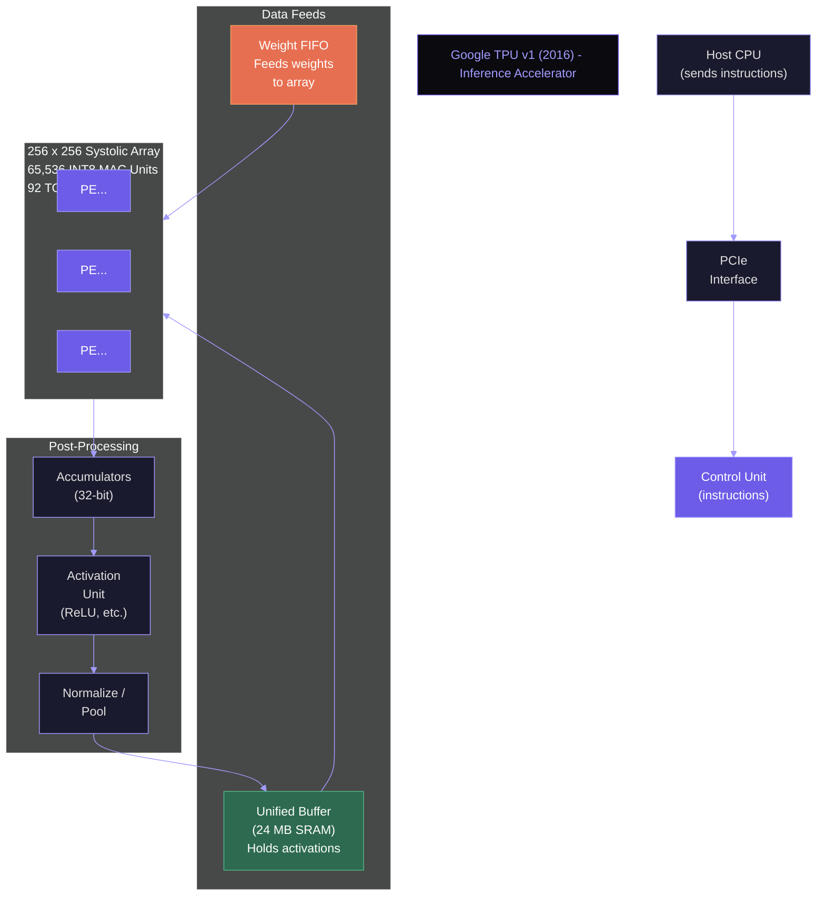
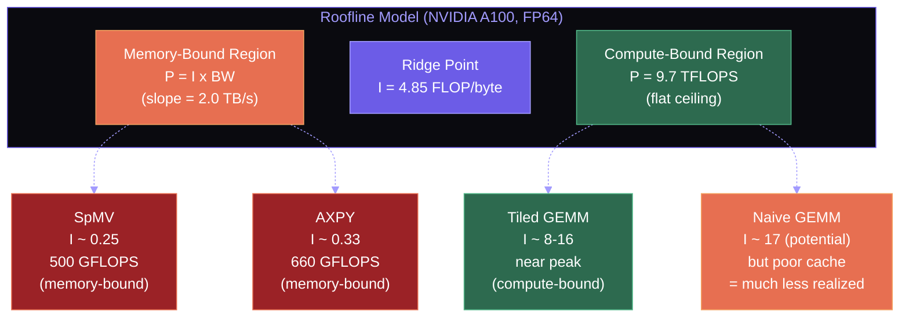

## Matrix Multiply: The Most Important Operation in Computing

If you had to choose a single computational kernel as the most important in all of computing, it would be **matrix multiplication**. Neural network training and inference are dominated by matrix multiplies (the forward and backward passes through dense layers). Physics simulations solve systems of linear equations via matrix factorization. Computer graphics transform vertices with 4x4 matrix multiplies. Financial models price portfolios using covariance matrix operations. Search engines compute PageRank via matrix-vector products.

The reason matrix multiplication is so important is not just its ubiquity but its **arithmetic intensity** --- the ratio of computation to data movement. This property, unique among common operations, makes matrix multiplication the ideal workload for modern hardware where compute is cheap but memory bandwidth is scarce.

### The Naive Algorithm

The standard matrix multiplication $C = A \times B$, where $A$ is $m \times k$ and $B$ is $k \times n$, produces an $m \times n$ matrix $C$:

$$C_{ij} = \sum_{p=0}^{k-1} A_{ip} \cdot B_{pj}$$

The naive implementation uses three nested loops:

```python
import numpy as np

def naive_matmul(A, B):
    """Naive O(n^3) matrix multiplication."""
    m, k = A.shape
    k2, n = B.shape
    assert k == k2, "Incompatible dimensions"
    C = np.zeros((m, n))
    for i in range(m):
        for j in range(n):
            for p in range(k):
                C[i, j] += A[i, p] * B[p, j]
    return C
```

For square $n \times n$ matrices, this performs exactly $2n^3$ floating-point operations ($n^3$ multiplies and $n^3$ additions) and accesses $3n^2$ data elements ($n^2$ each for A, B, and C). The **arithmetic intensity** --- FLOPs per byte of data moved --- is therefore:

$$I_{naive} = \frac{2n^3}{3n^2 \times 4} = \frac{n}{6} \quad \text{(for 32-bit floats)}$$

For $n = 1000$, the arithmetic intensity is approximately 167 FLOP/byte. This is extraordinarily high compared to most operations (vector addition has intensity 0.33 FLOP/byte). But the naive implementation fails to realize this potential because of **cache behavior**: the inner loop accesses column $j$ of matrix $B$, striding through memory with a step of $n$ elements. For large matrices, each access to $B_{pj}$ is a cache miss.

<ConceptCheck id="cc-1" />

---

## BLAS: The Standard Interface for Linear Algebra

The **Basic Linear Algebra Subprograms (BLAS)** define a standard interface for common linear algebra operations, organized into three levels:

| Level | Operation Type | Example | FLOPs | Data | Intensity |
|-------|---------------|---------|-------|------|-----------|
| 1 | Vector-vector | $\alpha \cdot \mathbf{x} + \mathbf{y}$ (AXPY) | $2n$ | $3n$ | $O(1)$ |
| 2 | Matrix-vector | $A\mathbf{x} + \mathbf{y}$ (GEMV) | $2n^2$ | $n^2 + 2n$ | $O(1)$ |
| 3 | Matrix-matrix | $\alpha AB + \beta C$ (GEMM) | $2n^3$ | $3n^2$ | $O(n)$ |

The following diagram compares the three BLAS levels, highlighting how arithmetic intensity scales differently for each:

```mermaid
flowchart LR
    subgraph L1["BLAS Level 1: Vector-Vector"]
        direction TB
        L1D["AXPY: y = ax + y"]
        L1M["FLOPs: O(n) | Data: O(n)\nIntensity: O(1)"]
    end

    subgraph L2["BLAS Level 2: Matrix-Vector"]
        direction TB
        L2D["GEMV: y = Ax + y"]
        L2M["FLOPs: O(n^2) | Data: O(n^2)\nIntensity: O(1)"]
    end

    subgraph L3["BLAS Level 3: Matrix-Matrix"]
        direction TB
        L3D["GEMM: C = aAB + bC"]
        L3M["FLOPs: O(n^3) | Data: O(n^2)\nIntensity: O(n) -- grows with n!"]
    end

    L1 -->|"more data reuse"| L2 -->|"intensity grows with n"| L3

    style L1 fill:#1a1a2e,stroke:#636e72,color:#e0e0e0
    style L2 fill:#1a1a2e,stroke:#a29bfe,color:#e0e0e0
    style L3 fill:#1a1a2e,stroke:#6c5ce7,color:#e0e0e0
    style L1D fill:#2d2d4a,stroke:#636e72,color:#e0e0e0
    style L1M fill:#2d2d4a,stroke:#636e72,color:#e0e0e0
    style L2D fill:#2d1b69,stroke:#a29bfe,color:#e0e0e0
    style L2M fill:#2d1b69,stroke:#a29bfe,color:#e0e0e0
    style L3D fill:#6c5ce7,stroke:#a29bfe,color:#fff
    style L3M fill:#6c5ce7,stroke:#a29bfe,color:#fff
```



Level 3 operations are special: their arithmetic intensity grows with $n$. This means for sufficiently large matrices, the computation is **compute-bound** --- limited by FLOP throughput, not memory bandwidth. This is the regime where hardware achieves peak performance.

**GEMM** (General Matrix Multiply) is the king of BLAS Level 3:

$$C \leftarrow \alpha \cdot A \times B + \beta \cdot C$$

Libraries like Intel MKL, OpenBLAS, NVIDIA cuBLAS, and Apple Accelerate implement GEMM with extraordinary optimization: on an NVIDIA H100 SXM, cuBLAS achieves 1,500--1,700 TFLOPS for FP16 GEMM, which is 80--85% of the 1,979 TFLOPS peak. On the H100 with FP8 Tensor Cores, cuBLAS reaches 3,200--3,500 TFLOPS. Understanding *how* these libraries achieve such efficiency is essential for any computer architect. The matrix optimization techniques covered here appear directly in Project 4.

---

## Tiled (Blocked) GEMM: The Key Optimization

The naive implementation's cache behavior is poor because the inner loop accesses column elements of $B$ with stride $n$. **Tiling** (also called **blocking**) restructures the computation to reuse data that fits in cache, dramatically improving performance.

### The Tiling Idea

Instead of computing $C$ one element at a time, we decompose $A$, $B$, and $C$ into $b \times b$ sub-matrices (tiles), where $b$ is chosen so that three tiles ($A_{tile}$, $B_{tile}$, $C_{tile}$) fit in L1 cache:

$$3b^2 \times 4 \text{ bytes} \leq L1 \text{ cache size}$$

For a 48 KB L1 cache (Intel Raptor Lake P-core L1D), this gives $b \leq \sqrt{48 \times 1024 / 12} \approx 64$. In practice, $b = 32$ or $b = 64$ are common choices.

The diagram below shows how tiled GEMM decomposes matrices A, B, and C into cache-sized tiles. Each tile multiplication reuses data in L1 cache before moving to the next tile:



The tiled algorithm uses **six** nested loops instead of three:

```python
def tiled_matmul(A, B, tile_size=32):
    """Tiled matrix multiplication for better cache behavior.

    Outer three loops iterate over tiles.
    Inner three loops compute the tile-level multiplication.
    """
    m, k = A.shape
    k2, n = B.shape
    C = np.zeros((m, n))
    b = tile_size

    # Outer loops: iterate over tiles
    for i0 in range(0, m, b):
        for j0 in range(0, n, b):
            for p0 in range(0, k, b):
                # Inner loops: multiply tiles
                i_end = min(i0 + b, m)
                j_end = min(j0 + b, n)
                p_end = min(p0 + b, k)
                for i in range(i0, i_end):
                    for j in range(j0, j_end):
                        for p in range(p0, p_end):
                            C[i, j] += A[i, p] * B[p, j]
    return C
```

The following diagram contrasts the memory access patterns of naive and tiled GEMM. The naive algorithm streams through entire columns of B with poor locality, while tiled GEMM loads small blocks that fit in L1 cache and reuses them fully before moving on.



### Why Tiling Works: Data Reuse Analysis

In the naive algorithm, each element of $B$ is loaded from memory $m$ times (once for each row of $A$). The total data movement from DRAM for $B$ alone is $m \times n \times k / n = m \times k$ elements, multiplied by the cache miss rate.

In the tiled algorithm, a $b \times b$ tile of $B$ is loaded into cache once and reused across all $b$ rows of the current $A$ tile. The total data movement for $B$ drops by a factor of $b$:

$$\text{Naive data movement for } B: m \cdot k \quad \text{(each element loaded m times)}$$
$$\text{Tiled data movement for } B: \frac{m \cdot k}{b} \quad \text{(each element loaded m/b times)}$$

The arithmetic intensity improvement is proportional to the tile size:

$$I_{tiled} \approx \frac{b}{6} \cdot I_{naive} = \frac{b \cdot n}{36}$$

For $b = 32$ and $n = 1000$, the tiled version has approximately 32x better data reuse than the naive version. This is the fundamental reason tiling transforms matrix multiplication from a memory-bound operation to a compute-bound one.

### Full Derivation of Arithmetic Intensity

For the tiled algorithm with tile size $b$ on square $n \times n$ matrices:

- Total FLOPs: $2n^3$ (unchanged from naive)
- Data loaded from DRAM: Each tile of $A$ ($b \times b$ elements) is loaded $n/b$ times (once for each column tile of $B$). Total for $A$: $\frac{n}{b} \times \frac{n}{b} \times b^2 \times \frac{n}{b} = \frac{n^3}{b}$. Similarly for $B$: $\frac{n^3}{b}$. Matrix $C$ is loaded and stored once: $2n^2$.

$$I_{tiled} = \frac{2n^3}{\left(\frac{2n^3}{b} + 2n^2\right) \times 4} \approx \frac{b}{4} \quad \text{(for large } n \text{)}$$

With $b = 64$, the arithmetic intensity is approximately 16 FLOP/byte. Recall from the roofline model that the NVIDIA A100's ridge point is 4.85 FLOP/byte (FP64). With intensity 16, tiled GEMM is firmly in the compute-bound regime, allowing the hardware to approach peak throughput.

<ConceptCheck id="cc-2" />

---

## Advanced GEMM Optimizations

Production BLAS libraries apply several additional techniques on top of tiling.

### Register Tiling

Within each tile, the innermost loop accumulates partial products. If these accumulators reside in **registers** rather than L1 cache, each multiply-accumulate costs 1 cycle instead of 3--5 cycles (L1 latency). **Register tiling** decomposes the tile computation into a micro-kernel that keeps a small $m_r \times n_r$ block of $C$ in registers throughout the inner loop.

Typical micro-kernel sizes: $m_r = 6, n_r = 16$ for AVX-512 (6 rows $\times$ 16 floats per ZMM register = 6 ZMM registers for $C$, plus registers for $A$ and $B$ tiles). The micro-kernel is the innermost, most performance-critical code, often hand-written in assembly.

### SIMD Within Tiles

The inner loop of the micro-kernel is vectorized with SIMD instructions. Each iteration loads a column of the $A$ micro-tile and broadcasts each element to all lanes, then multiplies with a row of $B$ loaded into a full SIMD register. With AVX-512 (16 floats per register), the inner loop performs 16 fused multiply-add operations per cycle per execution unit.

$$\text{FMAs per cycle (AVX-512, 2 FMA units)} = 2 \times 16 = 32 \text{ FP32 FMAs} = 64 \text{ FLOPs}$$

At 3.0 GHz, this is $64 \times 3 \times 10^9 = 192$ GFLOPS per core. An 8-core processor achieves 1.54 TFLOPS of FP32 throughput from SIMD alone.

### Software Pipelining

The micro-kernel must hide memory latency by overlapping loads with computation. **Software pipelining** issues the load for iteration $i+1$ before starting the computation for iteration $i$. The processor's out-of-order engine and prefetch hardware assist, but explicit prefetch instructions (`_mm_prefetch` on x86) are often needed for optimal performance.

---

## Strassen's Algorithm: Fewer Multiplications

The naive matrix multiplication requires 8 multiplications to multiply two $2 \times 2$ matrices. In 1969, Volker Strassen discovered that **7 multiplications** suffice, at the cost of more additions.

### The $2 \times 2$ Case

To compute $C = A \times B$ where:

$$A = \begin{pmatrix} a_{11} & a_{12} \\ a_{21} & a_{22} \end{pmatrix}, \quad B = \begin{pmatrix} b_{11} & b_{12} \\ b_{21} & b_{22} \end{pmatrix}$$

Strassen defines 7 products:

$$\begin{align}
M_1 &= (a_{11} + a_{22})(b_{11} + b_{22}) \\
M_2 &= (a_{21} + a_{22}) \cdot b_{11} \\
M_3 &= a_{11} \cdot (b_{12} - b_{22}) \\
M_4 &= a_{22} \cdot (b_{21} - b_{11}) \\
M_5 &= (a_{11} + a_{12}) \cdot b_{22} \\
M_6 &= (a_{21} - a_{11})(b_{11} + b_{12}) \\
M_7 &= (a_{12} - a_{22})(b_{21} + b_{22})
\end{align}$$

Then:

$$C = \begin{pmatrix} M_1 + M_4 - M_5 + M_7 & M_3 + M_5 \\ M_2 + M_4 & M_1 - M_2 + M_3 + M_6 \end{pmatrix}$$

### Recursive Application

Applied recursively to $n \times n$ matrices by partitioning into $n/2 \times n/2$ sub-matrices, Strassen's algorithm performs 7 multiplications of half-sized matrices at each level:

$$T(n) = 7 \cdot T(n/2) + O(n^2)$$

By the Master Theorem, this gives $T(n) = O(n^{\log_2 7}) = O(n^{2.807})$, compared to $O(n^3)$ for the naive algorithm.

```python
def strassen(A, B):
    """Strassen's matrix multiplication: O(n^2.807)."""
    n = A.shape[0]
    if n <= 64:  # Base case: use naive for small matrices
        return A @ B

    mid = n // 2
    # Partition into quadrants
    A11, A12 = A[:mid, :mid], A[:mid, mid:]
    A21, A22 = A[mid:, :mid], A[mid:, mid:]
    B11, B12 = B[:mid, :mid], B[:mid, mid:]
    B21, B22 = B[mid:, :mid], B[mid:, mid:]

    # 7 recursive multiplications (instead of 8)
    M1 = strassen(A11 + A22, B11 + B22)
    M2 = strassen(A21 + A22, B11)
    M3 = strassen(A11, B12 - B22)
    M4 = strassen(A22, B21 - B11)
    M5 = strassen(A11 + A12, B22)
    M6 = strassen(A21 - A11, B11 + B12)
    M7 = strassen(A12 - A22, B21 + B22)

    # Combine
    C = np.zeros_like(A)
    C[:mid, :mid] = M1 + M4 - M5 + M7
    C[:mid, mid:] = M3 + M5
    C[mid:, :mid] = M2 + M4
    C[mid:, mid:] = M1 - M2 + M3 + M6
    return C
```

### Practical Considerations

Despite its better asymptotic complexity, Strassen's algorithm is **rarely used in practice** for several reasons:

1. **Numerical stability**: The additions and subtractions introduce cancellation errors. For matrices with large condition numbers, Strassen can lose significant precision.
2. **Cache behavior**: The recursive decomposition creates many temporary matrices, increasing memory usage and hurting cache performance. The naive algorithm with tiling has better cache behavior for practical matrix sizes.
3. **Crossover point**: The constant factors in Strassen are high enough that it only becomes faster than optimized naive for very large matrices ($n > 1000$ to $n > 4000$, depending on the implementation and hardware).
4. **SIMD inefficiency**: The irregular access patterns in Strassen's additions/subtractions are difficult to vectorize efficiently.

Production BLAS libraries typically use Strassen only for very large matrices (if at all), switching to tiled conventional GEMM below the crossover point. Most deep learning workloads involve matrices small enough that Strassen provides no benefit.

<ConceptCheck id="cc-3" />

---

## Systolic Arrays: Hardware for Matrix Multiplication

A **systolic array** is a grid of simple processing elements (PEs) connected in a regular pattern, where data flows through the array in waves --- like blood pulsing through the body's circulatory system (hence "systolic," from the Greek *systole*, contraction). Systolic arrays are the most efficient hardware architecture for matrix multiplication because they maximize data reuse while minimizing memory bandwidth.

### Architecture

The following diagram shows a 4x4 systolic array. Matrix A elements flow left-to-right along rows, and matrix B elements flow top-to-bottom along columns. Each processing element (PE) performs a multiply-accumulate operation, and the accumulated result becomes one element of the output matrix C.



A systolic array for matrix multiplication consists of a 2D grid of PEs, each performing a single operation: **multiply-accumulate (MAC)**:

$$\text{accumulator} \leftarrow \text{accumulator} + a \times b$$

Data flows through the array in two directions:
- Elements of matrix $A$ flow **left to right** along rows.
- Elements of matrix $B$ flow **top to bottom** along columns.
- Each PE accumulates its partial sum, which eventually contains one element of the result matrix $C$.

The following diagram shows the systolic array data flow for a 4x4 matrix multiply. A elements flow rightward, B elements flow downward, and each PE accumulates one element of C:



```
        b00  b01  b02  b03     (B elements flow down)
         |    |    |    |
a00 --> PE -- PE -- PE -- PE   --> (A elements flow right)
a10 --> PE -- PE -- PE -- PE
a20 --> PE -- PE -- PE -- PE
a30 --> PE -- PE -- PE -- PE
```

### Data Flow for a 4x4 Matrix Multiply

Consider multiplying two $4 \times 4$ matrices on a $4 \times 4$ systolic array. The data is fed in with a **skew**: row $i$ of $A$ is delayed by $i$ cycles, and column $j$ of $B$ is delayed by $j$ cycles. This ensures each PE receives the correct pair of elements at the correct time.

At cycle $t$, $PE_{ij}$ receives $A_{i, t-i}$ from the left and $B_{t-j, j}$ from above, computes $C_{ij} \mathrel{+}= A_{i, t-i} \times B_{t-j, j}$, and passes both inputs to the next PE.

The computation completes in $2n - 1 = 7$ cycles for a $4 \times 4$ multiply. The total useful work is $4 \times 4 \times 4 = 64$ MACs. With 16 PEs and 7 cycles, the utilization is:

$$\text{Utilization} = \frac{64 \text{ MACs}}{16 \text{ PEs} \times 7 \text{ cycles}} = \frac{64}{112} = 57\%$$

For larger matrices ($n \gg$ array size), utilization approaches 100% because the startup and drain phases (where not all PEs are active) become negligible relative to the steady-state phase.

### Google TPU: Systolic Arrays at Scale

The following diagram shows the Google TPU v1 architecture. The core of the design is the massive 256x256 systolic array of 8-bit MAC units, fed by a unified buffer and weight FIFO. The systolic array performs the matrix multiply, while activation functions are applied by a separate unit after the array output.



Google's Tensor Processing Unit (TPU) is the most prominent commercial deployment of systolic arrays. The original TPU v1 (2016) contained a $256 \times 256$ systolic array of 8-bit integer MAC units, achieving 92 TOPS for inference. TPU v4 (2022) scales to multiple such arrays with BF16/FP32 support.

The NVIDIA H100's Tensor Cores are conceptually similar: each Tensor Core performs a $4 \times 4$ matrix multiply-accumulate per clock cycle (with various precision modes: FP8, FP16, BF16, TF32, FP64). With 528 Tensor Cores across 132 SMs, the H100 SXM achieves:

| Precision | Peak TFLOPS | With 2:4 Sparsity |
|-----------|------------|-------------------|
| FP64 | 60 | --- |
| TF32 | 989 | ~1,979 |
| FP16/BF16 | 1,979 | ~3,958 |
| FP8 | 3,958 | ~7,916 |

The Blackwell B200 (2024) pushes further with 5th-generation Tensor Cores supporting FP4 precision: 9 PFLOPS dense, 18 PFLOPS with 2:4 structured sparsity. Each B200 Tensor Core operates on larger tile sizes, and the dual-die design connects two reticle-limited dies via a 10 TB/s NV-HBI interconnect, appearing as a single logical GPU to software.

The cuBLAS library achieves 80--88% of peak Tensor Core throughput for large GEMM operations. On the H100 SXM, cuBLAS delivers approximately 1,500--1,700 TFLOPS for FP16 GEMM and 3,200--3,500 TFLOPS for FP8 GEMM. This extraordinary efficiency comes from careful tiling to match the Tensor Core tile sizes, double-buffering of shared memory to overlap loads with computation, and asynchronous copy instructions (`cp.async`) that bypass the register file.

<ConceptCheck id="cc-4" />

---

## The Roofline Model Applied to Matrix Multiplication

The roofline model, introduced by Williams, Waterman, and Patterson (2009), provides a visual framework for understanding whether a kernel is compute-bound or memory-bound. The attainable performance $P$ for a kernel with arithmetic intensity $I$ is:

$$P \leq \min(\Pi_{peak}, I \times \beta_{peak})$$

where $\Pi_{peak}$ is peak compute throughput and $\beta_{peak}$ is peak memory bandwidth.

For the NVIDIA A100 (FP64):
- $\Pi_{peak} = 9.7$ TFLOP/s
- $\beta_{peak} = 2.0$ TB/s (HBM2e)
- Ridge point: $I_{ridge} = 9.7 / 2.0 = 4.85$ FLOP/byte

The following diagram shows the roofline model with various GEMM implementations positioned. The sloped portion represents memory-bound workloads (limited by bandwidth), and the flat portion represents compute-bound workloads (limited by peak FLOPS). Tiled GEMM sits firmly in the compute-bound regime.



Matrix multiplication variants and their positions on the roofline:

| Variant | Arithmetic Intensity | Regime | Achievable |
|---------|---------------------|--------|------------|
| Naive ($n = 100$) | ~17 FLOP/byte | Compute-bound | Up to $\Pi_{peak}$, but poor cache $\Rightarrow$ much less |
| Tiled ($b = 32, n = 1000$) | ~8 FLOP/byte | Compute-bound | Near $\Pi_{peak}$ |
| Tiled ($b = 64, n = 4000$) | ~16 FLOP/byte | Compute-bound | Near $\Pi_{peak}$ |
| SpMV (sparse matrix-vector) | ~0.25 FLOP/byte | Memory-bound | $0.25 \times 2.0 = 500$ GFLOP/s |

The critical insight: even the naive algorithm has high arithmetic intensity for large matrices. The problem is not intensity but **realized** data reuse. The naive algorithm has *potential* for high intensity but *actual* poor cache behavior causes many more memory accesses than necessary. Tiling converts potential intensity into realized intensity by ensuring data in cache is fully reused before being evicted.

---

## Connecting to the Big Picture

The techniques in this lecture form a hierarchy that maps directly to hardware:

1. **Tiling** matches the cache hierarchy: tile sizes are chosen to fit L1, L2, and L3 caches.
2. **Register tiling** matches the register file: the micro-kernel keeps a small block of $C$ in registers.
3. **SIMD** matches the execution units: the inner loop uses AVX-512 or NEON to process multiple elements per instruction.
4. **Systolic arrays/Tensor Cores** match the trend toward specialized matrix hardware: when general-purpose cores are not enough, build dedicated units.

This progression --- from software optimization (tiling) through ISA features (SIMD) to dedicated hardware (systolic arrays) --- illustrates a fundamental principle of computer architecture: when a computation is important enough and regular enough, it migrates from software to hardware for maximum efficiency.

The matrix optimization techniques discussed here --- tiling for cache reuse, register blocking, SIMD vectorization, and systolic array data flow --- appear directly in Project 4, where you will build a GPU kernel simulator that measures these effects.

---

## Summary

Matrix multiplication is the most important computational kernel because its $O(n)$ arithmetic intensity (unique among common operations) makes it compute-bound for large matrices. BLAS Level 3 operations, especially GEMM, exploit this intensity. Tiled GEMM restructures the naive three-loop algorithm into six loops, keeping tiles in cache and improving data reuse by a factor of the tile size $b$. Advanced optimizations include register tiling (accumulating in registers), SIMD vectorization (processing multiple elements per instruction), and software pipelining (overlapping loads with compute). Strassen's algorithm reduces the exponent from 3 to 2.807 but is rarely used in practice due to numerical instability and cache unfriendliness. Systolic arrays provide the ultimate hardware specialization for matrix multiply: a regular grid of multiply-accumulate units where data flows in waves, achieving near-peak utilization for large matrices. Google's TPU and NVIDIA's Tensor Cores are commercial implementations of this concept. On the H100, cuBLAS achieves 80--88% of peak Tensor Core throughput for FP16 and FP8 GEMM, reaching 1,500--3,500 TFLOPS depending on precision.
