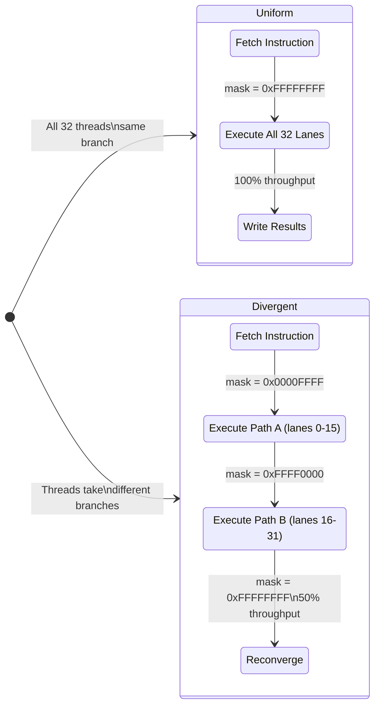

# GPU Hardware: Streaming Multiprocessors and SIMT

Everything you have learned so far about processor design -- pipelining, out-of-order execution, branch prediction, caches -- was engineered to make one thread of execution run as fast as possible. The GPU takes the opposite approach: it sacrifices single-thread performance to make *thousands* of threads run simultaneously. This lecture dissects the hardware that makes that possible, from the fundamental building block (the Streaming Multiprocessor) to the execution model (SIMT) that keeps thousands of threads in lockstep.

## CPU vs GPU: Two Philosophies of Silicon

A modern CPU and a modern GPU contain roughly the same number of transistors. The NVIDIA H100 packs 80 billion transistors on an 814 mm² die. An AMD EPYC 9004 series server CPU has around 90 billion transistors. Yet these two chips solve fundamentally different problems because they allocate their transistor budgets in opposite ways.

### The CPU: Latency-Oriented Design

The CPU is engineered to minimize the time from when a single instruction enters the pipeline to when its result is available. To achieve this, CPUs invest transistors in:

- **Deep, sophisticated pipelines**: 15-25 stages with out-of-order execution windows of 300+ instructions (Apple M4: 600+ instruction window).
- **Massive branch predictors**: TAGE predictors with 97%+ accuracy, consuming millions of transistors.
- **Large caches**: Apple M4 has 192 KB L1 per core, 32 MB L2, and 48 MB shared L3. Intel Xeon processors allocate up to 320 MB of L3 cache.
- **Few powerful cores**: 8-128 cores, each capable of independent, complex control flow.

The result: a single CPU core can execute a complex, branch-heavy program with irregular memory access patterns at near-theoretical speed. But the total number of arithmetic operations per second is modest -- an AMD EPYC 9654 with 96 cores achieves roughly 4.6 TFLOPS of FP64.

### The GPU: Throughput-Oriented Design

The GPU asks a different question: *how many total floating-point operations can we complete per second, regardless of how long each individual operation takes?* The answer is to strip away everything that makes a single thread fast and use those transistors for more execution units:

- **Simple control logic**: No branch prediction, no speculative execution, no out-of-order scheduling (within a thread). If a thread stalls on memory, the GPU simply switches to another thread -- latency is hidden through massive parallelism, not prediction.
- **Tiny caches per thread**: Where a CPU core might have 64 KB of L1 data cache for 2 threads, a GPU SM has 256 KB of L1/shared memory split among up to 2,048 threads.
- **Thousands of execution units**: The NVIDIA H100 SXM5 has 16,896 FP32 CUDA cores across 132 SMs. The B200 pushes this to 20,480 CUDA cores across 148 SMs.
- **Massive memory bandwidth**: The H100 SXM5 delivers 3.35 TB/s of HBM3 bandwidth, compared to roughly 400 GB/s for a high-end server CPU's DDR5.

The H100's peak FP32 throughput is 60 TFLOPS from CUDA cores alone. With 4th-generation Tensor Cores operating at FP16 precision, it reaches 1,979 TFLOPS -- over 400x the throughput of a top-end CPU.

### Transistor Budget Comparison

Consider how each design allocates its transistor budget:

```mermaid
flowchart LR
    subgraph CPU["CPU Transistor Budget"]
        direction TB
        A1["Arithmetic/Execution ~10%"]
        A2["Control Logic (OoO, Branch Pred) ~25%"]
        A3["Caches (L1/L2/L3) ~50%"]
        A4["Interconnect & I/O ~15%"]
        A1 ~~~ A2 ~~~ A3 ~~~ A4
    end
    subgraph GPU["GPU Transistor Budget"]
        direction TB
        B1["Arithmetic/Execution ~50%"]
        B2["Control Logic ~5%"]
        B3["Caches ~20%"]
        B4["Interconnect & I/O ~25%"]
        B1 ~~~ B2 ~~~ B3 ~~~ B4
    end
    CPU ~~~ GPU
    style A1 fill:#2d4a2d,stroke:#4ade80
    style A2 fill:#4a2d2d,stroke:#f87171
    style A3 fill:#4a3d2d,stroke:#fbbf24
    style A4 fill:#2d3a4a,stroke:#60a5fa
    style B1 fill:#2d4a2d,stroke:#4ade80
    style B2 fill:#4a2d2d,stroke:#f87171
    style B3 fill:#4a3d2d,stroke:#fbbf24
    style B4 fill:#2d3a4a,stroke:#60a5fa
    style CPU fill:#1a1a2e,stroke:#6c5ce7,color:#e0e0e0
    style GPU fill:#1a1a2e,stroke:#6c5ce7,color:#e0e0e0
```



The CPU devotes 75% of its transistors to control logic and caches, optimizing single-thread latency. The GPU invests 50% in raw compute, sacrificing per-thread performance for aggregate throughput.

| Component | CPU (approx.) | GPU (approx.) |
|---|---|---|
| Arithmetic/execution units | ~10% | ~50% |
| Control logic (OoO, prediction) | ~25% | ~5% |
| Caches | ~50% | ~20% |
| On-chip interconnect | ~10% | ~15% |
| Other (I/O, memory controllers) | ~5% | ~10% |

The CPU spends roughly 75% of its transistors on control logic and caches to make a handful of threads run fast. The GPU spends 50% on raw compute, accepting higher per-thread latency in exchange for aggregate throughput that is orders of magnitude higher.

This is not a matter of one being "better" -- it is a matter of workload. A database query with unpredictable branches and pointer-chasing data structures runs terribly on a GPU. A matrix multiplication with perfectly regular access patterns and no control flow runs terribly on a CPU (relative to what the silicon could achieve). The art of heterogeneous computing is knowing which workload goes where.

<ConceptCheck id="cc-1" />

## The Streaming Multiprocessor: The GPU's Fundamental Building Block

Where a CPU is organized around independent cores, a GPU is organized around **Streaming Multiprocessors** (SMs). Every NVIDIA GPU since Tesla (2006) has used the SM as its fundamental compute unit. Understanding the SM is understanding the GPU.

### SM Internal Architecture (Hopper / H100)

Each SM in the H100 (compute capability 9.0) contains:

| Component | Count per SM | Function |
|---|---|---|
| FP32 CUDA Cores | 128 | Single-precision floating-point and integer |
| FP64 Units | 64 | Double-precision (1:2 ratio with FP32) |
| Tensor Cores | 4 (4th gen) | Matrix multiply-accumulate (FP8/FP16/TF32/FP64) |
| LD/ST Units | 32 | Load/store operations to memory |
| SFU (Special Function Units) | 16 | sin, cos, exp, rsqrt |
| Warp Schedulers | 4 | Issue instructions to warps |
| Dispatch Units | 4 | Dispatch operations to pipelines |
| Register File | 65,536 x 32-bit | Per-SM register bank |
| Shared Memory / L1 Cache | 256 KB (configurable split) | User-managed scratchpad + hardware cache |

The H100 SXM5 has **132 enabled SMs** (out of 144 on the full GH100 die -- 12 are disabled for yield). This gives:

$$\text{Total CUDA Cores} = 132 \times 128 = 16{,}896$$

$$\text{Total Tensor Cores} = 132 \times 4 = 528$$

```mermaid
flowchart TD
    subgraph SM["Streaming Multiprocessor (SM) -- H100"]
        subgraph exec["Execution Units"]
            direction LR
            C1["128 FP32\nCUDA Cores"]
            C2["64 FP64\nUnits"]
            C3["4 Tensor\nCores (4th Gen)"]
            C4["16 SFU\nsin/cos/exp"]
        end
        subgraph mem["Memory & Load/Store"]
            direction LR
            M1["32 LD/ST\nUnits"]
            M2["65,536 x 32-bit\nRegister File"]
            M3["256 KB Shared\nMemory / L1 Cache"]
        end
        subgraph ctrl["Control"]
            direction LR
            S1["4 Warp\nSchedulers"]
            S2["4 Dispatch\nUnits"]
        end
        exec ~~~ mem ~~~ ctrl
    end
    style SM fill:#12121a,stroke:#6c5ce7,color:#e0e0e0
    style exec fill:#1a1a2e,stroke:#a29bfe,color:#e0e0e0
    style mem fill:#1a2a1a,stroke:#4ade80,color:#e0e0e0
    style ctrl fill:#2a1a1a,stroke:#fbbf24,color:#e0e0e0
    style C1 fill:#2d2d4a,stroke:#818cf8
    style C2 fill:#2d2d4a,stroke:#818cf8
    style C3 fill:#4a2d4a,stroke:#c084fc
    style C4 fill:#2d2d4a,stroke:#818cf8
    style M1 fill:#2d4a2d,stroke:#4ade80
    style M2 fill:#2d4a2d,stroke:#4ade80
    style M3 fill:#2d4a2d,stroke:#4ade80
    style S1 fill:#4a3d2d,stroke:#fbbf24
    style S2 fill:#4a3d2d,stroke:#fbbf24
```



Each SM operates independently: it fetches instructions, schedules warps, and accesses its own register file and shared memory without coordinating with other SMs. This is what makes GPUs scale -- adding more SMs adds proportionally more compute, with no inter-SM communication overhead for embarrassingly parallel workloads.

### From SM to Full GPU: The Hierarchy

SMs are grouped into **Graphics Processing Clusters** (GPCs). On the H100, each GPC contains multiple SMs and shares some resources (raster engines for graphics, though these are irrelevant for compute workloads). The full GH100 die has 8 GPCs.

Above the GPC level, all SMs share:
- **L2 Cache**: 50 MB, accessible by all SMs with roughly 200-cycle latency
- **Memory Controllers**: Connecting to 80 GB of HBM3 via a 5120-bit bus
- **NVLink Interfaces**: 18 NVLink 4.0 links providing 900 GB/s total bidirectional bandwidth to other GPUs
- **PCIe Interface**: Gen5 x16 for CPU-GPU communication

### The Blackwell Generation (B200)

The B200 (compute capability 10.0) represents a radical architectural leap: a **dual-die design**. Two reticle-limited dies are connected by a 10 TB/s NV-HBI (NVIDIA High Bandwidth Interface), appearing as a single logical GPU to software. Key specs:

| Specification | B200 |
|---|---|
| Transistor Count | 208 billion (across both dies) |
| SMs (enabled) | 148 (74 per die) |
| CUDA Cores (FP32) | 20,480 (128 per SM) |
| Tensor Cores | 528 (5th gen) |
| FP4 Dense / Sparse | 9 / 18 PFLOPS |
| FP8 Dense / Sparse | 4.5 / 9 PFLOPS |
| Memory | 192 GB HBM3e, 8 TB/s bandwidth |
| NVLink 5.0 | 1.8 TB/s (18 links x 100 GB/s) |
| TDP | 1000 W (liquid cooled) |

The B200 delivers 2.2x faster Llama 2 70B fine-tuning compared to H100, and tasks requiring 256 Hopper GPUs can run on just 64 Blackwell GPUs.

<ConceptCheck id="cc-2" />

## SIMT: Single Instruction, Multiple Threads

CPUs use SIMD (Single Instruction, Multiple Data) extensions like AVX-512, where a single instruction operates on a fixed-width vector register. The GPU uses a related but distinct model called **SIMT** (Single Instruction, Multiple Threads). The difference is subtle but has profound implications for programmability.

### The Warp: 32 Threads in Lockstep

The fundamental unit of execution on an NVIDIA GPU is the **warp**: a group of exactly 32 threads that execute the same instruction at the same time. The warp size has been 32 on every NVIDIA architecture since the original Tesla (2006), and it is unlikely to change.

When a block of threads is launched on an SM, the hardware partitions it into warps:

$$\text{warp\_id} = \left\lfloor \frac{\text{threadIdx.x}}{32} \right\rfloor$$

$$\text{lane\_id} = \text{threadIdx.x} \bmod 32$$

A block of 256 threads becomes 8 warps. Each SM has 4 warp schedulers, and each scheduler can issue an instruction to one warp per cycle. With 132 SMs on the H100, the chip can have thousands of warps in flight simultaneously.

### Why SIMT is Not Just SIMD

In CPU SIMD, the programmer explicitly writes vector operations: `_mm256_add_ps(a, b)` adds 8 floats. The programming model is data-parallel at the instruction level.

In GPU SIMT, the programmer writes **scalar code** -- code for a single thread -- and the hardware implicitly executes it across 32 threads:

```python
# This looks like scalar code for ONE thread
def gpu_kernel(thread_id, data, result):
    x = data[thread_id]
    y = x * x + 2.0 * x + 1.0
    result[thread_id] = y
```

The hardware takes this scalar program and runs it on 32 threads simultaneously, each with a different `thread_id`. The programmer never writes vector intrinsics. This is why CUDA is dramatically easier to program than hand-vectorized SIMD code.

The key SIMT advantage: threads within a warp can follow **different control flow paths**. In SIMD, an `if` statement cannot be expressed at all without masking. In SIMT, threads can diverge -- at a performance cost.

The following diagram shows how a warp of 32 threads executes. When all threads follow the same path, full throughput is achieved. When threads diverge, the hardware serializes execution using an active mask, reducing throughput proportionally.



### Thread Divergence: The Performance Killer

When all 32 threads in a warp take the same branch, the warp executes at full throughput. But when threads diverge:

```python
def divergent_kernel(thread_id, data, result):
    if thread_id < 16:
        # Path A: only threads 0-15 execute this
        result[thread_id] = data[thread_id] * 2
    else:
        # Path B: only threads 16-31 execute this
        result[thread_id] = data[thread_id] + 1
```

**Pre-Volta behavior** (before 2017): The hardware serializes divergent paths. First, threads 0-15 execute Path A while threads 16-31 are masked off (disabled). Then threads 16-31 execute Path B while threads 0-15 are masked off. The warp takes time proportional to the number of divergent paths, not the length of the longest path. A two-way divergence halves throughput. A 32-way divergence (every thread takes a different path) reduces the warp to sequential execution -- the worst case.

### Active Masks and Predicated Execution

The hardware tracks which threads are active using a **32-bit active mask**. Each bit corresponds to one lane in the warp:

- Bit $i = 1$: lane $i$ is executing the current instruction
- Bit $i = 0$: lane $i$ is masked off (inactive)

For the divergent kernel above, during Path A the active mask is `0x0000FFFF` (lower 16 bits set), and during Path B it is `0xFFFF0000` (upper 16 bits set). At the reconvergence point after the `if/else`, the mask returns to `0xFFFFFFFF`.

This is **predicated execution**: both paths execute, but each thread's results are only committed when its active mask bit is set. Functionally, every thread sees the correct result. Performance-wise, the warp's throughput is divided by the number of paths.

Explore this concept with the interactive simulation below:

<Simulation id="gpu-warps" />

### Warp-Level Primitives

Modern CUDA provides powerful primitives that operate across lanes within a warp, enabling communication without shared memory:

**Shuffle operations** allow any thread in a warp to read a register value from any other thread:
- `__shfl_sync(mask, val, src_lane)`: read `val` from `src_lane` (broadcast)
- `__shfl_down_sync(mask, val, delta)`: read from lane `lane_id + delta` (for reductions)
- `__shfl_up_sync(mask, val, delta)`: read from lane `lane_id - delta` (for prefix sums)
- `__shfl_xor_sync(mask, val, lane_mask)`: read from lane `lane_id XOR lane_mask` (butterfly pattern)

**Vote/ballot operations** perform collective boolean queries:
- `__ballot_sync(mask, predicate)`: returns a bitmask where bit $i$ is 1 if thread $i$'s predicate is non-zero
- `__any_sync(mask, predicate)`: returns non-zero if ANY participating thread has non-zero predicate
- `__all_sync(mask, predicate)`: returns non-zero if ALL participating threads have non-zero predicate

A classic use case is warp-level reduction (summing values across all 32 threads) using shuffle-down in just 5 steps ($\log_2 32 = 5$):

```python
def warp_reduce_sum(val, lane_id):
    """Sum 32 values across a warp using shuffle-down (simulated)."""
    values = [0.0] * 32
    values[lane_id] = val

    for offset in [16, 8, 4, 2, 1]:
        for i in range(32):
            if i + offset < 32:
                values[i] += values[i + offset]

    return values[0]  # Lane 0 has the sum
```

This is done entirely in registers -- no shared memory access, no synchronization barrier. It takes 5 cycles instead of the ~30 cycles needed for a shared-memory-based reduction.

### Independent Thread Scheduling (Volta+)

Before Volta (2017), all threads in a warp shared a single program counter. Diverged threads could not make independent progress -- they had to execute one path at a time and reconverge before continuing.

Starting with Volta, each thread in a warp maintains its own **program counter** and **call stack**. This enables:

1. **Fine-grained interleaving**: Diverged threads can execute instructions from different paths in an interleaved fashion, not strictly serialized.
2. **Producer-consumer patterns within a warp**: One set of threads can produce data while another set consumes it, without deadlocking.
3. **Explicit reconvergence**: Programmers must use `__syncwarp()` or Cooperative Groups to synchronize diverged threads, rather than relying on implicit reconvergence.

This change was necessary for correctness of certain lock-free algorithms that relied on warp-level synchronization.

<ConceptCheck id="cc-3" />

## Thread Hierarchy: Thread, Block, Grid

CUDA organizes parallel computation in a three-level hierarchy:

### Thread

The finest granularity. Each thread has:
- A unique ID within its block (`threadIdx.x`, `.y`, `.z`)
- Its own registers (up to 255 32-bit registers)
- Its own local memory (stack, large arrays that spill from registers)

### Block (Thread Block)

A group of threads that can cooperate:
- Contains up to **1,024 threads** (the product `blockDim.x * blockDim.y * blockDim.z` must not exceed 1,024)
- Shares **shared memory** (up to 228 KB per SM on H100, configurable)
- Can synchronize via `__syncthreads()` -- a barrier that all threads in the block must reach before any can proceed
- Is assigned to exactly one SM and cannot migrate
- Multiple blocks can execute concurrently on the same SM if resources allow

### Grid

A collection of blocks launched by a single kernel invocation:
- Can contain up to $2^{31} - 1$ blocks in the x-dimension (over 2 billion), 65,535 in y and z
- Blocks within a grid execute independently -- no inter-block synchronization (except through atomic operations on global memory)
- The GPU scheduler assigns blocks to SMs dynamically as resources become available

The H100 can have up to 32 blocks per SM running concurrently, giving a maximum of $132 \times 32 = 4{,}224$ concurrent blocks across the chip, with up to $132 \times 2{,}048 = 270{,}336$ threads executing simultaneously.

```mermaid
flowchart TD
    subgraph GRID["Grid (launched by one kernel)"]
        subgraph B0["Block (0,0)"]
            direction LR
            W0["Warp 0\n(threads 0-31)"]
            W1["Warp 1\n(threads 32-63)"]
            W2["Warp 2\n(threads 64-95)"]
            W3["Warp 3\n(threads 96-127)"]
        end
        subgraph B1["Block (1,0)"]
            direction LR
            W4["Warp 0"]
            W5["Warp 1"]
            W6["Warp 2"]
            W7["Warp 3"]
        end
        subgraph B2["Block (2,0)"]
            direction LR
            W8["Warp 0"]
            W9["Warp 1"]
            WA["Warp 2"]
            WB["Warp 3"]
        end
    end
    subgraph NOTE[" "]
        N1["Each Warp = 32 threads executing in SIMT lockstep"]
        N2["Blocks share Shared Memory -- Warps share a Program Counter"]
    end
    GRID ~~~ NOTE
    style GRID fill:#12121a,stroke:#6c5ce7,color:#e0e0e0
    style B0 fill:#1a1a2e,stroke:#a29bfe,color:#e0e0e0
    style B1 fill:#1a1a2e,stroke:#a29bfe,color:#e0e0e0
    style B2 fill:#1a1a2e,stroke:#a29bfe,color:#e0e0e0
    style W0 fill:#2d2d4a,stroke:#818cf8
    style W1 fill:#2d2d4a,stroke:#818cf8
    style W2 fill:#2d2d4a,stroke:#818cf8
    style W3 fill:#2d2d4a,stroke:#818cf8
    style W4 fill:#2d2d4a,stroke:#818cf8
    style W5 fill:#2d2d4a,stroke:#818cf8
    style W6 fill:#2d2d4a,stroke:#818cf8
    style W7 fill:#2d2d4a,stroke:#818cf8
    style W8 fill:#2d2d4a,stroke:#818cf8
    style W9 fill:#2d2d4a,stroke:#818cf8
    style WA fill:#2d2d4a,stroke:#818cf8
    style WB fill:#2d2d4a,stroke:#818cf8
    style NOTE fill:#0a0a0f,stroke:#333,color:#888
    style N1 fill:#0a0a0f,stroke:none,color:#888
    style N2 fill:#0a0a0f,stroke:none,color:#888
```



### Hopper's Addition: Thread Block Clusters

Hopper (compute capability 9.0) introduces a fourth level: **Thread Block Clusters**. A cluster is a group of blocks guaranteed to be scheduled on the same GPC, enabling **distributed shared memory** -- threads in one block can access shared memory of another block in the same cluster. This is particularly useful for large matrix multiplications where tiles span multiple blocks.

## Architecture Evolution: Kepler to Blackwell

Understanding the evolution of GPU architectures reveals the forces that shape modern hardware:


| Architecture | Year | Process | CUDA/SM | Tensor Cores | Key Innovation |
|---|---|---|---|---|---|
| Kepler | 2012 | 28nm | 192 | -- | Dynamic Parallelism, Hyper-Q |
| Maxwell | 2014 | 28nm | 128 | -- | 2x perf/watt, Unified Memory |
| Pascal | 2016 | 16nm | 64 | -- | NVLink 1.0, HBM2 |
| Volta | 2017 | 12nm | 64 | 1st gen (FP16) | Tensor Cores, independent thread scheduling |
| Turing | 2018 | 12nm | 64 | 2nd gen (+INT8/4) | RT Cores, inference modes |
| Ampere | 2020 | 7nm | 64 | 3rd gen (+TF32) | 2:4 Sparsity, TF32, MIG |
| Hopper | 2022 | 4nm | 128 | 4th gen (+FP8) | Transformer Engine, FP8, DPX |
| Blackwell | 2024 | 4nm | 128 | 5th gen (+FP4) | Dual-die, FP4, NVLink 5.0 |

### Tensor Core Evolution

Tensor Cores, introduced in Volta (2017), deserve special attention because they are the reason GPUs dominate deep learning:

**1st Gen (Volta)**: Each Tensor Core performs a $4 \times 4$ FP16 matrix multiply-accumulate per clock: $D = A \times B + C$ where $A, B$ are FP16 and $C, D$ are FP16 or FP32. The V100 had 640 Tensor Cores achieving 125 TFLOPS at FP16.

**2nd Gen (Turing)**: Added INT8 (130 TOPS on T4) and INT4 modes for inference. The T4 became the workhorse of inference at 75W TDP.

**3rd Gen (Ampere)**: Introduced **TF32** (TensorFloat-32): a 19-bit format with FP32's 8-bit exponent range and FP16's 10-bit mantissa precision. Drop-in replacement for FP32 training with 10x speedup. Also introduced **2:4 structured sparsity**: hardware that automatically doubles throughput when weight matrices have at most 2 non-zero values per group of 4.

**4th Gen (Hopper)**: Added **FP8** via the Transformer Engine, which dynamically switches between FP8 and FP16 per layer during training. Two FP8 formats: E4M3 (forward pass) and E5M2 (backward pass). The H100 achieves 3,958 TFLOPS at FP8 -- a 2x improvement over FP16.

**5th Gen (Blackwell)**: Added **FP4** and FP6 support. The B200 reaches 9 PFLOPS at FP4 with sparsity, and 18 PFLOPS dense -- delivering 2.5x AI training improvement over Hopper per GPU.

The trend is clear: each generation adds a lower-precision format that doubles throughput while maintaining accuracy through increasingly sophisticated scaling techniques. This is driven by the empirical observation that deep learning training and inference tolerate remarkably low precision when combined with proper loss scaling and per-tensor calibration.

<ConceptCheck id="cc-4" />

## Putting It Together: From Kernel Launch to Silicon

When you launch a CUDA kernel, here is what happens in hardware:

1. **Grid creation**: The GPU's Giga Thread Engine (GTE) receives the kernel launch and creates a grid of blocks with the specified dimensions.

2. **Block distribution**: The GTE distributes blocks to SMs based on resource availability. Each SM checks whether it has enough registers, shared memory, and warp slots for the block. If yes, the block is assigned; if no, it waits.

3. **Warp formation**: The SM partitions each assigned block into warps of 32 threads.

4. **Instruction fetch and schedule**: Each SM's 4 warp schedulers select a ready warp (one that is not stalled on memory or a barrier) and issue its next instruction to the execution pipelines.

5. **Execution**: CUDA cores, Tensor Cores, LD/ST units, or SFUs execute the instruction. Each unit processes all 32 threads of the warp simultaneously.

6. **Latency hiding**: When a warp stalls (e.g., waiting for a global memory load that takes 200-800 cycles), the scheduler immediately switches to another ready warp. With enough warps in flight, the arithmetic units stay busy while memory operations complete in the background.

7. **Completion**: When all threads in a block finish, the SM releases the block's resources (registers, shared memory, warp slots), making room for new blocks.

This is the GPU's central trick: it does not try to make any single thread fast. Instead, it keeps the execution units maximally utilized by maintaining a massive pool of threads and switching between them at zero cost (no context-switch overhead, because all register state is always live on the SM).

In the next lecture, we will descend into the memory hierarchy -- the system of registers, shared memory, caches, and global memory that feeds data to these execution units -- and learn how to calculate **occupancy**: the metric that determines whether your kernel has enough threads to hide memory latency.
