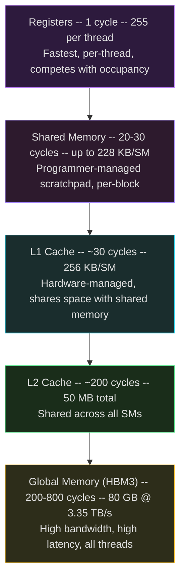
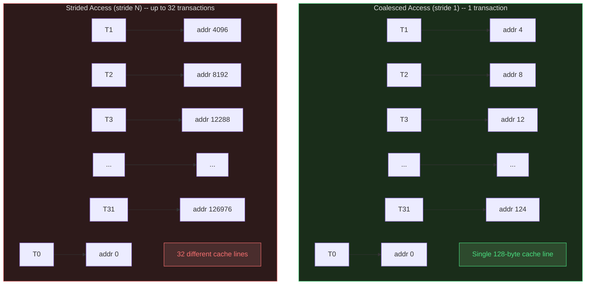
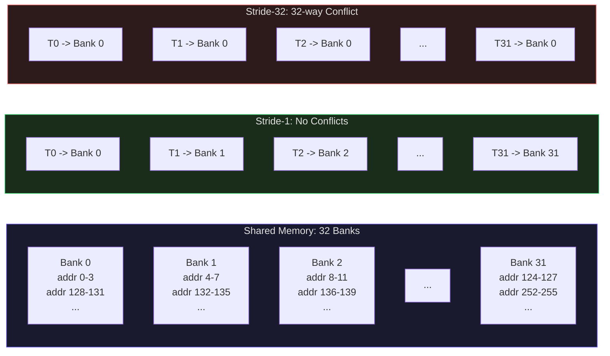

# GPU Memory Hierarchy and Occupancy

In the previous lecture, we learned that the GPU achieves massive throughput by running thousands of threads simultaneously. But throughput is useless if the execution units are starved for data. The GPU memory hierarchy is the system that feeds data to 16,896 CUDA cores and 528 Tensor Cores on the H100 -- and understanding it is the difference between a kernel that achieves 85% of theoretical peak and one that achieves 5%.

This lecture covers every level of the GPU memory hierarchy, the critical concept of memory coalescing, the subtle trap of shared memory bank conflicts, and the quantitative framework for calculating occupancy -- the metric that determines whether your kernel has enough threads to hide memory latency.

## GPU Memory Spaces

The GPU has six distinct memory spaces, each with different scope, latency, and size. Choosing the right one for each access pattern is the most impactful optimization a GPU programmer makes.

### The Complete Memory Hierarchy (H100 SXM5)

| Memory Space | Scope | Latency | Size | Bandwidth |
|---|---|---|---|---|
| **Registers** | Per thread | ~1 cycle | 255 per thread, 65,536 per SM | Register file BW |
| **Shared Memory** | Per block | ~20-30 cycles | Up to 228 KB per SM | ~19 TB/s aggregate |
| **L1 Cache** | Per SM | ~30 cycles | 256 KB per SM (shared with smem) | ~19 TB/s aggregate |
| **L2 Cache** | All SMs | ~200 cycles | 50 MB total | ~12 TB/s |
| **Global Memory (HBM3)** | All threads | ~200-800 cycles | 80 GB | 3.35 TB/s |
| **Constant Memory** | Read-only, all threads | ~1 cycle (cached) | 64 KB | Broadcast to warp |
| **Texture Memory** | Read-only, all threads | Cached | Part of global mem | 2D spatial cache |

The GPU memory hierarchy forms a pyramid: the fastest memory is smallest and closest to the execution units, while the slowest memory is largest and farthest away.



### Registers: The Fastest Storage

Registers are the only memory that keeps pace with the execution units -- a register read takes 1 cycle. Each thread can use up to 255 32-bit registers, and each SM has a register file of 65,536 registers.

The critical insight: registers are a **shared resource**. If each thread uses 64 registers, then the SM can hold at most $\lfloor 65{,}536 / 64 \rfloor = 1{,}024$ threads -- only 50% of the SM's maximum 2,048 threads. Using more registers per thread means fewer concurrent threads, which means less latency hiding. This is the register pressure trade-off, and we will quantify it precisely in the occupancy section.

When a kernel uses more than 255 registers (or when the compiler cannot fit all variables in registers), values **spill to local memory** -- which is actually global memory (HBM), accessed through the L1/L2 caches. A register spill turns a 1-cycle access into a 200-800 cycle access. The compiler flag `-maxrregcount=N` caps register usage to force higher occupancy, at the cost of potential spills.

### Shared Memory: The User-Managed Cache

Shared memory is a fast, programmer-managed scratchpad visible to all threads in a block. On the H100, each SM has 256 KB of combined L1 cache and shared memory, with a configurable split -- up to 228 KB can be allocated as shared memory (the rest becomes L1 cache).

Shared memory is essential for two patterns:

1. **Data reuse**: Load a tile of data from global memory into shared memory once, then have multiple threads read from it many times. This converts expensive global memory accesses into cheap shared memory accesses.

2. **Inter-thread communication**: Threads within a block can write to shared memory and read each other's results after a `__syncthreads()` barrier.

Access latency is 20-30 cycles -- 10x faster than global memory. But shared memory has a subtle performance trap: **bank conflicts**.

### Global Memory: High Bandwidth, High Latency

Global memory is the GPU's main memory -- 80 GB of HBM3 on the H100 SXM5, delivering 3.35 TB/s of bandwidth. The H200 upgrades to 141 GB of HBM3e at 4.8 TB/s, and the B200 reaches 192 GB of HBM3e at 8 TB/s.

Despite this enormous bandwidth, global memory has high latency: 200-800 cycles. A single thread waiting for a global memory load wastes hundreds of cycles. The GPU's solution is not to reduce latency (as a CPU would) but to hide it by running other threads while one thread waits. This is why occupancy matters: enough threads must be in flight to keep the execution units busy during memory stalls.

### L2 Cache: The Shared Hub

The L2 cache sits between the SMs and global memory, shared across all SMs. On the H100, it is 50 MB -- large enough to capture significant temporal reuse for many workloads. The A100 had 40 MB, and the V100 had only 6 MB, so L2 size has grown substantially across generations.

All global memory transactions pass through the L2. When a kernel repeatedly accesses the same data (e.g., reading the same weight matrix across multiple batches), the L2 can serve repeat accesses at ~200 cycles instead of ~800 cycles.

### Constant and Texture Memory

**Constant memory** is a 64 KB read-only space optimized for the case where all threads in a warp read the same address. When this happens, the read is served as a broadcast in a single cycle. If threads read different addresses, accesses are serialized. Constant memory is ideal for kernel parameters, lookup tables, and physical constants.

**Texture memory** is read-only memory with a 2D spatial cache optimized for 2D access patterns (image processing, stencil operations). It also provides free hardware interpolation (bilinear, trilinear) and address clamping/wrapping. For compute workloads, it is rarely used.

<ConceptCheck id="cc-1" />

## Memory Coalescing: The Most Important GPU Optimization

Memory coalescing is the single most impactful optimization in GPU programming. The difference between coalesced and uncoalesced access can be a 10-32x performance difference.

### How Global Memory Transactions Work

Global memory is accessed in **128-byte transactions** (also called sectors or cache lines). When a warp of 32 threads issues a load instruction, the hardware examines the addresses requested by all 32 threads and groups them into the minimum number of 128-byte transactions needed to satisfy all requests.

**Best case (perfectly coalesced)**: All 32 threads access consecutive 4-byte values starting at a 128-byte aligned address. This requires exactly one 128-byte transaction:

$$\text{Thread } i \text{ accesses address } \text{base} + 4i, \quad i = 0, 1, \ldots, 31$$

One transaction delivers 128 bytes, all of which are useful. **Bandwidth utilization: 100%**.

**Worst case (completely random)**: Each of the 32 threads accesses a 4-byte value in a different 128-byte cache line. This requires 32 separate transactions:

$$\text{32 transactions} \times 128 \text{ bytes} = 4{,}096 \text{ bytes transferred}$$

But only $32 \times 4 = 128$ bytes are actually used. **Bandwidth utilization: 3.1%**. The effective bandwidth drops from 3.35 TB/s to about 104 GB/s -- a 32x degradation.

The following diagram contrasts coalesced (sequential) versus uncoalesced (strided) access. With coalesced access, all 32 threads in a warp hit a single 128-byte cache line. With strided access, each thread's request falls in a different cache line, requiring up to 32 separate memory transactions.



### Strided Access Patterns

Consider a common pattern: accessing a column of a row-major matrix.

```python
def demonstrate_coalescing():
    """Show coalesced vs strided access patterns."""
    import numpy as np

    N = 1024
    matrix = np.random.randn(N, N).astype(np.float32)

    # Coalesced: threads access consecutive elements in a row
    # Thread 0 -> matrix[row][0], Thread 1 -> matrix[row][1], ...
    # All addresses are consecutive in memory -> 1 transaction per 32 threads
    row_sum = 0
    row = 0
    for col in range(N):  # Simulates warp-parallel row access
        row_sum += matrix[row, col]

    # Uncoalesced: threads access elements in a column (stride = N)
    # Thread 0 -> matrix[0][col], Thread 1 -> matrix[1][col], ...
    # Addresses are N*4 bytes apart -> up to 32 transactions per warp
    col_sum = 0
    col = 0
    for row in range(N):  # Simulates warp-parallel column access
        col_sum += matrix[row, col]

    return row_sum, col_sum

row_sum, col_sum = demonstrate_coalescing()
print(f"Row sum (coalesced): {row_sum:.2f}")
print(f"Col sum (uncoalesced, same result): {col_sum:.2f}")
```

For a matrix stored in row-major order with $N = 1024$:
- **Row access** (stride 1): Thread $i$ accesses element at byte offset $4i$. All 32 accesses fall in a single 128-byte line. **1 transaction**.
- **Column access** (stride $N$): Thread $i$ accesses element at byte offset $4 \times N \times i$. With $N = 1024$, the stride is 4,096 bytes. Each thread's access is in a different cache line. **32 transactions**.

The fix for column access is to **transpose the matrix** so that what was a column becomes a row, or to use shared memory to stage a transposed tile.

### Rules for Achieving Coalesced Access

1. **Consecutive threads should access consecutive addresses**: Thread $i$ accesses address `base + sizeof(element) * i`.
2. **Use Structure of Arrays (SoA) instead of Array of Structures (AoS)**: SoA groups all x-coordinates together, all y-coordinates together, enabling coalesced access to each field. AoS interleaves fields, requiring stride-2 or stride-3 access.
3. **Align allocations to 128 bytes**: Use `cudaMalloc`, which guarantees at least 256-byte alignment.
4. **Avoid indirect access patterns**: Array indexing through an index array (`data[indices[i]]`) produces random access patterns that cannot be coalesced.

<ConceptCheck id="cc-2" />

## Shared Memory Bank Conflicts

Shared memory is organized into **32 banks**, with successive 4-byte (32-bit) words assigned to successive banks:

$$\text{bank}(\text{address}) = \left\lfloor \frac{\text{address}}{4} \right\rfloor \bmod 32$$

| Byte Address | Bank |
|---|---|
| 0-3 | Bank 0 |
| 4-7 | Bank 1 |
| 8-11 | Bank 2 |
| ... | ... |
| 124-127 | Bank 31 |
| 128-131 | Bank 0 (wraps around) |

Each bank can serve one 32-bit word per clock cycle. When two or more threads in the same warp access **different addresses** in the **same bank**, a **bank conflict** occurs. The hardware serializes these accesses, reducing throughput proportionally.

The 32 banks of shared memory are assigned round-robin to consecutive 4-byte words. When multiple threads in a warp access different addresses in the same bank, the hardware serializes those accesses.



### Conflict Examples

**Conflict-free (stride 1)**: Thread $i$ accesses bank $i$. Each thread hits a different bank -- zero conflicts, served in one transaction.

**2-way conflict (stride 2)**: Thread $i$ accesses bank $2i \bmod 32$. Thread 0 and Thread 16 both access Bank 0 (addresses 0 and 128). Thread 1 and Thread 17 both access Bank 2. Each bank has exactly 2 threads contending -- 2-way conflicts, requiring 2 transactions. Throughput is halved.

**32-way conflict (stride 32)**: Thread $i$ accesses bank $(32i) \bmod 32 = 0$ for all $i$. Every thread hits Bank 0. The access is fully serialized into 32 transactions -- a 32x slowdown.

### The Broadcast Exception

When multiple threads read the **same address** (not just the same bank, but the exact same address), the hardware serves it as a **broadcast** -- no conflict occurs. This is a critical special case:

```python
# No conflict: all threads read the same address
# __shared__ float constant_val;
# float x = constant_val;  // broadcast to all 32 threads
```

### The Padding Trick

The classic solution for bank conflicts in matrix operations is padding. Consider a $32 \times 32$ shared memory tile:

```python
def demonstrate_padding():
    """Show how padding eliminates bank conflicts in matrix transpose."""
    # WITHOUT padding: tile[32][32]
    # Writing a row: thread i writes to bank i (stride 1) -> conflict-free
    # Reading a column: thread i reads from bank (32*i) % 32 = 0 -> 32-way conflict!

    # WITH padding: tile[32][33]
    # Reading a column: thread i reads from bank (33*i) % 32
    # i=0: bank 0, i=1: bank 1, i=2: bank 2, ... -> conflict-free!

    TILE_SIZE = 32

    # Simulate bank assignments without padding
    no_pad_banks = [(TILE_SIZE * i) % 32 for i in range(32)]
    no_pad_conflicts = len(no_pad_banks) - len(set(no_pad_banks))

    # Simulate bank assignments with padding (stride = TILE_SIZE + 1)
    pad_banks = [((TILE_SIZE + 1) * i) % 32 for i in range(32)]
    pad_conflicts = len(pad_banks) - len(set(pad_banks))

    print(f"Without padding: column read banks = {no_pad_banks[:8]}...")
    print(f"  Unique banks accessed: {len(set(no_pad_banks))}")
    print(f"  All threads hit bank 0: {'Yes' if len(set(no_pad_banks)) == 1 else 'No'}")
    print(f"\nWith padding (stride 33): column read banks = {pad_banks[:8]}...")
    print(f"  Unique banks accessed: {len(set(pad_banks))}")
    print(f"  All 32 banks used: {'Yes' if len(set(pad_banks)) == 32 else 'No'}")

demonstrate_padding()
```

The padding trick works because changing the row width from 32 to 33 makes the column stride coprime with 32. Since $\gcd(33, 32) = 1$, consecutive column elements cycle through all 32 banks before repeating. The cost is ~3% extra shared memory; the benefit is eliminating all bank conflicts, typically yielding a ~20% speedup for matrix transpose kernels.

### The Swizzling Alternative

An alternative to padding that wastes no memory is **swizzling** -- rearranging the index mapping:

```python
# Instead of: tile[row][col]
# Use: tile[row][col ^ row]  (XOR-based swizzling)
```

This maps logically contiguous column accesses to different banks without wasting any shared memory. This technique is used internally by cuBLAS and CUTLASS.

<ConceptCheck id="cc-3" />

## Occupancy: Quantifying Thread-Level Parallelism

Occupancy is the ratio of active warps to the maximum number of warps an SM can support:

$$\text{Occupancy} = \frac{\text{Active Warps per SM}}{\text{Maximum Warps per SM}}$$

On the H100 (compute capability 9.0), each SM supports up to **64 warps** (2,048 threads) and up to **32 concurrent blocks**. Occupancy measures how well your kernel utilizes this capacity.

The following diagram illustrates the concept of occupancy: the ratio of active warps to the maximum the SM can support. Higher occupancy means more warps available to hide memory latency.

```mermaid
flowchart LR
    subgraph LOW["Low Occupancy (25%)"]
        direction TB
        L1["Active: 16 warps"]
        L2["Idle slots: 48 warps"]
        L3["Few warps to hide\nmemory latency"]
        L1 ~~~ L2 ~~~ L3
    end
    subgraph HIGH["High Occupancy (100%)"]
        direction TB
        H1["Active: 64 warps"]
        H2["Idle slots: 0 warps"]
        H3["Maximum latency\nhiding capacity"]
        H1 ~~~ H2 ~~~ H3
    end
    LOW ~~~ HIGH
    style LOW fill:#2d1a1a,stroke:#f87171,color:#e0e0e0
    style HIGH fill:#1a2d1a,stroke:#4ade80,color:#e0e0e0
    style L1 fill:#4a2d2d,stroke:#f87171
    style L2 fill:#1a1a1a,stroke:#444
    style L3 fill:#4a2d2d,stroke:#f87171,color:#f87171
    style H1 fill:#2d4a2d,stroke:#4ade80
    style H2 fill:#2d4a2d,stroke:#4ade80
    style H3 fill:#2d4a2d,stroke:#4ade80,color:#4ade80
```



### Why Occupancy Matters

When a warp stalls on a memory access (200-800 cycles for global memory), the warp scheduler switches to another ready warp at zero cost. If the SM has 64 active warps and one stalls, there are 63 other warps to execute. If the SM has only 8 active warps and one stalls, there might not be enough ready warps to hide the latency, and the arithmetic units sit idle.

Higher occupancy generally means better latency hiding. However, occupancy is not the only factor -- a kernel with 50% occupancy that makes efficient use of shared memory can outperform a kernel with 100% occupancy that thrashes global memory.

### The Three Limiting Factors

Three resources independently limit how many blocks can fit on an SM. The actual occupancy is determined by the **most restrictive** factor.

#### 1. Block Size Limit

$$\text{Blocks}_{\text{threads}} = \min\left(\left\lfloor \frac{\text{Max Threads per SM}}{\text{Threads per Block}} \right\rfloor,\ \text{Max Blocks per SM}\right)$$

On H100: Max Threads per SM = 2,048. Max Blocks per SM = 32.

#### 2. Register Limit

Each SM has a 65,536-register file. Registers are allocated per warp, rounded up to the nearest 256 registers per block (on compute capability 7.0+):

$$\text{Regs per Block} = \left\lceil \frac{\text{Regs per Thread} \times \text{Threads per Block}}{256} \right\rceil \times 256$$

$$\text{Blocks}_{\text{regs}} = \left\lfloor \frac{65{,}536}{\text{Regs per Block}} \right\rfloor$$

#### 3. Shared Memory Limit

$$\text{Blocks}_{\text{smem}} = \left\lfloor \frac{\text{SM Shared Memory}}{\text{Shared Memory per Block}} \right\rfloor$$

On H100: up to 228 KB per SM (configurable).

#### Final Calculation

$$\text{Active Blocks} = \min\left(\text{Blocks}_{\text{threads}},\ \text{Blocks}_{\text{regs}},\ \text{Blocks}_{\text{smem}},\ \text{Max Blocks per SM}\right)$$

$$\text{Occupancy} = \frac{\text{Active Blocks} \times \left(\text{Threads per Block} / 32\right)}{\text{Max Warps per SM}}$$

### Worked Example: H100, Compute Capability 9.0

Consider a kernel using **64 registers per thread**, **256 threads per block**, and **16 KB shared memory per block**:

**Step 1 -- Thread limit**:
$$\left\lfloor \frac{2{,}048}{256} \right\rfloor = 8 \text{ blocks} \quad (\text{capped at 32, so } 8)$$

**Step 2 -- Register limit**:
$$\text{Regs per block} = 256 \times 64 = 16{,}384$$
$$\left\lfloor \frac{65{,}536}{16{,}384} \right\rfloor = 4 \text{ blocks}$$

**Step 3 -- Shared memory limit**:
$$\left\lfloor \frac{228 \text{ KB}}{16 \text{ KB}} \right\rfloor = 14 \text{ blocks}$$

**Step 4 -- Active blocks**:
$$\min(8, 4, 14, 32) = 4 \text{ blocks}$$

**Step 5 -- Occupancy**:
$$\text{Active warps} = 4 \times \frac{256}{32} = 32 \text{ warps}$$
$$\text{Occupancy} = \frac{32}{64} = 50\%$$

The bottleneck here is **registers**: the kernel uses so many registers per thread that only 4 blocks can fit. Reducing register usage to 32 per thread would allow 8 blocks ($65{,}536 / (256 \times 32) = 8$), achieving 100% occupancy. But if those registers were holding intermediate results that would otherwise spill to global memory, the 50% occupancy kernel might actually run faster.

```python
import math

def calculate_occupancy(threads_per_block, regs_per_thread, smem_per_block_kb,
                         max_threads_per_sm=2048, max_warps_per_sm=64,
                         max_blocks_per_sm=32, regs_per_sm=65536,
                         max_smem_per_sm_kb=228, reg_alloc_granularity=256):
    """Calculate GPU occupancy for given kernel parameters.

    All parameters based on H100 defaults (compute capability 9.0).
    """
    # 1. Block size limit
    blocks_by_threads = min(
        max_threads_per_sm // threads_per_block,
        max_blocks_per_sm
    )

    # 2. Register limit
    regs_per_block = math.ceil(
        (regs_per_thread * threads_per_block) / reg_alloc_granularity
    ) * reg_alloc_granularity
    blocks_by_regs = regs_per_sm // regs_per_block if regs_per_block > 0 else max_blocks_per_sm

    # 3. Shared memory limit
    smem_per_block = smem_per_block_kb * 1024
    max_smem = max_smem_per_sm_kb * 1024
    blocks_by_smem = max_smem // smem_per_block if smem_per_block > 0 else max_blocks_per_sm

    # 4. Active blocks
    active_blocks = min(blocks_by_threads, blocks_by_regs, blocks_by_smem, max_blocks_per_sm)

    # 5. Occupancy
    active_warps = active_blocks * (threads_per_block // 32)
    occupancy = active_warps / max_warps_per_sm

    bottleneck = "threads"
    if active_blocks == blocks_by_regs:
        bottleneck = "registers"
    elif active_blocks == blocks_by_smem:
        bottleneck = "shared memory"

    return {
        "active_blocks": active_blocks,
        "active_warps": active_warps,
        "occupancy": occupancy,
        "occupancy_pct": f"{occupancy * 100:.1f}%",
        "bottleneck": bottleneck,
        "blocks_by_threads": blocks_by_threads,
        "blocks_by_regs": blocks_by_regs,
        "blocks_by_smem": blocks_by_smem,
    }

# Example from lecture
result = calculate_occupancy(
    threads_per_block=256,
    regs_per_thread=64,
    smem_per_block_kb=16
)
print(f"Active blocks: {result['active_blocks']}")
print(f"Active warps: {result['active_warps']}")
print(f"Occupancy: {result['occupancy_pct']}")
print(f"Bottleneck: {result['bottleneck']}")
print(f"  Blocks by threads: {result['blocks_by_threads']}")
print(f"  Blocks by regs: {result['blocks_by_regs']}")
print(f"  Blocks by smem: {result['blocks_by_smem']}")
```

### Occupancy Guidelines

- **Target 50%+ occupancy** as a starting point. Below 25%, latency hiding is usually insufficient.
- **Higher is not always better**: A kernel at 50% occupancy using 48 KB shared memory per block may outperform a 100% occupancy kernel accessing global memory repeatedly.
- **Block sizes should be multiples of 32** (warp size). Common choices: 128, 256, 512 threads.
- **Use the CUDA Occupancy API**: `cudaOccupancyMaxPotentialBlockSize()` automatically finds the block size that maximizes occupancy for a given kernel.

<ConceptCheck id="cc-4" />

## cuBLAS GEMM Performance: What the Hardware Can Achieve

To appreciate why occupancy, coalescing, and bank conflicts matter, consider the achieved performance of cuBLAS (NVIDIA's optimized BLAS library) on the H100 SXM5 for GEMM (General Matrix Multiplication: $C = \alpha A B + \beta C$) with large, square matrices ($m = n = k \geq 4096$):

| Precision | Achieved TFLOPS | % of Peak | Notes |
|---|---|---|---|
| FP64 (Tensor Core) | ~51 | ~85% | HPC workloads |
| FP32 (via TF32) | ~800-900 | ~80-90% of TF32 peak | Default for `cublasSgemm` |
| TF32 (Tensor Core) | ~800-850 | ~85% | Automatic for FP32 inputs |
| FP16 (Tensor Core) | ~1,500-1,700 | ~80-85% | Standard training precision |
| FP8 (Tensor Core) | ~3,200-3,500 | ~80-88% | Via Transformer Engine |
| INT8 (Tensor Core) | ~3,200-3,500 | ~80-88% | Quantized inference |

These numbers -- 80-90% of theoretical peak -- are achieved through painstaking optimization of every concept in this lecture: perfect memory coalescing, shared memory tiling with zero bank conflicts, optimal occupancy, and register blocking. cuBLAS kernels are hand-tuned for each GPU architecture and matrix size.

The H100 achieves a 3x speedup over the A100 for compute-bound FP16 GEMMs, and a 4.8x speedup for FP8 GEMMs. Small matrices ($< 512$ on a side) are memory-bandwidth-bound rather than compute-bound, achieving a much smaller fraction of peak TFLOPS.

**Project 4 connection**: In your GPU compute simulator (Milestone 1), you will model these memory hierarchy levels and calculate occupancy for various kernel configurations. Understanding the quantitative relationships in this lecture -- transaction counts, bank conflict costs, and occupancy limits -- is essential for building an accurate simulator.

## Summary

The GPU memory hierarchy is a carefully designed system that balances capacity, bandwidth, and latency across multiple levels:

1. **Registers** (1 cycle, 255 per thread) -- fastest, but compete with occupancy
2. **Shared memory** (20-30 cycles, up to 228 KB per SM) -- fast, but beware bank conflicts
3. **L1 cache** (30 cycles, 256 KB per SM) -- hardware-managed, shares space with shared memory
4. **L2 cache** (200 cycles, 50 MB) -- shared across all SMs
5. **Global memory** (200-800 cycles, 80 GB, 3.35 TB/s) -- enormous bandwidth, but high latency

The programmer's job is to keep data as close to the top of this hierarchy as possible. **Memory coalescing** ensures efficient use of global memory bandwidth. **Shared memory tiling** converts repeated global accesses into fast local accesses. **Occupancy** ensures enough threads are in flight to hide the latency of whatever memory accesses remain.

In the next week, we will put this knowledge to work: writing CUDA kernels and optimizing them through parallel reduction, prefix scan, tiled matrix multiplication, and multi-GPU communication.
