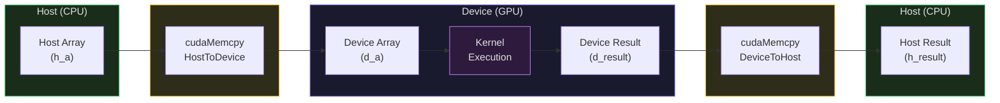
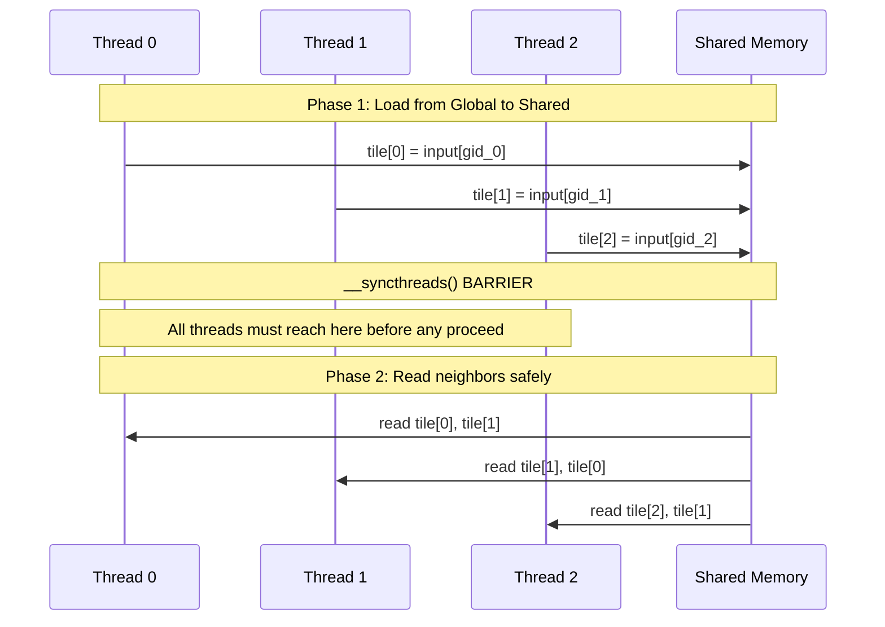

# CUDA Programming: Kernels, Threads, and Memory

Last week we studied the GPU as hardware: streaming multiprocessors, SIMT execution, memory hierarchy, and occupancy. This week we write code that runs on that hardware. CUDA (Compute Unified Device Architecture) is NVIDIA's programming model for general-purpose GPU computing. It exposes the GPU's parallelism through a simple extension to C/C++: you write a function (a *kernel*), specify how many threads should run it, and the hardware maps those threads to SMs automatically.

Since we are running in a browser via Pyodide, we cannot execute actual CUDA code. Instead, we will simulate CUDA's programming model in Python -- the concepts are identical, and the simulated code maps directly to real CUDA. The goal is to internalize the programming model so deeply that when you write actual CUDA, the patterns are already in your hands.

## The CUDA Programming Model

### Kernels: Functions That Run on the GPU

A CUDA **kernel** is a function that executes on the GPU. In CUDA C++, kernels are declared with the `__global__` qualifier:

```c
// CUDA C++ -- the real syntax
__global__ void vector_add(float *a, float *b, float *c, int n) {
    int idx = blockIdx.x * blockDim.x + threadIdx.x;
    if (idx < n) {
        c[idx] = a[idx] + b[idx];
    }
}

// Launch: 256 blocks of 256 threads each = 65,536 threads
vector_add<<<256, 256>>>(d_a, d_b, d_c, n);
```

Three function qualifiers control where code runs:

| Qualifier | Runs on | Called from |
|---|---|---|
| `__global__` | GPU | CPU (or GPU with Dynamic Parallelism) |
| `__device__` | GPU | GPU only |
| `__host__` | CPU | CPU only |

A function can be both `__host__` and `__device__`, compiling for both architectures.

### Kernel Launch Syntax

The `<<<gridDim, blockDim, sharedMem, stream>>>` syntax specifies the execution configuration:

```c
kernel<<<gridDim, blockDim, sharedMemBytes, stream>>>(arg1, arg2, ...);
```

- `gridDim`: number of blocks (up to $2^{31}-1$ in x, 65,535 in y and z)
- `blockDim`: threads per block (up to 1,024 total)
- `sharedMemBytes`: dynamic shared memory per block (default: 0)
- `stream`: CUDA stream for asynchronous execution (default: 0, the default stream)

### Thread Indexing

Every thread knows its position in the grid through built-in variables:

| Variable | Type | Description |
|---|---|---|
| `threadIdx` | `dim3` | Thread index within block (`.x`, `.y`, `.z`) |
| `blockIdx` | `dim3` | Block index within grid |
| `blockDim` | `dim3` | Block dimensions |
| `gridDim` | `dim3` | Grid dimensions |
| `warpSize` | `int` | Warp size (always 32) |

The following diagram shows how CUDA organizes threads into a 3D hierarchy. A kernel launch creates a grid of blocks, each block contains threads, and the hardware groups threads into warps of 32.

```mermaid
flowchart TD
    subgraph GRID["Grid (gridDim.x * gridDim.y * gridDim.z blocks)"]
        subgraph ROW0["Row 0"]
            direction LR
            subgraph B00["Block (0,0)"]
                BT00["blockDim.x * blockDim.y\nthreads"]
            end
            subgraph B10["Block (1,0)"]
                BT10["blockDim.x * blockDim.y\nthreads"]
            end
            subgraph B20["Block (2,0)"]
                BT20["blockDim.x * blockDim.y\nthreads"]
            end
        end
        subgraph ROW1["Row 1"]
            direction LR
            subgraph B01["Block (0,1)"]
                BT01["blockDim.x * blockDim.y\nthreads"]
            end
            subgraph B11["Block (1,1)"]
                BT11["blockDim.x * blockDim.y\nthreads"]
            end
            subgraph B21["Block (2,1)"]
                BT21["blockDim.x * blockDim.y\nthreads"]
            end
        end
    end

    style GRID fill:#12121a,stroke:#6c5ce7,color:#e0e0e0
    style ROW0 fill:#12121a,stroke:none
    style ROW1 fill:#12121a,stroke:none
    style B00 fill:#1a1a2e,stroke:#a29bfe,color:#e0e0e0
    style B10 fill:#1a1a2e,stroke:#a29bfe,color:#e0e0e0
    style B20 fill:#1a1a2e,stroke:#a29bfe,color:#e0e0e0
    style B01 fill:#1a1a2e,stroke:#a29bfe,color:#e0e0e0
    style B11 fill:#1a1a2e,stroke:#a29bfe,color:#e0e0e0
    style B21 fill:#1a1a2e,stroke:#a29bfe,color:#e0e0e0
    style BT00 fill:#2d2d4a,stroke:#818cf8
    style BT10 fill:#2d2d4a,stroke:#818cf8
    style BT20 fill:#2d2d4a,stroke:#818cf8
    style BT01 fill:#2d2d4a,stroke:#818cf8
    style BT11 fill:#2d2d4a,stroke:#818cf8
    style BT21 fill:#2d2d4a,stroke:#818cf8
```



For 1D indexing, the global thread ID is:

$$\text{global\_id} = \text{blockIdx.x} \times \text{blockDim.x} + \text{threadIdx.x}$$

For 2D indexing (e.g., matrix operations):

$$\text{row} = \text{blockIdx.y} \times \text{blockDim.y} + \text{threadIdx.y}$$
$$\text{col} = \text{blockIdx.x} \times \text{blockDim.x} + \text{threadIdx.x}$$

Let us build our simulation framework:

```python
import math
from dataclasses import dataclass

@dataclass
class Dim3:
    """Simulate CUDA dim3 type."""
    x: int = 1
    y: int = 1
    z: int = 1

class CUDASimulator:
    """Simulate CUDA kernel launches with grid/block/thread indexing."""

    def __init__(self):
        self.global_memory = {}

    def launch_kernel_1d(self, kernel_func, grid_dim, block_dim, *args):
        """Launch a 1D kernel: kernel_func(global_id, *args)."""
        results = {}
        for block_id in range(grid_dim):
            for thread_id in range(block_dim):
                global_id = block_id * block_dim + thread_id
                result = kernel_func(global_id, block_id, thread_id,
                                     block_dim, grid_dim, *args)
                if result is not None:
                    results[global_id] = result
        return results

    def launch_kernel_2d(self, kernel_func, grid_dim, block_dim, *args):
        """Launch a 2D kernel: grid_dim and block_dim are (x, y) tuples."""
        gx, gy = grid_dim
        bx, by = block_dim
        results = {}
        for block_y in range(gy):
            for block_x in range(gx):
                for thread_y in range(by):
                    for thread_x in range(bx):
                        row = block_y * by + thread_y
                        col = block_x * bx + thread_x
                        result = kernel_func(
                            row, col,
                            (block_x, block_y),
                            (thread_x, thread_y),
                            (bx, by), (gx, gy),
                            *args
                        )
                        if result is not None:
                            results[(row, col)] = result
        return results

# Instantiate
sim = CUDASimulator()

# Example: Vector addition kernel
def vector_add_kernel(global_id, block_id, thread_id, block_dim, grid_dim,
                      a, b, c, n):
    if global_id < n:
        c[global_id] = a[global_id] + b[global_id]

# Set up data
n = 100
a = [float(i) for i in range(n)]
b = [float(i * 2) for i in range(n)]
c = [0.0] * n

# Launch: ceil(100/32) = 4 blocks of 32 threads
grid_dim = math.ceil(n / 32)
block_dim = 32
sim.launch_kernel_1d(vector_add_kernel, grid_dim, block_dim, a, b, c, n)

# Verify
assert c[0] == 0.0, f"c[0] should be 0.0, got {c[0]}"
assert c[50] == 150.0, f"c[50] should be 150.0, got {c[50]}"
assert c[99] == 99.0 + 198.0, f"c[99] wrong"
print(f"Vector add: c[0]={c[0]}, c[50]={c[50]}, c[99]={c[99]}")
print(f"Grid: {grid_dim} blocks x {block_dim} threads = {grid_dim * block_dim} threads (for {n} elements)")
```

<ConceptCheck id="cc-1" />

## Memory Management

CUDA provides explicit memory management functions for GPU memory:

### The CPU-GPU Memory Model

The CPU and GPU have separate memory spaces. Data must be explicitly copied between them. The following diagram shows the complete data flow for a typical CUDA computation.



```c
// CUDA C++ memory management (the real API)
float *d_a;                          // Device pointer
cudaMalloc(&d_a, n * sizeof(float)); // Allocate on GPU
cudaMemcpy(d_a, h_a, n * sizeof(float), cudaMemcpyHostToDevice);  // CPU -> GPU
cudaMemcpy(h_a, d_a, n * sizeof(float), cudaMemcpyDeviceToHost);  // GPU -> CPU
cudaFree(d_a);                       // Free GPU memory
```

### Unified Memory

CUDA 6.0 introduced **Unified Memory**, which creates a single address space accessible from both CPU and GPU:

```c
float *data;
cudaMallocManaged(&data, n * sizeof(float));  // Accessible from CPU and GPU

// CPU can read/write
data[0] = 42.0;

// GPU can also read/write
kernel<<<grid, block>>>(data);

cudaFree(data);
```

The runtime handles page migration transparently -- pages fault to the accessing processor on first access. On NVLink-connected systems (like the DGX H100), remote access without migration may be faster for infrequent accesses.

### Pinned (Page-Locked) Memory

For maximum transfer bandwidth, use **pinned memory** (page-locked host memory that cannot be swapped out):

```c
float *h_pinned;
cudaMallocHost(&h_pinned, n * sizeof(float));  // Pinned host memory

// Transfers use DMA, bypassing CPU, achieving full PCIe/NVLink bandwidth
cudaMemcpy(d_a, h_pinned, n * sizeof(float), cudaMemcpyHostToDevice);

cudaFreeHost(h_pinned);
```

Pinned memory achieves 2-3x higher transfer bandwidth than pageable memory because the DMA engine can access it directly without involving the CPU.

Let us simulate the memory management pattern:

```python
class GPUMemoryManager:
    """Simulate CUDA memory management."""

    def __init__(self, total_memory_gb=80):
        self.total_memory = total_memory_gb * (1024 ** 3)
        self.allocated = {}
        self.used_memory = 0

    def malloc(self, name, size_bytes):
        """Simulate cudaMalloc."""
        if self.used_memory + size_bytes > self.total_memory:
            raise MemoryError(f"GPU out of memory: {self.used_memory / 1e9:.1f} GB used, "
                              f"requested {size_bytes / 1e9:.3f} GB")
        self.allocated[name] = {
            'size': size_bytes,
            'data': [0.0] * (size_bytes // 4),  # float32 array
        }
        self.used_memory += size_bytes
        return self.allocated[name]['data']

    def memcpy_h2d(self, device_name, host_data):
        """Simulate cudaMemcpy host -> device."""
        d = self.allocated[device_name]['data']
        for i in range(min(len(host_data), len(d))):
            d[i] = host_data[i]

    def memcpy_d2h(self, device_name):
        """Simulate cudaMemcpy device -> host."""
        return list(self.allocated[device_name]['data'])

    def free(self, name):
        """Simulate cudaFree."""
        if name in self.allocated:
            self.used_memory -= self.allocated[name]['size']
            del self.allocated[name]

    def memory_info(self):
        """Return memory usage summary."""
        return {
            'used_mb': self.used_memory / (1024 ** 2),
            'free_mb': (self.total_memory - self.used_memory) / (1024 ** 2),
            'total_mb': self.total_memory / (1024 ** 2),
            'utilization': self.used_memory / self.total_memory,
        }

# Demo
mem = GPUMemoryManager(total_memory_gb=80)
n = 1000

# Allocate arrays on "GPU"
d_a = mem.malloc('d_a', n * 4)
d_b = mem.malloc('d_b', n * 4)
d_c = mem.malloc('d_c', n * 4)

# Copy host data to device
h_a = [float(i) for i in range(n)]
h_b = [float(i * 3) for i in range(n)]
mem.memcpy_h2d('d_a', h_a)
mem.memcpy_h2d('d_b', h_b)

info = mem.memory_info()
print(f"GPU memory: {info['used_mb']:.3f} MB used / {info['total_mb']:.0f} MB total")
print(f"Utilization: {info['utilization'] * 100:.6f}%")

# Clean up
mem.free('d_a')
mem.free('d_b')
mem.free('d_c')
```

## Simple Kernels: From Scalar to Parallel

### Vector Addition (1D)

The simplest CUDA kernel: one thread per element.

```python
def vector_add_complete():
    """Complete vector addition example with boundary checking."""
    import math

    n = 1000
    a = [float(i) for i in range(n)]
    b = [float(i * 2 + 1) for i in range(n)]
    c = [0.0] * n

    # Kernel: each thread processes one element
    def vadd_kernel(gid, bid, tid, bdim, gdim, a, b, c, n):
        if gid < n:  # Boundary check for non-power-of-2 sizes
            c[gid] = a[gid] + b[gid]

    # Choose block size and compute grid size
    block_size = 256
    grid_size = math.ceil(n / block_size)

    sim = CUDASimulator()
    sim.launch_kernel_1d(vadd_kernel, grid_size, block_size, a, b, c, n)

    # Verify
    for i in range(n):
        expected = a[i] + b[i]
        assert c[i] == expected, f"Mismatch at {i}: {c[i]} != {expected}"

    print(f"Vector add verified for n={n}")
    print(f"Grid: {grid_size} blocks x {block_size} threads = {grid_size * block_size} threads")
    print(f"Wasted threads: {grid_size * block_size - n}")

vector_add_complete()
```

The boundary check `if gid < n` is essential when $n$ is not a multiple of the block size. Without it, threads with `gid >= n` would access out-of-bounds memory.

### Matrix Addition (2D Indexing)

For 2D problems, use 2D grid and block dimensions:

```python
def matrix_add_2d():
    """Matrix addition with 2D thread indexing."""
    import math

    M, N = 64, 48  # Matrix dimensions (rows x cols)
    A = [[float(i * N + j) for j in range(N)] for i in range(M)]
    B = [[float((i * N + j) * 0.5) for j in range(N)] for i in range(M)]
    C = [[0.0] * N for _ in range(M)]

    def matadd_kernel(row, col, block_idx, thread_idx, block_dim, grid_dim,
                      A, B, C, M, N):
        if row < M and col < N:  # Boundary check for both dimensions
            C[row][col] = A[row][col] + B[row][col]

    # Block: 16x16 = 256 threads per block
    block_dim = (16, 16)
    grid_dim = (math.ceil(N / 16), math.ceil(M / 16))

    sim = CUDASimulator()
    sim.launch_kernel_2d(matadd_kernel, grid_dim, block_dim, A, B, C, M, N)

    # Verify
    for i in range(M):
        for j in range(N):
            expected = A[i][j] + B[i][j]
            assert C[i][j] == expected, f"Mismatch at ({i},{j})"

    total_threads = grid_dim[0] * block_dim[0] * grid_dim[1] * block_dim[1]
    useful_threads = M * N
    print(f"Matrix add {M}x{N} verified")
    print(f"Grid: {grid_dim[0]}x{grid_dim[1]} blocks of {block_dim[0]}x{block_dim[1]} threads")
    print(f"Total threads: {total_threads}, useful: {useful_threads}, wasted: {total_threads - useful_threads}")

matrix_add_2d()
```

<ConceptCheck id="cc-2" />

## Synchronization

### Block-Level: `__syncthreads()`

The most common synchronization primitive is `__syncthreads()`, a barrier that all threads in a block must reach before any can proceed past it. This is essential when threads share data via shared memory:

```c
__global__ void shared_memory_example(float *input, float *output, int n) {
    __shared__ float tile[256];

    int gid = blockIdx.x * blockDim.x + threadIdx.x;

    // Phase 1: Load from global to shared memory
    if (gid < n) {
        tile[threadIdx.x] = input[gid];
    }

    __syncthreads();  // BARRIER: all threads must finish loading

    // Phase 2: Now safe to read any element in tile[]
    // Each thread reads its neighbor's data
    if (gid < n && threadIdx.x > 0) {
        output[gid] = tile[threadIdx.x] + tile[threadIdx.x - 1];
    }
}
```

Without `__syncthreads()`, thread 5 might try to read `tile[4]` before thread 4 has written its value -- a race condition.



**Critical rule**: Every thread in a block must reach the same `__syncthreads()` call. If a `__syncthreads()` is inside an `if` statement that only some threads enter, the program deadlocks.

### Atomic Operations

For safe concurrent updates to the same memory location:

```c
atomicAdd(&counter, 1);       // Atomic increment
atomicMax(&max_val, my_val);   // Atomic maximum
atomicCAS(&addr, expected, desired);  // Compare-and-swap
```

Atomics serialize access to a single address, so they are slow when many threads contend on the same location. Use them sparingly -- prefer reduction patterns instead.

Let us simulate synchronization:

```python
def synchronization_demo():
    """Demonstrate the need for synchronization in shared memory patterns."""

    # Simulate stencil computation: each element = avg of neighbors
    n = 32  # One block of 32 threads
    data = [float(i) for i in range(n)]

    # WITHOUT synchronization (incorrect -- simulated)
    shared = list(data)  # "Shared memory"
    result_wrong = [0.0] * n
    # If threads execute out of order, some read stale values
    for tid in range(n):
        left = shared[tid - 1] if tid > 0 else 0.0
        right = shared[tid + 1] if tid < n - 1 else 0.0
        # BUG: if another thread has already modified shared[tid-1],
        # we read the wrong value
        result_wrong[tid] = (left + shared[tid] + right) / 3.0

    # WITH synchronization (correct)
    shared = list(data)
    result_correct = [0.0] * n
    # Phase 1: All threads load (already done -- shared = data)
    # __syncthreads()
    # Phase 2: All threads compute using the snapshot
    for tid in range(n):
        left = shared[tid - 1] if tid > 0 else 0.0
        center = shared[tid]
        right = shared[tid + 1] if tid < n - 1 else 0.0
        result_correct[tid] = (left + center + right) / 3.0

    # Verify correctness
    for i in range(1, n - 1):
        expected = (data[i-1] + data[i] + data[i+1]) / 3.0
        assert abs(result_correct[i] - expected) < 1e-6, f"Mismatch at {i}"

    print("Synchronization demo: stencil computation verified")
    print(f"  result_correct[16] = ({data[15]} + {data[16]} + {data[17]}) / 3 = {result_correct[16]:.2f}")

synchronization_demo()
```

<ConceptCheck id="cc-3" />

## Error Handling and Profiling

### CUDA Error Handling

Every CUDA API call returns a `cudaError_t`. In production code, *every* call must be checked:

```c
cudaError_t err = cudaMalloc(&d_ptr, size);
if (err != cudaSuccess) {
    fprintf(stderr, "cudaMalloc failed: %s\n", cudaGetErrorString(err));
    exit(EXIT_FAILURE);
}

// For kernel launches (which are asynchronous):
kernel<<<grid, block>>>(args);
err = cudaGetLastError();       // Check launch configuration errors
if (err != cudaSuccess) { /* handle */ }
err = cudaDeviceSynchronize();  // Check execution errors
if (err != cudaSuccess) { /* handle */ }
```

Common errors:
- `cudaErrorInvalidConfiguration`: Block size exceeds 1024, or exceeds resource limits
- `cudaErrorMemoryAllocation`: GPU out of memory
- `cudaErrorIllegalAddress`: Kernel accessed invalid memory (segfault equivalent)
- `cudaErrorLaunchTimeout`: Kernel exceeded watchdog timer (display GPUs)

### Profiling Concepts

Performance optimization requires measurement. NVIDIA provides several tools:

**NVIDIA Nsight Compute** (`ncu`): Kernel-level profiler. Measures achieved bandwidth, compute throughput, occupancy, warp stall reasons, and memory transaction counts. This is the tool you use to diagnose why a kernel is slow.

**NVIDIA Nsight Systems** (`nsys`): System-level profiler. Shows the timeline of kernel launches, memory copies, CPU activity, and inter-GPU communication. This is the tool you use to find pipeline stalls and CPU-GPU synchronization bottlenecks.

Key profiling metrics:
- **Achieved Occupancy**: Actual average active warps / maximum, measured at runtime (may differ from theoretical).
- **Memory Throughput**: Bytes/sec actually achieved vs. theoretical peak (3.35 TB/s for H100 HBM3).
- **Compute Throughput**: FLOPS achieved vs. peak (60 TFLOPS FP32, 1,979 TFLOPS FP16 for H100).
- **Warp Stall Reasons**: Why warps are not executing -- memory dependency, execution dependency, barrier, etc.

The **Roofline Model** from Week 8 applies directly: if your kernel's arithmetic intensity (FLOPS/byte) is below the machine's ridge point, it is memory-bound and you should optimize memory access patterns. If it is above the ridge point, it is compute-bound and you should optimize instruction throughput.

```python
def roofline_analysis():
    """Demonstrate roofline analysis for GPU kernels."""

    # H100 SXM5 specs
    peak_flops = 60e12       # 60 TFLOPS FP32 (CUDA cores)
    peak_bw = 3.35e12        # 3.35 TB/s HBM3 bandwidth
    ridge_point = peak_flops / peak_bw  # FLOPS/byte

    print(f"H100 SXM5 FP32 Roofline:")
    print(f"  Peak compute: {peak_flops/1e12:.0f} TFLOPS")
    print(f"  Peak bandwidth: {peak_bw/1e12:.2f} TB/s")
    print(f"  Ridge point: {ridge_point:.1f} FLOPS/byte")
    print()

    # Analyze some common kernels
    kernels = [
        ("Vector add", 1, 12),       # 1 FLOP, 3 floats x 4 bytes = 12 bytes
        ("Dot product", 2, 8),        # 2 FLOPs (mul+add), 2 floats = 8 bytes
        ("GEMM (n=4096)", 8192, 4),   # ~2n FLOPs/byte for n=4096 -> 8192 FLOPS/4 bytes
        ("GEMM (n=128)", 256, 4),     # ~2n FLOPs/byte for n=128
    ]

    for name, flops, bytes_accessed in kernels:
        ai = flops / bytes_accessed
        bound = "compute-bound" if ai >= ridge_point else "memory-bound"
        attainable = min(peak_flops, ai * peak_bw)
        print(f"  {name}: AI = {ai:.1f} FLOPS/byte -> {bound}")
        print(f"    Attainable perf: {attainable/1e12:.1f} TFLOPS "
              f"({attainable/peak_flops*100:.0f}% of peak)")

roofline_analysis()
```

<ConceptCheck id="cc-4" />

## Cooperative Groups (Volta+)

CUDA 9 introduced **Cooperative Groups**, a flexible synchronization model that generalizes `__syncthreads()`:

```c
#include <cooperative_groups.h>
namespace cg = cooperative_groups;

__global__ void kernel() {
    // Thread block group (equivalent to __syncthreads())
    cg::thread_block block = cg::this_thread_block();
    block.sync();

    // Warp-sized tile -- synchronize 32 threads
    cg::thread_block_tile<32> warp = cg::tiled_partition<32>(block);
    warp.sync();

    // Sub-warp tiles (power of 2, <= 32)
    cg::thread_block_tile<16> half_warp = cg::tiled_partition<16>(block);

    // Warp-level collectives via tiles
    int sum = cg::reduce(warp, val, cg::plus<int>());
    int prefix = cg::inclusive_scan(warp, val, cg::plus<int>());
}
```

Cooperative Groups are particularly powerful for:
- **Partial-warp operations**: Synchronize tiles of 4, 8, or 16 threads within a warp.
- **Grid-wide synchronization**: `cg::this_grid().sync()` synchronizes all blocks in a grid (requires cooperative launch).
- **Multi-GPU synchronization**: `cg::this_multi_grid().sync()` for multi-GPU cooperative kernels.

## Putting It Together: The CUDA Workflow

The complete workflow for a CUDA computation is:

1. **Allocate** GPU memory: `cudaMalloc` (or `cudaMallocManaged` for Unified Memory)
2. **Transfer** data from CPU to GPU: `cudaMemcpy` with `cudaMemcpyHostToDevice`
3. **Launch** kernel: `kernel<<<grid, block>>>(args)`
4. **Synchronize**: `cudaDeviceSynchronize()` (wait for kernel to finish)
5. **Transfer** results from GPU to CPU: `cudaMemcpy` with `cudaMemcpyDeviceToHost`
6. **Free** GPU memory: `cudaFree`

For production code, steps 1-3 are often overlapped using **CUDA streams**: multiple streams allow memory transfers and kernel execution to happen concurrently:

```c
cudaStream_t stream1, stream2;
cudaStreamCreate(&stream1);
cudaStreamCreate(&stream2);

// These can execute concurrently
cudaMemcpyAsync(d_a, h_a, size, cudaMemcpyHostToDevice, stream1);
kernel<<<grid, block, 0, stream2>>>(d_b, d_c);

cudaStreamSynchronize(stream1);
cudaStreamSynchronize(stream2);
```

This overlapping of compute and data transfer is critical for achieving high GPU utilization in production pipelines.

In the next lecture, we will use these primitives to implement the most important parallel algorithms: reduction, prefix scan, tiled matrix multiplication, and multi-GPU communication. These are the building blocks of every high-performance GPU application, from deep learning training to scientific simulation.
