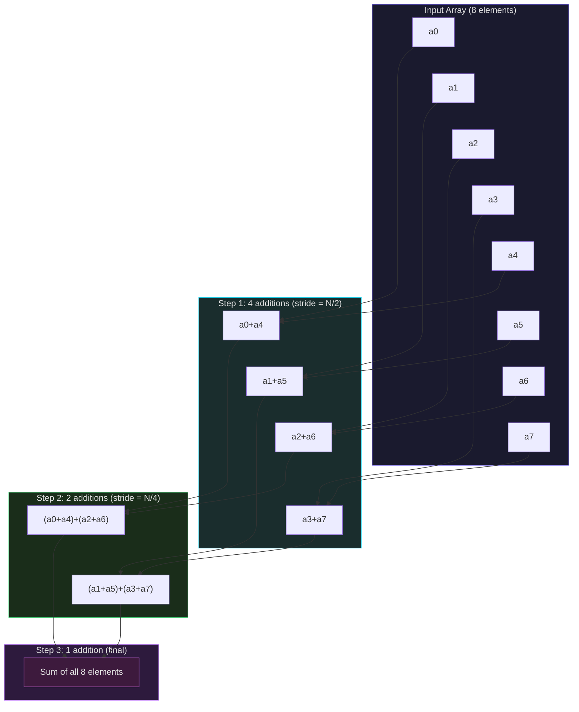
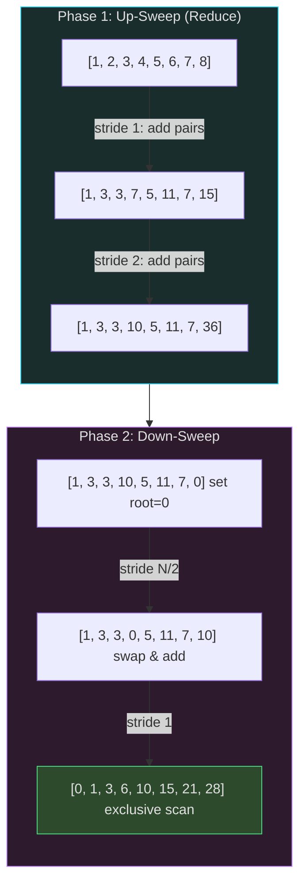
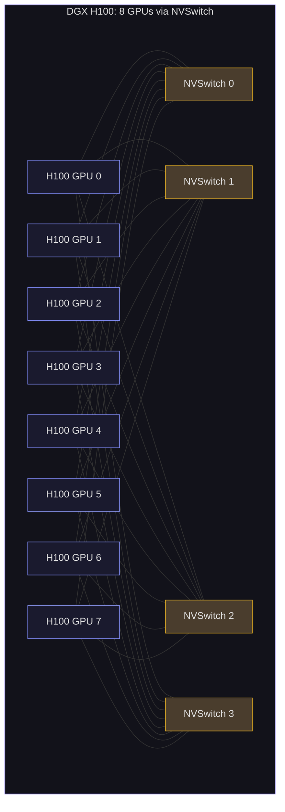

# GPU Optimization: Reduction, Scan, GEMM, and Multi-GPU

This lecture covers the four most important parallel algorithms in GPU computing: parallel reduction, prefix scan, tiled matrix multiplication, and multi-GPU communication via Ring-AllReduce. These are not academic exercises -- they are the actual primitives inside cuBLAS, cuDNN, and NCCL that power every large-scale AI training run.

We will build each algorithm from a naive implementation through progressively optimized versions, understanding exactly why each optimization works in terms of the hardware concepts from Week 13: warp execution, memory coalescing, shared memory bank conflicts, and occupancy.

## Parallel Reduction: Five Levels of Optimization

The **reduction** problem: given an array of $N$ values, compute their sum (or any associative operator). On a CPU this is trivially $O(N)$. On a GPU, the challenge is computing the sum in $O(\log N)$ parallel steps while maximizing hardware utilization.

Mark Harris's classic NVIDIA presentation identified five optimization levels for parallel reduction. Each level addresses a specific hardware bottleneck. Let us implement and analyze all five.

### Version 1: Interleaved Addressing with Divergent Branching

The most intuitive parallel reduction: in each step, half the threads add their value to a neighbor:

```python
def reduction_v1(data):
    """Version 1: Interleaved addressing with divergent branching.

    Step 0: stride=1, threads 0,2,4,6,... add data[i+1] to data[i]
    Step 1: stride=2, threads 0,4,8,12,... add data[i+2] to data[i]
    Step 2: stride=4, threads 0,8,16,24,... add data[i+4] to data[i]
    ...

    Problem: Thread divergence! In step 0, threads 1,3,5,7,... are idle.
    In step k, only 1/2^(k+1) of threads are active.
    """
    n = len(data)
    shared = list(data)  # Simulate shared memory

    stride = 1
    active_threads_per_step = []

    while stride < n:
        active = 0
        for i in range(n):
            if i % (2 * stride) == 0 and i + stride < n:
                shared[i] += shared[i + stride]
                active += 1
        active_threads_per_step.append(active)
        stride *= 2

    return shared[0], active_threads_per_step
```

The following diagram shows the parallel reduction tree across all five optimization levels. Data flows upward as pairs of values are summed, halving the active elements at each step.



**Problem**: The condition `i % (2 * stride) == 0` causes **warp divergence**. In step 0, threads 0 and 1 of a warp take different paths (0 adds, 1 is idle). Within every warp, half the threads are masked off -- but both paths must still execute, wasting half the warp's throughput.

### Version 2: Interleaved Addressing without Divergent Branching

Eliminate divergence by changing the index calculation:

```python
def reduction_v2(data):
    """Version 2: Sequential addressing -- no divergent branching.

    Instead of thread i checking if i % (2*stride) == 0,
    use thread index directly: thread tid adds elements
    at positions tid and tid + stride.

    Now the first N/2 threads are active, the rest are idle.
    Threads 0..N/2-1 are contiguous -> no warp divergence
    within active warps.
    """
    n = len(data)
    shared = list(data)
    active_threads_per_step = []

    stride = n // 2

    while stride > 0:
        active = 0
        for tid in range(stride):
            shared[tid] += shared[tid + stride]
            active += 1
        active_threads_per_step.append(active)
        stride //= 2

    return shared[0], active_threads_per_step
```

**Improvement**: In step 0, threads 0 through $N/2 - 1$ are all active, and threads $N/2$ through $N-1$ are all inactive. Within active warps, all threads take the same branch -- no divergence. Only the last few warps (at the boundary between active and inactive threads) have any divergence.

**Remaining problem**: In the first step, we read `shared[tid]` and `shared[tid + stride]`. If stride is large (e.g., $N/2 = 512$), these reads are far apart in shared memory and may cause **bank conflicts**.

### Version 3: First Add During Global Memory Load

Observation: Version 2 launches $N$ threads but only $N/2$ are active in the first step. We are wasting half our thread budget. Instead, launch $N/2$ threads and have each thread load *and add* two elements during the initial global memory load:

```python
def reduction_v3(data):
    """Version 3: First add during load -- halve the blocks needed.

    Each thread loads two elements from global memory and adds them
    immediately. This halves the number of blocks needed, doubling
    the work per thread.
    """
    n = len(data)
    half_n = n // 2
    shared = [0.0] * half_n

    # First add happens during load
    for tid in range(half_n):
        shared[tid] = data[tid] + data[tid + half_n]

    # Then reduce as before
    active_threads_per_step = []
    stride = half_n // 2

    while stride > 0:
        active = 0
        for tid in range(stride):
            shared[tid] += shared[tid + stride]
            active += 1
        active_threads_per_step.append(active)
        stride //= 2

    return shared[0], active_threads_per_step
```

**Improvement**: Halves the number of blocks needed. Since each block consumes SM resources (registers, shared memory, warp slots), fewer blocks means either higher occupancy for remaining blocks or the ability to run more blocks from other kernels. This typically gives a 2x speedup.

### Version 4: Unroll the Last Warp

When fewer than 32 elements remain (one warp's worth), there is no need for `__syncthreads()` -- all remaining threads are in the same warp and execute in lockstep (pre-Volta) or can use `__syncwarp()` (Volta+):

```python
def reduction_v4(data):
    """Version 4: Unroll the last warp -- no sync needed for <= 32 elements.

    When stride <= 16 (i.e., active threads fit in one warp),
    warp-level execution guarantees ordering. On pre-Volta hardware,
    threads execute in lockstep within a warp. On Volta+, use
    __syncwarp() or warp shuffle.

    This avoids __syncthreads() overhead for the final 5 steps.
    """
    n = len(data)
    half_n = n // 2
    shared = [0.0] * half_n

    # First add during load
    for tid in range(half_n):
        shared[tid] = data[tid] + data[tid + half_n]

    active_threads_per_step = []

    # Regular reduction with sync for stride > 16
    stride = half_n // 2
    while stride > 16:
        active = 0
        for tid in range(stride):
            shared[tid] += shared[tid + stride]
            active += 1
        active_threads_per_step.append(active)
        stride //= 2

    # Warp-level reduction (no __syncthreads needed)
    warp_label = "warp_unrolled"
    warp_ops = 0
    while stride > 0:
        for tid in range(stride):
            shared[tid] += shared[tid + stride]
            warp_ops += 1
        stride //= 2
    active_threads_per_step.append(warp_ops)

    return shared[0], active_threads_per_step
```

**Improvement**: Eliminates 5 `__syncthreads()` barriers (for the last warp: stride 16, 8, 4, 2, 1). Each `__syncthreads()` has non-trivial cost (~20 cycles), and more importantly, it prevents the compiler from overlapping instructions across the barrier.

### Version 5: Complete Unrolling with Templates

In CUDA, when the block size is known at compile time (via a template parameter), the compiler can completely unroll the reduction loop, eliminating all loop overhead and enabling maximum instruction-level parallelism:

```python
def reduction_v5(data, block_size=256):
    """Version 5: Completely unrolled reduction.

    In real CUDA, template<unsigned int blockSize> allows the compiler
    to unroll everything. Dead code elimination removes branches for
    strides larger than blockSize. We simulate this by unrolling manually.
    """
    n = len(data)
    half_n = n // 2
    shared = [0.0] * half_n

    # First add during load
    for tid in range(half_n):
        shared[tid] = data[tid] + data[tid + half_n]

    # Completely unrolled -- each stride is an explicit step
    # Compiler eliminates strides >= block_size
    effective_half = min(half_n, block_size)

    if effective_half >= 512:
        for tid in range(256):
            shared[tid] += shared[tid + 256]
    if effective_half >= 256:
        for tid in range(128):
            shared[tid] += shared[tid + 128]
    if effective_half >= 128:
        for tid in range(64):
            shared[tid] += shared[tid + 64]
    if effective_half >= 64:
        for tid in range(32):
            shared[tid] += shared[tid + 32]

    # Last warp (unrolled, no sync)
    for tid in range(min(16, effective_half)):
        shared[tid] += shared[tid + 16]
    for tid in range(min(8, effective_half)):
        shared[tid] += shared[tid + 8]
    for tid in range(min(4, effective_half)):
        shared[tid] += shared[tid + 4]
    for tid in range(min(2, effective_half)):
        shared[tid] += shared[tid + 2]
    if effective_half >= 1:
        shared[0] += shared[1]

    return shared[0]
```

Let us compare all five versions:

```python
import time

def benchmark_reductions():
    """Compare all 5 reduction versions."""
    sizes = [64, 256, 1024]

    for n in sizes:
        data = [float(i) for i in range(n)]
        expected = sum(data)

        r1, steps1 = reduction_v1(data)
        r2, steps2 = reduction_v2(data)
        r3, steps3 = reduction_v3(data)
        r4, steps4 = reduction_v4(data)
        r5 = reduction_v5(data)

        print(f"\n--- N = {n} ---")
        print(f"Expected sum: {expected:.0f}")
        print(f"V1 (divergent):     {r1:.0f}  steps={len(steps1)}, active/step={steps1}")
        print(f"V2 (sequential):    {r2:.0f}  steps={len(steps2)}")
        print(f"V3 (first add):     {r3:.0f}  steps={len(steps3)}")
        print(f"V4 (unroll warp):   {r4:.0f}")
        print(f"V5 (full unroll):   {r5:.0f}")

        assert abs(r1 - expected) < 1e-6, f"V1 wrong: {r1} != {expected}"
        assert abs(r2 - expected) < 1e-6, f"V2 wrong"
        assert abs(r3 - expected) < 1e-6, f"V3 wrong"
        assert abs(r4 - expected) < 1e-6, f"V4 wrong"
        assert abs(r5 - expected) < 1e-6, f"V5 wrong"

    print("\nAll versions produce correct results.")

benchmark_reductions()
```

<ConceptCheck id="cc-1" />

## Parallel Prefix Sum (Scan)

The **prefix sum** (or **scan**) computes the running total of an array:

$$\text{scan}([a_0, a_1, a_2, \ldots, a_{n-1}]) = [a_0, a_0+a_1, a_0+a_1+a_2, \ldots, \sum_{i=0}^{n-1} a_i]$$

This is the *inclusive* scan. The *exclusive* scan shifts the output right by one position (with 0 as the first element).

Scan is surprisingly fundamental -- it appears in sorting (radix sort), stream compaction, sparse matrix operations, and histogram computation.

### Hillis-Steele Scan (Work-Inefficient, Step-Efficient)

The Hillis-Steele algorithm completes in $\lceil \log_2 n \rceil$ steps, but performs $O(n \log n)$ total work:

```python
def hillis_steele_scan(data):
    """Hillis-Steele inclusive scan.

    Step k: for each i >= 2^k, output[i] = input[i] + input[i - 2^k]

    Steps: ceil(log2(n))
    Total work: O(n log n) -- MORE work than sequential!
    But only log(n) parallel steps.
    """
    n = len(data)
    current = list(data)

    step = 1
    num_steps = 0
    while step < n:
        next_arr = list(current)
        for i in range(step, n):
            next_arr[i] = current[i] + current[i - step]
        current = next_arr
        step *= 2
        num_steps += 1

    return current, num_steps
```

### Blelloch Scan (Work-Efficient)

The Blelloch algorithm has two phases: an up-sweep (reduce) that builds partial sums bottom-up, and a down-sweep that distributes those partial sums to compute the exclusive prefix sum.



The Blelloch algorithm performs $O(n)$ work in $2 \lceil \log_2 n \rceil$ steps -- work-efficient but twice the step count of Hillis-Steele:

```python
def blelloch_scan(data):
    """Blelloch work-efficient exclusive scan.

    Phase 1 (Up-Sweep / Reduce):
      Build a reduction tree bottom-up.
      After this phase, the last element contains the total sum.

    Phase 2 (Down-Sweep):
      Traverse the tree top-down, distributing partial sums.
      Set the last element to 0 (identity for addition).
      At each level, each node sends its value to the right child
      and the sum of itself and the right child to the left child.

    Total work: O(n)
    Total steps: 2 * ceil(log2(n))
    """
    n = len(data)
    # Pad to power of 2
    size = 1
    while size < n:
        size *= 2
    arr = list(data) + [0.0] * (size - n)

    # Up-sweep (reduce)
    stride = 1
    while stride < size:
        for i in range(stride - 1, size - 1, 2 * stride):
            arr[i + stride] += arr[i]
        stride *= 2

    # Set root to identity
    arr[size - 1] = 0.0

    # Down-sweep
    stride = size // 2
    while stride >= 1:
        for i in range(stride - 1, size - 1, 2 * stride):
            temp = arr[i]
            arr[i] = arr[i + stride]
            arr[i + stride] += temp
        stride //= 2

    return arr[:n]  # Exclusive scan result
```

Let us verify both implementations:

```python
def verify_scans():
    """Verify Hillis-Steele (inclusive) and Blelloch (exclusive) scans."""
    import itertools

    data = [1.0, 2.0, 3.0, 4.0, 5.0, 6.0, 7.0, 8.0]

    # Inclusive scan: [1, 3, 6, 10, 15, 21, 28, 36]
    hs_result, hs_steps = hillis_steele_scan(data)
    expected_inclusive = list(itertools.accumulate(data))
    assert hs_result == expected_inclusive, f"HS scan wrong: {hs_result} != {expected_inclusive}"
    print(f"Hillis-Steele (inclusive): {hs_result}")
    print(f"  Steps: {hs_steps}, Work: O(n log n) = O({len(data)} * {hs_steps})")

    # Exclusive scan: [0, 1, 3, 6, 10, 15, 21, 28]
    bl_result = blelloch_scan(data)
    expected_exclusive = [0.0] + expected_inclusive[:-1]
    assert bl_result == expected_exclusive, f"Blelloch scan wrong: {bl_result} != {expected_exclusive}"
    print(f"Blelloch (exclusive):     {bl_result}")
    print(f"  Steps: 2 * log2(n), Work: O(n)")

    # Larger test
    data_large = [float(i + 1) for i in range(16)]
    bl_large = blelloch_scan(data_large)
    expected_large = [0.0] + list(itertools.accumulate(data_large))[:-1]
    assert bl_large == expected_large, f"Blelloch large wrong"
    print(f"\nBlelloch scan of [1..16]: {bl_large}")

verify_scans()
```

### Bank-Conflict-Free Implementation

The Blelloch scan accesses shared memory with power-of-2 strides, which causes bank conflicts. The fix: add padding to offset every $2^k$-th element:

$$\text{conflict\_free\_offset}(i) = i + \left\lfloor \frac{i}{32} \right\rfloor$$

This ensures that elements separated by a stride of 32 are offset by 1 extra position, mapping to different banks.

<ConceptCheck id="cc-2" />

## Tiled Matrix Multiply on GPU

Matrix multiplication ($C = AB$ where $A$ is $M \times K$ and $B$ is $K \times N$) is the most important operation in deep learning. A naive GPU implementation achieves only a fraction of peak performance because each element of $C$ requires reading an entire row of $A$ and column of $B$ from global memory. **Tiling** (also called blocking) uses shared memory to amortize global memory accesses.

### Naive Implementation

```python
def matmul_naive(A, B):
    """Naive matrix multiply: each thread computes one element of C.

    Thread (row, col) computes C[row][col] = sum(A[row][k] * B[k][col] for k)

    Problem: Each thread reads M elements from A and N elements from B
    from global memory. Total global memory reads = M * N * K.
    With K = 4096, each thread reads 8192 floats from global memory.
    """
    M = len(A)
    K = len(A[0])
    N = len(B[0])
    C = [[0.0] * N for _ in range(M)]

    global_reads = 0

    for row in range(M):
        for col in range(N):
            total = 0.0
            for k in range(K):
                total += A[row][k] * B[k][col]
                global_reads += 2  # One read from A, one from B
            C[row][col] = total

    return C, global_reads
```

### Tiled Implementation

The key insight: threads within a block can cooperatively load a tile of $A$ and a tile of $B$ into shared memory, then compute partial dot products from shared memory. Each global memory value is read once into shared memory and used by all threads in the tile.

```mermaid
flowchart LR
    subgraph A["Matrix A (M x K)"]
        AT["Tile of A\n(TILE x TILE)"]
    end

    subgraph SM["Shared Memory"]
        SMA["Tile A\ncopy"]
        SMB["Tile B\ncopy"]
    end

    subgraph B["Matrix B (K x N)"]
        BT["Tile of B\n(TILE x TILE)"]
    end

    subgraph C["Output C (M x N)"]
        CT["Partial sums\naccumulated\nover K/TILE steps"]
    end

    AT -->|"Load once\nfrom Global"| SMA
    BT -->|"Load once\nfrom Global"| SMB
    SMA -->|"TILE reads\nfrom Shared"| CT
    SMB -->|"TILE reads\nfrom Shared"| CT

    style A fill:#1a1a2e,stroke:#818cf8,color:#e0e0e0
    style B fill:#1a1a2e,stroke:#818cf8,color:#e0e0e0
    style SM fill:#1a2d1a,stroke:#4ade80,color:#e0e0e0
    style C fill:#2d1a3d,stroke:#c084fc,color:#e0e0e0
    style AT fill:#2d2d4a,stroke:#818cf8
    style BT fill:#2d2d4a,stroke:#818cf8
    style SMA fill:#2d4a2d,stroke:#4ade80
    style SMB fill:#2d4a2d,stroke:#4ade80
    style CT fill:#3d1a3d,stroke:#e879f9
```



```python
def matmul_tiled(A, B, TILE_SIZE=16):
    """Tiled matrix multiply using shared memory.

    Algorithm:
    1. Divide C into TILE_SIZE x TILE_SIZE tiles
    2. For each tile of C:
       a. Load TILE_SIZE x TILE_SIZE block of A into shared memory
       b. Load TILE_SIZE x TILE_SIZE block of B into shared memory
       c. __syncthreads()
       d. Each thread computes TILE_SIZE multiply-adds from shared memory
       e. __syncthreads()
       f. Slide to the next tile along the K dimension
    3. Write final results to global memory

    Global reads reduced by factor of TILE_SIZE!
    Naive: 2 * M * N * K reads
    Tiled: 2 * M * N * K / TILE_SIZE reads
    """
    M = len(A)
    K = len(A[0])
    N = len(B[0])
    C = [[0.0] * N for _ in range(M)]

    global_reads = 0
    shared_reads = 0
    num_tiles_k = (K + TILE_SIZE - 1) // TILE_SIZE

    # For each tile of output C
    for block_row in range(0, M, TILE_SIZE):
        for block_col in range(0, N, TILE_SIZE):

            # Accumulate over tiles along K dimension
            for t in range(num_tiles_k):
                # Load tile of A into "shared memory"
                tile_A = [[0.0] * TILE_SIZE for _ in range(TILE_SIZE)]
                for i in range(TILE_SIZE):
                    for j in range(TILE_SIZE):
                        r = block_row + i
                        c = t * TILE_SIZE + j
                        if r < M and c < K:
                            tile_A[i][j] = A[r][c]
                            global_reads += 1

                # Load tile of B into "shared memory"
                tile_B = [[0.0] * TILE_SIZE for _ in range(TILE_SIZE)]
                for i in range(TILE_SIZE):
                    for j in range(TILE_SIZE):
                        r = t * TILE_SIZE + i
                        c = block_col + j
                        if r < K and c < N:
                            tile_B[i][j] = B[r][c]
                            global_reads += 1

                # __syncthreads() -- all threads done loading

                # Each thread computes partial dot product from shared memory
                for i in range(TILE_SIZE):
                    for j in range(TILE_SIZE):
                        row = block_row + i
                        col = block_col + j
                        if row < M and col < N:
                            for k in range(TILE_SIZE):
                                C[row][col] += tile_A[i][k] * tile_B[k][j]
                                shared_reads += 2

                # __syncthreads() -- safe to overwrite shared memory

    return C, global_reads, shared_reads


def compare_matmul():
    """Compare naive vs tiled matrix multiply."""
    M, K, N = 32, 64, 32

    A = [[float(i * K + j) * 0.01 for j in range(K)] for i in range(M)]
    B = [[float(i * N + j) * 0.01 for j in range(N)] for i in range(K)]

    C_naive, reads_naive = matmul_naive(A, B)
    C_tiled, reads_tiled_global, reads_tiled_shared = matmul_tiled(A, B, TILE_SIZE=16)

    # Verify correctness
    max_diff = 0.0
    for i in range(M):
        for j in range(N):
            diff = abs(C_naive[i][j] - C_tiled[i][j])
            max_diff = max(max_diff, diff)
    assert max_diff < 1e-6, f"Results differ by {max_diff}"

    reduction = reads_naive / reads_tiled_global if reads_tiled_global > 0 else float('inf')
    print(f"Matrix multiply {M}x{K} * {K}x{N}:")
    print(f"  Naive: {reads_naive:,} global memory reads")
    print(f"  Tiled (TILE=16): {reads_tiled_global:,} global reads, {reads_tiled_shared:,} shared reads")
    print(f"  Global read reduction: {reduction:.1f}x")
    print(f"  Max difference: {max_diff:.2e}")

compare_matmul()
```

The reduction in global memory accesses is approximately equal to `TILE_SIZE`. For $\text{TILE\_SIZE} = 16$, global reads drop by ~16x. For $\text{TILE\_SIZE} = 32$, they drop by ~32x. This is why tiled GEMM achieves 80-90% of peak on the H100 -- the shared memory tile converts the kernel from memory-bound to compute-bound.

<ConceptCheck id="cc-3" />

## Multi-GPU: NVLink, NVSwitch, and Ring-AllReduce

Training large neural networks requires multiple GPUs. A single H100 can store at most 80 GB of HBM3 -- not enough for models with hundreds of billions of parameters. Multi-GPU systems connect GPUs via high-bandwidth interconnects and use collective communication algorithms to synchronize gradients.

### NVLink: GPU-to-GPU Interconnect

NVLink provides direct GPU-to-GPU communication at bandwidth far exceeding PCIe:

| Generation | Architecture | Per-Link BW (bidir.) | Links/GPU | Total BW/GPU |
|---|---|---|---|---|
| NVLink 1.0 | Pascal (P100) | 40 GB/s | 4 | 160 GB/s |
| NVLink 2.0 | Volta (V100) | 50 GB/s | 6 | 300 GB/s |
| NVLink 3.0 | Ampere (A100) | 50 GB/s | 12 | 600 GB/s |
| NVLink 4.0 | Hopper (H100) | 50 GB/s | 18 | 900 GB/s |
| NVLink 5.0 | Blackwell (B200) | 100 GB/s | 18 | 1,800 GB/s |

The H100 has 18 NVLink 4.0 sub-links, each providing 50 GB/s bidirectional bandwidth (25 GB/s per direction). In the DGX H100 system, 8 GPUs are connected through 4 NVSwitch 3.0 chips in a full-mesh topology: any GPU can communicate with any other at the full 900 GB/s.



### NVSwitch: The Crossbar

NVSwitch is a separate chip that acts as a crossbar switch for NVLink:

| NVSwitch Gen | Architecture | Ports | BW | Max GPUs |
|---|---|---|---|---|
| NVSwitch 3.0 | Hopper | 64 | 3.2 TB/s | 8 (DGX H100) |
| NVLink Switch | Blackwell | 72 | 3.6 TB/s | 576 (NVLink domain) |

The Blackwell NVLink Switch enables connecting up to **576 GPUs** in a single NVLink domain (the GB200 NVL72 rack) with full bisection bandwidth: $72 \times 1.8 \text{ TB/s} / 2 = 64.8$ TB/s total bisection bandwidth.

### GPUDirect Technologies

- **Peer-to-Peer (P2P)**: Direct memory access between GPUs on the same node. No staging through CPU memory.
- **GPUDirect RDMA**: Network adapters (InfiniBand) read/write GPU memory directly, bypassing the CPU entirely: GPU Memory <-> NIC <-> Network <-> NIC <-> GPU Memory.
- **GPUDirect Storage**: Direct data path between GPU memory and NVMe/NFS storage. Bypasses CPU bounce buffer for dataset loading.

### NCCL: The Communication Library

NCCL (NVIDIA Collective Communications Library, pronounced "nickel") provides optimized collective operations:

| Collective | Operation | Used in |
|---|---|---|
| `AllReduce` | Reduce + broadcast to all GPUs | Data-parallel gradient sync |
| `AllGather` | Gather arrays from all to all | ZeRO Stage 3 |
| `ReduceScatter` | Reduce, scatter chunks | ZeRO Stage 2 |
| `Broadcast` | One GPU to all | Parameter initialization |
| `Send/Recv` | Point-to-point | Pipeline parallelism |

NCCL automatically detects the topology (NVLink, PCIe, InfiniBand) and selects the optimal algorithm (ring, tree, or hybrid).

### Ring-AllReduce: The Bandwidth-Optimal Algorithm

Ring-AllReduce is the workhorse algorithm for gradient synchronization in distributed training. Given $N$ GPUs, each holding an array of $K$ values, it computes the element-wise sum and distributes the result to all GPUs.

```mermaid
flowchart TB
    subgraph RING["Ring-AllReduce: 4 GPUs"]
        direction TB
        subgraph TOPO["Ring Topology"]
            direction LR
            G0["GPU 0"] -->|"chunk"| G1["GPU 1"]
            G1 -->|"chunk"| G2["GPU 2"]
            G2 -->|"chunk"| G3["GPU 3"]
            G3 -->|"chunk"| G0
        end
        subgraph PHASE1["Phase 1: Scatter-Reduce (N-1 steps)"]
            P1["Each GPU sends 1 chunk, receives & reduces 1 chunk\nAfter N-1 steps: each GPU owns 1 fully-reduced chunk"]
        end
        subgraph PHASE2["Phase 2: AllGather (N-1 steps)"]
            P2["Each GPU sends its reduced chunk around the ring\nAfter N-1 steps: all GPUs have the complete result"]
        end
    end

    TOPO --> PHASE1 --> PHASE2

    style RING fill:#12121a,stroke:#6c5ce7,color:#e0e0e0
    style TOPO fill:#1a1a2e,stroke:#a29bfe,color:#e0e0e0
    style PHASE1 fill:#1a2d2d,stroke:#22d3ee,color:#e0e0e0
    style PHASE2 fill:#2d1a2d,stroke:#c084fc,color:#e0e0e0
    style G0 fill:#2d2d4a,stroke:#818cf8
    style G1 fill:#2d4a2d,stroke:#4ade80
    style G2 fill:#4a2d2d,stroke:#f87171
    style G3 fill:#4a3d2d,stroke:#fbbf24
```



$$\text{AllReduce}: \{x_0, x_1, \ldots, x_{N-1}\} \rightarrow \{S, S, \ldots, S\}$$

where $S = x_0 + x_1 + \cdots + x_{N-1}$ (element-wise).

**Phase 1: Scatter-Reduce** ($N-1$ steps)

1. Partition each GPU's array into $N$ chunks of size $K/N$.
2. Arrange GPUs in a ring: GPU$_0 \to$ GPU$_1 \to \cdots \to$ GPU$_{N-1} \to$ GPU$_0$.
3. In step $s$ ($s = 0, 1, \ldots, N-2$): each GPU sends one chunk to the next GPU in the ring and receives one chunk from the previous, adding (reducing) the received chunk into its local copy.

After $N-1$ steps, each GPU holds one fully-reduced chunk (a different chunk on each GPU).

**Phase 2: AllGather** ($N-1$ steps)

Each GPU sends its fully-reduced chunk around the ring. After $N-1$ steps, all GPUs hold the complete reduced array.

**Communication Volume Per GPU**:

In each of the $2(N-1)$ steps, each GPU sends and receives $K/N$ values:

$$\text{Total data sent per GPU} = 2 \cdot \frac{N-1}{N} \cdot K$$

**Why this is bandwidth-optimal**: Any AllReduce algorithm must transfer at least $2(N-1)/N \cdot K$ data per GPU (each GPU must send at least $(N-1)/N$ of its data and receive at least $(N-1)/N$ of the reduced result). Ring-AllReduce **matches this lower bound exactly**.

For large $N$: $2(N-1)/N \approx 2$, meaning each GPU transfers approximately $2K$ data regardless of the number of GPUs. The algorithm scales almost perfectly with node count.

```python
def ring_allreduce(gpu_data, verbose=False):
    """Simulate Ring-AllReduce for N GPUs.

    Args:
        gpu_data: list of N arrays, each of length K
        verbose: print step-by-step progress

    Returns:
        (reduced_data, stats) where reduced_data is the list of N arrays
        after AllReduce, and stats contains communication volume info.
    """
    N = len(gpu_data)
    K = len(gpu_data[0])
    assert K % N == 0, f"K={K} must be divisible by N={N}"
    chunk_size = K // N

    # Make copies to avoid modifying input
    data = [list(arr) for arr in gpu_data]
    total_sent = 0
    total_received = 0

    if verbose:
        print(f"Ring-AllReduce: {N} GPUs, {K} elements, {chunk_size} per chunk")
        print(f"\nInitial state:")
        for g in range(N):
            print(f"  GPU {g}: {data[g]}")

    # Phase 1: Scatter-Reduce (N-1 steps)
    if verbose:
        print(f"\n--- Phase 1: Scatter-Reduce ({N-1} steps) ---")

    for step in range(N - 1):
        new_data = [list(arr) for arr in data]
        for gpu in range(N):
            # Send chunk index
            send_chunk_idx = (gpu - step) % N
            # Receive chunk from previous GPU
            recv_gpu = (gpu - 1) % N
            recv_chunk_idx = (recv_gpu - step) % N

            # Get the chunk to receive
            start = recv_chunk_idx * chunk_size
            end = start + chunk_size

            # Add received chunk to local chunk
            for i in range(start, end):
                new_data[gpu][i] = data[gpu][i] + data[recv_gpu][i]

            total_sent += chunk_size
            total_received += chunk_size

        data = new_data

        if verbose:
            print(f"\n  Step {step + 1}:")
            for g in range(N):
                print(f"    GPU {g}: {data[g]}")

    # Phase 2: AllGather (N-1 steps)
    if verbose:
        print(f"\n--- Phase 2: AllGather ({N-1} steps) ---")

    for step in range(N - 1):
        new_data = [list(arr) for arr in data]
        for gpu in range(N):
            recv_gpu = (gpu - 1) % N
            # The chunk that recv_gpu has fully reduced
            chunk_idx = (recv_gpu - step + 1) % N
            start = chunk_idx * chunk_size
            end = start + chunk_size

            # Copy (not reduce) the chunk
            for i in range(start, end):
                new_data[gpu][i] = data[recv_gpu][i]

            total_sent += chunk_size
            total_received += chunk_size

        data = new_data

        if verbose:
            print(f"\n  Step {step + 1}:")
            for g in range(N):
                print(f"    GPU {g}: {data[g]}")

    # Compute expected communication volume
    expected_per_gpu = 2 * (N - 1) / N * K
    actual_per_gpu = total_sent / N

    stats = {
        'num_gpus': N,
        'array_size': K,
        'chunk_size': chunk_size,
        'total_steps': 2 * (N - 1),
        'data_sent_per_gpu': actual_per_gpu,
        'expected_per_gpu': expected_per_gpu,
        'bandwidth_optimal': abs(actual_per_gpu - expected_per_gpu) < 1e-6,
    }

    return data, stats


# Example with 4 GPUs
gpu_data = [
    [1.0, 2.0, 3.0, 4.0],   # GPU 0
    [10.0, 20.0, 30.0, 40.0], # GPU 1
    [100.0, 200.0, 300.0, 400.0], # GPU 2
    [1000.0, 2000.0, 3000.0, 4000.0], # GPU 3
]

result, stats = ring_allreduce(gpu_data, verbose=True)

# Verify: all GPUs should have the same values (element-wise sum)
expected = [sum(gpu_data[g][i] for g in range(4)) for i in range(4)]
print(f"\nExpected result: {expected}")
for g in range(4):
    print(f"GPU {g}: {result[g]}")
    assert result[g] == expected, f"GPU {g} result wrong: {result[g]} != {expected}"

print(f"\nCommunication stats:")
print(f"  Total steps: {stats['total_steps']}")
print(f"  Data sent per GPU: {stats['data_sent_per_gpu']:.1f} elements")
print(f"  Expected (bandwidth-optimal): {stats['expected_per_gpu']:.1f} elements")
print(f"  Bandwidth-optimal: {stats['bandwidth_optimal']}")
```

<ConceptCheck id="cc-4" />

## Radix Sort on GPU

GPU radix sort leverages scan for scatter operations. The algorithm:

1. **Per-block sort**: Each block sorts its portion using shared memory.
2. **Digit extraction**: Process bits from LSB to MSB (4 bits at a time for 16-way radix).
3. **Prefix sum (scan)**: For each digit value, compute the output position using scan.
4. **Scatter**: Write elements to their computed positions in global memory.

The key insight: radix sort is naturally parallelizable because each radix pass is independent, and the scan operation (which determines output positions) is the Blelloch algorithm we implemented above.

On the H100, the CUB library's `cub::DeviceRadixSort::SortKeys` sorts 1 billion 32-bit keys in approximately 50 milliseconds -- roughly 80 GB/s of effective throughput, limited primarily by memory bandwidth.

## Summary: The GPU Optimization Hierarchy

When optimizing a GPU kernel, follow this order:

1. **Choose the right algorithm**: An O(n log n) algorithm that maps well to GPU beats an O(n) algorithm that doesn't.
2. **Maximize memory coalescing**: Consecutive threads access consecutive addresses. This alone can yield 10-32x improvement.
3. **Use shared memory for data reuse**: Convert repeated global memory accesses into cheap shared memory accesses. Reduce global memory traffic by a factor of TILE_SIZE.
4. **Eliminate bank conflicts**: Pad shared memory arrays or use swizzling. 20%+ improvement for matrix operations.
5. **Optimize occupancy**: Balance register usage, shared memory, and block size. Target 50%+ occupancy for good latency hiding.
6. **Unroll and specialize**: Template-based unrolling, warp-level operations, reducing synchronization barriers.

The progression from a naive GEMM to cuBLAS-level performance involves all of these steps, plus register blocking, double buffering, and instruction scheduling -- achieving 80-90% of the H100's 989 TFLOPS TF32 peak.

**Project 4 connection**: In Milestones 2 and 3, you will implement tiled matrix multiplication and Ring-AllReduce in your GPU simulator. The algorithms in this lecture translate directly to your simulator's execution model -- use them as reference implementations.
