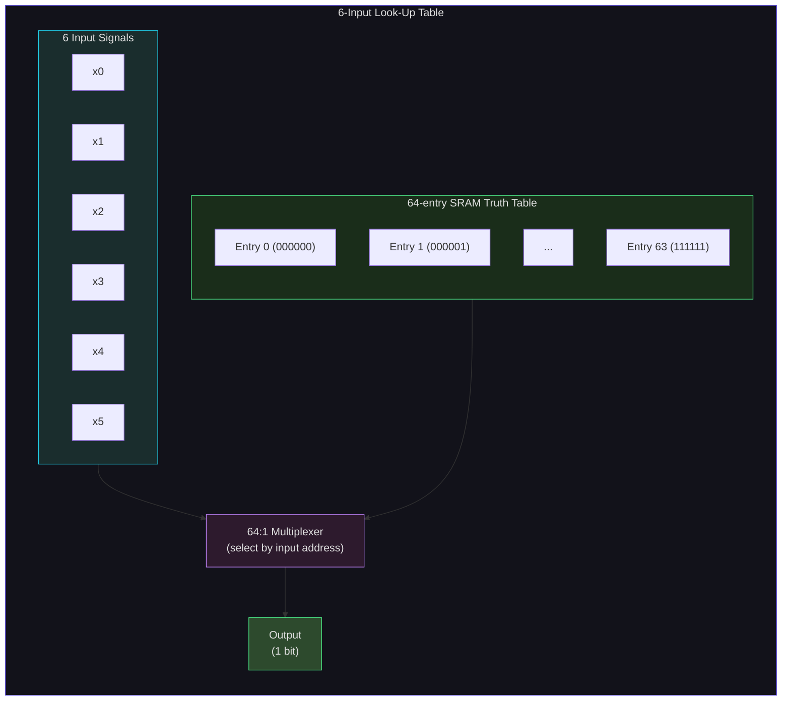
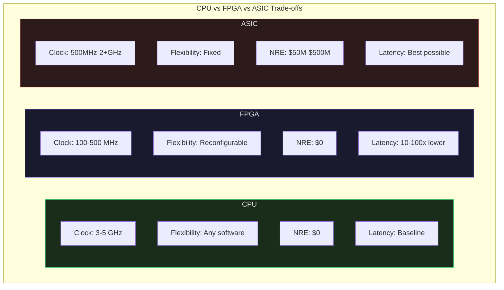
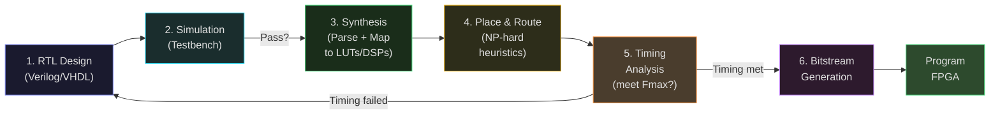

# FPGA Architecture: LUTs, BRAMs, and Programmable Logic

Every computing device you have studied so far in this course -- CPUs, GPUs, caches -- has been an Application-Specific Integrated Circuit. An ASIC. The logic was frozen in silicon at the foundry, and no amount of software can change the physical wiring. An FPGA is the opposite: a chip whose hardware you program after manufacturing. A Field-Programmable Gate Array lets you define custom digital circuits, reconfigure them in milliseconds, and achieve latencies that no CPU can match -- because there is no instruction fetch, no decode, no cache miss. The logic *is* the circuit.

This lecture dissects the architecture of modern FPGAs from the ground up: what's inside the chip, how each resource maps to the circuits you design, and when you should choose an FPGA over a CPU or a full custom ASIC.

## What is an FPGA?

An FPGA is a semiconductor device containing an array of programmable logic blocks connected by a reconfigurable interconnect. The key word is *reconfigurable*: unlike an ASIC where the logic gates and wires are etched permanently during fabrication, an FPGA's function is determined by configuration data loaded into SRAM cells after the chip is manufactured. Change the configuration bitstream, and you change what the hardware does.

The concept dates to 1985, when Xilinx (now part of AMD) shipped the XC2064 -- 64 Configurable Logic Blocks and 58 I/O pins, fabricated on a 2-micron process. Today's largest FPGAs contain over 8 million Look-Up Tables, hundreds of megabits of on-chip memory, thousands of DSP blocks, hard processor cores, and network-on-chip routers -- all on a single die fabricated at TSMC 7nm.

The essential idea has not changed: you describe your circuit in a Hardware Description Language (Verilog or VHDL), synthesis tools map it to the FPGA's resources, and place-and-route tools physically position each logic element and wire each connection. The result is a bitstream -- a binary file that programs the FPGA's configuration SRAM.

## FPGA Internals

The following block diagram shows the major internal components of a modern FPGA. CLBs provide programmable logic, BRAMs provide on-chip storage, DSP blocks provide hardened arithmetic, and the programmable routing interconnect (over 70% of die area) connects everything together.

```mermaid
flowchart TD
    subgraph FPGA["Modern FPGA Internal Architecture"]
        subgraph ROW1[" "]
            direction LR
            IO1["I/O\nBank"] ~~~ CLB1["CLB\n(4 LUTs\n8 FFs)"] ~~~ BRAM1["BRAM\n36Kb"] ~~~ CLB2["CLB"] ~~~ IO2["I/O\nBank"]
        end
        subgraph ROW2[" "]
            direction LR
            ROUT1["Routing"] ~~~ CLB3["CLB"] ~~~ DSP1["DSP58\n27x24\nMAC"] ~~~ CLB4["CLB"] ~~~ ROUT2["Routing"]
        end
        subgraph ROW3[" "]
            direction LR
            IO3["I/O\nBank"] ~~~ CLB5["CLB"] ~~~ BRAM2["BRAM\n36Kb"] ~~~ CLB6["CLB"] ~~~ IO4["I/O\nBank"]
        end
        subgraph ROW4[" "]
            direction LR
            ROUT3["Routing"] ~~~ CLB7["CLB"] ~~~ DSP2["DSP58"] ~~~ CLB8["CLB"] ~~~ ROUT4["Routing"]
        end
        subgraph ROW5[" "]
            direction LR
            IO5["SerDes\nTranscvr"] ~~~ CLB9["CLB"] ~~~ BRAM3["BRAM\n36Kb"] ~~~ CLBA["CLB"] ~~~ IO6["PCIe\nGen5"]
        end
    end

    style FPGA fill:#12121a,stroke:#6c5ce7,color:#e0e0e0
    style ROW1 fill:#12121a,stroke:none
    style ROW2 fill:#12121a,stroke:none
    style ROW3 fill:#12121a,stroke:none
    style ROW4 fill:#12121a,stroke:none
    style ROW5 fill:#12121a,stroke:none
    style CLB1 fill:#1a1a2e,stroke:#818cf8,color:#e0e0e0
    style CLB2 fill:#1a1a2e,stroke:#818cf8,color:#e0e0e0
    style CLB3 fill:#1a1a2e,stroke:#818cf8,color:#e0e0e0
    style CLB4 fill:#1a1a2e,stroke:#818cf8,color:#e0e0e0
    style CLB5 fill:#1a1a2e,stroke:#818cf8,color:#e0e0e0
    style CLB6 fill:#1a1a2e,stroke:#818cf8,color:#e0e0e0
    style CLB7 fill:#1a1a2e,stroke:#818cf8,color:#e0e0e0
    style CLB8 fill:#1a1a2e,stroke:#818cf8,color:#e0e0e0
    style CLB9 fill:#1a1a2e,stroke:#818cf8,color:#e0e0e0
    style CLBA fill:#1a1a2e,stroke:#818cf8,color:#e0e0e0
    style BRAM1 fill:#1a2d1a,stroke:#4ade80,color:#e0e0e0
    style BRAM2 fill:#1a2d1a,stroke:#4ade80,color:#e0e0e0
    style BRAM3 fill:#1a2d1a,stroke:#4ade80,color:#e0e0e0
    style DSP1 fill:#2d1a2d,stroke:#c084fc,color:#e0e0e0
    style DSP2 fill:#2d1a2d,stroke:#c084fc,color:#e0e0e0
    style ROUT1 fill:#2d2d1a,stroke:#fbbf24,color:#e0e0e0
    style ROUT2 fill:#2d2d1a,stroke:#fbbf24,color:#e0e0e0
    style ROUT3 fill:#2d2d1a,stroke:#fbbf24,color:#e0e0e0
    style ROUT4 fill:#2d2d1a,stroke:#fbbf24,color:#e0e0e0
    style IO1 fill:#2d1a1a,stroke:#f87171,color:#e0e0e0
    style IO2 fill:#2d1a1a,stroke:#f87171,color:#e0e0e0
    style IO3 fill:#2d1a1a,stroke:#f87171,color:#e0e0e0
    style IO4 fill:#2d1a1a,stroke:#f87171,color:#e0e0e0
    style IO5 fill:#2d1a1a,stroke:#f87171,color:#e0e0e0
    style IO6 fill:#2d1a1a,stroke:#f87171,color:#e0e0e0
```



### Configurable Logic Blocks and Look-Up Tables

The fundamental unit of computation in an FPGA is the **Look-Up Table (LUT)**. A $k$-input LUT can implement *any* Boolean function of $k$ variables. It does this by storing a truth table: $2^k$ SRAM bits, one for each possible input combination. The inputs select which SRAM bit to output, using a multiplexer tree.

A 6-input LUT (6-LUT), the standard in modern FPGAs, stores $2^6 = 64$ bits. Those 64 bits are the truth table. When you apply a 6-bit input address, the LUT outputs the corresponding truth table entry in a single LUT delay -- typically 100-200 picoseconds. Any Boolean function of 6 variables -- AND, XOR, majority vote, parity, anything -- fits in one LUT.

Formally, a $k$-LUT implements a function $f: \{0,1\}^k \rightarrow \{0,1\}$ by storing the complete truth table $T \in \{0,1\}^{2^k}$:

$$f(x_{k-1}, x_{k-2}, \ldots, x_0) = T\left[\sum_{i=0}^{k-1} x_i \cdot 2^i\right]$$

The number of distinct Boolean functions a $k$-LUT can implement is $2^{2^k}$. For $k=6$, that is $2^{64} \approx 1.8 \times 10^{19}$ distinct functions. One LUT, one truth table, any function.



<ConceptCheck id="cc-1" />

LUTs are grouped into **Configurable Logic Blocks (CLBs)**. In AMD/Xilinx architectures, a CLB contains two **slices**, each holding:

- **Four 6-LUTs** (each configurable as one 6-input LUT or two 5-input LUTs with shared inputs)
- **Eight flip-flops** (registers for storing state)
- **Carry chain logic** (dedicated fast-carry for arithmetic: addition and subtraction complete in a fraction of a nanosecond per bit, bypassing the general routing network)
- **Wide-function multiplexers** (F7MUX, F8MUX) to combine LUT outputs into functions of 7 or 8 inputs without using the general routing

In Intel (Altera) FPGAs, the equivalent structure is the **Adaptive Logic Module (ALM)**, which contains an 8-input fracturable LUT that can be configured as two independent 4-input LUTs, one 6-input and one independent 5-input LUT, or other combinations. The Agilex 7 F-Series flagship (AGF027) contains 912,800 ALMs with 3,651,200 registers.

### Block RAM (BRAM)

LUTs can store small amounts of data (distributed RAM), but for larger storage, FPGAs contain dedicated **Block RAM** -- dual-port SRAM macro cells embedded throughout the fabric.

In AMD/Xilinx devices, each BRAM block is either 18 Kb or 36 Kb (two 18 Kb halves). A 36 Kb BRAM stores 1024 words of 36 bits (or 512 words of 72 bits, etc., with configurable aspect ratios). The key feature is **true dual-port** access: two completely independent ports, each with its own address, data, clock, and write-enable. Both ports can read or write simultaneously, as long as they don't write to the same address.

This dual-port capability is critical for hardware design:

- **FIFOs**: one port writes, the other reads, at potentially different clock rates (asynchronous FIFOs use clock domain crossing logic)
- **Register files**: one port for read, one for write, in a single cycle
- **Lookup tables**: two independent reads per cycle for pipelined computation
- **Ping-pong buffers**: producer writes buffer A while consumer reads buffer B, then swap

The Versal VC1902 (AI Core flagship) has 34 Mb of Block RAM, while the VP1902 (Premium flagship) has 239 Mb. On the Intel side, the Agilex 7 F-Series provides up to 287 Mb of M20K embedded memory blocks.

For applications requiring even larger on-chip storage, AMD/Xilinx provides **UltraRAM**: 288 Kb blocks (8x larger than a 36 Kb BRAM) with slightly higher latency but better density. The Versal VP1902 contains 619 Mb of UltraRAM -- more than half a gigabit of on-chip SRAM. Intel's equivalent is higher-density M20K blocks and optional in-package HBM2e memory on the Agilex M-Series.

### DSP Blocks

Modern FPGAs include hardened **Digital Signal Processing (DSP)** blocks -- multiply-accumulate (MAC) units implemented as dedicated silicon rather than LUT-based logic. Using a DSP block for multiplication instead of LUT logic saves hundreds of LUTs and achieves higher clock frequencies.

In AMD/Xilinx Versal devices, each DSP engine (DSP58) supports:

- **27x24-bit signed multiplication** (or 18x18 in some modes)
- **Pre-adder**: $D \pm A$ before multiplication, implementing $(D \pm A) \times B$
- **Post-adder/accumulator**: add the product to a running sum
- **Cascade chains**: route the output of one DSP into the next without using routing fabric, enabling efficient FIR filters and systolic arrays

The Versal VC1902 has 1,968 DSP engines. The VP1902 has 6,864. Intel's Agilex 7 F-Series provides up to 8,528 DSP blocks with hardened support for FP16 and BFloat16 arithmetic, achieving up to 40 TFLOPS at FP16.

Common uses for DSP blocks:

| Application | DSP Usage |
|---|---|
| FIR filter ($N$ taps) | $N$ DSP blocks in cascade chain, one multiply-accumulate per tap |
| Matrix multiplication | Systolic array of DSPs, data flows through cascade |
| FFT butterfly | Complex multiply using 3 DSPs (Karatsuba trick) |
| Fixed-point arithmetic | Integer multiply for price calculations in trading |

<ConceptCheck id="cc-2" />

### Programmable Routing Interconnect

Here is a fact that surprises most newcomers: **more than 70% of an FPGA die area is routing**, not logic. The programmable interconnect -- the network of wires and switches that connects LUTs, BRAMs, DSPs, and I/O -- dominates the chip.

The routing architecture consists of:

- **Switch boxes**: at each intersection of horizontal and vertical routing channels, a switch box contains pass transistors or multiplexers that can connect wire segments in different directions. Each pass transistor is controlled by an SRAM configuration bit.
- **Connection boxes**: interface between CLB pins and routing channels. Configurable to connect any CLB input or output to nearby wire segments.
- **Wire segments**: metal traces of varying lengths. Short segments span one CLB, long segments span 4, 8, or more CLBs for long-distance signals. Ultralong lines can traverse the entire chip.

Because signals must pass through multiple switch boxes, **routing delay typically exceeds logic delay**. A 6-LUT evaluation takes ~150 ps, but routing a signal across even a moderate distance can take 1-5 ns depending on the number of switch boxes traversed. This is why timing closure -- meeting your target clock frequency -- is dominated by routing quality, and why place-and-route tools are computationally intensive (NP-hard in general; heuristics make it tractable).

Intel's Agilex HyperFlex architecture adds **Hyper-Registers** -- bypassable registers embedded in every routing segment. This allows the tools to insert pipeline stages directly into the routing fabric, reducing critical path delays without changing the logic design. The result is higher achievable clock frequencies (400-800 MHz) compared to traditional architectures.

### I/O and Transceivers

FPGAs interface with the outside world through:

- **General-Purpose I/O (GPIO)**: configurable as single-ended (LVCMOS, LVTTL) or differential (LVDS) at speeds up to a few Gbps. The VP1902 has 2,328 SelectIO resources.
- **High-speed serial transceivers (SerDes)**: hardened PHY blocks that serialize/deserialize data at rates far beyond what fabric logic could achieve. The Versal VP1902 supports up to 32 transceivers at 112 Gbps PAM-4 and 128 transceivers at 32.75 Gbps NRZ. Intel's Agilex I-Series (designed for networking and HFT) provides hardened 2x 10/25/50/100/200/400G Ethernet MAC+FEC.
- **Hard IP blocks**: PCIe controllers (Gen 5 on both Versal and Agilex), Ethernet MACs, DDR memory controllers, and on Versal, a programmable Network-on-Chip (NoC) for managing data traffic between subsystems.

For high-frequency trading, the I/O subsystem is critical: market data arrives via 10/25/100 GbE, is parsed by fabric logic, and orders are transmitted back -- all without ever touching a CPU.

## Modern FPGA Specifications

The two dominant FPGA vendors are AMD/Xilinx and Intel (Altera). Their flagship devices illustrate how far FPGA technology has progressed:

### AMD/Xilinx Versal Family (TSMC 7nm)

| Resource | VC1902 (AI Core) | VP1902 (Premium) |
|---|---|---|
| System Logic Cells | ~1.9M | 18.5M |
| LUTs | 899,840 | 8,460,288 |
| DSP Engines | 1,968 | 6,864 |
| Block RAM | 34 Mb | 239 Mb |
| UltraRAM | 130 Mb | 619 Mb |
| Total On-Die Memory | 855 Mb | -- |
| AI Engine Tiles | 400 (50x8) | -- |
| Transistors | 37 billion | -- |
| SerDes (max rate) | 44 lanes | 32x 112G PAM-4, 128x 32.75G |
| PCIe | Gen 5 | Gen 5 x4 (16 controllers) |
| Processors | 2x A72, 2x R5F | 2x A72, 2x R5F |
| Ethernet MAC | -- | 12x 100G, 4x 600G |

The Versal architecture is heterogeneous: the VC1902 adds 400 AI Engine tiles, each with a VLIW vector processor, 32 KB local data memory, and 512-bit execution units for INT8/INT16/FP32 inference. The VP1902 is the largest reconfigurable device ever built, with 2x the capacity of the previous-generation Virtex UltraScale+ VU19P.

### Intel (Altera) Agilex 7 Family (Intel 10nm SuperFin)

| Resource | AGF027 (F-Series) | I-Series (Network/HFT) |
|---|---|---|
| Logic Elements | 2,692,760 | 392K -- 2.7M |
| ALM Registers | 3,651,200 | -- |
| Embedded Memory (M20K) | 287 Mb | 38--259 Mb |
| DSP Blocks | 8,528 | -- |
| DSP Compute (FP16) | 40 TFLOPS | -- |
| BFloat16 | Hardened | -- |
| 112G PAM4 Transceivers | -- | 8 |
| 58G PAM4 Transceivers | -- | 48 |
| Hardened Ethernet MAC | -- | 2x 10/25/50/100/200/400G |
| PCIe | Gen 5 | Gen 5 |
| Memory | DDR5 | DDR5, HBM3, CXL |

The Agilex I-Series is specifically designed for network processing and HFT, with hardened Ethernet MACs that handle the full protocol stack at line rate, freeing up fabric resources for application logic.

<ConceptCheck id="cc-3" />

## FPGA vs ASIC vs CPU

The choice between CPU, FPGA, and ASIC depends on volume, latency requirements, flexibility needs, and engineering budget. Here is the quantitative comparison:

| Metric | CPU | FPGA | ASIC |
|---|---|---|---|
| Clock Frequency | 3--5 GHz | 100--500 MHz | 500 MHz -- 2+ GHz |
| Latency (relative) | Baseline | 10--100x lower | 20--80% lower than FPGA |
| Throughput (parallel) | 1x | 10--100x | 2--10x over FPGA |
| Power Efficiency | ~1 GOPS/W | ~7--10 GOPS/W | ~50--400 GOPS/W |
| NRE Cost | $0 | $0 | $50M--$500M |
| Unit Cost | $100--$1000 | $5--$5,000+ | <$1--$100 at volume |
| Time to Market | Days (SW) | Weeks--months (HDL) | 1--3 years |
| Flexibility | Any software | Reconfigurable | None (fixed) |

### The NRE Cliff

NRE (Non-Recurring Engineering) cost is the dominant factor at low volumes. Designing an ASIC at 7nm costs $217--$249 million on average; at 5nm, $416--$449 million; at 3nm, over $600 million. Mask sets alone cost $10--$40 million depending on node. If your design needs to change -- because the trading strategy evolved, or the exchange changed its protocol -- you need a new tapeout.

FPGAs have zero NRE: buy the chip, program it, reprogram it. The breakeven point where an ASIC becomes cheaper per-unit than an FPGA is approximately **400,000 units**. Below that volume, the FPGA wins on economics alone.

$$\text{ASIC Total Cost} = \text{NRE} + (\text{Unit Cost} \times N)$$
$$\text{FPGA Total Cost} = \text{FPGA Price} \times N$$

Setting these equal and solving for $N$:

$$N_{\text{breakeven}} = \frac{\text{NRE}}{\text{FPGA Price} - \text{ASIC Unit Cost}}$$

For NRE = $50M, FPGA price = $500, ASIC unit cost = $375:

$$N_{\text{breakeven}} = \frac{50{,}000{,}000}{500 - 375} = 400{,}000 \text{ units}$$



### When to Use Each

| Scenario | Best Choice | Why |
|---|---|---|
| Prototype / algorithm exploration | CPU/GPU | Fastest iteration, rich ecosystem |
| Low-latency, medium volume (<100K) | FPGA | No NRE, reconfigurable, deterministic |
| High-volume consumer (>1M units) | ASIC | Lowest unit cost, best power efficiency |
| HFT / ultra-low-latency networking | FPGA | Reconfigurability for protocol changes |
| Cryptocurrency mining | ASIC | Fixed algorithm, massive volume |
| 5G baseband processing | ASIC | Volume + power constraints |
| Defense / aerospace | FPGA | Low volume, field-upgradable |

In high-frequency trading, FPGAs dominate because strategies change frequently (ASICs are too inflexible), volumes are tiny (dozens of boards, not millions), and the latency requirement (sub-microsecond) eliminates CPUs. As IMC Trading explains: FPGAs occupy a "middle ground -- significantly faster than CPUs while remaining more flexible than ASICs."

### Concrete Performance: FIR Filter Benchmark

An IEEE JSSE 2025 study compared FPGA, GPU, and CPU implementations of a FIR filter (a common DSP workload):

- **FPGA**: 27x faster than CPU, 2x faster than GPU
- **FPGA AI inference (FTRANS transformer accelerator)**: 170 GOPS at 6.8 GOPS/W
- **FPGA ViA (Vision Transformer accelerator)**: 309.6 GOPS at 7.9 GOPS/W
- **Comparable ASIC designs**: 50--400 GOPS/W

The FPGA's advantage is not raw clock speed (100--500 MHz vs GHz for CPUs) but parallelism and determinism: every clock cycle does exactly one thing, with no pipeline stalls, no cache misses, no branch mispredictions, no OS interrupts.

## FPGA Design Flow

Designing for an FPGA follows a multi-step flow that transforms a human-readable description into configuration bits:



### 1. RTL Design

Write your circuit in Verilog or VHDL. This is **Register-Transfer Level** description: you specify registers (flip-flops), combinational logic between them, and how data transfers between registers on each clock edge.

### 2. Simulation

Before synthesis, simulate the RTL to verify functional correctness. The simulator executes the Verilog code, modeling signal propagation and timing. You write testbenches that apply stimulus and check outputs.

### 3. Synthesis

The synthesis tool (Vivado Synthesis for AMD, Quartus for Intel) performs three transformations:

1. **Parsing**: HDL to abstract syntax tree
2. **Elaboration**: resolve parameters, generate blocks, expand hierarchies into a flat netlist of gates and registers
3. **Technology mapping**: map the generic gates to the FPGA's specific primitives -- 6-LUTs, carry chains, DSPs, BRAMs

The output is a **post-synthesis netlist**: your circuit expressed in terms of the target FPGA's building blocks.

### 4. Place and Route

This is the computationally hardest step. The placer assigns each LUT, flip-flop, BRAM, and DSP to a specific physical location on the FPGA. The router connects them using the programmable interconnect, choosing wire segments and configuring switch boxes.

Both placement and routing are NP-hard optimization problems solved by heuristic algorithms (simulated annealing, PathFinder for routing). A complex design on a large FPGA can take hours to place and route. The quality of placement directly determines whether you meet your timing targets.

### 5. Timing Analysis

Static Timing Analysis (STA) verifies that all paths meet setup and hold time constraints at the target clock frequency. If a path from flip-flop A through combinational logic to flip-flop B takes longer than one clock period minus setup time, you have a **timing violation**. This is called **timing closure**: iterating on placement, routing, and sometimes RTL restructuring until all paths meet timing.

$$T_{clk} > T_{cq} + T_{comb} + T_{routing} + T_{setup}$$

where $T_{cq}$ is clock-to-output delay of the source flip-flop, $T_{comb}$ is combinational logic delay, $T_{routing}$ is interconnect delay, and $T_{setup}$ is the destination flip-flop's setup time.

### 6. Bitstream Generation and Programming

The final step generates a bitstream -- a binary file containing the configuration of every SRAM cell on the FPGA. This file is loaded into the FPGA through JTAG, SPI flash, or PCIe. Once loaded, the FPGA begins operating as your custom circuit.

The bitstream can be changed at any time. Partial reconfiguration allows you to reprogram a portion of the FPGA while the rest continues operating -- useful for updating a trading strategy without disrupting the network stack.

<ConceptCheck id="cc-4" />

## Python Simulation: How a LUT Works

Let us build a simulation that demonstrates the core FPGA primitive. A $k$-LUT is nothing more than a truth table lookup:

```python
class LUT:
    """Simulates a k-input Look-Up Table."""
    def __init__(self, k: int, truth_table: int):
        """
        k: number of inputs
        truth_table: 2^k bit integer encoding the truth table
                     bit i corresponds to input combination i
        """
        self.k = k
        self.num_entries = 1 << k  # 2^k
        self.truth_table = truth_table & ((1 << self.num_entries) - 1)

    def evaluate(self, inputs: int) -> int:
        """Evaluate the LUT for the given input combination."""
        assert 0 <= inputs < self.num_entries
        return (self.truth_table >> inputs) & 1

    def print_truth_table(self):
        """Display the full truth table."""
        header = " ".join(f"x{i}" for i in range(self.k - 1, -1, -1))
        print(f"{header} | f")
        print("-" * (3 * self.k + 4))
        for i in range(self.num_entries):
            bits = " ".join(str((i >> b) & 1) for b in range(self.k - 1, -1, -1))
            print(f" {bits} | {self.evaluate(i)}")

# Example: 3-input majority function (output 1 if 2+ inputs are 1)
# Truth table: 00000000 for inputs 000-111
# f(0,0,0)=0, f(0,0,1)=0, f(0,1,0)=0, f(0,1,1)=1,
# f(1,0,0)=0, f(1,0,1)=1, f(1,1,0)=1, f(1,1,1)=1
# Binary: 11101000 (reading from input 7 down to 0) = 0xE8
majority_lut = LUT(3, 0xE8)
majority_lut.print_truth_table()

# Verify: majority of (1,1,0) = 1
# Input encoding: x2=1, x1=1, x0=0 -> binary 110 = 6
print(f"\nMajority(1,1,0) = {majority_lut.evaluate(6)}")
print(f"Majority(0,0,1) = {majority_lut.evaluate(1)}")

# A 6-LUT can implement ANY function of 6 inputs
# Total distinct functions: 2^(2^6) = 2^64
print(f"\nA 6-LUT can implement 2^64 = {2**64:,} distinct functions")
print(f"Truth table size: {2**6} bits = {2**6 // 8} bytes")
```

This simulation demonstrates the fundamental insight: a LUT is a universal function generator. Any Boolean function you can define, a LUT can implement. The FPGA synthesis tool's job is to decompose your circuit into a network of 6-input functions that can each fit in a single LUT.

## Summary

FPGAs are reconfigurable hardware built from three primary resources: **LUTs** (universal Boolean function generators), **BRAMs** (dual-port SRAM blocks for on-chip storage), and **DSP blocks** (hardened multiply-accumulate units). Over 70% of the die is dedicated to the **programmable routing interconnect** that connects these elements. Modern devices like the Versal VP1902 (8.4M LUTs, 239 Mb BRAM, 6,864 DSPs) and Agilex 7 F-Series (2.7M logic elements, 287 Mb memory, 8,528 DSPs) provide staggering resources.

The FPGA design flow -- RTL to synthesis to place-and-route to bitstream -- transforms HDL descriptions into physical circuits. The key trade-off versus CPUs is latency and determinism versus development speed: FPGA designs take weeks or months to develop but execute with zero jitter and no software overhead. Versus ASICs, FPGAs trade power efficiency and unit cost for zero NRE and reconfigurability, breaking even at roughly 400,000 units.

In the next lecture, we will learn Verilog HDL -- the language that describes the circuits these LUTs, BRAMs, and DSPs will implement. And in Week 16, we will put all of this to work building a complete FPGA-based trading system.
