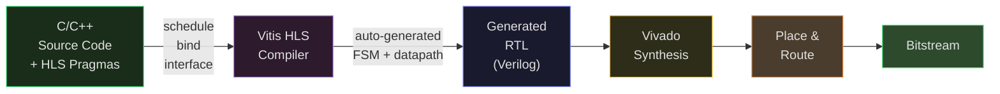
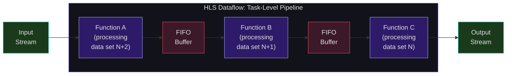
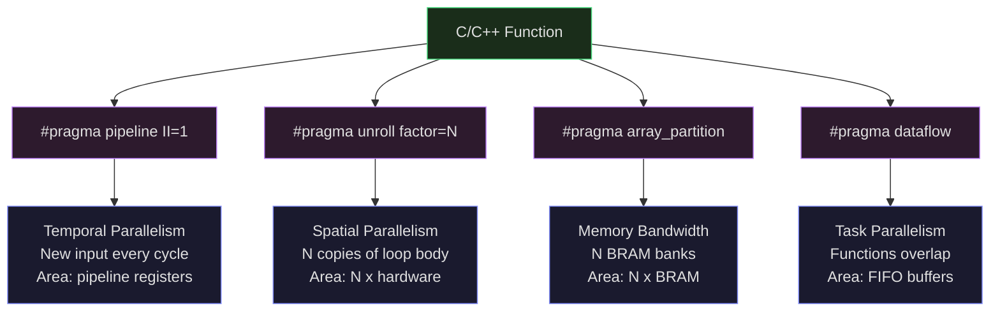

# Verilog HDL and High-Level Synthesis

You now understand what an FPGA contains -- LUTs, BRAMs, DSPs, routing. This lecture teaches you how to describe the circuits that fill those resources. Verilog is a Hardware Description Language: it does not execute sequentially like Python or C. Every line of Verilog describes hardware that exists simultaneously and operates in parallel. Understanding this distinction is the single most important conceptual shift you will make in this course.

We will cover synthesizable Verilog patterns, testbench writing, and then examine High-Level Synthesis (HLS) -- a newer approach where you write C++ and tools generate the Verilog for you. Each approach has its place, and a modern FPGA trading system typically uses both.

## Hardware Description vs Software Programming

When you write `x = a + b` in C, you describe an instruction that the CPU executes at some point in time, after prior instructions complete. When you write `assign x = a + b;` in Verilog, you describe a physical adder circuit -- wires connecting the bits of `a` and `b` through full-adder cells, producing `x`. That adder exists always. It computes continuously. If `a` or `b` changes, `x` updates after a propagation delay.

Three fundamental principles distinguish HDL from software:

1. **Concurrent execution**: All `assign` statements and all `always` blocks execute simultaneously. There is no sequential ordering between separate blocks.
2. **Time is physical**: Signals propagate through gates with finite delay. A clock edge triggers all flip-flops simultaneously, capturing the combinational results computed during the previous clock period.
3. **Resources are real**: Each operation you write consumes physical LUTs, flip-flops, or DSP blocks. Writing two multipliers means you get two multipliers. There is no time-sharing unless you explicitly design it.

## Synthesizable Verilog Patterns

Synthesis tools translate Verilog into hardware. Not all valid Verilog is synthesizable -- only specific patterns map to physical circuits. Here is a comprehensive mapping:

### Combinational Logic

Combinational logic has no memory -- outputs depend only on current inputs.

**Continuous assignment** maps directly to gates:

```verilog
assign out = a & b;           // AND gate
assign sum = a ^ b ^ cin;     // XOR gates (full adder sum)
assign cout = (a & b) | (cin & (a ^ b));  // carry output
```

The `always @(*)` block (or `always_comb` in SystemVerilog) describes combinational logic procedurally:

```verilog
always @(*) begin
    case (sel)
        2'b00: out = a;
        2'b01: out = b;
        2'b10: out = c;
        2'b11: out = d;
    endcase
end
```

This `case` statement synthesizes to a 4-to-1 **multiplexer**. Each case alternative becomes one input of the mux, and `sel` drives the select lines.

An `if-else` chain synthesizes to a **priority-encoded multiplexer**:

```verilog
always @(*) begin
    if (cond_a) out = x;
    else if (cond_b) out = y;
    else out = z;
end
```

Here `cond_a` has priority over `cond_b`. The synthesis tool creates a mux tree that checks `cond_a` first. Deep if-else chains create long critical paths because each condition must be evaluated sequentially.

**Critical rule**: In combinational blocks, every output must be assigned a value on every possible path through the logic. If you write an `if` without an `else`, the synthesis tool infers a **latch** -- a level-sensitive storage element that holds the previous value when the condition is false. Unintended latches are one of the most common HDL bugs.

<ConceptCheck id="cc-1" />

### Sequential Logic

Sequential logic uses clock edges to capture state in flip-flops.

```verilog
always @(posedge clk) begin
    if (reset)
        count <= 8'b0;          // synchronous reset
    else
        count <= count + 1;     // increment each cycle
end
```

This creates an 8-bit counter: eight flip-flops with an adder feeding back to the data inputs. On each rising clock edge, the flip-flops capture the combinational output (current count plus one).

**Non-blocking vs blocking assignments**: This is the most consequential syntax distinction in Verilog.

- **Non-blocking (`<=`)**: Used in sequential (`always @(posedge clk)`) blocks. All right-hand sides are evaluated first (using values from *before* the clock edge), then all left-hand sides are updated simultaneously. This models the physical behavior of flip-flops: all capture data at the same moment.
- **Blocking (`=`)**: Used in combinational (`always @(*)`) blocks. Assignments execute sequentially within the block, like C code.

Mixing these up is a classic bug. Using blocking assignments in sequential logic can cause simulation-synthesis mismatches because the simulator processes assignments in order, but real flip-flops all capture simultaneously.

The following diagram shows how common synthesizable Verilog constructs map to physical FPGA hardware resources. Understanding this mapping is essential for predicting area and timing of your designs.

```mermaid
flowchart LR
    subgraph VERILOG["Synthesizable Verilog"]
        direction TB
        V1["always @(posedge clk)\nwith <="]
        V2["always @(*)\nor assign"]
        V3["case statement"]
        V4["+ - operators"]
        V5["* operator"]
        V6["for loop\n(constant bounds)"]
    end

    subgraph HARDWARE["Physical Hardware"]
        direction TB
        H1["Flip-Flops\n(registers)"]
        H2["Combinational\nGates (LUTs)"]
        H3["Multiplexer\n(LUTs)"]
        H4["Adder/Subtractor\n(carry chain)"]
        H5["DSP Block\n(or LUT tree)"]
        H6["Unrolled Parallel\nHardware Copies"]
    end

    V1 --> H1
    V2 --> H2
    V3 --> H3
    V4 --> H4
    V5 --> H5
    V6 --> H6

    style VERILOG fill:#1a1a2e,stroke:#6c5ce7,color:#e0e0e0
    style HARDWARE fill:#1a2d1a,stroke:#4ade80,color:#e0e0e0
    style V1 fill:#2d2d4a,stroke:#818cf8
    style V2 fill:#2d2d4a,stroke:#818cf8
    style V3 fill:#2d2d4a,stroke:#818cf8
    style V4 fill:#2d2d4a,stroke:#818cf8
    style V5 fill:#2d2d4a,stroke:#818cf8
    style V6 fill:#2d2d4a,stroke:#818cf8
    style H1 fill:#2d4a2d,stroke:#4ade80
    style H2 fill:#2d4a2d,stroke:#4ade80
    style H3 fill:#2d4a2d,stroke:#4ade80
    style H4 fill:#2d4a2d,stroke:#4ade80
    style H5 fill:#2d4a2d,stroke:#4ade80
    style H6 fill:#2d4a2d,stroke:#4ade80
```



### Construct-to-Hardware Mapping

| Verilog Construct | Hardware | Notes |
|---|---|---|
| `always @(posedge clk)` with `<=` | Flip-flops / registers | Non-blocking required |
| `always @(*)` or `always_comb` | Combinational gates | Blocking `=` required |
| `assign wire = expr;` | Continuous combinational | Direct wire through gates |
| `case` / `casez` | Multiplexer | Full case avoids latches |
| `if-else` chains | Priority-encoded mux | Deeper = longer critical path |
| `for` (constant bounds) | Unrolled parallel hardware | Each iteration = separate hardware |
| `?:` ternary | 2:1 multiplexer | Simple conditional select |
| `&, \|, ^` | AND, OR, XOR gates | Direct mapping |
| `+, -, *` | Adders, subtractors, multipliers | `*` may use DSP blocks |
| `<< N` (constant) | Wiring only (zero cost) | Just reroutes bits |
| `<< n` (variable) | Barrel shifter (mux tree) | Actual logic |
| Incomplete `if` | **Latch** (usually a bug) | Always provide `else` |

### Common Design Patterns

**Finite State Machine (Moore):**

```verilog
// State encoding
localparam IDLE  = 2'b00;
localparam RUN   = 2'b01;
localparam DONE  = 2'b10;

reg [1:0] state, next_state;

// State register (sequential)
always @(posedge clk) begin
    if (reset) state <= IDLE;
    else       state <= next_state;
end

// Next-state logic (combinational)
always @(*) begin
    case (state)
        IDLE:  next_state = start ? RUN : IDLE;
        RUN:   next_state = finished ? DONE : RUN;
        DONE:  next_state = IDLE;
        default: next_state = IDLE;
    endcase
end

// Output logic (Moore: depends only on state)
assign busy = (state == RUN);
assign complete = (state == DONE);
```

This two-process FSM pattern separates the sequential state register from the combinational next-state logic. The `default` case prevents latch inference.

**Synchronous FIFO skeleton:**

```verilog
reg [WIDTH-1:0] mem [0:DEPTH-1];   // memory array
reg [$clog2(DEPTH):0] wr_ptr, rd_ptr;  // extra bit for full/empty

assign empty = (wr_ptr == rd_ptr);
assign full  = (wr_ptr[$clog2(DEPTH)] != rd_ptr[$clog2(DEPTH)]) &&
               (wr_ptr[$clog2(DEPTH)-1:0] == rd_ptr[$clog2(DEPTH)-1:0]);

always @(posedge clk) begin
    if (wr_en && !full) begin
        mem[wr_ptr[$clog2(DEPTH)-1:0]] <= wr_data;
        wr_ptr <= wr_ptr + 1;
    end
    if (rd_en && !empty) begin
        rd_data <= mem[rd_ptr[$clog2(DEPTH)-1:0]];
        rd_ptr <= rd_ptr + 1;
    end
end
```

The FIFO uses an extra bit in the pointers to distinguish full from empty. When the lower bits match but the top bits differ, the write pointer has wrapped around and the FIFO is full.

<ConceptCheck id="cc-2" />

## Non-Synthesizable Constructs

These constructs are valid in simulation and testbenches but produce no hardware:

| Construct | Purpose |
|---|---|
| `initial` block | Testbench initialization (exception: Xilinx/Intel FPGAs use `initial` for register power-on values) |
| `#10` delay | Timing control for waveforms |
| `$display`, `$write` | Console output for debugging |
| `$monitor` | Continuous signal monitoring |
| `$readmemh`, `$readmemb` | Memory initialization from files |
| `$finish`, `$stop` | Simulation control |
| `fork...join` | Parallel thread execution |
| Real-number variables | No direct hardware equivalent |

## Testbench Writing

A testbench is a non-synthesizable Verilog module that instantiates your design, drives inputs, and checks outputs. It is the primary verification tool.

```verilog
module alu_tb;
    reg [7:0] a, b;
    reg [2:0] op;
    wire [7:0] result;
    wire zero;

    // Instantiate the unit under test
    alu uut (.a(a), .b(b), .op(op), .result(result), .zero(zero));

    // Clock generation (not synthesizable)
    reg clk = 0;
    always #5 clk = ~clk;  // 100 MHz clock

    initial begin
        $dumpfile("alu_tb.vcd");
        $dumpvars(0, alu_tb);

        // Test ADD
        a = 8'd25; b = 8'd17; op = 3'b000;
        #10;
        if (result !== 8'd42) $display("FAIL: ADD");

        // Test SUB
        a = 8'd50; b = 8'd30; op = 3'b001;
        #10;
        if (result !== 8'd20) $display("FAIL: SUB");

        $display("All tests complete");
        $finish;
    end
endmodule
```

`$dumpfile` and `$dumpvars` create a VCD (Value Change Dump) file that waveform viewers (GTKWave) can display. The `#10` statements insert 10 time-unit delays between stimulus applications.

## High-Level Synthesis (HLS)

Writing cycle-accurate RTL is powerful but slow. A moderately complex FPGA design might take months of engineering. **High-Level Synthesis** offers a faster alternative: write C or C++, and a tool generates synthesizable RTL. AMD's Vitis HLS (formerly Vivado HLS) is the dominant tool.



### The HLS Promise and Reality

HLS takes a C/C++ function and produces a Verilog module. The tool handles:

- **Scheduling**: deciding which operations execute in which clock cycles
- **Binding**: mapping operations to hardware resources (adders, multipliers, BRAMs)
- **Controller generation**: creating the FSM that sequences operations
- **Interface synthesis**: generating AXI4, AXI4-Stream, or BRAM interfaces

The programmer guides the tool with **pragmas** -- directives that specify parallelism, pipelining, and memory partitioning. Without pragmas, HLS produces correct but slow hardware (typically sequential, one operation per cycle). With well-chosen pragmas, HLS can approach hand-tuned RTL performance.

Typical results: HLS generates designs with 2--3x area overhead versus hand-written RTL, but development time is reduced by 5--10x. For many applications, this trade-off is excellent. For the most latency-critical components (network stacks, protocol parsers), hand-written RTL is still preferred.

### Key Vitis HLS Pragmas

#### Pipeline: The Single Most Important Optimization

```c
#pragma HLS pipeline II=1
```

This pragma pipelines a loop or function, allowing a new input to be accepted every $II$ (Initiation Interval) clock cycles. With $II=1$, the pipeline accepts new data every single cycle -- maximum throughput.

Without pipelining, a loop that takes 10 cycles per iteration and runs 1000 times takes 10,000 cycles. With $II=1$ pipelining, it takes $10 + 999 = 1009$ cycles (pipeline fill latency plus one cycle per remaining iteration). The throughput improvement is $\sim10\times$.

The following diagram shows how HLS pipelining with II=1 allows a new input every clock cycle. Each row represents a different input being processed simultaneously through different pipeline stages.

```mermaid
gantt
    title HLS Pipeline with II=1 (new input every cycle)
    dateFormat X
    axisFormat %s

    section Input A
    Stage 1 (Read)     :a1, 0, 1
    Stage 2 (Compute)  :a2, 1, 2
    Stage 3 (Write)    :a3, 2, 3

    section Input B
    Stage 1 (Read)     :b1, 1, 2
    Stage 2 (Compute)  :b2, 2, 3
    Stage 3 (Write)    :b3, 3, 4

    section Input C
    Stage 1 (Read)     :c1, 2, 3
    Stage 2 (Compute)  :c2, 3, 4
    Stage 3 (Write)    :c3, 4, 5

    section Input D
    Stage 1 (Read)     :d1, 3, 4
    Stage 2 (Compute)  :d2, 4, 5
    Stage 3 (Write)    :d3, 5, 6
```



The tool creates pipeline registers between stages, similar to a CPU pipeline but custom-tailored to your computation:

$$\text{Throughput} = \frac{1}{II \times T_{clk}}$$
$$\text{Latency} = \text{Pipeline Depth} \times T_{clk}$$

<ConceptCheck id="cc-3" />

#### Unroll: Spatial Parallelism

```c
#pragma HLS unroll factor=4
```

Unrolling replicates hardware: `factor=4` creates four copies of the loop body that execute in parallel. Full unroll (no factor specified) creates $N$ copies for an $N$-iteration loop.

Trade-off: area increases linearly with unroll factor. A fully unrolled 256-iteration loop creates 256 copies of the hardware. Use unroll for inner loops and pipeline for outer loops.

#### Array Partition: Memory Bandwidth

```c
#pragma HLS array_partition variable=data type=cyclic factor=4
```

BRAM has only two ports (dual-port), limiting you to two reads per cycle. Array partitioning splits the array into multiple physical memories:

- `complete`: each element becomes a register (full parallel access, highest area)
- `cyclic factor=N`: round-robin distribution across $N$ banks (element $i$ goes to bank $i \bmod N$)
- `block factor=N`: contiguous chunks in each bank

With `cyclic factor=4`, you get four BRAM banks and can perform up to 8 reads per cycle (2 ports per bank times 4 banks). Without partitioning, you are limited to 2 reads per cycle regardless of how much you unroll or pipeline.

#### Dataflow: Task-Level Pipelining

```c
#pragma HLS dataflow
```

Dataflow enables multiple functions to execute concurrently on different data sets. Function B starts processing data set $N$ while function A processes data set $N+1$. The tool automatically inserts FIFO or PIPO (ping-pong) buffers between producer-consumer function pairs.

This is the HLS equivalent of a pipeline between major processing stages -- exactly what an FPGA trading system needs between its feed decoder, order book, strategy, and order gateway.

The following diagram shows how HLS dataflow enables task-level pipelining. FIFO buffers between stages allow each function to process a different data set concurrently:



#### Interface: Connecting to the World

```c
#pragma HLS interface mode=axis port=market_data
#pragma HLS interface mode=m_axi port=dram_buffer
#pragma HLS interface mode=s_axilite port=config
```

- `axis` (AXI4-Stream): for streaming data with handshake. The natural choice for network packets and market data.
- `m_axi` (AXI4 Master): for burst-mode DRAM access. Up to 256 words per transaction.
- `s_axilite` (AXI4-Lite Slave): for control registers (configuration, status).

### Typical HLS Results

| Operation | Latency (cycles) | II | LUT% | BRAM% | Notes |
|---|---|---|---|---|---|
| Matrix multiply 32x32 | ~32K | 1 | 15--25% | 10--20% | With array partition |
| FIR filter (16 taps) | 16 | 1 | 5--10% | <5% | Fully pipelined |
| FFT 1024-pt | ~10K | 1 | 20--30% | 15--25% | Radix-2 butterfly |
| Sorting (bitonic, 256) | ~2K | N/A | 30--40% | 10% | Compare-swap network |
| AES-128 encrypt | 11--44 | 1 | 10--20% | <5% | Pipelined or iterative |

The following diagram summarizes the key HLS pragma effects, showing how each pragma trades FPGA area for throughput or latency improvement:



### When HLS Falls Short

| Limitation | Why RTL is Needed |
|---|---|
| Clock domain crossing | HLS generates single-clock designs |
| Custom SerDes / PHY | Requires vendor IP instantiation |
| Cycle-accurate protocols | HLS scheduling may add unwanted latency |
| Multi-cycle path constraints | Cannot express timing exceptions |
| Vendor hard IP (PCIe, Ethernet) | Must be wired in RTL or block design |
| Last 10% of latency optimization | RTL gives cycle-exact control |

In the HFT context: the network stack, protocol parsers, and order book are often hand-coded RTL for deterministic cycle-by-cycle behavior, while trading strategy logic may use HLS for faster development iteration. The Boutros et al. (IEEE FPT 2017) study demonstrated that an entire HFT system implemented in HLS achieved 270ns average tick-to-trade latency at 156.2 MHz, using less than 8% logic and 22% BRAM on a Kintex UltraScale -- proving that HLS is viable even for latency-critical trading.

<ConceptCheck id="cc-4" />

## Python Simulation: HDL Concepts

Since we cannot run actual Verilog in the browser, let us build a Python simulation that models the key HDL concepts -- modules, signals, clock edges, and combinational vs sequential logic.

```python
class Signal:
    """Models a hardware signal with current and next values."""
    def __init__(self, width: int, value: int = 0, name: str = ""):
        self.width = width
        self.mask = (1 << width) - 1
        self.value = value & self.mask
        self.next_value = self.value
        self.name = name

    def set_next(self, val: int):
        """Non-blocking assignment: schedule update for next clock edge."""
        self.next_value = val & self.mask

    def update(self):
        """Apply the scheduled update (called at clock edge)."""
        self.value = self.next_value

    def __int__(self):
        return self.value

    def __repr__(self):
        return f"{self.name}={self.value}"


class ClockDomain:
    """Manages clock edges and sequential updates."""
    def __init__(self):
        self.signals = []
        self.cycle = 0

    def register(self, signal: Signal):
        self.signals.append(signal)
        return signal

    def tick(self):
        """Simulate a positive clock edge: all flip-flops update simultaneously."""
        for sig in self.signals:
            sig.update()
        self.cycle += 1


# Example: 8-bit counter with synchronous reset
clk = ClockDomain()
count = clk.register(Signal(8, name="count"))
reset = Signal(1, value=1, name="reset")

def counter_logic():
    """Combinational next-state logic for the counter."""
    if reset.value:
        count.set_next(0)
    else:
        count.set_next(count.value + 1)

# Simulate 12 clock cycles
print("Cycle | Reset | Count")
print("------+-------+------")
for cycle in range(12):
    if cycle == 2:
        reset.value = 0  # release reset after 2 cycles
    counter_logic()       # evaluate combinational logic
    print(f"  {cycle:2d}  |   {reset.value}   |  {count.value:3d}")
    clk.tick()            # positive edge: flip-flops capture

print(f"\nFinal count after 12 cycles: {count.value}")
print(f"Expected: 9 (10 active cycles - 2 reset cycles, counting 0..9)")
```

This simulation mirrors how RTL simulators work: evaluate combinational logic, then apply all non-blocking assignments simultaneously at the clock edge. The `Signal.set_next()` method models the non-blocking `<=` assignment in Verilog.

## Project 5 Connection

The concepts in this lecture directly feed into Project 5: FPGA Trading Pipeline Simulator. In that project, you will build Python classes that model FPGA-style hardware modules -- a FAST protocol decoder (Milestone 1), a hardware-style order book (Milestone 2), a market-making strategy (Milestone 3), and a risk checker (Milestone 4). Each module will follow the combinational/sequential discipline you learned here: compute next-state values from current state, then apply all updates simultaneously at the clock edge.

## Summary

Verilog HDL describes hardware, not sequential software. Combinational logic (`always @(*)`, `assign`) maps to gates and multiplexers; sequential logic (`always @(posedge clk)`) maps to flip-flops. Non-blocking assignments (`<=`) model simultaneous flip-flop capture; blocking assignments (`=`) model combinational evaluation. Common patterns -- counters, FSMs, FIFOs -- map to well-understood hardware structures.

High-Level Synthesis with Vitis HLS enables C++ to FPGA design, guided by pragmas: `pipeline` for throughput, `unroll` for spatial parallelism, `array_partition` for memory bandwidth, `dataflow` for task-level pipelining, and `interface` for I/O protocols. HLS achieves 2--3x area overhead versus hand-written RTL but reduces development time by 5--10x. In practice, HFT systems use RTL for the latency-critical path and HLS for strategy logic where development speed matters.

Next week, we apply everything -- FPGA architecture, HDL design patterns, and HLS concepts -- to build a complete high-frequency trading system, from the wire to the order.
