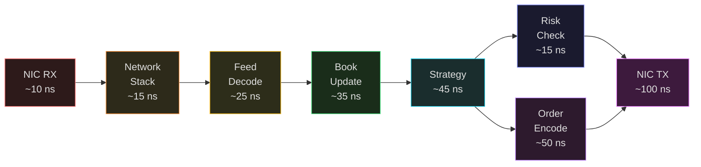

# The FPGA Trading Pipeline: From Wire to Order

This is the lecture where everything comes together. Every topic in this course -- transistor physics, digital logic, processor design, memory hierarchies, pipelining -- converges into a single system: the FPGA-based high-frequency trading pipeline. A market data packet arrives at the NIC, traverses custom hardware that decodes the protocol, updates the order book, evaluates a strategy, checks risk, and emits an order -- all in under 500 nanoseconds. No CPU. No operating system. No cache misses. Just silicon doing exactly what you designed it to do.

This is not theoretical. Firms like IMC Trading, Citadel Securities, Jump Trading, and Virtu Financial deploy these systems in production, colocated in exchange data centers, trading billions of dollars daily. The difference between 200 nanoseconds and 300 nanoseconds can determine who gets filled and who does not.

## Why FPGAs for Trading

### The Latency Imperative

In competitive electronic markets, the first valid order at the best price gets filled. Everyone else watches. When an exchange publishes a new quote, every market-making firm receives it at approximately the same time (within nanoseconds, via colocated fiber). The race is tick-to-trade: from receiving market data to transmitting an order, measured at the wire.

Here is the latency landscape as of 2024-2025:

| Technology | Tick-to-Trade Latency | Details |
|---|---|---|
| Software (unoptimized) | 10--50 $\mu$s | Standard Linux network stack |
| Software (optimized C++, kernel bypass) | ~2 $\mu$s | OpenOnload/DPDK, zero-copy networking |
| FPGA (commercial turnkey, Exegy Nexus) | <2.0 $\mu$s | UBBO-triggered trades |
| FPGA (commercial raw signals, Exegy) | <350 ns | Raw trigger mode |
| FPGA (academic, Boutros et al. 2017) | 270 ns avg | All-HLS, Kintex UltraScale |
| FPGA (academic, 10G system 2022) | 433 ns | Custom RTL |
| FPGA (industry best-in-class, 2024) | Single-digit ns | Top-tier prop trading firms |
| CPU baseline (PYNQ educational) | <450 ns | Simplified strategy |

The best software achieves roughly 2 microseconds. The best FPGA systems achieve sub-100 nanoseconds. That is a 20x improvement -- not because FPGAs have faster clocks (they do not: 200-500 MHz vs 5 GHz), but because FPGAs eliminate every source of non-determinism:

- **No instruction fetch/decode/retire**: The logic *is* the computation. No Von Neumann bottleneck.
- **No cache misses**: Data flows through pipelines, not hierarchical memory.
- **No branch mispredictions**: All code paths execute in parallel; the correct result is selected.
- **No OS scheduler interrupts**: Dedicated hardware, no context switches, no jitter.
- **No PCIe bus traversal**: NIC and logic are on the same FPGA die.

As IMC Trading puts it: "CPUs are burdened by surplus hardware that would otherwise slow you down." An FPGA contains "thousands, sometimes even millions, of core logic blocks that can be configured and combined to process any task" -- with zero abstraction layers between the wire and your algorithm.

<ConceptCheck id="cc-1" />

## The Complete FPGA Trading Pipeline

Let us trace a market data packet from the moment photons enter the fiber optic cable to the moment an order exits the FPGA. This is the end-to-end pipeline:



Total pipeline: 150-300 ns end-to-end depending on strategy complexity. Risk checks run in parallel with order encoding to save latency.

### Stage 1: NIC RX (~10 ns)

An Ethernet frame arrives at the FPGA's high-speed transceiver (SerDes). The physical layer (PHY) converts the serial bitstream into parallel data. On modern FPGAs, this is a hardened IP block running at 10/25/100 Gbps.

The MAC layer strips the Ethernet preamble, checks the Frame Check Sequence (CRC-32), and passes the payload up. No software driver, no interrupt, no DMA transfer -- the frame data appears directly on internal FPGA wires, ready for processing by fabric logic.

Latency budget: ~10 ns for PHY deserialization and MAC processing.

The market data flow from the exchange to the FPGA follows a path through multicast networking infrastructure directly into the FPGA's hardened transceivers, bypassing all software layers.

```mermaid
flowchart LR
    EX["Exchange\nMatching\nEngine"]
    MC["UDP\nMulticast\nSwitch"]
    FIBER["Fiber Optic\nCross-connect"]
    SERDES["FPGA\nSerDes PHY\n(10/25/100G)"]
    MAC["Hardened\nEthernet MAC"]
    FABRIC["FPGA\nFabric Logic"]

    EX -->|"Market data"| MC
    MC -->|"Multicast to all\nsubscribers"| FIBER
    FIBER -->|"Photons\n~5 ns/meter"| SERDES
    SERDES -->|"Parallel data"| MAC
    MAC -->|"Payload on\ninternal wires"| FABRIC

    style EX fill:#4a3d2d,stroke:#fbbf24,color:#e0e0e0
    style MC fill:#2d2d1a,stroke:#fbbf24,color:#e0e0e0
    style FIBER fill:#2d1a1a,stroke:#f87171,color:#e0e0e0
    style SERDES fill:#1a1a2e,stroke:#818cf8,color:#e0e0e0
    style MAC fill:#1a2d2d,stroke:#22d3ee,color:#e0e0e0
    style FABRIC fill:#1a2d1a,stroke:#4ade80,color:#e0e0e0
```



### Stage 2: Network Stack (~15 ns)

The Ethernet payload is an IP/UDP packet (exchanges use UDP multicast for market data distribution -- it is the fastest way to send the same data to hundreds of subscribers simultaneously). The FPGA strips the IP and UDP headers in a simple combinational pipeline: extract source/destination IP, port number, and payload offset. No TCP. No retransmission. No congestion control. Market data feeds use UDP because latency matters more than reliability -- if you miss a packet, the next update will contain the current state.

This is kernel bypass taken to its logical extreme: there is no kernel. The network stack is a few pipeline stages of combinational logic.

### Stage 3: Feed Decoder (~20-50 ns)

This is where domain-specific knowledge meets hardware design. The feed decoder parses the exchange's market data protocol to extract structured trading events.

#### Market Data Protocols

Exchanges publish market data in binary formats optimized for speed:

| Protocol | Exchange | Format | Use |
|---|---|---|---|
| ITCH | Nasdaq | Binary | Full depth-of-book (TotalView) |
| PITCH | BATS/Cboe | Binary | Order-level data |
| CME MDP3/SBE | CME Group | Simple Binary Encoding | Futures market data |
| FIX/FAST | Various (international) | Compressed binary | Bandwidth-efficient feed |
| OUCH | Nasdaq | Binary | Order entry (outbound) |
| BOE | CBOE | Binary | Order entry (outbound) |

#### FAST Protocol: The Compression Challenge

FAST (FIX Adapted for STreaming) is a binary compression protocol designed by the FIX Trading Community to reduce market data bandwidth. It introduces three key concepts:

**1. Template-based implicit tagging**: Unlike FIX (which uses explicit `tag=value` pairs), FAST identifies fields by their position in a template. The template is agreed upon beforehand and defines the field order, types, and operators.

The following diagram illustrates the structure of a FAST protocol message. The Presence Map (PMap) indicates which fields follow, and each field uses stop-bit encoding where the high bit of the last byte is set to 1.

```mermaid
flowchart TB
    subgraph MSG["FAST Protocol Message Structure"]
        direction LR
        PMAP["PMap\n(presence bitmap)\nstop-bit encoded"]
        TID["Template ID\n(identifies\nfield layout)"]
        F1["Field 1\nstop-bit encoded\nvariable length"]
        F2["Field 2\n(if PMap bit set)\nvariable length"]
        F3["Field 3\n(delta/copy/const\noperator)"]
        FN["..."]
        PMAP --> TID --> F1 --> F2 --> F3 --> FN
    end

    subgraph BYTE["Stop-Bit Encoding (value = 942)"]
        direction LR
        B1["Byte 1: 0|0000111\nS=0 (more bytes)"]
        B2["Byte 2: 1|0101110\nS=1 (last byte)"]
        B1 --> B2
    end

    style MSG fill:#12121a,stroke:#6c5ce7,color:#e0e0e0
    style BYTE fill:#1a2d2d,stroke:#22d3ee,color:#e0e0e0
    style PMAP fill:#2d1a2d,stroke:#c084fc,color:#e0e0e0
    style TID fill:#1a1a2e,stroke:#818cf8,color:#e0e0e0
    style F1 fill:#1a2d1a,stroke:#4ade80,color:#e0e0e0
    style F2 fill:#1a2d1a,stroke:#4ade80,color:#e0e0e0
    style F3 fill:#1a2d1a,stroke:#4ade80,color:#e0e0e0
```



**2. Stop-bit encoding**: Each byte uses 7 bits for data and 1 bit to signal "last byte." A field value is encoded in as few bytes as possible:

$$\text{Byte format: } [\underbrace{S}_{1\text{ bit}}][\underbrace{D_6 D_5 D_4 D_3 D_2 D_1 D_0}_{7\text{ data bits}}]$$

where $S=0$ means more bytes follow and $S=1$ means this is the last byte. For example, the value 942 (binary: $0000\;0011\;1010\;1110$) encodes as:

- Split into 7-bit groups: $0000111 \mid 0101110$
- Byte 1: $0|0000111$ = 0x07 ($S=0$, more follows)
- Byte 2: $1|0101110$ = 0xAE ($S=1$, last byte)

**3. Field operators**: Templates define operators that compress repeated values:

| Operator | Behavior | Wire Cost |
|---|---|---|
| Constant | Value hardcoded in template, never sent | 0 bytes |
| Copy | If PMap bit=0, reuse previous value | 0 bytes when unchanged |
| Delta | Transmit difference from previous value | 1-2 bytes typically |
| Increment | If PMap bit=0, previous+1 (for sequence numbers) | 0 bytes when sequential |
| Default | If PMap bit=0, use template default | 0 bytes when default |

The **Presence Map (PMap)** is a bitmap at the start of each message indicating which optional fields are present.

**Hardware FAST decoding is hard** because of variable-length encoding: the next field's start position depends on the current field's byte count, which you do not know until you decode it. Research solutions include:

- **Sequential FPGA decoder**: process one field at a time. Achieved 720 ns per message, 1.4 million messages/sec (Springer 2023).
- **Parallel speculative decoder**: start decoding at all possible byte offsets simultaneously, then select the correct result. Achieved <200 ns per message (ACM 2021).
- **Software baseline**: typically 2-10 microseconds per message.

For simpler binary protocols like ITCH, fields are fixed-width, making parallel decoding trivial: extract bytes 0-1 as message type, bytes 2-5 as sequence number, etc. -- all in a single clock cycle.

<ConceptCheck id="cc-2" />

### Stage 4: Order Book Update (~30-40 ns)

The decoded market data event (Add Order, Modify Order, Cancel Order, Execute Order) must update the in-memory representation of the exchange's order book. In software, this is typically a red-black tree or hash map with O(log N) operations. In hardware, we use a fundamentally different data structure.

**Price-Indexed Array**: The key insight is that prices exist on a fixed tick grid. For an equity with tick size $0.01 and a price range of $100, there are exactly 10,000 possible price levels. Index directly:

$$\text{index} = \frac{\text{price} - \text{base\_price}}{\text{tick\_size}}$$

This is **O(1)** access: no tree traversal, no hash computation, no cache misses. Pre-allocate arrays of 256-1024 price levels per side (bid and ask), and index directly by price.

Each price level stores:
- **Total quantity**: sum of all order sizes at this price
- **Order count**: number of orders (for queue position estimation)
- **Timestamp**: time of last update

**Best bid/ask** is maintained in a hardware register, updated on every book change. When a new order arrives above the current best bid, a comparator immediately promotes it. When the best bid level is fully filled or cancelled, a priority encoder scans downward to find the new best.

**Fixed-point arithmetic**: All prices and quantities are integers. There is no floating point in a hardware order book. Price is represented as integer multiples of the minimum tick:

$$\text{price\_int} = \text{price} \times 10^{d}$$

where $d$ is the number of decimal places. For example, \$150.25 at 4 decimal places becomes 1,502,500. This eliminates floating-point rounding errors and allows all arithmetic to use simple integer adders -- deterministic timing, minimal hardware.

**Performance achieved in published research**:
- 253 ns average latency across 119,275 instruments simultaneously, using cuckoo hashing for symbol lookup and only 144 Mbit QDR SRAM (IEEE 2014, Lockwood)
- 132-288 ns per order book operation depending on book depth
- 90-157x faster than CPU-based solutions

### Stage 5: Strategy Evaluation (~45 ns)

The strategy logic computes trading signals from the updated order book state. For a simple market-making strategy:

1. **Mid-price**: $\text{mid} = \frac{\text{best\_bid} + \text{best\_ask}}{2}$ (implemented as $(\text{bid} + \text{ask}) \gg 1$ to avoid division)
2. **Spread**: $\text{spread} = \text{best\_ask} - \text{best\_bid}$
3. **Quote prices**: $\text{my\_bid} = \text{mid} - \frac{\text{half\_spread}}{1}$, $\text{my\_ask} = \text{mid} + \frac{\text{half\_spread}}{1}$
4. **Inventory skew**: adjust quotes based on current position to manage risk

All computations use integer arithmetic. A multiply by a fixed-point coefficient is implemented by a DSP block in a single clock cycle.

More complex strategies (statistical arbitrage, pairs trading, volatility estimation) require more pipeline stages but follow the same principle: dedicated hardware computes the result in a fixed, deterministic number of clock cycles.

### Stage 6: Risk Checks (~5-15 ns, in parallel)

Pre-trade risk checks run **in parallel** with order formatting (not sequentially). All checks are combinational logic -- simple comparisons that complete in a single clock cycle:

- Position limit: $|\text{position} + \text{order\_qty}| < \text{max\_position}$
- Rate limit: $\text{orders\_this\_second} < \text{max\_rate}$
- Price reasonability: $|\text{order\_price} - \text{mid\_price}| < \text{max\_deviation}$
- Notional limit: $\text{price} \times \text{quantity} < \text{max\_notional}$
- Fat finger protection: $\text{order\_qty} < \text{max\_single\_order\_size}$

Each check is an integer comparison or multiply-compare. All checks execute simultaneously in parallel combinational logic. The total risk check latency is the delay through the longest comparison chain: approximately 5-15 ns. If any check fails, a single-bit kill signal suppresses the outbound order.

### Stage 7: Order Encoder and NIC Transmit (~50-100 ns)

The order is encoded into the exchange's order entry protocol (OUCH for Nasdaq, BOE for CBOE, FIX binary for others), wrapped in UDP/IP/Ethernet headers, and transmitted via the same SerDes transceiver that received the market data.

Latency budget: ~50 ns for order encoding and framing, ~100 ns for PHY serialization and transmission.

<ConceptCheck id="cc-3" />

### Total Pipeline Budget

Based on published architectures and the Shailesh Nair analysis (Xilinx Virtex UltraScale+):

| Pipeline Stage | Typical Latency | Description |
|---|---|---|
| NIC/PHY Receive | ~10 ns | Ethernet ingress, SerDes |
| Kernel Bypass / Network Stack | ~15 ns | IP/UDP header stripping |
| Protocol Parsing (ITCH) | 20-25 ns | Decode market data fields |
| Order Book Update | 30-40 ns | Insert/modify/delete at price level |
| Signal Generation / Strategy | ~45 ns | Compute trading signals |
| Risk Management | ~20 ns | Position, rate, price checks (parallel) |
| Order Gateway / Formatting | ~50 ns | Construct outbound order |
| NIC/PHY Transmit | ~100 ns | Ethernet egress, SerDes |
| **Total Pipeline** | **150-300 ns** | End-to-end, strategy-dependent |

The Boutros et al. all-HLS system achieved 270 ns average (42 clock cycles at 156.2 MHz). The 433 ns system (IEEE 2022) used custom RTL at 10 Gbps. And the 480 ns result (IEEE 2024) demonstrated "significant improvement over CPU and GPU-based implementations."

**Key architectural techniques** that keep latency minimal:

1. **Pipeline parallelism**: Different packets process through stages simultaneously. While packet N is in the strategy stage, packet N-1 is in the order encoder, and packet N+1 is being parsed.
2. **Speculative execution**: All message-type decoders run in parallel on every incoming packet. The correct result is selected post-hoc, eliminating conditional branching latency.
3. **Parallel risk checks**: Risk validation runs concurrently with order formatting, not sequentially. The order is suppressed only if a check fails.

## Market Data Protocols In Depth

### Nasdaq ITCH: The Speed Benchmark

Nasdaq TotalView-ITCH provides full depth-of-book data: every individual order, every modification, every execution. A busy trading day generates 8.5 million messages at peak rate (3.4 Gbps throughput).

ITCH messages are fixed-format binary: each message type has a known structure with fixed-width fields at fixed byte offsets. This makes FPGA parsing trivial -- extract fields with bit slicing in combinational logic:

| Message Type | Code | Key Fields |
|---|---|---|
| Add Order | 'A' | Timestamp, OrderRefNum, Side, Shares, Stock, Price |
| Order Executed | 'E' | Timestamp, OrderRefNum, Shares, MatchNumber |
| Order Cancel | 'X' | Timestamp, OrderRefNum, CancelledShares |
| Order Replace | 'U' | Timestamp, OldOrderRefNum, NewOrderRefNum, Shares, Price |
| Trade | 'P' | Timestamp, OrderRefNum, Side, Shares, Stock, Price, MatchNumber |

Published FPGA ITCH processing benchmarks (Virtex UltraScale+):
- Parsing latency: 20-25 ns per message
- Order book update: 30-40 ns per message
- Pipeline throughput: 8.3 million messages/sec processed
- Resource utilization: 35% LUTs, 25% BRAMs

### Sequence Numbers and Gap Detection

Every market data feed includes sequence numbers. If your decoder receives sequence number 1000 and then 1002, you missed message 1001. In software, you request a retransmission. In FPGA, you can:

1. Log the gap for analysis
2. Continue processing (the next full book snapshot will reconcile)
3. Flag the order book as potentially stale and suppress trading

Gap detection is a single comparator: `if (seq_num != expected_seq_num)`. One LUT.

<ConceptCheck id="cc-4" />

## From Research to Production

### Published System Architectures

The academic literature provides detailed implementations:

**Lockwood (IEEE HOTI 2012)**: Library-based approach with reusable IP for networking, I/O, and financial protocols. End-to-end latency of 1 microsecond at 10 Gbps -- demonstrated FPGA viability for HFT.

**Boutros et al. (IEEE FPT 2017)**: Complete system in Vivado HLS (C++). Network stack, FAST parser, order book, trading strategy, order gateway. 270 ns average (36-62 cycle range, 156.2 MHz), <8% logic, ~22% BRAM on Kintex UltraScale XCKU115. Proved HLS is viable for trading.

**433 ns system (IEEE 2022)**: Custom RTL achieving 433 ns from market packet analysis to order packet triggering, with 25 ns physical transceiver latency.

**480 ns system (IEEE 2024)**: FPGA hardware acceleration achieving 480 ns average latency, with "significant improvement over CPU and GPU-based implementations."

**Order book system (IEEE 2014)**: 253 ns average across 119,275 simultaneous instruments using cuckoo hashing and 144 Mbit QDR SRAM.

### What Top Firms Achieve

As of 2024-2025, top-tier proprietary trading firms achieve **sub-100 nanosecond** tick-to-trade for simple strategies. The race has shifted from microseconds to nanoseconds since approximately 2015. At sub-500 ns latency, firms can access order-queue placement signals on certain exchanges, providing measurable alpha advantage.

IMC Trading maintains "one of the largest dedicated FPGA engineering setups in the trading industry." Their hardware engineers work "in lockstep with software engineers and traders, carefully dissecting trading algorithms into the pieces that are best suited for hardware versus software." They began working with FPGA-based trading systems "more than a decade ago" and continuously develop the technology.

The build-versus-buy landscape:

| Approach | Firms | Pro | Con |
|---|---|---|---|
| Build in-house | IMC, Citadel, Jump, Two Sigma | Maximum customization, competitive edge | \$5M+ and 3+ years to deploy |
| Buy commercial | Mid-tier firms | Fast deployment, lower upfront | Same technology as competitors |
| Hybrid | Some prop shops | Custom strategy on vendor stack | Integration complexity |

Commercial platforms include Exegy Nexus (<2.0 $\mu$s tick-to-trade, <350 ns raw triggers), Algo-Logic (sub-microsecond SDK), Magmio (nanosecond-level), and Enyx nxAccess (turnkey FPGA market access).

## Python Simulation: The Pipeline

Here is a simplified simulation of the complete FPGA trading pipeline, with clock-cycle-accurate timing for each stage:

```python
class PipelineStage:
    """Models a single stage of the FPGA trading pipeline."""
    def __init__(self, name: str, latency_ns: float):
        self.name = name
        self.latency_ns = latency_ns
        self.data_in = None
        self.data_out = None
        self.busy = False

    def process(self, data: dict) -> dict:
        """Override in subclasses for stage-specific processing."""
        return data


class TradingPipeline:
    """End-to-end FPGA trading pipeline simulator."""
    def __init__(self):
        self.stages = [
            PipelineStage("NIC_RX", 10),
            PipelineStage("NET_STACK", 15),
            PipelineStage("FEED_DECODE", 25),
            PipelineStage("BOOK_UPDATE", 35),
            PipelineStage("STRATEGY", 45),
            PipelineStage("RISK_CHECK", 15),  # parallel with order encode
            PipelineStage("ORDER_ENCODE", 50),
            PipelineStage("NIC_TX", 100),
        ]

    def process_packet(self, market_data: dict) -> dict:
        """Process a single market data packet through all stages."""
        cumulative_ns = 0
        stage_log = []
        data = market_data

        for stage in self.stages:
            cumulative_ns += stage.latency_ns
            stage_log.append({
                'stage': stage.name,
                'latency_ns': stage.latency_ns,
                'cumulative_ns': cumulative_ns
            })

        # Risk check runs in parallel with order encode,
        # so subtract the overlap
        risk_latency = self.stages[5].latency_ns  # RISK_CHECK
        order_latency = self.stages[6].latency_ns  # ORDER_ENCODE
        parallel_saving = min(risk_latency, order_latency)
        total_ns = cumulative_ns - parallel_saving

        return {
            'total_latency_ns': total_ns,
            'stages': stage_log,
            'parallel_saving_ns': parallel_saving
        }


# Simulate
pipeline = TradingPipeline()
result = pipeline.process_packet({'type': 'ADD_ORDER', 'price': 1502500})

print("FPGA Trading Pipeline Latency Breakdown")
print("=" * 50)
for s in result['stages']:
    bar = "#" * (s['latency_ns'] // 5)
    print(f"  {s['stage']:15s} {s['latency_ns']:4d} ns  {bar}")
print(f"  {'Parallel save':15s} -{result['parallel_saving_ns']:3d} ns")
print(f"  {'TOTAL':15s} {result['total_latency_ns']:4d} ns")
print(f"\nCompare: Software (kernel bypass) ~2000 ns")
print(f"Speedup: {2000 / result['total_latency_ns']:.1f}x")
```

This gives you a visceral sense of where the nanoseconds go. The NIC transmit stage dominates -- serializing an Ethernet frame at 10 Gbps takes ~100 ns regardless of how fast your logic is. This is why the race is fought at every other stage.

## Summary

The FPGA trading pipeline transforms market data into orders in 150-300 nanoseconds by eliminating every layer of abstraction between the network wire and the trading logic. Each stage -- NIC receive, network stack, feed decode, order book update, strategy evaluation, risk checks, order encode, NIC transmit -- is implemented as dedicated hardware running at wire speed. Fixed-point integer arithmetic replaces floating point. Parallel execution replaces sequential processing. Binary protocols replace text parsing.

The numbers are real: Boutros et al. achieved 270 ns average tick-to-trade in 2017. Top firms achieve sub-100 ns today. The IEEE 2024 result of 480 ns represents "significant improvement" over CPU approaches. And IMC Trading, one of the world's largest market makers, builds FPGA infrastructure in-house because the competitive edge justifies the $5M+ investment.

Next lecture: we dive deep into the hardware order book, market-making strategy design, risk check implementation, and the colocation infrastructure that makes it all possible.
