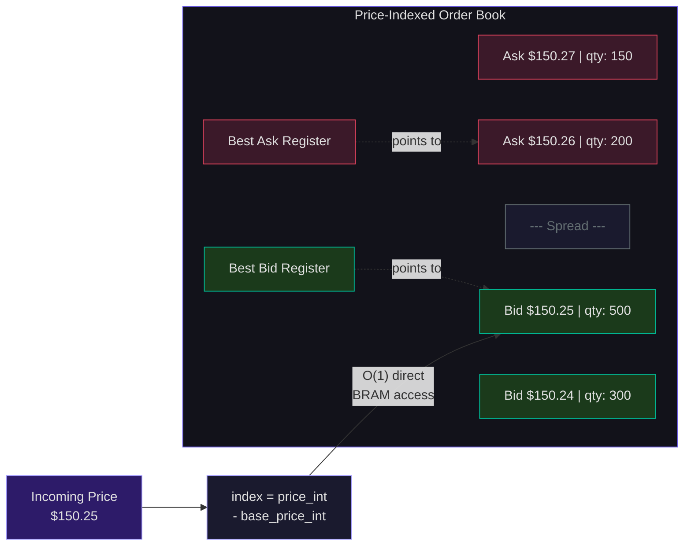
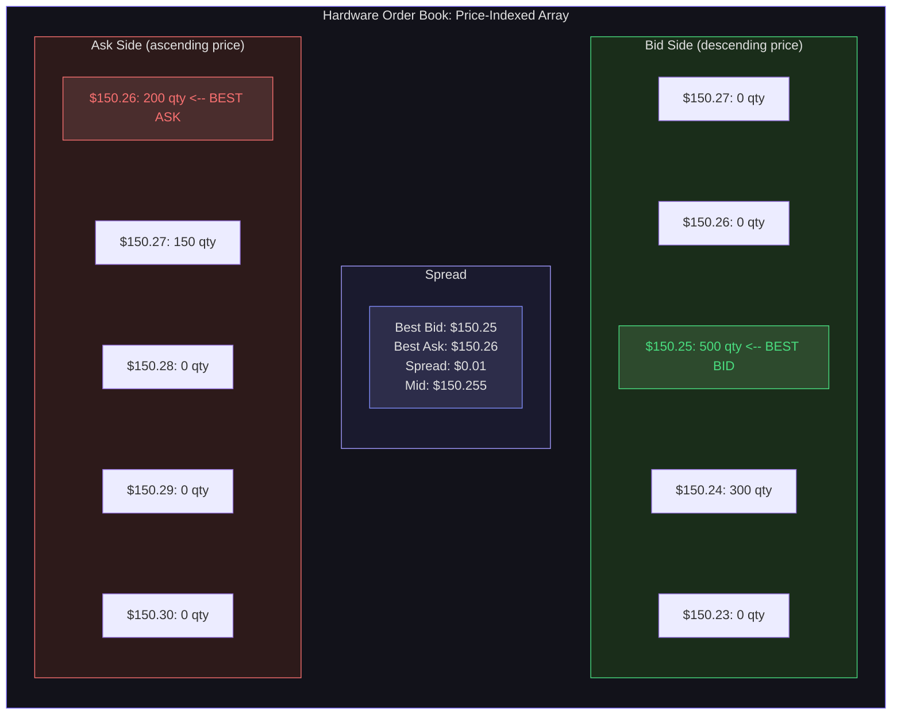
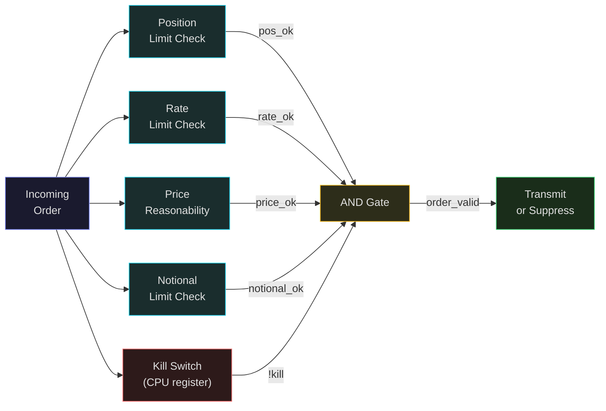
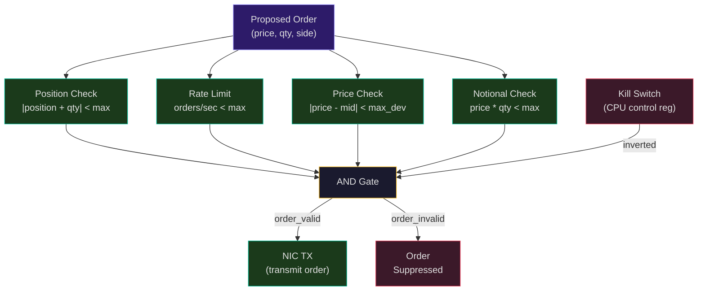
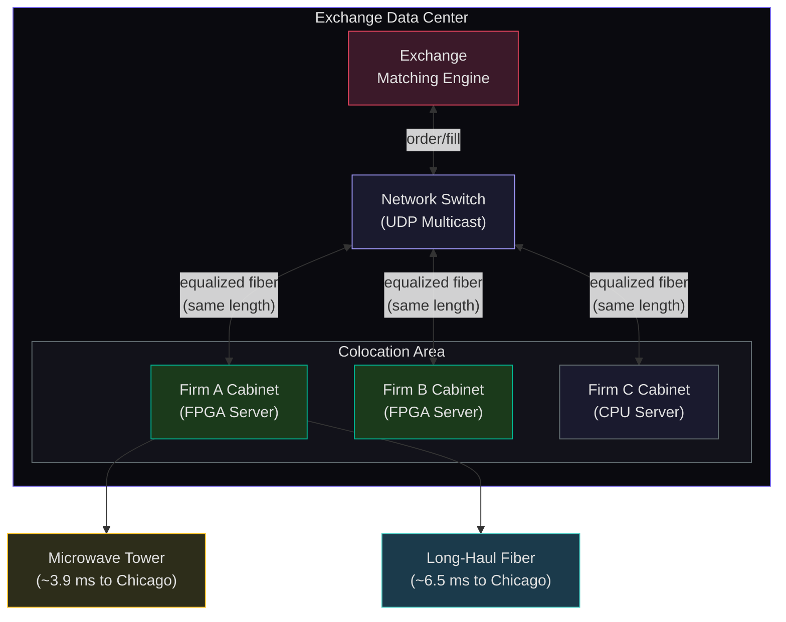

# Hardware Order Books, Risk Checks, and Colocation

The previous lecture traced a market data packet through the FPGA trading pipeline. This lecture goes deep on three components that distinguish production systems from academic prototypes: the hardware order book data structure, the risk management layer, and the physical colocation infrastructure that puts your FPGA inches from the exchange's matching engine. We will also design a complete market-making strategy in fixed-point arithmetic and examine the regulatory framework that governs these systems.

## Hardware Order Book Design

### The Software Approach and Its Limits

In a typical software trading system, the order book is a balanced binary search tree (`std::map<Price, Level>` in C++) or a hash map. Insert, delete, and lookup are O(log N) -- fast enough at microsecond scales, but the constant factors are devastating at nanosecond scales:

- **Cache misses**: Tree nodes are scattered in memory. Each pointer dereference is a potential L1 cache miss (1-2 ns) or L2 miss (5-10 ns).
- **Branch mispredictions**: Traversing a tree involves comparisons at each node, each a potential branch misprediction (~15 cycles on modern CPUs).
- **Memory allocation**: Adding a new price level may trigger `malloc`, which can take microseconds in the worst case.

For an FPGA, we need O(1) everything, deterministic timing, and no dynamic memory allocation.

### Price-Indexed Array: O(1) Access

The fundamental insight is that prices exist on a fixed tick grid defined by the exchange. For US equities, the minimum tick is \$0.01. For a stock trading between \$100 and \$200, there are exactly:

$$N_{\text{levels}} = \frac{\text{price\_range}}{\text{tick\_size}} = \frac{200 - 100}{0.01} = 10{,}000 \text{ levels}$$

The following diagram shows the price-indexed order book structure. Each price level is directly addressable via a single subtraction, providing O(1) access with no tree traversal or hashing:



Pre-allocate an array of 10,000 entries. Index directly:

$$\text{index} = \frac{\text{price} - \text{base\_price}}{\text{tick\_size}}$$

In integer arithmetic (no division, since tick_size is a power of 10):

$$\text{index} = \text{price\_int} - \text{base\_price\_int}$$

where `price_int = price * 10000` (4 decimal places). This is a single subtraction -- one clock cycle.

Each array entry (price level) stores:

```
struct PriceLevel {
    uint32_t total_quantity;    // sum of all order sizes
    uint16_t order_count;       // number of orders (for queue position)
    uint32_t timestamp;         // last update time
};
```

In hardware, this structure occupies a BRAM entry. A 36 Kb BRAM configured as 1024x36-bit can store 1024 price levels with quantity and count packed into 36 bits. For deeper books, use multiple BRAMs or UltraRAM blocks.

The price-indexed array stores bid and ask levels indexed directly by price. The best bid and best ask are maintained in dedicated hardware registers for instant access.



**Operations are all O(1)**:

| Operation | Implementation | Latency |
|---|---|---|
| Add order at price P | `levels[P - base].qty += size` | 1 BRAM read + 1 write = 2 cycles |
| Cancel order at price P | `levels[P - base].qty -= size` | 1 BRAM read + 1 write = 2 cycles |
| Modify order (price change) | Cancel at old price + Add at new price | 4 cycles |
| Execute (fill) at price P | `levels[P - base].qty -= fill_size` | 2 cycles |
| Lookup quantity at price P | `levels[P - base].qty` | 1 BRAM read = 1 cycle |

Compare: a software red-black tree traverses O(log N) nodes, each potentially cache-missing. For a book with 1000 active levels, that is ~10 node comparisons, each taking 2-5 ns. The hardware approach: 2 clock cycles at 5 ns each = 10 ns total, deterministic, every time.

Published results: 253 nanoseconds average across 119,275 instruments simultaneously, using cuckoo hashing for symbol-to-book mapping and only 144 Mbit QDR SRAM (IEEE 2014).

Explore this concept with the interactive simulation below:

<Simulation id="order-book" />

### Best Bid/Ask Tracking

The most critical data points in the order book are the **best bid** (highest bid price) and **best ask** (lowest ask price). These must update on every book change.

**Hardware approach**: Maintain `best_bid` and `best_ask` in dedicated registers (not in the array). On each update:

1. **New order above best bid**: If `order_price > best_bid`, update `best_bid = order_price`. This is a single comparator.
2. **Cancel/fill at best bid**: If the level at `best_bid` becomes empty (`qty == 0`), scan downward to find the next non-empty level. In hardware, this scan uses a priority encoder over the "non-empty" bits of the array -- a tree of OR gates that finds the highest set bit in O(log N) gate delays. For 1024 levels, this is 10 gate delays, approximately 2-3 ns.
3. **Analogous logic for best_ask**, scanning upward.

The hybrid binary-linear search approach (IEEE 2023) optimizes further: maintain the top 5 price levels in a custom cache (simple registers), since empirically over 90% of activity occurs at the top of the book. Only fall back to the full array for deeper levels.

<ConceptCheck id="cc-1" />

### VWAP Calculation in Hardware

Volume-Weighted Average Price is computed as:

$$\text{VWAP} = \frac{\sum_{i} p_i \cdot q_i}{\sum_{i} q_i}$$

In hardware, maintain running accumulators:

- `pq_sum`: sum of price times quantity across all levels
- `q_sum`: sum of all quantities

On each update (add/cancel), adjust:
- `pq_sum += price * delta_qty` (or `pq_sum -= price * delta_qty` for cancel)
- `q_sum += delta_qty` (or subtract)

The division for VWAP is avoided in the critical path. Instead, compare `VWAP * q_sum` against thresholds, eliminating the division entirely:

$$\text{VWAP} > \text{threshold} \iff \text{pq\_sum} > \text{threshold} \times \text{q\_sum}$$

### Market-by-Order vs Market-by-Price

Exchanges publish data in two formats:

| Aspect | Market-by-Order (MBO) | Market-by-Price (MBP) |
|---|---|---|
| Data | Individual orders with unique IDs | Aggregated quantity per price |
| Storage | Hash map: OrderID to {price, qty} | Array: price to {agg_qty, count} |
| Update | Find order by ID, update level | Direct price indexing |
| Latency | 2-step: hash lookup + level update | 1-step: direct index |
| Examples | Nasdaq ITCH, CME MDP3 | Many international exchanges |

For MBO feeds (like Nasdaq ITCH), the order book needs an additional lookup structure: given an OrderID (64-bit integer), find which price level and side (bid/ask) the order belongs to. In software, this is a hash map. In hardware, cuckoo hashing achieves O(1) worst-case lookup with two parallel memory accesses.

## Market-Making Strategy in Hardware

### Fixed-Point Arithmetic: No Floats Allowed

Every price, quantity, and intermediate value in a hardware trading system is an integer. There is no floating-point unit in the critical path. Why?

1. **Deterministic timing**: Integer addition takes exactly 1 cycle. Floating-point addition takes 3-8 cycles depending on exponent alignment.
2. **Resource efficiency**: A 32-bit integer adder uses ~32 LUTs. A single-precision FP adder uses ~300-500 LUTs.
3. **No rounding surprises**: Fixed-point arithmetic is exact within its resolution. IEEE 754 floating-point has rounding modes that can produce unexpected results at tick boundaries.

**Price representation**: $\text{price\_int} = \text{price} \times 10^d$ where $d$ is the number of decimal places.

For 4 decimal places: \$150.25 becomes 1,502,500. The tick size (\$0.01) becomes 100. Half a tick (\$0.005) becomes 50. All arithmetic is integer addition, subtraction, and multiplication -- operations that map to a single DSP block or a chain of LUTs.

### Mid-Price and Spread

$$\text{mid\_price\_int} = (\text{best\_bid\_int} + \text{best\_ask\_int}) \gg 1$$

The right-shift by 1 is free in hardware (just a wiring change, connecting bit $n$ of the sum to bit $n-1$ of the output). The result is the floor of the average; for half-tick precision, keep the LSB.

$$\text{spread\_int} = \text{best\_ask\_int} - \text{best\_bid\_int}$$

One subtraction, one clock cycle.

### Quoting with Inventory Skew

The following diagram shows how a market-making strategy places bid and ask quotes around the mid-price, with inventory skew adjusting both quotes when the firm accumulates a position.

```mermaid
flowchart TB
    subgraph QUOTES["Market-Making Quote Placement"]
        direction TB
        subgraph NEUTRAL["Neutral Position (pos = 0)"]
            direction LR
            NB["My Bid\nmid - half_spread"]
            NM["Mid Price"]
            NA["My Ask\nmid + half_spread"]
            NB ~~~ NM ~~~ NA
        end
        subgraph LONG["Long Position (pos > 0, skew down)"]
            direction LR
            LB["My Bid\nmid - half_spread\n- skew"]
            LM["Mid Price"]
            LA["My Ask\nmid + half_spread\n+ skew"]
            LB ~~~ LM ~~~ LA
        end
        subgraph SHORT["Short Position (pos < 0, skew up)"]
            direction LR
            SB["My Bid\nmid - half_spread\n+ skew"]
            SM["Mid Price"]
            SA["My Ask\nmid + half_spread\n- skew"]
            SB ~~~ SM ~~~ SA
        end
    end

    style NEUTRAL fill:#1a1a2e,stroke:#a29bfe,color:#e0e0e0
    style LONG fill:#1a2d1a,stroke:#4ade80,color:#e0e0e0
    style SHORT fill:#2d1a1a,stroke:#f87171,color:#e0e0e0
    style NB fill:#2d4a2d,stroke:#4ade80
    style NA fill:#4a2d2d,stroke:#f87171
    style NM fill:#2d2d4a,stroke:#818cf8
    style LB fill:#1a3d1a,stroke:#22c55e
    style LA fill:#3d1a1a,stroke:#dc2626
    style LM fill:#2d2d4a,stroke:#818cf8
    style SB fill:#1a3d1a,stroke:#22c55e
    style SA fill:#3d1a1a,stroke:#dc2626
    style SM fill:#2d2d4a,stroke:#818cf8
```



A market maker quotes both sides of the book (bid and ask) and profits from the spread. But when inventory accumulates on one side, the risk increases. The standard approach: **skew quotes** to discourage further accumulation.

$$\text{my\_bid} = \text{mid} - \text{base\_half\_spread} - \text{skew} \times \text{position}$$
$$\text{my\_ask} = \text{mid} + \text{base\_half\_spread} + \text{skew} \times \text{position}$$

If `position > 0` (long inventory), the bid moves down and the ask moves up -- discouraging further buys and encouraging sells. If `position < 0` (short inventory), the opposite.

In fixed-point hardware:

```
// All integers. skew_coeff is a fixed-point coefficient, e.g., 2 (meaning 0.02% of position)
skew_amount = (skew_coeff * position) >> SKEW_SHIFT;
bid_price = mid_price - base_half_spread - skew_amount;
ask_price = mid_price + base_half_spread + skew_amount;
```

The multiply uses one DSP block. The shift is free. The adds/subtracts use carry-chain logic. Total: 1-2 clock cycles.

<ConceptCheck id="cc-2" />

### Position and P&L Tracking

Position tracking is a running counter:

- Buy fill: `position += fill_quantity`
- Sell fill: `position -= fill_quantity`

P&L tracking in fixed-point:

$$\text{realized\_pnl} \mathrel{+}= \text{fill\_qty} \times (\text{fill\_price} - \text{avg\_entry\_price})$$
$$\text{unrealized\_pnl} = \text{position} \times (\text{mid\_price} - \text{avg\_entry\_price})$$

Average entry price is maintained as a running weighted average:

$$\text{avg\_entry} = \frac{\text{total\_cost\_int}}{\text{total\_qty}}$$

The division is computed only when needed for display or when the position changes sign. In the critical path, P&L is compared against thresholds using cross-multiplication to avoid division.

## Pre-Trade Risk Checks

Risk checks are not optional. They are regulatory requirements and firm survival mechanisms. In 2012, Knight Capital lost $440 million in 45 minutes due to a software deployment error with inadequate risk controls. The system sent millions of erroneous orders before anyone could stop it.

In an FPGA pipeline, risk checks execute in **parallel combinational logic**. Every check is an integer comparison that completes in a single clock cycle (~5-15 ns for the full set):

### Position Limits

```
// Check: would this order breach the position limit?
new_position = position + (is_buy ? order_qty : -order_qty);
position_ok = (abs(new_position) < max_position);
```

In hardware: one adder (for new_position), one absolute value (conditional negate), one comparator. ~3 LUT delays.

### Rate Limiting

```
// Count orders in the current second
if (current_second != last_second) {
    order_count = 0;
    last_second = current_second;
}
order_count += 1;
rate_ok = (order_count < max_orders_per_second);
```

One counter, one comparator, one second-boundary detector. The counter resets each second using a timer driven by the FPGA's clock.

### Price Reasonability

```
// Reject orders that are too far from the market
deviation = abs(order_price - mid_price);
price_ok = (deviation < max_deviation);
```

Prevents "fat finger" errors where a misplaced decimal sends an order at 10x or 0.1x the intended price.

### Notional Limit

```
// Reject orders with excessive dollar value
notional = price * quantity;  // DSP block multiplication
notional_ok = (notional < max_notional);
```

One DSP multiplication, one comparison.

### Kill Switch

A master kill signal that suppresses all outbound orders. Set by a CPU-accessible control register (AXI-Lite slave) when risk systems detect anomalies. Clearing the kill switch requires human intervention.

All five risk checks execute in parallel combinational logic. Each check produces a single-bit pass/fail signal, and the final AND gate determines whether the order proceeds.



The following diagram shows the parallel risk check pipeline. All checks execute simultaneously in combinational logic, and a single AND gate combines their results to produce the order-valid signal:



**All risk checks execute simultaneously** in parallel combinational logic. The final order-valid signal is:

```
order_valid = position_ok & rate_ok & price_ok & notional_ok & !kill_switch;
```

A single AND gate. If any check fails, the order is suppressed before it reaches the NIC transmitter. Total risk check latency: the delay through the longest comparison chain, approximately 5-15 ns.

<ConceptCheck id="cc-3" />

## Colocation Infrastructure

### Exchange Data Centers

To minimize network latency, trading firms colocate their servers in the same data center as the exchange's matching engine. The major US exchange data centers:

| Exchange | Location | Details |
|---|---|---|
| NYSE/ICE | Mahwah, NJ (USLC) | ~400,000 sq ft, opened 2010 |
| Nasdaq | Carteret, NJ | Primary matching engine |
| CME Group | Aurora, IL | 49 miles SW of Chicago |
| CBOE | Secaucus, NJ | EDGX, BZX, BYX engines |
| TMX (Canada) | Markham, ON | Toronto Stock Exchange |

The following diagram shows the colocation infrastructure layout at an exchange data center. Trading firms place FPGA servers in colocated cabinets, connected via equalized cross-connect fiber directly to the exchange matching engine:



### Cable Equalization: Fairness by the Foot

Here is a remarkable fact: **one foot of fiber optic cable adds one nanosecond of latency**. If your server cabinet is 50 feet closer to the exchange's switch than a competitor's cabinet, you have a 50 ns advantage -- enough to win the race on a significant fraction of opportunities.

Exchanges address this with **cable equalization**. At NYSE's Mahwah facility (ICE US Liquidity Center):

- All Liquidity Center Network (LCN) connections are **normalized** to ensure equal fiber length regardless of cabinet location
- All customer-to-customer Local Cross-Connect (LCX) connections are normalized
- Connections are tested via **Optical Backscatter Reflectometry (OBR)** during delivery
- Harmonized cabling ensures equal latency between ICE network equipment and each customer cabinet

CBOE implements explicit latency equalization across all colocated participants. The result: all participants at a given exchange have identical network distance to the matching engine. The competition shifts entirely to processing speed -- which is where FPGAs win.

The following diagram shows the physical layout of a colocation facility. The trading firm's FPGA rack connects directly to the exchange matching engine via cross-connect fiber, with cable equalization ensuring equal distance for all participants.

```mermaid
flowchart LR
    subgraph COLO["Exchange Colocation Data Center"]
        direction TB
        subgraph EXCHANGE["Exchange Infrastructure"]
            ME["Matching\nEngine"]
            SW["Network\nSwitch"]
        end
        subgraph CONNECT["Cross-Connect (direct fiber)"]
            FIB["Fiber Pair\n~$300/month\nCable-equalized"]
        end
        subgraph FIRM["Trading Firm Rack"]
            FPGA["FPGA\nAccelerator\nCard"]
            SRV["Server\n(monitoring,\nlogging)"]
            NIC["10/25/100G\nNIC"]
        end
    end

    ME --> SW
    SW -->|"Equal-length\nfiber to all\nparticipants"| FIB
    FIB --> NIC
    NIC --> FPGA
    FPGA --> SRV

    style COLO fill:#0a0a0f,stroke:#6c5ce7,color:#e0e0e0
    style EXCHANGE fill:#2d1a1a,stroke:#f87171,color:#e0e0e0
    style CONNECT fill:#2d2d1a,stroke:#fbbf24,color:#e0e0e0
    style FIRM fill:#1a2d1a,stroke:#4ade80,color:#e0e0e0
    style ME fill:#4a2d2d,stroke:#f87171
    style FPGA fill:#2d4a2d,stroke:#4ade80
    style FIB fill:#4a3d2d,stroke:#fbbf24
```



### Cross-Connect: Direct Fiber

A **cross-connect** is a direct fiber optic cable from your cabinet to the exchange's switch (or to another participant's cabinet). No intermediate routing, no additional latency. Cost: \$200-\$500/month per fiber pair. Typical colocation costs:

| Item | Approximate Cost |
|---|---|
| NYSE Mahwah: 8-rack unit (partial cabinet) | ~\$2,500/month |
| NYSE Mahwah: 1 kW power add-on | ~\$1,500/month |
| Full cabinet at major exchange | \$5,000--\$20,000+/month |
| Cross-connect (fiber pair) | \$200--\$500/month |
| McKay Brothers microwave link | ~\$10,000--\$50,000+/month |
| Building in-house FPGA infrastructure | \$5M+ and 3+ years |

### Long-Haul Connectivity: Microwave vs Fiber

For trading between Chicago (CME futures) and New Jersey (NYSE/Nasdaq equities), long-haul latency matters. Two technologies compete:

| Medium | One-Way Latency | Round-Trip | Speed |
|---|---|---|---|
| Fiber optic | ~6.5 ms | ~13.0 ms | ~204 km/ms (refraction index ~1.47) |
| Microwave | ~3.9--4.0 ms | ~7.8--8.2 ms | ~299 km/ms (near speed of light in air) |
| Theoretical (straight line, vacuum) | ~3.86 ms | ~7.72 ms | Speed of light |

Microwave travels at near light speed through air, while fiber travels at about 68% of light speed due to total internal reflection in glass. The result: microwave is approximately 40% faster than fiber over the ~1,156 km distance.

**McKay Brothers** (founded ~2012) operates microwave links between major financial centers:

- Aurora (CME) to Secaucus NY2: 7.83 ms round trip
- Aurora to Carteret (Nasdaq): 7.82 ms round trip
- New Jersey to Toronto (Markham): <1.754 ms one-way

Other providers: Anova Technologies (microwave and millimeter-wave), Jump Trading (owns its own tower network), and Spread Networks (built dedicated fiber in 2010, achieving 12.98 ms round trip).

The math: microwave latency is approximately **5.4 microseconds per mile** (near speed of light). Fiber is approximately **8.01 microseconds per mile** (refractive index penalty). Over 700 miles, microwave saves about 1.8 milliseconds each way.

<ConceptCheck id="cc-4" />

## IMC Trading: A Practitioner's Perspective

IMC Trading, one of the world's largest market-making firms, provides an unusually transparent view into FPGA trading infrastructure:

**Build vs Buy**: IMC builds FPGA infrastructure in-house rather than purchasing off-the-shelf solutions. Their hardware engineers work "in lockstep with software engineers and traders, carefully dissecting trading algorithms into the pieces that are best suited for hardware versus software." The decision of what runs on FPGA versus CPU is deliberate and ongoing.

**The Core Trade-off**: "A software developer can write code in a software language and know within seconds whether it works, and so deploy it quickly. However, the code will have to go through several abstraction layers and generic hardware components." Versus: "As an FPGA engineer, it may take two to three hours of compilation time before you know whether your adjustment will result in the outcome you want. However, you can increase performance at the cost of more engineering time."

**Why Not ASICs**: FPGAs occupy a "middle ground -- significantly faster than CPUs while remaining more flexible than ASICs." Trading strategies change frequently -- sometimes daily. An ASIC's 1-3 year design cycle and $50M+ NRE are unacceptable when the strategy might be obsolete before the chip is manufactured.

**Scale**: IMC maintains "one of the largest dedicated FPGA engineering setups in the trading industry," with continuous exploration and development for "more than a decade."

## Regulatory Framework

Latency advantages are powerful, and regulators have responded:

**MiFID II** (European Markets in Financial Instruments Directive): Requires algorithmic trading firms to have risk controls, maintain audit trails, and submit algorithmic trading notification. Kill switches are mandatory.

**Reg NMS** (US Regulation National Market System): Establishes rules for order routing and best execution. The Order Protection Rule requires that orders be executed at the best available price across all exchanges.

**Kill Switches**: Exchanges require firms to implement kill switches that can halt all trading activity within seconds. In FPGA systems, this is a single control register bit that gates the order output -- one AND gate in the critical path.

**Audit Trails**: All orders must be logged with nanosecond timestamps. FPGA systems typically log to a ring buffer in BRAM or external DRAM, with a CPU-based system reading the log asynchronously.

## Measurement and Verification

How do you measure sub-microsecond latencies? Specialized hardware:

| Tool | Purpose |
|---|---|
| Corvil | Network analytics and latency measurement |
| FMADIO | Full-line-rate packet capture (100 Gbps) |
| Endace | Hardware-timestamped packet capture |
| Napatech | SmartNIC with hardware timestamping |
| Arista 7130 | Switch with FPGA for in-line processing |
| AMD Alveo UL3524 | FPGA accelerator card for trading |

The tick-to-trade latency definition is precise: time from last bit (EOF) of inbound market data message to last bit (EOF) of outbound order message, measured at the wire using binary protocols. Important caveat: industry measurements typically exclude strategy computation time, so published numbers can be misleading for strategies with complex alpha signals.

## Python Simulation: Complete Market-Making Pipeline

```python
class FixedPointBook:
    """Hardware-style order book with fixed-point arithmetic.
    All prices are integers (price * 10000).
    """
    def __init__(self, base_price_int: int, num_levels: int = 1024):
        self.base = base_price_int
        self.num_levels = num_levels
        self.bid_qty = [0] * num_levels
        self.ask_qty = [0] * num_levels
        self.best_bid_idx = -1
        self.best_ask_idx = num_levels

    def _idx(self, price_int: int) -> int:
        return price_int - self.base

    def add_order(self, side: str, price_int: int, qty: int):
        idx = self._idx(price_int)
        if side == 'B':
            self.bid_qty[idx] += qty
            if idx > self.best_bid_idx:
                self.best_bid_idx = idx
        else:
            self.ask_qty[idx] += qty
            if idx < self.best_ask_idx:
                self.best_ask_idx = idx

    def cancel_order(self, side: str, price_int: int, qty: int):
        idx = self._idx(price_int)
        if side == 'B':
            self.bid_qty[idx] = max(0, self.bid_qty[idx] - qty)
            if self.bid_qty[idx] == 0 and idx == self.best_bid_idx:
                while self.best_bid_idx >= 0 and self.bid_qty[self.best_bid_idx] == 0:
                    self.best_bid_idx -= 1
        else:
            self.ask_qty[idx] = max(0, self.ask_qty[idx] - qty)
            if self.ask_qty[idx] == 0 and idx == self.best_ask_idx:
                while self.best_ask_idx < self.num_levels and self.ask_qty[self.best_ask_idx] == 0:
                    self.best_ask_idx += 1

    @property
    def best_bid(self) -> int:
        return self.base + self.best_bid_idx if self.best_bid_idx >= 0 else 0

    @property
    def best_ask(self) -> int:
        return self.base + self.best_ask_idx if self.best_ask_idx < self.num_levels else 0

    @property
    def mid_price(self) -> int:
        return (self.best_bid + self.best_ask) >> 1  # integer division by 2

    @property
    def spread(self) -> int:
        return self.best_ask - self.best_bid


# Demo: build a book and compute market-making quotes
TICK = 100  # $0.01 = 100 units (4 decimal places)
BASE = 1_500_000  # $150.00

book = FixedPointBook(BASE, num_levels=2000)

# Add some orders
book.add_order('B', 1_502_500, 500)  # bid $150.25 x 500
book.add_order('B', 1_502_400, 300)  # bid $150.24 x 300
book.add_order('A', 1_502_600, 200)  # ask $150.26 x 200
book.add_order('A', 1_502_700, 150)  # ask $150.27 x 150

print(f"Best Bid: ${book.best_bid / 10000:.4f}")
print(f"Best Ask: ${book.best_ask / 10000:.4f}")
print(f"Mid:      ${book.mid_price / 10000:.4f}")
print(f"Spread:   ${book.spread / 10000:.4f} ({book.spread / TICK:.1f} ticks)")

# Market-making with inventory skew
position = 200  # long 200 shares
base_half_spread = 50  # 0.5 ticks
skew_per_share = 1  # 0.01 tick per share of inventory

skew = skew_per_share * position
my_bid = book.mid_price - base_half_spread - skew
my_ask = book.mid_price + base_half_spread + skew

print(f"\nPosition: {position} shares (long)")
print(f"Skew: {skew / TICK:.2f} ticks")
print(f"My Bid: ${my_bid / 10000:.4f}")
print(f"My Ask: ${my_ask / 10000:.4f}")
print(f"Effective spread: ${(my_ask - my_bid) / 10000:.4f}")
print(f"\nAll arithmetic: integer only. Zero floating-point operations.")
```

## Summary

The hardware order book uses price-indexed arrays for O(1) access, with best bid/ask maintained in dedicated registers and priority encoders for level scanning. All arithmetic is fixed-point integer -- no floating point in the critical path. Market-making strategies compute mid-price, spread, and inventory-skewed quotes using integer addition, subtraction, and DSP-block multiplication in 1-2 clock cycles.

Pre-trade risk checks (position limits, rate limiting, price reasonability, notional limits, kill switch) execute in parallel combinational logic, completing in 5-15 ns. The final order-valid signal is a single AND gate combining all checks.

Colocation places the FPGA within the exchange's data center. Cable equalization ensures equal network distance. Microwave links (McKay Brothers: 7.82 ms round-trip Chicago-NJ) save ~5 ms versus fiber for inter-exchange strategies.

The result: published systems achieve 270 ns (Boutros et al.), 433 ns (IEEE 2022), and 480 ns (IEEE 2024) tick-to-trade latency. Top firms achieve sub-100 ns. IMC Trading builds in-house because the edge justifies the investment: "FPGAs occupy a middle ground -- significantly faster than CPUs while remaining more flexible than ASICs."

These two weeks -- FPGA architecture, Verilog HDL, and the complete trading pipeline -- feed directly into Project 5, where you will build a software simulation of the entire system: FAST decoder, hardware-style order book, market-making strategy, and risk checker, all using integer arithmetic and clock-cycle-accurate timing.
