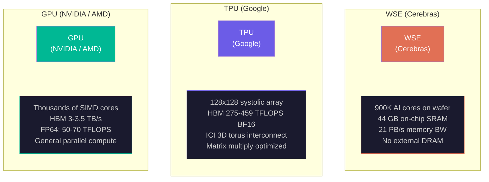
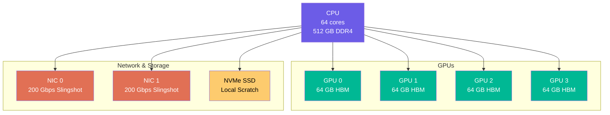
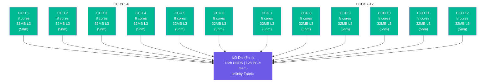
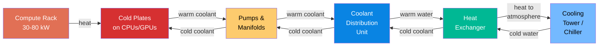

# Supercomputer Architecture: From Frontier to El Capitan

What separates a supercomputer from a really big cluster? In principle, nothing. In practice, everything. A supercomputer is a cluster engineered so tightly -- from the silicon in each accelerator to the optical fibers linking every cabinet -- that ten thousand nodes behave as a single coherent machine. This lecture dissects the architectures of the world's fastest machines, the accelerators inside them, and the physical constraints that determine how fast we can actually compute.

## Defining a Supercomputer: FLOPS, Parallelism, Interconnect

The TOP500 list ranks supercomputers by a single number: $R_{\max}$, the maximum achieved floating-point performance on the High-Performance LINPACK (HPL) benchmark. HPL solves a dense system of linear equations $Ax = b$ using LU factorization with partial pivoting. It is embarrassingly parallel and dominated by dense matrix-multiply, which makes it a good measure of peak throughput but a poor predictor of real-application performance.

Three quantities define a supercomputer:

1. **FLOPS** (Floating-Point Operations Per Second). We distinguish $R_{\text{peak}}$ -- the theoretical maximum computed from clock speed, core count, and operations per cycle -- from $R_{\max}$, the achieved rate on HPL. The ratio $R_{\max}/R_{\text{peak}}$ is the **HPL efficiency**, typically 60-80% for well-designed machines.

2. **Parallelism**. Modern exascale systems have tens of thousands of nodes, each containing multiple accelerators. Frontier has 9,856 nodes with 4 GPUs each. El Capitan has 11,136 nodes with 4 APUs each. The total core count (counting GPU stream processors) exceeds 8 million.

3. **Interconnect**. A supercomputer is only as fast as its network. At exascale, the communication bandwidth between nodes determines whether you get 80% efficiency or 30%. The interconnect topology, link bandwidth, and routing algorithm are as important as the processors themselves.

### The Exascale Threshold

One exaFLOP is $10^{18}$ floating-point operations per second. To appreciate this scale: if every human on Earth performed one calculation per second, it would take 4.5 years to match one second of an exascale machine. As of the November 2025 TOP500, four systems have crossed this threshold.

## The TOP500: Current Top Systems

### #1 -- El Capitan (LLNL)

El Capitan at Lawrence Livermore National Laboratory is the world's fastest supercomputer. Its architecture centers on the AMD Instinct MI300A, an APU (Accelerated Processing Unit) that integrates CPU and GPU on a single package:

| Attribute | Value |
|-----------|-------|
| **Architecture** | AMD EPYC "Genoa" 24-core (4th Gen) + AMD Instinct MI300A (CDNA3) |
| **Nodes** | 11,136 compute nodes, 4 MI300A per node = 44,544 MI300A total |
| **CPUs** | 43,808 AMD EPYC 24C "Genoa" at 1.8 GHz |
| **GPUs** | 43,808 AMD Instinct MI300A (128 GB HBM3 each) |
| **$R_{\max}$** | 1.742 EFlop/s (HPL), later improved to 1.809 EFlop/s |
| **$R_{\text{peak}}$** | ~2.75 EFlop/s |
| **Interconnect** | HPE Slingshot-11, dragonfly topology, 200 Gbps/port |
| **Power** | ~30 MW |
| **Efficiency** | 58.89 GFlops/W |
| **Cooling** | 100% direct liquid cooling (fanless) |

The MI300A is architecturally significant because it eliminates the PCIe bottleneck between CPU and GPU. Traditional GPU nodes connect the CPU to the GPU via PCIe Gen5 (64 GB/s per direction). The MI300A integrates 24 Zen4 CPU cores and CDNA3 GPU compute dies onto a single package with unified access to 128 GB HBM3 memory. The CPU and GPU share the same memory controllers, eliminating the need for explicit data transfers.

<ConceptCheck id="cc-1" />

### #2 -- Frontier (ORNL)

Frontier at Oak Ridge National Laboratory was the first system to break the exaFLOP barrier (June 2022):

| Attribute | Value |
|-----------|-------|
| **Architecture** | AMD EPYC 7A53 "Trento" 64-core + AMD Instinct MI250X (CDNA2) |
| **Nodes** | 9,856 nodes (expanded from original 9,408), 77 cabinets |
| **GPUs per node** | 4 MI250X, each with 2 GCDs = 8 GCDs/node |
| **Total GPUs** | 37,888 MI250X (8,335,360 GPU cores) |
| **$R_{\max}$** | 1.353 EFlop/s |
| **$R_{\text{peak}}$** | ~1.68 EFlop/s |
| **Interconnect** | HPE Slingshot-11, dragonfly topology |
| **Power** | ~21 MW |

Each Frontier compute node contains 1 AMD EPYC 7A53 CPU (64 cores, 2 threads per core) with 512 GB DDR4, connected to 4 MI250X GPUs. Each MI250X has 2 Graphics Compute Dies (GCDs), each presenting as a separate GPU with 64 GB HBM2e and 1.6 TB/s memory bandwidth. Peak FP64 performance per MI250X is 47.9 TFLOPS (matrix). The storage subsystem (Orion) is a Lustre-based parallel file system with 700 PB capacity and 10+ TB/s aggregate bandwidth.

### #3 -- Aurora (ALCF)

Aurora at Argonne National Laboratory uses an Intel-based architecture:

| Attribute | Value |
|-----------|-------|
| **Architecture** | Intel Xeon Max (Sapphire Rapids w/ HBM) + Intel Data Center GPU Max (Ponte Vecchio) |
| **Nodes** | 10,624 Exascale Compute Blades |
| **CPUs per node** | 2x Intel Xeon Max 9470 (52 cores each) |
| **GPUs per node** | 6x Intel GPU Max 1550 (Ponte Vecchio) |
| **$R_{\max}$** | 1.012 EFlop/s |
| **Interconnect** | HPE Slingshot-11, dragonfly topology, 8 NICs per node |
| **Power** | ~42 MW |

Aurora has the largest Slingshot-11 deployment in the world, with over 300,000 fabric ports. Each blade achieves approximately 145 TF/s double-precision HPL.

### #4 -- JUPITER (JSC)

JUPITER at the Julich Supercomputing Centre in Germany is the first European exascale system:

| Attribute | Value |
|-----------|-------|
| **Architecture** | NVIDIA GH200 Grace Hopper Superchips |
| **Accelerators** | ~24,000 NVIDIA GH200 |
| **$R_{\max}$** | 1.000 EFlop/s |
| **Interconnect** | NVIDIA InfiniBand NDR, DragonFly+ topology |
| **Efficiency** | 60 GFlops/W (most energy-efficient in top 5) |
| **Budget** | 500M EUR |

### Other Notable Systems

**Fugaku** (RIKEN, Japan) is historically significant as the first ARM-based system to top the TOP500 (June 2020). It uses the Fujitsu A64FX processor with 48 ARM v8.2A cores, 32 GB HBM2 per chip at 1 TB/s bandwidth, and a 6D mesh/torus interconnect (Tofu Interconnect D, topology 24x23x24x2x3x2). Fugaku achieves 442 PFlop/s across 158,976 nodes.

**LUMI** (CSC, Finland) mirrors Frontier's architecture (AMD EPYC Trento + MI250X) with 2,978 GPU nodes. It achieves 379.7 PFlop/s at only 8 MW. LUMI is powered entirely by hydroelectric power, and its waste heat is used for district heating in the city of Kajaani -- achieving 53.4 GFlops/W efficiency.

## Accelerator Architectures

The compute workhorses in modern supercomputers are accelerators, not CPUs. Three fundamentally different architectures dominate.



### GPU-Accelerated: NVIDIA and AMD

GPUs exploit **massive thread-level parallelism**. A single NVIDIA H100 SXM has 16,896 CUDA cores and 528 Tensor Cores, achieving 989 TFLOPS FP16 or 67 TFLOPS FP64. AMD's MI250X achieves 47.9 TFLOPS FP64 (matrix) with 220 Compute Units across 2 GCDs.

The key architectural choice is **HBM (High Bandwidth Memory)**. GPU compute is so fast that standard GDDR memory cannot feed data quickly enough. HBM stacks multiple DRAM dies vertically and connects them via a silicon interposer with thousands of through-silicon vias (TSVs). The MI250X achieves 3.2 TB/s total memory bandwidth across its two GCDs. The NVIDIA H100 achieves 3.35 TB/s with HBM3.

### Google TPU: Systolic Arrays

Google's Tensor Processing Units take a fundamentally different approach. Instead of thousands of general-purpose scalar cores, each TPU chip contains a **systolic array** -- the Matrix Multiply Unit (MXU).

The MXU is a 128x128 grid of multiply-accumulators (256x256 in TPU v6e and later). Data flows through the array in a wave pattern: one matrix enters from the left, the other from the top, and partial sums accumulate as they flow rightward. Each cycle, the entire 128x128 array performs 16,384 multiply-accumulate operations simultaneously.

$$\text{Ops per cycle (MXU)} = 128 \times 128 \times 2 = 32{,}768 \text{ (multiply + accumulate)}$$

Inputs use **bfloat16** (brain floating point): 1 sign bit, 8 exponent bits, 7 mantissa bits. This preserves the dynamic range of FP32 (same exponent width) while halving storage and bandwidth requirements. Accumulation happens in FP32 to prevent error drift.

Each TensorCore contains 4 MXUs plus vector and scalar units. TPU v4 has 2 TensorCores per chip (8 MXUs total), with 32 GB HBM2e and 275 TFLOPS BF16 peak. TPU v5p doubles the memory to 96 GB and reaches 459 TFLOPS BF16 per chip, with pods of 8,960 chips reaching 4.0 EFLOPS aggregate.

TPU interconnect uses a 3D torus called ICI (Inter-Chip Interconnect), with optical circuit switching (OCS) to dynamically reconfigure topology between cube groups. Twisted torus configurations increase bisection bandwidth by approximately 70% over non-twisted variants.

<ConceptCheck id="cc-2" />

### Cerebras WSE: Wafer-Scale Integration

Cerebras took the most radical approach: **put the entire wafer in the machine**. The WSE-2 (Wafer-Scale Engine 2) is a single 215mm x 215mm die containing:

| Attribute | WSE-2 | WSE-3 |
|-----------|-------|-------|
| **Process** | TSMC 7nm | TSMC 5nm |
| **Die area** | 46,225 mm$^2$ (full 300mm wafer) | 46,225 mm$^2$ |
| **Transistors** | 2.6 trillion | 4 trillion |
| **AI cores** | 850,000 | 900,000 |
| **On-chip SRAM** | 40 GB | 44 GB |
| **Memory bandwidth** | 20 PB/s | 21 PB/s |
| **FP16 peak** | 7.5 PFLOPS | 125 PFLOPS |

The most striking design choice: **no external DRAM**. All 40-44 GB of memory is SRAM, fabricated directly on the wafer. SRAM access latency is approximately 1 ns versus 50-100 ns for DRAM -- a 50-100x advantage. On-chip bandwidth is 20 PB/s versus roughly 3 TB/s for GPU HBM -- a 7,000x advantage. The trade-off is capacity: 44 GB of SRAM versus 80-192 GB of HBM per GPU.

For models exceeding on-chip capacity, Cerebras offers **MemoryX** (external memory appliances up to 1.5 PB) and **SwarmX** (interconnect fabric linking up to 2,048 CS-3 systems for a theoretical 0.25 zettaFLOPS aggregate). The key insight is that the wafer-scale approach eliminates package boundaries entirely: all 900,000 cores communicate via on-die interconnect at 220 Pb/s fabric bandwidth, versus approximately 900 GB/s for NVLink between discrete GPUs.

## Node Architecture

A supercomputer node is the atomic unit of computation. Understanding node architecture is essential for writing efficient HPC code.

### Standard GPU Node Layout

A typical GPU-accelerated node (Frontier-style) contains:



```
CPU (64 cores, 512 GB DDR4)
  ├── PCIe Gen5 / CXL → GPU 0 (64 GB HBM)
  ├── PCIe Gen5 / CXL → GPU 1 (64 GB HBM)
  ├── PCIe Gen5 / CXL → GPU 2 (64 GB HBM)
  ├── PCIe Gen5 / CXL → GPU 3 (64 GB HBM)
  ├── NIC 0 (200 Gbps Slingshot)
  ├── NIC 1 (200 Gbps Slingshot)
  └── NVMe SSD (local scratch)
```

GPU-to-GPU communication within a node uses high-bandwidth links (NVLink at 900 GB/s bidirectional for NVIDIA, Infinity Fabric for AMD). Cross-node communication uses the NIC through the interconnect fabric. The ratio of intra-node to inter-node bandwidth is typically 10-50x, which profoundly affects how applications decompose work.

### APU Architecture: El Capitan's MI300A

The MI300A eliminates the CPU-GPU boundary. Each MI300A package contains:
- 24 Zen4 CPU cores (3 CCDs)
- CDNA3 GPU compute dies
- 128 GB HBM3 shared memory
- Unified memory controllers

The CPU and GPU access the same physical memory without explicit transfers. This is architecturally similar to Apple's unified memory (discussed below) but at data-center scale with HBM3 bandwidth.

## AMD EPYC Chiplet Architecture

The CPUs in Frontier and El Capitan use AMD's chiplet design, which is an important architectural innovation in its own right.

Rather than fabricating a single monolithic die with all cores, AMD separates the processor into:

- **CCDs (Core Complex Dies)**: Each CCD contains 8 cores (2 CCXs of 4 cores) with 32 MB shared L3 cache, fabricated on TSMC 5nm.
- **IOD (I/O Die)**: A central hub containing memory controllers (12 channels DDR5), PCIe lanes (128 Gen5), and Infinity Fabric interconnect, fabricated on TSMC 6nm.

EPYC Genoa (4th Gen) packs up to 12 CCDs around a single IOD, for 96 cores and 384 MB total L3 cache. The CCDs connect to the IOD via GMI (Global Memory Interconnect) links at approximately 32 GB/s per link.



The yield advantage of chiplets is substantial. Using the negative binomial yield model:

$$Y = \left(1 + \frac{A \cdot D}{\alpha}\right)^{-\alpha}$$

where $A$ is die area, $D$ is defect density, and $\alpha$ is the clustering parameter. A small 8-core CCD at approximately 70 mm$^2$ has dramatically higher yield than a hypothetical monolithic 96-core die at approximately 700 mm$^2$. AMD estimates that 4 smaller dies cost less than 60% of one large equivalent die.

The NUMA (Non-Uniform Memory Access) implications are important. Each CCD's GMI path to the IOD determines memory access latency. EPYC supports configurable NUMA modes:
- **NPS1**: Entire socket = 1 NUMA node (uniform but higher average latency)
- **NPS2**: 2 NUMA nodes (6 CCDs + 6 memory channels each)
- **NPS4**: 4 NUMA nodes (3 CCDs + 3 channels each)

<ConceptCheck id="cc-3" />

## Apple M-Series: Unified Memory at Consumer Scale

Apple Silicon demonstrates unified memory architecture at the consumer end. The M4 Max integrates CPU cores, GPU cores, Neural Engine, and media engines on a single SoC, all sharing LPDDR5 memory through a unified address space.

| Chip | Memory BW | Max Capacity | CPU Cores | GPU Cores |
|------|-----------|-------------|-----------|-----------|
| M4 | 120 GB/s | 32 GB | 10 | 10 |
| M4 Pro | 273 GB/s | 48 GB | 14 | 20 |
| M4 Max | 546 GB/s | 128 GB | 16 | 40 |

The key advantage is **zero-copy access**: a tensor computed by the CPU is immediately available to the GPU without any DMA transfer. On a discrete-GPU system, a 10 GB model requires 10 GB system RAM plus 10 GB VRAM; on Apple Silicon, it requires just 10 GB total.

The limitation is bandwidth: the M4 Max at 546 GB/s is fast for consumer hardware, but an NVIDIA H100 achieves 3.35 TB/s with HBM3 -- roughly 6x more. For raw compute throughput, discrete GPUs vastly outperform integrated solutions.

## Power, Cooling, and Efficiency

### The Power Wall

Frontier consumes 21 MW -- enough to power approximately 15,000 homes. El Capitan draws 30 MW. Aurora requires 42 MW. These power budgets are a hard constraint on performance: you cannot simply add more nodes without adding more power delivery and cooling infrastructure.

**Power Usage Effectiveness (PUE)** measures total facility power divided by IT equipment power:

$$\text{PUE} = \frac{P_{\text{total facility}}}{P_{\text{IT equipment}}}$$

A PUE of 1.0 is perfect (all power goes to computing); typical data centers achieve 1.2-1.4. The difference is cooling, networking, lighting, and other overhead.

### Cooling Technologies

Modern supercomputers use three cooling approaches:



1. **Air cooling**: Fans force air over heat sinks. Simple but limited to approximately 200-300W per component. Inadequate for modern GPUs at 400-700W.

2. **Direct liquid cooling**: Cold plates mounted directly on CPUs and GPUs, with liquid flowing through microchannels. Frontier and El Capitan use this approach. El Capitan is 100% fanless -- all heat is removed by liquid.

3. **Immersion cooling**: Components submerged in dielectric fluid (e.g., 3M Novec). Highest cooling capacity but most complex infrastructure.

### Energy Efficiency as a Metric

The Green500 list ranks supercomputers by FLOPS per watt. JUPITER leads the top 5 at 60 GFlops/W. The trend is clear: efficiency matters as much as raw performance. A 10% improvement in FLOPS/W translates directly to either 10% more performance at the same power budget or 10% lower operating cost.

## Benchmarks Beyond LINPACK

HPL (High-Performance LINPACK) measures dense linear algebra throughput, but real applications have diverse computational patterns. Two additional benchmarks provide complementary perspectives:

**HPCG (High Performance Conjugate Gradients)** measures performance on sparse linear algebra -- iterative solvers with irregular memory access patterns. HPCG efficiency is typically 1-5% of $R_{\text{peak}}$, versus 60-80% for HPL. This enormous gap reveals how much real-application performance is limited by memory bandwidth and latency rather than raw compute.

**HPL-MxP (Mixed Precision)** measures dense linear algebra using low-precision arithmetic (FP16/BF16) with iterative refinement to achieve FP64 accuracy. This benchmark reflects the mixed-precision techniques used in AI training, where the bulk of computation happens in reduced precision.

<ConceptCheck id="cc-4" />

## From Specifications to Understanding

The numbers in this lecture -- 1.8 EFlop/s, 44,544 MI300A chips, 30 MW, 200 Gbps per port -- are not abstract. They represent engineering trade-offs made by teams of thousands of people over years of design. El Capitan chose an APU architecture to eliminate the PCIe bottleneck. Frontier used discrete GPUs because MI300A did not exist when it was designed. Fugaku chose ARM because the A64FX's on-package HBM2 eliminated the memory bandwidth bottleneck for many scientific workloads.

In the next lecture, we will examine the interconnects that bind these nodes together and the MPI programming model that allows applications to harness tens of thousands of nodes as a single machine.

```python
import math

def compute_hpl_efficiency(rmax_pflops, rpeak_pflops):
    """Calculate HPL efficiency (Rmax / Rpeak)."""
    return rmax_pflops / rpeak_pflops * 100

def compute_pue(total_facility_mw, it_equipment_mw):
    """Calculate Power Usage Effectiveness."""
    return total_facility_mw / it_equipment_mw

def chiplet_yield(die_area_mm2, defect_density, alpha=3.0):
    """Negative binomial yield model.

    Args:
        die_area_mm2: Die area in mm^2
        defect_density: Defects per mm^2 (typically 0.05-0.2)
        alpha: Clustering parameter (typically 2-5)
    """
    return (1 + (die_area_mm2 * defect_density) / alpha) ** (-alpha)

# TOP500 Top 5 -- HPL efficiency
systems = [
    ("El Capitan", 1742, 2750),
    ("Frontier",   1353, 1680),
    ("Aurora",     1012, 1500),  # approximate Rpeak
    ("JUPITER",    1000, 1600),  # approximate Rpeak
]

print("=== HPL Efficiency ===")
for name, rmax, rpeak in systems:
    eff = compute_hpl_efficiency(rmax, rpeak)
    print(f"{name:12s}: Rmax={rmax} PF, Rpeak={rpeak} PF, Efficiency={eff:.1f}%")

# Chiplet yield comparison
print("\n=== Chiplet Yield Advantage ===")
defect_density = 0.1  # defects per mm^2

monolithic_area = 700  # mm^2 for hypothetical 96-core die
chiplet_area = 70      # mm^2 for 8-core CCD

mono_yield = chiplet_yield(monolithic_area, defect_density)
chip_yield = chiplet_yield(chiplet_area, defect_density)

print(f"Monolithic 96-core ({monolithic_area} mm^2): yield = {mono_yield:.1%}")
print(f"8-core CCD ({chiplet_area} mm^2): yield = {chip_yield:.1%}")
print(f"12 chiplets needed for 96 cores")
# Probability of getting 12 good chiplets
prob_12_good = chip_yield ** 12
print(f"P(12 good chiplets) = {prob_12_good:.1%}")
print(f"Effective yield ratio (chiplet/mono): {prob_12_good/mono_yield:.2f}x")
```
