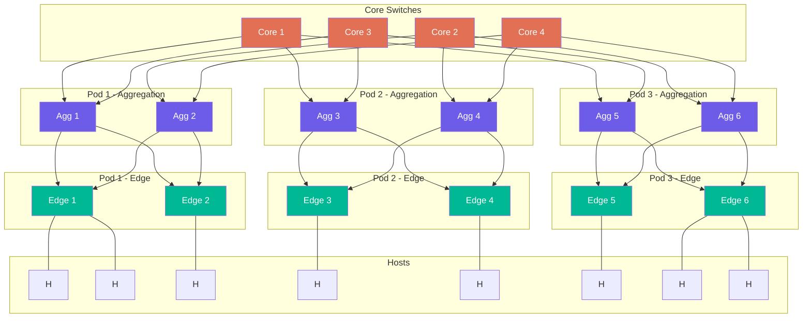
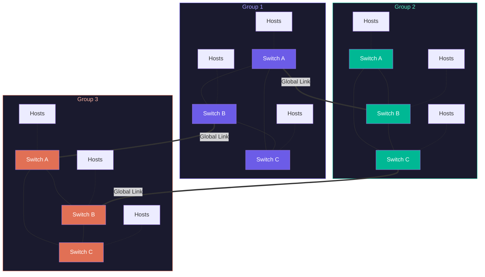
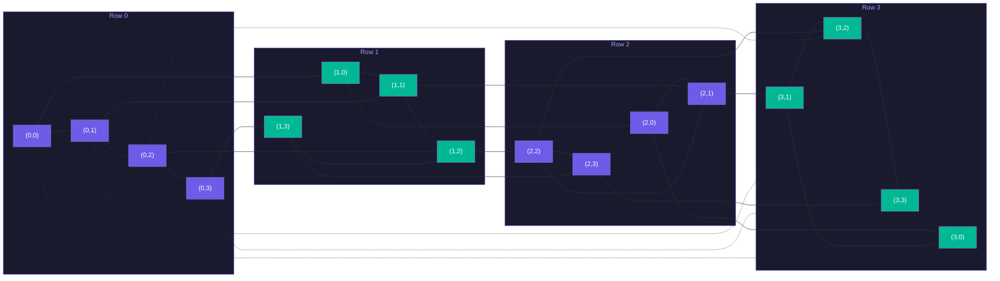
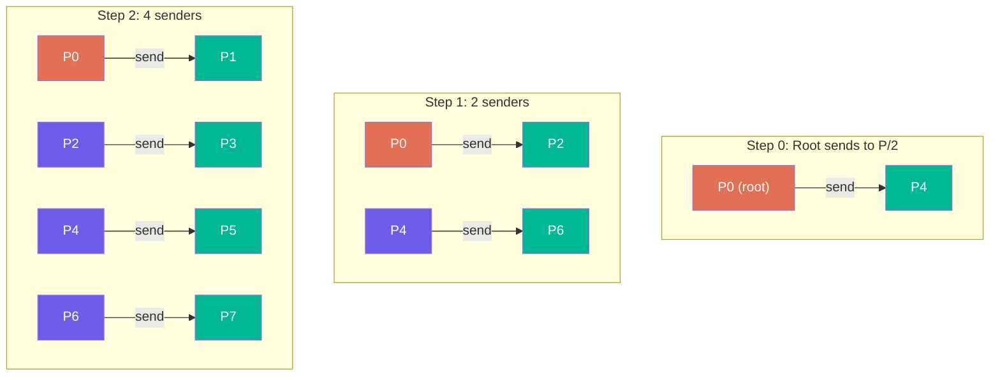
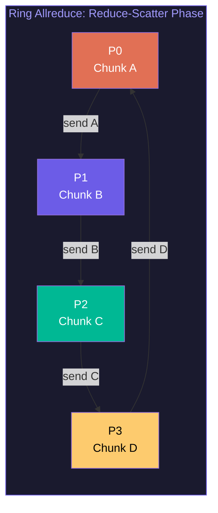

# Interconnects, MPI, and Distributed Computing

A supercomputer with 10,000 nodes but a slow network is just 10,000 separate computers. The interconnect is what transforms a cluster into a supercomputer. This lecture examines the topologies, technologies, and programming models that enable distributed computing at exascale.

## Why Interconnect Matters

Consider a simple parallel computation: matrix multiply $C = A \times B$ across $P$ nodes. Each node holds a $N/\sqrt{P} \times N/\sqrt{P}$ block of each matrix. To compute its block of $C$, each node needs blocks from other nodes. The total data communicated scales as $O(N^2/\sqrt{P})$.

For a 100,000 x 100,000 FP64 matrix on 1,024 nodes, each node communicates approximately $100{,}000^2 \times 8 / \sqrt{1024} \approx 2.5$ GB. If the interconnect delivers 25 GB/s per node, communication takes 100 ms. If the computation takes 50 ms, the machine spends 67% of its time waiting for data. At 250 GB/s, communication drops to 10 ms and compute dominates. This is why interconnect bandwidth determines real application performance.

The fundamental performance model for a message of $n$ bytes between two nodes is:

$$T = \alpha + \beta \cdot n$$

where $\alpha$ is the **latency** (startup cost, typically 1-10 $\mu$s) and $\beta$ is the **inverse bandwidth** (seconds per byte). For small messages, latency dominates. For large messages, bandwidth dominates. The crossover point $n^* = \alpha / \beta$ determines which regime you are in. For InfiniBand NDR ($\alpha \approx 1\;\mu\text{s}$, bandwidth $\approx 50$ GB/s, so $\beta \approx 2 \times 10^{-11}$ s/byte), $n^* \approx 50$ KB.

<ConceptCheck id="cc-1" />

## Interconnect Topologies

Three topologies dominate HPC networking. Each makes different trade-offs between bandwidth, latency, cost, and scalability.

### Fat Tree (Clos Network)

A **$k$-ary fat tree** built from $k$-port switches has the following structure:



- **$k$ pods**, each with 2 layers of $k/2$ switches
- $(k/2)^2$ core switches
- Supports $k^3/4$ hosts total

The critical property is **full bisection bandwidth**: any host can communicate with any other host at the full link rate, regardless of placement. If you cut the network in half, the bandwidth across the cut equals the total injection bandwidth of all hosts on one side.

For $N$ hosts with link bandwidth $b$:

$$B_{\text{bisection}} = N \times b$$

This is the theoretical maximum -- no other topology achieves this with the same number of ports.

The cost is substantial. For $N$ endpoints, a 3-stage fat tree requires $5N/4$ switches, giving $O(N^{5/3})$ cost scaling. The number of cables grows as $O(N^{3/2})$. For a 100,000-node cluster, this means hundreds of thousands of cables and tens of thousands of switches.

**Used in**: Most InfiniBand clusters, data center networks (Clos variants like Facebook's fabric).

**Pros**: Full bisection bandwidth, predictable performance regardless of traffic pattern, well-understood routing algorithms.

**Cons**: Expensive at scale (switch and cable cost), high cable count creates physical management challenges.

### Dragonfly Topology

Dragonfly is a hierarchical topology that reduces cost while maintaining near-uniform latency. It is defined by three parameters:
- $p$ = number of compute links per switch (to local hosts)
- $a$ = number of switches per group
- $h$ = number of global links per switch

In a **balanced configuration**: $a = 2p = 2h$.

The structure has two levels:
1. **Within a group**: All $a$ switches are connected all-to-all (full mesh). Each switch connects to $p$ local hosts.
2. **Between groups**: Each pair of groups has at least one global link. Total groups: $g = a \cdot h + 1$. Total endpoints: $N = p \cdot a \cdot g$.



**Routing** in dragonfly is critical because the global links can become bottlenecks:

**Minimal routing (MIN)**: Source switch $\to$ local link $\to$ source group border switch $\to$ global link $\to$ destination group switch $\to$ local link $\to$ destination switch. Maximum 3 hops (Local-Global-Local, or LGL). Latency-optimal but can create congestion on global links under adversarial traffic patterns.

**Non-minimal routing (Valiant/UGAL)**: Route to a random intermediate group first, then to the destination. Path: LGLLGL (5 hops). This doubles the path length but load-balances global links by randomizing traffic. The Valiant trick converts any worst-case traffic pattern into a random pattern with at most 2x the optimal bandwidth.

**Adaptive routing (UGAL)**: Dynamically choose minimal or non-minimal based on local queue depth. If the minimal path is congested, take a longer path through a less-loaded group. HPE Slingshot implements this in hardware with per-packet routing decisions.

$$\text{Dragonfly diameter} = 3 \text{ (minimal)}, \quad 5 \text{ (non-minimal)}$$

**Used in**: HPE Slingshot (Frontier, Aurora, LUMI), JUPITER (DragonFly+ variant).

### Torus (3D / 6D)

In a $k$-ary $n$-dimensional torus:



- Each node connects to $2n$ neighbors ($\pm 1$ in each of $n$ dimensions)
- Total nodes: $k^n$
- Network diameter: $n \cdot \lfloor k/2 \rfloor$

Bisection bandwidth for a $k$-ary $n$-cube torus:

$$B_{\text{bisection}} = 2 \cdot k^{n-1} \times b$$

where $b$ is the per-link bandwidth.

The torus requires **no switches** -- nodes connect directly to their neighbors. This minimizes cost but limits bisection bandwidth. A 3D torus with $k=32$ (32,768 nodes) has a diameter of 48 hops, and bisection bandwidth scales as $O(k^2)$ rather than $O(k^3)$ for a fat tree.

**Fugaku's 6D torus (Tofu Interconnect D)**: Fugaku uses a 24x23x24x2x3x2 mesh/torus with 6.8 GB/s per link. The 6D topology provides 12x higher scalability than a 3D torus while supporting 100,000+ nodes. Software abstracts the 6 physical dimensions into a 3D torus for programmer convenience.

**TPU v4's 3D torus**: Google TPU pods use 4x4x4 cubes (64 chips each) with optical circuit switching (OCS) to dynamically reconfigure inter-cube connectivity. The Palomar OCS switches (136x136, 128 usable ports) enable twisted torus configurations that increase bisection bandwidth by approximately 70%.

**Pros**: Lowest cost (no switches), excellent for nearest-neighbor communication patterns (stencil codes, lattice QCD, PDE solvers).

**Cons**: Low bisection bandwidth relative to fat tree, poor performance for all-to-all traffic, latency grows linearly with network diameter.

<ConceptCheck id="cc-2" />

### Topology Comparison

| Metric | Fat Tree | Dragonfly | Torus |
|--------|----------|-----------|-------|
| **Bisection BW** | Full (highest) | Medium | Low |
| **Hop count** | $O(\log N)$ | 3-5 | $O(n \cdot k)$ |
| **Cable cost** | Highest | Medium | Lowest |
| **Switch count** | Highest ($5N/4$) | Medium | Zero (direct) |
| **Best for** | All-to-all traffic | Mixed workloads | Nearest-neighbor |
| **Latency scaling** | Logarithmic | Near-constant | Linear with diameter |

## Interconnect Technologies

### InfiniBand NDR

InfiniBand is the dominant HPC interconnect technology. The NDR (Next Data Rate) generation achieves 400 Gbps per port using 4 lanes at 100 Gbps each with 64b/66b encoding:

| Generation | Per-Lane | Lanes | Port Speed | Switch BW |
|-----------|---------|-------|------------|-----------|
| HDR | 50 Gbps | 4x | 200 Gbps | 16 Tbps |
| NDR | 100 Gbps | 4x | 400 Gbps | 51.2 Tbps |

NVIDIA Quantum-2 NDR switches achieve approximately 0.5 $\mu$s port-to-port latency. InfiniBand uses native RDMA (IB Verbs) with kernel bypass for low-latency data transfer.

### HPE Slingshot-11

Slingshot is an HPC Ethernet derivative used in Frontier, Aurora, and LUMI:

| Attribute | Value |
|-----------|-------|
| **Port speed** | 200 Gbps |
| **Switch** | 64-port, 25.6 Tbps aggregate |
| **NIC** | Cassini NIC (200 Gbps) |
| **RDMA** | RoCEv2 (RDMA over Converged Ethernet v2) |
| **Routing** | Fine-grained adaptive routing with hardware congestion control |

Slingshot's key innovation is **adaptive routing in silicon**: the switch hardware makes per-packet routing decisions based on real-time congestion signals, without software involvement. This enables credit-based congestion control that prevents hot-spot formation without overprovisioning the network.

The next generation, Slingshot 400, will use a 51.2 Tbps switch ASIC with 400 Gbps per port and liquid-cooled switch design.

### RDMA: Remote Direct Memory Access

RDMA is the protocol that enables low-latency networking. The core idea: allow one machine to directly read or write the memory of another machine without involving the operating system on either side.

Key operations:
- **RDMA Read**: Initiator reads from remote memory
- **RDMA Write**: Initiator writes to remote memory
- **RDMA Send/Receive**: Message-based operations
- **Atomic operations**: Compare-and-swap, fetch-and-add across the network

Benefits:
- **Zero-copy**: Data moves directly between application buffers, no intermediate copies
- **Kernel bypass**: No OS involvement after initial connection setup
- **CPU offload**: NIC handles the data transfer independently
- Latency: **3-5 $\mu$s** (InfiniBand) versus 20-80 $\mu$s (standard Ethernet TCP/IP)

The latency reduction comes from eliminating four major sources of overhead: system call transitions, socket buffer copies, protocol processing in the kernel, and interrupt handling.

## MPI: The Message Passing Interface

MPI is the standard programming model for distributed-memory parallel computing. Every major supercomputer application uses MPI. Understanding MPI collective operations -- and the algorithms behind them -- is essential for performance analysis.

### Point-to-Point Communication

The simplest MPI operations are send and receive:

```python
# Pseudocode -- actual MPI uses C/Fortran bindings
MPI_Send(buffer, count, datatype, dest_rank, tag, comm)
MPI_Recv(buffer, count, datatype, source_rank, tag, comm, status)
```

**Blocking** variants (MPI_Send, MPI_Recv) wait until the operation completes. **Non-blocking** variants (MPI_Isend, MPI_Irecv) return immediately and provide a request handle for later completion checking. Non-blocking communication enables **overlap** of computation and communication -- the program can do useful work while data is in transit.

### Collective Operations and Their Algorithms

Collective operations involve all processes in a communicator. Their performance at scale depends critically on the underlying algorithm.

#### MPI_Bcast: Broadcast

Root process sends a message of $n$ bytes to all $P$ processes.

**Algorithm 1: Binomial Tree** (latency-optimal)



The root sends to one partner, then both send to new partners, doubling the number of informed processes each step:
- Step 0: Root sends to process $P/2$
- Step 1: Root and $P/2$ each send to $P/4$ and $3P/4$
- Step $k$: $2^k$ processes each send to a new partner

$$T_{\text{binom}} = \lceil \log_2 P \rceil \cdot (\alpha + n \cdot \beta)$$

This is latency-optimal ($\log_2 P$ messages) but bandwidth-suboptimal (the entire $n$-byte message is sent at each step, so the root's outbound link carries $n$ bytes $\log_2 P$ times).

**Algorithm 2: Scatter + Allgather** (bandwidth-optimal, for large messages)

Phase 1: Binomial tree scatter of $n/P$-sized chunks. Phase 2: Ring allgather to reconstruct the full message.

$$T_{\text{scatter+ag}} = \log_2 P \cdot \alpha + \frac{P-1}{P} \cdot n \cdot \beta + (P-1) \cdot \alpha$$

The bandwidth term $\frac{P-1}{P} \cdot n \cdot \beta \approx n\beta$ is optimal -- each link carries only $n/P$ data at a time.

#### MPI_Reduce: Reduction

All processes contribute a value; the result (element-wise reduction) is placed at the root.

**Tree Reduce**: Mirror of binomial tree broadcast, but in reverse. Leaves send to parents, parents reduce and forward upward. Cost: $T = \log_2 P \cdot (\alpha + n \cdot \beta + n \cdot \gamma)$ where $\gamma$ is compute time per element.

#### MPI_Allreduce: All-Reduce

All processes contribute a vector of length $n$; the result is distributed to all. This is the most performance-critical collective in deep learning (gradient synchronization) and many scientific applications.

**Algorithm 1: Recursive Doubling** (latency-optimal)

At step $k$, process $i$ exchanges its full vector with process $i \oplus 2^k$ (XOR partner at distance $2^k$) and reduces:

$$T_{\text{rec\_dbl}} = \log_2 P \cdot \alpha + \log_2 P \cdot n \cdot \beta$$

Optimal for short messages because only $\log_2 P$ messages are sent. The weakness is bandwidth: the $n \cdot \log_2 P$ bandwidth term is wasteful for large $n$.

**Algorithm 2: Ring Allreduce** (bandwidth-optimal)



Phase 1 (Reduce-Scatter): Divide the vector into $P$ chunks. In $P-1$ steps, each process sends one chunk around a logical ring, reducing as it goes.

Phase 2 (Allgather): In $P-1$ steps, each process sends its completed chunk around the ring.

$$T_{\text{ring}} = 2(P-1) \cdot \alpha + 2 \cdot \frac{P-1}{P} \cdot n \cdot \beta$$

The bandwidth term $\approx 2n\beta$ is **independent of $P$** -- this is bandwidth-optimal. The weakness is latency: $2(P-1) \cdot \alpha$ grows linearly with $P$.

**Algorithm 3: Rabenseifner (Recursive Halving-Doubling)** -- best of both

Phase 1 (Reduce-Scatter via Recursive Halving): $\log_2 P$ steps, each halving the active data and sending to a partner at exponentially increasing distance.

Phase 2 (Allgather via Recursive Doubling): $\log_2 P$ steps, doubling the active data and sending to a partner at exponentially decreasing distance.

$$T_{\text{Rabenseifner}} = 2 \log_2 P \cdot \alpha + 2 \cdot \frac{P-1}{P} \cdot n \cdot \beta$$

This achieves **both** logarithmic latency and near-optimal bandwidth. Used by MPICH for medium-to-large messages with power-of-two process counts.

<ConceptCheck id="cc-3" />

#### MPI_Alltoall: Complete Exchange

Every process sends distinct data to every other process. This is the most communication-intensive collective.

**Bruck's Algorithm** (latency-optimal): $\lceil \log_2 P \rceil$ steps. At step $k$, process $i$ sends to process $(i + 2^k) \bmod P$. Only $\log_2 P$ messages, optimal for small message sizes.

**Pairwise Exchange** (bandwidth-optimal): $P-1$ steps. At step $k$, process $i$ exchanges with process $i \oplus k$. Bandwidth-optimal because each process sends and receives exactly $(P-1) \cdot m$ bytes total.

### Algorithm Selection

The choice between algorithms depends on message size relative to the latency-bandwidth crossover:

| Message Size | Optimal Allreduce | Optimal Broadcast |
|-------------|-------------------|-------------------|
| Small ($n \ll P$) | Recursive Doubling | Binomial Tree |
| Medium | Rabenseifner | Scatter + Allgather |
| Large ($n \gg P$) | Ring | Scatter + Allgather |

OpenMPI's default: data size < 10 KB uses recursive doubling; data size >= 10 KB uses ring allreduce. MPICH uses Rabenseifner for medium-to-large messages when $P$ is a power of two.

## Parallel I/O

At exascale, I/O is often the bottleneck. Frontier's Orion file system delivers 10+ TB/s aggregate bandwidth using Lustre, a parallel file system that stripes files across hundreds of Object Storage Targets (OSTs).

**MPI-IO** provides a parallel I/O interface that coordinates access from thousands of processes to a shared file system. Key concepts:
- **File views**: Each process defines which portion of the file it accesses
- **Collective I/O**: Processes coordinate their I/O operations for efficiency
- **Two-phase I/O**: A subset of processes (aggregators) collect data from others and perform fewer, larger I/O operations

Without parallel I/O, checkpointing a 100 TB simulation state to disk could take hours. With Lustre and MPI-IO, it takes minutes.

## Putting It Together: A Complete Communication Example

```python
import math
from dataclasses import dataclass
from typing import List, Tuple

@dataclass
class NetworkParams:
    """Network performance parameters."""
    alpha: float    # Latency in seconds (per message)
    beta: float     # Inverse bandwidth in seconds/byte
    gamma: float    # Compute time per element in seconds

def allreduce_recursive_doubling(n_bytes: int, P: int, net: NetworkParams) -> dict:
    """Cost model for recursive doubling allreduce."""
    steps = math.ceil(math.log2(P))
    latency_cost = steps * net.alpha
    bandwidth_cost = steps * n_bytes * net.beta
    compute_cost = steps * n_bytes * net.gamma
    total = latency_cost + bandwidth_cost + compute_cost
    return {
        "algorithm": "Recursive Doubling",
        "steps": steps,
        "latency_cost_us": latency_cost * 1e6,
        "bandwidth_cost_us": bandwidth_cost * 1e6,
        "compute_cost_us": compute_cost * 1e6,
        "total_us": total * 1e6,
    }

def allreduce_ring(n_bytes: int, P: int, net: NetworkParams) -> dict:
    """Cost model for ring allreduce."""
    steps = 2 * (P - 1)
    latency_cost = steps * net.alpha
    bandwidth_cost = 2 * ((P - 1) / P) * n_bytes * net.beta
    compute_cost = ((P - 1) / P) * n_bytes * net.gamma
    total = latency_cost + bandwidth_cost + compute_cost
    return {
        "algorithm": "Ring",
        "steps": steps,
        "latency_cost_us": latency_cost * 1e6,
        "bandwidth_cost_us": bandwidth_cost * 1e6,
        "compute_cost_us": compute_cost * 1e6,
        "total_us": total * 1e6,
    }

def allreduce_rabenseifner(n_bytes: int, P: int, net: NetworkParams) -> dict:
    """Cost model for Rabenseifner allreduce."""
    steps = 2 * math.ceil(math.log2(P))
    latency_cost = steps * net.alpha
    bandwidth_cost = 2 * ((P - 1) / P) * n_bytes * net.beta
    compute_cost = ((P - 1) / P) * n_bytes * net.gamma
    total = latency_cost + bandwidth_cost + compute_cost
    return {
        "algorithm": "Rabenseifner",
        "steps": steps,
        "latency_cost_us": latency_cost * 1e6,
        "bandwidth_cost_us": bandwidth_cost * 1e6,
        "compute_cost_us": compute_cost * 1e6,
        "total_us": total * 1e6,
    }

# InfiniBand NDR parameters
ib_ndr = NetworkParams(
    alpha=1e-6,        # 1 microsecond latency
    beta=1.0 / 50e9,   # 50 GB/s bandwidth -> 2e-11 s/byte
    gamma=1e-10,        # 0.1 ns compute per byte
)

print("=== Allreduce Algorithm Comparison (InfiniBand NDR) ===\n")

for P in [64, 1024, 16384]:
    print(f"--- P = {P} processes ---")
    for n_bytes in [1024, 1_000_000, 100_000_000]:
        n_label = f"{n_bytes:>12,} bytes"
        results = [
            allreduce_recursive_doubling(n_bytes, P, ib_ndr),
            allreduce_ring(n_bytes, P, ib_ndr),
            allreduce_rabenseifner(n_bytes, P, ib_ndr),
        ]
        best = min(results, key=lambda r: r["total_us"])
        print(f"  n={n_label}:")
        for r in results:
            marker = " <-- BEST" if r["algorithm"] == best["algorithm"] else ""
            print(f"    {r['algorithm']:22s}: {r['total_us']:12.1f} us "
                  f"(lat={r['latency_cost_us']:.1f}, bw={r['bandwidth_cost_us']:.1f}){marker}")
    print()

# Demonstrate crossover point
print("=== Crossover Analysis ===")
print(f"Latency-bandwidth crossover: n* = alpha/beta = "
      f"{ib_ndr.alpha / ib_ndr.beta:,.0f} bytes = "
      f"{ib_ndr.alpha / ib_ndr.beta / 1024:.1f} KB")
```

<ConceptCheck id="cc-4" />

## Summary

The interconnect is the central nervous system of a supercomputer. Fat trees provide full bisection bandwidth at high cost. Dragonfly topologies reduce cost with near-constant hop count and adaptive routing. Torus networks minimize cost for nearest-neighbor workloads. RDMA enables microsecond-latency data transfer by bypassing the operating system.

MPI collective algorithms embody a fundamental trade-off: latency-optimal algorithms (recursive doubling, binomial tree) minimize the number of communication steps, while bandwidth-optimal algorithms (ring, scatter+allgather) minimize total data movement. Rabenseifner's algorithm achieves both logarithmic latency and optimal bandwidth, making it the preferred choice for medium-to-large messages.

The choice of topology, interconnect technology, and collective algorithm together determine whether a supercomputer achieves 80% of its theoretical peak or 30%. These are not academic distinctions -- they are the difference between a machine that advances science and one that wastes electricity.
