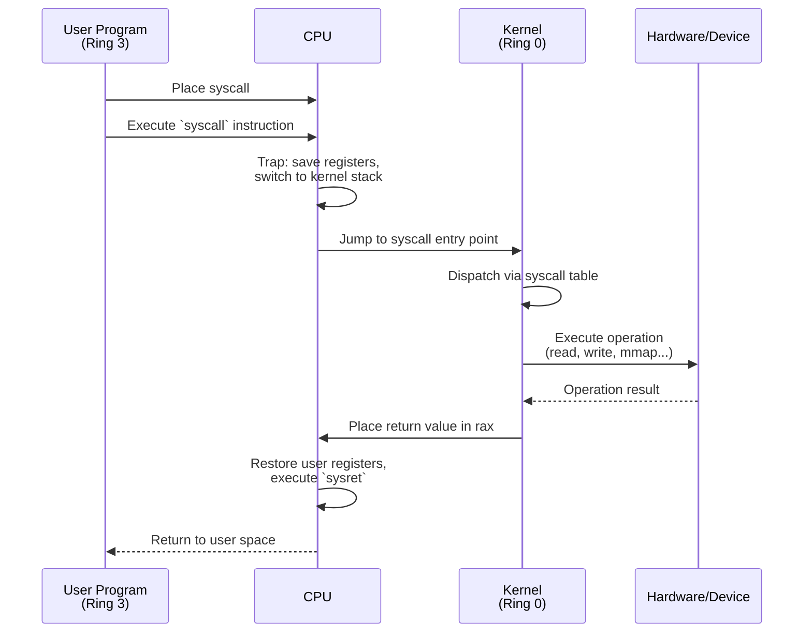
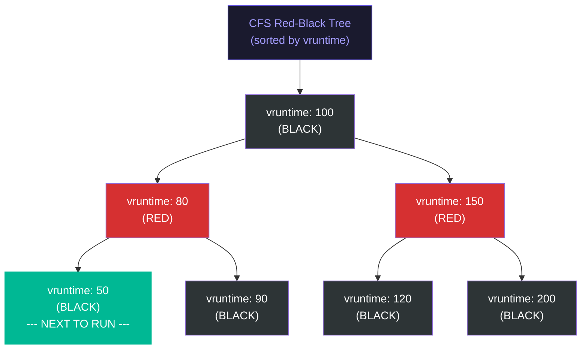
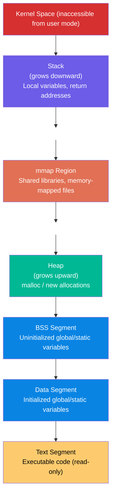
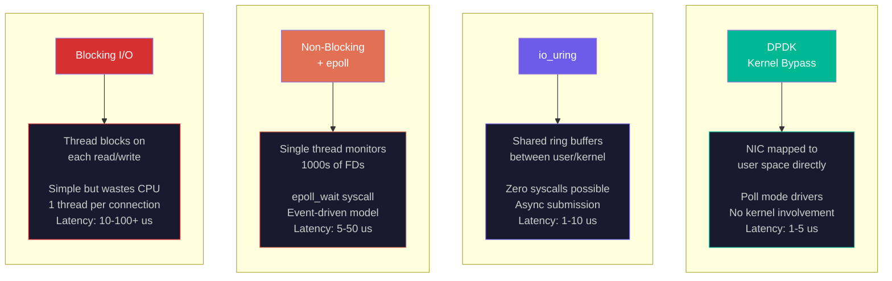

# Systems Programming: Kernel Interfaces and Memory Management

Every program you write runs on top of an operating system kernel. The kernel manages hardware, schedules processes, allocates memory, and handles I/O. Understanding the boundary between user space and kernel space -- and the cost of crossing it -- is essential for writing high-performance systems. This lecture examines system calls, process scheduling, memory management, and the I/O models that determine whether your program achieves microsecond latency or millisecond latency.

## System Calls: The User-Kernel Boundary

A system call (syscall) is the mechanism by which a user-space program requests services from the operating system kernel. The CPU enforces a hardware privilege boundary: user code runs in "ring 3" (unprivileged) and kernel code runs in "ring 0" (privileged) on x86, or EL0/EL1 on ARM.

### How a Syscall Works

The sequence for a system call on x86-64 Linux:



1. User program places the syscall number in register `rax` and arguments in `rdi`, `rsi`, `rdx`, `r10`, `r8`, `r9`.
2. User program executes the `syscall` instruction (on ARM: `svc #0`).
3. CPU traps to kernel mode: saves user-space registers, switches to the kernel stack, jumps to the syscall entry point.
4. Kernel dispatches to the appropriate handler based on the syscall number.
5. Handler executes the requested operation (read from disk, allocate memory, etc.).
6. Kernel places the return value in `rax`, restores user registers, executes `sysret` (or `eret` on ARM) to return to user space.

### Syscall Cost

Each system call costs approximately **100-500 nanoseconds** in overhead, even before the actual work is performed. This overhead comes from:

- **Register save/restore**: CPU must save all user registers and load kernel state.
- **TLB and cache impact**: Switching to kernel code pollutes the instruction cache and may flush TLB entries (mitigated by KPTI/PCID on modern kernels).
- **Spectre mitigations**: Post-Spectre kernels execute additional barrier instructions on each syscall boundary, adding 50-200 ns.
- **Stack switching**: User and kernel use separate stacks.

For a program making 1 million syscalls per second (not unusual for a network server), the overhead alone consumes 100-500 milliseconds of CPU time per second -- 10-50% of a core.

### Key System Calls

| Syscall | Purpose | Typical Latency |
|---------|---------|-----------------|
| `read`/`write` | File and socket I/O | 200 ns - 10+ ms (depends on backing store) |
| `open`/`close` | File descriptor management | 1-10 $\mu$s |
| `mmap` | Memory-mapped files and anonymous mappings | 1-50 $\mu$s |
| `ioctl` | Device-specific control | varies |
| `fork` | Create child process (copy-on-write) | 50-200 $\mu$s |
| `exec` | Replace process image | 1-10 ms |
| `clock_gettime` | Read high-resolution clock | 20-50 ns (vDSO) |

Note that `clock_gettime` is special: Linux implements it via the **vDSO** (virtual Dynamic Shared Object), a kernel-mapped page in user space. The time is read without a true syscall, reducing overhead from ~200 ns to ~20 ns. This matters enormously for timing-sensitive applications.

<ConceptCheck id="cc-1" />

## Process Scheduling

The kernel scheduler decides which process runs on which CPU core and for how long. Scheduling policy directly impacts latency, throughput, and fairness.

### Linux CFS (Completely Fair Scheduler)

The default Linux scheduler since kernel 2.6.23 is CFS. Its design is elegant:



1. Each runnable task has a **virtual runtime** (`vruntime`) that tracks how much CPU time it has consumed, weighted by its priority (nice value).
2. Tasks are stored in a **red-black tree** sorted by `vruntime`.
3. The scheduler always picks the task with the **smallest `vruntime`** -- the task that has received the least CPU time relative to its fair share.
4. When a task runs, its `vruntime` increases. When it has accumulated enough time (the scheduler's "timeslice"), it is preempted and the next task with the smallest `vruntime` runs.

The key property: over time, all tasks converge to the same `vruntime`, meaning each gets its fair share of CPU time. Higher-priority tasks (lower nice value) accumulate `vruntime` more slowly, so they get more actual CPU time.

CFS provides excellent **throughput fairness** but introduces **latency jitter** of 1-10 milliseconds due to timeslice preemption. For a web server handling 1,000 requests per second, this is fine. For a trading system processing market data with sub-microsecond requirements, it is catastrophic.

### Real-Time Scheduling

Linux supports two real-time scheduling policies:

- **SCHED_FIFO**: First-in, first-out. A SCHED_FIFO task runs until it voluntarily yields, blocks, or is preempted by a higher-priority SCHED_FIFO task. No timeslicing.
- **SCHED_RR**: Round-robin among tasks of the same priority. Like SCHED_FIFO but with timeslicing within a priority level.

Real-time tasks have static priorities (1-99) that always preempt CFS tasks (priority 0). A SCHED_FIFO task at priority 99 will run uninterrupted as long as it is runnable, preempting all other tasks on that core.

### CPU Isolation for Low-Latency Systems

For trading systems and other latency-critical applications, even SCHED_FIFO is insufficient because the kernel itself generates interruptions: timer ticks, RCU callbacks, interrupt handlers, and other kernel threads. The solution is **CPU isolation** -- dedicating cores exclusively to the application.

**isolcpus**: Removes specified CPUs from the general scheduler's load balancing. No kernel threads or user processes will be scheduled on isolated cores unless explicitly pinned.

```
# Kernel boot parameter
isolcpus=4-15
```

**nohz_full (Tickless Kernel)**: Disables the periodic timer tick on specified cores. The default kernel timer fires at 250 Hz or 1000 Hz (every 1-4 ms), causing a 4 $\mu$s interruption each time. For low-latency applications, this periodic interruption is unacceptable.

```
nohz_full=4-15
```

**rcu_nocbs (RCU Callback Offloading)**: RCU (Read-Copy-Update) is a kernel synchronization mechanism that defers memory reclamation. RCU callbacks can introduce unpredictable latency spikes of 10-100 $\mu$s. `rcu_nocbs` offloads these callbacks to housekeeping CPUs, keeping isolated cores clean.

```
rcu_nocbs=4-15
```

**irqaffinity**: Directs all hardware interrupts to specific cores, preventing interrupt handlers from running on isolated cores and causing cache pollution.

```
irqaffinity=0-3
```

The complete isolation recipe includes additional parameters:

```
isolcpus=4-15 nohz_full=4-15 rcu_nocbs=4-15 irqaffinity=0-3 \
  processor.max_cstate=0 intel_idle.max_cstate=0 idle=poll \
  tsc=reliable clocksource=tsc transparent_hugepage=never
```

- `processor.max_cstate=0`: Disable CPU sleep states. Waking from C1 takes approximately 1 $\mu$s; from C6, approximately 100 $\mu$s. For low-latency systems, cores must never sleep.
- `idle=poll`: Instead of entering idle state when no work is available, busy-wait. Wastes power but eliminates wake-up latency.
- `transparent_hugepage=never`: Disable Transparent Huge Pages to prevent compaction-induced latency spikes.

### Measured Latency Impact

The following numbers are from real-world low-latency tuning benchmarks:

| Configuration | Typical Jitter | Worst-case Latency |
|---------------|---------------|-------------------|
| Default kernel | 10-100 $\mu$s | >1 ms |
| isolcpus only | 5-20 $\mu$s | 100 $\mu$s |
| isolcpus + nohz_full + rcu_nocbs | 1-5 $\mu$s | 10 $\mu$s |
| Full isolation + NUMA + core pinning | 100-500 ns | 1-5 $\mu$s |
| With PREEMPT_RT kernel | 50-200 ns | 1 $\mu$s |

The progression from default to fully isolated is a 1000x improvement in worst-case latency, from milliseconds to microseconds.

<ConceptCheck id="cc-2" />

## Memory Management

### Virtual Memory: The Page Table Walk

The process address space is divided into distinct regions, each serving a different purpose:



Every user-space memory access goes through the CPU's memory management unit (MMU), which translates virtual addresses to physical addresses using page tables. On x86-64, the page table is a 4-level radix tree (5-level with LA57):

```
Virtual Address (48 bits used):
[PML4 index (9b)][PDPT index (9b)][PD index (9b)][PT index (9b)][Offset (12b)]

PML4 → PDPT → PD → PT → Physical Page (4 KB)
```

Each level requires a memory access to read the page table entry. A full 4-level walk costs **4 memory accesses x 80-100 ns each = 320-400 ns** if all page table entries are in DRAM. The TLB (Translation Lookaside Buffer) caches recent translations to avoid this cost:

- **L1 dTLB**: 64-128 entries, ~1 cycle access
- **L2 TLB (STLB)**: 1,536-2,048 entries, ~7-10 cycles
- **TLB miss → page table walk**: 320-400 ns (DRAM) or 20-50 ns (if page table entries are cached in L2/L3)

For programs with large working sets (databases, scientific simulations), TLB misses can consume 10-30% of total execution time.

### mmap: Memory-Mapped Files

`mmap` maps a file (or anonymous memory) into the process's virtual address space:

```python
# Conceptual (actual API is C):
# ptr = mmap(addr=NULL, length=size, prot=PROT_READ|PROT_WRITE,
#            flags=MAP_PRIVATE, fd=file_descriptor, offset=0)
```

Three types of mappings:
- **File-backed private** (`MAP_PRIVATE`): Copy-on-write mapping of a file. Reads come from the page cache; writes create private copies.
- **File-backed shared** (`MAP_SHARED`): Changes are written back to the file and visible to other processes.
- **Anonymous** (`MAP_ANONYMOUS`): Not backed by a file. Used for heap allocation (what `malloc` uses for large allocations).

mmap eliminates the `read`/`write` syscall overhead for file access -- once mapped, file data is accessed via regular memory loads/stores, with the kernel handling page faults transparently.

### Huge Pages

Standard x86-64 pages are 4 KB. Each TLB entry covers one page. With 2,048 STLB entries, the TLB can cover $2048 \times 4\text{ KB} = 8\text{ MB}$ of memory. A program with a 1 GB working set will suffer chronic TLB misses.

**Huge pages** solve this by using larger page sizes:

- **2 MB pages**: Each TLB entry covers 2 MB instead of 4 KB. With 2,048 entries, TLB coverage jumps to 4 GB. TLB misses reduced by 512x.
- **1 GB pages**: Covers the entire working set in a single TLB entry. Best for very large datasets.

Two mechanisms for huge pages:

**Transparent Huge Pages (THP)**: The kernel automatically promotes 4 KB pages to 2 MB pages when contiguous physical memory is available. Convenient but introduces latency spikes during compaction (the kernel defragments physical memory to create contiguous 2 MB regions). For latency-sensitive applications, THP is typically **disabled**.

**Explicit hugetlbfs**: Pre-allocate huge pages at boot time. Pages are pinned in physical memory and never compacted. Deterministic but requires configuration:

```
# Reserve 1024 huge pages (2 MB each = 2 GB total)
echo 1024 > /proc/sys/vm/nr_hugepages
```

### NUMA-Aware Memory Allocation

On multi-socket servers (or even single-socket chiplet designs like EPYC), memory access latency depends on which NUMA node the physical memory resides on:

- **Local NUMA access**: approximately 80 ns
- **Remote NUMA access** (cross-socket or cross-chiplet): approximately 140 ns (75% slower)

The **first-touch policy** (Linux default) allocates the physical page on the NUMA node of the CPU that first accesses it. This means initialization patterns matter:

```python
# BAD: Main thread initializes all data on NUMA node 0
# Worker threads on node 1 suffer remote access latency
data = allocate_large_array()
for i in range(len(data)):
    data[i] = 0  # All pages allocated on node 0

# GOOD: Each thread initializes its own portion
# Pages allocated on the local node of each thread
for thread_id in range(num_threads):
    start = thread_id * chunk_size
    end = start + chunk_size
    for i in range(start, end):  # runs on thread's local node
        data[i] = 0
```

Tools for NUMA control:
- `numactl --membind=N command`: Bind all memory allocations to NUMA node N.
- `numactl --cpunodebind=N command`: Run on CPUs belonging to NUMA node N.
- `mbind()` syscall: Fine-grained per-region NUMA policy.

<ConceptCheck id="cc-3" />

## I/O Models

How a program interacts with the outside world -- network, disk, devices -- is determined by the I/O model. Four models span the spectrum from simplest to fastest.



### Blocking I/O

The simplest model: the thread calls `read()` or `write()` and blocks until the operation completes.

```python
# Thread is suspended until data arrives
data = socket.recv(4096)  # blocks for 0.1-100+ ms
```

Simple to program but wastes CPU time. A server handling 10,000 concurrent connections would need 10,000 threads, each consuming kernel stack space (~8 KB) and scheduler overhead.

### Non-Blocking I/O with epoll

Set the file descriptor to non-blocking mode. `read()` returns immediately with whatever data is available (or `EAGAIN` if none). Use `epoll` to efficiently monitor thousands of file descriptors:

```python
# Pseudocode
epoll.register(socket_fd, EPOLLIN)
events = epoll.wait(timeout=100)  # blocks until at least one event
for fd, event in events:
    data = fd.read()  # guaranteed to not block (data is ready)
```

A single thread can handle thousands of connections. This is how Nginx, Redis, and most high-performance servers work. But each `epoll_wait` is still a syscall with 100-500 ns overhead.

### io_uring: Async I/O for Linux

io_uring (since Linux 5.1) eliminates the syscall-per-I/O-operation overhead using **shared ring buffers** between user space and kernel:

```
User Space                    Kernel Space
┌─────────────┐              ┌─────────────┐
│ Submission  │─────────────→│  Completion  │
│ Queue (SQ)  │              │  Queue (CQ)  │
│             │←─────────────│              │
└─────────────┘              └─────────────┘
```

The user submits I/O requests to the Submission Queue (SQ) by writing to shared memory -- **no syscall needed**. The kernel processes submissions and posts completions to the Completion Queue (CQ), which the user reads from shared memory -- again, **no syscall**. In the best case, an I/O operation completes with zero system calls.

io_uring also supports **registered buffers** (pre-pinned memory for DMA) and **fixed files** (pre-resolved file descriptors), further reducing per-operation overhead.

### Zero-Copy I/O

Traditional I/O copies data multiple times:

```
Disk → Kernel Page Cache → User Buffer → Kernel Socket Buffer → NIC
         (read syscall)                     (write syscall)
```

Four copies, two syscalls. **Zero-copy** techniques eliminate intermediate copies:

- **sendfile()**: Transfers data directly from the page cache to the socket buffer, bypassing user space entirely. One syscall, zero user-space copies.
- **splice()**: Moves data between file descriptors through a kernel pipe buffer without copying.

### Kernel Bypass: DPDK

For the ultimate in I/O performance, bypass the kernel entirely. **DPDK (Data Plane Development Kit)** maps NIC hardware directly into user space:

```
Standard Path (~10-50 us):        DPDK Path (~1-5 us):
Application                       Application
    │                                  │
    ▼                                  ▼
Socket API                        DPDK / User-space NIC driver
    │                                  │
    ▼                                  ▼
TCP/IP Stack                      (nothing)
    │                                  │
    ▼                                  ▼
Device Driver                     NIC Hardware
    │                                  │
    ▼                                  ▼
NIC Hardware                      Wire
    │
    ▼
Wire
```

DPDK's core components:

1. **Poll Mode Drivers (PMDs)**: Continuously poll NIC receive queues in a busy loop. No interrupts. No context switches. No sleeping. The CPU core running the PMD is dedicated 100% to packet processing.

2. **Huge Pages**: NIC DMA buffers are allocated using 2 MB or 1 GB huge pages, reducing TLB misses by 99%.

3. **Core Pinning**: DPDK threads are pinned to specific CPU cores that do nothing but poll and process packets.

4. **Memory Pools (mempools)**: Pre-allocated, lock-free buffer pools for zero-allocation packet processing.

| Metric | Kernel Stack | DPDK |
|--------|-------------|------|
| **Latency** | 10-50 $\mu$s | 1-5 $\mu$s |
| **Throughput** | ~1 Mpps | 10-100+ Mpps |
| **Jitter** | 10-100 $\mu$s | < 1 $\mu$s |
| **CPU usage** | Low (interrupt-driven) | 100% on dedicated cores |

### Solarflare/Xilinx OpenOnload

**OpenOnload** provides kernel bypass with application transparency. It intercepts socket API calls via `LD_PRELOAD` library injection, implementing the TCP/IP stack in user space using the Solarflare NIC's `ef_vi` low-level API. Applications require **no code changes** -- just set `LD_PRELOAD=libonload.so` and the standard socket API transparently uses kernel bypass.

This is the approach used by most trading firms: the application code uses standard sockets, but OpenOnload routes the traffic through user-space networking for 5-10x lower latency.

<ConceptCheck id="cc-4" />

## Putting It Together

```python
import time
import math
from dataclasses import dataclass
from typing import List

@dataclass
class MemoryAccessSimulator:
    """Simulate memory access latencies at different levels."""
    l1_latency_ns: float = 1.0
    l2_latency_ns: float = 4.0
    l3_latency_ns: float = 12.0
    dram_latency_ns: float = 80.0
    remote_numa_latency_ns: float = 140.0
    page_walk_latency_ns: float = 50.0  # cached page table entry
    page_walk_dram_ns: float = 400.0    # full 4-level walk in DRAM

    def tlb_coverage(self, page_size_kb: int, tlb_entries: int) -> float:
        """Total memory covered by TLB in MB."""
        return (page_size_kb * tlb_entries) / 1024

    def tlb_miss_rate(self, working_set_mb: float,
                      page_size_kb: int, tlb_entries: int) -> float:
        """Approximate TLB miss rate (fraction of accesses that miss)."""
        coverage_mb = self.tlb_coverage(page_size_kb, tlb_entries)
        if working_set_mb <= coverage_mb:
            return 0.0
        # Simple model: miss rate proportional to fraction not covered
        return 1.0 - (coverage_mb / working_set_mb)

    def effective_latency(self, working_set_mb: float,
                          page_size_kb: int, tlb_entries: int,
                          is_numa_remote: bool = False) -> float:
        """Effective average memory access latency in ns."""
        base_latency = self.remote_numa_latency_ns if is_numa_remote else self.dram_latency_ns
        miss_rate = self.tlb_miss_rate(working_set_mb, page_size_kb, tlb_entries)
        # On TLB hit: base_latency; on TLB miss: base + page walk
        return base_latency + miss_rate * self.page_walk_latency_ns


# Demonstrate TLB coverage with different page sizes
sim = MemoryAccessSimulator()
tlb_entries = 2048  # typical STLB

print("=== TLB Coverage with Different Page Sizes ===")
for page_size_kb in [4, 2048, 1048576]:  # 4 KB, 2 MB, 1 GB
    coverage = sim.tlb_coverage(page_size_kb, tlb_entries)
    print(f"  {page_size_kb:>10,} KB pages: {coverage:>10,.0f} MB TLB coverage "
          f"({coverage/1024:.1f} GB)")

print("\n=== Effective Latency vs Working Set Size ===")
working_sets = [1, 8, 64, 512, 4096, 32768]  # MB
print(f"{'Working Set':>12s}", end="")
for ps_name, ps_kb in [("4KB pages", 4), ("2MB pages", 2048)]:
    print(f"  {ps_name:>14s}", end="")
print()

for ws in working_sets:
    print(f"{ws:>10} MB", end="")
    for ps_name, ps_kb in [("4KB pages", 4), ("2MB pages", 2048)]:
        lat = sim.effective_latency(ws, ps_kb, tlb_entries)
        print(f"  {lat:>12.1f} ns", end="")
    print()

# NUMA impact
print("\n=== NUMA Latency Impact ===")
print(f"  Local DRAM:       {sim.dram_latency_ns:.0f} ns")
print(f"  Remote NUMA:      {sim.remote_numa_latency_ns:.0f} ns")
print(f"  Penalty:          {(sim.remote_numa_latency_ns/sim.dram_latency_ns - 1)*100:.0f}%")

# Syscall overhead analysis
print("\n=== Syscall Overhead Analysis ===")
syscall_ns = 300  # typical syscall overhead with mitigations
for rate_name, rate in [("1K/s", 1000), ("10K/s", 10000),
                         ("100K/s", 100000), ("1M/s", 1000000)]:
    overhead_pct = (syscall_ns * rate) / 1e9 * 100
    print(f"  {rate_name:>8s} syscalls: {overhead_pct:.2f}% of one core")

# CPU isolation improvement
print("\n=== CPU Isolation Latency Improvement ===")
configs = [
    ("Default kernel",                  50000, 1000000),
    ("isolcpus",                        10000,  100000),
    ("isolcpus+nohz+rcu",               3000,   10000),
    ("Full isolation+NUMA",               300,    3000),
    ("Full isolation+PREEMPT_RT",         100,    1000),
]
for name, typical_ns, worst_ns in configs:
    print(f"  {name:<30s}: typical={typical_ns/1000:>6.1f} us, "
          f"worst={worst_ns/1000:>7.1f} us")
```

The systems programming abstractions covered in this lecture -- syscalls, scheduling, virtual memory, I/O models -- form the foundation on which all application performance rests. In the next lecture, we examine how to measure and optimize performance at the microarchitectural level: cache lines, branch prediction, SIMD, and the art of benchmarking.
