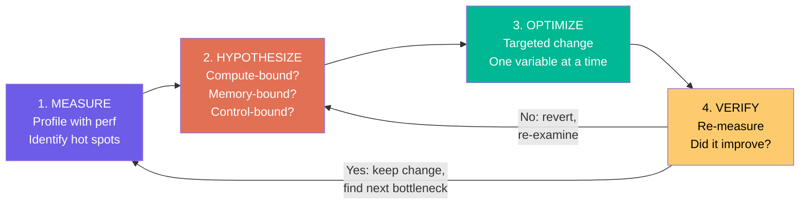
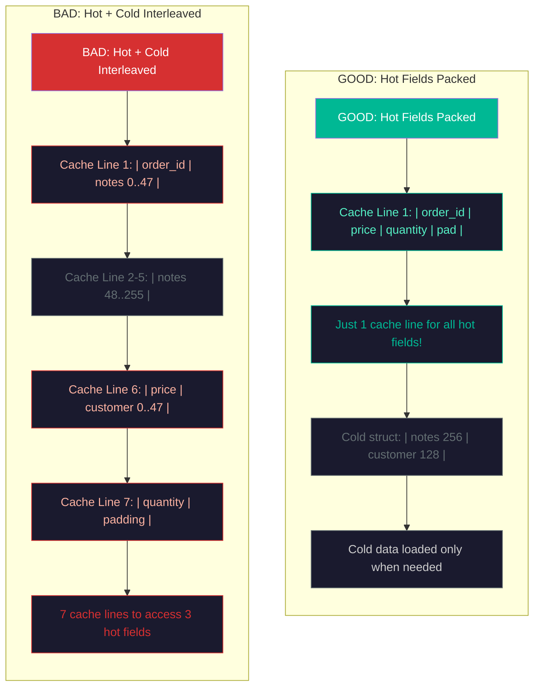
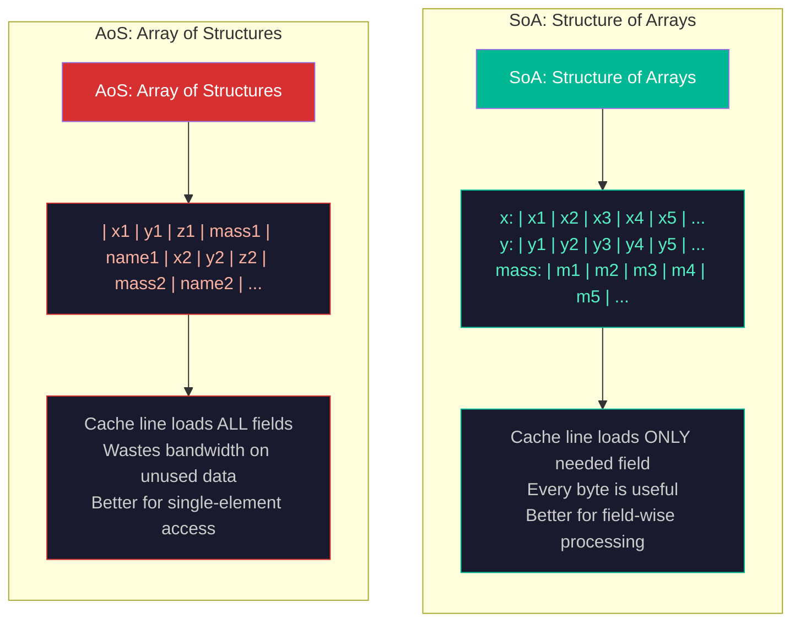
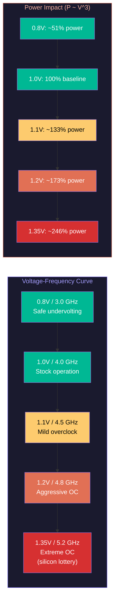

# Performance Engineering: Profiling, Optimization, and Benchmarking

Performance engineering follows a disciplined cycle: **measure, hypothesize, optimize, verify**. You do not guess where the bottleneck is -- you measure. You do not optimize based on intuition -- you form a hypothesis about what limits performance, change one thing, and measure whether it helped. This lecture covers the tools, techniques, and microarchitectural knowledge needed to write fast code.

## The Performance Engineering Mindset

The first rule of optimization is: **do not optimize what you have not measured**. The second rule: **the bottleneck is almost never where you think it is**.

Modern CPUs are so complex -- with out-of-order execution, branch prediction, prefetching, speculative execution, and multi-level caches -- that human intuition about performance is unreliable. A "clever" optimization that reduces instruction count by 20% might actually slow the program down by creating a cache conflict or branch misprediction pattern. The only way to know is to measure.

The performance engineering cycle:



1. **Measure**: Run the program under a profiler. Identify where time is spent (hot functions, hot loops).
2. **Hypothesize**: Examine the hot code. Is it compute-bound (limited by ALU throughput), memory-bound (limited by cache misses), or control-bound (limited by branch mispredictions)? Check hardware performance counters.
3. **Optimize**: Make a targeted change to address the identified bottleneck.
4. **Verify**: Re-measure. Did performance improve? If not, revert and re-examine the hypothesis.

## Profiling Tools

### perf: Hardware Performance Counters

`perf` is the standard Linux profiling tool. It reads **hardware performance counters** -- dedicated registers in the CPU that count microarchitectural events:

**perf stat** provides summary statistics:

```bash
perf stat ./my_program

# Output:
#  2,847,291,503  cycles                    # 3.2 GHz
#  4,102,847,291  instructions              # 1.44 IPC
#     23,847,102  cache-misses              # 3.2% of cache refs
#      8,291,503  branch-misses             # 0.8% of branches
#          1.034  seconds time elapsed
```

Key metrics:
- **IPC (Instructions Per Cycle)**: Theoretical max is 4-6 on modern x86. IPC below 1.0 strongly suggests memory stalls. IPC of 2-3 indicates good compute utilization.
- **Cache miss rate**: L1 miss rate above 5% or LLC miss rate above 1% suggests poor spatial or temporal locality.
- **Branch miss rate**: Above 2-3% indicates unpredictable branches that could benefit from branch-free code.

**perf record + perf report** provides sample-based profiling:

```bash
perf record -g ./my_program
perf report
```

This records stack traces at regular intervals (typically every 100 $\mu$s) and reports which functions consumed the most cycles. The output identifies **hot functions** -- the 20% of code that consumes 80% of execution time.

### Flamegraphs

A flamegraph visualizes profiling data as a stack chart: the x-axis is the proportion of time, and each row is a stack frame. Wide bars indicate functions that consume a lot of time. Flamegraphs are generated from `perf` data using Brendan Gregg's tools:

```bash
perf record -g ./my_program
perf script | stackcollapse-perf.pl | flamegraph.pl > flame.svg
```

Flamegraphs make it immediately obvious where time is spent. A function that is wide at the bottom of the chart (called frequently from many callers) may be an optimization target even if each individual call is fast.

<ConceptCheck id="cc-1" />

## Cache-Line Optimization

The CPU cache operates in **cache lines** of 64 bytes on virtually all modern processors (x86, ARM, RISC-V). When the CPU reads a single byte from DRAM, it fetches the entire 64-byte cache line containing that byte. This has profound implications for data structure design.

### Struct Packing: Hot and Cold Fields

Consider a data structure used in a tight loop:

```python
# Conceptual C struct (Python doesn't have cache-line-level control,
# but the principles apply to any language's memory layout)

# BAD: Hot and cold fields interleaved
# struct Order {
#     uint64_t order_id;       # Hot: accessed every iteration
#     char notes[256];         # Cold: rarely accessed
#     double price;            # Hot: accessed every iteration
#     char customer_name[128]; # Cold: rarely accessed
#     int32_t quantity;        # Hot: accessed every iteration
# };
# sizeof = 400+ bytes = 7 cache lines. Hot fields scattered.

# GOOD: Hot fields packed together
# struct OrderHot {
#     uint64_t order_id;   # 8 bytes
#     double price;        # 8 bytes
#     int32_t quantity;    # 4 bytes
#     // padding: 4 bytes
# };  // 24 bytes = fits in 1 cache line
#
# struct OrderCold {
#     char notes[256];
#     char customer_name[128];
# };
```

By separating hot (frequently accessed) and cold (rarely accessed) fields, the hot data fits in fewer cache lines, improving cache utilization.



### Array of Structures (AoS) vs Structure of Arrays (SoA)

This is one of the most impactful optimizations in high-performance computing.



**AoS (Array of Structures)**: Each element is a complete struct.

```python
# AoS: each particle is stored contiguously
# particles = [
#   {x: 1.0, y: 2.0, z: 3.0, mass: 1.0, charge: -1.0, name: "electron"},
#   {x: 4.0, y: 5.0, z: 6.0, mass: 938.0, charge: 1.0, name: "proton"},
#   ...
# ]
```

**SoA (Structure of Arrays)**: Each field is stored as a separate array.

```python
# SoA: each field is a separate array
# x     = [1.0, 4.0, ...]
# y     = [2.0, 5.0, ...]
# z     = [3.0, 6.0, ...]
# mass  = [1.0, 938.0, ...]
# charge = [-1.0, 1.0, ...]
# name  = ["electron", "proton", ...]
```

When processing only the `x` coordinates (e.g., computing forces in the x-direction), SoA loads only `x` values into cache -- every byte of every cache line is useful. AoS loads entire structs, wasting cache capacity on unused fields like `name` and `charge`.

**SoA is better when**: You access a subset of fields across many elements (SIMD-friendly, cache-efficient). This is the default in scientific computing, graphics, and data processing.

**AoS is better when**: You access all fields of a single element (e.g., serializing one record to disk). The struct is already contiguous in memory.

NumPy and pandas default to SoA-like layouts (column-major for DataFrames), which is one reason they are fast for analytical queries.

### Prefetching

When the access pattern is predictable (sequential or strided), the CPU's **hardware prefetcher** automatically fetches cache lines before they are needed. But for irregular access patterns (pointer chasing, hash table lookups), the prefetcher fails.

**Software prefetch** instructions hint the CPU to fetch a cache line in advance:

```c
// C: prefetch the cache line containing data[i + 16]
__builtin_prefetch(&data[i + 16], 0, 3);
// 0 = read, 3 = keep in all cache levels
```

In Python, you cannot issue prefetch instructions directly, but you can restructure algorithms to improve locality (e.g., blocking/tiling matrix operations to fit in L1/L2 cache).

<ConceptCheck id="cc-2" />

## Branch-Free Code

### Why Branches Are Expensive

Modern CPUs execute instructions speculatively: the branch predictor guesses which way a branch will go, and the CPU starts executing down the predicted path. If the prediction is wrong, the CPU must flush the pipeline and restart from the correct path. This **branch misprediction penalty** is 12-20 cycles on modern x86 processors (15-25 ns at 4 GHz).

For a tight inner loop executing billions of iterations, even a 1% misprediction rate adds up:
- 1 billion iterations x 1% misprediction x 15 cycles = 150 million wasted cycles = 37.5 ms at 4 GHz.

The branch predictor achieves >99% accuracy for predictable patterns (always-taken loops, consistent if-else paths). It struggles with **data-dependent branches** where the outcome depends on input data that varies randomly.

### Conditional Moves: Branchless Alternatives

**Conditional move** instructions (x86: `cmov`, ARM: `csel`) select between two values without branching:

```python
# BRANCH VERSION (Python)
def abs_branching(x):
    if x < 0:
        return -x
    return x

# BRANCHLESS VERSION (conceptual)
def abs_branchless(x):
    mask = x >> 63  # arithmetic right shift: all 1s if negative, all 0s if positive
    return (x ^ mask) - mask  # XOR and subtract to negate if negative
```

```python
# BRANCH VERSION: min of two values
def min_branch(a, b):
    if a < b:
        return a
    return b

# BRANCHLESS VERSION
def min_branchless(a, b):
    # Uses the identity: min(a,b) = b ^ ((a^b) & -(a<b))
    # In practice, the compiler generates cmov for simple comparisons
    return b if a >= b else a  # Python can't avoid the branch,
    # but C compilers with -O2 will emit cmov here
```

### Sorting Networks: Branch-Free Sorting

For sorting small arrays (4-8 elements), a **sorting network** performs a fixed sequence of compare-and-swap operations, independent of the input data. Every compare-and-swap can use conditional moves instead of branches:

```python
def compare_and_swap(arr, i, j):
    """Branchless compare-and-swap using min/max."""
    a, b = arr[i], arr[j]
    arr[i] = min(a, b)  # compiler can use cmov
    arr[j] = max(a, b)  # compiler can use cmov

def sorting_network_4(arr):
    """Optimal sorting network for 4 elements (5 comparisons)."""
    compare_and_swap(arr, 0, 1)
    compare_and_swap(arr, 2, 3)
    compare_and_swap(arr, 0, 2)
    compare_and_swap(arr, 1, 3)
    compare_and_swap(arr, 1, 2)
    return arr
```

The 4-element sorting network uses exactly 5 compare-and-swaps (provably optimal). An 8-element network uses 19 compare-and-swaps. Because the comparison sequence is fixed regardless of input, the branch predictor achieves 100% accuracy (there are no data-dependent branches).

### Lookup Tables vs. Computed Values

For small, finite domains, replacing computation with a table lookup eliminates branches entirely:

```python
# BRANCHY: multiple conditions
def day_name_branchy(day_num):
    if day_num == 0: return "Monday"
    elif day_num == 1: return "Tuesday"
    elif day_num == 2: return "Wednesday"
    # ... etc

# BRANCH-FREE: lookup table
DAY_NAMES = ["Monday", "Tuesday", "Wednesday", "Thursday",
             "Friday", "Saturday", "Sunday"]

def day_name_lut(day_num):
    return DAY_NAMES[day_num]
```

For numerical functions (e.g., popcount, CRC, trigonometric approximations), pre-computed lookup tables trade memory for branches. A 256-entry popcount table (one byte per entry = 256 bytes, fits in 4 cache lines) eliminates the loop that counts bits one by one.

<ConceptCheck id="cc-3" />

## SIMD: Single Instruction, Multiple Data

SIMD instructions operate on multiple data elements simultaneously. On x86:

- **SSE**: 128-bit registers (4 floats or 2 doubles)
- **AVX/AVX2**: 256-bit registers (8 floats or 4 doubles)
- **AVX-512**: 512-bit registers (16 floats or 8 doubles)

On ARM:
- **NEON**: 128-bit registers (4 floats)
- **SVE/SVE2**: Variable-width, up to 2048 bits

A single SIMD instruction `_mm256_add_ps` adds 8 floats simultaneously -- an 8x throughput improvement for data-parallel operations. Compilers can **auto-vectorize** simple loops, but complex code often requires manual intrinsics or careful loop structuring.

In Python, **NumPy operations are SIMD-vectorized** under the hood. When you write `np.add(a, b)`, NumPy calls a C function that uses AVX2 or AVX-512 to process 8-16 floats per cycle. This is why NumPy array operations are 10-100x faster than Python for-loops over the same data.

```python
import time

def sum_python(data):
    """Pure Python sum -- no SIMD."""
    total = 0.0
    for x in data:
        total += x
    return total

def sum_numpy(data_np):
    """NumPy sum -- uses SIMD internally."""
    return data_np.sum()

# The numpy version is typically 50-100x faster for large arrays
# because it processes 8 doubles per cycle (AVX2) vs 1 per ~10 cycles (Python)
```

## Overclocking: Trading Frequency for Latency

Overclocking increases the CPU clock frequency beyond the manufacturer's rated speed by raising the supply voltage. The physics are governed by CMOS power equations.

### The Voltage-Frequency Relationship



The maximum stable frequency of a CMOS circuit depends on voltage:

$$f_{\max} \propto \frac{(V_{dd} - V_{th})^2}{V_{dd}}$$

where $V_{dd}$ is supply voltage and $V_{th}$ is threshold voltage. Higher voltage enables faster transistor switching, allowing higher clock frequencies.

### Power Consumption

**Dynamic power** (switching activity):

$$P_{\text{dynamic}} = \alpha \cdot C \cdot V_{dd}^2 \cdot f$$

where $\alpha$ is the switching activity factor, $C$ is total load capacitance, $V_{dd}$ is supply voltage, and $f$ is frequency.

**Static power** (leakage):

$$P_{\text{static}} \propto V_{dd} \cdot I_{\text{leak}}$$

where leakage current $I_{\text{leak}}$ increases exponentially with temperature.

Because voltage and frequency are coupled ($f \propto V$ approximately), the effective power scaling is roughly **cubic**:

$$P \propto V^2 \cdot f \propto V^3$$

A 10% frequency increase typically requires approximately 5% voltage increase, resulting in 15-20% more power consumption.

### Silicon Lottery

Manufacturing variation means no two chips are identical. Transistor threshold voltage ($V_{th}$) varies across the die and between dies due to lithographic imprecision, doping variation, and defect density. One Intel i9-14900K may reach 5.8 GHz at 1.30V, while an identical SKU requires 1.35V for the same frequency. The top 5% of chips ("golden samples") clock 5-10% higher at the same voltage.

AMD's **Curve Optimizer** addresses this by adjusting the voltage-frequency curve **per core**:
- **PBO (Precision Boost Overdrive)**: Allows the CPU to boost beyond rated limits.
- **Curve Optimizer**: Applies per-core voltage offsets. Negative offsets reduce voltage for the same frequency, freeing thermal headroom for higher boost.
- Typical gains: 50-200 MHz additional boost, 5-15% lower power.

### Overclocking in Trading

Trading firms sometimes overclock server CPUs for the approximately 5-10% frequency gain. The approach differs from consumer overclocking:

1. **Thermal consistency** is the primary goal, not maximum frequency. Stable temperatures prevent thermal throttling and frequency variation.
2. **Liquid cooling** (direct-to-chip cold plates, rear-door heat exchangers) maintains consistent temperatures.
3. **Stability testing** is exhaustive: the system must run error-free for weeks, not hours.
4. **The cost-benefit**: A 5% frequency improvement on a $50M trading strategy is worth millions per year. The cost of one failed trade due to instability vastly exceeds the hardware cost.

### Overclocking Risks

| Risk | Mechanism |
|------|-----------|
| **Electromigration** | Higher current density displaces metal atoms in interconnects |
| **Hot Carrier Injection** | Energetic carriers damage gate oxide |
| **NBTI/PBTI** | Threshold voltage shifts under sustained bias stress |
| **Thermal runaway** | Leakage increases with temperature, increasing temperature further |

Rule of thumb: every 10$^\circ$C temperature increase roughly doubles the degradation rate.

### Dennard Scaling (Historical Context)

Dennard scaling (1974) predicted that as transistors shrink, voltage scales proportionally, keeping power density constant. This held until approximately 2006, when voltage could not scale below about 0.7V (threshold voltage limit) and leakage current became exponentially worse at small geometries. The result was the "power wall" -- frequency scaling stopped, and the industry shifted to multi-core.

<ConceptCheck id="cc-4" />

## Benchmarking Methodology

### Warm-Up Runs

CPUs have dynamic frequency scaling (Intel Turbo Boost, AMD Precision Boost), caches that need warming, and branch predictors that learn. The first few iterations of a benchmark are systematically slower. Always discard warm-up iterations:

```python
import time

def benchmark(func, *args, warmup=5, trials=20):
    """Benchmark with warm-up and statistical analysis."""
    # Warm-up: populate caches and branch predictor
    for _ in range(warmup):
        func(*args)

    times = []
    for _ in range(trials):
        start = time.perf_counter_ns()
        func(*args)
        end = time.perf_counter_ns()
        times.append(end - start)

    times.sort()
    median = times[len(times) // 2]
    p95 = times[int(len(times) * 0.95)]
    p99 = times[int(len(times) * 0.99)]
    minimum = times[0]

    return {
        "median_ns": median,
        "p95_ns": p95,
        "p99_ns": p99,
        "min_ns": minimum,
        "trials": trials,
    }
```

### Statistical Significance

A single measurement is meaningless. Run many trials and report the **median** (robust to outliers), **minimum** (closest to true performance without system noise), and **percentiles** (P95, P99 for tail latency). If two implementations differ by less than the measurement noise, the difference is not significant.

### Common Pitfalls

1. **Dead code elimination**: The compiler may optimize away computation whose result is unused. Ensure the result is used (print it, store it to a volatile variable).

2. **Turbo Boost effects**: Under light load, CPUs boost to maximum frequency. Under heavy load (multiple cores active, thermal limits), they throttle. Benchmarks must control for this.

3. **Measurement overhead**: Using `time.time()` in Python adds approximately 100 ns per call. For sub-microsecond benchmarks, the measurement itself dominates. Use `time.perf_counter_ns()` and amortize by measuring many iterations.

4. **Memory allocation**: If a benchmark allocates memory inside the timed region, it measures `malloc` performance, not algorithm performance. Pre-allocate all memory.

5. **Cold vs. warm cache**: The first access to data incurs cache misses. Subsequent accesses hit the cache. Decide whether you are measuring cold-cache or warm-cache performance and design the benchmark accordingly.

## Bringing It All Together

```python
import time
import math
import random
from typing import List

def bubble_sort_branchy(arr: List[int]) -> List[int]:
    """Standard bubble sort with branches."""
    a = list(arr)
    n = len(a)
    for i in range(n):
        for j in range(0, n - i - 1):
            if a[j] > a[j + 1]:
                a[j], a[j + 1] = a[j + 1], a[j]
    return a

def sorting_network_4(arr: List[int]) -> List[int]:
    """Optimal 4-element sorting network (5 comparisons, branch-free)."""
    a = list(arr)
    # Use min/max instead of if-swap (conceptually branch-free)
    def cas(i, j):
        a[i], a[j] = min(a[i], a[j]), max(a[i], a[j])
    cas(0, 1); cas(2, 3)
    cas(0, 2); cas(1, 3)
    cas(1, 2)
    return a

def sorting_network_8(arr: List[int]) -> List[int]:
    """8-element sorting network (19 comparisons)."""
    a = list(arr)
    def cas(i, j):
        a[i], a[j] = min(a[i], a[j]), max(a[i], a[j])
    # Batcher's odd-even merge sort network for 8 elements
    cas(0,1); cas(2,3); cas(4,5); cas(6,7)
    cas(0,2); cas(1,3); cas(4,6); cas(5,7)
    cas(1,2); cas(5,6)
    cas(0,4); cas(1,5); cas(2,6); cas(3,7)
    cas(2,4); cas(3,5)
    cas(1,2); cas(3,4); cas(5,6)
    return a

# Demonstrate AoS vs SoA
class ParticleAoS:
    """Array of Structures layout."""
    def __init__(self, n):
        self.particles = [{"x": random.random(), "y": random.random(),
                           "z": random.random(), "mass": random.random(),
                           "charge": random.random(), "name": f"p{i}"}
                          for i in range(n)]

    def sum_x(self):
        return sum(p["x"] for p in self.particles)

class ParticleSoA:
    """Structure of Arrays layout."""
    def __init__(self, n):
        self.x = [random.random() for _ in range(n)]
        self.y = [random.random() for _ in range(n)]
        self.z = [random.random() for _ in range(n)]
        self.mass = [random.random() for _ in range(n)]
        self.charge = [random.random() for _ in range(n)]
        self.name = [f"p{i}" for i in range(n)]

    def sum_x(self):
        return sum(self.x)

# Test sorting networks
print("=== Sorting Network Correctness ===")
test_cases = [
    [4, 3, 2, 1],
    [1, 2, 3, 4],
    [3, 1, 4, 2],
    [1, 1, 1, 1],
]
for tc in test_cases:
    result = sorting_network_4(tc)
    assert result == sorted(tc), f"Failed: {tc} -> {result}"
    print(f"  {tc} -> {result} (correct)")

test8 = [8, 3, 7, 1, 5, 2, 6, 4]
result8 = sorting_network_8(test8)
assert result8 == sorted(test8), f"Failed: {test8} -> {result8}"
print(f"  {test8} -> {result8} (correct)")

# Compare AoS vs SoA
print("\n=== AoS vs SoA Access Pattern ===")
N = 10000
aos = ParticleAoS(N)
soa = ParticleSoA(N)

start = time.perf_counter_ns()
for _ in range(100):
    s1 = aos.sum_x()
t_aos = (time.perf_counter_ns() - start) / 100

start = time.perf_counter_ns()
for _ in range(100):
    s2 = soa.sum_x()
t_soa = (time.perf_counter_ns() - start) / 100

print(f"  AoS sum_x: {t_aos/1e6:.3f} ms")
print(f"  SoA sum_x: {t_soa/1e6:.3f} ms")
print(f"  SoA speedup: {t_aos/t_soa:.2f}x")

# Overclocking power analysis
print("\n=== Overclocking Power Analysis ===")
base_freq = 4.0   # GHz
base_voltage = 1.0  # V (normalized)
alpha_C = 1.0      # normalized switching factor * capacitance

for oc_pct in [0, 5, 10, 15, 20]:
    freq = base_freq * (1 + oc_pct / 100)
    # Voltage scales roughly as sqrt(freq) for fixed V_th
    voltage = base_voltage * (1 + oc_pct / 200)  # ~half the freq increase
    power = alpha_C * voltage ** 2 * freq  # normalized
    power_increase = (power / (alpha_C * base_voltage**2 * base_freq) - 1) * 100
    print(f"  +{oc_pct:2d}% OC: f={freq:.2f} GHz, V={voltage:.3f}V, "
          f"power increase={power_increase:.1f}%")
```
