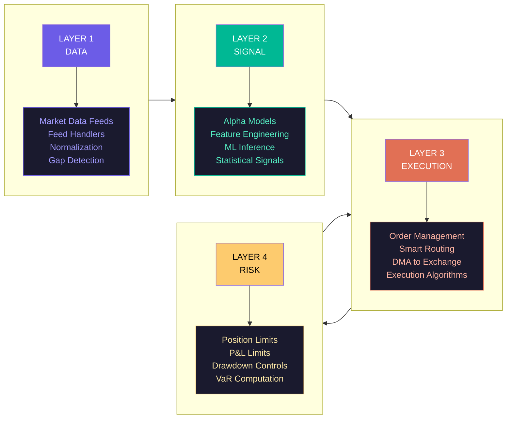
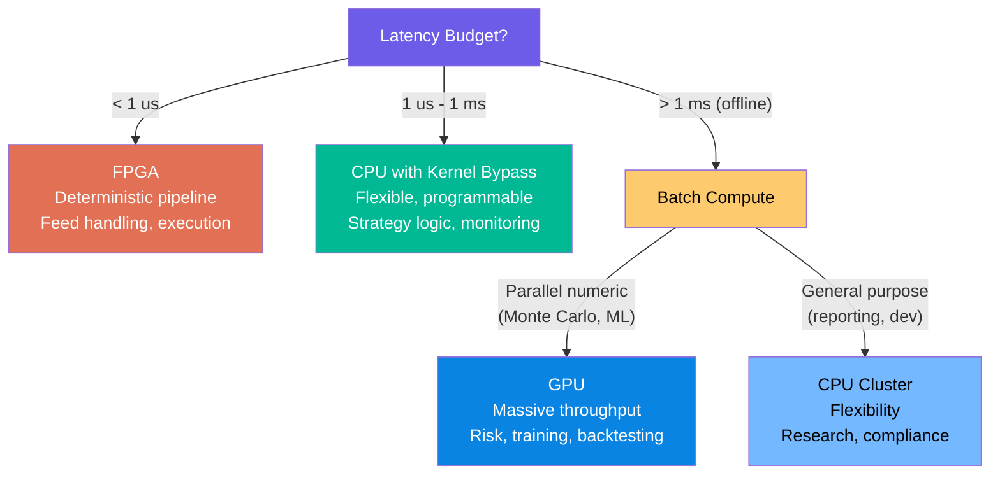
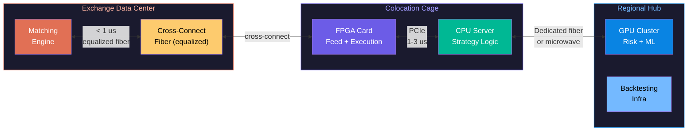

# The Quant Computing Stack: Data, Signal, Execution, Risk

Over the past eighteen weeks, you have built an understanding of computing from transistors to supercomputers. This week, we bring every layer of that stack to bear on one of the most demanding computing domains on Earth: quantitative finance. A modern trading firm is not a bank with some computers. It is a technology company that happens to trade financial instruments. The compute stack that powers a quantitative trading firm draws on every concept we have studied: pipelined processor design for software execution, memory hierarchy for latency-sensitive data structures, GPU parallelism for risk computation, FPGA custom pipelines for wire-speed market data processing, and network infrastructure that pushes the physical limits of the speed of light.

This lecture maps the complete trading technology stack end to end: how market data enters the system, how alpha signals are generated, how orders are constructed and routed, and how risk is managed in real time. We will examine the hardware selection decisions that firms make at each layer and the network infrastructure that connects everything together.

## The Four Layers of the Trading Technology Stack

A quantitative trading system can be decomposed into four functional layers, each with distinct computational characteristics and hardware requirements:

1. **Data Layer** -- ingest, normalize, and distribute market data
2. **Signal Layer** -- generate alpha (trading signals) from data
3. **Execution Layer** -- translate signals into orders, route to exchanges
4. **Risk Layer** -- enforce constraints before and after trades

These layers form a pipeline. In a high-frequency trading (HFT) firm, the entire pipeline from market data ingress to order egress must complete in hundreds of nanoseconds. In a medium-frequency quantitative fund, the budget might be milliseconds. The hardware architecture differs dramatically between these regimes, but the logical decomposition remains the same.

## Layer 1: Market Data -- Feed Handling and Normalization

### What Arrives on the Wire

Every exchange publishes a continuous stream of market data: new orders, order modifications, cancellations, and trades. The two dominant data models are:

**Market-by-Price (MBP):** The exchange sends aggregated quantities at each price level. An update says "the total bid quantity at \$150.50 is now 500 shares." This is simpler to process but hides individual order information.

**Market-by-Order (MBO):** The exchange sends individual order events with unique order IDs. Nasdaq's ITCH protocol is the canonical example: each Add Order message contains a unique order reference number, side (buy/sell), shares, price, and stock symbol. Your system must maintain an order-ID-to-price-level mapping (typically a hash map) and reconstruct the aggregate book state.

The volume is staggering. Nasdaq ITCH generates peaks of 8.5 million messages per second at 3.4 Gbps throughput. The CME's Market Data Platform (MDP 3.0) uses the Simple Binary Encoding (SBE) format and the FAST (FIX Adapted for STreaming) compression protocol. FAST uses template-based encoding with stop-bit delimited fields, presence maps (PMap bitmaps), and delta compression operators -- achieving 2-10x compression over raw FIX but requiring a state machine decoder that tracks the previous values of every field.

### Feed Handlers: Hardware vs. Software

A **feed handler** is the first stage of the pipeline: it receives raw network packets, decodes the exchange protocol, and produces normalized market data events.

**Software feed handlers** run on a CPU with kernel bypass (DPDK or OpenOnload). DPDK uses Poll Mode Drivers that continuously poll the NIC receive queue in a busy loop -- no interrupts, no context switches, no kernel involvement. Latency: 1-5 microseconds from wire to application. OpenOnload (Solarflare/AMD) intercepts socket API calls via `LD_PRELOAD` and implements TCP/IP in user space, achieving kernel bypass without application code changes.

**Hardware (FPGA) feed handlers** implement the protocol decoder directly in logic fabric. A FAST protocol decoder on FPGA achieves ~720ns per message sequentially, or sub-200ns with speculative parallel decoding (Springer 2023, ACM 2021). ITCH parsing on a Xilinx Virtex UltraScale+ takes 20-25ns per message, processing 8.3 million messages per second at 35% LUT utilization (Nair 2024). The key advantage is deterministic latency: every message takes the same number of clock cycles, with no cache misses, branch mispredictions, or OS preemption.

### Multicast and Gap Detection

Exchange feeds use UDP multicast -- one sender, many receivers. Because UDP provides no delivery guarantees, feed handlers must implement **gap detection**: tracking sequence numbers and requesting retransmissions when gaps appear. In FPGA implementations, the sequence number check is a single-cycle comparison, and the gap request can be triggered within nanoseconds. Software implementations face the additional latency of socket buffer processing and user-space notification.

### Data Normalization

Different exchanges use different protocols, message formats, price representations (fixed-point vs. floating-point), and symbology. A normalization layer converts everything to a common internal representation. In an FPGA pipeline, this is a fixed set of field mappings compiled into the logic. In software, it is typically a set of exchange-specific adapter modules that produce a common `MarketDataEvent` structure.

<ConceptCheck id="cc-1" />

## Layer 2: Signal Generation -- Alpha Models

Once normalized market data is available, the signal layer computes **alpha** -- a prediction about future price movement. Alpha models range from simple statistical rules to complex machine learning systems.

### Statistical Alpha Models

**Mean reversion** exploits the tendency of prices to return to a moving average. When the current price deviates significantly from its exponential moving average (EMA), a mean-reversion strategy bets on convergence:

$$\text{Signal} = \frac{EMA_t - P_t}{\sigma_t}$$

where $\sigma_t$ is the recent volatility. A signal above +2 standard deviations suggests the price is "too high" and may revert.

**Momentum** is the opposite thesis: prices that have been rising tend to continue rising. A momentum signal might use the rate of change over a lookback window:

$$\text{Signal} = \frac{P_t - P_{t-k}}{P_{t-k}}$$

**Pairs trading** identifies two correlated instruments (e.g., two oil stocks) and trades the spread when it deviates from its historical mean. The spread $z_t = P_{A,t} - \beta \cdot P_{B,t}$ is modeled as mean-reverting, and positions are entered when $|z_t - \bar{z}| > 2\sigma_z$.

### Feature Engineering for Trading

The raw price stream is transformed into features that carry predictive signal:

**Order flow imbalance (OFI):** The difference between buy and sell pressure at the top of the order book. If $Q_{bid}$ and $Q_{ask}$ are the quantities at the best bid and ask, then $OFI = Q_{bid} - Q_{ask}$. Persistent imbalance often predicts short-term price direction. Empirical studies show that OFI explains 60-70% of contemporaneous price changes on liquid equities.

**VWAP deviation:** The Volume-Weighted Average Price is $VWAP = \sum(P_i \cdot V_i) / \sum V_i$ over some window. If the current price is far from VWAP, large institutional buyers may push it back.

**Realized volatility:** Computed from high-frequency returns as $\sigma_{realized} = \sqrt{\sum_{i=1}^{N} r_i^2}$ where $r_i$ are tick-by-tick log returns. This captures the actual volatility of the instrument, which may diverge from implied volatility (a tradeable signal).

### ML Models for Alpha

Many modern quantitative firms use gradient-boosted decision trees (XGBoost, LightGBM) for short-horizon alpha prediction. These models ingest hundreds of features -- microstructure signals, cross-asset correlations, macro indicators -- and produce a single predicted return or probability of price direction.

The critical constraint is **inference latency**. A gradient-boosted model with 500 trees of depth 6 requires roughly 500 tree traversals, each involving 6 comparisons and memory lookups. On a modern CPU with the model in L1 cache, inference takes 1-5 microseconds. On a GPU, batch inference is more efficient but individual predictions are slower due to kernel launch overhead. Some firms implement tree traversal directly on FPGA, where each comparison is a single-cycle operation and the entire forest can be evaluated in fixed pipeline stages.

<ConceptCheck id="cc-2" />

## Layer 3: Execution -- Order Management and Smart Routing

### Execution Algorithms

When the signal layer produces a trading decision, the execution layer must translate it into actual exchange orders. For large orders, naive execution (sending the full order at once) would move the market against you. **Execution algorithms** break large orders into smaller pieces:

**TWAP (Time-Weighted Average Price):** Divide the order into equal slices and execute one per time interval. If you want to buy 10,000 shares over 1 hour, you send 167 shares every minute. Simple and predictable, but does not adapt to market conditions.

**VWAP (Volume-Weighted Average Price):** Distribute the order proportionally to expected volume. If historical volume patterns show 20% of daily volume trades in the first hour, send 20% of your order in that hour. The goal is to match the VWAP benchmark.

**Implementation Shortfall (IS):** Minimize the difference between the decision price (when you decided to trade) and the actual execution price. This algorithm trades aggressively when the price is favorable and slows down when the market moves against you. It explicitly balances market impact against timing risk.

### Direct Market Access and the Latency Budget

**Direct Market Access (DMA)** lets a trading firm send orders directly to the exchange's matching engine, bypassing broker intermediation. The firm's server sits in the exchange's colocation facility, connected by a cross-connect fiber cable.

The end-to-end latency budget from signal to wire is the sum of per-stage latencies. Based on published FPGA architectures (Nair 2024, Boutros et al. IEEE FPT 2017):

| Pipeline Stage | FPGA Latency | Software Latency |
|---|---|---|
| NIC/PHY Receive | ~10 ns | ~10 ns |
| Protocol Parsing | 20-25 ns | 200-2000 ns |
| Order Book Update | 30-40 ns | 1000-5000 ns |
| Signal/Strategy | ~45 ns | 500-5000 ns |
| Risk Check | ~20 ns | 200-1000 ns |
| Order Formatting | ~50 ns | 100-500 ns |
| NIC/PHY Transmit | ~100 ns | ~100 ns |
| **Total** | **150-300 ns** | **2-15 us** |

Boutros et al. (IEEE FPT 2017) demonstrated 270ns average tick-to-trade latency on a Xilinx Kintex UltraScale using HLS C++, with resource utilization under 8% logic and 22% BRAM. Lockwood and Gupte (IEEE HOTI 2012) achieved 1 microsecond end-to-end at 10 Gbps. As of 2024-2025, top-tier firms like Citadel Securities, Jump Trading, and IMC achieve sub-100 nanosecond tick-to-trade for simple strategies.

## Layer 4: Risk Management

### Pre-Trade Risk

Every order must pass risk checks before leaving the firm:

**Position limits:** Maximum number of shares or contracts in any single instrument. Prevents concentrated exposure.

**P&L limits:** If the strategy has lost more than a threshold amount today, halt trading. Prevents catastrophic loss from a malfunctioning strategy.

**Drawdown limits:** If the strategy's equity curve has fallen more than $x$% from its peak, stop. This catches both gradual deterioration and sudden crashes.

**Rate limits:** Maximum orders per second. Exchanges impose these, and firms implement them internally as a safety layer. NYSE imposes order rate limits of roughly 5,000 orders per second per connection.

In an FPGA pipeline, risk checks run in parallel with order formatting (not sequentially), taking roughly 20ns. This is possible because all position state is maintained in on-chip BRAM, and each check is a simple comparison: `position + order_quantity <= max_position`. In software, risk checks require locking shared state (position books), which adds contention latency.

### Post-Trade Risk: Value at Risk (VaR)

After trades execute, the firm computes portfolio-level risk metrics. The most important is **Value at Risk (VaR)**: the maximum loss expected over a given time horizon at a given confidence level.

**Parametric VaR** assumes returns are normally distributed:

$$VaR_{\alpha} = -(\mu - z_{\alpha} \cdot \sigma) \cdot V$$

where $\mu$ is the expected return, $\sigma$ is the portfolio standard deviation, $z_{\alpha}$ is the normal quantile (e.g., $z_{0.01} = 2.326$ for 99% confidence), and $V$ is the portfolio value.

**Historical VaR** uses the actual distribution of past returns: sort the last 250 daily returns, and the 1st-percentile return is the 99% VaR. No distributional assumption required, but assumes the past is representative of the future.

**Monte Carlo VaR** simulates thousands of possible portfolio return scenarios using the current covariance structure. This is the most flexible approach and is where GPU computing becomes essential -- we will develop this in full detail in the next lecture.

<ConceptCheck id="cc-3" />

## Hardware Selection for Trading Firms

The choice of compute platform at each layer depends on the latency budget, computational complexity, and the need for flexibility:

| Layer | CPU | GPU | FPGA |
|---|---|---|---|
| Feed Handler | Kernel bypass, 1-5 us | Not suitable | 20-200 ns, deterministic |
| Alpha (simple) | 1-5 us | Not suitable | 10-50 ns |
| Alpha (ML) | 1-10 us (tree models) | Batch inference | Tree traversal in logic |
| Execution | 0.5-2 us | Not suitable | 50-150 ns |
| Risk (pre-trade) | 200-1000 ns | Not suitable | ~20 ns (parallel) |
| Risk (post-trade) | Minutes (VaR backtest) | Seconds (Monte Carlo) | Not typical |
| Backtesting | Hours (large datasets) | GPU-accelerated | Not typical |
| ML Training | Hours-days | GPU essential | Not suitable |

The pattern: **FPGA dominates the real-time path** (data ingestion through order execution), **GPU dominates offline computation** (risk, backtesting, ML training), and **CPU handles everything else** (strategy development, position management, monitoring). As IMC Trading has documented, their hardware engineers work "in lockstep with software engineers and traders, carefully dissecting trading algorithms into the pieces that are best suited for hardware versus software."

## Network Infrastructure

### Colocation

The most important network optimization is physical proximity. Trading firms colocate their servers in the exchange's data center -- NYSE's US Liquidity Center in Mahwah, NJ; Nasdaq's matching engine in Carteret, NJ; CME Group's data center in Aurora, IL. Colocation costs range from ~\$2,500/month for an 8-rack-unit space at NYSE Mahwah to \$20,000+ for a full cabinet with high power density.

Within the colocation facility, cable lengths are equalized. NYSE/ICE normalizes all cross-connect fiber lengths so that no participant has a distance advantage -- "a foot of cable equates to one nanosecond's difference" (ICE Technical Specifications 2026). CBOE implements explicit latency equalization across all colocated participants.

### Kernel Bypass: DPDK and OpenOnload

The standard Linux kernel networking path introduces 10-50 microseconds of latency through system calls, interrupt handling, socket buffer copies, and protocol processing. Kernel bypass eliminates this entire path:

**DPDK** uses Poll Mode Drivers that busy-poll the NIC, huge pages (2MB or 1GB) for TLB miss reduction (99% fewer TLB misses), core pinning for dedicated packet processing, and lock-free ring buffers for inter-core communication. Result: 1-5 microsecond latency, 10-100+ million packets per second.

**OpenOnload** (Solarflare/AMD) intercepts standard socket API calls via `LD_PRELOAD` library injection and implements TCP/IP in user space. It is application-transparent -- no code changes required -- but vendor-locked to Solarflare NICs.

### Hardware Timestamping and Time Synchronization

Accurate timestamps are essential for regulatory compliance and performance measurement. **PTP (Precision Time Protocol, IEEE 1588)** synchronizes clocks across a network to sub-microsecond accuracy. **GPS-disciplined oscillators** provide an absolute time reference accurate to tens of nanoseconds. All trade timestamps must be traceable to a GPS reference for regulatory reporting.

### Long-Haul: Microwave and Laser Links

For cross-exchange trading (e.g., arbitrage between CME in Aurora, IL and Nasdaq in Carteret, NJ), the speed of light becomes the bottleneck. The straight-line distance is ~1,156 km, giving a theoretical minimum one-way latency of ~3.86ms.

| Medium | One-Way Latency | Round-Trip | Speed |
|---|---|---|---|
| Fiber optic | ~6.5 ms | ~13.0 ms | ~204 km/ms (refractive index 1.47) |
| Microwave | ~3.9-4.0 ms | ~7.8-8.2 ms | ~299 km/ms (near $c$) |
| Theoretical minimum | ~3.86 ms | ~7.72 ms | Speed of light in vacuum |

McKay Brothers operates microwave links achieving 7.82-7.84ms round trip from Aurora to New Jersey facilities. Jump Trading built their own microwave tower network. The 5ms round-trip advantage of microwave over fiber is enormous at HFT timescales -- thousands of trading opportunities can occur in that window.

<ConceptCheck id="cc-4" />

## Real-World Firm Architecture

A typical HFT market-making firm organizes its technology in three tiers:

**Tier 1 -- Colocation (FPGA + CPU):** In each exchange's data center, FPGA cards (e.g., AMD Alveo UL3524, Arista 7130) handle feed processing and order execution. A colocated CPU server runs the strategy logic that does not fit in FPGA fabric (complex ML models, position management) and communicates with the FPGA via PCIe or shared memory. The FPGA-to-exchange path is sub-microsecond; the FPGA-to-CPU path adds 1-3 microseconds.

**Tier 2 -- Regional Hub (GPU + CPU):** A nearby data center (same metro area) houses the firm's risk engine, backtesting infrastructure, and ML training pipeline. GPU clusters run Monte Carlo VaR, strategy backtests over years of historical data, and train ML models. This hub connects to colocation sites via dedicated fiber or microwave.

**Tier 3 -- Central Office (CPU):** The firm's headquarters runs portfolio management, compliance reporting, research and development, and human decision-making. Latency is irrelevant here -- what matters is analytical depth.

This three-tier architecture reflects the fundamental lesson of this course: compute resources must be matched to the computational characteristics of each workload. The real-time path demands deterministic latency (FPGA), offline computation demands throughput (GPU), and general-purpose tasks demand flexibility (CPU).

## Building the Capstone: Project 6

If you are pursuing **Track C (FPGA Trading System)** for Project 6, this lecture provides the architectural framework. Your multi-symbol exchange simulator should model these four layers, with feed demultiplexing, strategy computation, risk checking, and order generation as distinct pipeline stages. The backtesting engine you build will replay historical events through this pipeline and compute the trading performance metrics we have described. Your Week 19 milestone should demonstrate cross-symbol correlation signals and a functioning risk management system.

## Summary

The quantitative trading technology stack is a masterclass in computer architecture applied to an extreme performance domain. Every concept we have studied appears: pipelined execution (FPGA signal processing pipelines), memory hierarchy (order books in BRAM vs. DRAM), parallelism (GPU Monte Carlo), network architecture (kernel bypass, colocation), and the fundamental tradeoff between latency, throughput, power, cost, and flexibility. In the next lecture, we will dive deep into the compute-intensive mathematics that drives the risk and pricing layers: Monte Carlo simulation, fixed-point arithmetic for hardware pricing, and real-time streaming analytics.
