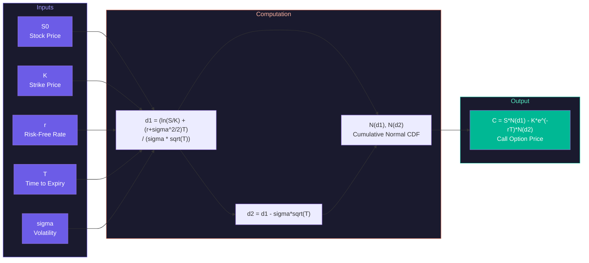
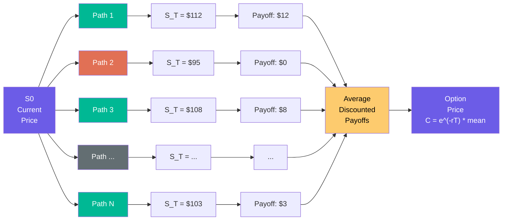
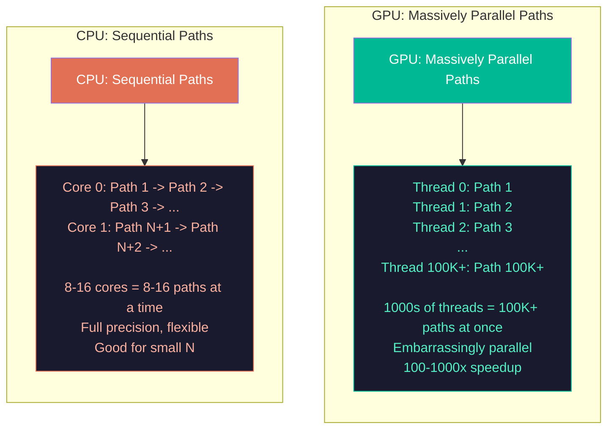
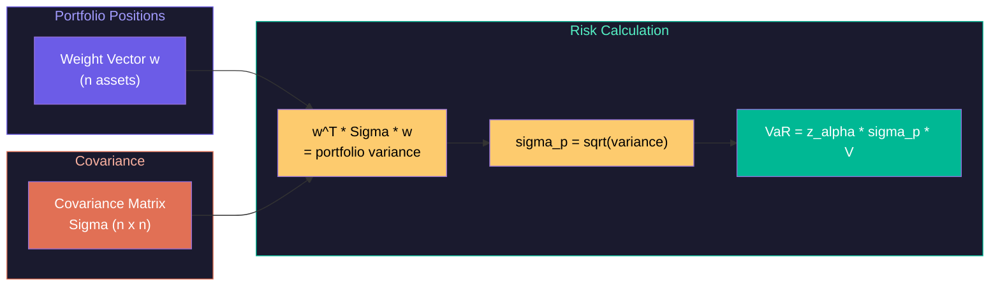
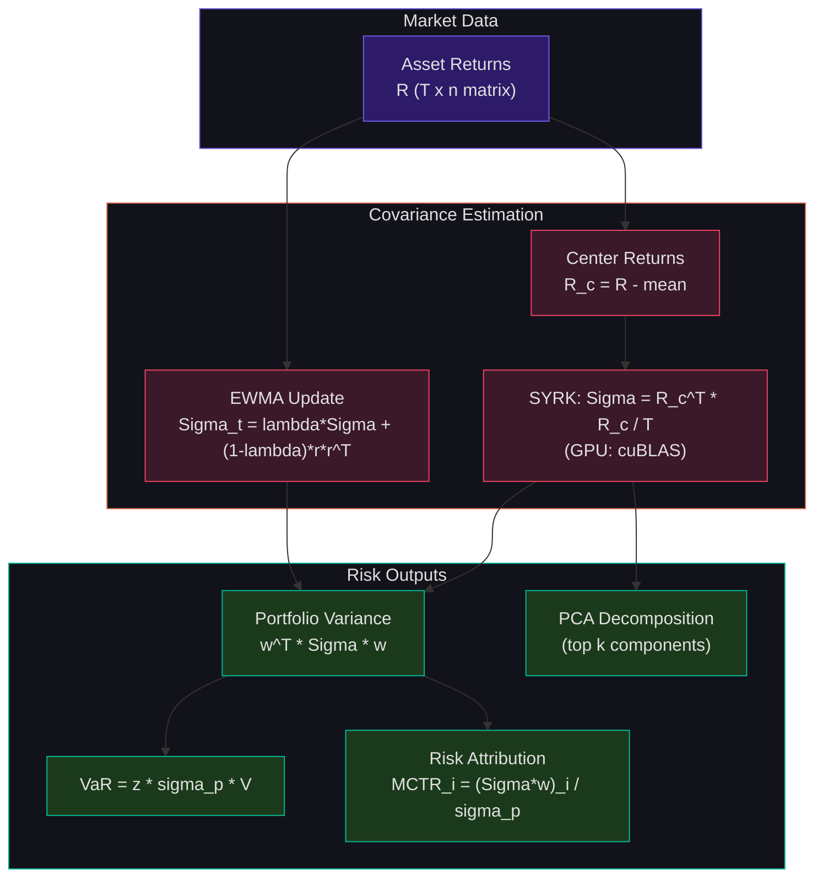

# Compute-Intensive Finance: Monte Carlo, Risk, and Real-Time Analytics

The previous lecture mapped the trading technology stack at the architectural level. This lecture goes deep on the mathematics and computation that drive the most demanding layers: option pricing via Monte Carlo simulation, portfolio risk computation, hardware implementation of pricing formulas, and real-time streaming statistics. Each topic connects directly to the compute hardware we have studied -- Monte Carlo maps perfectly to GPU parallelism, fixed-point Black-Scholes maps to FPGA pipelines, and streaming statistics require careful algorithm design to maintain numerical stability at millions of events per second.

## Black-Scholes Option Pricing: The Closed-Form Foundation

An **option** gives the holder the right (but not the obligation) to buy or sell an asset at a specified **strike price** $K$ on or before an **expiration date** $T$. A **call option** profits when the stock price exceeds the strike; a **put option** profits when it falls below.

Fischer Black and Myron Scholes derived a closed-form formula for the price of a European call option under the assumption that the stock price follows geometric Brownian motion (GBM) with constant volatility:



$$C = S_0 N(d_1) - K e^{-rT} N(d_2)$$

where:

$$d_1 = \frac{\ln(S_0/K) + (r + \sigma^2/2)T}{\sigma\sqrt{T}}, \quad d_2 = d_1 - \sigma\sqrt{T}$$

Here $S_0$ is the current stock price, $K$ is the strike price, $r$ is the risk-free interest rate, $T$ is the time to expiration in years, $\sigma$ is the annualized volatility, and $N(x)$ is the cumulative standard normal distribution function.

This formula is beautiful and fast to evaluate -- a handful of arithmetic operations plus one call to the normal CDF. But it applies only to **European options** (exercisable only at expiration) with **constant volatility** and **no dividends**. In practice, volatility is not constant (it smiles), options may be American-style (exercisable any time), payoffs may depend on the entire price path (Asian options, barrier options, lookback options), and models may include jumps or stochastic volatility. For these cases, the closed form fails, and we turn to Monte Carlo simulation.

## Monte Carlo Option Pricing

### The Core Idea

Monte Carlo pricing works by simulating many possible future paths of the stock price, computing the option payoff for each path, and averaging the discounted payoffs:



$$C \approx e^{-rT} \cdot \frac{1}{N} \sum_{i=1}^{N} \max(S_T^{(i)} - K, 0)$$

Each terminal stock price $S_T^{(i)}$ is generated by simulating geometric Brownian motion:

$$S_T = S_0 \exp\left[\left(r - \frac{\sigma^2}{2}\right)T + \sigma\sqrt{T} \cdot Z\right]$$

where $Z \sim \mathcal{N}(0,1)$ is a standard normal random variable. The term $r - \sigma^2/2$ is the risk-neutral drift (Ito's correction ensures the expected return under the risk-neutral measure is exactly the risk-free rate), and $\sigma\sqrt{T}\cdot Z$ is the random shock.

For path-dependent options, we discretize time into $M$ steps of size $\Delta t = T/M$ and simulate the price at each step:

$$S_{t+\Delta t} = S_t \exp\left[\left(r - \frac{\sigma^2}{2}\right)\Delta t + \sigma\sqrt{\Delta t} \cdot Z_t\right]$$

This is the **Euler-Maruyama discretization** of the GBM stochastic differential equation $dS = \mu S\,dt + \sigma S\,dW$.

### Convergence

By the Central Limit Theorem, the Monte Carlo estimator converges at rate $O(1/\sqrt{N})$: to halve the standard error, you must quadruple the number of paths. With $N = 100{,}000$ paths, the standard error is $\sigma_{payoff}/\sqrt{100{,}000} \approx \sigma_{payoff}/316$. For a typical at-the-money option with payoff standard deviation ~\$5, the pricing error is about \$0.016 -- acceptable for most applications.

This slow convergence rate is both the weakness and the opportunity of Monte Carlo: each path is independent, making the problem embarrassingly parallel and perfectly suited to GPU computation.

<ConceptCheck id="cc-1" />

### Variance Reduction Techniques

We can reduce the standard error without increasing $N$ by exploiting structure in the problem.

**Antithetic variates:** For each random draw $Z_i$, also evaluate the path with $-Z_i$. The paired estimator is:

$$\hat{C}_{AV} = e^{-rT} \cdot \frac{1}{2N} \sum_{i=1}^{N} \left[\max(S_T(Z_i) - K, 0) + \max(S_T(-Z_i) - K, 0)\right]$$

Since $Z$ and $-Z$ are negatively correlated, the variance of the average is reduced. Generating $-Z$ is free (just negate), and the variance reduction is typically 30-50% for vanilla options.

**Control variates:** Use a correlated quantity with a known expected value to adjust the estimate. Let $X$ be a control variate (e.g., the stock price itself, whose expected value under the risk-neutral measure is $S_0 e^{rT}$). The adjusted estimator is:

$$\hat{C}_{CV} = \hat{C} - \beta \cdot (\hat{X} - E[X])$$

where $\beta = \text{Cov}(\hat{C}, \hat{X}) / \text{Var}(\hat{X})$ minimizes the variance. For geometric average Asian options (which have a closed-form solution), using the geometric average as a control variate for the arithmetic average option achieves 80-95% variance reduction.

**Stratified sampling:** Divide the unit interval $[0,1]$ into $N$ equal strata and draw one sample per stratum using the inverse CDF: $Z_i = \Phi^{-1}((i - U_i)/N)$ where $U_i \sim \text{Uniform}(0,1)$. This ensures coverage of the entire distribution, reducing variance from $O(1/N)$ to $O(1/N^2)$ for smooth payoff functions.

## Monte Carlo on GPU

Monte Carlo option pricing is the canonical example of embarrassingly parallel computation. Each path simulation is independent: generate a random $Z$, compute $S_T$, evaluate the payoff. No communication between paths. No shared state. This maps perfectly to GPU architecture.

### Why GPUs Are Perfect



A single GPU thread simulates one path. An NVIDIA V100 with 5,120 CUDA cores can have hundreds of thousands of threads in flight simultaneously. The key performance numbers from published work:

| Platform | Paths | Time Steps | Time | Speedup vs. CPU |
|---|---|---|---|---|
| NVIDIA V100 | 8.192M | 365 | 26.6 ms | ~100x |
| NVIDIA K80 | 1M | 252 | 160 ms | 45x |
| NVIDIA GPU (general) | 10M+ | 252 | ~50 ms | 100-1000x |

These speedups come from the GPU's massive thread-level parallelism and the fact that Monte Carlo has high arithmetic intensity -- many floating-point operations per byte of memory traffic.

### GPU Random Number Generation: cuRAND

The random numbers must be generated on the GPU itself -- transferring millions of random numbers from CPU to GPU would negate the speedup. NVIDIA's cuRAND library provides device-side generators:

| Generator | Type | Best For |
|---|---|---|
| **Philox4x32-10** | Counter-based | Massively parallel (minimal state) |
| **MRG32k3a** | Combined MRG | High statistical quality |
| **Sobol** | Quasi-random | Variance reduction |
| **XORWOW** | Pseudorandom | General use (cuRAND default) |

**Philox** is preferred for GPU Monte Carlo because it is counter-based: each thread independently generates unique random numbers from its thread ID and a global seed, with no shared state to read from global memory. The statistical quality is excellent for financial applications, and the period ($2^{128}$) is more than sufficient.

### GPU Monte Carlo Structure

The computation proceeds in two phases:

**Phase 1 -- Path simulation:** Each GPU thread generates its own $Z$ (via cuRAND), computes $S_T$, and stores the payoff $\max(S_T - K, 0)$ in a per-thread register or local array.

**Phase 2 -- Reduction:** Sum all payoffs and divide by $N$ to get the price estimate. This uses the parallel reduction pattern from Week 13: warp-level reduction via `__shfl_down_sync`, then shared memory reduction across warps, then atomic addition across blocks.

For path-dependent options (e.g., Asian options), each thread simulates the entire path of $M$ steps, maintaining a running average or extremum in registers.

<ConceptCheck id="cc-2" />

## Black-Scholes in Fixed-Point: Hardware Pricing

While GPUs excel at batch Monte Carlo, FPGAs dominate when you need **deterministic, per-option pricing at wire speed**. The goal is to evaluate the Black-Scholes formula in a fixed number of clock cycles with a pipelined architecture that produces one price per clock cycle at steady state.

### Fixed-Point Representation

IEEE 754 floating-point arithmetic is expensive in hardware: a double-precision floating-point multiplier uses thousands of logic elements. Fixed-point arithmetic replaces floating-point with scaled integers, using integer multipliers (which map directly to FPGA DSP blocks) and shifts for scaling.

A fixed-point representation with $F$ fractional bits represents a real number $x$ as the integer $\lfloor x \cdot 2^F \rfloor$. Arithmetic operations on fixed-point values:

- **Addition/Subtraction:** Same as integer addition. Fractional bits must match.
- **Multiplication:** Multiply the two integers, then right-shift the result by $F$ to restore the fractional point: $(a \cdot 2^F) \times (b \cdot 2^F) = (a \cdot b) \cdot 2^{2F}$, so shift right by $F$ to get $(a \cdot b) \cdot 2^F$.
- **Division:** Left-shift the dividend by $F$ before integer division: $(a \cdot 2^F \cdot 2^F) / (b \cdot 2^F) = (a/b) \cdot 2^F$.

With $F = 16$ fractional bits, we have precision of $2^{-16} \approx 0.0000153$, sufficient for pricing to sub-cent accuracy. With $F = 24$, precision is $2^{-24} \approx 0.0000000596$.

### Polynomial Approximation of $N(x)$

The Black-Scholes formula requires the cumulative normal distribution $N(x)$. There is no closed form, but Abramowitz and Stegun provide polynomial approximations. The rational approximation with 4 multiplications achieves relative error below $10^{-7}$:

For $x \geq 0$:

$$N(x) \approx 1 - n(x) \cdot (a_1 k + a_2 k^2 + a_3 k^3)$$

where $k = 1/(1 + 0.33267 \cdot x)$, $n(x) = \frac{1}{\sqrt{2\pi}} e^{-x^2/2}$, and $a_1 = 0.4361836$, $a_2 = -0.1201676$, $a_3 = 0.9372980$.

For $x < 0$: $N(x) = 1 - N(-x)$.

In fixed-point on FPGA, $e^{-x^2/2}$ is implemented via a lookup table (LUT) for the exponent combined with a polynomial for interpolation, and the multiplications use DSP48 blocks that complete in one clock cycle each.

### FPGA Black-Scholes Pipeline

A full FPGA Black-Scholes implementation (as documented in published work on Intel Stratix V) requires:

- 22 multipliers (mapping to DSP blocks)
- 3 dividers (sequential or SRT)
- 1 square root (pipelined Newton-Raphson)
- 1 logarithm (CORDIC or polynomial)
- 1 exponential (polynomial or LUT)

Published performance: **180 million prices per second** on Intel Stratix V at 179 MHz, with 208 clock cycles of initial pipeline latency, using 68,148 logic elements and 261 DSP blocks. The throughput of 180M prices/sec comes from the pipelined architecture: although each price takes 208 cycles to complete, a new price enters the pipeline every clock cycle (II=1).

The speedup over CPU ranges from 5x (vs. vectorized multi-core CPU) to 5,400x (vs. naive single-threaded implementation), depending on the baseline and the number of parallel instances.

For HFT, the key advantage is **deterministic latency**: every option price completes in exactly 208 cycles regardless of input values. There are no cache misses, no branch mispredictions, no OS interrupts. Combined with on-chip network I/O, the FPGA can compute a price within ~1 microsecond of receiving the market data that triggered the computation (Lockwood, IEEE HOTI 2012).

<ConceptCheck id="cc-3" />

## Real-Time Risk Computation

### Portfolio Value at Risk



A portfolio of $n$ assets with weight vector $\mathbf{w}$ has variance:

$$\sigma_p^2 = \mathbf{w}^T \Sigma \mathbf{w}$$

where $\Sigma$ is the $n \times n$ covariance matrix of asset returns. The parametric VaR at confidence level $\alpha$ is:

$$VaR_\alpha = z_\alpha \cdot \sigma_p \cdot V$$

where $z_\alpha$ is the normal quantile (e.g., $z_{0.99} = 2.326$) and $V$ is the portfolio value.

For a portfolio of 500 positions, this requires multiplying a $500 \times 500$ covariance matrix by a weight vector -- a matrix-vector product that is $O(n^2)$. For full covariance estimation, we need $O(n^2)$ entries updated in real time as new returns arrive. This is a Level 2 BLAS operation, well-suited to GPU computation.

### Covariance Estimation: EWMA

The **Exponentially Weighted Moving Average** covariance estimator gives more weight to recent observations:

$$\Sigma_t = \lambda \Sigma_{t-1} + (1 - \lambda) \mathbf{r}_t \mathbf{r}_t^T$$

where $\lambda$ is the decay factor (typically 0.94 for daily, per J.P. Morgan's RiskMetrics) and $\mathbf{r}_t$ is the vector of returns at time $t$. This is a rank-1 update to the covariance matrix -- each new observation requires $O(n^2)$ operations to update all $n(n+1)/2$ unique entries.

For high-frequency risk with $n = 500$ assets and updates at 1-second intervals, this is 125,000 multiply-adds per second -- trivial for any modern processor. But for Monte Carlo VaR with 10,000 simulation paths, each requiring the full covariance structure, the computation becomes:

$$\text{VaR Monte Carlo} = 10{,}000 \text{ paths} \times n \text{ assets} \times M \text{ steps} \times O(n) \text{ per step}$$

For $n = 500$ and $M = 252$ (one year of daily steps), this is $500 \times 252 \times 500 \times 10{,}000 = 630$ billion operations -- a task that takes minutes on CPU but seconds on GPU.

### PCA for Dimensionality Reduction

A portfolio of 500 assets does not truly have 500 independent risk factors. Principal Component Analysis decomposes the covariance matrix:

$$\Sigma = U \Lambda U^T$$

where $U$ is the matrix of eigenvectors and $\Lambda$ is the diagonal matrix of eigenvalues. Typically, the first 5-20 principal components explain 80-95% of the total variance. By projecting the portfolio onto these principal components, we reduce the dimensionality of the risk computation from $n = 500$ to $k \approx 15$, accelerating Monte Carlo simulation by a factor of $(n/k)^2 \approx 1,000$.

PCA itself is an eigendecomposition of a symmetric matrix, which is $O(n^3)$ by standard algorithms (QR iteration, divide-and-conquer). For $n = 500$, this is a 125-million-operation computation that takes milliseconds on a modern CPU. The PCA is typically recomputed daily or hourly, not at tick speed.

### Stress Testing and Scenario Analysis

Beyond VaR, risk managers run scenario analyses: "What happens to our portfolio if the S&P 500 drops 5%? If interest rates rise 200 basis points? If oil spikes 30%?" Each scenario applies a predetermined shock to risk factors and recomputes portfolio value.

**Historical replay** applies the factor movements from actual historical crises (2008 financial crisis, 2020 COVID crash, 2022 rate hiking cycle) to the current portfolio. This requires repricing every position under the stressed parameters -- a computation that benefits enormously from GPU parallelism when the portfolio contains thousands of options requiring Monte Carlo pricing.

## Matrix Operations for Finance

Finance relies heavily on matrix operations that map to Level 3 BLAS (matrix-matrix operations) and benefit from GPU acceleration:

**Covariance matrix computation:**

$$\Sigma = \frac{1}{T} \sum_{t=1}^{T} (\mathbf{r}_t - \bar{\mathbf{r}})(\mathbf{r}_t - \bar{\mathbf{r}})^T = \frac{1}{T} R^T R$$

where $R$ is the $T \times n$ matrix of centered returns. This is a `SYRK` (symmetric rank-$k$ update) operation.

**Portfolio optimization:** The Markowitz mean-variance optimization solves:

$$\min_{\mathbf{w}} \mathbf{w}^T \Sigma \mathbf{w} \quad \text{subject to} \quad \mathbf{w}^T \boldsymbol{\mu} = \mu_{\text{target}}, \quad \mathbf{w}^T \mathbf{1} = 1$$

This requires a matrix inverse or Cholesky decomposition, both $O(n^3)$.

**Risk attribution:** The marginal contribution of asset $i$ to portfolio risk is:

$$MCTR_i = \frac{(\Sigma \mathbf{w})_i}{\sigma_p}$$

This is a single matrix-vector multiply followed by scalar division.

The following diagram shows the complete portfolio risk matrix computation flow, from raw returns data through covariance estimation to the final VaR and risk attribution outputs:



All of these operations are GPU-friendly: they are large, regular, and map directly to cuBLAS primitives that achieve near-peak throughput on modern GPUs.

## Time-Series Streaming: Online Statistics

In real-time trading, statistics must be computed incrementally as new data arrives. Recomputing from scratch on every tick is too slow. The solution is **online algorithms** that update statistics in $O(1)$ per observation.

### Welford's Algorithm for Running Variance

Naive variance computation $\sigma^2 = E[X^2] - (E[X])^2$ is numerically unstable because it subtracts two large, nearly-equal numbers. **Welford's algorithm** maintains a running computation that is numerically stable:

```python
def welford_update(count, mean, m2, new_value):
    """Update running mean and variance with a new observation.

    Returns: (count, mean, M2) where variance = M2 / (count - 1)
    """
    count += 1
    delta = new_value - mean
    mean += delta / count
    delta2 = new_value - mean  # uses UPDATED mean
    m2 += delta * delta2
    return count, mean, m2

def welford_finalize(count, mean, m2):
    """Compute final variance and standard deviation."""
    if count < 2:
        return mean, 0.0, 0.0
    variance = m2 / (count - 1)
    return mean, variance, variance ** 0.5
```

The key insight is that `m2` accumulates the sum of squared differences from the running mean, using two different delta values (before and after updating the mean). This avoids catastrophic cancellation.

### Exponential Moving Average

The EMA gives exponentially decaying weight to past observations:

$$EMA_t = \alpha \cdot x_t + (1 - \alpha) \cdot EMA_{t-1}$$

where $\alpha = 2/(k+1)$ for a $k$-period EMA. This is a single multiply-add per tick -- trivially fast. The EMA is the workhorse of real-time signal generation: moving-average crossover strategies, volatility estimation, and trend detection all use EMAs.

In an FPGA pipeline, the EMA computation is a single DSP block performing one multiply-accumulate per clock cycle. Multiple EMAs with different lookback windows (e.g., 20, 50, 200 periods) run in parallel on separate DSP blocks.

### VWAP Computation

Volume-Weighted Average Price requires maintaining running sums:

$$VWAP_t = \frac{\sum_{i=1}^{t} P_i \cdot V_i}{\sum_{i=1}^{t} V_i}$$

This is two running sums and one division per update -- three operations per tick.

### Tick Data Processing at Scale

A firm monitoring 5,000 instruments across multiple exchanges may receive 20-50 million market data events per second during peak periods. Each event triggers updates to:

- The order book for that instrument (insert/modify/delete)
- Running statistics (EMA, VWAP, volatility, OFI) -- 5-10 statistics per instrument
- Cross-instrument signals (correlation, spread) -- $O(n^2)$ pairs in the worst case

At 50 million events per second, each event has a budget of 20 nanoseconds. This is why the data path runs on FPGA: a software system would need to process events faster than a single CPU instruction takes to execute.

<ConceptCheck id="cc-4" />

## Connecting It All: The Compute Hierarchy in Finance

The financial computing stack is a microcosm of the entire computer architecture course:

| Concept | Finance Application | Lecture Reference |
|---|---|---|
| Pipeline design | FPGA pricing pipeline, II=1 | Week 6 (Pipelining) |
| Memory hierarchy | Order books in BRAM, covariance in HBM | Week 8 (Caches) |
| Branch prediction | Speculative message decoding | Week 7 (Hazards) |
| SIMD/vectorization | CPU-based statistics, AVX for EMA | Week 11 (SIMD) |
| GPU parallelism | Monte Carlo VaR, ML training | Weeks 12-14 |
| FPGA pipelines | Feed handling, pricing, execution | Weeks 15-16 |
| Network topology | Colocation, microwave links | Week 17 (Interconnects) |
| Fixed-point arithmetic | Hardware Black-Scholes | Week 15 (FPGA Design) |

For **Project 6, Track C (FPGA Trading System)**, the problem set exercises in this lecture directly apply. You will implement Monte Carlo pricing, fixed-point arithmetic, and risk computation -- all of which can be integrated into your multi-symbol backtesting engine. The pipeline latency budget analysis from Problem Set 18 is exactly the kind of engineering analysis your capstone report should include.

## Summary

Quantitative finance demands every class of compute hardware we have studied. Monte Carlo simulation -- embarrassingly parallel, high arithmetic intensity -- is the perfect GPU workload, achieving 100-1000x speedup over CPU. Black-Scholes in fixed-point -- deterministic, pipelined, latency-critical -- is the perfect FPGA workload, achieving 180 million prices per second. Real-time risk -- matrix operations on covariance structures -- benefits from both GPU acceleration (for Monte Carlo VaR) and careful algorithmic design (EWMA for online estimation, PCA for dimensionality reduction). And streaming statistics -- Welford's algorithm, EMA, VWAP -- must be computed incrementally at millions of events per second, driving the need for hardware-accelerated data paths. The next lecture will look forward to the future of compute: photonics, processing-in-memory, neuromorphic chips, and quantum computing.
