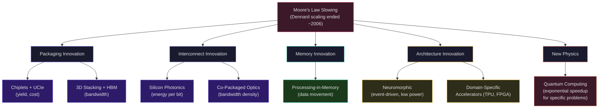
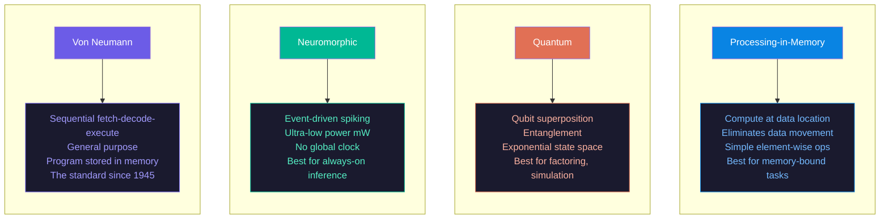
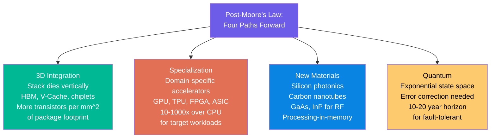
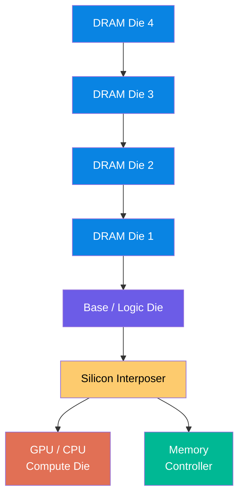
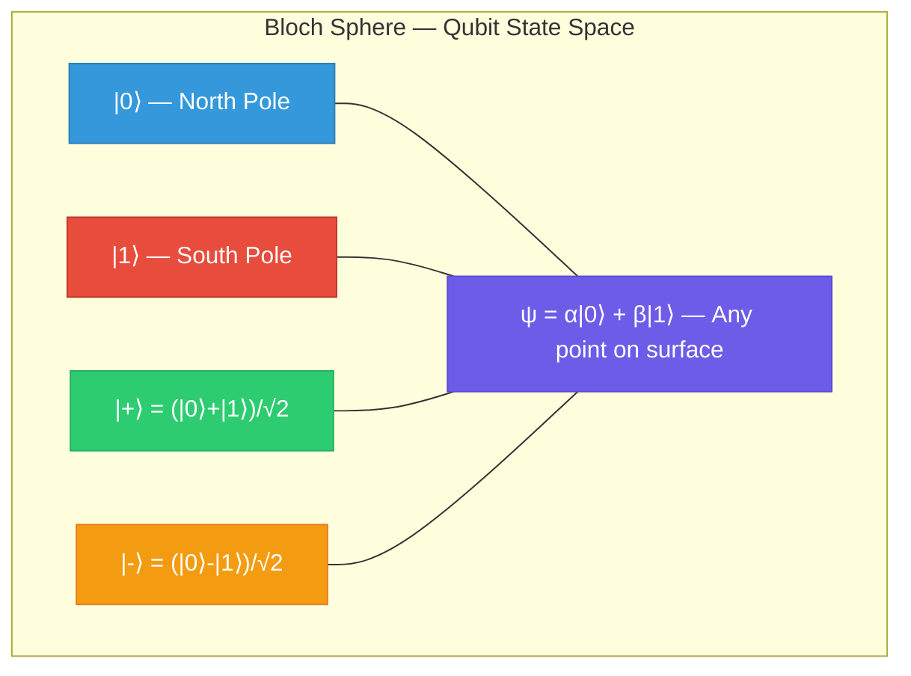

# The Future of Compute: Photonics, PIM, Neuromorphic, and Quantum

Over nineteen weeks, we have traced computing from individual transistors through logic gates, processors, caches, pipelines, GPUs, FPGAs, supercomputers, and specialized trading systems. Every advance we studied addressed the same fundamental tensions: how to compute faster while consuming less power, how to move data closer to computation, how to exploit parallelism at every level, and how to specialize hardware for the workloads that matter most. This lecture looks forward at the technologies that will define the next decade of compute: 3D integration and chiplets (already here), silicon photonics (arriving now), processing-in-memory (emerging), neuromorphic computing (niche but growing), and quantum computing (the most uncertain and most transformative).

None of these technologies will "replace" the von Neumann architecture we have studied. Each addresses a specific bottleneck in the current computing landscape. Understanding which bottleneck each technology targets -- and which it does not -- is the key to evaluating the hype.

The following diagram maps the post-Moore's Law paths being pursued to continue performance scaling. Each addresses a different bottleneck -- packaging, interconnect, memory, computation model, or physics:

## Where We Have Been

Let us take stock of the compute stack we have built across this course:

| Layer | Weeks | Core Insight |
|---|---|---|
| Physics to transistors | 1-2 | Semiconductor physics gives us a controllable switch |
| Transistors to logic | 3-4 | Boolean algebra maps computation to gate networks |
| Logic to processors | 5-7 | Pipelining, hazard resolution, out-of-order execution |
| Memory hierarchy | 8-10 | Caches exploit locality; the memory wall is the central challenge |
| Parallel processors | 11-14 | ILP, SIMD, multicore, GPU -- parallelism is the path forward |
| Specialized compute | 15-16 | FPGAs trade flexibility for latency; domain-specific beats general-purpose |
| Systems at scale | 17-19 | Supercomputers, interconnects, trading systems -- integrating everything |

The common thread: **Moore's Law gave us more transistors, but Dennard scaling ended around 2006**. Since then, we cannot simply clock processors faster. Every advance has been architectural: more parallelism, better memory hierarchies, specialized datapaths, and smarter interconnects. The technologies in this lecture continue that trend.

## 3D Integration and Chiplets: Already Here

### The Chiplet Revolution

AMD's EPYC processors pioneered the chiplet approach that is now industry-standard. Rather than fabricating one enormous die, the processor is decomposed into smaller dies (**chiplets**) connected by an interconnect:

**AMD EPYC Genoa (4th Gen, Zen 4):**
- 12 Core Complex Dies (CCDs) at TSMC 5nm, each with 8 cores
- 1 I/O Die (IOD) at TSMC 6nm for memory controllers, PCIe Gen 5, and Infinity Fabric
- Total: up to 96 cores, 384 MB L3 cache, 12-channel DDR5
- CCDs and IOD on different process nodes -- optimized independently

The yield advantage is decisive. Using AMD's defect density model with the negative binomial formula:

$$Y = \left(1 + \frac{A \cdot D}{\alpha}\right)^{-\alpha}$$

A small 8-core CCD at ~70 mm$^2$ has far higher yield than a hypothetical monolithic 96-core die at ~700 mm$^2$. AMD has stated that four smaller dies cost less than 60% of one equivalent large die. Defective CCDs become lower-core-count SKUs (e.g., EPYC 9354 with 32 cores uses only 4 of 12 CCD slots), eliminating waste entirely.

The progression tells the story: Naples (Zen 1, 14nm, 32 cores), Rome (Zen 2, 7nm, 64 cores), Milan (Zen 3, 7nm, 64 cores), Genoa (Zen 4, 5nm, 96 cores), Turin (Zen 5, 3/4nm, 192+ cores with 16 cores per CCD). Each generation increased core count primarily through architectural advances, not process scaling.

### 3D Stacking: HBM and Logic-on-Logic

**High Bandwidth Memory (HBM)** stacks DRAM dies vertically, connected by Through-Silicon Vias (TSVs):

- HBM2e: 4-8 DRAM dies stacked, 460 GB/s per stack, up to 16 GB per stack
- HBM3: 8-12 dies, 819 GB/s per stack, up to 24 GB per stack
- HBM3e: 36 GB per stack, 1.2 TB/s bandwidth

The AMD Instinct MI300A used in El Capitan integrates CPU and GPU compute dies with 128 GB HBM3 on a single package -- eliminating the PCIe bottleneck between CPU and GPU entirely. Each of El Capitan's 11,136 nodes contains 4x MI300A, delivering a combined 1.809 EFlop/s.

**Logic-on-logic stacking** is the next frontier. Rather than stacking memory on logic, stack logic on logic -- placing frequently accessed cache or compute blocks directly above the logic that uses them. AMD's 3D V-Cache technology stacks 64 MB of SRAM cache on top of a CCD, tripling the L3 cache to 96 MB per CCD. The latency penalty is minimal (~2 ns added) because TSVs are short and wide.

### UCIe: Standardizing Chiplet Interfaces

**Universal Chiplet Interconnect Express (UCIe)** standardizes the die-to-die interface so that chiplets from different vendors can be combined on a single package. The standard defines electrical signaling, protocols, and package-level connectivity. This enables a future where a system integrator purchases CPU chiplets from one vendor, AI accelerator chiplets from another, and memory chiplets from a third, assembling them on a common interposer.

UCIe 1.0 specifies 32 GT/s with 16-lane modules, achieving 4 GB/s per mm of package edge. UCIe 2.0 targets higher bandwidth and improved power efficiency. Intel, AMD, ARM, Google, Meta, Microsoft, Qualcomm, Samsung, and TSMC are all members of the UCIe consortium.

<ConceptCheck id="cc-1" />

## Silicon Photonics: Light Instead of Electrons

### The Interconnect Bottleneck

As compute density increases, the energy cost of moving data grows relative to the energy cost of computing it. At 3nm, a floating-point multiplication consumes ~0.5 pJ, but moving 64 bits from DRAM costs ~20 pJ, and sending 64 bits over 1 meter of copper at 100 Gbps costs ~100 pJ. **Data movement now dominates energy consumption** in data centers, consuming 30-50% of total power.

Silicon photonics replaces electrical copper interconnects with optical waveguides fabricated in silicon. Photons have fundamental advantages:

- **Bandwidth per watt:** Optical links achieve 10-100x better energy efficiency than electrical at distances beyond ~1 meter
- **Distance independence:** Unlike electrical signals that attenuate and disperse, optical signals maintain integrity over long distances without repeaters
- **No crosstalk:** Photons in adjacent waveguides do not interfere, unlike electrons in adjacent copper traces
- **Wavelength division multiplexing (WDM):** Multiple wavelengths on a single fiber multiply bandwidth without additional physical infrastructure

### Co-Packaged Optics (CPO)

The near-term application is **co-packaged optics**: integrating optical transceivers directly on the processor package rather than using external pluggable modules. Current servers connect to the network through pluggable QSFP modules on the motherboard edge, with ~15 cm of PCB traces between the processor and the optics. CPO eliminates those traces.

Benefits:
- **Lower power:** Removes the 10-15W per pluggable transceiver (optical and electrical conversion), replacing with ~5W co-packaged modules
- **Higher bandwidth density:** More optical ports per processor package
- **Lower latency:** Shorter electrical distance between compute and optical conversion

HPE Slingshot's next generation (Slingshot 400) targets 400 Gbps per port with co-packaged optics. At 400 Gbps per port and 64 ports per switch, a single switch provides 51.2 Tbps of aggregate bandwidth.

### Photonic Matrix Multiply

The longer-term vision is **photonic computing**: using the physics of light to perform computation directly. A matrix-vector multiply $\mathbf{y} = A\mathbf{x}$ can be implemented optically using Mach-Zehnder interferometer (MZI) meshes. Each MZI performs a 2x2 rotation, and a mesh of MZIs implements an arbitrary unitary transformation. Combined with optical amplitude modulators for the diagonal (singular values), this implements arbitrary matrix multiplication at the speed of light.

Companies pursuing this: **Lightmatter** (Envise processor using photonic interconnect and compute), **Luminous Computing** (photonic AI accelerators). The key challenge is precision -- optical computing currently achieves 4-8 bits of effective precision, compared to 16-32 bits for digital. For AI inference where lower precision (INT8, FP8) is already standard, this may be sufficient.

Timeline: optical interconnects are already deployed (fiber in data centers). Co-packaged optics will be mainstream within 2-3 years. Photonic compute for production workloads is 5-10 years out, if it arrives at all.

## Processing-in-Memory (PIM)

### The Data Movement Problem

The von Neumann bottleneck -- the limited bandwidth between processor and memory -- is the central challenge of modern computing. We have addressed it through caching (temporal and spatial locality), prefetching (predicting future accesses), and high-bandwidth memory (HBM). PIM takes a different approach: instead of moving data to the compute, move the compute to the data.

### DRAM-Based PIM

**Samsung HBM-PIM** integrates simple compute logic within each HBM DRAM bank. Each bank contains a programmable compute unit capable of element-wise operations (add, multiply, ReLU, batch normalization) directly on the data stored in that bank. Since each bank already has full-bandwidth access to its local data (many TB/s of internal bandwidth vs. hundreds of GB/s at the package interface), PIM eliminates the memory bottleneck entirely for operations that can be expressed as element-wise transformations.

**UPMEM** ships the first commercially available PIM product: standard DDR4 DIMMs where each DRAM chip contains a small 32-bit RISC processor. A server with 20 UPMEM DIMMs has 2,560 PIM cores running at 500 MHz with direct access to their local DRAM data. For data-parallel workloads (database scans, genomics, graph analytics), UPMEM achieves 10-100x speedup over CPU by eliminating the DRAM bandwidth bottleneck.

### Limitations

PIM is not general-purpose computing. The compute units embedded in memory are simple -- they can perform element-wise operations, comparisons, and simple reductions, but they cannot handle complex control flow, deep pipelines, or operations that require global coordination. PIM excels when:

1. The operation is element-wise or row-wise (independent per data element)
2. The data is too large to cache (does not fit in LLC)
3. The computation is memory-bandwidth-bound (low arithmetic intensity)

For compute-bound workloads (matrix multiply, FFT), traditional GPUs with their massive ALU arrays remain superior. PIM addresses the memory-bound regime where the processor's ALUs sit idle waiting for data.

<ConceptCheck id="cc-2" />

## Neuromorphic Computing

### Event-Driven Computation

Conventional processors compute on every clock cycle whether or not there is useful work to do. **Neuromorphic chips** mimic biological neural networks: they only compute when an input event (spike) arrives. Between spikes, the chip consumes almost zero power.

### Intel Loihi 2

Intel's Loihi 2 is a research neuromorphic processor:

- 128 neuromorphic cores, each modeling up to 8,192 neurons
- Total: up to 1 million neurons, 120 million synapses
- Event-driven: computation triggered by incoming spikes, not a global clock
- Programmable neuron model: supports leaky integrate-and-fire (LIF) and more complex models
- On-chip learning: implements spike-timing-dependent plasticity (STDP) without external training

### IBM TrueNorth (Historical)

IBM's TrueNorth (2014) was the first large-scale neuromorphic chip:

- 5.4 billion transistors at 28nm
- 1 million neurons, 256 million synapses
- 4,096 neurosynaptic cores
- Power consumption: 70 milliwatts (total chip)
- 26 pJ per synaptic event

The 70 mW power figure is remarkable -- 1,000x lower than a GPU performing equivalent pattern-recognition tasks. But TrueNorth could only run pre-trained spiking neural networks; it could not train them.

### Where Neuromorphic Fits

Neuromorphic computing is not a general-purpose replacement for von Neumann machines. Its niche is:

- **Always-on inference:** Sensor processing where the system must continuously monitor inputs but most of the time nothing interesting happens. A neuromorphic chip consumes microwatts during quiescence and milliwatts during active inference.
- **Robotics:** Real-time processing of sensory streams (vision, touch, audio) with ultra-low latency and low power.
- **Edge AI:** Battery-powered devices where power budget is measured in milliwatts, not watts.

The fundamental limitation is programmability. Neuromorphic chips require algorithms to be expressed as spiking neural networks, which are not straightforward to train and do not map well to standard deep learning frameworks (PyTorch, TensorFlow). Until the software ecosystem matures, neuromorphic computing will remain a specialized tool.

## Quantum Computing: Where Are We Really?

### The Promise

A quantum computer uses **qubits** that can exist in a superposition of 0 and 1 simultaneously. Two qubits can be **entangled** so that measuring one instantly determines the other. These properties enable quantum algorithms that are exponentially faster than classical algorithms for specific problems:

- **Shor's algorithm:** Factors an $n$-bit integer in $O(n^3)$ quantum operations, compared to $O(\exp(n^{1/3}))$ for the best classical algorithm. This breaks RSA encryption.
- **Grover's algorithm:** Searches an unstructured database of $N$ items in $O(\sqrt{N})$ queries instead of $O(N)$. A quadratic speedup, not exponential, but still significant.
- **QAOA (Quantum Approximate Optimization Algorithm):** Finds approximate solutions to combinatorial optimization problems. Potential speedup unclear but actively researched.

### Current State: 2025-2026

**Qubit technologies:**

| Technology | Companies | Qubits (2025) | Gate Fidelity | Coherence Time |
|---|---|---|---|---|
| Superconducting | IBM, Google, Rigetti | 100-1000+ | 99.5-99.9% | 100-300 us |
| Trapped ion | IonQ, Quantinuum | 20-50 logical | 99.9%+ | Seconds to minutes |
| Photonic | PsiQuantum, Xanadu | Varies | 99%+ | N/A (photons do not decohere) |
| Neutral atom | QuEra, Pasqal | 48-256 | 99.5% | ~1 second |

**IBM's roadmap:** IBM has deployed processors with 1,000+ physical qubits (Eagle at 127, Osprey at 433, Condor at 1,121, Heron at 156 with improved fidelity). Their roadmap targets 100,000+ physical qubits by 2033.

**Google's Sycamore:** In 2019, Google claimed "quantum supremacy" -- their 53-qubit Sycamore processor performed a specific sampling task in 200 seconds that they estimated would take a classical supercomputer 10,000 years. This claim was contested (IBM argued a classical simulation could run in 2.5 days with enough storage), but the experiment demonstrated quantum computation at a scale beyond easy classical simulation.

### Error Correction: The Hard Part

Current qubits are **noisy**: they lose their quantum state (decohere) after microseconds to milliseconds, and gate operations introduce errors at a rate of 0.1-1% per gate. For useful computation, we need **logical qubits** protected by quantum error correction.

The overhead is massive: current error-correcting codes require 1,000-10,000 physical qubits per logical qubit. To run Shor's algorithm on a 2,048-bit RSA key requires ~4,000 logical qubits, which means ~4 million to 40 million physical qubits. We currently have ~1,000 physical qubits. The gap is 3-4 orders of magnitude.

This is why honest assessments place fault-tolerant quantum computing (capable of breaking RSA or running useful chemistry simulations) at 10-20 years away, not 2-3 years. NISQ (Noisy Intermediate-Scale Quantum) devices with 50-1,000 qubits can run small experiments but cannot outperform classical computers on practical problems.

### Quantum Advantage: An Honest Assessment

Where quantum computing has a clear theoretical advantage:

1. **Cryptography:** Shor's algorithm breaks RSA and elliptic curve cryptography. This is a real, proven threat -- but only when fault-tolerant quantum computers exist.
2. **Chemistry simulation:** Simulating molecular behavior (drug design, materials science) by directly encoding quantum states. The first commercially useful applications will likely be here.
3. **Optimization:** Combinatorial optimization via QAOA and related algorithms. Speedup is polynomial, not exponential, and the practical advantage over classical heuristics is still debated.

Where quantum computing does NOT help:

- General-purpose software execution (web servers, databases)
- Machine learning training (no proven exponential speedup)
- Most numerical computation (matrix multiply, Monte Carlo)
- Any problem that is already efficiently solvable classically

<ConceptCheck id="cc-3" />

### Post-Quantum Cryptography for Finance

Even though fault-tolerant quantum computers are years away, the financial industry must prepare now. The threat model is **harvest now, decrypt later**: an adversary intercepts encrypted communications today and stores them until a quantum computer can break the encryption. For financial data with long-term sensitivity (M&A negotiations, trading strategies, customer data), this is a real concern.

**NIST Post-Quantum Cryptography Standards (2024):**

- **CRYSTALS-Kyber** (now ML-KEM): Lattice-based key encapsulation mechanism. Replaces RSA and ECDH for key exchange.
- **CRYSTALS-Dilithium** (now ML-DSA): Lattice-based digital signature scheme. Replaces RSA and ECDSA for authentication.
- **SPHINCS+** (now SLH-DSA): Hash-based signature scheme. Stateless and conservative -- security based only on hash function security.

These algorithms are designed to be secure against both classical and quantum attacks. They are based on mathematical problems (lattice problems, hash function properties) for which no efficient quantum algorithm is known. Trading firms are beginning migration planning: identifying systems that use RSA/ECDH, testing post-quantum alternatives for performance impact, and establishing crypto-agility frameworks that allow rapid algorithm replacement.

The computational cost of post-quantum cryptography is 2-10x higher than classical RSA/ECDH for key exchange and 5-50x higher for signatures (larger key sizes, more computation). For latency-sensitive trading systems, this performance impact must be carefully managed.

<ConceptCheck id="cc-4" />

## The Central Themes: What This Course Taught

Looking back across twenty weeks, several themes emerge as the foundational principles of computer architecture:

### 1. The Memory Wall

The gap between processor speed and memory speed has been the central challenge since the 1980s. Every significant architectural innovation -- caches, prefetchers, out-of-order execution (to tolerate latency), SIMD (to amortize memory accesses), HBM, and now PIM -- addresses this gap. The memory wall has not been solved; it has been managed through increasingly sophisticated techniques.

### 2. Parallelism as the Path Forward

When Dennard scaling ended, the only way to increase performance was to do more work simultaneously. We traced parallelism at every level: instruction-level parallelism (pipelining, superscalar), data-level parallelism (SIMD, GPU SIMT), thread-level parallelism (multicore, SMT), and system-level parallelism (distributed computing, supercomputers). Each level has diminishing returns (Amdahl's Law), but together they enable the million-fold performance improvements we have achieved since single-issue processors.

The following diagram compares the emerging computing paradigms by their target bottleneck and maturity, from production-ready chiplets to speculative quantum:

```mermaid
flowchart LR
    subgraph PROD["Production (2024-2026)"]
        direction TB
        C1["Chiplets + 3D Stacking\nAMD EPYC, HBM3e"]
        C2["Domain Accelerators\nGPU, TPU, FPGA"]
    end

    subgraph NEAR["Near-Term (2026-2030)"]
        direction TB
        N1["Co-Packaged Optics\n400G+ per port"]
        N2["Processing-in-Memory\nUPMEM, Samsung HBM-PIM"]
    end

    subgraph FAR["Long-Term (2030+)"]
        direction TB
        F1["Photonic Compute\nLightmatter, Luminous"]
        F2["Neuromorphic\nIntel Loihi 2"]
        F3["Fault-Tolerant Quantum\n1M+ physical qubits"]
    end

    PROD --> NEAR --> FAR

    style PROD fill:#1b3a1b,stroke:#00b894,color:#e0e0e0
    style NEAR fill:#2d2d1a,stroke:#fbbf24,color:#e0e0e0
    style FAR fill:#3b1929,stroke:#e94560,color:#e0e0e0
    style C1 fill:#1b3a1b,stroke:#00b894,color:#e0e0e0
    style C2 fill:#1b3a1b,stroke:#00b894,color:#e0e0e0
    style N1 fill:#2d2d1a,stroke:#fbbf24,color:#e0e0e0
    style N2 fill:#2d2d1a,stroke:#fbbf24,color:#e0e0e0
    style F1 fill:#3b1929,stroke:#e94560,color:#e0e0e0
    style F2 fill:#3b1929,stroke:#e94560,color:#e0e0e0
    style F3 fill:#3b1929,stroke:#e94560,color:#e0e0e0
```

### 3. Specialization Beats Generality

The trajectory from general-purpose CPUs to domain-specific accelerators (GPU, TPU, FPGA, neuromorphic) is clear and accelerating. A GPU achieves 100-1000x speedup over a CPU for Monte Carlo pricing. An FPGA achieves 100x lower latency than a CPU for order book processing. A TPU's systolic array achieves 10x better TOPS/W than a GPU for matrix multiplication. Specialization works because it eliminates the overhead of generality: instruction decode, branch prediction, cache management, and context switching.

### 4. The Tradeoff Space

Every design decision is a tradeoff. Latency vs. throughput (pipelining increases throughput but not latency). Power vs. performance (voltage scaling is cubic). Cost vs. flexibility (ASIC vs. FPGA vs. CPU). Capacity vs. speed (SRAM vs. DRAM vs. HBM). The Cerebras WSE-3 makes this vivid: 44 GB of on-chip SRAM at 21 PB/s bandwidth (7,000x an H100's HBM), but only 44 GB capacity versus 80 GB per GPU. There is no free lunch in computer architecture -- only tradeoffs.

## Summary

The future of compute is not a single breakthrough technology. It is the continued layering of innovations that address specific bottlenecks: chiplets and 3D stacking for yield and bandwidth, photonics for interconnect energy, PIM for memory-bound workloads, neuromorphic for always-on edge inference, and quantum for a small but transformative class of problems. The principles you have learned in this course -- pipelining, caching, parallelism, specialization, and the relentless management of tradeoffs -- will remain the foundation of computer architecture regardless of which new technologies succeed. In the final lecture, we will synthesize the full course and prepare you for the capstone project.
