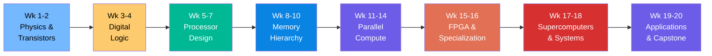
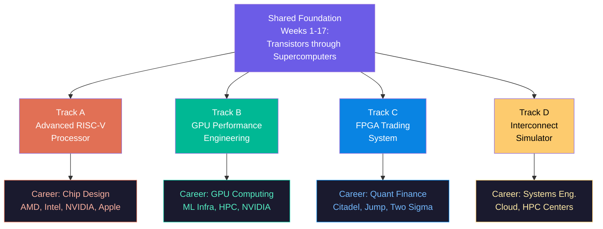

# Capstone Project Specification and Course Synthesis

This is the final lecture of CS 101: Fundamentals of Compute. We have spent twenty weeks building your understanding from the physics of semiconductors to the architecture of exascale supercomputers. This lecture has two purposes: to prepare you for the capstone project (Project 6) that will occupy your remaining weeks, and to synthesize the course into a coherent mental model that connects every topic we have covered.

## Project 6: Capstone Overview

The capstone project is a three-week effort (Weeks 18-20) worth 200 points. You choose one of four tracks, each extending a prior project to a level of sophistication that demonstrates mastery. Each track has weekly milestones graded pass/fail, a final implementation, a 4-6 page analysis report, and a 12-15 minute presentation with Q&A.

### Track A: Advanced RISC-V Processor

**Extends:** Project 2 (Pipelined RISC-V Processor Simulator)

Transform your in-order pipelined processor into an out-of-order superscalar machine. You will implement:

- **Tomasulo's algorithm** with at least 6 reservation stations (2 integer ALU, 2 memory, 1 multiply/divide, 1 branch)
- **Register renaming** via a Register Alias Table (RAT) that maps architectural registers to reservation station or ROB tags, eliminating WAR and WAW hazards
- **Common Data Bus (CDB)** broadcasting results to all waiting reservation stations and the ROB simultaneously
- **Reorder Buffer (ROB)** with at least 16 entries for in-order commit of out-of-order completions
- **Speculative execution** past unresolved branches with misprediction rollback (ROB flush, RAT restoration)
- **2-wide superscalar issue** with dependency checking and resource arbitration

**Milestones:** Week 18 -- Tomasulo with reservation stations and CDB. Week 19 -- ROB with speculative execution and misprediction recovery. Week 20 -- Superscalar issue, benchmark suite, performance analysis.

**Key metric:** Demonstrate IPC > 1.0 on at least one benchmark in superscalar mode. Compare in-order, OoO, and OoO+superscalar configurations with IPC breakdown.

**Choose this track if:** You loved the processor design lectures (Weeks 5-7), want to deeply understand out-of-order execution, and are comfortable with complex state machine logic.

### Track B: GPU Performance Engineering

**Extends:** Project 4 (GPU Simulator)

Select a compute-intensive algorithm -- FFT, Sparse Matrix-Vector Multiply, or N-body simulation -- and implement it on your GPU simulator. Then systematically optimize through at least 5 levels:

1. Naive baseline
2. Coalesced memory access
3. Shared memory tiling
4. Warp-level optimization (shuffles, warp reduction)
5. Thread coarsening (multiple elements per thread)

For each optimization, measure cycles, memory transactions, arithmetic intensity, and occupancy. Verify correctness against a CPU reference. Build a roofline model and plot each optimization level against the roofline ceiling.

**Milestones:** Week 18 -- CPU reference and naive GPU kernel with roofline model. Week 19 -- Optimizations 1-3 with measured speedups. Week 20 -- Optimizations 4-5, complete roofline analysis, final report.

**Key metric:** Achieve at least 5x speedup over naive baseline. Identify the bottleneck (compute-bound vs. memory-bound) at each level.

**Choose this track if:** You are fascinated by GPU architecture (Weeks 12-14), enjoy performance engineering, and want to develop the quantitative analysis skills that GPU computing professionals use daily.

### Track C: FPGA Trading System

**Extends:** Project 5 (FPGA Trading System Simulator)

Extend your single-symbol system into a multi-symbol exchange simulator with:

- Multi-symbol order book manager (5+ symbols with feed demultiplexing)
- Cross-symbol correlation signals (pairs trading based on spread deviation)
- Backtesting engine replaying 10,000+ historical events
- Trading metrics: P&L, Sharpe ratio, maximum drawdown, win rate, profit factor
- Pipeline stages for parallel symbol processing
- At least 2 trading strategies (momentum and mean-reversion)
- Risk management: position limits, exposure limits, circuit breakers

**Milestones:** Week 18 -- Multi-symbol order books with feed demux. Week 19 -- Backtesting engine with trading metrics and risk management. Week 20 -- Strategy comparison, final analysis report.

**Key metric:** Demonstrate measurable performance difference between momentum and mean-reversion strategies across the same backtest data. Report throughput and worst-case latency.

**Choose this track if:** Weeks 15-16 (FPGA) and Week 19 (quant finance) excited you, you want to understand trading system engineering, and you enjoy designing data-processing pipelines.

### Track D: Interconnect Simulator

**Extends:** Project 3 (Cache Simulator) and Week 17 (Interconnects)

Build a cycle-accurate network simulator that models the interconnect topologies we studied:

- Implement fat tree, dragonfly, and torus topologies with configurable parameters
- Model packet routing: minimal, non-minimal (Valiant), and adaptive (UGAL) for dragonfly
- Simulate MPI collective operations (Allreduce, Broadcast) using the algorithms from Week 17
- Measure bisection bandwidth, average latency, and throughput under synthetic traffic patterns (uniform random, nearest-neighbor, all-to-all)
- Model congestion: queue depths, back-pressure, and adaptive routing decisions

**Milestones:** Week 18 -- Fat tree and dragonfly topology generators with packet routing. Week 19 -- MPI collective simulation with ring and recursive-doubling allreduce. Week 20 -- Comparative analysis across topologies and traffic patterns.

**Key metric:** Verify that measured bisection bandwidth matches the theoretical formulas from lecture. Demonstrate that adaptive routing outperforms static routing under adversarial traffic.

**Choose this track if:** You found the interconnect topologies (Week 17) and MPI collectives mathematically elegant, enjoy graph algorithms and network simulation, and want to understand the infrastructure that makes supercomputing possible.

### Choosing Your Track

Consider three factors:

1. **Interest:** Pick the track that genuinely excites you. Three weeks of focused effort require sustained motivation.
2. **Strength:** Play to your strengths. If you excelled at the processor design projects, Track A leverages that foundation. If the GPU exercises were your best work, Track B is natural.
3. **Career relevance:** Track A is core computer architecture (chip design companies, CPU/GPU teams). Track B is performance engineering (HPC, ML infrastructure, GPU computing). Track C is financial technology (trading firms, fintech). Track D is systems engineering (cloud infrastructure, HPC centers, network hardware).

All four tracks are graded on the same rubric: design quality, implementation correctness, quantitative analysis, and presentation clarity. No track is "harder" or "easier" -- they are equally demanding in different dimensions.

<ConceptCheck id="cc-1" />

## Course Synthesis: The Full Stack

```mermaid
flowchart TD
  L7T["Layer 7: Applications & Systems (Weeks 17-19)"]
  L7D["Supercomputers, trading systems, distributed computing"]
  L6T["Layer 6: Specialized Compute (Weeks 15-16)"]
  L6D["FPGAs, ASICs, domain-specific accelerators"]
  L5T["Layer 5: Parallel Processors (Weeks 11-14)"]
  L5D["SIMD, multicore, GPU/SIMT, thread-level parallelism"]
  L4T["Layer 4: Memory Hierarchy (Weeks 8-10)"]
  L4D["Caches, virtual memory, DRAM, HBM"]
  L3T["Layer 3: Processor Architecture (Weeks 5-7)"]
  L3D["Pipelining, hazards, out-of-order execution, branch prediction"]
  L2T["Layer 2: Digital Logic (Weeks 3-4)"]
  L2D["Boolean algebra, gates, adders, ALUs, sequential circuits"]
  L1T["Layer 1: Physics & Transistors (Weeks 1-2)"]
  L1D["Semiconductor physics, MOSFETs, FinFETs, fabrication"]

  L7T --> L7D --> L6T --> L6D --> L5T --> L5D --> L4T --> L4D --> L3T --> L3D --> L2T --> L2D --> L1T --> L1D

  style L7T fill:#e17055,color:#fff
  style L6T fill:#d63031,color:#fff
  style L5T fill:#6c5ce7,color:#fff
  style L4T fill:#0984e3,color:#fff
  style L3T fill:#00b894,color:#fff
  style L2T fill:#fdcb6e,color:#000
  style L1T fill:#74b9ff,color:#000
  style L7D fill:#1a1a2e,color:#fab1a0,stroke:#e17055
  style L6D fill:#1a1a2e,color:#ff7675,stroke:#d63031
  style L5D fill:#1a1a2e,color:#a29bfe,stroke:#6c5ce7
  style L4D fill:#1a1a2e,color:#74b9ff,stroke:#0984e3
  style L3D fill:#1a1a2e,color:#55efc4,stroke:#00b894
  style L2D fill:#1a1a2e,color:#ffeaa7,stroke:#fdcb6e
  style L1D fill:#1a1a2e,color:#74b9ff,stroke:#74b9ff
```

Let us now trace a single computation -- pricing a stock option in an HFT trading system -- through every layer of the compute stack we have studied. This exercise demonstrates how the entire course connects.

### Layer 1: Physics to Transistors (Weeks 1-2)

The FPGA that processes market data is fabricated in TSMC 7nm technology. Each transistor in the FPGA's logic cells is a FinFET: a 3D transistor where the gate wraps around three sides of a silicon fin, providing electrostatic control at the 7nm scale. The threshold voltage $V_{th}$ determines the switching point; the subthreshold slope determines leakage current. At 7nm, leakage power is 30-40% of total power, which is why the Versal VC1902 operates at moderate voltage (~0.8V) and frequency (~250-500 MHz for fabric logic).

### Layer 2: Gates to Circuits (Weeks 3-4)

The FPGA's programmable logic cells contain Look-Up Tables (LUTs) -- small SRAM-based truth tables that implement arbitrary Boolean functions. The Versal VC1902 has 899,840 LUTs. Each LUT is a 6-input, 1-output truth table stored in 64 bits of SRAM. By programming these truth tables and the routing interconnect between them, we implement the combinational and sequential logic of our trading system.

### Layer 3: Processors and Pipelining (Weeks 5-7)

The Versal also contains two ARM Cortex-A72 general-purpose cores for running control software (configuration, monitoring, error handling). These cores use the pipeline and out-of-order execution techniques we studied: 15+ stage pipelines, register renaming, branch prediction. But the critical trading logic runs in the FPGA fabric, not on these cores, because we need deterministic latency that software cannot provide.

### Layer 4: Memory Hierarchy (Weeks 8-10)

The FPGA's order book uses Block RAM (BRAM) -- on-chip SRAM with single-cycle access (~2 ns). The Versal VC1902 has 34 Mb of BRAM. We store the top-of-book (best bid and ask) in registers (zero latency) and deeper book levels in BRAM. If we needed to access external DRAM (~50-100 ns latency), the entire pipeline budget would be consumed by a single memory access. The cache hierarchy concepts from Week 8 explain why: SRAM (BRAM) is our L1, on-chip UltraRAM (130 Mb) is our L2, and external DDR/HBM is our L3. We design the trading pipeline to keep all latency-critical data in the fastest memory tier.

### Layer 5: Parallelism (Weeks 11-14)

The FPGA implements parallelism at multiple levels:
- **Pipeline parallelism:** Multiple packets flow through different stages simultaneously. While one packet is parsed, the previous packet's order book update is in progress, and the one before that is generating signals. This is the same concept as a CPU pipeline, but with custom stage widths.
- **Data parallelism:** Multiple order books (one per symbol) are processed in parallel across independent FPGA pipeline instances. This is analogous to GPU SIMT -- the same processing logic replicated across data elements.
- **Spatial parallelism:** Unlike a CPU or GPU where parallelism is temporal (time-multiplexed on shared hardware), FPGA parallelism is spatial -- each pipeline instance is physically separate hardware. There is no context switching, no scheduling overhead, and no resource contention.

### Layer 6: Special-Purpose Compute (Weeks 15-16)

The entire trading pipeline -- network receive, protocol decode, order book update, signal generation, risk check, order formatting, network transmit -- is a custom FPGA circuit optimized for this specific workload. We traded development time (months of HDL/HLS engineering) for execution performance (sub-microsecond latency). This is the specialization principle: domain-specific hardware beats general-purpose by 10-1000x because it eliminates the overhead of generality. IMC Trading's engineers spend "two to three hours of compilation time" per design change, but the result processes market data at wire speed.

### Layer 7: Systems at Scale (Weeks 17-19)

The FPGA sits in a colocation facility at the exchange (NYSE Mahwah, CME Aurora). It connects to the exchange's matching engine via equalized cross-connect fiber cables. For cross-exchange trading, microwave links connect Aurora to New Jersey at ~3.9 ms one-way, beating fiber's ~6.5 ms by exploiting the refractive index difference. The firm's risk engine runs on GPU clusters (Monte Carlo VaR) connected via the same HPE Slingshot dragonfly topology used in Frontier. The entire system is a computing stack that spans transistors to transcontinental networks.

<ConceptCheck id="cc-2" />

## Key Themes Revisited

### The Memory Wall: The Central Challenge

The gap between processor speed and memory speed has shaped every architectural decision in this course:

- **Caches** exploit temporal and spatial locality to keep data close to computation (Week 8)
- **Out-of-order execution** tolerates memory latency by computing other instructions while waiting (Week 7)
- **Prefetching** predicts future accesses and fetches data before it is needed (Week 10)
- **HBM** increases bandwidth by stacking DRAM dies with wide interfaces (Week 14)
- **FPGA BRAM** eliminates the memory wall for small working sets by using on-chip SRAM (Week 15)
- **PIM** eliminates data movement by computing inside the memory (Week 20)

The AMAT (Average Memory Access Time) formula from Week 8 captures this:

$$AMAT = HitTime + MissRate \times MissPenalty$$

Every architectural innovation either reduces the miss rate (better caches, prefetching), reduces the miss penalty (HBM, non-blocking caches), or reduces the hit time (SRAM, register files).

### Parallelism: The Path Forward

Since Dennard scaling ended (~2006), performance scaling has come entirely from parallelism:

| Parallelism Level | Mechanism | Week | Typical Speedup |
|---|---|---|---|
| Instruction-level (ILP) | Pipelining, superscalar | 6-7 | 2-4x |
| Data-level (DLP) | SIMD, GPU SIMT | 11-14 | 10-1000x |
| Thread-level (TLP) | Multicore, SMT | 11 | $n$-core scaling |
| Request-level | Distributed systems | 17-18 | Near-linear to $N$ nodes |
| Spatial | FPGA, ASIC | 15-16 | Custom-circuit speedup |

Amdahl's Law provides the sobering constraint:

$$Speedup = \frac{1}{(1 - f) + f/P}$$

Even with infinite parallelism ($P \to \infty$), the maximum speedup is $1/(1-f)$. If 5% of your program is sequential, the maximum speedup is 20x regardless of how many processors you add. This is why algorithm design (reducing the sequential fraction) matters as much as hardware (increasing parallelism).

### Specialization: General-Purpose is Not Enough

The trajectory from general-purpose to specialized hardware is the dominant trend in computer architecture:

- **CPU:** General-purpose, programmable in any language, but limited by instruction decode overhead, branch prediction, and cache management. 1x baseline performance.
- **GPU:** Specialized for data-parallel computation. Eliminates branch prediction and complex OoO logic. 10-1000x for parallel workloads. Still programmable (CUDA).
- **FPGA:** Specialized for custom pipelines. Eliminates instruction decode entirely. 10-100x lower latency. Programmable but slow to develop (HDL/HLS).
- **ASIC (TPU, etc.):** Specialized for one workload. Eliminates all generality overhead. 10-100x better TOPS/W. Fixed function.

Google's TPU v4 systolic array computes 128x128 multiply-accumulate operations per cycle -- 16,384 MACs in a single cycle. A CPU would need 16,384 separate multiply and add instructions. The TPU achieves this by eliminating everything a general-purpose processor needs (instruction fetch, decode, branch prediction, register file, OoO logic) and dedicating the entire die to matrix computation.

### The Tradeoff Space

Every design decision is a point in a multi-dimensional tradeoff space:

**Latency vs. Throughput:** A deeper pipeline increases throughput (more instructions in flight) but does not reduce latency (each instruction still takes many cycles). The FPGA Black-Scholes pipeline from Week 19 makes this vivid: 208-cycle latency, but 1-cycle throughput (II=1).

**Power vs. Performance:** Dynamic power scales as $P = \alpha C V^2 f$. Since voltage and frequency are coupled ($f \propto V$), power scales roughly as $V^3$. A 10% frequency increase costs ~15-20% more power. This cubic relationship explains why we cannot simply clock processors faster.

**Cost vs. Flexibility:** An ASIC at 7nm costs \$217-249M in NRE (non-recurring engineering). An FPGA costs \$0 NRE but 20-80% worse performance than an equivalent ASIC. The breakeven volume is ~400K units. Trading firms use FPGAs (not ASICs) because trading strategies change and volumes are low.

**Capacity vs. Speed:** SRAM (fast, expensive, small) vs. DRAM (slow, cheap, large) vs. HBM (fast, expensive, medium). The Cerebras WSE-3 pushes this to the extreme: 44 GB of on-chip SRAM at 21 PB/s bandwidth, but only 44 GB total. An NVIDIA H100 has 80 GB HBM at 3.35 TB/s. The WSE wins on bandwidth by 7,000x but loses on capacity by nearly 2x.

<ConceptCheck id="cc-3" />

## What to Study Next

This course gave you the foundations. Here is where to go deeper:

### Computer Architecture Research
- **Conferences:** ISCA (International Symposium on Computer Architecture), MICRO (International Symposium on Microarchitecture), HPCA (High Performance Computer Architecture)
- **Textbook:** Patterson and Hennessy, *Computer Architecture: A Quantitative Approach* (6th edition). The quantitative methodology from this book is the gold standard.
- **Topics:** Branch prediction (TAGE, perceptron), cache replacement (LRU variants, Hawkeye), prefetching (SMS, VLDP), memory consistency models

### Systems Programming
- **Linux kernel:** Understanding the scheduler, virtual memory system, device drivers, and network stack connects architecture to software
- **Networking:** DPDK, io_uring, RDMA -- the user-space networking technologies we studied in Week 19
- **Storage:** NVMe, computational storage, persistent memory (Intel Optane was discontinued but the concepts persist)

### GPU/CUDA Programming
- **NVIDIA documentation:** The CUDA C++ Programming Guide is the definitive reference
- **Courses:** Georgia Tech CS 4803/8803 (GPU Architecture), UIUC ECE 408 (Applied Parallel Programming)
- **Practice:** Optimize real workloads -- matrix multiply, convolution, sorting -- and measure against theoretical peak

### FPGA and Hardware Design
- **Languages:** Verilog, SystemVerilog for RTL; HLS C++ for high-level synthesis
- **Tools:** AMD Vivado, Intel Quartus, open-source Yosys + nextpnr
- **Projects:** Build a RISC-V soft processor, implement a CNN accelerator, design a network packet processor

### Quantum Computing
- **Frameworks:** Qiskit (IBM), Cirq (Google), PennyLane (Xanadu)
- **Textbook:** Nielsen and Chuang, *Quantum Computation and Quantum Information*
- **Topics:** Quantum error correction, variational quantum algorithms, quantum machine learning

## Career Paths

The knowledge from this course opens several career directions:

| Path | Companies | Core Skills |
|---|---|---|
| Chip design | AMD, Intel, NVIDIA, Apple, Qualcomm | RTL design, verification, physical design |
| Systems architecture | Google, Meta, Microsoft, Amazon | Workload analysis, system design, benchmarking |
| GPU computing | NVIDIA, AMD, ML infrastructure teams | CUDA optimization, kernel engineering |
| FPGA engineering | Trading firms (IMC, Citadel, Jump), defense | Verilog/VHDL, HLS, timing closure |
| Quantitative trading | Citadel, Two Sigma, Jane Street, HRT | Low-latency systems, financial modeling |
| HPC/scientific computing | National labs (ORNL, LLNL, ANL), pharma | MPI, parallel algorithms, performance engineering |

## Final Remarks

You now understand computing from the bottom up. You know why a transistor switches, how a pipeline hazard is resolved, why cache misses matter, how a GPU achieves massive parallelism, why FPGAs beat CPUs for deterministic latency, how supercomputer interconnects route traffic, and how trading firms push hardware to its physical limits. This knowledge is foundational -- it changes how you think about every piece of software you write, because you understand what the hardware is actually doing.

The capstone project is your opportunity to demonstrate that understanding. Choose a track, build something real, analyze it rigorously, and present it with confidence. Good luck.
